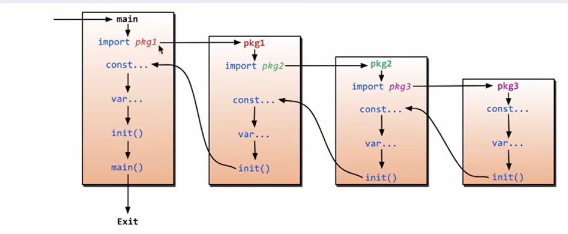
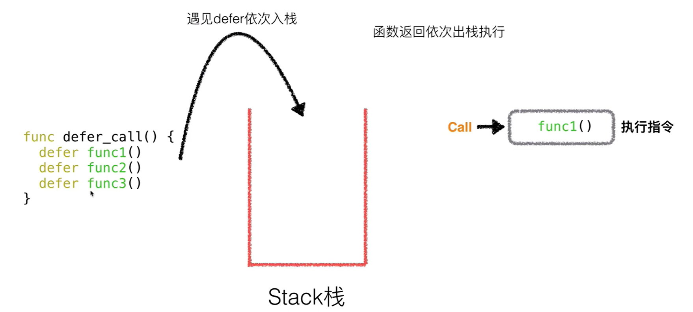

> 以下内容是基于 “大模型生成 + 刘丹冰大佬的拓扑图” 整理而成。


# 环境配置

安装Golang：

- 下载安装包，并执行安装
- 配置环境变量，结束


IDE选择：

- VSCode
- JetBrains的GoLang
- VIM
- Claude Code


Golang的优势：

- 极简单的部署方式
- 静态类型语言
- 语言层面的并发
- 强大的标准库


第一个golang程序即其注意点：

```go
package main

//import "fmt"
//import "time"
//建议用括号写import
import (
	"fmt"
	"time"
)

func main() {  // “{” 必须与 “函数名()” 同行
	fmt.Println("hello world") // 可以不加分号
	time.Sleep(1 * time.Second)
	fmt.Println("hello world2")
}

```


# golang基础

## 基础语法

### 变量声明 var

var - 变量声明

- 局部变量：四种变量声明方法
- 全局变量：方法四不支持全局
- 多变量：单行写法、多行写法


### 常量 const

`const` 用于定义常量，它代表一个不可变的值，在程序编译时就已经确定。

`iota` 是 Go 语言中一个预声明的**常量生成器**，它用于创建一系列递增的、相关的常量，尤其在定义枚举类型时非常有用。

**注意事项：**

- **重置时机：** `iota` 的值在每次遇到 `const` 关键字时都会被重置为 `0`。
- **`_` 空白标识符：** 经常使用 `_` 来跳过 `iota` 的某些值，这是一种常见的编程技巧。
- **不限于整数：** 尽管 `iota` 的值是整数，但它可以用于创建各种类型的常量，比如字符串。


示例代码：

```go
package main

import "fmt"

// 使用 const 定义包级别的常量
const (
    // 基础常量定义
    Language = "Go"
    Year     = 2024
)

// 使用 iota 定义一组与星期相关的常量
const (
    Sunday = iota // Sunday = 0
    Monday        // Monday = 1
    Tuesday       // Tuesday = 2
    Wednesday     // Wednesday = 3
    Thursday      // Thursday = 4
    Friday        // Friday = 5
    Saturday      // Saturday = 6
)

// 使用 iota 和表达式定义文件大小常量
const (
    // 使用 _ 跳过 iota 的初始值 0，使 KB 的值从 1 << 10 开始
    _ = iota
    KB = 1 << (10 * iota) // iota = 1, KB = 1 << 10 = 1024
    MB = 1 << (10 * iota) // iota = 2, MB = 1 << 20 = 1048576
    GB = 1 << (10 * iota) // iota = 3, GB = 1 << 30
    TB = 1 << (10 * iota) // iota = 4, TB = 1 << 40
)

// 另一种使用 iota 的例子
const (
    A = iota * 10 // A = 0 * 10 = 0
    B             // B = 1 * 10 = 10
    C             // C = 2 * 10 = 20
)

func main() {
    // 访问基本常量
    fmt.Println("--- 基本常量 ---")
    fmt.Printf("编程语言: %s, 当前年份: %d\n", Language, Year)

    // 访问 iota 定义的星期常量
    fmt.Println("\n--- iota 星期常量 ---")
    fmt.Printf("Sunday 的值: %d\n", Sunday)
    fmt.Printf("Monday 的值: %d\n", Monday)
    fmt.Printf("Saturday 的值: %d\n", Saturday)

    // 访问 iota 和表达式定义的文件大小常量
    fmt.Println("\n--- iota 文件大小常量 ---")
    fmt.Printf("KB 的值: %d\n", KB)
    fmt.Printf("MB 的值: %d\n", MB)
    fmt.Printf("GB 的值: %d\n", GB)
    fmt.Printf("TB 的值: %d\n", TB)

    // 访问另一个 iota 例子
    fmt.Println("\n--- iota 表达式常量 ---")
    fmt.Printf("A 的值: %d\n", A)
    fmt.Printf("B 的值: %d\n", B)
    fmt.Printf("C 的值: %d\n", C)
}
```

示例输出：

```go
--- 基本常量 ---
编程语言: Go, 当前年份: 2024

--- iota 星期常量 ---
Sunday 的值: 0
Monday 的值: 1
Saturday 的值: 6

--- iota 文件大小常量 ---
KB 的值: 1024
MB 的值: 1048576
GB 的值: 1073741824
TB 的值: 1099511627776

--- iota 表达式常量 ---
A 的值: 0
B 的值: 10
C 的值: 20
```


### 返回值 return

| 方式           | 语法                      | 优点                               | 典型应用场景                           |
| -------------- | ------------------------- | ---------------------------------- | -------------------------------------- |
| **单个返回值** | `func foo() int`          | 最简单，易于理解                   | 简单函数，如数学运算                   |
| **多返回值**   | `func foo() (int, error)` | 强大、灵活                         | 错误处理，函数结果和状态返回           |
| **命名返回值** | `func foo() (a, b int)`   | 代码自文档化，可省略 `return` 参数 | 函数返回值多且需要清晰命名时           |
| **忽略返回值** | `_, value := foo()`       | 只获取需要的值，避免编译器报错     | 函数返回多个值，但你只需要其中一部分时 |

示例代码：

```go
package main

import (
    "errors"
    "fmt"
)

func add(a int, b int) int {
    return a + b
}

// 多返回值函数： 比如，一个返回结果和一个错误的多返回值函数
func divide(a, b float64) (float64, error) {
    if b == 0 {
        // 如果除数为 0，返回 0 和一个错误
        return 0, errors.New("除数不能为0")
    }
    // 否则，返回计算结果和 nil（表示没有错误）
    return a / b, nil
}

// 命名返回值
func rectangleInfo(length, width int) (area int, perimeter int) {
    area = length * width
    perimeter = 2 * (length + width)
    // 直接使用 return 即可，会自动返回 area 和 perimeter 的值
    return
}

// 忽略返回值
func getFullName() (string, string) {
    return "John", "Doe"
}

func main() {
	// 单返回值函数
    fmt.Println("#####单返回值函数#####")
    a, b := 10, 20
    fmt.Println(add(a, b))

    // 多返回值函数
    fmt.Println("#####多返回值函数#####")
    result, err := divide(10, 2)
    if err != nil {
        fmt.Println("发生错误:", err)
    } else {
        fmt.Println("结果:", result)
    }

    result, err = divide(10, 0)
    if err != nil {
        fmt.Println("发生错误:", err)
    }

    // 命名返回值
    fmt.Println("#####命名返回值#####")
	a, p := rectangleInfo(10, 5)
    fmt.Printf("面积: %d, 周长: %d\n", a, p)

    // 忽略返回值
    fmt.Println("#####忽略返回值#####")
	// 只需要姓，忽略名
    firstName, _ := getFullName()
    fmt.Println("姓:", firstName)

    // 只需要名，忽略姓
    _, lastName := getFullName()
    fmt.Println("名:", lastName)
}
```

示例结果：

```go
#####单返回值函数#####
30
#####多返回值函数#####
结果: 5
发生错误: 除数不能为0
#####命名返回值#####
面积: 50, 周长: 30
#####忽略返回值#####
姓: John
名: Doe
```


### import 与 init

#### 快速上手

参考下图，import导入对应包，并自动执行init函数



文件树：

```go
04import
├── main.go
└── my_package
    ├── config.go
    └── utils.go
```

示例代码 - main.go：

```go
package main

import (
    "fmt"
    // 导入 my_package，这将触发其内部所有 init 函数的执行
    "04import/my_package" 
)

var mainVar = "主包的变量"

func init() {
    fmt.Println("main.go 的 init 函数被调用了")
}

func main() {
    fmt.Println("main 函数开始执行")
    my_package.SayHello()
    fmt.Printf("从 my_package 导入的配置是: %s\n", my_package.Config)
}
```

示例代码 - my_package/config.go：

```go
package my_package

import "fmt"

var Config string

func init() {
    fmt.Println("my_package/config.go 的 init 函数被调用了")
    Config = "这是配置文件"
}

func init() {
    fmt.Println("my_package/config.go 的另一个 init 函数被调用了")
}
```

示例代码 - my_package/utils.go：

```go
package my_package

import "fmt"

func init() {
    fmt.Println("my_package/utils.go 的 init 函数被调用了")
}

func SayHello() {
    fmt.Println("Hello from my_package!")
}
```

示例结果：

```go
my_package/config.go 的 init 函数被调用了
my_package/config.go 的另一个 init 函数被调用了
my_package/utils.go 的 init 函数被调用了
main.go 的 init 函数被调用了
main 函数开始执行
Hello from my_package!
从 my_package 导入的配置是: 这是配置文件
```

如果出现：

```go
go: warning: ignoring go.mod in $GOPATH D:\Learn\Golang\StudyGolang
main.go:6:5: package 04import/my_package is not in std (C:\Program Files\Go\src\04import\my_package)
```

错误分析：

1. **`go: warning: ignoring go.mod in $GOPATH`**
   - 这个警告告诉你，你的项目路径 `D:\Learn\Golang\StudyGolang` 处于 Go 语言的旧工作区模式 (`$GOPATH`) 中。
   - 在 `$GOPATH` 模式下，Go 语言不推荐使用 `go.mod` 文件来管理依赖。当它检测到 `go.mod` 文件时，会发出警告并选择忽略它。
2. **`package 04import/my_package is not in std`**
   - 由于 Go 忽略了 `go.mod`，它会退回到旧的 `$GOPATH` 模式来寻找你的包。
   - 在 `$GOPATH` 模式下，Go 默认只会在标准库 (`std`) 和 `$GOPATH/src` 目录下寻找包。
   - 你的项目包 `04import/my_package` 不在标准库路径下，也不在 `$GOPATH/src` 目录下，所以 Go 找不到它，导致编译失败。

解决方法：

```go
go mod init 04import
```


#### 匿名及别名导包方式

匿名导包的**唯一目的**是执行被导入包的 `init` 函数，而**不使用**该包中的任何函数、变量或类型。

这是因为 Go 语言编译器有一个规则：如果一个包被导入了，但没有被使用（即没有调用它的任何导出成员），编译器就会报错。而 `_` 告诉编译器：“我确实导入了这个包，但只是为了运行它的 `init` 函数，请不要报错。”

例如：`import _ "fmt"`


别名导包指的是给导入的包起一个自定义的别名，例如：`import f "fmt"`、`import . "fmt"`


### 指针

简单来说，指针是一个**变量，其值为另一个变量的内存地址**。

- `&` (取地址符): 用于获取一个变量的内存地址。
- `*` (指针解引用符): 用于访问指针指向的变量的值。

让我们通过一个简单的例子来理解这两个符号：

```go
package main

import "fmt"

func main() {
    // 声明一个整型变量
    var a int = 10

    // 使用 & 符号获取变量 a 的内存地址，并将其赋值给指针变量 p
    // 这里的 *int 表示 p 是一个指向 int 类型变量的指针
    var p *int = &a 

    fmt.Printf("变量 a 的值: %d\n", a)
    fmt.Printf("变量 a 的地址: %p\n", &a)
    fmt.Printf("指针 p 的值 (也就是 a 的地址): %p\n", p)
    
    // 使用 * 符号解引用指针 p，获取其指向的变量的值
    fmt.Printf("解引用指针 p 得到的值: %d\n", *p)
}
```

运行这段代码，你会看到 `a` 的地址和 `p` 的值是一样的，而 `*p` 的值和 `a` 的值是一样的。


理解了指针的基本概念后，我们来看看它在 Go 语言中的主要作用。

#### 1. 修改函数外部的变量

在 Go 语言中，函数参数默认是**值传递**（pass by value）。这意味着当一个变量作为参数传递给函数时，函数会得到该变量的一个**副本**。对副本的任何修改都不会影响到原始变量。

但如果你想在函数内部修改原始变量，就需要使用指针。将变量的地址传递给函数，函数通过指针操作原始数据，而不是副本。

```go
package main

import "fmt"

// passByValue 接收一个整型值
func passByValue(x int) {
    x = x * 10
}

// passByPointer 接收一个整型指针
func passByPointer(x *int) {
    // 使用 *x 解引用指针，修改原始变量的值
    *x = *x * 10
}

func main() {
    num := 5
    fmt.Printf("修改前: %d\n", num) // 输出: 5

    passByValue(num)
    fmt.Printf("值传递后: %d\n", num) // 输出: 5, num 的值未改变

    passByPointer(&num) // 传递 num 的地址
    fmt.Printf("指针传递后: %d\n", num) // 输出: 50, num 的值被改变
}
```

**总结：** 当函数需要修改传入的参数时，使用指针传递。这对于修改结构体、数组等复合类型尤其重要。


#### 2. 避免大数据的复制

如果你有一个非常大的结构体或者数组作为函数参数，值传递会创建整个数据的副本，这会消耗大量的内存和 CPU 资源，影响性能。

使用指针传递可以避免这种不必要的复制，因为你只传递了数据的一个内存地址（通常是 8 字节），而不是整个数据块。

Go

```go
package main

import "fmt"

// 假设有一个很大的结构体
type BigStruct struct {
    data [1000]int
}

// 值传递: 复制整个 BigStruct
func processByValue(s BigStruct) {
    // ...
}

// 指针传递: 只复制一个指针
func processByPointer(s *BigStruct) {
    // ...
}

func main() {
    myStruct := BigStruct{}
    
    // 使用指针传递，性能更好
    processByPointer(&myStruct) 
}
```

**总结：** 对于大型数据结构，如大型结构体或数组，使用指针传递可以显著提高程序性能。


#### 3. 与 `new` 函数配合

Go 语言提供了一个内置函数 `new`，用于为**指定类型**的变量分配内存并返回该变量的指针。

- `new(T)` 会分配一块内存用于存储一个 `T` 类型的值，并返回该内存的地址（一个 `*T` 类型的指针）。
- 该内存会被自动初始化为该类型的**零值**。

```go
package main

import "fmt"

func main() {
    // 使用 new 创建一个 int 类型的指针
    p := new(int) // p 是一个 *int 类型的指针

    fmt.Printf("指针 p 的值: %p\n", p)
    fmt.Printf("解引用 p 得到的值 (零值): %d\n", *p)

    *p = 100 // 通过指针修改值

    fmt.Printf("修改后，解引用 p 得到的值: %d\n", *p)
}
```

**注意：** Go 语言的垃圾回收机制会自动处理内存的分配和释放，你不需要像 C/C++ 那样使用 `free` 或 `delete`。

#### 指针的特殊情况和注意事项

- **空指针 `nil`**: 和其他语言一样，Go 指针的零值是 `nil`，表示不指向任何有效的内存地址。在使用指针前，最好检查它是否为 `nil`，以避免空指针解引用错误。

- **切片、映射和通道**: 切片（slice）、映射（map）和通道（channel）本身就是引用类型（reference types），它们内部包含了指向底层数据结构的指针。因此，在函数间传递切片、映射或通道时，实际上是在传递对底层数据的引用，不需要额外使用指针。

  ```go
  package main
  
  import "fmt"
  
  func modifySlice(s []int) {
      s[0] = 99
  }
  
  func main() {
      mySlice := []int{1, 2, 3}
      modifySlice(mySlice)
      fmt.Println(mySlice) // 输出: [99 2 3], 原始切片被修改
  }
  ```

  可以看到，即使没有显式使用指针，切片的值仍然被修改了。这是因为切片本身就是对底层数组的引用。


### 推迟语句 defer




`defer` 语句用于推迟一个函数或方法的执行，直到包含它的函数（`main` 函数或普通函数）即将返回时才执行。无论该函数是正常返回、还是因为 `panic` 异常而中断，被 `defer` 推迟的语句都会被执行。

这个特性使得 `defer` 非常适合用于资源清理工作，例如：

- 关闭文件句柄
- 释放数据库连接
- 解锁互斥锁（Mutex）
- 关闭 `channel`


#### `defer` 的执行顺序

如果一个函数中存在多个 `defer` 语句，它们的执行顺序遵循**“后进先出”（LIFO）**的原则。也就是说，最后被 `defer` 的语句会最先执行。

我们可以通过一个简单的例子来验证这一点：

```go
package main

import "fmt"

func main() {
    fmt.Println("开始执行 main 函数")

    defer fmt.Println("第一个 defer")
    defer fmt.Println("第二个 defer")
    defer fmt.Println("第三个 defer")

    fmt.Println("main 函数即将返回")
}
```

运行这段代码，你会看到这样的输出：

```go
开始执行 main 函数
main 函数即将返回
第三个 defer
第二个 defer
第一个 defer
```

这证明了 `defer` 语句的执行顺序是倒序的。


#### `defer` 与参数

`defer` 语句**在注册时**就会对它所引用的函数参数进行求值，而不是在执行时。这意味着，`defer` 后面函数所使用的变量值，是 `defer` 语句被声明那一刻的值。

```go
package main

import "fmt"

func main() {
    a := 1
    b := 2
    
    // defer 在这里被注册，参数 a 和 b 的值在此时就被确定为 1 和 2
    defer fmt.Printf("在 defer 中，a = %d, b = %d\n", a, b)
    
    // 改变 a 和 b 的值
    a = 10
    b = 20
    
    fmt.Println("main 函数中的 a 和 b 的值被改变了")
}
```

运行这段代码，输出如下：

```go
main 函数中的 a 和 b 的值被改变了
在 defer 中，a = 1, b = 2
```

这个特性非常重要，如果你想在 `defer` 中使用**修改后**的变量，你需要通过**指针**的方式传递。

```go
package main

import "fmt"

func main() {
    a := 1
    
    // 传递 a 的地址
    defer func(x *int) {
        fmt.Printf("defer 中 a 的值 = %d\n", *x)
    }(&a)
    
    a = 10
    fmt.Println("a 的值被改变了")
}
```

运行代码，输出为：

```go
a 的值被改变了
defer 中 a 的值 = 10
```


#### `defer` 的实际应用

`defer` 最常见的用法是简化资源清理代码，保证资源一定会被释放。

##### 1. 关闭文件

```go
package main

import (
    "fmt"
    "os"
)

func main() {
    file, err := os.Open("test.txt")
    if err != nil {
        fmt.Println("打开文件失败:", err)
        return
    }
    // 立即注册一个 defer 语句，确保函数返回时文件会被关闭
    // 这避免了在每个 return 语句前都手动添加 file.Close()
    defer file.Close() 

    // ... 处理文件内容 ...
    fmt.Println("文件已打开，正在处理内容...")
}
```


##### 2. 互斥锁解锁

在并发编程中，`defer` 也是确保锁被正确释放的关键。

```go
package main

import (
    "fmt"
    "sync"
)

var (
    mu    sync.Mutex
    count int
)

func increment() {
    mu.Lock()
    // 确保函数返回时，锁会被释放
    defer mu.Unlock() 
    
    count++
    fmt.Println("计数器增加到:", count)
}

func main() {
    // 启动多个 goroutine 来增加计数器
    for i := 0; i < 5; i++ {
        go increment()
    }
    
    // 为了让主程序等待 goroutine 完成，这里使用简单的睡眠
    // 实际项目中应使用 sync.WaitGroup
    // time.Sleep(time.Second) 
}
```

**注意：** 在 Go 语言中，`defer` 语句是在函数返回前执行的，因此在 `for` 循环中使用 `defer` 要特别小心。如果 `defer` 语句在一个大循环中，它会创建大量的推迟任务，直到循环所在的函数退出时才执行，这可能导致内存或资源泄漏。通常，一个在循环中打开的资源应该在循环内部被关闭。


defer和return谁先谁后：

```go
package main

import "fmt"

func deferFunc() int {
	fmt.Println("This is a defer function")
	return 0
}

func returnFunc() int {
	fmt.Println("This is a return function")
	return 0
}

func returnFuncWithDefer() int {
    defer deferFunc()
	return returnFunc()
}

func main() {
	defer fmt.Println("Hello World") //defer will be executed after main function is finished
	returnFuncWithDefer()
}

```

示例输出：

```go
This is a return function
This is a defer function
Hello World
```


### 切片 slice

数组与动态数组：

- 数组（Array）：数组是 Go 语言中最基础的复合数据类型，它是一组**同类型**数据的集合，并且**长度是固定的**。数组的长度在声明时就确定了，之后不能改变。
- 动态数组 (Slice)：**切片（Slice）是 Go 语言中最常用的数据结构，它提供了比数组更灵活的功能。切片是基于数组实现的，它代表了对一个数组的一段连续区域的引用**。


切片可以看作是一个包含三个字段的结构体：

- **指针（Pointer）**：指向底层数组的第一个元素。
- **长度（Length）**：切片中元素的个数。
- **容量（Capacity）**：从切片的第一个元素到底层数组的最后一个元素的个数。


声明与初始化

1. **从现有数组或切片创建**：通过切片操作符 `[low:high]` 创建。

   ```go
   arr := [6]int{10, 20, 30, 40, 50, 60}
   s := arr[1:4] // s 是 arr 的一个切片，包含 arr[1]、arr[2]、arr[3]
   // s 的值是 [20, 30, 40]，长度为 3，容量为 5
   ```

2. **使用 `make()` 函数创建**：这是创建切片最常用的方式。`make` 函数会创建一个底层数组并返回一个引用该数组的切片。

   ```go
   // 创建一个长度为 5，容量为 10 的切片
   s := make([]int, 5, 10) 
   ```

3. **字面量方式**：直接用大括号 `{}` 初始化。

   ```go
   s := []int{1, 2, 3} // 创建一个包含 1, 2, 3 的切片，长度和容量都是 3
   ```


关键特性与操作

- **可变长度**：切片是动态的。可以使用 `append()` 函数向切片中添加元素，如果容量不足，Go 会自动分配一个更大的底层数组，并复制旧元素。

  ```go
  s := []int{1, 2, 3}
  s = append(s, 4, 5) // s 的值变为 [1 2 3 4 5]
  ```

- **引用类型**：切片是**引用类型**。当将一个切片作为参数传递给函数时，传递的是一个指向底层数组的指针。因此，在函数内部对切片元素的修改会影响到原始切片。

  ```go
  func modifySlice(s []int) {
      s[0] = 999
  }
  
  func main() {
      mySlice := []int{1, 2, 3}
      modifySlice(mySlice)
      fmt.Println(mySlice) // 输出: [999 2 3], 原始切片被修改
  }
  ```

- **`len()` 和 `cap()`**：

  - `len(s)`：返回切片的当前长度。
  - `cap(s)`：返回切片的容量。


完整示例代码：

```go
package main

import "fmt"

func main() {
    // --- 数组 (Array) ---
    fmt.Println("--- 数组 ---")
    var arr [3]int // 声明一个长度为 3 的整型数组
    arr[0] = 10
    arr[1] = 20
    arr[2] = 30
    fmt.Println("数组 arr:", arr)

    // 数组作为参数，传递副本
    // 在 modifyArray 函数中对 arr 的修改不会影响到 main 函数中的 arr
    modifyArray(arr)
    fmt.Println("函数调用后，数组 arr:", arr) 

    // --- 切片 (Slice) ---
    fmt.Println("\n--- 切片 ---")
    // 使用字面量创建切片
    s1 := []int{100, 200}
    fmt.Println("切片 s1:", s1, "长度:", len(s1), "容量:", cap(s1))

    // 使用 make() 创建切片
    s2 := make([]int, 2, 5) // 长度 2，容量 5
    s2[0] = 10
    s2[1] = 20
    fmt.Println("切片 s2:", s2, "长度:", len(s2), "容量:", cap(s2))

    // 使用 append() 动态添加元素
    s2 = append(s2, 30, 40, 50)
    fmt.Println("append() 后，切片 s2:", s2, "长度:", len(s2), "容量:", cap(s2))

    // 切片作为参数，传递引用
    // 在 modifySlice 函数中对 s2 的修改会影响到 main 函数中的 s2
    modifySlice(s2)
    fmt.Println("函数调用后，切片 s2:", s2)
}

// 数组传值
func modifyArray(arr [3]int) {
    arr[0] = 999
    fmt.Println("在 modifyArray 函数中，arr:", arr)
}

// 切片传引用
func modifySlice(s []int) {
    s[0] = 999
    fmt.Println("在 modifySlice 函数中，s:", s)
}
```

示例结果：

```go
--- 数组 ---
数组 arr: [10 20 30]
在 modifyArray 函数中，arr: [999 20 30]
函数调用后，数组 arr: [10 20 30]

--- 切片 ---
切片 s1: [100 200] 长度: 2 容量: 2
切片 s2: [10 20] 长度: 2 容量: 5
append() 后，切片 s2: [10 20 30 40 50] 长度: 5 容量: 5
在 modifySlice 函数中，s: [999 20 30 40 50]
函数调用后，切片 s2: [999 20 30 40 50]
```


### 键值对 map

`map` 是一种无序的键值对集合，它允许你通过**唯一的键**快速查找、访问和存储对应的值。


#### `map` 的创建与初始化

`map` 的创建方式主要有以下两种：

1. **使用 `make()` 函数**：这是最常用的方式，它会创建一个空的 `map`。

   ```go
   // 创建一个键为 string，值为 int 的 map
   m := make(map[string]int)
   ```

   `make()` 还有一个可选的第二个参数，用于指定 `map` 的初始容量，这可以帮助减少后续扩容带来的性能开销。

   ```go
   // 创建一个初始容量为 10 的 map
   m := make(map[string]int, 10) 
   ```

2. **使用字面量方式**：在声明时直接初始化键值对。

   ```go
   // 创建并初始化一个 map
   ages := map[string]int{
       "Alice":   30,
       "Bob":     25,
       "Charlie": 35,
   }
   ```

   你也可以创建一个空的 `map` 字面量。

   ```go
   var m map[string]int // 此时 m 的值为 nil
   m = make(map[string]int) // 需要再次赋值才能使用
   ```

   **注意：** 未经初始化的 `map`（其值为 `nil`）不能用于存储键值对，否则会引发 `panic`。


#### `map` 的基本操作

##### 1. 增、改、查

- **添加或修改元素**：直接使用 `m[key] = value` 语法。如果键已存在，则更新值；如果不存在，则添加新键值对。

  ```go
  m := make(map[string]int)
  m["score"] = 90 // 添加键值对
  m["score"] = 95 // 修改键对应的值
  ```

- **查询元素**：使用 `value, exists := m[key]` 语法。这是 Go 语言中一个非常重要的惯用写法，它不仅能获取值，还能判断键是否存在。

  ```go
  score, ok := m["score"]
  if ok {
      fmt.Println("score 存在，值为:", score)
  } else {
      fmt.Println("score 不存在")
  }
  ```

  **注意：** 如果你只用 `value := m[key]`，当键不存在时，`value` 会是其类型的零值，这可能导致误判。所以，**永远要使用双返回值来判断键是否存在**。


##### 2. 删除元素

使用内置的 `delete()` 函数来删除 `map` 中的键值对。

```go
delete(m, "score") // 删除键为 "score" 的元素
```

即使键不存在，`delete()` 函数也不会报错。


#### `map` 的遍历

`map` 是无序的，遍历时元素的顺序不固定。使用 `for...range` 循环来遍历 `map`。

```go
ages := map[string]int{
    "Alice":   30,
    "Bob":     25,
    "Charlie": 35,
}

for name, age := range ages {
    fmt.Printf("%s 的年龄是 %d\n", name, age)
}
```

如果你只关心键或只关心值，可以忽略另一个。

```go
for name := range ages { // 只遍历键
    fmt.Println(name)
}

for _, age := range ages { // 只遍历值
    fmt.Println(age)
}
```


#### `map` 是引用类型

和切片一样，`map` 也是**引用类型**。这意味着当你将 `map` 作为参数传递给函数时，实际上是在传递一个指向底层数据结构的指针。在函数内部对 `map` 的修改会影响到原始的 `map`。

```go
package main

import "fmt"

func modifyMap(m map[string]int) {
    m["new_key"] = 100
}

func main() {
    myMap := make(map[string]int)
    myMap["old_key"] = 50

    modifyMap(myMap)

    fmt.Println("修改后的 map:", myMap) 
    // 输出: 修改后的 map: map[new_key:100 old_key:50]
}
```


#### 完整示例代码

```go
package main

import "fmt"

func main() {
    // --- 1. 创建和初始化 map ---
    fmt.Println("--- 1. 创建和初始化 map ---")
    // 使用 make() 创建一个 map
    students := make(map[string]int) 
    fmt.Printf("创建的 map: %v，是否为 nil: %t\n", students, students == nil)

    // 使用字面量方式创建并初始化 map
    scores := map[string]int{
        "Go":    95,
        "Python": 88,
        "Java":   75,
    }
    fmt.Printf("初始化的 map: %v\n", scores)

    // --- 2. 增、改、查操作 ---
    fmt.Println("\n--- 2. 增、改、查操作 ---")
    // 添加新元素
    scores["C++"] = 80
    fmt.Printf("添加 C++ 后: %v\n", scores)

    // 修改元素
    scores["Java"] = 85
    fmt.Printf("修改 Java 分数后: %v\n", scores)

    // 查询元素并判断键是否存在
    goScore, ok := scores["Go"]
    if ok {
        fmt.Printf("Go 的分数存在，为: %d\n", goScore)
    }

    // 查询一个不存在的键
    cssScore, ok := scores["CSS"]
    if !ok {
        fmt.Printf("CSS 的分数不存在，获取到的是零值: %d\n", cssScore)
    }

    // --- 3. 删除操作 ---
    fmt.Println("\n--- 3. 删除操作 ---")
    delete(scores, "Python")
    fmt.Printf("删除 Python 后: %v\n", scores)

    // --- 4. 遍历操作 ---
    fmt.Println("\n--- 4. 遍历操作 ---")
    fmt.Println("遍历所有课程和分数:")
    for course, score := range scores {
        fmt.Printf("课程: %s, 分数: %d\n", course, score)
    }
}
```

示例结果：

```go
--- 1. 创建和初始化 map ---
创建的 map: map[]，是否为 nil: false
初始化的 map: map[Go:95 Java:75 Python:88]

--- 2. 增、改、查操作 ---
添加 C++ 后: map[C++:80 Go:95 Java:75 Python:88]
修改 Java 分数后: map[C++:80 Go:95 Java:85 Python:88]
Go 的分数存在，为: 95
CSS 的分数不存在，获取到的是零值: 0

--- 3. 删除操作 ---
删除 Python 后: map[C++:80 Go:95 Java:85]

--- 4. 遍历操作 ---
遍历所有课程和分数:
课程: Go, 分数: 95
课程: Java, 分数: 85
课程: C++, 分数: 80
```


### 结构体 struct

你可以把结构体看作是其他编程语言中的 **类**（class）或 **对象**（object）的简化版。它是一个自定义的数据类型，可以包含一系列的字段（field），每个字段都有自己的名称和类型。

结构体的基本语法如下：

```go
type 类型名 struct {
    字段1 字段1类型
    字段2 字段2类型
    // ...
}
```

例如，我们可以定义一个表示“人”的结构体：

```go
type Person struct {
    Name  string
    Age   int
    City  string
    IsMale bool
}
```


#### 结构体的创建与初始化

结构体的创建和初始化有多种方式。

1. **按字段顺序初始化**： 这是最简单的方式，但**不推荐**，因为它依赖于字段的定义顺序，如果字段顺序改变，代码就会出错。

   ```go
   p1 := Person{"Alice", 30, "Beijing", false}
   ```

2. **按键值对初始化**： 这是**最推荐**的方式，它明确指定了每个字段的值，与字段的定义顺序无关，代码可读性更高，也更安全。

   ```go
   p2 := Person{
       Name:  "Bob",
       Age:   25,
       City:  "Shanghai",
       IsMale: true,
   }
   ```

3. **创建空结构体**： 可以创建一个空的结构体实例，其所有字段都会被初始化为它们的零值。

   ```go
   var p3 Person // 所有字段都是零值：Name="", Age=0, City="", IsMale=false
   ```

4. **创建匿名结构体**： 在某些特定场景下，你可能只需要一个临时的结构体，而不想为它定义一个新类型。

   ```go
   anonPerson := struct {
       Name string
       Age  int
   }{
       Name: "Charlie",
       Age:  40,
   }
   ```


#### 访问结构体字段

你可以使用 `.` 操作符来访问和修改结构体的字段。

```go
p := Person{Name: "David", Age: 45}

// 访问字段
fmt.Println(p.Name) // 输出: David

// 修改字段
p.Age = 46
fmt.Println(p.Age) // 输出: 46
```


#### 结构体与指针

Go 语言中的结构体是**值类型**。这意味着当一个结构体作为参数传递给函数时，会创建一个完整的**副本**。如果结构体很大，这会影响性能。

为了避免不必要的复制，通常会使用**结构体指针**。当传递指针时，只会传递一个内存地址，效率更高，并且在函数内部可以修改原始结构体。

```go
// 值传递：修改副本，不影响原始结构体
func increaseAgeByValue(p Person) {
    p.Age++
    fmt.Println("在函数中，通过值传递修改后的年龄:", p.Age)
}

// 指针传递：修改原始结构体
func increaseAgeByPointer(p *Person) {
    // 自动解引用，无需写 (*p).Age++
    p.Age++
    fmt.Println("在函数中，通过指针传递修改后的年龄:", p.Age)
}

func main() {
    p := Person{Name: "Alice", Age: 30}
    
    increaseAgeByValue(p)
    fmt.Println("函数调用后，原始年龄:", p.Age) // 仍然是 30
    
    increaseAgeByPointer(&p) // 传递 p 的地址
    fmt.Println("函数调用后，原始年龄:", p.Age) // 变为 31
}
```


#### 结构体嵌套（匿名结构体字段）

结构体可以嵌套另一个结构体。Go 提供了一个特殊的语法，允许你在结构体中嵌入**匿名结构体字段**。这使得你可以直接访问被嵌套结构体的字段，而不需要通过嵌套的结构体名称。这是一种强大的代码复用机制。

```go
type Address struct {
    City    string
    Country string
}

type Employee struct {
    Name    string
    Age     int
    Address // 嵌入 Address 结构体
}

func main() {
    emp := Employee{
        Name: "Frank",
        Age:  50,
        Address: Address{
            City:    "New York",
            Country: "USA",
        },
    }
    
    // 可以直接访问嵌套的字段
    fmt.Println("员工城市:", emp.City) 
    // 等价于 fmt.Println("员工城市:", emp.Address.City)
}
```


#### 完整示例代码

```go
package main

import "fmt"

// 1. 定义一个简单的结构体
type Person struct {
    Name string
    Age  int
}

// 2. 定义一个包含嵌套结构体的结构体
type Contact struct {
    Email string
    Phone string
}

type User struct {
    ID      int
    Name    string
    Contact // 嵌入 Contact 结构体
}

func main() {
    // 3. 结构体的初始化
    // 按键值对初始化，推荐方式
    p1 := Person{
        Name: "Alice",
        Age:  30,
    }
    fmt.Println("p1:", p1)
    
    // 按字段顺序初始化，不推荐
    p2 := Person{"Bob", 25}
    fmt.Println("p2:", p2)
    
    // 初始化一个零值结构体
    var p3 Person
    fmt.Println("p3 (零值):", p3)
    
    // 4. 访问和修改字段
    p3.Name = "Charlie"
    p3.Age = 40
    fmt.Println("修改后的 p3:", p3)
    
    // 5. 结构体与指针
    p4 := &Person{Name: "David", Age: 45} // 创建一个结构体指针
    fmt.Println("p4 指针:", p4)
    fmt.Println("p4 的年龄:", p4.Age) // 自动解引用
    p4.Age = 46
    fmt.Println("修改后 p4 的年龄:", p4.Age)
    
    // 6. 嵌套结构体
    user := User{
        ID:   123,
        Name: "Frank",
        Contact: Contact{
            Email: "frank@example.com",
            Phone: "123-456-7890",
        },
    }
    fmt.Println("用户信息:", user)
    
    // 直接访问嵌入字段
    fmt.Println("用户邮箱:", user.Email)
}
```

示例结果：

```go
p1: {Alice 30}
p2: {Bob 25}
p3 (零值): { 0}
修改后的 p3: {Charlie 40}
p4 指针: &{David 45}
p4 的年龄: 45
修改后 p4 的年龄: 46
用户信息: {123 Frank {frank@example.com 123-456-7890}}
用户邮箱: frank@example.com
```


## 面向对象

> Go 语言没有像 Java 或 C++ 那样传统的 `class` 关键字，但它通过 **struct** 和 **methods** 实现了面向对象的大部分功能。

Go 语言中的“类”：`struct` + `methods`

在 Go 语言中，**结构体（struct）**代表了数据，而**方法（methods）**代表了行为。将两者结合起来，就形成了一个 Go 语言中的“类”。

- **结构体（Struct）**：用于定义数据字段，表示对象的状态。
- **方法（Method）**：是一种特殊类型的函数，它**绑定**到了一个特定的类型上。方法有一个**接收者（receiver）**参数，这个接收者可以是一个值或一个指针。

```go
package main

import "fmt"

// 结构体：表示矩形的数据
type Rectangle struct {
    width  float64
    height float64
}

// 方法：计算矩形的面积
// (r Rectangle) 是接收者，它将 Area() 方法绑定到 Rectangle 类型上
func (r Rectangle) Area() float64 {
    return r.width * r.height
}

// 方法：计算矩形的周长
func (r Rectangle) Perimeter() float64 {
    return 2 * (r.width + r.height)
}

func main() {
    rect := Rectangle{width: 10, height: 5}

    // 像调用对象方法一样调用 Area() 和 Perimeter()
    fmt.Printf("矩形面积: %.2f\n", rect.Area())
    fmt.Printf("矩形周长: %.2f\n", rect.Perimeter())
}
```


### 封装

封装是面向对象的三大基石之一，指的是将数据和行为捆绑在一起，并**控制对外部的可见性**。Go 语言没有 `public`、`private` 或 `protected` 这样的关键字，它通过一套简单的**命名规则**来实现封装。


#### 1. 可见性规则

Go 的可见性规则非常简单：

- **大写字母开头（Public）**：如果一个结构体、字段、函数或方法的名字以**大写字母**开头，那么它就是**可导出的（exported）**，可以被**其他包**访问。
- **小写字母开头（Private）**：如果名字以**小写字母**开头，那么它就是**不可导出的（unexported）**，只能在**当前包内**被访问。

这个规则适用于任何标识符（变量、常量、函数、结构体、字段、接口等）。


#### 2. 封装的实践

在实践中，我们通常将结构体中的字段设置为小写字母开头（私有），然后提供大写字母开头的方法（公有）来访问或修改这些字段。这正是封装的核心思想：**将内部实现细节隐藏起来，只通过对外提供的公共接口来交互**。

```go
package geometry

// import "fmt"

// Rectangle 结构体，对外可见
type Rectangle struct {
    // width 和 height 是小写字母开头，它们是私有的，只在 geometry 包内可见
    width  float64
    height float64
}

// NewRectangle 是一个构造函数，对外提供创建 Rectangle 实例的公共接口
func NewRectangle(width, height float64) *Rectangle {
    // 可以在内部进行参数校验
    if width <= 0 || height <= 0 {
        return nil
    }
    return &Rectangle{width: width, height: height}
}

// GetWidth() 是一个公共方法，用于获取私有字段的值
func (r *Rectangle) GetWidth() float64 {
    return r.width
}

// SetWidth() 是一个公共方法，用于修改私有字段的值
func (r *Rectangle) SetWidth(width float64) {
    if width > 0 {
        r.width = width
    }
}
```

```go
package main

import (
    "fmt"
    "10class_encapsulation/package_demo" // 替换为你的模块路径
)

func main() {
    rect := geometry.NewRectangle(10, 5)

    // 可以访问公共方法
    fmt.Printf("宽度: %.2f\n", rect.GetWidth())

    // 无法直接访问私有字段，会报错：
    // fmt.Printf("宽度: %.2f\n", rect.width)

    // 通过公共方法修改值
    rect.SetWidth(15)
    fmt.Printf("新宽度: %.2f\n", rect.GetWidth())
}
```

示例结果：

```go
宽度: 10.00
新宽度: 15.00
```


### 继承/组合

Go 语言**没有**传统的 `extends` 或 `inherits` 关键字来实现类之间的继承关系。相反，它采用了一种更加灵活和强大的设计模式：**组合（Composition）**，指在一个结构体中**嵌入**另一个结构体。

Go 语言的理念是：“**组合优于继承**”（Composition over Inheritance）。它认为，通过将小的、独立的结构体组合到一起，可以实现代码的复用和扩展，同时避免了传统继承模型中的一些复杂性和脆弱性问题（比如紧耦合和多重继承的复杂性）。

#### 示例代码

```go
package main

import "fmt"

// Animal 是“父类”
type Animal struct {
    Name string
    Age  int
}

// Eat 是 Animal 的方法
func (a Animal) Eat() {
    fmt.Printf("%s 正在吃东西。\n", a.Name)
}

// Sleep 是 Animal 的方法
func (a Animal) Sleep() {
    fmt.Printf("%s 正在睡觉。\n", a.Name)
}

// Dog 是“子类”，通过嵌入 Animal 结构体来“继承”其特性
type Dog struct {
    Animal      // 嵌入 Animal，实现了“继承”
    Breed  string // Dog 特有的字段
}

// Bark 是 Dog 特有的方法
func (d Dog) Bark() {
    fmt.Println("汪汪！")
}

func main() {
    // 创建一个 Dog 实例
    myDog := Dog{
        Animal: Animal{
            Name: "旺财",
            Age:  3,
        },
        Breed: "金毛",
    }

    fmt.Printf("我的狗叫 %s，品种是 %s，今年 %d 岁了。\n", myDog.Name, myDog.Breed, myDog.Age)

    // 可以直接调用从 Animal “继承”来的方法
    myDog.Eat()
    myDog.Sleep()

    // 也可以调用自己的方法
    myDog.Bark()
}
```

示例结果：

```go
我的狗叫 旺财，品种是 金毛，今年 3 岁了。
旺财 正在吃东西。
旺财 正在睡觉。
汪汪！
```


#### 为什么说这是“组合”，而不是传统的“继承”？

虽然上面的例子看起来和传统继承很像，但 Go 语言的设计哲学是不同的：

1. **没有多态性**：在传统继承中，子类可以重写父类的方法。而在 Go 中，嵌入的结构体和外层结构体是两个不同的类型。如果 `Dog` 也定义了一个 `Eat()` 方法，它会**覆盖** `Animal` 的 `Eat()` 方法，但这种行为不是多态，因为它们是两个独立的方法。
   - 比如，我们可以给 `Dog` 定义一个 `Eat()` 方法，但 `Animal` 类型的变量不能调用 `Dog` 的 `Eat()` 方法。
2. **更灵活的接口**：Go 语言更依赖于**接口（Interface）**来实现多态性。如果一个 `Dog` 类型和一个 `Cat` 类型都实现了 `Eater` 接口，那么它们就可以被当作 `Eater` 类型来使用。这比基于类的继承更加灵活，因为它们不需要有任何共同的祖先结构体。
3. **弱耦合**：组合使得“子类”和“父类”之间的耦合更弱。`Dog` 只是“拥有一个”`Animal` 类型的字段，而不是“是”一个 `Animal`。这种“has-a”（拥有）的关系比传统的“is-a”（是）关系更加灵活。


### 多态/接口

Go 语言**没有**像 Java 或 C++ 那样基于类继承的多态。相反，它通过一种独特且强大的机制——**接口（Interface）**——来实现多态。

#### 基础

首先要明确的是，Go语言**没有像Java或C++那样的类（class）和继承（inheritance）**。Go的设计者有意避开了这些概念，转而采用一种更简洁、更灵活的方式来实现面向对象编程，其中就包括多态。

在Go语言中，多态是基于**接口（interface）**实现的。一个类型只要实现了接口中定义的所有方法，它就被认为实现了这个接口。这种实现是**隐式**的，你不需要像Java那样使用`implements`关键字。

简单来说，多态的体现就是：**不同的类型（struct）实现了同一个接口，然后我们通过这个接口类型的变量来调用方法，实际执行的是具体类型的方法。**


##### 示例

示例：我们将创建一个`Shouter`接口，它定义了一个`Shout()`方法。然后，我们创建`Dog`和`Cat`两个结构体，并让它们都实现`Shout()`方法。

我们可以编写一个通用的函数`makeShout`，它接收一个`Shouter`接口类型的参数。无论你传入的是`Dog`还是`Cat`，这个函数都能正确地调用它们的`Shout()`方法。

这就是**多态**的体现：一个接口类型变量可以引用**多种不同类型**的对象，并且在运行时根据对象的具体类型来调用相应的方法。

```go
package main

import "fmt"

// Shouter 是一个接口，任何实现了 Shout() 方法的类型都属于这个接口
type Shouter interface {
	Shout()
}

// Dog 是一个具体的类型
type Dog struct {
}

// Cat 是一个具体的类型
type Cat struct {
}

// Dog 实现了 Shouter 接口的 Shout() 方法
func (d Dog) Shout() {
	fmt.Println("汪汪汪！")
}

// Cat 实现了 Shouter 接口的 Shout() 方法
func (c Cat) Shout() {
	fmt.Println("喵喵喵！")
}

// makeShout 是一个通用函数，接收一个 Shouter 接口参数
func makeShout(s Shouter) {
	s.Shout()
}

func main() {
	// 创建 Dog 和 Cat 的实例
	dog := Dog{}
	cat := Cat{}

	// 将不同类型的实例赋值给 Shouter 接口变量
	// 接口变量可以持有任何实现了该接口的类型
	var s1 Shouter = dog
	var s2 Shouter = cat

	// 通过接口变量调用方法，体现多态
	s1.Shout()
	s2.Shout()

	fmt.Println("\n---使用通用函数---")
	// 或者直接将实例传递给接收接口参数的函数
	makeShout(dog)
	makeShout(cat)
}
```


##### 总结

Go语言的面向对象特性与传统语言不同，它更强调**组合（composition）而不是继承，而多态则完全基于接口的隐式实现**。

- **没有类和继承**：Go使用`struct`来定义类型，并使用**组合**来重用代码。
- **多态的核心是接口**：只要一个类型实现了接口定义的所有方法，它就自动地实现了该接口。
- **隐式实现**：编译器在编译时会检查类型是否满足接口的要求，无需像`implements`这样的关键字。
- **灵活性**：这种设计使得接口与具体实现解耦，你可以很容易地为现有类型添加新行为，或者让新类型满足现有接口，这使得代码更加灵活和可维护。


#### 空接口

在Go语言中，**空接口** `interface{}` 是一个不包含任何方法的接口。正因为它不包含任何方法，所以**所有类型**都隐式地实现了它。这使得空接口成为Go语言中的“万能类型”，可以存储任何类型的值。

你可以将任何值赋给一个空接口类型的变量，这使得它在需要处理未知类型数据时非常有用，比如在处理JSON数据、函数参数或通用数据结构（如列表或映射）时。


示例：一个函数可以打印任何类型的值

```go
package main

import "fmt"

// printValue 接收一个空接口参数，可以打印任何类型的值
func printValue(v interface{}) {
	fmt.Printf("值: %v, 类型: %T\n", v, v)
}

func main() {
	// 我们可以将不同类型的值赋给空接口变量
	var i interface{} = "Hello, Go!"
	printValue(i) // 输出：值: Hello, Go!, 类型: string

	i = 123
	printValue(i) // 输出：值: 123, 类型: int

	i = 3.14
	printValue(i) // 输出：值: 3.14, 类型: float64

	i = true
	printValue(i) // 输出：值: true, 类型: bool

	// 也可以直接将不同类型的值传递给接收空接口参数的函数
	printValue("Golang")
	printValue(456)
	printValue(struct{ Name string }{Name: "张三"})
}
```


#### 类型断言

虽然空接口可以存储任何类型的值，但问题是，我们如何从一个 `interface{}` 变量中**安全地取出它原始的类型和值**，以便进行进一步的操作？这就需要使用**类型断言**（Type Assertion）。

类型断言的语法是：`value, ok := i.(T)`。

- `i` 是一个接口类型的变量。
- `T` 是你想要断言的具体类型。
- `value` 是断言成功后，被转换成 `T` 类型的原始值。
- `ok` 是一个布尔值，表示断言是否成功。

使用 `ok` 变量进行检查是一种**安全**的类型断言方式，它避免了在断言失败时引发 `panic`。


示例：让我们在前面的 `printValue` 函数中添加类型断言，来根据不同的类型执行不同的逻辑。

```go
package main

import "fmt"

func processValue(v interface{}) {
	// 使用类型断言来判断空接口中的值是什么类型
	// 这种带 ok 的断言是安全的，如果断言失败，ok 为 false，不会引发 panic
	if str, ok := v.(string); ok {
		fmt.Printf("这是一个字符串，长度是：%d\n", len(str))
	} else if num, ok := v.(int); ok {
		fmt.Printf("这是一个整数，值是：%d\n", num)
	} else {
		// 如果都不是，则打印通用信息
		fmt.Printf("无法识别的类型: %T\n", v)
	}
}

func main() {
	processValue("Go语言")
	processValue(100)
	processValue(3.14) // 无法识别的类型
}
```


类型断言的 `switch` 形式：当需要处理多种不同类型时，使用 `switch` 语句配合类型断言会更加简洁和优雅。


#### 总结与注意事项

- **空接口的本质**：`interface{}` 并非“没有类型”，而是它可以**持有任何类型的值**。它在内部由两个指针组成：一个指向值的**类型信息**（`_type`），另一个指向**实际的值**。当你进行类型断言时，就是在检查这两个指针是否匹配。
- **什么时候使用空接口？**
  - 当你需要编写一个能处理任何类型数据的通用函数或数据结构时。
  - 在库函数中，例如标准库中的 `fmt.Println` 或 `json.Unmarshal`。
- **类型断言的风险**：**如果你不使用 `ok` 变量检查断言结果**，并且断言失败，程序会**`panic`**。因此，永远推荐使用 `value, ok := i.(T)` 这种安全的方式。


## 反射机制

#### pair

当变量是一个**接口类型**时，情况就大不相同了。一个接口变量不仅仅存储一个值，它存储的是一个**pair**（对）。这个 pair 由两部分组成：

1. **类型（`_type`）**：指向值的**动态类型**的描述信息。这个类型是具体实现了该接口的类型，比如 `Dog` 或 `Cat`。
2. **值（`_value`）**：指向值的**动态值**。这个值就是我们赋给接口变量的那个具体实例的副本。

简单来说，接口变量内部保存着**“是什么类型”**和**“这个类型的值是什么”**这两个信息。


##### 内存示意图

让我们用一个图来直观地理解这个 pair 结构。假设我们有一个 `Shouter` 接口，并把 `Dog` 实例赋值给它。

```go
type Shouter interface {
    Shout()
}

type Dog struct {}
func (d Dog) Shout() { ... }

var s Shouter = Dog{}
```

内存中的 `s` 变量看起来是这样的：

```go
+--------------------+
|   接口变量 s       |
+--------------------+
|  _type |  _value  |
|   (指针) |  (指针)  |
+--------------------+
    |          |
    v          v
+---------+  +---------+
|  `Dog`  |  | `Dog{}`  |
| 类型信息 |  |  值信息  |
|         |  |         |
+---------+  +---------+
  （类型表）   （堆或栈）
```

- `_type` 指针指向一个名为 `Dog` 的类型描述符，这个描述符包含了 `Dog` 类型的所有信息，比如它实现了哪些方法。
- `_value` 指针指向 `Dog{}` 这个实例在内存中的具体位置。


##### 接口赋值过程

当你执行 `var s Shouter = Dog{}` 时，Go 语言在底层做了几件事情：

1. 创建一个接口变量 `s`。
2. 将 `Dog` 类型的描述信息赋给 `s` 的 `_type` 字段。
3. 将 `Dog{}` 这个实例的副本（或其地址，取决于它是值类型还是指针类型）赋给 `s` 的 `_value` 字段。


##### 为什么会有这个 pair 结构？

这个 pair 结构是Go语言实现**多态**和**动态调度**的基石。

- **多态**：当我们将一个 `Dog` 或 `Cat` 赋给 `Shouter` 接口变量时，我们总是将**具体的类型信息**和**具体的值**一起打包（pair）存储在接口变量中。
- **动态调度**：当我们调用 `s.Shout()` 时，Go 运行时会先检查 `s` 的 `_type` 字段，找到具体类型（例如 `Dog`），然后根据类型信息找到 `Dog` 的 `Shout` 方法，最后通过 `s` 的 `_value` 指针去调用该方法。这个过程是在**运行时**完成的，因此被称为动态调度（Dynamic Dispatch）。


##### 空接口 `interface{}` 的 pair 结构

空接口 `interface{}` 也是一个 pair，只是它的类型信息可以是任何类型。

```go
var i interface{} = 100
```

内存中的 `i` 变量：

```go
+--------------------+
|   空接口变量 i     |
+--------------------+
|  _type |  _value  |
|   (指针) |  (指针)  |
+--------------------+
    |          |
    v          v
+---------+  +---------+
|  `int`  |  |   100   |
| 类型信息 |  |  值信息  |
|         |  +---------+
+---------+    (堆或栈)
```

当你进行**类型断言** `value, ok := i.(int)` 时，Go 运行时会检查 `i` 内部的 `_type` 字段是否与断言的类型 `int` 相匹配。如果匹配，它就成功地从 `_value` 字段中取出值，并将其转换回 `int` 类型。


##### 总结

- **普通变量**：直接存储值。
- **接口变量**：存储一个**pair**，包含**类型信息（`_type`）和值信息（`_value`）**。
- 这个 pair 结构是Go语言实现**多态**和**动态调度**的底层机制。
- 空接口 `interface{}` 也是一个 pair，它能够存储任何类型的值，并依赖于类型断言来安全地提取原始值。


#### reflect是什么

##### 什么是反射？

在编程中，反射是指程序在运行时能够检查自身结构的能力。简单来说，就是程序在运行时能知道自己内部有哪些类型、变量、函数，甚至能够动态地修改它们。

在 Go 语言中，`reflect` 包提供了实现反射的机制。它允许我们：

- 在运行时检查变量的**类型**和**值**。
- 在运行时遍历结构体的字段，甚至修改字段的值。
- 在运行时调用函数或方法。


##### 反射的核心：`Type` 和 `Value`

Go 语言的反射机制是建立在两个核心类型上的：

1. `reflect.Type`: 代表一个 Go 类型的类型信息。
2. `reflect.Value`: 代表一个 Go 值的具体值。

我们可以使用 `reflect.TypeOf()` 和 `reflect.ValueOf()` 这两个函数来从一个普通变量中获取其 `Type` 和 `Value`。

示例：检查变量的类型和值

```go
package main

import (
	"fmt"
	"reflect"
)

func main() {
	var x float64 = 3.14

	// 获取 x 的 reflect.Type 和 reflect.Value
	v := reflect.ValueOf(x)
	t := reflect.TypeOf(x)

	// 使用 Value 和 Type 获取信息
	fmt.Println("TypeOf:", v.Type())
	fmt.Println("Kind:", v.Kind()) // Kind 是底层类型
	fmt.Println("Value:", v.Float())
	fmt.Println("Raw Type:", t)
	
	// 通过 Type 获取类型名称和 Kind
	fmt.Println("Type Name:", t.Name()) // float64
	fmt.Println("Type Kind:", t.Kind()) // float64
}
```

在上面的例子中，`v.Kind()` 返回 `reflect.Float64`，这表示 `x` 的底层类型是 `float64`。`v.Float()` 方法则返回该值的 `float64` 表示形式。

------

##### 反射的“魔力”：修改值和调用方法

反射最强大的地方在于，它不仅能检查，还能**修改**。但要修改一个值，`reflect.Value` 必须是**可设置的**（Settable）。

一个 `reflect.Value` 如果满足以下两个条件，就是可设置的：

1. 它保存的值是**可寻址的**（Addressable）。
2. 它代表的值是可设置的。

通常，只有当 `reflect.Value` 来自一个**指针**时，它才可寻址。

示例：修改结构体字段

```go
package main

import (
	"fmt"
	"reflect"
)

type User struct {
	Name string
	Age  int
}

func main() {
	u := &User{Name: "张三", Age: 30}
	
	// 反射操作必须针对指针，否则无法修改
	v := reflect.ValueOf(u)
	
	// 如果不是指针，就获取其指向的元素
	if v.Kind() == reflect.Ptr {
		v = v.Elem() // Elem() 方法返回指针指向的元素
	}

	// 检查反射值是否可设置
	fmt.Println("Is settable?", v.CanSet())

	// 通过反射修改字段值
	if v.Kind() == reflect.Struct {
		nameField := v.FieldByName("Name")
		if nameField.IsValid() && nameField.CanSet() {
			nameField.SetString("李四")
		}

		ageField := v.FieldByName("Age")
		if ageField.IsValid() && ageField.CanSet() {
			ageField.SetInt(40)
		}
	}
	
	fmt.Println("修改后的User:", *u) // 输出：修改后的User: {李四 40}
}
```

**关键点**：`v := reflect.ValueOf(u)` 这里的 `v` 是一个指针的 `reflect.Value`。要修改指针指向的结构体，我们必须使用 `v.Elem()` 来获取实际的结构体值，这个值才是**可设置的**。


示例：通过反射调用方法

反射不仅能修改字段，还能动态地调用方法。

```go
package main

import (
	"fmt"
	"reflect"
)

type Greeter struct {
	Name string
}

func (g Greeter) SayHello(greeting string) string {
	return fmt.Sprintf("%s, my name is %s.", greeting, g.Name)
}

func main() {
	g := Greeter{Name: "Tom"}
	v := reflect.ValueOf(g)

	// 获取 SayHello 方法
	method := v.MethodByName("SayHello")
	if !method.IsValid() {
		fmt.Println("Method not found.")
		return
	}

	// 准备方法参数
	// reflect.ValueOf("Hi") 是 string 类型的 reflect.Value
	args := []reflect.Value{reflect.ValueOf("Hello")}

	// 调用方法
	result := method.Call(args)

	// 获取返回值
	if len(result) > 0 {
		fmt.Println("方法调用结果:", result[0].String()) // 输出：方法调用结果: Hello, my name is Tom.
	}
}
```

------

##### 反射的应用场景与注意事项

**应用场景：**

- **序列化和反序列化**：例如 `encoding/json` 包，它利用反射遍历结构体字段，将 Go 对象转换为 JSON，反之亦然。
- **ORM（对象关系映射）框架**：将 Go 结构体字段映射到数据库表的列。
- **通用的工具函数**：例如，一个通用的验证器，可以根据字段的 `tag` 来验证其值。

**注意事项：**

- **性能开销**：反射操作比直接操作代码要**慢得多**。因为反射涉及到在运行时解析类型信息和动态调用，这会带来显著的性能损失。
- **代码可读性**：过度使用反射会使代码变得难以理解和调试。反射隐藏了类型信息，让编译器无法进行静态检查，这可能会导致运行时错误。
- **类型安全**：反射绕过了 Go 的静态类型系统。你必须手动检查类型，否则可能会 `panic`。

**经验法则：**

- **避免滥用**：只在必要时使用反射。如果能用接口或普通函数解决，就不要用反射。
- **接口优先**：Go 提倡使用**接口**来处理多态和通用逻辑。接口是静态的，编译器可以进行类型检查，比反射更安全、性能更好。

总之，反射是 Go 语言的一把双刃剑。它提供了强大的运行时能力，但也带来了性能和可读性的挑战。


#### Struct Tag

##### 基础概念

**结构体标签**是 Go 语言中一种特殊的字符串字面量，它附在结构体字段的声明后面。它为字段提供了元数据，这些元数据可以在运行时通过反射来访问。

标签的格式通常是 `key:"value"`，多个键值对之间用空格分隔。

标签最常见的应用场景是为字段提供序列化或验证信息，比如告诉 JSON 编码器，这个字段应该用什么名字来表示。


示例：一个带有标签的结构体

```go
package main

type User struct {
	// `json:"name"` 标签告诉 JSON 编码器，这个字段在 JSON 中应该叫 "name"
	// `xml:"userName"` 标签告诉 XML 编码器，这个字段应该叫 "userName"
	Name string `json:"name" xml:"userName"`

	// `json:"age,omitempty"` 标签的 `,omitempty` 选项表示如果这个字段是零值，
	// 在编码时就忽略它，不输出到 JSON 中
	Age int `json:"age,omitempty"`

	// `-` 标签表示这个字段应该被忽略，不进行 JSON 编码
	Password string `json:"-"`
}
```


##### 如何通过反射解析结构体标签？

要解析结构体标签，我们需要使用 `reflect` 包。主要步骤如下：

1. 获取结构体实例的 `reflect.Type`。
2. 通过 `reflect.Type` 遍历结构体的字段。
3. 对于每个字段，使用 `Field.Tag` 属性获取其标签。
4. 使用 `Get()` 方法获取特定键的标签值。


示例：解析结构体标签

```go
package main

import (
	"fmt"
	"reflect"
)

type Employee struct {
	ID   int    `json:"id" validate:"required"`
	Name string `json:"name" validate:"required"`
	City string `json:"city,omitempty"`
}

func main() {
	emp := Employee{ID: 1, Name: "Alice", City: "New York"}
	t := reflect.TypeOf(emp)

	// 遍历结构体的所有字段
	for i := 0; i < t.NumField(); i++ {
		field := t.Field(i)
		
		// 获取字段的标签
		tag := field.Tag

		// 使用 tag.Get() 方法获取特定键的标签值
		jsonTag := tag.Get("json")
		validateTag := tag.Get("validate")

		fmt.Printf("字段名: %s, 类型: %s\n", field.Name, field.Type)
		fmt.Printf("  - JSON 标签: \"%s\"\n", jsonTag)
		fmt.Printf("  - Validate 标签: \"%s\"\n", validateTag)
		fmt.Println("---")
	}
}

/*
输出：
字段名: ID, 类型: int
  - JSON 标签: "id"
  - Validate 标签: "required"
---
字段名: Name, 类型: string
  - JSON 标签: "name"
  - Validate 标签: "required"
---
字段名: City, 类型: string
  - JSON 标签: "city,omitempty"
  - Validate 标签: ""
---
*/
```


##### 结构体标签在 JSON 序列化中的应用

`encoding/json` 包是 Go 语言标准库中一个非常重要的包，它大量依赖于结构体标签来实现灵活的 JSON 编解码。

`json` 标签为 JSON 编码器提供了以下信息：

- **自定义字段名**：`json:"fieldName"`，这允许你在 JSON 输出中使用与结构体字段名不同的键名，这在处理来自其他语言或系统的 API 时非常有用。
- **忽略空值**：`json:",omitempty"`，当字段值为其类型的零值（如 `int` 的 `0`，`string` 的 `""`，`slice` 或 `map` 的 `nil`）时，这个字段将不会被包含在 JSON 输出中。
- **完全忽略字段**：`json:"-"`，告诉编码器完全忽略这个字段，不进行任何编解码。


完整示例：JSON 编解码

```go
package main

import (
	"encoding/json"
	"fmt"
)

// User 结构体带有 JSON 标签
type User struct {
	Name     string `json:"name"`
	Age      int    `json:"age,omitempty"`
	Email    string `json:"email"`
	Password string `json:"-"` // 这个字段将被忽略
}

func main() {
	// 示例一：JSON 编码
	fmt.Println("--- 编码 ---")
	u1 := User{
		Name:     "张三",
		Age:      30,
		Email:    "zhangsan@example.com",
		Password: "secret-password", // 这个字段不会被编码
	}
	// Age 字段不为 0，会被包含在 JSON 中
	jsonData1, err := json.MarshalIndent(u1, "", "  ")
	if err != nil {
		fmt.Println("编码错误:", err)
		return
	}
	fmt.Println("JSON 输出 (Age不为0):\n" + string(jsonData1))
	
	fmt.Println()

	// 示例二：JSON 编码，Age 字段为零值
	u2 := User{
		Name:  "李四",
		Email: "lisi@example.com",
		Age:   0, // Age 字段为零值，会被 omitempty 忽略
	}
	jsonData2, err := json.MarshalIndent(u2, "", "  ")
	if err != nil {
		fmt.Println("编码错误:", err)
		return
	}
	fmt.Println("JSON 输出 (Age为0):\n" + string(jsonData2))

	fmt.Println()

	// 示例三：JSON 解码
	fmt.Println("--- 解码 ---")
	jsonStr := `{
		"name": "王五",
		"age": 45,
		"email": "wangwu@example.com",
		"extra_field": "some_value"
	}`
	
	var u3 User
	err = json.Unmarshal([]byte(jsonStr), &u3)
	if err != nil {
		fmt.Println("解码错误:", err)
		return
	}
	
	// extra_field 在 User 结构体中没有对应字段，因此会被忽略
	fmt.Printf("解码结果: %+v\n", u3)
	fmt.Printf("  - 姓名: %s\n", u3.Name)
	fmt.Printf("  - 年龄: %d\n", u3.Age)
	fmt.Printf("  - 邮箱: %s\n", u3.Email)
	fmt.Printf("  - 密码: %s (未被解码)\n", u3.Password)
}
```


##### 总结

**结构体标签**和**反射**是 Go 语言中一对强大的组合，它们允许你在代码中嵌入元数据，并在运行时根据这些元数据执行复杂的逻辑。

- **解耦**：结构体标签将数据结构本身与如何处理这些数据的逻辑（如 JSON 编解码）分离开来。
- **灵活性**：它允许你轻松地控制序列化和反序列化的过程，比如忽略字段、自定义字段名等。
- **生态系统**：Go 语言的很多库和框架都大量使用了结构体标签，例如 `json`、`xml`、`yaml`、`validate` 和 ORM 库。


# golang进阶

## goroutine

参考视频：[调度设计策略](https://www.bilibili.com/video/BV1gf4y1r79E)

#### 什么是 Goroutine？

简单来说，**Goroutine** 就是 Go 语言的**轻量级线程**。它是一种由 Go 运行时（runtime）管理的用户态线程，与操作系统线程不同，它由 Go 运行时在语言层面进行调度。

Goroutine 的设计目标是：

- **轻量**：启动一个 Goroutine 的栈空间通常只有几KB，远小于操作系统线程的MB级别。这使得 Go 程序可以轻松创建成千上万个并发执行的 Goroutine，而不会耗尽系统资源。
- **高效**：Goroutine 的切换开销非常小，因为它是由 Go 运行时在用户态完成的，无需陷入内核，避免了昂贵的上下文切换。
- **安全**：Go 语言提供了 **Channel** 来实现 Goroutine 之间的安全通信，这比传统的共享内存和锁机制更不容易出错，符合 Go 的并发哲学：“不要通过共享内存来通信，而要通过通信来共享内存。”


使用 Goroutine 非常简单，只需要在函数或方法的调用前加上 `go` 关键字即可。

示例：启动 Goroutine

```go
package main

import (
	"fmt"
	"time"
)

func say(s string) {
	for i := 0; i < 3; i++ {
		time.Sleep(100 * time.Millisecond) // 模拟耗时操作
		fmt.Println(s)
	}
}

func main() {
	// 启动一个新的 Goroutine，并发执行 say("world")
	go say("world")

	// 主 Goroutine 执行 say("hello")
	say("hello")
	
	// 由于 main 函数很快结束，我们可能无法看到所有 "world" 的输出
	// Goroutine 的生命周期由其自身决定，或由主 Goroutine 结束而结束。
	// 当主 Goroutine (main) 结束时，所有 Goroutine 都会被强制终止。
}
```


#### Goroutine 的调度模型（GMP 模型）

为了理解 Goroutine 的高效，我们需要了解它的调度模型，通常被称为 **GMP 模型**：

- **G（Goroutine）**：就是我们通过 `go` 关键字创建的 Goroutine 任务。它包含了执行的函数和栈信息。
- **M（Machine）**：操作系统线程（OS Thread）。Go 运行时会将 Goroutine 调度到这些 M 上运行。
- **P（Processor）**：逻辑处理器。它代表了可运行 Go 代码的上下文。每个 P 都与一个 M 绑定，并持有一个可运行 Goroutine 的队列。


调度过程简述：

1. 当一个 Goroutine (G) 被创建时，它会被放置在某个 P 的本地队列中。
2. Go 运行时调度器会从 P 的本地队列中取出 G，并将其调度到 M 上运行。
3. 如果一个 Goroutine 在执行过程中遇到阻塞（如网络I/O、系统调用），Go 运行时会**自动**将这个 G 从 M 上移除，然后将这个 M 归还给线程池，同时从其他 P 的本地队列中窃取 Goroutine 来运行，以充分利用 CPU 资源。
4. 当阻塞的 Goroutine 解除阻塞后，它会被放回某个 P 的队列中等待再次调度。

这个模型保证了即使某个 Goroutine 阻塞了，也不会影响其他 Goroutine 的执行，从而实现了**非阻塞式 I/O**，这也是 Go 高并发的关键。


#### 总结

- **Goroutine** 是 Go 语言实现并发的核心机制，它是一种比操作系统线程更轻量、开销更小的执行单元。
- 使用 `go` 关键字即可轻松启动 Goroutine，实现并发编程。
- Goroutine 的调度由 Go 运行时高效管理，其 **GMP 模型**保证了即使在有阻塞操作的情况下也能充分利用多核 CPU。
- Goroutine 与 Channel 配合使用，是 Go 并发编程的最佳实践。

Goroutine 极大地简化了并发编程的复杂度，是 Go 语言能够成为高并发网络服务首选语言的重要原因。


## channel

如果说 **Goroutine** 是 Go 并发编程中的**执行单元**，那么 **Channel** 就是 Goroutine 之间进行**通信和同步**的管道。Go 语言的并发哲学是“不要通过共享内存来通信，而要通过通信来共享内存”，而 Channel 就是实现这一哲学的关键。

#### 什么是 Channel？

**Channel** 是一种特殊的数据类型，它允许 Goroutine 之间安全地传递数据。你可以把它想象成一个先进先出（FIFO）的队列，Goroutine 可以向其中发送数据，也可以从其中接收数据。

Channel 提供了两种基本操作：

- **发送（send）**：`ch <- data`，将 `data` 发送到 `ch` 通道中。
- **接收（receive）**：`data := <-ch`，从 `ch` 通道中接收数据。


#### Channel 的类型和创建

Channel 有两种类型：**无缓冲**（unbuffered）和**有缓冲**（buffered）。

##### 1. 无缓冲 Channel

无缓冲 Channel 的容量为 0，这意味着发送和接收操作是**同步**的。发送操作会阻塞，直到有 Goroutine 从 Channel 中接收数据；同样，接收操作也会阻塞，直到有 Goroutine 向 Channel 中发送数据。


**创建语法：**

```go
ch := make(chan int) // 创建一个无缓冲的 int 类型 Channel
```

**无缓冲 Channel 的应用**：主要用于 Goroutine 之间的**同步**。它能确保数据在发送和接收的瞬间是**同步**完成的。


**示例：使用无缓冲 Channel 同步 Goroutine**

```go
package main

import "fmt"

func worker(done chan bool) {
	fmt.Println("Worker: 开始工作...")
	// 模拟耗时操作
	// ...
	fmt.Println("Worker: 工作完成。")

	// 向 done Channel 发送信号，通知主 Goroutine 工作已完成
	done <- true
}

func main() {
	// 创建一个无缓冲的 bool 类型 Channel
	done := make(chan bool)

	// 启动 worker Goroutine
	go worker(done)

	fmt.Println("Main: 等待 worker 完成...")
	// 阻塞等待从 done Channel 接收信号
	// 只有当 worker Goroutine 发送了数据，main 才能继续
	<-done
	fmt.Println("Main: Worker 已完成，程序退出。")
}
```

在这个例子中，`worker` Goroutine 通过 `done <- true` 通知 `main` Goroutine 它已经完成任务。`main` Goroutine 则是通过 `<-done` 阻塞等待这个信号，从而实现同步。


##### 2. 有缓冲 Channel

有缓冲 Channel 的容量大于 0，可以存储指定数量的元素。发送操作只会在 Channel 已满时阻塞；接收操作只会在 Channel 为空时阻塞。


**创建语法：**

```go
ch := make(chan int, 3) // 创建一个容量为 3 的 int 类型 Channel
```


**有缓冲 Channel 的应用**：主要用于 Goroutine 之间的**解耦**和**流量控制**。例如，当生产者 Goroutine 生产数据的速度快于消费者 Goroutine 消费数据的速度时，有缓冲 Channel 可以作为缓冲区，平滑数据流。


**示例：使用有缓冲 Channel 作为缓冲区**

```go
package main

import "fmt"

func main() {
	// 创建一个容量为 2 的有缓冲 Channel
	ch := make(chan string, 2)

	// 发送数据，因为 Channel 还有容量，所以不会阻塞
	ch <- "Hello"
	ch <- "World"
	fmt.Println("已发送 'Hello' 和 'World'")

	// 如果再发送一个，Channel 已满，会发生阻塞
	// ch <- "Go" // 这一行如果执行，程序将阻塞在这里，直到有数据被接收

	// 接收数据，不会阻塞，因为 Channel 中有数据
	msg1 := <-ch
	msg2 := <-ch
	
	fmt.Println("已接收:", msg1, msg2)
}
```

在这个例子中，我们可以在不阻塞的情况下向 Channel 发送两个字符串。这展示了有缓冲 Channel 的缓冲区作用。


#### Channel 的其他重要特性

##### 关闭 Channel

可以使用 `close()` 函数来关闭一个 Channel。

- **关闭已关闭的 Channel 会引发 `panic`**。
- **向已关闭的 Channel 发送数据会引发 `panic`**。
- **从已关闭的 Channel 接收数据不会阻塞**，它会立即返回该类型对应的零值。

通常，**发送方**在完成所有发送后负责关闭 Channel，**接收方**则通过 `value, ok := <-ch` 来判断 Channel 是否已关闭。当 `ok` 为 `false` 时，表示 Channel 已被关闭且没有更多数据。

```go
func main() {
	ch := make(chan int, 2)
	ch <- 1
	ch <- 2
	close(ch) // 关闭 Channel

	// 接收方通过 ok 来判断 Channel 是否关闭
	v, ok := <-ch
	fmt.Printf("收到值: %d, Channel 状态: %t\n", v, ok) // 收到值: 1, Channel 状态: true
	v, ok = <-ch
	fmt.Printf("收到值: %d, Channel 状态: %t\n", v, ok) // 收到值: 2, Channel 状态: true
	v, ok = <-ch
	// Channel 已关闭且没有数据，ok 为 false，v 为零值
	fmt.Printf("收到值: %d, Channel 状态: %t\n", v, ok) // 收到值: 0, Channel 状态: false
}
```


##### `for-range` 遍历 Channel

Go 提供了 `for-range` 循环来方便地遍历 Channel 中的所有数据，直到 Channel 关闭。

```go
func producer(ch chan int) {
	for i := 0; i < 5; i++ {
		ch <- i
	}
	close(ch) // 发送完成后关闭 Channel
}

func main() {
	ch := make(chan int)
	go producer(ch)

	// 使用 for-range 循环接收数据，直到 Channel 关闭
	for v := range ch {
		fmt.Println("接收到:", v)
	}
	fmt.Println("Channel 已关闭，循环结束。")
}
```


#### 总结

- **Channel** 是 Goroutine 之间安全通信的管道。
- **无缓冲 Channel** 实现了**同步**，用于确保两个 Goroutine 的特定操作在同一时间点完成。
- **有缓冲 Channel** 实现了**异步**和**流量控制**，用于解耦生产者和消费者。
- 遵循“发送方关闭 Channel，接收方判断 Channel 是否关闭”的最佳实践，避免 `panic`。
- 使用 `for-range` 循环可以优雅地从 Channel 中接收所有数据。

理解并熟练使用 Channel 是掌握 Go 并发编程的关键。


# 其他

## Go Modules

涉及到 Go 语言从早期到现代包管理的演变。理解 `GOPATH` 的问题以及 `Go Modules` 的解决方案，是成为一名优秀 Go 开发者的必经之路。


#### GOPATH工作模式的弊端

在 Go Modules 出现之前，`GOPATH` 是 Go 语言唯一的包管理和项目组织方式。它是一种基于环境变量的约定，要求所有 Go 项目的代码、依赖库和编译后的二进制文件都必须存放在同一个目录下。

一个典型的 `GOPATH` 目录结构是这样的：

```go
$GOPATH/
├── bin/  # 存放编译后的可执行文件
├── pkg/  # 存放编译后的包文件 (.a)
└── src/  # 存放所有 Go 源代码
    ├── github.com/
    │   └── user/
    │       └── project1/
    │       └── project2/
    └── golang.org/x/
        └── ...
```

这种模式有几个明显的弊端：

1. **所有项目共用一个 `src` 目录**：所有的项目（包括你自己的和下载的第三方库）都被强制放在同一个 `src` 目录下。这使得项目之间缺乏隔离，很容易导致**依赖版本冲突**。比如，项目 A 需要依赖库 `lib` 的 1.0 版本，而项目 B 需要它的 2.0 版本，这在 `GOPATH` 模式下很难管理。
2. **强制将项目放在 `GOPATH` 内**：你的项目必须放在 `$GOPATH/src` 下才能被编译和运行。这违背了现代项目管理习惯，通常我们希望项目能独立存放在任意位置，比如桌面上或特定项目文件夹里。
3. **依赖管理困难**：`GOPATH` 本身没有内置的版本控制机制。你通常需要依赖第三方的工具（如 `dep`、`godep`）来管理依赖版本，但这些工具本身也存在一些问题，并且没有得到 Go 官方的统一支持。


#### GoModukes模式基础环境说明

为了解决 `GOPATH` 的弊端，Go 1.11 版本引入了 `Go Modules`，并在 Go 1.13 版本中将其作为**默认的包管理模式**。

`Go Modules` 模式的核心思想是：

- **项目不再依赖 `GOPATH`**：项目可以存放在任意目录，不再需要强制放在 `$GOPATH/src` 下。
- **项目根目录下的 `go.mod` 文件**：每个项目都有自己的 `go.mod` 文件，用于声明项目的依赖以及它们的精确版本。
- **本地缓存**：下载的依赖库会被缓存到 `$GOPATH/pkg/mod` 目录下，而不是直接放在项目的 `src` 目录中。不同项目可以安全地使用相同依赖的不同版本，互不干扰。


#### Gomodules初始化项目

##### 1. 创建项目目录

首先，在任意你喜欢的位置创建一个新的项目文件夹，比如 `my-awesome-app`。

```go
mkdir my-awesome-app
cd my-awesome-app
```


##### 2. 初始化 Go Modules

在项目根目录下，运行 `go mod init` 命令，并指定你的模块路径（通常是你的代码仓库路径）。

```go
# 模块路径：github.com/your_username/my-awesome-app
go mod init github.com/your_username/my-awesome-app
```

执行此命令后，Go 会在当前目录下创建一个名为 **`go.mod`** 的文件。

**`go.mod` 文件内容示例：**

```go
module github.com/your_username/my-awesome-app

go 1.22
```

- `module`: 声明了当前模块的路径，这是其他模块引用你的项目时使用的路径。
- `go`: 指定了项目使用的 Go 版本。


##### 3. 添加依赖并生成 `go.sum`

现在，我们来编写一个简单的程序，并引入一个第三方依赖，比如 `rsc.io/quote`。 创建 `main.go` 文件：

```go
package main

import (
	"fmt"
	"rsc.io/quote"
)

func main() {
	fmt.Println(quote.Hello())
}
```

运行 `go run main.go`。Go Modules 会自动检测到 `rsc.io/quote` 这个依赖，并进行以下操作：

1. **自动下载**：从代码仓库下载 `rsc.io/quote`。
2. **自动添加**：将依赖信息写入 `go.mod` 文件。
3. **生成 `go.sum`**：创建一个 `go.sum` 文件，用于记录每个依赖的版本哈希值，以确保依赖的完整性和安全性。

`go.mod` 文件现在会变成这样：

```go
module github.com/your_username/my-awesome-app

go 1.22

require rsc.io/quote v1.5.2
```

`go.sum` 文件会记录依赖的哈希值：

```go
rsc.io/quote v1.5.2 h1: ...
rsc.io/quote v1.5.2/go.mod h1: ...
```


#### 改编模块依赖关系

`go.mod` 文件是管理依赖关系的核心。你可以通过 Go 命令行工具来修改依赖。

##### 1. 更新依赖

假设 `rsc.io/quote` 有了新版本，你可以通过 `go get` 命令来更新它。

```
# 更新到最新版本
go get rsc.io/quote@latest

# 或者更新到指定版本
go get rsc.io/quote@v1.6.0
```

执行后，`go.mod` 文件中的版本号会相应更新。


##### 2. 移除未使用的依赖

如果你删除了代码中对某个依赖的引用，Go Modules 会自动检测到，但它不会立即从 `go.mod` 文件中移除。你可以使用 `go mod tidy` 命令来清理它。

```go
go mod tidy
```

这个命令会移除所有代码中不再使用的依赖，同时也会添加所有新引入的依赖。


##### 3. 手动修改 `go.mod`

虽然不推荐手动修改，但你可以直接在 `go.mod` 中编辑依赖。 例如，如果你想使用一个本地的修改版依赖，你可以使用 `replace` 指令：

```go
module github.com/your_username/my-awesome-app

go 1.22

require rsc.io/quote v1.5.2

// 使用本地路径替换 rsc.io/quote 模块
replace rsc.io/quote => ../another/local/path
```

这在开发和测试时非常有用。
