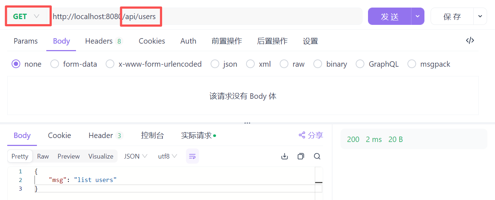
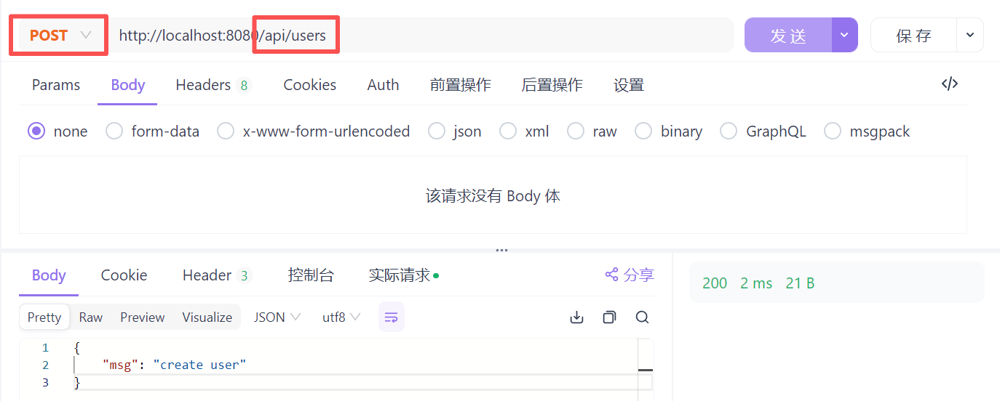

开发具体的业务时，常常需要借助一些框架实现特定的功能，下面是一些常用框架的学习情况。


ubuntu安装go

```bash
sudo apt update
sudo apt install golang -y

go version
```

ubuntu卸载并升级go

```bash
sudo apt remove golang-go
sudo apt autoremove

wget https://go.dev/dl/go1.22.5.linux-amd64.tar.gz
sudo rm -rf /usr/local/go
sudo tar -C /usr/local -xzf go1.22.5.linux-amd64.tar.gz

# 加到 ~/.bashrc 或 ~/.zshrc
export PATH=$PATH:/usr/local/go/bin

source ~/.bashrc

go version
```


# Web 框架 Gin

你的代码中用的是 **Gin**，它是最流行的 Go Web 框架。

学习模块

- Gin 基础
  - 创建路由 `r := gin.Default()`
  - 定义路由组 `api := r.Group("/api")`
  - JSON 请求解析 `c.ShouldBindJSON`
  - JSON 响应 `c.JSON`
  - 模板渲染 `c.HTML`
  - 静态资源 `r.Static("/static", "./static")`
- Gin 中间件
  - 记录日志
  - 错误处理
  - 跨域处理（CORS）

学习方法

- Gin 官方文档：https://gin-gonic.com/
- 练习小项目：
  - 写一个 Todo API（增删改查）
  - 用 Postman / curl 调试接口


### 快速上手

#### 第一个 Gin 应用

参考官网：https://gin-gonic.com/zh-cn/docs/

环境准备：如果golang版本过低，运行GIN会报错，建议升级Golang版本

```bash
go mod init myapp
go get -u github.com/gin-gonic/gin
```

第一个程序

```go
package main

import (
  "net/http"
  "github.com/gin-gonic/gin"
)

func main() {
  // 创建带默认中间件（日志与恢复）的 Gin 路由器
  r := gin.Default()

  // 定义简单的 GET 路由
  r.GET("/ping", func(c *gin.Context) {
    // 返回 JSON 响应
    c.JSON(http.StatusOK, gin.H{
      "message": "hello GIN",
    })
  })

  // 默认端口 8080 启动服务器
  // 监听 0.0.0.0:8080（Windows 下为 localhost:8080）
  r.Run()
}
```

运行程序：

```bash
go run main.go
```

浏览器访问`http://localhost:8080/ping`，会返回`{"message":"hello GIN"}`


其中：

- `r := gin.Default()`
  - 创建路由器
  - 调用 `gin.Default()` 创建一个 **Gin 路由器实例** `r`。它包含了默认的**中间件**（如**日志记录**和**故障恢复**）。
- `r.GET("/ping", func(c *gin.Context)` 
  - 定义 GET 路由
  - 将一个 HTTP **GET** 请求方法绑定到路径 `/ping`。第二个参数是一个 **处理函数**（也叫 **Handler** 或 **路由处理程序**）。
- `func(c *gin.Context) { ... }`
  - 路由处理函数
  - 这是一个**匿名函数**，接受一个 `*gin.Context` 类型的参数 `c`。`Context` 包含了处理 HTTP 请求所需的所有信息（请求参数、响应写入等）。
- `c.JSON(http.StatusOK, gin.H`
  - 返回 JSON 响应
  - 使用 `Context` 的 `JSON` 方法来发送 JSON 格式的响应。 • `http.StatusOK`：HTTP 状态码 **200**。 • `gin.H{...}`：是 `map[string]interface{}` 的**类型别名**，用于构造 JSON 数据（键值对）。


#### 带参数的路由

```go
package main

import (
  "github.com/gin-gonic/gin"
)

func main() {
  // 创建带默认中间件（日志与恢复）的 Gin 路由器
  r := gin.Default()

  r.GET("/user/:name", func(c *gin.Context) {
    name := c.Param("name")
    c.JSON(200, gin.H{
        "user": name,
    })
  })

  // 默认端口 8080 启动服务器
  // 监听 0.0.0.0:8080（Windows 下为 localhost:8080）
  r.Run()
}
```

浏览器访问`http://localhost:8080/user/Alice`，返回`{"user":"Alice"}`


其中：

- `r.GET("/user/:name", func(c *gin.Context)` 
  - 定义带参数的 GET 路由
  - 路径 `/user/:name` 中的 **`:`** 表示这是一个**路径参数**。例如，访问 `/user/Alice`，`Alice` 就是参数值。
- `name := c.Param("name")`
  - 获取路径参数
  - 使用 `Context` 的 `Param()` 方法，传入参数的**键**（即 `:name` 中的 `name`），来获取 URL 中的实际值。
- `c.JSON(200, gin.H{`
  - **返回 JSON 响应**
  - 状态码直接写 **200**（与 `http.StatusOK` 等价）。


#### POST 请求 + JSON 绑定

```go
package main

import (
  "github.com/gin-gonic/gin"
)

func main() {
  // 创建带默认中间件（日志与恢复）的 Gin 路由器
  r := gin.Default()

  type Login struct {
    User string `json:"user" binding:"required"`
    Pass string `json:"pass" binding:"required"`
}

  r.POST("/login", func(c *gin.Context) {
      var json Login
      if err := c.ShouldBindJSON(&json); err != nil {
          c.JSON(400, gin.H{"error": err.Error()})
          return
      }
      if json.User == "admin" && json.Pass == "123456" {
          c.JSON(200, gin.H{"status": "login success"})
      } else {
          c.JSON(401, gin.H{"status": "unauthorized"})
    }
  })

  r.Run("0.0.0.0:8080")
}
```

这里不清楚为什么，wsl中执行curl没有返回值，所以基于apifox进行测试：


#### 分组路由

```go
package main

import (
  "github.com/gin-gonic/gin"
)

func main() {
  // 创建带默认中间件（日志与恢复）的 Gin 路由器
  r := gin.Default()

  api := r.Group("/api")
  {
    api.GET("/users", func(c *gin.Context) { c.JSON(200, gin.H{"msg": "list users"}) })
    api.POST("/users", func(c *gin.Context) { c.JSON(200, gin.H{"msg": "create user"}) })
  }

  r.Run("0.0.0.0:8080")
}
```






# 数据库 ORM（GORM）

代码里你用 **GORM** 连接 MySQL。

学习模块

- 数据库连接
  - `gorm.Open(mysql.Open(dsn), &gorm.Config{})`
- 基本操作
  - `db.Create(&user)`
  - `db.First(&user, id)`
  - `db.Where("email = ?", email).First(&user)`
  - `db.Save(&user)`
  - `db.Delete(&user)`
- 高级操作
  - 关联关系（`Preload("App")`）
  - 批量查询
  - 原生 SQL

学习方法

- GORM 官方文档：https://gorm.io/docs/
- 练习小项目：
  - 用 GORM 写一个用户系统（注册、查询、修改）
  - 数据库表和 Go struct 对应关系搞清楚


### 快速上手

（这里网络有点问题，临时采用docker.1ms.run拉取mysql）docker部署mysql：

```bash
# 从Docker Hub拉取MySQL 8.0镜像
sudo docker pull docker.1ms.run/mysql:8.0

# 运行MySQL容器，并设置root密码为 'your-password'
# -d: 后台运行
# --name: 给容器命名为 'gorm-mysql'
# -p: 端口映射，将容器的3306端口映射到主机的3306端口
# -e: 设置环境变量 MYSQL_ROOT_PASSWORD
docker run --name gorm-mysql -d -p 3306:3306 -e MYSQL_ROOT_PASSWORD=123456 docker.1ms.run/mysql:8.0

docker ps
```

环境配置：

```bash
mkdir go-gorm-quickstart
cd go-gorm-quickstart
go mod init go-gorm-quickstart

# 安装必要的go包
go get gorm.io/gorm
go get gorm.io/driver/mysql
```


示例代码：

```go
package main

import (
    "database/sql" // 引入标准库的 sql 包
    "fmt"
    "log"

    "gorm.io/driver/mysql"
    "gorm.io/gorm"
)

// 定义你的 User 模型...
type User struct {
    gorm.Model
    Name  string `gorm:"type:varchar(255);not null"`
    Email string `gorm:"type:varchar(255);unique;not null"`
}

func main() {
    // 步骤1: 连接到MySQL服务器，不指定数据库名
    // 连接字符串中不再包含 "gorm_demo"
    dsn := "root:your-password@tcp(127.0.0.1:3306)/?charset=utf8mb4&parseTime=True&loc=Local"
    
    // 使用标准库的 sql 包来执行创建数据库的命令
    db, err := sql.Open("mysql", dsn)
    if err != nil {
        log.Fatalf("Failed to connect to MySQL server: %v", err)
    }
    defer db.Close()

    // 步骤2: 创建数据库
    _, err = db.Exec("CREATE DATABASE IF NOT EXISTS gorm_demo")
    if err != nil {
        log.Fatalf("Failed to create database 'gorm_demo': %v", err)
    }
    log.Println("Database 'gorm_demo' created or already exists.")

    // 步骤3: 使用GORM重新连接到新创建的数据库
    gormDsn := "root:your-password@tcp(127.0.0.1:3306)/gorm_demo?charset=utf8mb4&parseTime=True&loc=Local"
    gormDB, err := gorm.Open(mysql.Open(gormDsn), &gorm.Config{})
    if err != nil {
        log.Fatalf("Failed to connect to 'gorm_demo' database with GORM: %v", err)
    }

    log.Println("Successfully connected to the 'gorm_demo' database!")

    // 自动迁移模型
    err = gormDB.AutoMigrate(&User{})
    if err != nil {
        log.Fatalf("Failed to auto migrate: %v", err)
    }

    log.Println("Auto migration completed successfully.")

    // 接下来可以继续你的CRUD操作
    // ...
}
```

测试：

```bash
$ go run main.go 
2025/09/25 00:17:16 Database 'gorm_demo' created or already exists.
2025/09/25 00:17:16 Successfully connected to the 'gorm_demo' database!
2025/09/25 00:17:16 Auto migration completed successfully.
```

备注：确保你的Go程序能够以 **root** 用户从任何主机（`%`）连接到MySQL

```bash
docker exec -it gorm-mysql mysql -uroot -p

-- 选择 mysql 数据库
USE mysql;

-- 更新 root 用户的 host 为 '%'，允许从任何地方连接
-- 这里我们使用 ALTER USER，而不是 CREATE USER，因为它更安全，可以保留其他权限
ALTER USER 'root'@'%' IDENTIFIED BY 'your-password';

-- 刷新权限，使更改立即生效
FLUSH PRIVILEGES;

-- 退出MySQL Shell
exit;
```


在上述代码基础上加上CRUD：相较于上述代码，还需要将所有 GORM 的操作（`Create`、`First`、`Model`、`Find`、`Delete`）的接收者从 `db` 变量修改为 `gormDB` 变量。

```go
package main

import (
    "database/sql"
    "log"

    "gorm.io/driver/mysql"
    "gorm.io/gorm"
)

// 定义你的 User 模型...
type User struct {
    gorm.Model
    Name  string `gorm:"type:varchar(255);not null"`
    Email string `gorm:"type:varchar(255);unique;not null"`
}

func main() {
    dsn := "root:your-password@tcp(127.0.0.1:3306)/?charset=utf8mb4&parseTime=True&loc=Local"

    db, err := sql.Open("mysql", dsn)
    if err != nil {
        log.Fatalf("Failed to connect to MySQL server: %v", err)
    }
    defer db.Close()

    _, err = db.Exec("CREATE DATABASE IF NOT EXISTS gorm_demo")
    if err != nil {
        log.Fatalf("Failed to create database 'gorm_demo': %v", err)
    }
    log.Println("Database 'gorm_demo' created or already exists.")

    gormDsn := "root:your-password@tcp(127.0.0.1:3306)/gorm_demo?charset=utf8mb4&parseTime=True&loc=Local"
    // GORM 连接对象
    gormDB, err := gorm.Open(mysql.Open(gormDsn), &gorm.Config{})
    if err != nil {
        log.Fatalf("Failed to connect to 'gorm_demo' database with GORM: %v", err)
    }
    log.Println("Successfully connected to the 'gorm_demo' database!")

    err = gormDB.AutoMigrate(&User{})
    if err != nil {
        log.Fatalf("Failed to auto migrate: %v", err)
    }
    log.Println("Auto migration completed successfully.")

    // --- 开始GORM操作 ---

    log.Println("\n--- 创建新用户 ---")
    user1 := User{
        Name:  "Alice",
        Email: "alice@example.com",
    }
    // 正确：使用 gormDB.Create
    result := gormDB.Create(&user1)
    if result.Error != nil {
        log.Fatalf("Failed to create user: %v", result.Error)
    }
    log.Printf("User created successfully, ID: %d", user1.ID)

    log.Println("\n--- 查询用户 ---")
    var retrievedUser User
    // 正确：使用 gormDB.First
    result = gormDB.First(&retrievedUser, user1.ID)
    if result.Error != nil {
        log.Fatalf("Failed to find user: %v", result.Error)
    }
    log.Printf("Found user: %+v", retrievedUser)

    log.Println("\n--- 更新用户 ---")
    // 正确：使用 gormDB.Model
    result = gormDB.Model(&retrievedUser).Update("Name", "Alice Smith")
    if result.Error != nil {
        log.Fatalf("Failed to update user: %v", result.Error)
    }
    log.Printf("User updated successfully, new name: %s", retrievedUser.Name)

    log.Println("\n--- 查询所有用户 ---")
    var allUsers []User
    // 正确：使用 gormDB.Find
    result = gormDB.Find(&allUsers)
    if result.Error != nil {
        log.Fatalf("Failed to find all users: %v", result.Error)
    }
    log.Printf("Found %d users:", len(allUsers))
    for _, u := range allUsers {
        log.Printf("- ID: %d, Name: %s, Email: %s", u.ID, u.Name, u.Email)
    }

    log.Println("\n--- 删除用户 ---")
    // 正确：使用 gormDB.Delete
    result = gormDB.Delete(&retrievedUser, retrievedUser.ID)
    if result.Error != nil {
        log.Fatalf("Failed to delete user: %v", result.Error)
    }
    log.Printf("User deleted successfully, ID: %d", retrievedUser.ID)
}
```

```bash
$ go run main.go 
2025/09/25 00:19:49 Database 'gorm_demo' created or already exists.
2025/09/25 00:19:49 Successfully connected to the 'gorm_demo' database!
2025/09/25 00:19:49 Auto migration completed successfully.
2025/09/25 00:19:49 
--- 创建新用户 ---
2025/09/25 00:19:49 User created successfully, ID: 1
2025/09/25 00:19:49 
--- 查询用户 ---
2025/09/25 00:19:49 Found user: {Model:{ID:1 CreatedAt:2025-09-25 00:19:49.655 +0800 CST UpdatedAt:2025-09-25 00:19:49.655 +0800 CST DeletedAt:{Time:0001-01-01 00:00:00 +0000 UTC Valid:false}} Name:Alice Email:alice@example.com}
2025/09/25 00:19:49 
--- 更新用户 ---
2025/09/25 00:19:49 User updated successfully, new name: Alice Smith
2025/09/25 00:19:49 
--- 查询所有用户 ---
2025/09/25 00:19:49 Found 1 users:
2025/09/25 00:19:49 - ID: 1, Name: Alice Smith, Email: alice@example.com
2025/09/25 00:19:49 
--- 删除用户 ---
2025/09/25 00:19:49 User deleted successfully, ID: 1
```


# 系统与容器交互

代码里涉及 **进程执行、文件系统、Docker**：

学习模块

- **os/exec**
  - `exec.Command("ls", "-l")`
  - `cmd.Output()` / `cmd.CombinedOutput()`
- **文件操作**
  - `os.MkdirAll`
  - `os.Create`
  - `filepath.Join`
- **端口检查**
  - 调用外部命令 `netstat` / `ss`
- **Docker Compose**
  - `docker compose up -d`
  - `docker compose down`
  - `--env-file` 用于加载 `.env`

学习方法

- 写个小程序：调用 `exec.Command("ls")`，获取输出
- 写个工具：创建一个文件夹，往里面生成一个 `.env` 文件
- 在 Linux 上用 `docker compose` 启动 nginx


### 快速上手

#### 环境准备

创建一个新的项目目录并初始化 Go 模块：

```bash
mkdir go-devops-tools
cd go-devops-tools
go mod init go-devops-tools
```

在项目根目录创建 `main.go` 文件，以及一个用于 Docker Compose 的文件夹 `nginx-example`。

```bash
# 创建Docker Compose所需的目录和文件
mkdir -p nginx-example
touch nginx-example/docker-compose.yml
touch nginx-example/.env
```

最终的项目结构应该是这样：

```bash
go-devops-tools/
├── main.go
└── nginx-example/
    ├── docker-compose.yml
    └── .env
```


#### 模块一：进程管理 (`os/exec`)

```go
// exec_utils.go (可选，你也可以直接写在 main.go 中)
package main

import (
	"fmt"
	"log"
	"os/exec"
)

// RunCommand 运行外部命令并返回其输出
func RunCommand(name string, args ...string) (string, error) {
	// exec.Command 用于创建命令对象
	cmd := exec.Command(name, args...)

	// cmd.CombinedOutput() 会同时获取标准输出和标准错误输出
	output, err := cmd.CombinedOutput()
	if err != nil {
		return "", fmt.Errorf("command execution failed: %v, output: %s", err, output)
	}

	return string(output), nil
}

func main() {
    // 假设这是你的 main.go
	output, err := RunCommand("ls", "-l")
	if err != nil {
		log.Fatalf("Error running ls command: %v", err)
	}
	fmt.Println("ls -l command output:")
	fmt.Println(output)
}
```

示例结果：

```bash
$ go run main.go 
ls -l command output:
total 12
-rw-r--r-- 1 coderz coderz   34 Sep 25 00:24 go.mod
-rw-r--r-- 1 coderz coderz  770 Sep 25 00:24 main.go
drwxr-xr-x 2 coderz coderz 4096 Sep 25 00:24 nginx-example
```


#### 模块二：文件系统 (`os`, `path/filepath`)

```go
// file_utils.go (可选)
package main

import (
	"fmt"
	"log"
	"os"
	"path/filepath"
)

// CreateEnvFile 在指定目录下创建 .env 文件
func CreateEnvFile(dirPath, filename string, content string) error {
	// 使用 filepath.Join 安全地拼接路径，避免手动处理斜杠问题
	filePath := filepath.Join(dirPath, filename)

	// os.MkdirAll 递归地创建目录。如果目录已存在，不会报错
	err := os.MkdirAll(dirPath, 0755)
	if err != nil {
		return fmt.Errorf("failed to create directory: %v", err)
	}

	// os.Create 创建或清空文件，并返回一个 *os.File 对象
	file, err := os.Create(filePath)
	if err != nil {
		return fmt.Errorf("failed to create file: %v", err)
	}
	defer file.Close() // 确保在函数退出时关闭文件

	// 写入文件内容
	_, err = file.WriteString(content)
	if err != nil {
		return fmt.Errorf("failed to write to file: %v", err)
	}

	return nil
}

func main() {
    // 假设这是你的 main.go
    dir := "nginx-example"
    file := ".env"
    content := "NGINX_PORT=8080\n"

    err := CreateEnvFile(dir, file, content)
    if err != nil {
        log.Fatalf("Error creating .env file: %v", err)
    }
    fmt.Printf("Successfully created %s/%s\n", dir, file)
}
```

示例结果：

```bash
$ go run main.go 
Successfully created nginx-example/.env
```


#### 模块三：Docker Compose

**`nginx-example/docker-compose.yml`**

```bash
version: '3.8'

services:
  nginx:
    image: nginx:latest
    container_name: my-nginx-container
    ports:
      - "${NGINX_PORT}:80"
```

**`nginx-example/.env`** (内容由之前运行的Go程序生成)

```bash
NGINX_PORT=8080
```

示例程序：

```go
package main

import (
	"fmt"
	"log"
	"os"
	"os/exec"
	"path/filepath"
	"strings"
	"time"
)

// RunCommand 运行外部命令并返回其输出
func RunCommand(name string, args ...string) (string, error) {
	cmd := exec.Command(name, args...)
	output, err := cmd.CombinedOutput()
	if err != nil {
		return "", fmt.Errorf("command '%s %s' failed: %v, output: %s", name, strings.Join(args, " "), err, output)
	}
	return string(output), nil
}

// CreateEnvFile 在指定目录下创建 .env 文件
func CreateEnvFile(dirPath, filename, content string) error {
	filePath := filepath.Join(dirPath, filename)
	err := os.MkdirAll(dirPath, 0755)
	if err != nil {
		return fmt.Errorf("failed to create directory: %v", err)
	}
	file, err := os.Create(filePath)
	if err != nil {
		return fmt.Errorf("failed to create file: %v", err)
	}
	defer file.Close()
	_, err = file.WriteString(content)
	if err != nil {
		return fmt.Errorf("failed to write to file: %v", err)
	}
	return nil
}

// CheckPortAvailable 检查端口是否被占用
func CheckPortAvailable(port string) bool {
	// 使用 `netstat` 或 `ss` 命令检查端口
	// `netstat` 在某些系统中可能被弃用，`ss` 是更现代的选择
	cmd := exec.Command("ss", "-tuln", "sport = :"+port)
	output, err := cmd.Output()
	if err != nil {
		// 如果命令出错，很可能是因为没有找到端口，或者权限问题，我们假设端口可用
		return true
	}
	// 如果输出中包含我们检查的端口号，说明端口被占用
	return !strings.Contains(string(output), ":"+port)
}

func main() {
	projectDir := "nginx-example"
	envFile := ".env"
	envContent := "NGINX_PORT=8080\n"

	// 任务一：文件系统操作 - 创建 .env 文件
	fmt.Println("--- 1. 创建 .env 文件 ---")
	err := CreateEnvFile(projectDir, envFile, envContent)
	if err != nil {
		log.Fatalf("Failed to create .env file: %v", err)
	}
	fmt.Printf("Successfully created %s/%s\n", projectDir, envFile)

	// 任务二：端口检查
	port := "8080"
	fmt.Printf("\n--- 2. 检查端口 %s --- \n", port)
	if !CheckPortAvailable(port) {
		log.Printf("Port %s is already in use. Please choose a different port or stop the service.", port)
	} else {
		fmt.Printf("Port %s is available.\n", port)
	}

	// 任务三：Docker Compose 交互
	fmt.Println("\n--- 3. 启动 Docker Compose 服务 ---")
	// -f 参数指定 docker-compose 文件路径
	// -p 参数指定项目名称
	// --env-file 参数指定 .env 文件
	// -d 参数表示后台运行
	composeArgs := []string{"-f", filepath.Join(projectDir, "docker-compose.yml"), "-p", "go-nginx-project", "--env-file", filepath.Join(projectDir, ".env"), "up", "-d"}
	output, err := RunCommand("docker", append([]string{"compose"}, composeArgs...)...)
	if err != nil {
		log.Fatalf("Failed to run docker compose up: %v", err)
	}
	fmt.Printf("Docker compose up output:\n%s\n", output)

	fmt.Println("Waiting for 5 seconds to let the service start...")
	time.Sleep(5 * time.Second)

	fmt.Printf("\n--- 4. 检查容器状态 --- \n")
	output, err = RunCommand("docker", "ps", "--filter", "name=my-nginx-container")
	if err != nil {
		log.Fatalf("Failed to run docker ps: %v", err)
	}
	fmt.Printf("Docker ps output:\n%s\n", output)

	fmt.Println("\n--- 5. 停止并移除 Docker 服务 ---")
	// docker compose down 会停止并移除容器、网络和卷
	downArgs := []string{"-f", filepath.Join(projectDir, "docker-compose.yml"), "-p", "go-nginx-project", "down"}
	output, err = RunCommand("docker", append([]string{"compose"}, downArgs...)...)
	if err != nil {
		log.Fatalf("Failed to run docker compose down: %v", err)
	}
	fmt.Printf("Docker compose down output:\n%s\n", output)

	fmt.Println("\nProgram completed successfully.")
}
```

示例结果：

```bash
--- 1. 创建 .env 文件 ---
Successfully created nginx-example/.env

--- 2. 检查端口 8080 --- 
Port 8080 is available.

--- 3. 启动 Docker Compose 服务 ---
Docker compose up output:
[+] Running 1/1
 ⠿ Container my-nginx-container  Created
...

Waiting for 5 seconds to let the service start...

--- 4. 检查容器状态 --- 
Docker ps output:
CONTAINER ID        IMAGE               COMMAND                  CREATED             STATUS              PORTS                   NAMES
...
...  my-nginx-container

--- 5. 停止并移除 Docker 服务 ---
Docker compose down output:
[+] Running 1/0
 ⠿ Container my-nginx-container  Removed
 ⠿ Network go-nginx-project_default  Removed
...

Program completed successfully.
```


# 环境变量与配置管理

学习模块

- `os.Getenv` 获取环境变量
- `.env` 文件（在项目中生成，供 Docker 使用）
- `text/template` 模板渲染

学习方法

- 写一个模板文件，把变量渲染到配置文件
- 模拟项目中的 `.env` 生成逻辑


### 快速上手

#### 第一步：项目准备

创建项目目录和文件：

```bash
mkdir config-generator
cd config-generator
go mod init config-generator

# 创建模板和主程序文件
touch main.go
touch config.tmpl
```

最终项目结构如下：

```bash
config-generator/
├── main.go
└── config.tmpl
```


#### 第二步：创建模板文件 (`config.tmpl`)

这是我们的模板文件，它定义了 `.env` 文件的结构，其中的变量用 Go 模板语法 `{{.VariableName}}` 表示。

**`config.tmpl`**

```bash
# This file is automatically generated by Go program.
# Do not modify manually.

DB_HOST={{.DBHost}}
DB_PORT={{.DBPort}}
DB_USER={{.DBUser}}
DB_PASSWORD={{.DBPassword}}
APP_SECRET={{.AppSecret}}
```


#### 第三步：编写 Go 程序 (`main.go`)

这个程序将是整个学习的核心。它将读取环境变量，填充数据，并渲染模板。

```go
package main

import (
	"log"
	"os"
	"path/filepath"
	"text/template"
)

// Config holds our configuration variables
// 这是一个存放环境变量值的Go结构体
type Config struct {
	DBHost     string
	DBPort     string
	DBUser     string
	DBPassword string
	AppSecret  string
}

func main() {
	// Step 1: 从系统环境变量中读取值
	// os.Getenv("ENV_VAR_NAME") 获取环境变量值
	// 如果环境变量不存在，它会返回空字符串，所以我们需要提供一个默认值
	cfg := Config{
		DBHost:     os.Getenv("DB_HOST"),
		DBPort:     os.Getenv("DB_PORT"),
		DBUser:     os.Getenv("DB_USER"),
		DBPassword: os.Getenv("DB_PASSWORD"),
		AppSecret:  os.Getenv("APP_SECRET"),
	}

	// 为空值设置默认值
	if cfg.DBHost == "" {
		cfg.DBHost = "localhost"
	}
	if cfg.DBPort == "" {
		cfg.DBPort = "5432"
	}
	if cfg.DBUser == "" {
		cfg.DBUser = "root"
	}
	if cfg.DBPassword == "" {
		cfg.DBPassword = "password"
	}
	if cfg.AppSecret == "" {
		// 生成一个简单的随机字符串作为默认值
		cfg.AppSecret = "some-default-secret"
	}

	// Step 2: 解析模板文件
	// filepath.Join确保路径的正确性
	tmplPath := filepath.Join(".", "config.tmpl")
	tmpl, err := template.ParseFiles(tmplPath)
	if err != nil {
		log.Fatalf("Failed to parse template file: %v", err)
	}

	// Step 3: 创建目标 .env 文件
	targetFilePath := filepath.Join(".", ".env")
	file, err := os.Create(targetFilePath)
	if err != nil {
		log.Fatalf("Failed to create .env file: %v", err)
	}
	defer file.Close() // 确保文件在程序结束时被关闭

	// Step 4: 渲染模板并写入文件
	// tmpl.Execute将模板与cfg数据结合，并将结果写入file
	log.Println("Generating .env file from template...")
	err = tmpl.Execute(file, cfg)
	if err != nil {
		log.Fatalf("Failed to execute template: %v", err)
	}
	log.Println(".env file generated successfully!")
}
```

示例运行结果：

```bash
$ go run main.go 
2025/09/25 00:31:45 Generating .env file from template...
2025/09/25 00:31:45 .env file generated successfully!
```

运行后，会生成一个 `.env` 文件。打开它，你会看到：

```bash
# This file is automatically generated by Go program.
# Do not modify manually.

DB_HOST=localhost
DB_PORT=5432
DB_USER=root
DB_PASSWORD=password
APP_SECRET=some-default-secret
```

**第二次运行（设置环境变量）**：

```bash
# 在macOS/Linux上
export DB_HOST=my-production-db
export DB_USER=admin

# 在Windows上 (PowerShell)
$env:DB_HOST="my-production-db"
$env:DB_USER="admin"

# 再次运行Go程序
go run main.go
```

这次，程序会读取你设置的环境变量。打开新生成的 `.env` 文件，你会看到：

```bash
# This file is automatically generated by Go program.
# Do not modify manually.

DB_HOST=my-production-db
DB_PORT=5432
DB_USER=admin
DB_PASSWORD=password
APP_SECRET=some-default-secret
```

