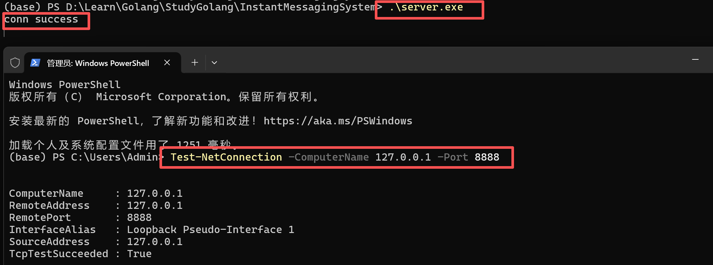
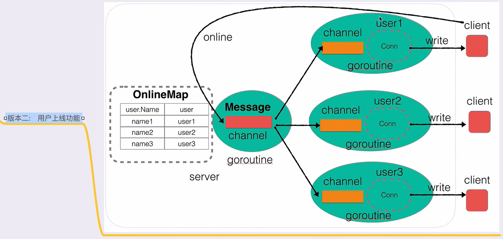
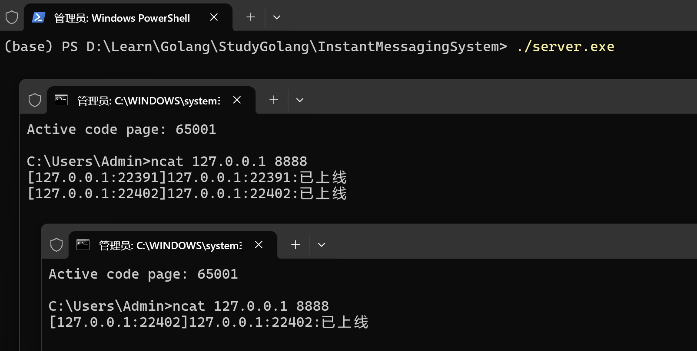
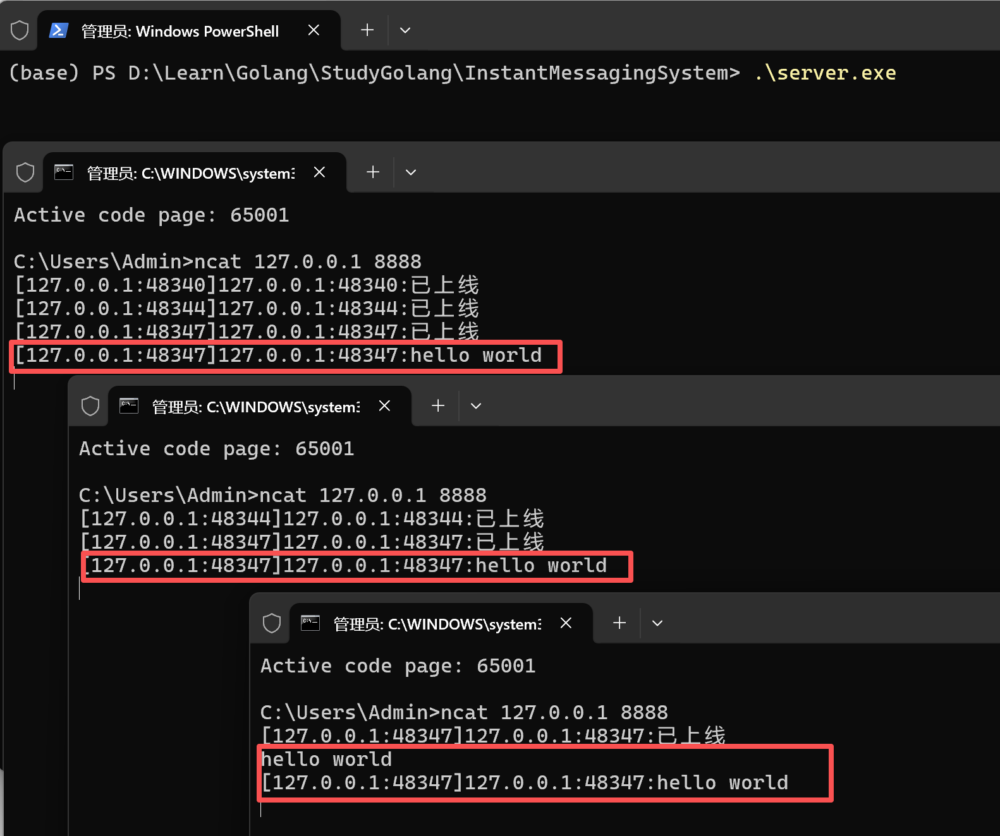
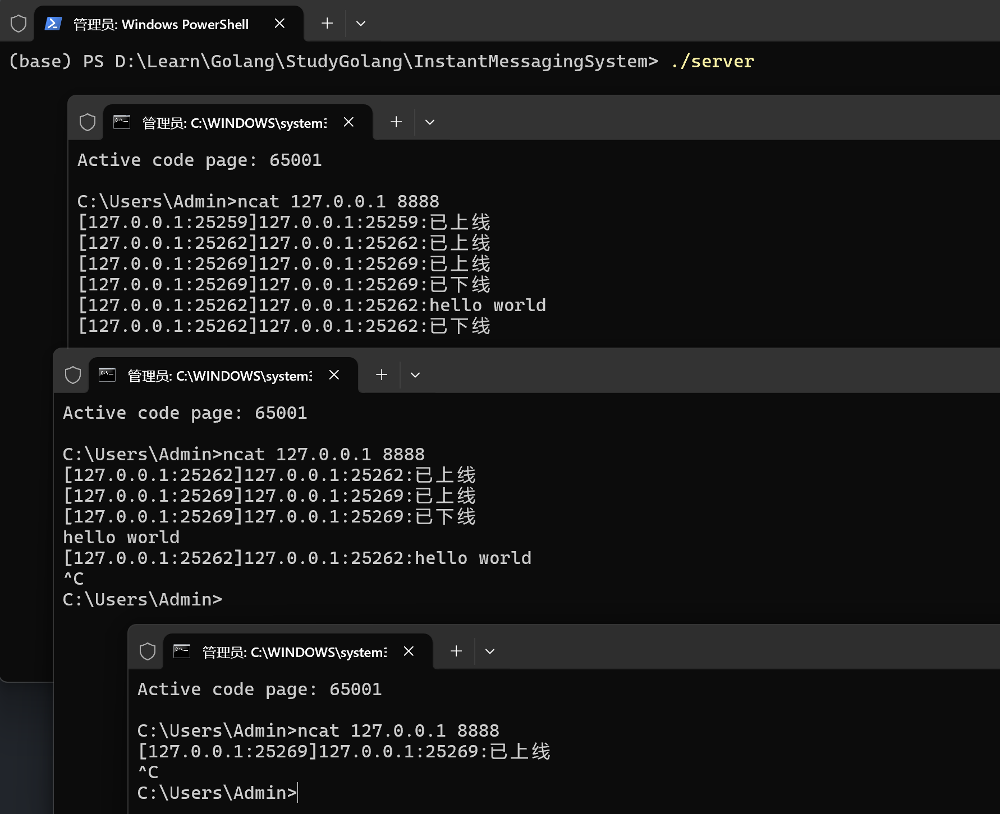

覆盖前面的学习的语法内容，非企业级项目。

参考：[及时通信系统](https://www.bilibili.com/video/BV1gf4y1r79E)


## Step1 基础server构建

目录树：

```
├─InstantMessagingSystem
│      go.mod
│      main.go
│      server.exe
│      server.go
```

创建server.go

```
package main

import (
	"net"
	"fmt"
)

type Server struct {
    Ip string
    Port int
}

// 创建一个server接口，返回server指针
func NewServer(ip string, port int) *Server {
    server := &Server{
        Ip: ip,
        Port: port,
    }
	return server
}

func (this *Server) Handler(conn net.Conn) {
    fmt.Println("conn success")
}

// 启动服务器接口
func (this *Server) Start() {
    // socket listen
    listener, err := net.Listen("tcp", fmt.Sprintf("%s:%d", this.Ip, this.Port))
	if err != nil {
		fmt.Println("net.Listen err:", err)
		return
	}
	defer listener.Close() // close listen socket 


	for {
		// accept
		conn, err := listener.Accept()
		if err != nil {
			fmt.Println("listener.Accept err:", err)
			continue
		}
		// do handler
		go this.Handler(conn)
	}
}


```

创建main.go

```
package main

func main() {
    server := NewServer("127.0.0.1", 8888)
	server.Start()
}
```

编译：

```
go build -o server.exe main.go server.go
```

执行：打开两个powershell



备注：在linux上，直接`go build -o server main.go server.go`编译，一个终端启动server：`./server`，一个终端发送请求`nc 127.0.0.1 8888`即可


## Step2 用户上线及广播功能



user1的client发送online message，之后广播到user2与user3


文件树：

```
├─InstantMessagingSystem
│      go.mod
│      main.go
│      server.exe
│      server.go
│      user.go
```


首先，创建user.go：

- 创建User结构体以及用户的API
- 之后，结合架构图可知，需要创建一个监听User channel的方法，来接收并转发消息到client

```
package main

import (
	"net"
)

type User struct {
    Name string
	Addr  string
	C    chan string
	conn net.Conn
}

// 创建一个用户的API
func NewUser(conn net.Conn) *User {
	userAddr := conn.RemoteAddr().String()
	user := &User{
		Name:  userAddr,
		Addr:  userAddr,
		C:     make(chan string),
		conn:  conn,
	}


	// 启动监听当前user channel消息的goroutine
	go user.ListenMessage()

	return user
}

// 监听当前 User channel的方法，一旦有消息，就直接发送给客户端
func (this *User) ListenMessage() {
	for {
		msg := <-this.C
		this.conn.Write([]byte(msg + "\n"))   //  this.conn 是一个 net.Conn 类型, Write 方法来自 net.Conn 接口
	}
}

```


优化server.go

- Server加入：在线用户列表、消息广播的channel
- Server的对象server同样加入新增变量
- 优化Handler方法

```
package main

import (
	"net"
	"fmt"
	"sync"
)

type Server struct {
    Ip string
    Port int

	// 在线用户列表
	OnlineMap map[string]*User
	// mapLock   sync.ReMutex
	mapLock   sync.RWMutex

	// 消息广播的channel
	Message chan string
}

// 创建一个server接口，返回server指针
func NewServer(ip string, port int) *Server {
    server := &Server{
        Ip: ip,
        Port: port,
		OnlineMap: make(map[string]*User),
		Message: make(chan string),
    }
	return server
}

// 监听Message广播消息channel的goroutine，一旦有消息就发送给全部的在线User
func (this *Server) ListenMessage() {
	for {
		msg := <-this.Message

		// 将msg发送给全部的在线User
		this.mapLock.Lock()
		for _, cli := range this.OnlineMap {
			cli.C <- msg
		}
		this.mapLock.Unlock()
	}
}

// 广播消息的方法
func (this *Server) BroadCast(user *User, msg string) {
    sendMsg := "[" + user.Addr + "]" + user.Name + ":" + msg
	this.Message <- sendMsg
}

func (this *Server) Handler(conn net.Conn) {
    // fmt.Println("conn success")

	user := NewUser(conn)

	// 用户上线，将用户加入到OnlineMap中
	this.mapLock.Lock()  // 加锁
	this.OnlineMap[user.Name] = user
	this.mapLock.Unlock() // 解锁

	// 广播当前用户上线消息
	this.BroadCast(user, "已上线")

	// 当前handler阻塞
	select {}

}

// 启动服务器接口
func (this *Server) Start() {
    // socket listen
    listener, err := net.Listen("tcp", fmt.Sprintf("%s:%d", this.Ip, this.Port))
	if err != nil {
		fmt.Println("net.Listen err:", err)
		return
	}
	defer listener.Close() // close listen socket 


	// 启动监听Message的goroutine
	go this.ListenMessage()

	for {
		// accept
		conn, err := listener.Accept()
		if err != nil {
			fmt.Println("listener.Accept err:", err)
			continue
		}
		// do handler
		go this.Handler(conn)
	}
}

```


build：

```
go build -o server.exe main.go server.go user.go
```


启动：

```
# 终端1
./server.exe

# 终端2
ncat 127.0.0.1 8888

# 终端3
ncat 127.0.0.1 8888
```




补充：Window上的一些问题

- `Test-NetConnection -ComputerName 127.0.0.1 -Port 8888` 这个命令**不能**用来接收返回的消息。为了后续的测试，需要在Windows上安装nc工具：

  ```
  # 安装Chocolatey，这是一个Windows上的包管理器
  Set-ExecutionPolicy Bypass -Scope Process -Force; iex ((New-Object System.Net.WebClient).DownloadString('https://chocolatey.org/install.ps1'))
  
  # 安装完Chocolatey后，你可以使用它来安装ncat（Netcat的新版本，由Nmap项目维护）
  choco install nmap -y
  
  # 示例使用
  ncat -l -p 9999
  ```

- 关于Windows终端输出乱码，示例解决方法，先在终端使用 `chcp` 命令临时将当前终端的编码改为 UTF-8

  ```
  chcp 65001
  ```

  


## Step3 用户消息广播功能

在server中加入：接收客户端发送的消息

```
package main

import (
	"net"
	"fmt"
	"sync"
)

type Server struct {
    Ip string
    Port int

	// 在线用户列表
	OnlineMap map[string]*User
	// mapLock   sync.ReMutex
	mapLock   sync.RWMutex

	// 消息广播的channel
	Message chan string
}

// 创建一个server接口，返回server指针
func NewServer(ip string, port int) *Server {
    server := &Server{
        Ip: ip,
        Port: port,
		OnlineMap: make(map[string]*User),
		Message: make(chan string),
    }
	return server
}

// 监听Message广播消息channel的goroutine，一旦有消息就发送给全部的在线User
func (this *Server) ListenMessage() {
	for {
		msg := <-this.Message

		// 将msg发送给全部的在线User
		this.mapLock.Lock()
		for _, cli := range this.OnlineMap {
			cli.C <- msg
		}
		this.mapLock.Unlock()
	}
}

// 广播消息的方法
func (this *Server) BroadCast(user *User, msg string) {
    sendMsg := "[" + user.Addr + "]" + user.Name + ":" + msg
	this.Message <- sendMsg
}

func (this *Server) Handler(conn net.Conn) {
    // fmt.Println("conn success")

	user := NewUser(conn)

	// 用户上线，将用户加入到OnlineMap中
	this.mapLock.Lock()  // 加锁
	this.OnlineMap[user.Name] = user
	this.mapLock.Unlock() // 解锁

	// 广播当前用户上线消息
	this.BroadCast(user, "已上线")

	// 接收客户端发送的消息
	go func() {
	    buf := make([]byte, 4096)
		for {
			n, err := conn.Read(buf)
			if n == 0 {
				this.BroadCast(user, "下线")
				return
			}
			if err != nil {
				fmt.Println("conn.Read err:", err)
				return
			}

			// 提取用户消息，去除\n
			msg := string(buf[:n-1])

			// 将得到的消息进行广播
			this.BroadCast(user, msg)
		}
	}()

	// 当前handler阻塞
	select {}
}

// 启动服务器接口
func (this *Server) Start() {
    // socket listen
    listener, err := net.Listen("tcp", fmt.Sprintf("%s:%d", this.Ip, this.Port))
	if err != nil {
		fmt.Println("net.Listen err:", err)
		return
	}
	defer listener.Close() // close listen socket 


	// 启动监听Message的goroutine
	go this.ListenMessage()

	for {
		// accept
		conn, err := listener.Accept()
		if err != nil {
			fmt.Println("listener.Accept err:", err)
			continue
		}
		// do handler
		go this.Handler(conn)
	}
}

```




## Step4 用户业务封装

将以往代码进行封装


我们梳理一下目前的代码：

- user.go
  - User结构体
  - NewUser：创建User并启动监听
- server.go

  - 服务器核心实现，定义了 Server 结构体和相关方法。
  - Server 结构体 ：包含 IP、端口、在线用户列表 OnlineMap 、读写锁 mapLock 和消息广播通道 Message 。
  - 主要方法 ：
    - NewServer() : 创建并返回服务器实例。
    - Handler() : 处理客户端连接，创建用户、处理用户上线/下线和消息接收。
      - ListenMessage() : 监听消息通道，将消息广播给所有在线用户。
      - BroadCast() : 将指定用户的消息广播到消息通道。
    - Start() : 启动服务器，监听TCP连接并处理请求。
- main.go
  - 程序入口文件，创建服务器实例并启动服务。
  - 核心代码：调用 NewServer() 创建服务器，指定 IP 为 127.0.0.1，端口为 8888，然后调用 server.Start() 启动服务器。


将server.go中"上线、下线、消息处理“相关内容，封装入user.go中


文件树：

```
├─InstantMessagingSystem
│      go.mod
│      main.go
│      server.exe
│      server.go
│      user.go
```


user.go

```
package main

import (
	"net"
)

type User struct {
    Name string
	Addr  string
	C    chan string
	conn net.Conn

	server *Server
}

// 创建一个用户的API
func NewUser(conn net.Conn, server *Server) *User {
	userAddr := conn.RemoteAddr().String()
	user := &User{
		Name:  userAddr,
		Addr:  userAddr,
		C:     make(chan string),
		conn:  conn,
		server: server,
	}


	// 启动监听当前user channel消息的goroutine
	go user.ListenMessage()

	return user
}

// 用户的上线业务
func (this *User) Online() {
	// 用户上线，将用户加入到OnlineMap中
	this.server.mapLock.Lock()
	this.server.OnlineMap[this.Name] = this
	this.server.mapLock.Unlock()

	// 广播当前用户上线消息
	this.server.BroadCast(this, "已上线")

}

// 用户的下线业务
func (this *User) Offline() {
	// 用户下线，将用户从OnlineMap中删除
	this.server.mapLock.Lock()
	delete(this.server.OnlineMap, this.Name)
	this.server.mapLock.Unlock()

	// 广播当前用户上线消息
	this.server.BroadCast(this, "已下线")

}

// 用户处理消息的业务
func (this *User) DoMessage(msg string) {
	this.server.BroadCast(this, msg)
}


// 监听当前 User channel的方法，一旦有消息，就直接发送给客户端
func (this *User) ListenMessage() {
	for {
		msg := <-this.C
		this.conn.Write([]byte(msg + "\n"))   //  this.conn 是一个 net.Conn 类型, Write 方法来自 net.Conn 接口
	}
}

```

server.go

```
package main

import (
	"net"
	"fmt"
	"sync"
)

type Server struct {
    Ip string
    Port int

	// 在线用户列表
	OnlineMap map[string]*User
	// mapLock   sync.ReMutex
	mapLock   sync.RWMutex

	// 消息广播的channel
	Message chan string
}

// 创建一个server接口，返回server指针
func NewServer(ip string, port int) *Server {
    server := &Server{
        Ip: ip,
        Port: port,
		OnlineMap: make(map[string]*User),
		Message: make(chan string),
    }
	return server
}

// 监听Message广播消息channel的goroutine，一旦有消息就发送给全部的在线User
func (this *Server) ListenMessage() {
	for {
		msg := <-this.Message

		// 将msg发送给全部的在线User
		this.mapLock.Lock()
		for _, cli := range this.OnlineMap {
			cli.C <- msg
		}
		this.mapLock.Unlock()
	}
}

// 广播消息的方法
func (this *Server) BroadCast(user *User, msg string) {
    sendMsg := "[" + user.Addr + "]" + user.Name + ":" + msg
	this.Message <- sendMsg
}

func (this *Server) Handler(conn net.Conn) {
    // fmt.Println("conn success")

	user := NewUser(conn, this)

	// 用户上线，将用户加入到OnlineMap中
	user.Online()

	// 接收客户端发送的消息
	go func() {
	    buf := make([]byte, 4096)
		for {
			n, err := conn.Read(buf)
			if n == 0 {
				user.Offline()
				return
			}
			if err != nil {
				fmt.Println("conn.Read err:", err)
				return
			}

			// 提取用户消息，去除\n
			msg := string(buf[:n-1])

			// 将得到的消息进行广播
			user.DoMessage(msg)
		}
	}()

	// 当前handler阻塞
	select {}
}

// 启动服务器接口
func (this *Server) Start() {
    // socket listen
    listener, err := net.Listen("tcp", fmt.Sprintf("%s:%d", this.Ip, this.Port))
	if err != nil {
		fmt.Println("net.Listen err:", err)
		return
	}
	defer listener.Close() // close listen socket 


	// 启动监听Message的goroutine
	go this.ListenMessage()

	for {
		// accept
		conn, err := listener.Accept()
		if err != nil {
			fmt.Println("listener.Accept err:", err)
			continue
		}
		// do handler
		go this.Handler(conn)
	}
}


```


测试：

- 启动server
- 启动三个用户
- 用户上线或者ctrl + c下线或者发送消息，均有广播




## Step5 在线用户查询

在DoMessage中加入查询相关内容

效果：在某一用户下发who，通过终端反馈的 `***在线` 能看到有哪些用户在线

```
// 发送消息，向当前User对应的客户端发送消息
func (this *User) SendMsg(msg string) {
	this.conn.Write([]byte(msg))
}

// 用户处理消息的业务
func (this *User) DoMessage(msg string) {
	if msg == "who" {
		// 查询当前在线用户
		this.server.mapLock.Lock()
		for _, user := range this.server.OnlineMap {
			onlineMsg := "[" + user.Addr + "]" + user.Name + ":在线...\n"
			this.SendMsg(onlineMsg)
		}
		this.server.mapLock.Unlock()
	} else {
	this.server.BroadCast(this, msg)
	}
}
```


## Step6 修改用户名

继续丰富DoMessage，增加rename功能

```
func (this *User) DoMessage(msg string) {
	if msg == "who" {
		// 查询当前在线用户
		this.server.mapLock.Lock()
		for _, user := range this.server.OnlineMap {
			onlineMsg := "[" + user.Addr + "]" + user.Name + ":在线...\n"
			this.SendMsg(onlineMsg)
		}
		this.server.mapLock.Unlock()
	} else if len(msg) > 7 && msg[:7] == "rename|" {
		// 消息格式 rename|张三
		newName := strings.Split(msg, "|")[1]
		_, ok := this.server.OnlineMap[newName]
		if ok {
			this.SendMsg("当前用户名被使用\n")
		} else {
			this.server.mapLock.Lock()
			delete(this.server.OnlineMap, this.Name)
			this.server.OnlineMap[newName] = this
			this.server.mapLock.Unlock()

			this.Name = newName
			this.SendMsg("您已更新用户名为：" + this.Name + "\n")
		}
	} else {
	this.server.BroadCast(this, msg)
	}
}
```


## Step7 超时强踢功能

> 主要复习select、channel、context功能

优化Handler，超时就踢出用户

```
func (this *Server) Handler(conn net.Conn) {
    // fmt.Println("conn success")

	user := NewUser(conn, this)

	// 用户上线，将用户加入到OnlineMap中
	user.Online()

	// 监听用户是否活跃channel
	isLive := make(chan bool)

	// 接收客户端发送的消息
	go func() {
	    buf := make([]byte, 4096)
		for {
			n, err := conn.Read(buf)
			if n == 0 {
				user.Offline()
				return
			}
			if err != nil && err != io.EOF {
                fmt.Println("Conn Read err:", err)
                return
            }

			// 提取用户消息，去除\n
			msg := string(buf[:n-1])

			// 将得到的消息进行广播
			user.DoMessage(msg)

			// 用户的任意消息，代表当前用户是活跃的
			isLive <- true
		}
	}()

	// 当前handler阻塞
	// select {}
	for {
		select {
			case <-isLive:
				// 当前用户是活跃的，应该重置计时器
				// 那么就不做任何处理，为了激活select，更新下面的定时器
			case <-time.After(10 * time.Second):
				// 已经超时
				// 那么就将当前user强制关闭
				user.SendMsg("你被踢了")
				close(user.C)  // 销毁用的资源
				conn.Close()  // 关闭连接

				// 退出当前Habdler
				return
		}
	}
}
```


## Step8 私聊功能

在DoMessage()方法中，加入相应处理

```
func (this *User) DoMessage(msg string) {
	if msg == "who" {
		// 查询当前在线用户
		this.server.mapLock.Lock()
		for _, user := range this.server.OnlineMap {
			onlineMsg := "[" + user.Addr + "]" + user.Name + ":在线...\n"
			this.SendMsg(onlineMsg)
		}
		this.server.mapLock.Unlock()
	} else if len(msg) > 7 && msg[:7] == "rename|" {
		// 消息格式 rename|张三
		newName := strings.Split(msg, "|")[1]
		_, ok := this.server.OnlineMap[newName]
		if ok {
			this.SendMsg("当前用户名被使用\n")
		} else {
			this.server.mapLock.Lock()
			delete(this.server.OnlineMap, this.Name)
			this.server.OnlineMap[newName] = this
			this.server.mapLock.Unlock()

			this.Name = newName
			this.SendMsg("您已更新用户名为：" + this.Name + "\n")
		}
	} else if len(msg) > 4 && msg[:3] == "to|" {
		// 消息格式 to|张三|消息内容

		// 1、获取对方的用户名
		remoteName := strings.Split(msg, "|")[1]
		if remoteName == "" {
			this.SendMsg("消息格式不正确，请使用 to|张三|消息内容\n")
			return
		}
		
		// 2、根据用户名，得到对方User对象
		remoteUser, ok := this.server.OnlineMap[remoteName]
		if !ok {
			this.SendMsg("该用户不存在\n")
			return
		}

		// 3、根据对方User对象，得到对应的conn，将消息发送给对方客户端
		content := strings.Split(msg, "|")[2]
		if content == "" {
			this.SendMsg("无消息内容，请重新发送\n")
			return
		}
		remoteUser.SendMsg(this.Name + "对您说：" + content + "\n")
	} else {
	this.server.BroadCast(this, msg)
	}
}
```


who功能有问题，修复中

是因为go版本差距过大？一样的代码，也没法实现一样的效果


目前代码：

user.go

```
package main

import (
	"net"
	"strings"
)

type User struct {
    Name string
	Addr  string
	C    chan string
	conn net.Conn

	server *Server
}

// 创建一个用户的API
func NewUser(conn net.Conn, server *Server) *User {
	userAddr := conn.RemoteAddr().String()
	user := &User{
		Name:  userAddr,
		Addr:  userAddr,
		C:     make(chan string),
		conn:  conn,
		server: server,
	}

	// 启动监听当前user channel消息的goroutine
	go user.ListenMessage()

	return user
}

// 用户的上线业务
func (this *User) Online() {
	// 用户上线，将用户加入到OnlineMap中
	this.server.mapLock.Lock()
	this.server.OnlineMap[this.Name] = this
	this.server.mapLock.Unlock()

	// 广播当前用户上线消息
	this.server.BroadCast(this, "已上线")

}

// 用户的下线业务
func (this *User) Offline() {
	// 用户下线，将用户从OnlineMap中删除
	this.server.mapLock.Lock()
	delete(this.server.OnlineMap, this.Name)
	this.server.mapLock.Unlock()

	// 广播当前用户上线消息
	this.server.BroadCast(this, "已下线")

}

// 发送消息，向当前User对应的客户端发送消息
func (this *User) SendMsg(msg string) {
	this.conn.Write([]byte(msg))
}

// 用户处理消息的业务
func (this *User) DoMessage(msg string) {
    if msg == "who" {
        //查询当前在线用户都有哪些
 
        this.server.mapLock.Lock()
        for _, user := range this.server.OnlineMap {
            onlineMsg := "[" + user.Addr + "]" + user.Name + ":" + "在线...\n"
            this.SendMsg(onlineMsg)
        }
        this.server.mapLock.Unlock()
 
    } else if len(msg) > 7 && msg[:7] == "rename|" {
        //消息格式: rename|张三
        newName := strings.Split(msg, "|")[1]
 
        //判断name是否存在
        _, ok := this.server.OnlineMap[newName]
        if ok {
            this.SendMsg("当前用户名被使用\n")
        } else {
            this.server.mapLock.Lock()
            delete(this.server.OnlineMap, this.Name)
            this.server.OnlineMap[newName] = this
            this.server.mapLock.Unlock()
 
            this.Name = newName
            this.SendMsg("您已经更新用户名:" + this.Name + "\n")
        }
 
    } else if len(msg) > 4 && msg[:3] == "to|" {
        //消息格式:  to|张三|消息内容
 
        //1 获取对方的用户名
        remoteName := strings.Split(msg, "|")[1]
        if remoteName == "" {
            this.SendMsg("消息格式不正确，请使用 \"to|张三|你好啊\"格式。\n")
            return
        }
 
        //2 根据用户名 得到对方User对象
        remoteUser, ok := this.server.OnlineMap[remoteName]
        if !ok {
            this.SendMsg("该用户名不不存在\n")
            return
        }
 
        //3 获取消息内容，通过对方的User对象将消息内容发送过去
        content := strings.Split(msg, "|")[2]
        if content == "" {
            this.SendMsg("无消息内容，请重发\n")
            return
        }
        remoteUser.SendMsg(this.Name + "对您说:" + content)
 
    } else {
        this.server.BroadCast(this, msg)
    }
}


// 监听当前 User channel的方法，一旦有消息，就直接发送给客户端
func (this *User) ListenMessage() {
	for {
		msg := <-this.C
		this.conn.Write([]byte(msg + "\n"))   //  this.conn 是一个 net.Conn 类型, Write 方法来自 net.Conn 接口
	}
}

```

server.go

```
package main

import (
	"net"
	"io"
	"fmt"
	"sync"
	"time"
)


type Server struct {
    Ip string
    Port int

	// 在线用户列表
	OnlineMap map[string]*User
	// mapLock   sync.ReMutex
	mapLock   sync.RWMutex

	// 消息广播的channel
	Message chan string
}

// 创建一个server接口，返回server指针
func NewServer(ip string, port int) *Server {
    server := &Server{
        Ip: ip,
        Port: port,
		OnlineMap: make(map[string]*User),
		Message: make(chan string),
    }
	return server
}

// 监听Message广播消息channel的goroutine，一旦有消息就发送给全部的在线User
func (this *Server) ListenMessage() {
	for {
		msg := <-this.Message

		// 将msg发送给全部的在线User
		this.mapLock.Lock()
		for _, cli := range this.OnlineMap {
			cli.C <- msg
		}
		this.mapLock.Unlock()
	}
}

// 广播消息的方法
func (this *Server) BroadCast(user *User, msg string) {
    sendMsg := "[" + user.Addr + "]" + user.Name + ":" + msg
	this.Message <- sendMsg
}

func (this *Server) Handler(conn net.Conn) {
    // fmt.Println("conn success")

	user := NewUser(conn, this)

	// 用户上线，将用户加入到OnlineMap中
	user.Online()

	// 监听用户是否活跃channel
	isLive := make(chan bool)

	// 接收客户端发送的消息
	go func() {
	    buf := make([]byte, 4096)
		for {
			n, err := conn.Read(buf)
			if n == 0 {
				user.Offline()
				return
			}
			if err != nil && err != io.EOF {
                fmt.Println("Conn Read err:", err)
                return
            }

			// 提取用户消息，去除\n
			msg := string(buf[:n-1])

			// 将得到的消息进行广播
			user.DoMessage(msg)

			// 用户的任意消息，代表当前用户是活跃的
			isLive <- true
		}
	}()

	// 当前handler阻塞
	// select {}
	for {
		select {
			case <-isLive:
				// 当前用户是活跃的，应该重置计时器
				// 那么就不做任何处理，为了激活select，更新下面的定时器
			case <-time.After(300 * time.Second):
				// 已经超时
				// 那么就将当前user强制关闭
				user.SendMsg("你被踢了")
				close(user.C)  // 销毁用的资源
				conn.Close()  // 关闭连接

				// 退出当前Habdler
				return
		}
	}
}

// 启动服务器接口
func (this *Server) Start() {
    // socket listen
    listener, err := net.Listen("tcp", fmt.Sprintf("%s:%d", this.Ip, this.Port))
	if err != nil {
		fmt.Println("net.Listen err:", err)
		return
	}
	defer listener.Close() // close listen socket 


	// 启动监听Message的goroutine
	go this.ListenMessage()

	for {
		// accept
		conn, err := listener.Accept()
		if err != nil {
			fmt.Println("listener.Accept err:", err)
			continue
		}
		// do handler
		go this.Handler(conn)
	}
}


```

main.go

```
package main

func main() {
    server := NewServer("127.0.0.1", 8888)
	server.Start()
}
```


## Step9.1 客户端实现 - 建立连接


## Step9.2 客户端实现 - 命令行解析


## Step9.3 客户端实现 - 命令行解析


## Step9.4 客户端实现 - 菜单显示


## Step9.5 客户端实现 - 公聊模式


## Step9.6 客户端实现 - 私聊模式


