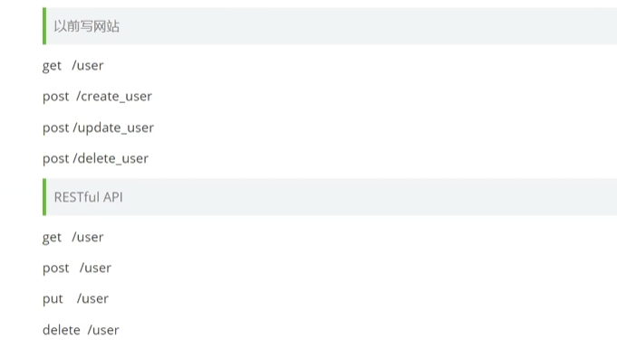

## 快速入门

> 参考：[【狂神说】Gin框架一小时上手 ](https://www.bilibili.com/video/BV1Rd4y1C7A1)


### 1、hello world

安装Gin：go get


写一个get请求，并访问

利用匿名函数func(context *gin.Context)，返回context对象

补充：配置favicon，用于显示图标


### 2、restful api

以前写网站，get、post等对应不同的url，现在一个url，使用不同方法（get、post、put、delete）实现不同效果。



基于Gin实现restful api的四种请求，非常简易，四行代码即可

```
TODO
```


### 3、响应页面

1）响应一个页面给前端

这里利用ginServer.LoadHTMLGlob加载静态页面


补充，两种方法的区别：

- LoadHTMLGlob
- LoadHTMLFiles


2）加载资源文件

Static方法


### 4、获取请求参数

1）接收前端传过来的参数，并返回给前端一些信息


2）甚至可以直接GET指令中加点参数，直接获取参数


3）前端给后端传递json

interface接口


再比如，拿到前端输入的账号密码，并返回”登录成功“


### 5、路由讲解

基于Redirect实现重定向（301）

基于NoRoute实现404

定义一个userGroup进行路由组管理


### 6、中间件

用于预处理、登录权限、统计耗时等等

案例：设计一个自定义的中间件，后续主要调用了这个中间件，就可以拿到这里的参数


## 项目实战

参考项目：https://github.com/flipped-aurora/gin-vue-admin
