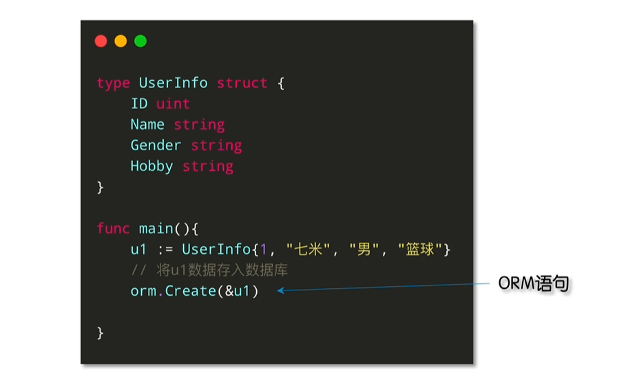
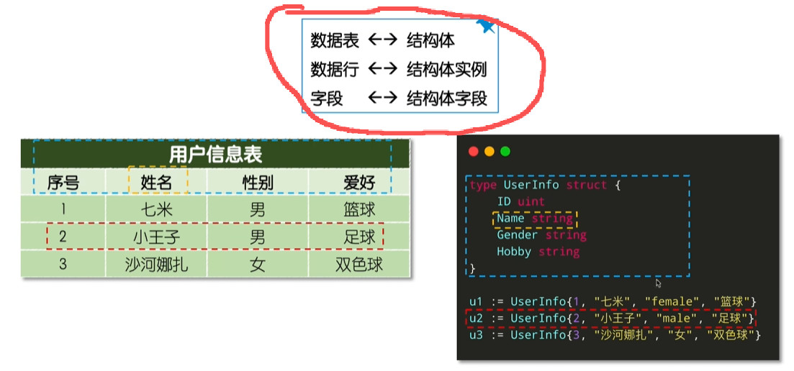

中文官网：[GORM 指南](https://gorm.io/zh_CN/docs/index.html)

参考李文周大佬博客：

- 文字教程：[ GORM1 入门指南](https://www.liwenzhou.com/posts/Go/gorm/)
- 视频教程：
  - GORM2：[GORM教程](https://www.bilibili.com/video/BV1rh4y137GP)
  - GORM1：[【GORM简明教程】关于GORM你看这一个就够了](https://www.bilibili.com/video/BV1U7411V78R)

建议直接跟着官方文档敲一遍即可，下述为GORM2相关实践。


## 入门指北

### 1、概述

什么是ORM：

- Object 对象：程序中的对象/实例，例如Go中的结构体示例
- Releational 关系：关系数据库，如MySQL
- Mapping 映射


不用再写SQL，写ORM语句（会被翻译为SQL）：



ORM可以理解为三个映射关系：比如，这里的用户信息表对应Golang中的结构体



ORM优缺点：提高开发效率，牺牲执行性能与灵活性。


#### 1）Traditional API vs Generics API

GORM 自 1.x 至 2.x 一直使用Traditional API，GORM 在 Go 泛型推出后推出了Generics API。

对比1：

| 特性         | Traditional API   | Generics API                        |
| ------------ | ----------------- | ----------------------------------- |
| **模型类型** | 运行时确定        | 编译期确定（泛型）                  |
| **查询条件** | 字符串／动态      | 强类型表达式（Where(u.Age.Gt(18))） |
| **自动补全** | 差                | 完全由生成代码提供                  |
| **字段检查** | 运行时报错        | 编译期报错                          |
| **易用性**   | 简单、经典        | 初次使用略复杂                      |
| **推荐场景** | 小项目、简单 CRUD | 大型项目、复杂业务、追求类型安全    |

对比2：

| **特性**                        | **Generics API (>= v1.30.0)**                                | **Traditional API (所有版本)**                               |
| ------------------------------- | ------------------------------------------------------------ | ------------------------------------------------------------ |
| **类型安全 (Type Safety)**      | **强**。通过 `gorm.G[T](db)` 绑定模型 `T`，查询和操作的结果类型是**确定的**。 | **弱**。通常需要在操作（如 `Find`）中传入具体的结构体指针或在操作前使用 `db.Model(&Model{})` 绑定模型，依赖 `interface{}` 和运行时反射。 |
| **模型绑定 (Model Binding)**    | **显式且提前**。通过 `gorm.G[T](db)` 在开始链式调用前指定模型类型 `T`。 | **灵活但分散**。可以在链式调用中使用 `db.Model(&Model{})` 或在操作（如 `Create`, `Find`）中传入结构体指针。 |
| **SQL 污染 (SQL Pollution)**    | **减轻**。每个 `gorm.G[T](db)` 都会创建一个针对模型 `T` 的操作上下文，有助于减少重用 `*gorm.DB` 实例时可能出现的**状态/SQL 污染**问题。 | **存在风险**。直接重用 `*gorm.DB` 实例进行链式查询，如果不注意，可能会导致前一个查询的 `Where` 等条件影响到下一个查询。 |
| **代码示例 (Example)**          | `gorm.G[User](db).Where("age = ?", 18).Find(&users)`         | `db.Where("age = ?", 18).Find(&users)` 或   `db.Model(&User{}).Where("age = ?", 18).Find(&users)` |
| **API 移除 (Removed APIs)**     | 为了避免歧义和并发问题，**移除了**一些 API，例如 `FirstOrCreate` 和 `Save`。 | **完整保留** GORM 的所有传统 API。                           |
| **方法签名 (Method Signature)** | 许多方法的返回类型是**强类型**（例如，`Find` 直接返回 `[]T` 和 `error`），而不是返回 `*gorm.DB`（需要再调用 `Find`）。 | 核心方法如 `Where`, `Find` 等通常返回 `*gorm.DB` 实例以支持链式调用，并将结果写入传入的指针。 |

关联：

- 都基于同一个 GORM 引擎：Generics API 只是对 GORM Core 的封装。底层最终还是 `*gorm.DB`
- 可以混用：你可以在同一个项目中同时使用两者
- 都使用相同的数据库连接、事务、配置：用户可以自由在两套 API 之间切换


#### 2）快速开始

接下来就是直接按官方文档的教程走了，安装：

```go
go get -u gorm.io/gorm
go get -u gorm.io/driver/sqlite
```

Generics API (>= v1.30.0)案例代码：官方代码存在些许小问题（多变量赋值问题、结果打印、运行前清理数据），下述为修改后的代码

```go
package main

import (
	"context"
	"fmt"

	"gorm.io/driver/sqlite"
	"gorm.io/gorm"
)

// Product 结构体定义了数据库表结构
type Product struct {
	gorm.Model
	Code  string
	Price uint
}

func main() {
	// Step1：连接到 SQLite 数据库
	db, err := gorm.Open(sqlite.Open("test.db"), &gorm.Config{})
	if err != nil {
		panic("failed to connect database")
	}

	// 创建一个后台 context，用于传递给 GORM 的操作
	ctx := context.Background()

	// Migrate the schema(迁移数据库结构)
	db.AutoMigrate(&Product{}) // AutoMigrate 会根据 Product 结构体自动创建或更新对应的数据库表

	// ⚡️ 新增：在每次运行前清理数据 (物理删除)
	// AllowGlobalUpdate: true 允许在没有 where 条件下执行删除
	db.Session(&gorm.Session{AllowGlobalUpdate: true}).Unscoped().Delete(&Product{})
	db.Exec("DELETE FROM sqlite_sequence WHERE name='products'") // ⚡️ (可选但推荐) 重置 SQLite 自增计数器，确保新的记录 ID 从 1 开始

	// Step2：Create：Create(ctx, ...) 插入一条新记录
	err = gorm.G[Product](db).Create(ctx, &Product{Code: "D42", Price: 100}) // gorm.G[Product](db) 是 GORM V2 推荐的强类型查询方式
	if err != nil {
		fmt.Printf("Create error: %v\n", err)
	}

	// Step3：Read
	product, err := gorm.G[Product](db).Where("id = ?", 1).First(ctx) // find product with integer primary key
	if err != nil {
		fmt.Printf("First error: %v\n", err)
	}

	products, err := gorm.G[Product](db).Where("code = ?", "D42").Find(ctx) // find product with code D42
	if err != nil {
		fmt.Printf("Find error: %v\n", err)
	}
	fmt.Printf("Found %d products with code D42.\n", len(products)) // 解决官方代码中 products 变量未使用的警告，可以将其打印出来

	// Step4：Update：update product's price to 200
	// 注意：返回了多个值，但官方代码中仅接收了一个err，所以后续代码通过 result 或者 _ 来接收所有值
	result, err := gorm.G[Product](db).Where("id = ?", product.ID).Update(ctx, "Price", 200) // 注意使用 := （声明 + 赋值）而非 = （赋值）
	if err != nil {
		fmt.Printf("Update error: %v\n", err)
	} else {
		fmt.Printf("Update operation successful. Rows affected: %d\n", result)
	}

	// Update - update multiple fields
	_, err = gorm.G[Product](db).Where("id = ?", product.ID).Updates(ctx, Product{Code: "D42", Price: 100}) // 使用 下划线 _ 来忽略你不关心的第一个返回值
	if err != nil {
		fmt.Printf("Update error: %v\n", err)
	}

	// Delete - delete product
	_, err = gorm.G[Product](db).Where("id = ?", product.ID).Delete(ctx)
	if err != nil {
		fmt.Printf("Update error: %v\n", err)
	}
}

```

示例结果：

```go
Found 1 products with code D42.
Update operation successful. Rows affected: 1
```


Traditional API示例代码：

```go
package main

import (
	"fmt"

	"gorm.io/driver/sqlite"
	"gorm.io/gorm"
)

type Product struct {
	gorm.Model
	Code  string
	Price uint
}

func main() {
	db, err := gorm.Open(sqlite.Open("test.db"), &gorm.Config{})
	if err != nil {
		panic("failed to connect database")
	}

	// Migrate the schema
	db.AutoMigrate(&Product{})

	// Create
	db.Create(&Product{Code: "D42", Price: 100})

	// Read
	var product Product
	db.First(&product, 1) // find product with integer primary key
	fmt.Printf("product: %+v\n", product)
	db.First(&product, "code = ?", "D42") // find product with code D42
	fmt.Printf("product: %+v\n", product)

	// Update - update product's price to 200
	db.Debug().Model(&product).Update("Price", 200) // 可以直接在db后加上Debug()来查看执行的SQL语句
	// Update - update multiple fields
	db.Model(&product).Updates(Product{Price: 200, Code: "F42"}) // non-zero fields
	db.Model(&product).Updates(map[string]interface{}{"Price": 200, "Code": "F42"})

	// Delete - delete product
	db.Delete(&product, 1)
}

```

示例结果：

```go
product: {Model:{ID:0 CreatedAt:0001-01-01 00:00:00 +0000 UTC UpdatedAt:0001-01-01 00:00:00 +0000 UTC DeletedAt:{Time:0001-01-01 00:00:00 +0000 UTC Valid:false}} Code: Price:0}
product: {Model:{ID:4 CreatedAt:2025-11-17 09:56:41.033382054 +0800 +0800 UpdatedAt:2025-11-17 09:56:41.033382054 +0800 +0800 DeletedAt:{Time:0001-01-01 00:00:00 +0000 UTC Valid:false}} Code:D42 Price:100}

[1.321ms] [rows:1] UPDATE `products` SET `price`=200,`updated_at`="2025-11-17 09:56:41.038" WHERE `products`.`deleted_at` IS NULL AND `id` = 4
```


### 2、声明模型

具体内容，参考官网原文：https://gorm.io/zh_CN/docs/models.html


## CRUD接口

下述代码，以MySQL数据库为例，其他数据库均可，参考官网：[连接到数据库](https://gorm.io/zh_CN/docs/connecting_to_the_database.html)。

基于docker拉取并运行mtsql容器：

```bash
docker run -d \
  --name mysql-study-gorm \
  -e MYSQL_ROOT_PASSWORD=123456 \
  -e MYSQL_DATABASE=gorm_db \
  -e MYSQL_USER=user \
  -e MYSQL_PASSWORD=123456 \
  -p 3309:3306 \
  mysql:8.0
```

测试：

```bash
docker exec -it mysql-study-gorm /bin/bash
mysql -u user -p

# 后续创建表后，用于检查的示例sql
USE gorm_db;
# 检查表结构
DESCRIBE users;
# 检查数据内容
SELECT * FROM users;
# 删除所有users数据
DELETE FROM users;

# 退出mysql客户端
EXIT;
# 退出docker容器
exit
```

安装依赖：

```go
go get gorm.io/driver/mysql
```

测试连接：

```go
package main

import (
	"log"
	"time"

	"gorm.io/driver/mysql"
	"gorm.io/gorm"
)

// User 定义模型结构体，GORM 会默认使用结构体名的复数形式作为表名: "users"
type User struct {
	ID        uint `gorm:"primaryKey"`
	Name      string
	Age       int
	Birthday  time.Time
	CreatedAt time.Time
	UpdatedAt time.Time
}

func main() {
	// 数据库连接 DSN (Data Source Name)
	// user:pass@tcp(127.0.0.1:3306)/dbname?charset=utf8mb4&parseTime=True&loc=Local
	// 这里的 dbname 替换为 gorm_db
	dsn := "user:123456@tcp(127.0.0.1:3309)/gorm_db?charset=utf8mb4&parseTime=True&loc=Local"

	// 1. 连接数据库
	_, err := gorm.Open(mysql.Open(dsn), &gorm.Config{})
	if err != nil {
		log.Fatalf("无法连接到数据库: %v", err)
	}

	log.Println("数据库连接成功！")
}

```

示例结果：

```go
2025/11/17 14:11:46 数据库连接成功！
```


### 1、创建

示例代码：

```go
package main

import (
	"context"
	"log"
	"time"

	"gorm.io/driver/mysql"
	"gorm.io/gorm"
)

// User 定义模型结构体
type User struct {
	ID        uint `gorm:"primaryKey"`
	Name      string
	Age       int
	Birthday  time.Time
	CreatedAt time.Time
	UpdatedAt time.Time
}

// 清空 users 表
func clearTable(db *gorm.DB, tableName string) error {
	log.Printf("正在清空表: %s", tableName)
	result := db.Exec("TRUNCATE TABLE " + tableName)
	if result.Error != nil {
		log.Printf("清空表 %s 失败: %v", tableName, result.Error)
	} else {
		log.Printf("清空表 %s 成功。", tableName)
	}
	return result.Error
}

func main() {
	// 数据库连接
	dsn := "user:123456@tcp(127.0.0.1:3309)/gorm_db?charset=utf8mb4&parseTime=True&loc=Local"

	db, err := gorm.Open(mysql.Open(dsn), &gorm.Config{})
	if err != nil {
		log.Fatalf("无法连接到数据库: %v", err)
	}
	log.Println("数据库连接成功！")

	// 迁移
	err = db.AutoMigrate(&User{})
	if err != nil {
		log.Fatalf("数据库迁移失败: %v", err)
	}
	log.Println("表结构迁移成功。")

	// 创建 context
	ctx := context.Background()

	// 清空表
	err = clearTable(db, "users")
	if err != nil {
		return
	}

	// --- 创建记录 ---
	user1 := User{Name: "Jinzhu", Age: 18, Birthday: time.Now()}

	err = gorm.G[User](db).Create(ctx, &user1)
	if err != nil {
		log.Fatalf("创建记录失败: %v", err)
	}
	log.Printf("记录创建成功! 插入的ID: %d, 姓名: %s", user1.ID, user1.Name)

	// --- 查询所有记录 ---
	users, err := gorm.G[User](db).Find(ctx)
	if err != nil {
		log.Fatalf("查询所有记录失败: %v", err)
	}
	log.Printf("查询到 %d 条记录:", len(users))

	for _, u := range users {
		log.Printf("ID: %d, Name: %s, Age: %d", u.ID, u.Name, u.Age)
	}

	// --- 查询第一条 Age=18 的记录 ---
	firstUser, err := gorm.G[User](db).Where("age = ?", 18).First(ctx)
	if err != nil {
		if err == gorm.ErrRecordNotFound {
			log.Println("未找到 Age 为 18 的记录")
		} else {
			log.Fatalf("查询第一条记录失败: %v", err)
		}
	} else {
		log.Printf("查询到第一条 Age=18 的记录: ID: %d, Name: %s", firstUser.ID, firstUser.Name)
	}
}

```

示例结果：

```go
$ go run main.go 
2025/11/17 14:42:30 数据库连接成功！
2025/11/17 14:42:30 表结构迁移成功。
2025/11/17 14:42:30 正在清空表: users
2025/11/17 14:42:30 清空表 users 成功。
2025/11/17 14:42:30 记录创建成功! 插入的ID: 1, 姓名: Jinzhu
2025/11/17 14:42:30 查询到 1 条记录:
2025/11/17 14:42:30 ID: 1, Name: Jinzhu, Age: 18
2025/11/17 14:42:30 查询到第一条 Age=18 的记录: ID: 1, Name: Jinzhu
```

也可以进入mysql容器检查一下：

```go
mysql> DESCRIBE users;
+------------+-----------------+------+-----+---------+----------------+
| Field      | Type            | Null | Key | Default | Extra          |
+------------+-----------------+------+-----+---------+----------------+
| id         | bigint unsigned | NO   | PRI | NULL    | auto_increment |
| name       | longtext        | YES  |     | NULL    |                |
| age        | bigint          | YES  |     | NULL    |                |
| birthday   | datetime(3)     | YES  |     | NULL    |                |
| created_at | datetime(3)     | YES  |     | NULL    |                |
| updated_at | datetime(3)     | YES  |     | NULL    |                |
+------------+-----------------+------+-----+---------+----------------+
6 rows in set (0.01 sec)

mysql> SELECT * FROM users;
+----+--------+------+-------------------------+-------------------------+-------------------------+
| id | name   | age  | birthday                | created_at              | updated_at              |
+----+--------+------+-------------------------+-------------------------+-------------------------+
|  1 | Jinzhu |   18 | 2025-11-17 14:42:30.130 | 2025-11-17 14:42:30.131 | 2025-11-17 14:42:30.131 |
+----+--------+------+-------------------------+-------------------------+-------------------------+
1 row in set (0.00 sec)
```


补充：

- 关于`关联创建`，在大型项目中使用较少
- 关于`默认值`
  - 类似`gorm:"default:galeone"`格式要写对
  -  `0`, `''`, `false`等是不会存入数据库的，如果一定要存，可以用指针等方式


### 2、查询

示例代码:

```go
package main

import (
	"context"
	"log"
	"time"

	"gorm.io/driver/mysql"
	"gorm.io/gorm"
)

// User 模型
type User struct {
	ID        uint `gorm:"primaryKey"`
	Name      string
	Age       int
	Birthday  time.Time
	CreatedAt time.Time
	UpdatedAt time.Time
}

func clearTable(db *gorm.DB, tableName string) error {
	log.Printf("正在清空表: %s", tableName)
	result := db.Exec("TRUNCATE TABLE " + tableName)
	if result.Error != nil {
		log.Printf("清空表 %s 失败: %v", tableName, result.Error)
	} else {
		log.Printf("清空表 %s 成功。", tableName)
	}
	return result.Error
}

func main() {
	dsn := "user:123456@tcp(127.0.0.1:3309)/gorm_db?charset=utf8mb4&parseTime=True&loc=Local"
	db, err := gorm.Open(mysql.Open(dsn), &gorm.Config{})
	if err != nil {
		log.Fatalf("无法连接到数据库: %v", err)
	}
	log.Println("数据库连接成功！")

	if err := db.AutoMigrate(&User{}); err != nil {
		log.Fatalf("数据库迁移失败: %v", err)
	}

	ctx := context.Background()
	if err := clearTable(db, "users"); err != nil {
		return
	}
	log.Println("清空表成功！")

	// --- 创建记录 ---
	user1 := User{Name: "Jinzhu", Age: 18, Birthday: time.Now()}
	if err := gorm.G[User](db).Create(ctx, &user1); err != nil {
		log.Fatalf("创建记录失败: %v", err)
	}
	log.Printf("记录创建成功! 插入的ID: %d, 姓名: %s", user1.ID, user1.Name)

	// 再插入一些测试数据
	user2 := User{Name: "Alice", Age: 20, Birthday: time.Now().AddDate(-20, 0, 0)}
	user3 := User{Name: "Bob", Age: 18, Birthday: time.Now().AddDate(-18, 0, 0)}
	if err := gorm.G[User](db).Create(ctx, &user2); err != nil {
		log.Fatalf("创建 user2 失败: %v", err)
	}
	if err := gorm.G[User](db).Create(ctx, &user3); err != nil {
		log.Fatalf("创建 user3 失败: %v", err)
	}

	// --- 查询所有记录 ---
	users, err := gorm.G[User](db).Find(ctx)
	if err != nil {
		log.Fatalf("查询所有记录失败: %v", err)
	}
	log.Printf("查询到 %d 条记录:", len(users))
	for _, u := range users {
		log.Printf("ID: %d, Name: %s, Age: %d", u.ID, u.Name, u.Age)
	}

	// --- 链式条件查询 ---
	// 示例：找出 Age = 18 且 Name != "Bob" 的记录
	adultUsers18NotBob, err := gorm.G[User](db).
		Where("age = ?", 18).
		Where("name <> ?", "Bob").
		Find(ctx)
	if err != nil {
		log.Fatalf("条件查询失败: %v", err)
	}
	log.Printf("Age=18 且 name != Bob 的记录有 %d 条", len(adultUsers18NotBob))
	for _, u := range adultUsers18NotBob {
		log.Printf(" -> ID: %d, Name: %s", u.ID, u.Name)
	}

	// --- 检索单个对象（First） ---
	firstUser18, err := gorm.G[User](db).Where("age = ?", 18).First(ctx)
	if err != nil {
		if err == gorm.ErrRecordNotFound {
			log.Println("未找到 Age = 18 的记录 (First)")
		} else {
			log.Fatalf("First 查询失败: %v", err)
		}
	} else {
		log.Printf("First 年龄 18: ID=%d, Name=%s", firstUser18.ID, firstUser18.Name)
	}

	// --- 使用 Take（不按主键排序，只取一条） ---
	// 如果你不在乎是哪一条，只想随便拿一条 age = 18
	takeUser18, err := gorm.G[User](db).Where("age = ?", 18).Take(ctx)
	if err != nil {
		log.Fatalf("Take 查询失败: %v", err)
	}
	log.Printf("Take 年龄 18: ID=%d, Name=%s", takeUser18.ID, takeUser18.Name)

	// --- 指定要查询的字段（Select） ---
	// 例如，只查询 Name 和 Age，不查询 Birthday、CreatedAt 等
	// 注意：对于泛型 API，我们先构建查询，再调用 Find 或 First
	usersSelected, err := gorm.G[User](db).
		Select("name", "age").
		Where("age >= ?", 18).
		Find(ctx)
	if err != nil {
		log.Fatalf("Select 查询失败: %v", err)
	}

	for _, u := range usersSelected {
		log.Printf("Name=%s Age=%d", u.Name, u.Age)
	}

	// --- 使用 IN 查询 (主键 IN) ---
	// 假设我们想查 id = 1,3 的用户
	idsToQuery := []uint{1, 3}
	usersByID, err := gorm.G[User](db).Where("id IN ?", idsToQuery).Find(ctx)
	if err != nil {
		log.Fatalf("IN 查询失败: %v", err)
	}
	log.Printf("ID 在 %v 中的用户有 %d 条", idsToQuery, len(usersByID))
	for _, u := range usersByID {
		log.Printf(" → ID: %d, Name: %s", u.ID, u.Name)
	}

	// --- 排序 + 限制（Order + Limit） ---
	// 查询所有用户，按年龄降序，只取前 2 条
	top2Oldest, err := gorm.G[User](db).
		Order("age desc").
		Limit(2).
		Find(ctx)
	if err != nil {
		log.Fatalf("排序 + 限制 查询失败: %v", err)
	}
	log.Println("年龄最大的前 2 人:")
	for _, u := range top2Oldest {
		log.Printf(" → ID: %d, Name: %s, Age: %d", u.ID, u.Name, u.Age)
	}

	// --- 组合 OR 条件查询 ---
	// 找 name = "Alice" 或 age = 18 的用户
	orUsers, err := gorm.G[User](db).
		Where("name = ?", "Alice").
		Or("age = ?", 18).
		Find(ctx)
	if err != nil {
		log.Fatalf("OR 查询失败: %v", err)
	}
	log.Printf("name = Alice 或 age = 18 的用户有 %d 条", len(orUsers))
	for _, u := range orUsers {
		log.Printf(" → ID: %d, Name: %s, Age: %d", u.ID, u.Name, u.Age)
	}
}

```

示例结果：

```go
$ go run main.go 
2025/11/17 15:10:59 数据库连接成功！
2025/11/17 15:10:59 正在清空表: users
2025/11/17 15:10:59 清空表 users 成功。
2025/11/17 15:10:59 清空表成功！
2025/11/17 15:10:59 记录创建成功! 插入的ID: 1, 姓名: Jinzhu
2025/11/17 15:10:59 查询到 3 条记录:
2025/11/17 15:10:59 ID: 1, Name: Jinzhu, Age: 18
2025/11/17 15:10:59 ID: 2, Name: Alice, Age: 20
2025/11/17 15:10:59 ID: 3, Name: Bob, Age: 18
2025/11/17 15:10:59 Age=18 且 name != Bob 的记录有 1 条
2025/11/17 15:10:59  -> ID: 1, Name: Jinzhu
2025/11/17 15:10:59 First 年龄 18: ID=1, Name=Jinzhu
2025/11/17 15:10:59 Take 年龄 18: ID=1, Name=Jinzhu
2025/11/17 15:10:59 Name=Jinzhu Age=18
2025/11/17 15:10:59 Name=Alice Age=20
2025/11/17 15:10:59 Name=Bob Age=18
2025/11/17 15:10:59 ID 在 [1 3] 中的用户有 2 条
2025/11/17 15:10:59  → ID: 1, Name: Jinzhu
2025/11/17 15:10:59  → ID: 3, Name: Bob
2025/11/17 15:10:59 年龄最大的前 2 人:
2025/11/17 15:10:59  → ID: 2, Name: Alice, Age: 20
2025/11/17 15:10:59  → ID: 1, Name: Jinzhu, Age: 18
2025/11/17 15:10:59 name = Alice 或 age = 18 的用户有 3 条
2025/11/17 15:10:59  → ID: 1, Name: Jinzhu, Age: 18
2025/11/17 15:10:59  → ID: 2, Name: Alice, Age: 20
2025/11/17 15:10:59  → ID: 3, Name: Bob, Age: 18
```

验证：

```go
mysql> SELECT * FROM users;
+----+--------+------+-------------------------+-------------------------+-------------------------+
| id | name   | age  | birthday                | created_at              | updated_at              |
+----+--------+------+-------------------------+-------------------------+-------------------------+
|  1 | Jinzhu |   18 | 2025-11-17 15:10:59.535 | 2025-11-17 15:10:59.536 | 2025-11-17 15:10:59.536 |
|  2 | Alice  |   20 | 2005-11-17 15:10:59.540 | 2025-11-17 15:10:59.540 | 2025-11-17 15:10:59.540 |
|  3 | Bob    |   18 | 2007-11-17 15:10:59.540 | 2025-11-17 15:10:59.542 | 2025-11-17 15:10:59.542 |
+----+--------+------+-------------------------+-------------------------+-------------------------+
3 rows in set (0.00 sec)
```


### 3、高级查询

示例代码：

```go
package main

import (
	"context"
	"database/sql"
	"log"
	"time"

	"gorm.io/driver/mysql"
	"gorm.io/gorm"
	"gorm.io/gorm/clause"
)

// User 模型
type User struct {
	ID        uint `gorm:"primaryKey"`
	Name      string
	Age       int
	Birthday  time.Time
	CreatedAt time.Time
	UpdatedAt time.Time
}

// Scope: 常用查询条件封装
func ScopeAdult(db *gorm.DB) *gorm.DB {
	return db.Where("age >= ?", 18)
}

func ScopeName(name string) func(*gorm.DB) *gorm.DB {
	return func(db *gorm.DB) *gorm.DB {
		return db.Where("name = ?", name)
	}
}

func clearTable(db *gorm.DB, tableName string) error {
	log.Printf("正在清空表: %s", tableName)
	return db.Exec("TRUNCATE TABLE " + tableName).Error
}

func main() {
	// 连接 DB
	dsn := "user:123456@tcp(127.0.0.1:3309)/gorm_db?charset=utf8mb4&parseTime=True&loc=Local"
	db, err := gorm.Open(mysql.Open(dsn), &gorm.Config{})
	if err != nil {
		log.Fatalf("无法连接到数据库: %v", err)
	}
	log.Println("数据库连接成功")

	// 自动迁移
	if err := db.AutoMigrate(&User{}); err != nil {
		log.Fatalf("迁移失败: %v", err)
	}

	ctx := context.Background()
	if err := clearTable(db, "users"); err != nil {
		log.Fatalf("清空表失败: %v", err)
	}

	// === 批量插入（Batch Create） ===
	usersToInsert := []User{
		{Name: "Jinzhu", Age: 18, Birthday: time.Now().AddDate(-18, 0, 0)},
		{Name: "Alice", Age: 20, Birthday: time.Now().AddDate(-20, 0, 0)},
		{Name: "Bob", Age: 18, Birthday: time.Now().AddDate(-18, 0, 0)},
		{Name: "Charlie", Age: 25, Birthday: time.Now().AddDate(-25, 0, 0)},
	}
	// 泛型 API 目前不直接支持批量 Create(ctx, slice)，
	// 所以这里使用传统 API 来批量插入，这样更高效。
	if err := db.Create(&usersToInsert).Error; err != nil {
		log.Fatalf("批量插入失败: %v", err)
	}
	log.Printf("批量插入 %d 条记录成功", len(usersToInsert))

	// === 高级查询示例 ===

	// 1) **聚合 + Group + Having**：按名字分组，统计每个名字的人数 (count)，然后只返回人数超过 1 的名字
	type NameCount struct {
		Name  string
		Count int64
	}
	var nameCounts []NameCount
	// 使用子查询做 having
	subQ := db.Model(&User{}).
		Select("name, COUNT(*) as cnt").
		Group("name").
		Having("COUNT(*) > ?", 1)
	// 用 subQ 构造最终查询
	err = db.Model(&User{}).
		Table("(?) as u", subQ).
		Select("u.name, u.cnt as count").
		Scan(&nameCounts).Error
	if err != nil {
		log.Fatalf("Group + Having 查询失败: %v", err)
	}
	for _, nc := range nameCounts {
		log.Printf("名字 %s 的人有 %d 个", nc.Name, nc.Count)
	}

	// 2) **子查询过滤**：找出年龄大于平均年龄的用户
	// 先构造子查询：平均年龄
	avgAgeSub := db.Model(&User{}).Select("AVG(age)").Table("users")
	var olderUsers []User
	// 使用泛型 API 查询
	olderUsers, err = gorm.G[User](db).
		Where("age > (?)", avgAgeSub).
		Find(ctx)
	if err != nil {
		log.Fatalf("子查询(age > avgAge) 查询失败: %v", err)
	}
	log.Printf("年龄大于平均年龄的用户: %d 个", len(olderUsers))
	for _, u := range olderUsers {
		log.Printf(" → ID=%d, Name=%s, Age=%d", u.ID, u.Name, u.Age)
	}

	// 3) **锁 (Locking)** 示例：在事务里读并锁定行
	err = db.Transaction(func(tx *gorm.DB) error {
		var lockedUsers []User
		// 加 “UPDATE” 锁（悲观锁）
		err2 := tx.Clauses(clause.Locking{Strength: "UPDATE"}).
			Where("age >= ?", 18).
			Find(&lockedUsers).Error
		if err2 != nil {
			return err2
		}
		log.Printf("事务中锁定了 %d 条成年用户记录", len(lockedUsers))

		// 假设我们在事务中修改这些记录
		// 为了不影响后续程序的运行，注释了如下修改命名的部分，你也可以消除注释运行一下，表中的人物命名会发生变化
		// for _, u := range lockedUsers {
		// 	u.Name = u.Name + "_locked"
		// 	if err := tx.Save(&u).Error; err != nil {
		// 		return err
		// 	}
		// }

		return nil
	})
	if err != nil {
		log.Fatalf("带锁事务失败: %v", err)
	}
	log.Println("锁 + 事务示例完成")

	// 4) **Pluck**：提取某一列所有值
	var allNames []string
	// 这里用传统 API，Pluck 在泛型 API 中目前不如传统 API 常用
	if err := db.Model(&User{}).Pluck("name", &allNames).Error; err != nil {
		log.Fatalf("Pluck 查询失败: %v", err)
	}
	log.Printf("所有用户名字：%v", allNames)

	// 5) **Scopes**：重用定义好的 Scope
	var adultUsers []User
	err = db.Model(&User{}).Scopes(ScopeAdult).Find(&adultUsers).Error
	if err != nil {
		log.Fatalf("查询失败：%v", err)
	}
	log.Printf("成年人数量: %d", len(adultUsers))

	var aliceAdults []User
	err = db.Model(&User{}).Scopes(ScopeAdult, ScopeName("Alice")).Find(&aliceAdults).Error
	if err != nil {
		log.Fatalf("查询失败：%v", err)
	}
	log.Printf("名字为 Alice 且为成年人的数量: %d", len(aliceAdults))

	// 6) **分批查询 (FindInBatches)**：如果用户非常多，用分批方式处理
	const batchSize = 2
	var batchUsers []User
	// 传统 API 分批查询
	err = db.Where("age >= ?", 18).
		FindInBatches(&batchUsers, batchSize, func(tx *gorm.DB, batch int) error {
			log.Printf("处理第 %d 批，共 %d 条记录", batch, len(batchUsers))
			for _, u := range batchUsers {
				log.Printf(" → 批次用户：ID=%d, Name=%s, Age=%d", u.ID, u.Name, u.Age)
			}
			return nil
		}).Error
	if err != nil {
		log.Fatalf("FindInBatches 失败: %v", err)
	}

	// 7) **命名参数（Named 参数查询）**：提高可读性
	var someUsers []User
	err = db.Where("name = @name AND age = @age",
		sql.Named("name", "Bob"),
		sql.Named("age", 18),
	).Find(&someUsers).Error
	if err != nil {
		log.Fatalf("命名参数查询失败: %v", err)
	}
	log.Printf("名字为 Bob 且 age = 18 的用户有 %d 个", len(someUsers))
	for _, u := range someUsers {
		log.Printf(" → ID=%d, Name=%s, Age=%d", u.ID, u.Name, u.Age)
	}
}

```

示例结果：

```go
$ go run main.go 
2025/11/17 15:56:19 数据库连接成功
2025/11/17 15:56:19 正在清空表: users
2025/11/17 15:56:19 批量插入 4 条记录成功
2025/11/17 15:56:19 年龄大于平均年龄的用户: 1 个
2025/11/17 15:56:19  → ID=4, Name=Charlie, Age=25
2025/11/17 15:56:19 事务中锁定了 4 条成年用户记录
2025/11/17 15:56:19 锁 + 事务示例完成
2025/11/17 15:56:19 所有用户名字：[Jinzhu Alice Bob Charlie]
2025/11/17 15:56:19 成年人数量: 4
2025/11/17 15:56:19 名字为 Alice 且为成年人的数量: 1
2025/11/17 15:56:19 处理第 1 批，共 2 条记录
2025/11/17 15:56:19  → 批次用户：ID=1, Name=Jinzhu, Age=18
2025/11/17 15:56:19  → 批次用户：ID=2, Name=Alice, Age=20
2025/11/17 15:56:19 处理第 2 批，共 2 条记录
2025/11/17 15:56:19  → 批次用户：ID=3, Name=Bob, Age=18
2025/11/17 15:56:19  → 批次用户：ID=4, Name=Charlie, Age=25
2025/11/17 15:56:19 名字为 Bob 且 age = 18 的用户有 1 个
2025/11/17 15:56:19  → ID=3, Name=Bob, Age=18
```

检查数据库：

```go
mysql> SELECT * FROM users;
+----+---------+------+-------------------------+-------------------------+-------------------------+
| id | name    | age  | birthday                | created_at              | updated_at              |
+----+---------+------+-------------------------+-------------------------+-------------------------+
|  1 | Jinzhu  |   18 | 2007-11-17 15:56:19.359 | 2025-11-17 15:56:19.360 | 2025-11-17 15:56:19.360 |
|  2 | Alice   |   20 | 2005-11-17 15:56:19.359 | 2025-11-17 15:56:19.360 | 2025-11-17 15:56:19.360 |
|  3 | Bob     |   18 | 2007-11-17 15:56:19.359 | 2025-11-17 15:56:19.360 | 2025-11-17 15:56:19.360 |
|  4 | Charlie |   25 | 2000-11-17 15:56:19.359 | 2025-11-17 15:56:19.360 | 2025-11-17 15:56:19.360 |
+----+---------+------+-------------------------+-------------------------+-------------------------+
4 rows in set (0.01 sec)
```

如果将原代码中，`锁 (Locking)`相关代码解除注释，会变成：

```go
$ go run main.go 
2025/11/17 15:59:21 数据库连接成功
2025/11/17 15:59:21 正在清空表: users
2025/11/17 15:59:21 批量插入 4 条记录成功
2025/11/17 15:59:21 年龄大于平均年龄的用户: 1 个
2025/11/17 15:59:21  → ID=4, Name=Charlie, Age=25
2025/11/17 15:59:21 事务中锁定了 4 条成年用户记录
2025/11/17 15:59:21 锁 + 事务示例完成
2025/11/17 15:59:21 所有用户名字：[Jinzhu_locked Alice_locked Bob_locked Charlie_locked]
2025/11/17 15:59:21 成年人数量: 4
2025/11/17 15:59:21 名字为 Alice 且为成年人的数量: 0
2025/11/17 15:59:21 处理第 1 批，共 2 条记录
2025/11/17 15:59:21  → 批次用户：ID=1, Name=Jinzhu_locked, Age=18
2025/11/17 15:59:21  → 批次用户：ID=2, Name=Alice_locked, Age=20
2025/11/17 15:59:21 处理第 2 批，共 2 条记录
2025/11/17 15:59:21  → 批次用户：ID=3, Name=Bob_locked, Age=18
2025/11/17 15:59:21  → 批次用户：ID=4, Name=Charlie_locked, Age=25
2025/11/17 15:59:21 名字为 Bob 且 age = 18 的用户有 0 个
```

检查数据库：

```go
mysql> SELECT * FROM users;
+----+----------------+------+-------------------------+-------------------------+-------------------------+
| id | name           | age  | birthday                | created_at              | updated_at              |
+----+----------------+------+-------------------------+-------------------------+-------------------------+
|  1 | Jinzhu_locked  |   18 | 2007-11-17 15:59:21.435 | 2025-11-17 15:59:21.435 | 2025-11-17 15:59:21.442 |
|  2 | Alice_locked   |   20 | 2005-11-17 15:59:21.435 | 2025-11-17 15:59:21.435 | 2025-11-17 15:59:21.443 |
|  3 | Bob_locked     |   18 | 2007-11-17 15:59:21.435 | 2025-11-17 15:59:21.435 | 2025-11-17 15:59:21.443 |
|  4 | Charlie_locked |   25 | 2000-11-17 15:59:21.435 | 2025-11-17 15:59:21.435 | 2025-11-17 15:59:21.444 |
+----+----------------+------+-------------------------+-------------------------+-------------------------+
4 rows in set (0.01 sec)
```


### 4、更新

示例代码：

```go
package main

import (
	"log"
	"time"

	"gorm.io/driver/mysql"
	"gorm.io/gorm"
	"gorm.io/gorm/clause"
)

// User 模型
type User struct {
	ID        uint `gorm:"primaryKey"`
	Name      string
	Age       int
	Birthday  time.Time
	CreatedAt time.Time
	UpdatedAt time.Time
}

func clearTable(db *gorm.DB, tableName string) error {
	log.Printf("正在清空表: %s", tableName)
	return db.Exec("TRUNCATE TABLE " + tableName).Error
}

func main() {
	// 连接 DB
	dsn := "user:123456@tcp(127.0.0.1:3309)/gorm_db?charset=utf8mb4&parseTime=True&loc=Local"
	db, err := gorm.Open(mysql.Open(dsn), &gorm.Config{})
	if err != nil {
		log.Fatalf("无法连接到数据库: %v", err)
	}
	log.Println("数据库连接成功")

	// 自动迁移
	if err := db.AutoMigrate(&User{}); err != nil {
		log.Fatalf("迁移失败: %v", err)
	}

	// ctx := context.Background()

	if err := clearTable(db, "users"); err != nil {
		log.Fatalf("清空表失败: %v", err)
	}

	// === 批量插入示例数据 ===
	users := []User{
		{Name: "Jinzhu", Age: 18, Birthday: time.Now().AddDate(-18, 0, 0)},
		{Name: "Alice", Age: 20, Birthday: time.Now().AddDate(-20, 0, 0)},
		{Name: "Bob", Age: 22, Birthday: time.Now().AddDate(-22, 0, 0)},
	}
	if err := db.Create(&users).Error; err != nil {
		log.Fatalf("插入失败: %v", err)
	}
	log.Printf("插入 %d 条用户记录", len(users))

	// === 更新示例开始 ===

	// 1）Update —— 更新单列
	err = db.Model(&User{}).Where("name = ?", "Alice").
		Update("age", 30).Error
	if err != nil {
		log.Fatalf("Update 单字段失败: %v", err)
	}
	var alice User
	db.Where("name = ?", "Alice").First(&alice)
	log.Printf("[Update] Alice 更新后: %+v", alice)

	// 2）Updates(map) —— 批量更新（忽略零值）
	err = db.Model(&User{}).Where("name = ?", "Bob").
		Updates(map[string]interface{}{"Age": 26, "Name": "Bobby"}).Error
	if err != nil {
		log.Fatalf("Updates(map) 失败: %v", err)
	}
	var bob User
	db.Where("name = ?", "Bobby").First(&bob)
	log.Printf("[Updates(map)] Bobby 更新后: %+v", bob)

	// 3）Updates(struct) + Select —— struct 默认忽略零值，用 Select 强制更新
	updateInfo := User{Age: 0, Name: "Alice_New"} // Age=0 默认不会更新
	err = db.Model(&User{}).Where("id = ?", alice.ID).
		Select("Age", "Name"). // 强制更新这两个字段
		Updates(updateInfo).Error
	if err != nil {
		log.Fatalf("Updates(struct+Select) 失败: %v", err)
	}
	db.First(&alice, alice.ID)
	log.Printf("[Updates(struct+Select)] Alice_New 更新后: %+v", alice)

	// 4）UpdateColumns —— 强制更新零值 + 不触发钩子
	err = db.Model(&User{}).Where("name = ?", "Jinzhu").
		UpdateColumns(map[string]interface{}{"age": 0}).Error
	if err != nil {
		log.Fatalf("UpdateColumns 失败: %v", err)
	}
	var jz User
	db.Where("name = ?", "Jinzhu").First(&jz)
	log.Printf("[UpdateColumns] Jinzhu 更新后: %+v", jz)

	// 5）Update 使用表达式 —— 基于原值增量增加
	err = db.Model(&User{}).Where("name = ?", "Bobby").
		Update("age", gorm.Expr("age + ?", 5)).Error
	if err != nil {
		log.Fatalf("Expr 更新失败: %v", err)
	}
	db.Where("name = ?", "Bobby").First(&bob)
	log.Printf("[Expr] Bobby 年龄增加后: %+v", bob)

	// 6）Save —— 覆盖整行（包括零值）
	alice.Age = 50
	alice.Name = "Alice_Save"
	if err := db.Save(&alice).Error; err != nil {
		log.Fatalf("Save 失败: %v", err)
	}
	db.First(&alice, alice.ID)
	log.Printf("[Save] Alice_Save 更新后: %+v", alice)

	// 7）锁 + 更新（悲观锁）
	err = db.Transaction(func(tx *gorm.DB) error {
		var locked User
		if err := tx.Clauses(clause.Locking{Strength: "UPDATE"}).
			Where("name = ?", "Jinzhu").
			First(&locked).Error; err != nil {
			return err
		}

		locked.Name = "Jinzhu_locked"
		return tx.Save(&locked).Error
	})
	if err != nil {
		log.Fatalf("锁更新失败: %v", err)
	}
	db.Where("name = ?", "Jinzhu_locked").First(&jz)
	log.Printf("[锁 + Save] Jinzhu_locked 更新后: %+v", jz)

	log.Println("所有更新技巧示例执行完毕")
}

```

示例结果：

```go
$ go run main.go 
2025/11/17 16:35:12 数据库连接成功
2025/11/17 16:35:12 正在清空表: users
2025/11/17 16:35:12 插入 3 条用户记录
2025/11/17 16:35:12 [Update] Alice 更新后: {ID:2 Name:Alice Age:30 Birthday:2005-11-17 16:35:12.533 +0800 CST CreatedAt:2025-11-17 16:35:12.534 +0800 CST UpdatedAt:2025-11-17 16:35:12.538 +0800 CST}
2025/11/17 16:35:12 [Updates(map)] Bobby 更新后: {ID:3 Name:Bobby Age:26 Birthday:2003-11-17 16:35:12.533 +0800 CST CreatedAt:2025-11-17 16:35:12.534 +0800 CST UpdatedAt:2025-11-17 16:35:12.541 +0800 CST}
2025/11/17 16:35:12 [Updates(struct+Select)] Alice_New 更新后: {ID:2 Name:Alice_New Age:0 Birthday:2005-11-17 16:35:12.533 +0800 CST CreatedAt:2025-11-17 16:35:12.534 +0800 CST UpdatedAt:2025-11-17 16:35:12.545 +0800 CST}
2025/11/17 16:35:12 [UpdateColumns] Jinzhu 更新后: {ID:1 Name:Jinzhu Age:0 Birthday:2007-11-17 16:35:12.533 +0800 CST CreatedAt:2025-11-17 16:35:12.534 +0800 CST UpdatedAt:2025-11-17 16:35:12.534 +0800 CST}
2025/11/17 16:35:12 [Expr] Bobby 年龄增加后: {ID:3 Name:Bobby Age:31 Birthday:2003-11-17 16:35:12.533 +0800 CST CreatedAt:2025-11-17 16:35:12.534 +0800 CST UpdatedAt:2025-11-17 16:35:12.552 +0800 CST}
2025/11/17 16:35:12 [Save] Alice_Save 更新后: {ID:2 Name:Alice_Save Age:50 Birthday:2005-11-17 16:35:12.533 +0800 CST CreatedAt:2025-11-17 16:35:12.534 +0800 CST UpdatedAt:2025-11-17 16:35:12.556 +0800 CST}
2025/11/17 16:35:12 [锁 + Save] Jinzhu_locked 更新后: {ID:1 Name:Jinzhu_locked Age:0 Birthday:2007-11-17 16:35:12.533 +0800 CST CreatedAt:2025-11-17 16:35:12.534 +0800 CST UpdatedAt:2025-11-17 16:35:12.559 +0800 CST}
2025/11/17 16:35:12 所有更新技巧示例执行完毕
```

检查数据库：

```go
mysql> SELECT * FROM users;
+----+---------------+------+-------------------------+-------------------------+-------------------------+
| id | name          | age  | birthday                | created_at              | updated_at              |
+----+---------------+------+-------------------------+-------------------------+-------------------------+
|  1 | Jinzhu_locked |    0 | 2007-11-17 16:35:12.533 | 2025-11-17 16:35:12.534 | 2025-11-17 16:35:12.559 |
|  2 | Alice_Save    |   50 | 2005-11-17 16:35:12.533 | 2025-11-17 16:35:12.534 | 2025-11-17 16:35:12.556 |
|  3 | Bobby         |   31 | 2003-11-17 16:35:12.533 | 2025-11-17 16:35:12.534 | 2025-11-17 16:35:12.552 |
+----+---------------+------+-------------------------+-------------------------+-------------------------+
3 rows in set (0.00 sec)
```


### 5、删除

示例代码：

```go
package main

import (
	"fmt"
	"log"
	"time"

	"gorm.io/driver/mysql"
	"gorm.io/gorm"
)

// User 模型
type User struct {
	ID        uint `gorm:"primaryKey"`
	Name      string
	Age       int
	Birthday  time.Time
	CreatedAt time.Time
	UpdatedAt time.Time
	DeletedAt gorm.DeletedAt `gorm:"index"` // 支持软删除
}

// clearTable 清空表
func clearTable(db *gorm.DB, tableName string) error {
	log.Printf("正在清空表: %s", tableName)
	return db.Exec("TRUNCATE TABLE " + tableName).Error
}

func main() {
	// 连接 DB
	dsn := "user:123456@tcp(127.0.0.1:3309)/gorm_db?charset=utf8mb4&parseTime=True&loc=Local"
	db, err := gorm.Open(mysql.Open(dsn), &gorm.Config{})
	if err != nil {
		log.Fatalf("无法连接到数据库: %v", err)
	}
	log.Println("数据库连接成功")

	// 自动迁移
	if err := db.AutoMigrate(&User{}); err != nil {
		log.Fatalf("迁移失败: %v", err)
	}

	// 清空表
	if err := clearTable(db, "users"); err != nil {
		log.Fatalf("清空表失败: %v", err)
	}

	// 插入示例数据
	users := []User{
		{Name: "Jinzhu", Age: 18, Birthday: time.Now().AddDate(-18, 0, 0)},
		{Name: "Alice", Age: 20, Birthday: time.Now().AddDate(-20, 0, 0)},
		{Name: "Bob", Age: 22, Birthday: time.Now().AddDate(-22, 0, 0)},
	}
	if err := db.Create(&users).Error; err != nil {
		log.Fatalf("插入失败: %v", err)
	}
	log.Printf("插入 %d 条用户记录", len(users))

	// 查询并输出当前数据
	var allUsers []User
	db.Find(&allUsers)
	fmt.Println("当前用户列表:")
	for _, u := range allUsers {
		fmt.Printf("%+v\n", u)
	}

	// === 删除操作示例 ===

	// 1️⃣ 条件删除（软删除）
	if err := db.Where("age < ?", 20).Delete(&User{}).Error; err != nil {
		log.Fatalf("删除失败: %v", err)
	}
	fmt.Println("\n删除年龄小于20的用户后（软删除）:")
	db.Find(&allUsers)
	for _, u := range allUsers {
		fmt.Printf("%+v\n", u)
	}

	// 2️⃣ 批量删除（软删除）
	if err := db.Delete(&User{}, []uint{2, 3}).Error; err != nil {
		log.Fatalf("批量删除失败: %v", err)
	}
	fmt.Println("\n批量删除ID为2和3的用户后（软删除）:")
	db.Find(&allUsers)
	// db.Unscoped().Find(&allUsers)
	for _, u := range allUsers {
		fmt.Printf("%+v\n", u)
	}

	// 3️⃣ 硬删除（直接从数据库中删除）
	if err := db.Unscoped().Where("name = ?", "Jinzhu").Delete(&User{}).Error; err != nil {
		log.Fatalf("硬删除失败: %v", err)
	}
	fmt.Println("\n硬删除名字为Jinzhu的用户后:")
	db.Find(&allUsers)
	for _, u := range allUsers {
		fmt.Printf("%+v\n", u)
	}
}

```

示例结果：

```go
$ go run main.go 
2025/11/17 16:42:12 数据库连接成功
2025/11/17 16:42:12 正在清空表: users
2025/11/17 16:42:12 插入 3 条用户记录
当前用户列表:
{ID:1 Name:Jinzhu Age:18 Birthday:2007-11-17 16:42:12.54 +0800 CST CreatedAt:2025-11-17 16:42:12.541 +0800 CST UpdatedAt:2025-11-17 16:42:12.541 +0800 CST DeletedAt:{Time:0001-01-01 00:00:00 +0000 UTC Valid:false}}
{ID:2 Name:Alice Age:20 Birthday:2005-11-17 16:42:12.54 +0800 CST CreatedAt:2025-11-17 16:42:12.541 +0800 CST UpdatedAt:2025-11-17 16:42:12.541 +0800 CST DeletedAt:{Time:0001-01-01 00:00:00 +0000 UTC Valid:false}}
{ID:3 Name:Bob Age:22 Birthday:2003-11-17 16:42:12.54 +0800 CST CreatedAt:2025-11-17 16:42:12.541 +0800 CST UpdatedAt:2025-11-17 16:42:12.541 +0800 CST DeletedAt:{Time:0001-01-01 00:00:00 +0000 UTC Valid:false}}

删除年龄小于20的用户后（软删除）:
{ID:2 Name:Alice Age:20 Birthday:2005-11-17 16:42:12.54 +0800 CST CreatedAt:2025-11-17 16:42:12.541 +0800 CST UpdatedAt:2025-11-17 16:42:12.541 +0800 CST DeletedAt:{Time:0001-01-01 00:00:00 +0000 UTC Valid:false}}
{ID:3 Name:Bob Age:22 Birthday:2003-11-17 16:42:12.54 +0800 CST CreatedAt:2025-11-17 16:42:12.541 +0800 CST UpdatedAt:2025-11-17 16:42:12.541 +0800 CST DeletedAt:{Time:0001-01-01 00:00:00 +0000 UTC Valid:false}}

批量删除ID为2和3的用户后（软删除）:

硬删除名字为Jinzhu的用户后:
```

检查数据库：

```go
mysql> SELECT * FROM users;
+----+-------+------+-------------------------+-------------------------+-------------------------+-------------------------+
| id | name  | age  | birthday                | created_at              | updated_at              | deleted_at              |
+----+-------+------+-------------------------+-------------------------+-------------------------+-------------------------+
|  2 | Alice |   20 | 2005-11-17 16:42:12.540 | 2025-11-17 16:42:12.541 | 2025-11-17 16:42:12.541 | 2025-11-17 16:42:12.555 |
|  3 | Bob   |   22 | 2003-11-17 16:42:12.540 | 2025-11-17 16:42:12.541 | 2025-11-17 16:42:12.541 | 2025-11-17 16:42:12.555 |
+----+-------+------+-------------------------+-------------------------+-------------------------+-------------------------+
2 rows in set (0.01 sec)
```


### 6、原生SQL和SQL生成器

示例代码：

```go
package main

import (
	"fmt"
	"log"
	"time"

	"gorm.io/driver/mysql"
	"gorm.io/gorm"
)

type User struct {
	ID        uint `gorm:"primaryKey"`
	Name      string
	Age       int
	Birthday  time.Time
	CreatedAt time.Time
	UpdatedAt time.Time
	DeletedAt gorm.DeletedAt `gorm:"index"`
}

func clearTable(db *gorm.DB, tableName string) {
	db.Exec("TRUNCATE TABLE " + tableName)
}

func main() {
	dsn := "user:123456@tcp(127.0.0.1:3309)/gorm_db?charset=utf8mb4&parseTime=True&loc=Local"
	db, err := gorm.Open(mysql.Open(dsn), &gorm.Config{})
	if err != nil {
		log.Fatalf("连接失败: %v", err)
	}

	db.AutoMigrate(&User{})
	clearTable(db, "users")

	// ================= 原生 SQL 插入 =================
	fmt.Println("=== 原生 SQL 插入 ===")
	db.Exec("INSERT INTO users (name, age, birthday, created_at, updated_at) VALUES (?, ?, ?, ?, ?)",
		"Jinzhu", 18, time.Now().AddDate(-18, 0, 0), time.Now(), time.Now())
	db.Exec("INSERT INTO users (name, age, birthday, created_at, updated_at) VALUES (?, ?, ?, ?, ?)",
		"Alice", 20, time.Now().AddDate(-20, 0, 0), time.Now(), time.Now())
	db.Exec("INSERT INTO users (name, age, birthday, created_at, updated_at) VALUES (?, ?, ?, ?, ?)",
		"Bob", 22, time.Now().AddDate(-22, 0, 0), time.Now(), time.Now())

	// 查询所有用户
	var users []User
	db.Raw("SELECT id, name, age FROM users").Scan(&users)
	fmt.Println("原生 SQL 查询结果:")
	for _, u := range users {
		fmt.Printf("%+v\n", u)
	}

	// ================= 获取 GORM 自动生成 SQL =================
	fmt.Println("\n=== GORM 自动生成 SQL ===")
	stmt := db.Session(&gorm.Session{DryRun: true}).Model(&User{}).Where("age > ?", 18).Find(&users).Statement
	fmt.Println("生成的 SQL:", stmt.SQL.String())
	fmt.Println("绑定参数:", stmt.Vars)

	// ================= 使用原生 SQL 更新 =================
	fmt.Println("\n=== 原生 SQL 更新 ===")
	db.Exec("UPDATE users SET name = ? WHERE age < ?", "Young", 20)
	db.Raw("SELECT id, name, age FROM users").Scan(&users)
	fmt.Println("更新后结果:")
	for _, u := range users {
		fmt.Printf("%+v\n", u)
	}

	// ================= 使用原生 SQL 删除 =================
	fmt.Println("\n=== 原生 SQL 删除 ===")
	db.Exec("DELETE FROM users WHERE age > ?", 21)
	db.Raw("SELECT id, name, age FROM users").Scan(&users)
	fmt.Println("删除后结果:")
	for _, u := range users {
		fmt.Printf("%+v\n", u)
	}
}

```

示例结果：

```go
$ go run main.go 
=== 原生 SQL 插入 ===
原生 SQL 查询结果:
{ID:1 Name:Jinzhu Age:18 Birthday:0001-01-01 00:00:00 +0000 UTC CreatedAt:0001-01-01 00:00:00 +0000 UTC UpdatedAt:0001-01-01 00:00:00 +0000 UTC DeletedAt:{Time:0001-01-01 00:00:00 +0000 UTC Valid:false}}
{ID:2 Name:Alice Age:20 Birthday:0001-01-01 00:00:00 +0000 UTC CreatedAt:0001-01-01 00:00:00 +0000 UTC UpdatedAt:0001-01-01 00:00:00 +0000 UTC DeletedAt:{Time:0001-01-01 00:00:00 +0000 UTC Valid:false}}
{ID:3 Name:Bob Age:22 Birthday:0001-01-01 00:00:00 +0000 UTC CreatedAt:0001-01-01 00:00:00 +0000 UTC UpdatedAt:0001-01-01 00:00:00 +0000 UTC DeletedAt:{Time:0001-01-01 00:00:00 +0000 UTC Valid:false}}

=== GORM 自动生成 SQL ===
生成的 SQL: SELECT * FROM `users` WHERE age > ? AND `users`.`deleted_at` IS NULL
绑定参数: [18]

=== 原生 SQL 更新 ===
更新后结果:
{ID:1 Name:Young Age:18 Birthday:0001-01-01 00:00:00 +0000 UTC CreatedAt:0001-01-01 00:00:00 +0000 UTC UpdatedAt:0001-01-01 00:00:00 +0000 UTC DeletedAt:{Time:0001-01-01 00:00:00 +0000 UTC Valid:false}}
{ID:2 Name:Alice Age:20 Birthday:0001-01-01 00:00:00 +0000 UTC CreatedAt:0001-01-01 00:00:00 +0000 UTC UpdatedAt:0001-01-01 00:00:00 +0000 UTC DeletedAt:{Time:0001-01-01 00:00:00 +0000 UTC Valid:false}}
{ID:3 Name:Bob Age:22 Birthday:0001-01-01 00:00:00 +0000 UTC CreatedAt:0001-01-01 00:00:00 +0000 UTC UpdatedAt:0001-01-01 00:00:00 +0000 UTC DeletedAt:{Time:0001-01-01 00:00:00 +0000 UTC Valid:false}}

=== 原生 SQL 删除 ===
删除后结果:
{ID:1 Name:Young Age:18 Birthday:0001-01-01 00:00:00 +0000 UTC CreatedAt:0001-01-01 00:00:00 +0000 UTC UpdatedAt:0001-01-01 00:00:00 +0000 UTC DeletedAt:{Time:0001-01-01 00:00:00 +0000 UTC Valid:false}}
{ID:2 Name:Alice Age:20 Birthday:0001-01-01 00:00:00 +0000 UTC CreatedAt:0001-01-01 00:00:00 +0000 UTC UpdatedAt:0001-01-01 00:00:00 +0000 UTC DeletedAt:{Time:0001-01-01 00:00:00 +0000 UTC Valid:false}}
```

检查数据库：

```go
mysql> SELECT * FROM users;
+----+-------+------+-------------------------+-------------------------+-------------------------+------------+
| id | name  | age  | birthday                | created_at              | updated_at              | deleted_at |
+----+-------+------+-------------------------+-------------------------+-------------------------+------------+
|  1 | Young |   18 | 2007-11-17 16:51:21.809 | 2025-11-17 16:51:21.809 | 2025-11-17 16:51:21.809 | NULL       |
|  2 | Alice |   20 | 2005-11-17 16:51:21.812 | 2025-11-17 16:51:21.812 | 2025-11-17 16:51:21.812 | NULL       |
+----+-------+------+-------------------------+-------------------------+-------------------------+------------+
2 rows in set (0.00 sec)
```


## Gen

> Gen是由字节跳动无恒实验室与GORM作者联合研发的一个基于GORM的安全ORM框架，主要通过代码生成方式实现GORM代码封装。安全！
>
> 此外，Facebook开源的ent也是社区中常用的类似框架，可以按需选择。

参考教程：

- [枫枫知道 - gorm-gen文档](https://www.fengfengzhidao.com/article/DMy4IJYB8lppN5cbN07e)

[GEN](https://github.com/go-gorm/gen): 更友好 & 更安全 [GORM](https://github.com/go-gorm/gorm) 代码生成。


### 1、环境配置

基础配置

```
mkdir gen_demo
cd gen_demo
go mod init gen_demo

go get -u gorm.io/gen
```

创建表：

```
# 删除过去的表（如果有的话，或者直接改命名）
DROP TABLE IF EXISTS users;

# 创建用户表
CREATE TABLE users (
   id INT AUTO_INCREMENT PRIMARY KEY COMMENT '用户ID',
   name VARCHAR(50) NOT NULL COMMENT '用户名',
   age INT NOT NULL COMMENT '年龄',
   addr VARCHAR(100) NOT NULL COMMENT '地址',
   createdAt DATETIME DEFAULT CURRENT_TIMESTAMP COMMENT '创建时间'
) ENGINE=InnoDB DEFAULT CHARSET=utf8mb4 COMMENT='用户信息表';

# 创建视频表
CREATE TABLE videos(
    id        INT AUTO_INCREMENT PRIMARY KEY COMMENT '视频ID',
    user_id   INT          NOT NULL COMMENT '用户ID（关联用户表）',
    title     VARCHAR(100) NOT NULL COMMENT '视频标题',
    src       VARCHAR(255) NOT NULL COMMENT '视频地址',
    createdAt DATETIME DEFAULT CURRENT_TIMESTAMP COMMENT '创建时间',
    -- 添加外键约束
    FOREIGN KEY (user_id) REFERENCES users (id)
        ON DELETE CASCADE
        ON UPDATE CASCADE
) ENGINE=InnoDB DEFAULT CHARSET=utf8mb4 COMMENT='视频信息表';

# 检查表结构
DESCRIBE users;
DESCRIBE videos;
```


### 2、通过表生成模型

基于`GenerateAllTable`实现，示例代码如下：

```
package main

import (
	"fmt"

	"gorm.io/driver/mysql"
	"gorm.io/gen"
	"gorm.io/gorm"
)

func main() {
	g := gen.NewGenerator(gen.Config{
		OutPath:       "./query",                                 // gen代码的输出目录
		ModelPkgPath:  "models",                                  // 模型代码的输出目录
		Mode:          gen.WithDefaultQuery | gen.WithoutContext, // 启用默认查询和链式接口
		FieldNullable: true,                                      // 允许 NULL 的字段生成指针类型
	})

	dia := mysql.Open("user:123456@tcp(127.0.0.1:3309)/gorm_db?charset=utf8mb4&parseTime=True&loc=Local")
	db, err := gorm.Open(dia, &gorm.Config{})
	if err != nil {
		fmt.Println(err)
		return
	}
	g.UseDB(db)
	g.GenerateAllTable() // 通过sql表生成gorm模型
	g.Execute()          // 执行
}

```

运行`go run main.go`后的目录结构：

```
.
├── go.mod
├── go.sum
├── main.go
└── models
    ├── users.gen.go
    └── videos.gen.go

2 directories, 5 files
```

`users.gen.go`具体内容：

```
// Code generated by gorm.io/gen. DO NOT EDIT.
// Code generated by gorm.io/gen. DO NOT EDIT.
// Code generated by gorm.io/gen. DO NOT EDIT.

package models

import (
	"time"
)

const TableNameUser = "users"

// User mapped from table <users>
type User struct {
	ID        int32      `gorm:"column:id;primaryKey;autoIncrement:true;comment:ID" json:"id"` // ID
	Name      string     `gorm:"column:name;not null" json:"name"`
	Age       int32      `gorm:"column:age;not null" json:"age"`
	Addr      string     `gorm:"column:addr;not null" json:"addr"`
	CreatedAt *time.Time `gorm:"column:createdAt;default:CURRENT_TIMESTAMP" json:"createdAt"`
}

// TableName User's table name
func (*User) TableName() string {
	return TableNameUser
}

```

关于生成外键模型：略


### 3、通过模型生成 gen 代码

基于`ApplyBasic`实现，示例代码如下：相比上述代码也就加了两行，一行去`import "gen_demo/models"`、一行在`GenerateAllTable()`下去执行`g.ApplyBasic(models.User{}, models.Video{})`

```
package main

import (
	"fmt"
	"gen_demo/models"

	"gorm.io/driver/mysql"
	"gorm.io/gen"
	"gorm.io/gorm"
)

func main() {
	g := gen.NewGenerator(gen.Config{
		OutPath:       "./query",                                 // gen代码的输出目录
		ModelPkgPath:  "models",                                  // 模型代码的输出目录
		Mode:          gen.WithDefaultQuery | gen.WithoutContext, // 启用默认查询和链式接口
		FieldNullable: true,                                      // 允许 NULL 的字段生成指针类型
	})

	dia := mysql.Open("user:123456@tcp(127.0.0.1:3309)/gorm_db?charset=utf8mb4&parseTime=True&loc=Local")
	db, err := gorm.Open(dia, &gorm.Config{})
	if err != nil {
		fmt.Println(err)
		return
	}
	g.UseDB(db)
	g.GenerateAllTable() // 通过sql表生成gorm模型
	g.ApplyBasic(models.User{}, models.Video{})
	g.Execute() // 执行
}

```

运行`go run main.go`后的目录结构：

```
.
├── go.mod
├── go.sum
├── main.go
├── models
│   ├── users.gen.go
│   └── videos.gen.go
└── query
    ├── gen.go
    ├── users.gen.go
    └── videos.gen.go

3 directories, 8 files
```


### 4、增删改查

1）创建

```
package main

import (
	"fmt"
	"gen_demo/models"
	"gen_demo/query"

	"gorm.io/driver/mysql"
	"gorm.io/gorm"
)

func main() {
	dia := mysql.Open("user:123456@tcp(127.0.0.1:3309)/gorm_db?charset=utf8mb4&parseTime=True&loc=Local")
	db, err := gorm.Open(dia, &gorm.Config{})
	if err != nil {
		fmt.Println(err)
		return
	}

	query.SetDefault(db)
	u := models.User{
		Name: "zhangsan",
		Age:  18,
		Addr: "shanghai", // 注意改为双引号
	}
	err = query.User.Create(&u) // 直接赋值，不用 :=
	fmt.Println(err)
}

```

检查数据库：

```
mysql> SELECT * FROM users;
+----+----------+-----+----------+---------------------+
| id | name     | age | addr     | createdAt           |
+----+----------+-----+----------+---------------------+
|  1 | zhangsan |  18 | shanghai | 2025-11-17 09:32:46 |
+----+----------+-----+----------+---------------------+
1 row in set (0.00 sec)
```


2）查询

```
package main

import (
	"fmt"
	"gen_demo/query"

	"gorm.io/driver/mysql"
	"gorm.io/gorm"
)

func main() {
	dia := mysql.Open("user:123456@tcp(127.0.0.1:3309)/gorm_db?charset=utf8mb4&parseTime=True&loc=Local")
	db, err := gorm.Open(dia, &gorm.Config{})
	if err != nil {
		fmt.Println(err)
		return
	}

	query.SetDefault(db)
	// 查全部
	users, _ := query.User.Find()
	for _, user := range users {
		fmt.Println(user)
	}

	// 带条件查询
	user, _ := query.User.Where(query.User.Name.Eq("zhangsan")).Take()
	fmt.Println(user)

	// // 外键查询  用户关联的视频列表
	// videos, _ := query.User.Videos.Model(&models.User{ID: 1}).Find()
	// for _, video := range videos {
	// 	fmt.Println(video)
	// }
}

```

示例结果：

```
$ go run main.go 
&{1 zhangsan 18 shanghai 2025-11-17 09:32:46 +0800 CST}
&{1 zhangsan 18 shanghai 2025-11-17 09:32:46 +0800 CST}
```


3）更新

```
package main

import (
	"fmt"
	"gen_demo/models"
	"gen_demo/query"

	"gorm.io/driver/mysql"
	"gorm.io/gorm"
)

func main() {
	dia := mysql.Open("user:123456@tcp(127.0.0.1:3309)/gorm_db?charset=utf8mb4&parseTime=True&loc=Local")
	db, err := gorm.Open(dia, &gorm.Config{})
	if err != nil {
		fmt.Println(err)
		return
	}

	query.SetDefault(db)

	query.SetDefault(db)
	u := models.User{
		Name: "fengfeng",
		Age:  20,
		Addr: "beijing", // 注意改为双引号
	}
	err = query.User.Create(&u) // 直接赋值，不用 :=
	fmt.Println(err)

	// 更新单列  必须要有where
	res, err := query.User.Where(query.User.ID.Eq(1)).Update(query.User.Name, "fengfeng")
	fmt.Println(res, err)

	// 更新多列 只能更新非零值
	res, err = query.User.Where(query.User.ID.Gte(1)).Updates(models.User{
		Name: "zhangsan",
	})
}

```

示例结果：

```
$ go run main.go 
<nil>
{1 <nil>} <nil
```

检查数据库：

```
mysql> SELECT * FROM users;
+----+----------+-----+----------+---------------------+
| id | name     | age | addr     | createdAt           |
+----+----------+-----+----------+---------------------+
|  1 | zhangsan |  18 | shanghai | 2025-11-17 09:32:46 |
|  2 | zhangsan |  20 | beijing  | 2025-11-18 00:49:23 |
+----+----------+-----+----------+---------------------+
2 rows in set (0.00 sec)
```


4）删除

```
package main

import (
	"fmt"
	"gen_demo/models"
	"gen_demo/query"

	"gorm.io/driver/mysql"
	"gorm.io/gorm"
)

func main() {
	dia := mysql.Open("user:123456@tcp(127.0.0.1:3309)/gorm_db?charset=utf8mb4&parseTime=True&loc=Local")
	db, err := gorm.Open(dia, &gorm.Config{})
	if err != nil {
		fmt.Println(err)
		return
	}

	query.SetDefault(db)

	// 根据主键删除
	res, err := query.User.Where(query.User.ID.Eq(1)).Delete()
	fmt.Println(res, err)

	// 根据model删除
	res, err = query.User.Delete(&models.User{ID: 2})
	fmt.Println(res, err)
}

```

示例结果：

```
$ go run main.go 
{1 <nil>} <nil>
{1 <nil>} <nil>
```

查询数据库：

```
mysql> SELECT * FROM users;
Empty set (0.00 sec)
```

