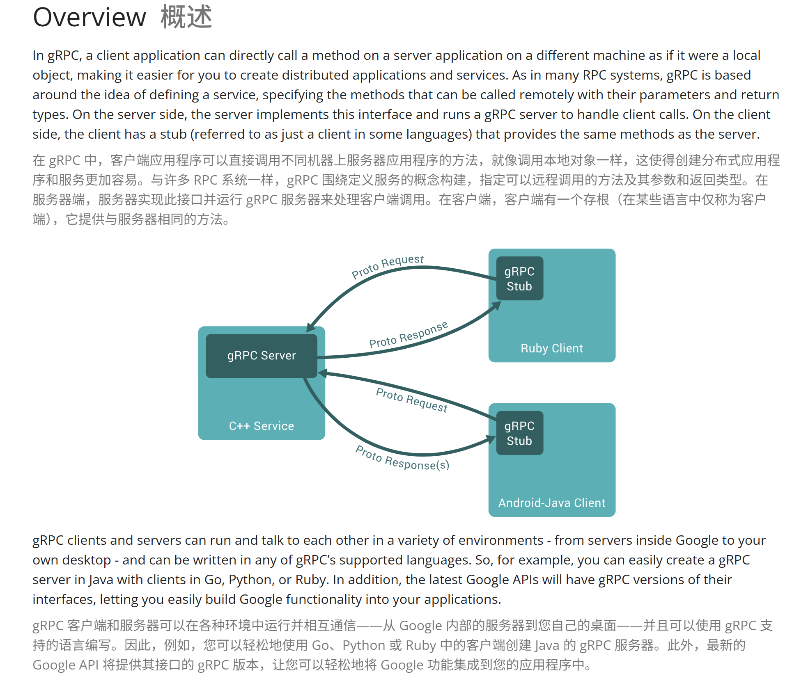
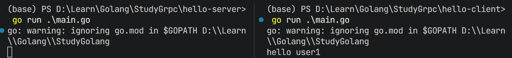
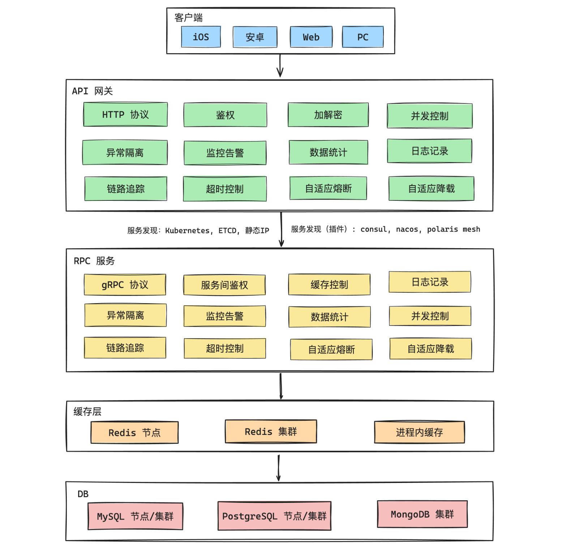

>参考：[【狂神说】gRPC最新超详细版教程通俗易懂 | Go语言全栈教程](https://www.bilibili.com/video/BV1S24y1U7Xp)、[gRPC（狂神说）](https://blog.csdn.net/qq_56517253/article/details/139559405)
>
>从单体架构到微服务架构，引入了一些新的问题（代码冗余、服务间的调用关系等），这时候需要引入RPC（远程过程调用），通过自定义协议发起TCP调用，提高传输效率。

### 概述

gRPC概述：参考[官网](https://grpc.io/docs/what-is-grpc/introduction/)



官网教程：

- https://grpc.io/
- [gRPC 官方文档中文版 V1.0](https://doc.oschina.net/grpc)


### 安装

1、安装protocolbuffers：https://github.com/protocolbuffers/protobuf/releases

- 官网下载对应压缩包：解压到个人所需安装路径即可

- 配置环境变量：D:\Application\protoc\protoc-33.0-win64\bin

- 验证：打开终端输入protoc

  ```absh
  C:\Users\Admin>protoc
  Usage: protoc [OPTION] PROTO_FILES
  Parse PROTO_FILES and generate output based on the options given:
  ......
  ```


2、安装gRPC核心库

```golang
go mod init learn_grpc
go get google.golang.org/grpc
```


3、上述过程即可将protocol编译器安装完毕，它可以生成各种不同语言的代码。因此，除了这个编译器，我们还需要配合各个语言的代码生成工具，对于go就是protoc-gen-go

```golang
# Tips：github.com上的为旧版本，新版本在google.golang.com
go install google.golang.org/protobuf/cmd/protoc-gen-go@latest
go install google.golang.org/grpc/cmd/protoc-gen-go-grpc@latest
```


### 编写proto文件

创建hello-server与hello-client目录，分别初始一个main.go

```golang
package main
```

在hello-server创建proto目录，编写hello.proto文件：

```golang
syntax = "proto3";

// 注意分号问题
option go_package = ".;service";

service SayHello {
    rpc SayHello(HelloRequest) returns (HelloResponse) {}
}

message HelloRequest {
    string requestName = 1;
}

message HelloResponse {
    string responseMsg = 1;
}

```

在proto目录下执行：分别生成`hello.pb.go`文件与`hello_grpc.pb.go`文件，如果后续重新编写proto文件，注意重新执行

```bash
protoc --go_out=. hello.proto
protoc --go-grpc_out=. hello.proto
```

再将protoc目录整个复制一份到hello-client中，最终目录结构

```golang
D:\LEARN\GOLANG\STUDYGRPC
│  go.mod
│  go.sum
│
├─hello-client
│  │  main.go
│  │
│  └─proto
│          hello.pb.go
│          hello.proto
│          hello_grpc.pb.go
│
└─hello-server
    │  main.go
    │
    └─proto
            hello.pb.go
            hello.proto
            hello_grpc.pb.go
```


### proto文件介绍

概述：详情参考[原视频](https://www.bilibili.com/video/BV1S24y1U7Xp?vd_source=35dfee2e398af56613f978fc65d6defb&p=4&spm_id_from=333.788.videopod.episodes)

- message
- 字段规则
- 消息号
- 嵌入消息
- 服务定义


### 服务端编写

```golang
package main

import (
	"context"
	"fmt"
	pb "learn_grpc/hello-server/proto"
	"net"

	"google.golang.org/grpc"
)

type server struct {
	pb.UnimplementedSayHelloServer
}

func (s *server) SayHello(ctx context.Context, req *pb.HelloRequest) (*pb.HelloResponse, error) {
	return &pb.HelloResponse{ResponseMsg: "hello" + " " + req.RequestName}, nil
}

func main() {
	// 1. 开启端口
	listen, err := net.Listen("tcp", ":9090")
	if err != nil {
		fmt.Printf("listen error: %v", err)
		fmt.Println()
		return
	}

	// 2. 创建grpc服务，在grpc服务端中注册
	grpcServer := grpc.NewServer()
	pb.RegisterSayHelloServer(grpcServer, &server{})

	// 3.启动服务
	err = grpcServer.Serve(listen)
	if err != nil {
		fmt.Printf("failed to serve: %v", err)
		return
	}

}

```

### 客户端编写

```golang
package main

import (
	"context"
	"fmt"
	pb "learn_grpc/hello-client/proto"
	"log"

	"google.golang.org/grpc"
	"google.golang.org/grpc/credentials/insecure"
)

func main() {
	// 1. 连接到server端，此处禁用安全传输，没有加密和验证
	conn, err := grpc.Dial("127.0.0.1:9090", grpc.WithTransportCredentials(insecure.NewCredentials()))
	if err != nil {
		log.Fatalf("did not connect: %v", err)
	}
	defer conn.Close()

	// 2. 建立连接
	client := pb.NewSayHelloClient(conn)

	// 3. 执行rpc调用
	resp, err := client.SayHello(context.Background(), &pb.HelloRequest{RequestName: "user1"})
	if err != nil {
		log.Fatalf("could not greet: %v", err)
	}
	fmt.Printf(resp.ResponseMsg)
}

```

示例效果：




### 认证及安全传输

这里不是指是身份认证，而是指多个server和多个client之间，如何识别对方是谁，并且可以安全的进行数据传输。

- SSL/TLS认证方式(采用http2协议)
- 基于Token的认证方式(基于安全连接)
- 不采用任何措施的连接，这是不安全的连接(默认采用http1)
- 自定义的身份认证

详细内容参考原视频，下面实现上述提到的两种方式。


### TLS认证实现

1、安装：可以自己编译[官网文件](https://www.openssl.org/source)，也可以使用别人做的[便捷安装包](https://slproweb.com/products/Win32OpenSSL.html)

2、配置环境变量

3、命令行测试 openssl

4、生成证书

5、更改openssl文件

6、生成私钥信息

7、服务端代码

8、客户端代码


### 自定义Token

我们先看一个gRPC提供我们的一个接口,这个接口中有两个方法，接口位于credentials 包下，这个接口需要客户端来实现。

```
// PerRPCCredentials defines the common interface for the credentials which need to
// attach security information to every RPC (e.g., oauth2).
type PerRPCCredentials interface {
	// GetRequestMetadata gets the current request metadata, refreshing tokens
	// if required. This should be called by the transport layer on each
	// request, and the data should be populated in headers or other
	// context. If a status code is returned, it will be used as the status for
	// the RPC (restricted to an allowable set of codes as defined by gRFC
	// A54). uri is the URI of the entry point for the request.  When supported
	// by the underlying implementation, ctx can be used for timeout and
	// cancellation. Additionally, RequestInfo data will be available via ctx
	// to this call.  TODO(zhaoq): Define the set of the qualified keys instead
	// of leaving it as an arbitrary string.
	GetRequestMetadata(ctx context.Context, uri ...string) (map[string]string, error)
	// RequireTransportSecurity indicates whether the credentials requires
	// transport security.
	RequireTransportSecurity() bool
}

```

具体方法：

- 第一个方法作用是获取元数据信息，也就是客户端提供的key,alue对，context用于控制超时和取消，uri是请求入口处的uri
- 第二个方法的作用是否需要基于 TLS 认证进行安全传输，如果返回值是true，则必须加上TLS验证，返回值是false则不用。


### （拓展）go-zero

[go-zero](https://go-zero.dev/) 是一个集成了各种工程实践的 web 和 rpc 框架。通过弹性设计保障了大并发服务端的稳定性，经受了充分的实战检验。

