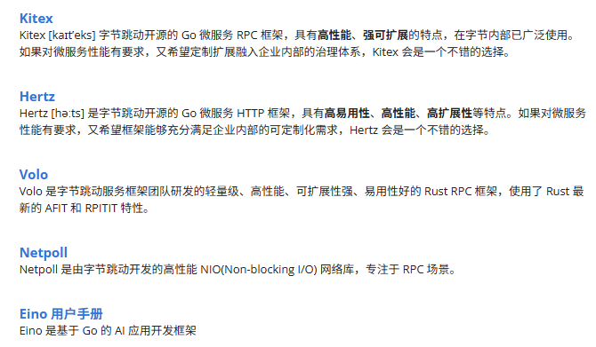

参考学习路线：

- [二哥 - Go 语言学习路线](https://javabetter.cn/xuexiluxian/go.html)：从基础到项目均有，其中《Go语言的学习路线图》很清晰的囊括了Golang开发相关关键词
  

CloudWeGo ：

- 概述：CloudWeGo 是由字节跳动推出的开源中间件套件，可用于快速构建企业级云原生架构。CloudWeGo 项目的共同特点是高性能、高可扩展性、高可靠性和专注于微服务通信和管理。
- 官网：https://www.cloudwego.io/zh/

- 具体内容：啃文档吧
  

Golang求职规划：

- 参考各类经验贴
- [Golang工程师求职规划-概述](https://www.bilibili.com/video/BV133N1z3EJx)：工作年限与能力、不同方向的岗位职责及相关分析，一些Tips：
  - 云原生平台开发中，重点还是掌握Mysql、Kafka、Redis这三个常用中间件
  - 一些面试技巧/业务开发侧重点
- [大二//字节实习//经历分享](https://www.bilibili.com/video/BV1cUHVzCEFJ)
  - 文字版：[实习的那些事](https://mirage-thought-d06.notion.site/27f747825dae80dabdbcf47a6186d8be)
  - 面试六七分靠运气，match部门需求，才会发offer
  - 很真诚的分享，不过技术方面分享较少
