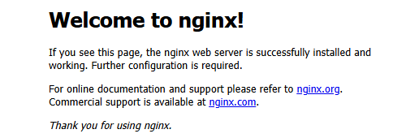

> Nginx概述：[Nginx是什么？Nginx高并发架构拆解指南](https://www.bilibili.com/video/BV1gMX1YSEtm)
>
> 总结一句话：反向代理就是 客户端看不到真实服务器，所有请求先到代理服务器（Nginx），由它转发给后端服务。它的核心作用是 隐藏、统一入口、负载均衡和加速。

参考教程：Nginx相关教程普遍较精简，可以快速入门

- [Nginx入门必须懂3大功能配置 - Web服务器/反向代理/负载均衡](https://www.bilibili.com/video/BV1TZ421b7SD)
- [Nginx实战 - 配置HTTPS | 数字证书和私钥 | Docker Compose容器](https://www.bilibili.com/video/BV1uH4y1w7je)
- [Nginx 极简教程](https://dunwu.github.io/nginx-tutorial/#/nginx-quickstart)


**NGINX** 是一个高性能的 HTTP/反向代理/负载均衡/缓存服务器——既能做静态内容的 Web Server，也常作为客户端和后端应用之间的“门面”（reverse proxy / SSL 终止 / 流量控制）。它以其**高并发**、**低内存占用**、以及**丰富的功能**而闻名。

主要作用：

- **Web 服务器**：高效地提供静态文件（HTML、图片、JS、CSS），支持 gzip/keepalive 等性能优化。
- **反向代理（Reverse Proxy）**：把请求转发到后端应用（如 Node/Python/Go），并做 header 转换、超时设置、连接复用等。
- **负载均衡（Load Balancer）**：对后端池做轮询/least_conn/权重分配，分担后端压力；企业版（NGINX Plus）提供更丰富的健康检查/会话保持。
- **缓存（Proxy/HTTP 缓存）**：把后端响应缓存到磁盘，减少后端压力、加速响应。
- **SSL/TLS 终止、HTTP/2/QUIC 支持、TCP/UDP 代理、邮件代理、流量限速/防刷**（很多企业功能与开源均可实现）。

为什么 NGINX 在高并发场景表现好？

核心原理：NGINX 使用**事件驱动 + worker 进程**模型（非每请求新进程/线程），能高效复用连接、降低内存/上下文切换开销，因此在并发场景下资源效率高、吞吐大。想理解细节，请看官方入门与架构说明。


### 基础知识

| 学习目标         | 重点内容                                                     | 成果/里程碑                                   |
| ---------------- | ------------------------------------------------------------ | --------------------------------------------- |
| **了解基本概念** | Nginx 是什么？它的特点是什么（高并发、事件驱动模型）？       | 对 Nginx 有清晰的认识。                       |
| **安装与启动**   | 熟悉在 Linux/Windows 上安装 Nginx 的步骤。                   | 成功启动 Nginx 并能通过浏览器访问默认欢迎页。 |
| **配置文件结构** | 了解 **`nginx.conf`** 的基本结构：**`main`**、**`events`**、**`http`**、**`server`**、**`location`** 这五个核心层级的作用。 | 能修改配置文件，更改 Nginx 监听的端口。       |

安装与启动：

```bash
# 更新包索引
sudo apt update

# 安装 Nginx
sudo apt install nginx -y

# 启动服务
sudo systemctl start nginx
sudo systemctl enable nginx

# 查看状态
systemctl status nginx

# 测试
curl http://localhost

# 查看nginx的进程
ps -ef|grep nginx
```

由于80端口被其他应用占用，常用解决方法 1）有停止原有的80端口的服务；2）更换Nginx端口；3）基于Docker部署Nginx。

项目开发中倾向第三者，不过这里初学，准备更换nginx的端口：

```bash
sudo nano /etc/nginx/sites-available/default
```

将如下两行中的端口改掉：

```bash
server {
    listen 80 default_server;        # IPv4
    listen [::]:80 default_server;   # IPv6
```

这里改为了90，之后`sudo systemctl start nginx`就不报错了。

服务启动成功后，访问90端口：




### 快速上手

> 参考：[【GeekHour】30分钟Nginx入门教程](https://www.bilibili.com/video/BV1mz4y1n7PQ)

#### 服务启停

**安装及启动：**上文已经做过了，但注意删除之前的配置文件`sudo rm /etc/nginx/sites-enabled/default`，否则会对下文产生影响（没有清除旧的配置文件且设置了新的配置文件，出现了一些端口访问问题）

```bash
# 更新包索引
sudo apt update

# 安装 Nginx：也可以采用源码安装、docker安装等方法
sudo apt install nginx -y

# 启动服务
sudo systemctl start nginx
sudo systemctl enable nginx

# 查看状态
systemctl status nginx

# 测试
curl http://localhost
```

**常用命令：**

- `sudo nginx -t`: 最重要！ 修改配置后必执行，检查语法是否有错。养成习惯，每次修改完配置，先执行 `-t`，看到 `syntax is ok` 再执行 `reload`。
- `sudo systemctl start nginx`: 启动服务。
- `sudo systemctl reload nginx`: 平滑重启。不中断当前连接，重新加载配置（生产环境首选）。
- `sudo systemctl status nginx`: 查看运行状态和报错日志。
- `nginx -s 标识符`: quit 优雅停止、stop 立即停止、reload 重载配置文件、reopen 重新打开日志文件 

**例如：**备注，`systemctl start nginx` 正常是没有输出的，有异常的情况才会有输出

```bash
$ sudo nginx -s stop
2026/01/21 09:15:54 [notice] 3213330#3213330: signal process started

$ systemctl status nginx
○ nginx.service - A high performance web server and a reverse proxy server
     Loaded: loaded (/usr/lib/systemd/system/nginx.service; enabled; preset: enabled)
     Active: inactive (dead) since Wed 2026-01-21 09:15:54 CST; 5s ago
     
$ sudo systemctl start nginx
```


#### 静态站点部署

在`/var/www/learn_nginx`目录（ `/var/www/`是Web 服务器的标准目录，如果直接设置成用户目录，可能出现权限问题）下撰写一个简易的html文件：`index.html`

```html
<!DOCTYPE html>
<html lang="zh-CN">
<head>
    <meta charset="UTF-8">
    <meta name="viewport" content="width=device-width, initial-scale=1.0">
    <title>我的网页</title>
</head>
<body>
    <header>
        <h1>欢迎来到我的网站</h1>
    </header>
</body>
</html>
```

nginx -V 可以看到许多相关的配置信息

```bash
$ nginx -V
nginx version: nginx/1.24.0 (Ubuntu)
built with OpenSSL 3.0.13 30 Jan 2024
TLS SNI support enabled
configure arguments: --with-cc-opt='-g -O2 -fno-omit-frame-pointer -mno-omit-leaf-frame-pointer -ffile-prefix-map=/build/nginx-WLuzPu/nginx-1.24.0=. -flto=auto -ffat-lto-objects -fstack-protector-strong -fstack-clash-protection -Wformat -Werror=format-security -fcf-protection -fdebug-prefix-map=/build/nginx-WLuzPu/nginx-1.24.0=/usr/src/nginx-1.24.0-2ubuntu7.5 -fPIC -Wdate-time -D_FORTIFY_SOURCE=3' --with-ld-opt='-Wl,-Bsymbolic-functions -flto=auto -ffat-lto-objects -Wl,-z,relro -Wl,-z,now -fPIC' --prefix=/usr/share/nginx --conf-path=/etc/nginx/nginx.conf --http-log-path=/var/log/nginx/access.log --error-log-path=stderr --lock-path=/var/lock/nginx.lock --pid-path=/run/nginx.pid --modules-path=/usr/lib/nginx/modules --http-client-body-temp-path=/var/lib/nginx/body --http-fastcgi-temp-path=/var/lib/nginx/fastcgi --http-proxy-temp-path=/var/lib/nginx/proxy --http-scgi-temp-path=/var/lib/nginx/scgi --http-uwsgi-temp-path=/var/lib/nginx/uwsgi --with-compat --with-debug --with-pcre-jit --with-http_ssl_module --with-http_stub_status_module --with-http_realip_module --with-http_auth_request_module --with-http_v2_module --with-http_dav_module --with-http_slice_module --with-threads --with-http_addition_module --with-http_flv_module --with-http_gunzip_module --with-http_gzip_static_module --with-http_mp4_module --with-http_random_index_module --with-http_secure_link_module --with-http_sub_module --with-mail_ssl_module --with-stream_ssl_module --with-stream_ssl_preread_module --with-stream_realip_module --with-http_geoip_module=dynamic --with-http_image_filter_module=dynamic --with-http_perl_module=dynamic --with-http_xslt_module=dynamic --with-mail=dynamic --with-stream=dynamic --with-stream_geoip_module=dynamic
```

其中就包含配置文件信息`--conf-path=/etc/nginx/nginx.conf`，我们在 `http { ... }` 内部写入`server块`

```json
server {
    listen 95;
    server_name localhost; # 你的域名或IP

    location / {
        root /var/www/learn_nginx;   # 静态资源路径
        index index.html;        # 默认首页
	}
}
```

验证是否可用

```bash
$ sudo nginx -t
nginx: the configuration file /etc/nginx/nginx.conf syntax is ok
nginx: configuration file /etc/nginx/nginx.conf test is successful
```

重启服务：

```bash
sudo systemctl restart nginx
```

测试效果：正确返回了我们部署的html

```bash
$ curl http://localhost:95
<!DOCTYPE html>
<html lang="zh-CN">
<head>
    <meta charset="UTF-8">
    <meta name="viewport" content="width=device-width, initial-scale=1.0">
    <title>我的网页</title>
</head>
<body>
    <header>
        <h1>欢迎来到我的网站</h1>
    </header>
</body>
</html>
```

备注：这里出现了几个额外的报错

- 查看错误日志`sudo tail -n 20 /var/log/nginx/error.log`发现了端口占用问题，基于`sudo lsof -i :90`查看端口占用进程，并清理即可`sudo pkill -9 nginx`
- `sudo nginx -t`时发现了一些语法错误，按照提示修复即可


#### 配置文件

Nginx 的配置文件采用的是层级嵌套结构，理解了结构，你就掌握了灵魂。

| **层级**     | **作用**                                            |
| ------------ | --------------------------------------------------- |
| **Main**     | 全局设置，如工作进程数 (`worker_processes`)。       |
| **Events**   | 网络连接设置，如最大连接数 (`worker_connections`)。 |
| **Http**     | 代理、缓存、日志等核心功能，包含多个 Server。       |
| **Server**   | 虚拟主机配置，定义域名和端口。                      |
| **Location** | 路由匹配，定义特定的 URL 请求如何处理。             |


#### 反向代理与负载均衡

反向代理（Reverse Proxy） 是一种代理模式：

- 客户端 → 不直接访问后端服务器，而是访问 代理服务器（Nginx）
- Nginx 接收到请求 → 决定把请求转发给哪台后端服务器（Web 服务、应用服务等）
- 后端服务器处理请求 → 返回结果给 Nginx → 再由 Nginx 返回给客户端

反向代理的作用：

1. 隐藏真实服务器：客户端无法直接看到后端服务器 IP，增强安全性。
2. 负载均衡：多台后端服务器时，Nginx 可以分发请求，提高性能。
3. 统一入口：不同服务（Web、API、静态文件）都通过 Nginx 统一访问。
4. 缓存与加速**：**Nginx 可以缓存后端响应，减少请求延迟。
5. SSL/TLS 终端：Nginx 可以处理 HTTPS，加密通信，后端可以使用 HTTP。

------

修改之前撰写的index.html，方便后续测试

```html
<!DOCTYPE html>
<html>
<head>
    <title>Go + Nginx 实战</title>
</head>
<body>
    <h1>Nginx 负载均衡测试</h1>
    <button onclick="fetchData()">获取后端数据</button>
    <p id="result">等待点击...</p>

    <script>
        async function fetchData() {
            const res = await fetch('/api/data');
            const data = await res.json();
            document.getElementById('result').innerText = 
                `响应内容: ${data.message} | 处理端口: ${data.port}`;
        }
    </script>
</body>
</html>
```

基于golang编写一个简易的后端：

```go
package main

import (
	"fmt"
	"net/http"
	"os"
)

func main() {
	// 从命令行参数获取端口，默认为 8080
	port := "8095"
	if len(os.Args) > 1 {
		port = os.Args[1]
	}

	http.HandleFunc("/api/data", func(w http.ResponseWriter, r *http.Request) {
		// 允许跨域（实际生产中由 Nginx 处理，这里为了演示）
		w.Header().Set("Content-Type", "application/json")
		fmt.Fprintf(w, `{"message": "来自 Go 后端的响应", "port": "%s"}`, port)
		fmt.Printf("收到请求，当前处理端口: %s\n", port)
	})

	fmt.Printf("Go 后端服务已启动，监听端口: %s\n", port)
	if err := http.ListenAndServe(":"+port, nil); err != nil {
		panic(err)
	}
}

```

测试：访问`:8095/api/data`可得

```json
{"message": "来自 Go 后端的响应", "port": "8095"}
```

------

编写配置文件`vim /etc/nginx/nginx.conf`：和之前一样，在 `http { ... }` 内部写入如下内容

```bash
# 1. 定义后端负载均衡池
upstream go_apps {
    server 127.0.0.1:8096; # 对应我们要启动的 Go 实例 1
    server 127.0.0.1:8097; # 对应我们要启动的 Go 实例 2
}

server {
    listen 0.0.0.0:9095;
    server_name _; # 你的域名或IP
	
	# 2. 静态站点部署
    location / {
        root /var/www/learn_nginx;   # 静态资源路径
        index index.html;        # 默认首页
	}
	
	# 3. 反向代理与负载均衡
    location /api/ {
        proxy_pass http://go_apps; # 转发到上面的 upstream 
        
        # 传递必要的 Header
        proxy_set_header Host $host;
        proxy_set_header X-Real-IP $remote_addr;
    }
}
```

------

运行与操作：

- 启动两个Go后端：

  ```
  go run main.go 8096
  go run main.go 8097
  ```

- 检查并重启 Nginx：

  ```
  sudo nginx -t
  sudo systemctl reload nginx
  ```

- 测试：

  - 访问`http://192.168.130.30:8096/api/data`得到`{"message": "来自 Go 后端的响应", "port": "8096"}`

  - 访问`http://192.168.130.30:8097/api/data`得到`{"message": "来自 Go 后端的响应", "port": "8097"}`

  - 访问之前部署的静态页面：

    ```bash
    $ curl http://localhost:9095
    <!DOCTYPE html>
    <html>
    <head>
        <title>Go + Nginx 实战</title>
    </head>
    <body>
        <h1>Nginx 负载均衡测试</h1>
        <button onclick="fetchData()">获取后端数据</button>
        <p id="result">等待点击...</p>
    
        <script>
            async function fetchData() {
                const res = await fetch('/api/data');
                const data = await res.json();
                document.getElementById('result').innerText = 
                    `响应内容: ${data.message} | 处理端口: ${data.port}`;
            }
        </script>
    </body>
    ```

注意，网页访问9095端口时，连续点击按钮“获取后端数据”。你会发现“处理端口”在 8096 和 8097 之间交替出现（负载均衡与反向代理成功）


#### 高阶应用与优化

| 学习目标       | 重点内容                                                     | 成果/里程碑                |
| -------------- | ------------------------------------------------------------ | -------------------------- |
| **负载均衡**   | 配置 **`upstream`** 模块，并掌握 **轮询**、**`ip_hash`**、**`least_conn`** 等负载均衡策略。 | 构建一个高可用的集群架构。 |
| **HTTPS 配置** | 配置 SSL 证书，实现 HTTP 到 **HTTPS** 的跳转。               | 确保网站数据传输安全。     |
| **缓存与压缩** | 配置 **`proxy_cache`** 提高性能；配置 **`gzip`** 压缩减少带宽。 | 网站性能得到明显提升。     |
| **安全与限流** | 配置 **`limit_req`** 模块限制请求频率，防止 DoS 攻击。       | 提高系统抗压和安全能力。   |

上述都是Nginx较常用的几个场景。