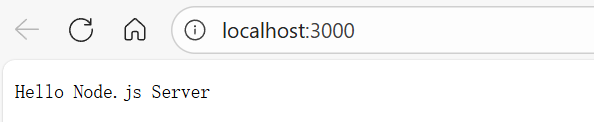

## 概述

**Node.js 的价值**

- **前后端统一语言（JavaScript/TypeScript）**
   - Node.js 的最大优势是你可以用同一语言（尤其是 TypeScript）写前端和后端。
      对于 Agent 应用开发，如果你需要快速做前端 UI + 后端服务的整合，Node.js 会让开发效率非常高。
   
- **生态极其丰富**
  - Web 框架：Express、NestJS、Fastify
  - 前端配套：Next.js、Vite、React 生态
  - AI/Agent 相关 SDK：大部分 AI API（OpenAI、LangChain.js、Vercel AI SDK）第一时间支持 Node.js/TS
     这意味着你在实验新功能时，往往 Node.js 生态里现成的工具更多。
- **社区与部署优势**
   Node.js 与云原生环境（Serverless、Edge Functions、Vercel、Cloudflare Workers 等）结合紧密，能快速部署和迭代。


**与 Python、Go 的互补性：**

- **Python**
  - 擅长 AI/数据处理/科研工具
  - 适合在 Agent 应用里做底层能力（模型调用、数据处理）
  - 但前后端一体化和现代 Web 开发体验不如 Node.js
- **Go**
  - 适合高并发、性能敏感的后端服务
  - 部署简单、二进制可执行文件
  - 但生态在 Web/前端整合上比 Node.js 稍弱
- **Node.js**
  - 强项是前后端整合、Web API、实时交互
  - 在构建 AI 应用的 **Web 产品形态** 上有优势
  - 性能比不上 Go，但开发效率和生态工具链能补足


**Node.js全栈很难找到工作**，对于Agent应用开发来说，可能目前需要关注：

- 使用Next.js、React等框架时会用到
- js全栈快速开发项目
- 开源项目代码阅读


针对上述几点，可以针对性的做对应项目，以达成Agent开发所需技能。


## 极速入门

参考资源：

- Node.js官网教程：https://nodejs.org/zh-cn/learn/getting-started/introduction-to-nodejs
- 2h快速入门视频：https://www.bilibili.com/video/BV1Up421D7kz
- 大模型辅助列出快速入门要点


### 环境配置

下载：https://nodejs.org/zh-cn/download

正常安装即可，基于`node -v`验证是否成功。


第一个程序：01helloworld.js

```js
console.log("Hello Node.js");
```

示例结果：

```js
> node .\01helloworld.js
Hello Node.js
```


### 核心语法

#### 模块化

示例代码：

```js
// math.js
export function add(a, b) {
  return a + b;
}

// app.js
import { add } from "./math.js";
console.log(add(2, 3)); // 5

```

运行结果：

```js
> node .\app.js
5
```


#### 文件操作

示例代码：

```js
import fs from "fs";

// 写文件
fs.writeFileSync("test.txt", "Hello World");

// 读文件
const data = fs.readFileSync("test.txt", "utf-8");
console.log(data);

```


### **HTTP 服务**

示例代码：

```js
import http from "http";

const server = http.createServer((req, res) => {
  res.writeHead(200, { "Content-Type": "text/plain" });
  res.end("Hello Node.js Server");
});

server.listen(3000, () => console.log("Server running at http://localhost:3000"));
```

示例结果：




### **使用 npm 包**

```bash
npm init -y
npm install axios
```

```js
import axios from "axios";

const fetchData = async () => {
  const res = await axios.get("https://api.github.com");
  console.log(res.data);
};
fetchData();
```


## 案例

### Node.js + Next.js + React 小示例

------

#### 1、Next.js API Route（Node.js + React 一体化）

Next.js 允许你直接写 **后端 API**，不用单独开 Node.js 服务。

```javascript
// pages/api/hello.ts
import type { NextApiRequest, NextApiResponse } from "next";

export default function handler(req: NextApiRequest, res: NextApiResponse) {
  res.status(200).json({ message: "Hello from Node.js API in Next.js" });
}
```

👉 访问 `http://localhost:3000/api/hello`
 就能看到返回 `{ "message": "Hello from Node.js API in Next.js" }`

------

#### 2 Next.js 前端调用 API

```javascript
// pages/index.tsx
import { useEffect, useState } from "react";

export default function Home() {
  const [msg, setMsg] = useState("");

  useEffect(() => {
    fetch("/api/hello")
      .then(res => res.json())
      .then(data => setMsg(data.message));
  }, []);

  return <h1>{msg}</h1>;
}
```

👉 页面加载后，会调用 `/api/hello` 并显示返回内容。
 （前端 React + 后端 Node.js API 在一个项目里完成）

------

#### 3 调用外部 API（比如 OpenAI）

```javascript
// pages/api/chat.ts
import type { NextApiRequest, NextApiResponse } from "next";
import axios from "axios";

export default async function handler(req: NextApiRequest, res: NextApiResponse) {
  const { message } = req.body;

  const response = await axios.post("https://api.openai.com/v1/chat/completions",
    {
      model: "gpt-3.5-turbo",
      messages: [{ role: "user", content: message }],
    },
    {
      headers: { Authorization: `Bearer ${process.env.OPENAI_API_KEY}` },
    }
  );

  res.status(200).json({ reply: response.data.choices[0].message.content });
}
// pages/index.tsx
import { useState } from "react";

export default function Home() {
  const [input, setInput] = useState("");
  const [reply, setReply] = useState("");

  const sendMessage = async () => {
    const res = await fetch("/api/chat", {
      method: "POST",
      headers: { "Content-Type": "application/json" },
      body: JSON.stringify({ message: input }),
    });
    const data = await res.json();
    setReply(data.reply);
  };

  return (
    <div>
      <input value={input} onChange={e => setInput(e.target.value)} />
      <button onClick={sendMessage}>Send</button>
      <p>{reply}</p>
    </div>
  );
}
```

👉 这就是一个最小可行的 **AI Chat 应用（Node.js + Next.js + React）**。