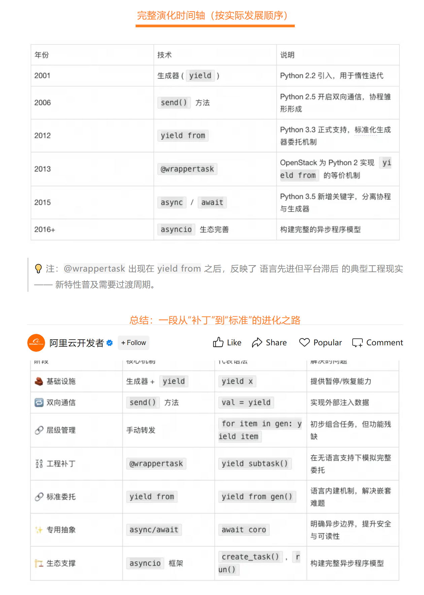

## 基础知识

Python基础：

- [Python之路 33：进程与线程概念及基础使用](https://blog.csdn.net/qq_55535816/article/details/122776384)
- [Python之路 34：并发与并行、锁（GIL、同步锁、死锁与递归锁）、信号量、线程队列、生消模型、进程（基础使用、进程通信、进程池、回调函数）、协程](https://blog.csdn.net/qq_55535816/article/details/122779055)
- [Python之路 35：事件驱动模型、IO模型、selectors模块（IO复用、select、poll、epoll）](https://blog.csdn.net/qq_55535816/article/details/122785856)

Python高阶：

- [Advance Python 总汇](https://blog.csdn.net/qq_55535816/article/details/122871054)

## 现代化Python

参考：[现代化Python工具指南](https://www.bilibili.com/video/BV1xk1eBQEU)

概述：

- uv：作为一个多年conda使用者表示，使用了半年，确实极快（Rust 实现）且轻便
- pyproject.toml：PEP 518、PEP 621 等一系列标准提出的 Python 项目统一配置文件，解决过去 Python 工具生态碎片化的问题（如 setup.py、requirements.txt、setup.cfg 等乱象）
- ruff：一个工具替代 flake8 + pylint + isort + pydocstyle……
- pyright：微软开发的 Python 静态类型检查器
- rich：打印彩色终端、表格、树状结构

## 零碎经验

> 参考：[从 yield 到 await：Python 协程的进化史](https://mp.weixin.qq.com/s/mWFm1N_kZhXYMJWxINyZOQ)

> 参考：[一文带你玩转 WebSocket 全链路可观测](https://mp.weixin.qq.com/s/DxcWMObIkViQ-Z00NpeGjA)

可观测性挑战

1. **链路追踪困境** 协议灵活性导致链路信息注入困难（缺乏类似HTTP的header机制） Span作用域界定模糊（可按连接、消息或数据帧粒度定义） 链路上下文反向扩散问题（Server可能主动调用Client）
2. **异步调用断链危机** 线程池、进程内队列等异步处理方式容易导致链路上下文丢失

LoongSuite解决方案：基于OpenTelemetry API的无侵入探针方案，提供

1. **三种埋点模式** 连接维度Trace：适合短连接场景 会话ID关联：适合长连接复用场景 消息调用建模：仿照Messaging系统，维护调用关系
2. **异步上下文管理** 自动透传（线程池场景） 手动透传（队列/Channel场景）
3. **关键性能指标** 首包延迟、包间间隔抖动、尾包延迟等流式传输指标