参考教程：

- 视频教程：[【程序员科科】1小时精通Python的FastAPI框架的所有知识点_哔哩哔哩_bilibili](https://www.bilibili.com/video/BV18F4m1K7N3/?spm_id_from=333.337.search-card.all.click&vd_source=35dfee2e398af56613f978fc65d6defb)
- 官网：[FastAPI - FastAPI (tiangolo.com)](https://fastapi.tiangolo.com/)
- [FastAPI 快速教程: 从零开始构建你的第一个API项目_fastapi教程-CSDN博客](https://blog.csdn.net/weixin_45508265/article/details/135663782)
- [超全面整理fastAPI(从入门到运用)，进来看十秒钟再走不迟-CSDN博客](https://blog.csdn.net/my_name_is_learn/article/details/109819127)


# 一、基础知识


## 1、介绍

简单来说：

- 简介：

  - FastAPI 是一个用于构建 API 的现代、快速（高性能）的 web 框架，专为在 Python 中构建 RESTful API 而设计。它使用 Python 3.8+ 并基于标准的 Python 类型提示，如类型提示和异步支持（async/await），使得开发者可以更清晰地定义 API 接口，并在开发过程中受益于类型检查和自动生成的文档。

  - FastAPI 建立在 Starlette 和 Pydantic 之上，利用类型提示进行数据处理，并自动生成API文档。

    FastAPI 于 2018 年 12 月 5 日发布第一版本，以其易用性、速度和稳健性在开发者中间迅速流行起来。

  - 小框架，易学习及使用。

- FastAPI 的关键特点：

  1. **高性能**: 使用 Starlette（一个异步的 ASGI 框架）和 Pydantic（一个用于数据验证的库）作为底层，FastAPI 可以处理高并发和高负载。
  2. **自动生成文档**: 支持自动生成交互式 API 文档（例如 Swagger UI 和 ReDoc），这对于开发和测试非常有用。
  3. **类型安全**: 利用 Python 的类型提示，FastAPI 能够自动验证数据类型并生成相应的文档，这大大减少了错误。
  4. **简洁易用**: 提供简洁的接口定义方式，开发速度快，适合快速原型开发。

- FastAPI 的应用

  1. **Web API**: 构建 RESTful 和 GraphQL API 是 FastAPI 最主要的应用场景。
  2. **微服务**: 由于其高性能和灵活性，FastAPI 常用于构建微服务架构中的单一职责服务。
  3. **模型部署**: FastAPI 适合将机器学习模型通过 API 形式提供服务，特别是在需要处理大量并发请求的情况下，比如大模型API。


在性能方面 FastAPI vs Django vs Flask

- **FastAPI**: 由于支持异步编程，FastAPI 在处理高并发请求时表现优异。
- **Django**: 性能相对较低，主要由于其同步的处理模式和较为笨重的 ORM。
- **Flask**: 性能适中，但因为默认不支持异步，需要额外配置和库的支持。

三者各有优缺点。


## 2、环境配置

PS：我这里使用的是Python 3.10

具体环境需求如下：

1. 安装相关库：

   ```shell
   pip install fastapi -i https://pypi.tuna.tsinghua.edu.cn/simple
   pip install uvicorn -i https://pypi.tuna.tsinghua.edu.cn/simple
   ```

2. 安装Postman软件，用于测试接口（也可以采用[Apifox](https://apifox.com/)等API测试工具）
   


## 3、前后端分离 

参考：

- [轻松理解前后端分离（通俗易懂）-CSDN博客](https://blog.csdn.net/weixin_46594796/article/details/115123635)
- [包工头都能听明白的前后端分离！_哔哩哔哩_bilibili](https://www.bilibili.com/video/BV1f7411L7By/?spm_id_from=333.337.search-card.all.click&vd_source=35dfee2e398af56613f978fc65d6defb)
- [一节课彻底搞懂前端后端的关系，到底什么是接口？概念与实战_哔哩哔哩_bilibili](https://www.bilibili.com/video/BV1UV411h7Mv/?spm_id_from=333.788.recommend_more_video.-1&vd_source=35dfee2e398af56613f978fc65d6defb)

简要来说：

- **前后端分离**: 前端和后端独立开发和部署，通过API通信。

- **前后端不分离**: 前端和后端紧密耦合

感觉每提到一次前后端分离，JSP就要被拉出来骂一次(￣﹃￣)


## 4、Restful风格的API

是什么？

- [什么是REST风格? 什么是RESTFUL?（一篇全读懂）_rest风格和restful风格-CSDN博客](https://blog.csdn.net/SeniorShen/article/details/111591122)
- [一文搞懂RESTful API - bigsai - 博客园 (cnblogs.com)](https://www.cnblogs.com/bigsai/p/14099154.html)

过去根据动作写接口，现在根据请求方法写接口

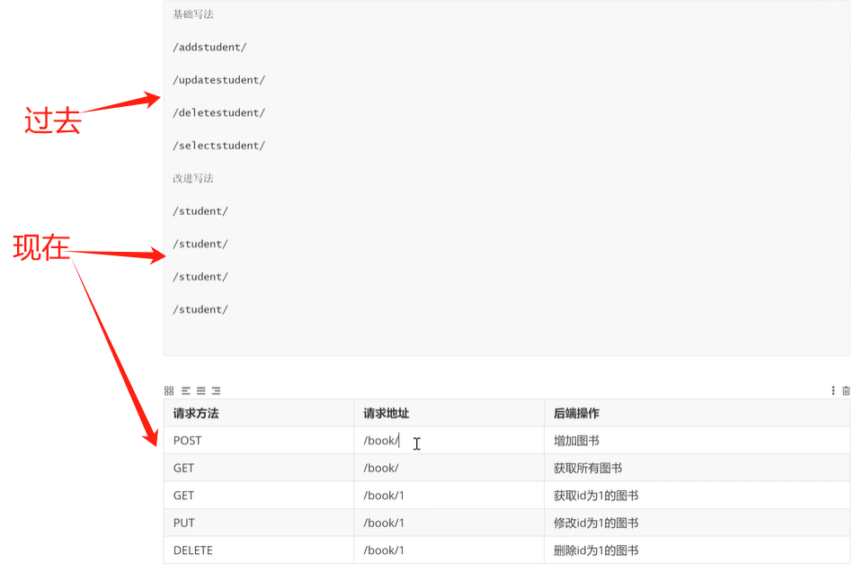

REST 的几个核心约束：不是所有人都会 100% 遵守，但你要知道「标准答案是什么」

1、资源（Resource）

- 资源用 URL 表示
- URL 表示“名词”，不是动词
- 比如，推荐`/users`、`/users/123`、`/orders/2025`，而不推荐`/getUser`、`/createOrder`

- 使用 HTTP 方法表达“行为”

2、同样一个url，不同的HTTP方法对应不同行为

```
GET    /users/123
POST   /users
PUT    /users/123
DELETE /users/123
```

具体表现为：

| HTTP 方法 | 含义     |
| --------- | -------- |
| GET       | 查询资源 |
| POST      | 创建资源 |
| PUT       | 整体更新 |
| PATCH     | 局部更新 |
| DELETE    | 删除资源 |

3、无状态（Stateless）

- **服务端不保存客户端会话状态**
- 每次请求都包含完整信息（token、参数等）
- 比如：
  - ✅：`Authorization: Bearer xxx`
  - ❌：`服务端靠 session 记住你是谁`

4、统一接口（Uniform Interface）

- 行为靠 HTTP method
- 状态靠 HTTP status code
- 数据靠标准格式（JSON）

```
200 OK
201 Created
400 Bad Request
404 Not Found
```

5、表现层与数据分离（Representational）

- 返回的是资源的 表示（JSON）
- 客户端不关心内部实现（数据库 / 微服务）


## 5、快速创建一个FastAPI接口

示例代码：

```python
from fastapi import FastAPI
import uvicorn  # web服务器


app = FastAPI()

@app.get('/hello')
async def root():  # async 即异步，当前可加可不加
    return {"message": "Hello World"}


if __name__ == '__main__':
    # 注意，"fastapi01:app"中fastapi01对应当前python文件的名称，要对应上
    uvicorn.run("fastapi01:app", host='127.0.0.1', port=8080, reload=True)
    
```

备注：

- 在 `uvicorn.run()` 中，第一个参数用于指定要运行的 ASGI 应用实例。这个参数的形式通常为 `"模块名:应用实例名"`。例如，如果你的应用实例在 `main.py` 文件中，且实例名为 `app`，那么你需要这样指定：`uvicorn.run("main:app")`。


访问[127.0.0.1:8080/hello](http://127.0.0.1:8080/hello)，可以看到：

```python
INFO:     Uvicorn running on http://127.0.0.1:8080 (Press CTRL+C to quit)
INFO:     Started reloader process [5372] using WatchFiles
INFO:     Started server process [20788]
INFO:     Waiting for application startup.
INFO:     Application startup complete.
INFO:     127.0.0.1:55935 - "GET /hello HTTP/1.1" 200 OK
```


# 二、快速应用

## 1、FastAPI接口文档

关于HTTP四种请求：

- [详解HTTP四种请求：POST、GET、DELETE、PUT-阿里云开发者社区 (aliyun.com)](https://developer.aliyun.com/article/1476820)
- [RESTful规范 GET请求、POST请求、PUT请求、DELETE请求？_restful delete-CSDN博客](https://blog.csdn.net/qq_38658642/article/details/101016741)


基于上述demo代码，简单做点扩展，加入增删改查（即get请求、post请求、put请求、delete请求），新创建一个脚本fastapi02.py，示例代码：

```python
from fastapi import FastAPI
import uvicorn  # web服务器


app = FastAPI()

@app.get('/get')
def get_test():
    return {"method": "get方法"}


@app.post('/post')
def post_test():
    return {"method": "post方法"}


@app.put('/put')
def put_test():
    return {"method": "put方法"}


@app.delete('/delete')
def delete_test():
    return {"method": "delete方法"}


if __name__ == '__main__':
    uvicorn.run("fastapi02:app", host='127.0.0.1', port=8080, reload=True)
    
```

可以用Postman软件去测试接口：

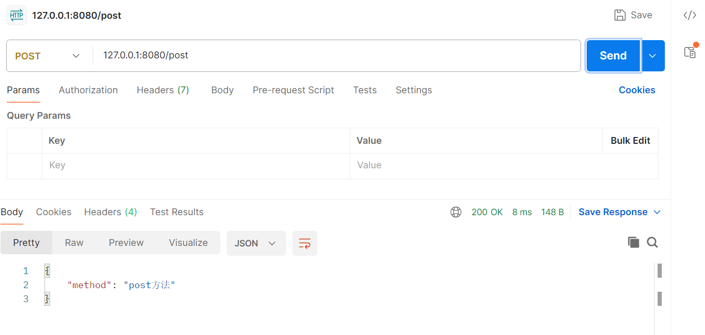

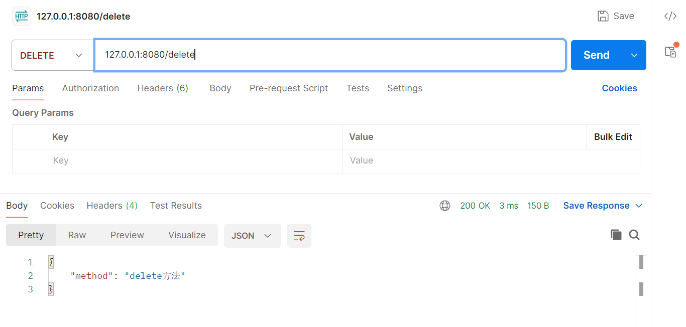


有趣的事情就来了，此时访问http://127.0.0.1:8080/docs，你就能看到一篇精美的API文档：

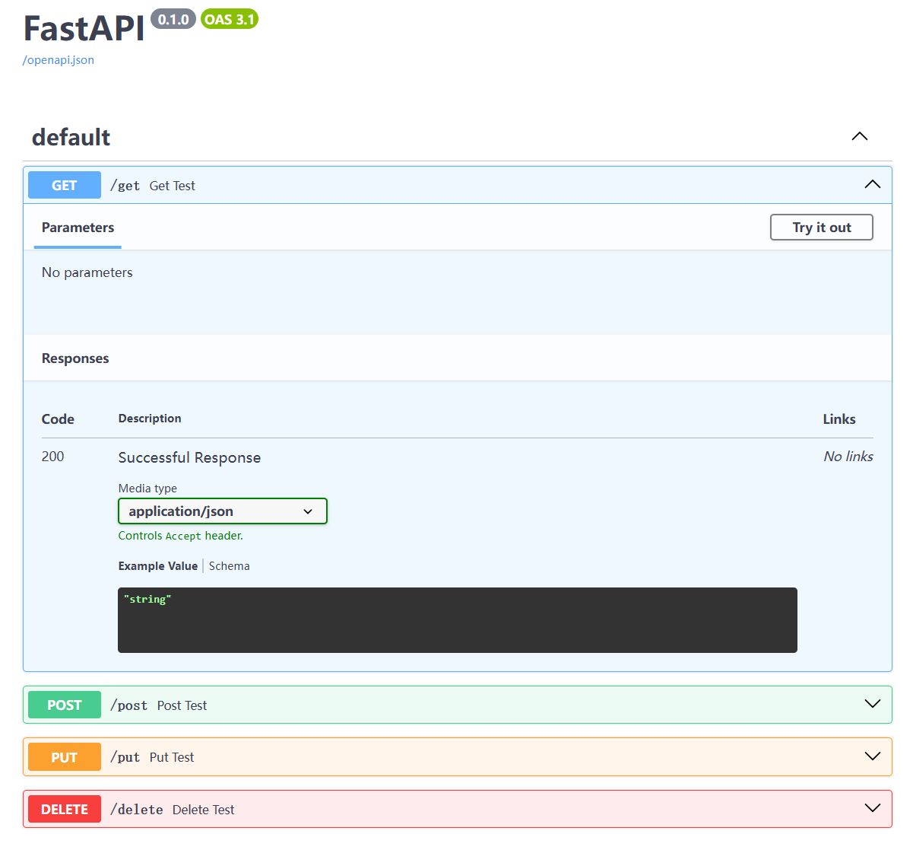

访问http://127.0.0.1:8080/openapi.json，即可得到OpenAPI Schema


## 2、路由分发

什么是路由分发（类似Django中的include）：

- 做一个中转站  只负责将请求分发到不同的app中，然后在app的urls.py完成路由与视图函数的对应关系
- [路由分发 - chanyuli - 博客园 (cnblogs.com)](https://www.cnblogs.com/chanyuli/p/11723483.html)
- [Django中的路由分发_django中用include实现路由分发-CSDN博客](https://blog.csdn.net/Teamo_mc/article/details/116207607)


我们知道，平时逛京东时买书，可以去搜书名，也可以直接搜出版社，也可以搜作者，那么如果这些接口全写在一个文件中，那耦合性就太高了，所以我们希望其拆开来写：

- 首先创建一个fastapi03.py这个脚本，并在其同级目录中创建一个api目录，api目录下创建三个文件：book.py、press.py、author.py
  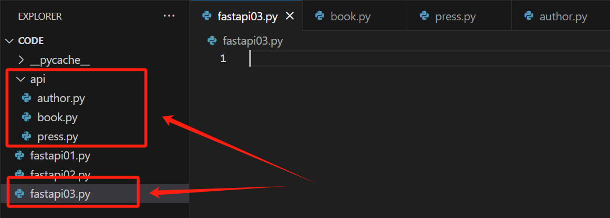

- 示例代码：

  - fastapi03.py

    ```python
    from fastapi import FastAPI
    import uvicorn  # web服务器
    
    
    # 导入子路由
    from api.book import api_book
    from api.press import api_press
    from api.author import api_author
    
    
    app = FastAPI()
    # app.include_router即类似Django中的include
    app.include_router(api_book, prefix="/book", tags=["图书接口",])
    app.include_router(api_press, prefix="/press", tags=["出版社接口",])
    app.include_router(api_author, prefix="/author", tags=["作者接口",])
    
    
    if __name__ == '__main__':
        uvicorn.run("fastapi03:app", host='127.0.0.1', port=8080, reload=True)
    ```

  - api/book.py

    ```python
    from fastapi import APIRouter  # 类似Djano中的path
    
    
    api_book = APIRouter()  # 生成路由对象
    
    
    @api_book.get('/get')
    async def get_test():
        return {"method": "book-get方法"}
    
    
    @api_book.post('/post')
    async def post_test():
        return {"method": "book-post方法"}
    
    
    @api_book.put('/put')
    async def put_test():
        return {"method": "book-put方法"}
    
    
    @api_book.delete('/delete')
    async def delete_test():
        return {"method": "book-delete方法"}
    ```

  - api/press.py

    ```python
    from fastapi import APIRouter  # 类似Djano中的path
    
    
    api_press = APIRouter()  # 生成路由对象
    
    
    @api_press.get('/get')
    async def get_test():
        return {"method": "press-get方法"}
    
    
    @api_press.post('/post')
    async def post_test():
        return {"method": "press-post方法"}
    
    
    @api_press.put('/put')
    async def put_test():
        return {"method": "press-put方法"}
    
    
    @api_press.delete('/delete')
    async def delete_test():
        return {"method": "press-delete方法"}
    ```

  - api/author.py

    ```python
    from fastapi import APIRouter  # 类似Djano中的path
    
    
    api_author = APIRouter()  # 生成路由对象
    
    
    @api_author.get('/get')
    async def get_test():
        return {"method": "author-get方法"}
    
    
    @api_author.post('/post')
    async def post_test():
        return {"method": "author-post方法"}
    
    
    @api_author.put('/put')
    async def put_test():
        return {"method": "author-put方法"}
    
    
    @api_author.delete('/delete')
    async def delete_test():
        return {"method": "author-delete方法"}
    ```

    

结果展示：

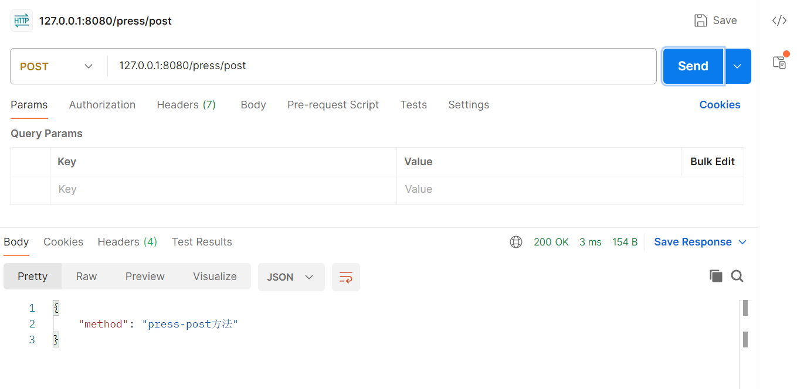

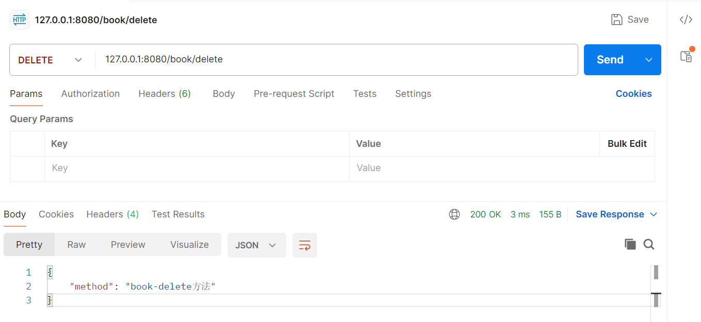


## 3、request对象

什么是Request请求：

- 相关博客
  - [request对象和response对象及使用介绍_request对象和response对象对应的方法-CSDN博客](https://blog.csdn.net/weixin_43824824/article/details/109348093)
  - [HttpRequest （入门）_htttprequest-CSDN博客](https://blog.csdn.net/weixin_41474332/article/details/102633912#:~:text=1.能够使用Request对象获取HTTP协议请求内容 (掌握) (包含请求行、请求头、请求体的信息) 2.能够处理HTTP请求参数的 乱码,问题 (掌握) 3.能够使用Request域对象 (掌握) 4.能够使用Request对象做请求转发 (掌握))
  - [requests.request()方法解析-CSDN博客](https://blog.csdn.net/u011608531/article/details/109356728)
  - [Request对象详述 - 戒爱学Java - 博客园 (cnblogs.com)](https://www.cnblogs.com/jundong2177/p/17315527.html)
- 简要概述：`Request` 请求是客户端与服务器通信的基础，通过不同类型的HTTP请求方法，客户端可以获取数据、提交数据、或执行服务器操作，是Web应用和API交互的核心机制。
- `Request` 请求是指客户端向服务器发送的一次 HTTP 请求。每个请求都是一个客户端向服务器的通信，这些请求可以是浏览器发起的，也可以是其他程序或设备发起的。HTTP 请求由一个请求行、请求头和请求体组成：
  1. **请求行**: 包含HTTP方法（如GET、POST）、请求的URL路径、以及HTTP协议版本。
  2. **请求头**: 包含有关请求的元数据，如客户端类型、授权信息、请求内容类型等。
  3. **请求体**: 包含要发送到服务器的数据，通常用于POST或PUT请求。

为什么用Request请求：

- **获取数据**: 客户端可以通过GET请求从服务器获取数据，如网页内容、API返回的数据等。
- **提交数据**: 客户端可以通过POST、PUT或PATCH请求向服务器提交数据，如表单数据、上传的文件等。
- **执行操作**: 客户端可以通过DELETE请求删除服务器上的资源，或者通过其他自定义方法执行特定的服务器操作。
- **互动与通信**: 通过HTTP请求，客户端和服务器可以进行数据交换和通信，实现动态和交互式的Web应用。


示例代码：

```python
from fastapi import FastAPI, Request
import uvicorn  # web服务器


app = FastAPI()


# 注意：这里post请求一定要加上await，因为上传默认是一种非常繁忙的工作，所以request.json()或者request.form()都会发送异步请求，所以要用await接收

# 通过request.json()得到post请求结果
# 注册接口
@app.post('/test_post')
async def register1(request: Request):  # request: Request表示实例化一下request对象
    json_data = await request.json()
    print(json_data)


# 通过request.query_params()得到get请求结果
# 注册接口
@app.get('/test_get')
async def register2(request: Request):
    json_data = request.query_params
    print(json_data)


if __name__ == '__main__':
    uvicorn.run("fastapi04:app", host='127.0.0.1', port=8080, reload=True)
    
```

效果展示：

1. 测试一下test_get：

   - 在postman中发送get请求，并且在params中加上参数的key和value，效果如下：
     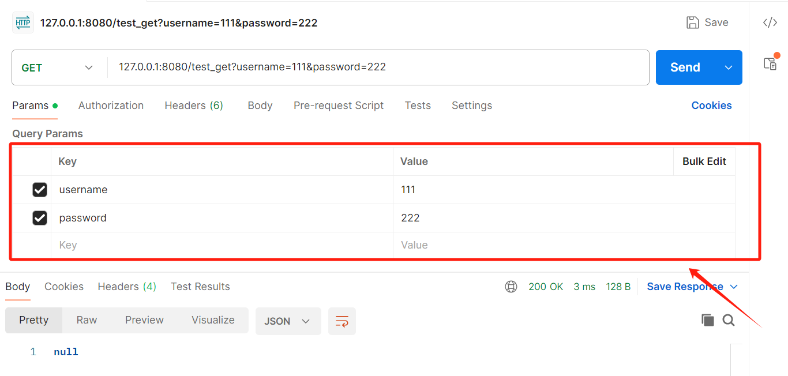

   - 此时在终端可以看到：

     ```python
     username=111&password=222
     INFO:     127.0.0.1:60080 - "GET /test_get?username=111&password=222 HTTP/1.1" 200 OK
     ```

2. 接下来测试一下test_post

   - 在postman中发送post请求
     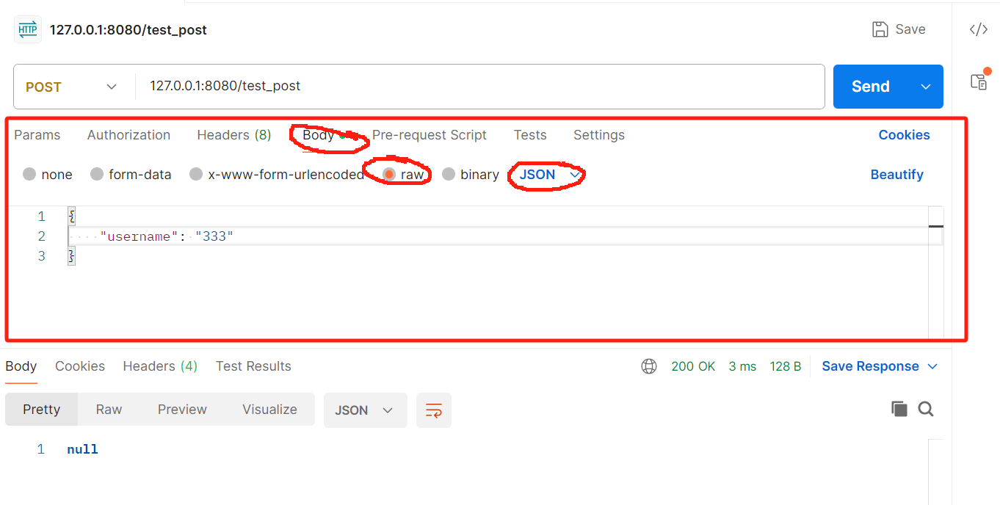

   - 此时在终端可以看到：

     ```python
     {'username': '333'}
     INFO:     127.0.0.1:60163 - "POST /test_post HTTP/1.1" 200 OK
     ```

     

## 4、静态文件static

什么是静态文件（static files）

- 介绍：在 FastAPI 中，静态文件（static files）通常是指不需要经过服务器处理直接提供给客户端的文件，例如HTML文件、CSS文件、JavaScript文件、图像、字体等。这些文件通常用于构建Web页面的用户界面部分。
- 用法：在 FastAPI 中，处理静态文件的典型方法是使用 `Starlette` 的 `StaticFiles`，因为 FastAPI 是基于 Starlette 的框架。

示例代码：

```python
from fastapi import FastAPI, Request
from fastapi.staticfiles import StaticFiles
import uvicorn  # web服务器


app = FastAPI()

# 设置静态文件路由
app.mount("/upimg", StaticFiles(directory="upimg"), name='upimg')


if __name__ == '__main__':
    uvicorn.run("fastapi05:app", host='127.0.0.1', port=8080, reload=True)
    
```

在upimg下放入图片1.png

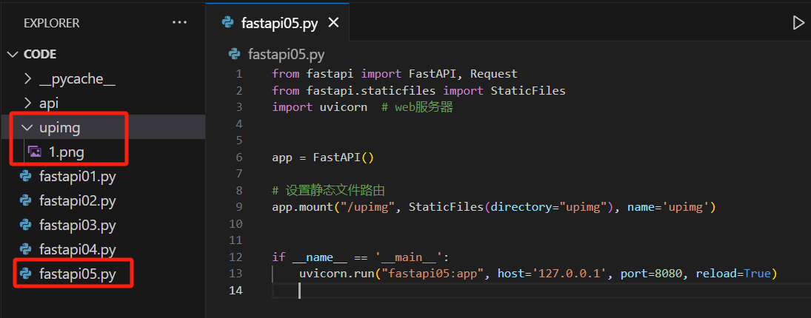

此时访问http://127.0.0.1:8080/upimg/1.png，就可以看到：


## 5、jinja2

简要介绍：

- 是什么？
  - Jinja2 是一个用于 Python 的现代模板引擎，其主要作用是**将动态数据渲染成 HTML 页面**。它提供了模板继承、模板变量、控制结构（如循环和条件语句）等功能，使开发者能够生成动态网页内容。
- 作用：
  - **动态内容渲染**: 通过模板中的占位符和表达式，将后端提供的数据插入到 HTML 页面中，从而生成动态的网页。
  - **模板继承**: 支持模板的继承和复用，开发者可以定义基模板，然后在子模板中扩展和修改，从而提高代码复用性和维护性。
  - **逻辑控制**: 提供条件判断和循环等控制结构，使得模板可以根据数据的不同渲染出不同的内容。
  - **安全性**: 提供自动的 HTML 转义功能，防止 XSS 攻击。
- 使用场景：
  - Jinja2 通常用于 Web 开发中的模板引擎，如在 Flask、Django（尽管 Django 默认使用其自己的模板引擎）等 Web 框架中，帮助开发者生成用户界面，并将后台数据展示给用户。
- 相关博客：
  - [欢迎来到 Jinja2 — Jinja2 2.7 documentation (jinkan.org)](https://docs.jinkan.org/docs/jinja2/)
  - [Python实战：模板引擎Jinja2使用教程_jinja2模板语法-CSDN博客](https://blog.csdn.net/oandy0/article/details/137093834)
  - [jinja2的基本介绍和使用_jinjia2-CSDN博客](https://blog.csdn.net/weixin_48419914/article/details/123579571)


环境配置：

```ppythonython
pip install Jinja2 -i https://pypi.tuna.tsinghua.edu.cn/simple 
```

示例代码：

```python
from fastapi import FastAPI, Request
from fastapi.staticfiles import StaticFiles
from fastapi.templating import Jinja2Templates
import uvicorn  # web服务器


app = FastAPI()
templates = Jinja2Templates(directory='templates')  # 设置jinjia2路径


@app.get('/jinja2temp')
async def jinjia2tem(request: Request):
    return templates.TemplateResponse('index.html',{'request':request, "books":["平凡的世界", "活着"]})


if __name__ == '__main__':
    uvicorn.run("fastapi06:app", host='127.0.0.1', port=8080, reload=True)

```

并创建templates文件夹用于存储html文件

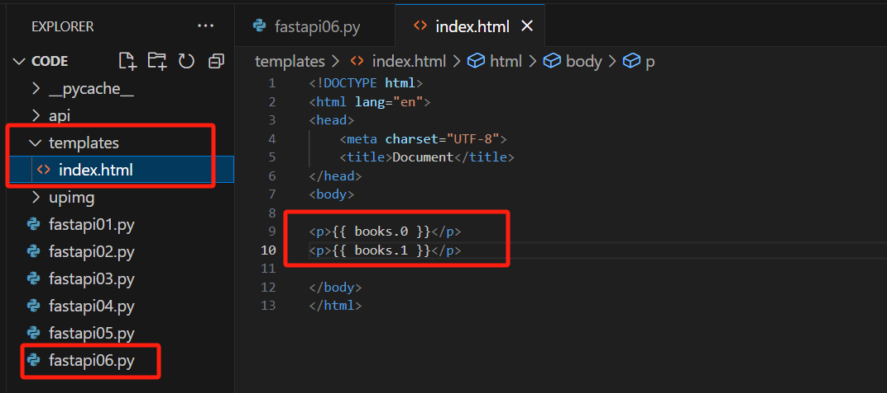

效果展示：

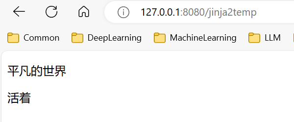


## 6、tortoise-orm

参考：

- [11、tortoise_orm_哔哩哔哩_bilibili](https://www.bilibili.com/video/BV18F4m1K7N3/?p=11&spm_id_from=pageDriver&vd_source=35dfee2e398af56613f978fc65d6defb)
- [Tortoise ORM - Tortoise ORM v0.21.5 文档](https://tortoise.github.io/#pluggable-database-backends)

环境配置：

```python
pip install tortoise-orm -i https://pypi.tuna.tsinghua.edu.cn/simple
```

