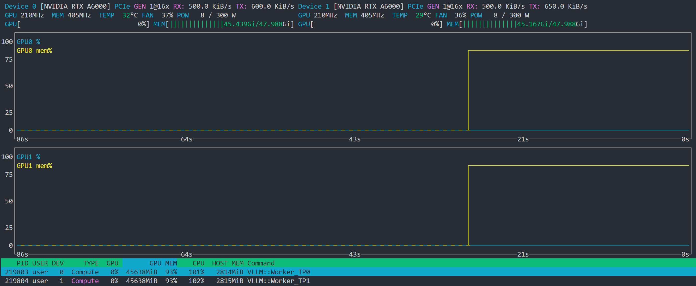

## 高并发

参考：

- [FastAPI 性能进化：如何实现百万请求](https://mp.weixin.qq.com/s/gUyq14FTLPWj7IdAV28Z5A)
- [FastAPI Ultra：让 Uvicorn、uvloop 与 Pydantic v2 飞起来](https://mp.weixin.qq.com/s/h65xB89bmhTF5zKdt3F3KA)

概述：

- 使用异步 I/O 
- 用 Uvicorn + Gunicorn 搞定并发
- 使用缓存
- 部署在 Load Balancer 后面
- Pydantic v2 提速：更快验证和 JSON (反)序列化
- 精简的 endpoints：直接从字节解析、保持热路径分配轻量、把 CPU 密集型任务扔到任务队列，别塞在 event loop 里
- 监控和优化
- 测试


### 基础服务

#### vLLM服务

基于vllm提供一个模型服务，基础环境：

- Python版本：3.10.19
- vllm版本：0.13.0 （2025.12.30最新版）
- 机器配置：双卡A6000
- 模型：全量 Qwen/Qwen3-32B

------

启动在线模型服务：max-model-len已调整到模型默认最大值

```
python -m vllm.entrypoints.openai.api_server \
  --host 0.0.0.0 \
  --port 8007 \
  --model Qwen/Qwen3-32B \
  --max-model-len 32768 \
  --tensor-parallel-size 2 \
  --gpu-memory-utilization 0.90 \
  --swap-space 16 \
  --disable-log-requests\
  --enable-auto-tool-choice \
  --tool-call-parser hermes
```



参数解析：

- `--tensor-parallel-size 2`：模型参数按 tensor 维度切成 2 份，使用 2 张 GPU 共同推理
- `--swap-space 16`：CPU 内存作为 KV cache 溢出区（GB）、当 GPU KV 不够时，把不活跃请求换出
- `--disable-log-requests`：关闭每个请求的日志打印
- `--enable-auto-tool-choice`：启用模型自动选择 tool / function call、支持多轮 tool planning
- `--tool-call-parser hermes`：使用 Hermes 风格的 tool call 解析器、影响输出后处理


测试模型是否正常

```
curl --location 'http://0.0.0.0:8007/v1/chat/completions' \
  --header 'Content-Type: application/json' \
  --data '{
  "model": "Qwen/Qwen3-32B",
  "messages": [
    {
      "role": "user",
      "content": "简单解释一下量子计算"
    }
  ],
  "temperature": 0.2,
  "stream": true
}'
```

------

进行基准测试

```
wget https://huggingface.co/datasets/anon8231489123/ShareGPT_Vicuna_unfiltered/resolve/main/ShareGPT_V3_unfiltered_cleaned_split.json

# 备注：--warmup和--output-len参数暂时没加
vllm bench serve \
  --backend vllm \
  --base-url http://127.0.0.1:8007 \
  --endpoint /v1/completions \
  --model Qwen/Qwen3-32B \
  --dataset-name sharegpt \
  --dataset-path ShareGPT_V3_unfiltered_cleaned_split.json \
  --num-prompts 2000 \
  --request-rate inf \
  --max-concurrency 256 \
  --percentile-metrics p50,p90,p99
```

测试结果：

```
============ Serving Benchmark Result ============
Successful requests:                     2000      
Failed requests:                         0         
Maximum request concurrency:             256       
Benchmark duration (s):                  511.13    
Total input tokens:                      446619    
Total generated tokens:                  410867    
Request throughput (req/s):              3.91      
Output token throughput (tok/s):         803.84    
Peak output token throughput (tok/s):    2047.00   
Peak concurrent requests:                271.00    
Total token throughput (tok/s):          1677.63   
==================================================
```

```
Device 0 [NVIDIA RTX A6000] PCIe GEN 3@16x RX: 118.7 MiB/s TX: 8.936 MiB/s
 GPU 1590MHz MEM 8001MHz TEMP  68°C FAN  97% POW 298 / 300 W
 GPU[||||||||||||||||||||||||||||100%] MEM[||||||||||||||45.441Gi/47.988Gi]

 Device 1 [NVIDIA RTX A6000] PCIe GEN 4@16x RX: 33.06 MiB/s TX: 9.326 MiB/s
 GPU 1560MHz MEM 8001MHz TEMP  64°C FAN  91% POW 298 / 300 W
 GPU[||||||||||||||||||||||||||||100%] MEM[||||||||||||||45.169Gi/47.988Gi]
```

------

基础测试效果有了，下面为了测试模型服务上限，准备三组测试：

- 测试1：并发上限

  - 开始测试：

    ```
    for c in 32 64 128 256 384; do
      vllm bench serve \
        --backend vllm \
        --base-url http://127.0.0.1:8007 \
        --endpoint /v1/completions \
        --model Qwen/Qwen3-32B \
        --dataset-name sharegpt \
        --dataset-path ShareGPT_V3_unfiltered_cleaned_split.json \
        --num-prompts 2000 \
        --request-rate inf \
        --max-concurrency $c
    done
    ```

  - 测试结果：

    ```
    ============ Serving Benchmark Result ============
    Successful requests:                     2000      
    Failed requests:                         0         
    Maximum request concurrency:             32        
    Benchmark duration (s):                  875.64    
    Total input tokens:                      446619    
    Total generated tokens:                  411700    
    Request throughput (req/s):              2.28      
    Output token throughput (tok/s):         470.17    
    Peak output token throughput (tok/s):    608.00    
    Peak concurrent requests:                39.00     
    Total token throughput (tok/s):          980.22    
    ---------------Time to First Token----------------
    Mean TTFT (ms):                          222.27    
    Median TTFT (ms):                        162.88    
    P99 TTFT (ms):                           1377.30   
    -----Time per Output Token (excl. 1st token)------
    Mean TPOT (ms):                          66.10     
    Median TPOT (ms):                        64.84     
    P99 TPOT (ms):                           98.71     
    ---------------Inter-token Latency----------------
    Mean ITL (ms):                           65.40     
    Median ITL (ms):                         54.60     
    P99 ITL (ms):                            275.47    
    ==================================================
    
    ============ Serving Benchmark Result ============
    Successful requests:                     2000      
    Failed requests:                         0         
    Maximum request concurrency:             64        
    Benchmark duration (s):                  605.98    
    Total input tokens:                      446619    
    Total generated tokens:                  411045    
    Request throughput (req/s):              3.30      
    Output token throughput (tok/s):         678.31    
    Peak output token throughput (tok/s):    1032.00   
    Peak concurrent requests:                72.00     
    Total token throughput (tok/s):          1415.33   
    ---------------Time to First Token----------------
    Mean TTFT (ms):                          350.50    
    Median TTFT (ms):                        235.00    
    P99 TTFT (ms):                           4089.92   
    -----Time per Output Token (excl. 1st token)------
    Mean TPOT (ms):                          91.95     
    Median TPOT (ms):                        88.68     
    P99 TPOT (ms):                           155.47    
    ---------------Inter-token Latency----------------
    Mean ITL (ms):                           89.22     
    Median ITL (ms):                         63.62     
    P99 ITL (ms):                            335.46    
    ==================================================
    
    ============ Serving Benchmark Result ============
    Successful requests:                     2000      
    Failed requests:                         0         
    Maximum request concurrency:             128       
    Benchmark duration (s):                  516.55    
    Total input tokens:                      446619    
    Total generated tokens:                  410706    
    Request throughput (req/s):              3.87      
    Output token throughput (tok/s):         795.09    
    Peak output token throughput (tok/s):    1645.00   
    Peak concurrent requests:                138.00    
    Total token throughput (tok/s):          1659.71   
    ---------------Time to First Token----------------
    Mean TTFT (ms):                          733.62    
    Median TTFT (ms):                        383.61    
    P99 TTFT (ms):                           8938.41   
    -----Time per Output Token (excl. 1st token)------
    Mean TPOT (ms):                          151.54    
    Median TPOT (ms):                        145.48    
    P99 TPOT (ms):                           337.64    
    ---------------Inter-token Latency----------------
    Mean ITL (ms):                           141.38    
    Median ITL (ms):                         75.88     
    P99 ITL (ms):                            481.58    
    ==================================================
    
    ============ Serving Benchmark Result ============
    Successful requests:                     2000      
    Failed requests:                         0         
    Maximum request concurrency:             256       
    Benchmark duration (s):                  509.84    
    Total input tokens:                      446619    
    Total generated tokens:                  411179    
    Request throughput (req/s):              3.92      
    Output token throughput (tok/s):         806.48    
    Peak output token throughput (tok/s):    1969.00   
    Peak concurrent requests:                267.00    
    Total token throughput (tok/s):          1682.47   
    ---------------Time to First Token----------------
    Mean TTFT (ms):                          4327.86   
    Median TTFT (ms):                        2803.76   
    P99 TTFT (ms):                           18132.94  
    -----Time per Output Token (excl. 1st token)------
    Mean TPOT (ms):                          282.12    
    Median TPOT (ms):                        272.09    
    P99 TPOT (ms):                           690.50    
    ---------------Inter-token Latency----------------
    Mean ITL (ms):                           251.82    
    Median ITL (ms):                         128.63    
    P99 ITL (ms):                            765.79    
    ==================================================
    
    ============ Serving Benchmark Result ============
    Successful requests:                     2000      
    Failed requests:                         0         
    Maximum request concurrency:             384       
    Benchmark duration (s):                  508.57    
    Total input tokens:                      446619    
    Total generated tokens:                  411627    
    Request throughput (req/s):              3.93      
    Output token throughput (tok/s):         809.38    
    Peak output token throughput (tok/s):    1961.00   
    Peak concurrent requests:                396.00    
    Total token throughput (tok/s):          1687.57   
    ---------------Time to First Token----------------
    Mean TTFT (ms):                          29172.89  
    Median TTFT (ms):                        31799.62  
    P99 TTFT (ms):                           43515.51  
    -----Time per Output Token (excl. 1st token)------
    Mean TPOT (ms):                          281.72    
    Median TPOT (ms):                        273.44    
    P99 TPOT (ms):                           688.77    
    ---------------Inter-token Latency----------------
    Mean ITL (ms):                           252.81    
    Median ITL (ms):                         136.58    
    P99 ITL (ms):                            768.01    
    ==================================================
    ```

- 测试2：输出长度（decode 极限）

  ```
  for len in 128 256 512 1024; do
    vllm bench serve \
      --backend vllm \
      --base-url http://127.0.0.1:8007 \
      --endpoint /v1/completions \
      --model Qwen/Qwen3-32B \
      --dataset-name sharegpt \
      --dataset-path ShareGPT_V3_unfiltered_cleaned_split.json \
      --num-prompts 2000 \
      --request-rate inf \
      --max-concurrency 256 \
      --output-len $len
  done
  ```

- 测试3：Prefill vs Decode，用于判断 prefill 是否成为瓶颈

  ```
  --dataset-name random \
  --input-len 4096 \
  --output-len 128
  ```

------

**Serving Benchmark Result 参数解析：**

- `Successful requests`：成功完成整个请求生命周期
- `Failed requests`：未能成功完成的请求数量
- `Maximum request concurrency`：
  - bench 工具配置的“逻辑并发上限”，即压测客户端最多同时“在飞”的请求数
  - 注意，这是 客户端限制，不等于服务端实际同时执行的请求数
- `Benchmark duration (s)`：
  - 从 benchmark 发出第一个请求到最后一个请求完成的总墙钟时间（wall-clock）
  - 用于计算 req/s、tok/s，本身不是性能指标
- `Total input tokens`：
  - 所有请求中输入 prompt 的 token 数总和，包含system、user、history（如果数据集有）
  - 反映的是 Prefill 阶段的总计算量
- `Total generated tokens`：
  - 所有请求中：模型实际生成的 token 数总和
  - 不包含：prompt、padding
  - 包含：tool call、special tokens（如有）
  - 反映的是 Decode 阶段的总计算量
- `Request throughput (req/s)`：
  - 单位时间内：完整处理完成的请求数量
  - 计算方式：Successful requests / Benchmark duration
- `Output token throughput (tok/s)`：
  - 单位时间内模型生成的 token 数量
  - 只统计decode 阶段，不包含 input tokens
- `Peak output token throughput (tok/s)`：
  - benchmark 过程中：在某个短时间窗口内观测到的 最大瞬时输出 token 速率
  - 反映的是调度 + batch 的瞬时能力
- `Peak concurrent requests`：
  - benchmark 过程中：服务端调度器实际同时持有的请求数量峰值
  - 可能会不等于客户端设置的 concurrency
  - 因为 vLLM scheduler 会：提前接收请求、在 decode 阶段交错执行
- `Total token throughput (tok/s)`：
  - 单位时间内：系统处理的 总 token 数
  - 计算方式：(input tokens + output tokens) / duration
  - 这是 Prefill + Decode 的综合吞吐

**Time to First Token 参数解析：**TTFT，用户“看到第一个 token”要等多久

- `Mean TTFT (ms)`：从请求发出到第一个 token 返回的平均时间
- `Median TTFT (ms)`：TTFT 的第 50 百分位，反映“典型请求”的首 token 等待时间
- `P99 TTFT (ms)`：99% 请求的 TTFT 都 不超过 该值，用于衡量长尾排队、极端拥塞

**Time per Output Token 参数解析：**TPOT，不包含首 token

- `Mean TPOT (ms)`：除第一个 token 以外每生成一个 token 的平均耗时，衡量的是decode 阶段的稳态速度
- `Median TPOT (ms)`：TPOT 的中位数，反映大多数 token 的生成节奏
- `P99 TPOT (ms)`：99% 的 token 生成时间都不超过该值，反映 decode 阶段的尾延迟

**Inter-token Latency 参数解析：**ITL，更偏“调度视角”的 token 延迟

- `Mean ITL (ms)`：相邻两个 token 返回之间的平均时间，包含模型 forward、调度等待、batch 合并
- `Median ITL (ms)`：token 间隔时间的中位数，常用于评估流式输出的“顺滑度”
- `P99 ITL (ms)`：99% token 间隔不超过该值，对应高并发下调度器拥塞或等待 GPU 时间片

------

vLLM bench 输出中重点看

- Throughput
  - requests/s
  - tokens/s
- Latency
  - TTFT
  - p90 / p99
- 失败率
- GPU：
  - `nvidia-smi dmon`
  - 显存是否顶满
  - SM utilization 是否 95%+


#### LangGraph服务

```
我正在构建一个高性能的 AI Agent 服务。底层使用 vLLM 驱动大模型推理，应用层采用 FastAPI 封装，并计划引入 LangGraph 处理复杂的智能体多轮对话逻辑。

参考：
- [FastAPI 性能进化：如何实现百万请求](https://mp.weixin.qq.com/s/gUyq14FTLPWj7IdAV28Z5A)
- [FastAPI Ultra：让 Uvicorn、uvloop 与 Pydantic v2 飞起来](https://mp.weixin.qq.com/s/h65xB89bmhTF5zKdt3F3KA)

参考上述两篇文章提供的思路：
- 使用异步 I/O 
- 用 Uvicorn + Gunicorn 搞定并发
- 使用缓存
- 部署在 Load Balancer 后面
- Pydantic v2 提速：更快验证和 JSON (反)序列化
- 精简的 endpoints：直接从字节解析、保持热路径分配轻量、把 CPU 密集型任务扔到任务队列，别塞在 event loop 里
- 监控和优化
- 测试

对该服务进行极致的性能调优。请逐个根据上述技术要点，给出针对 FastAPI + vLLM + LangGraph 这一特定技术栈的具体实施方案和性能测试计划，逐步优化此服务性能
```


#### FastAPI服务

TODO


### 非异步测试

TODO


### 使用异步 I/O 

TODO


## 数据校验 Pydantic

参考：[FastAPI 开发中数据校验利器 Pydantic 介绍与集成使用](https://juejin.cn/post/7218080084140736572)