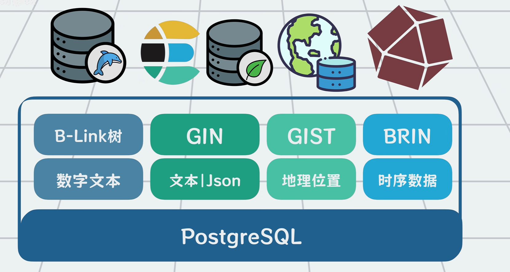

PostgreSQL为什么在多数场景下可以平替MySQL、MangoDB、Redis、Elasticsearch等数据库？

参考：

- [为什么说PostgreSQL是数据库天花板？它为何这么全能？](https://www.bilibili.com/video/BV1gxsnzWEBy)
- [养活国内大半自研数据库团队？PostgreSQL是什么？架构是怎么样的？](https://www.bilibili.com/video/BV1CkCQBoEyp?spm_id_from=333.1245.0.0)

