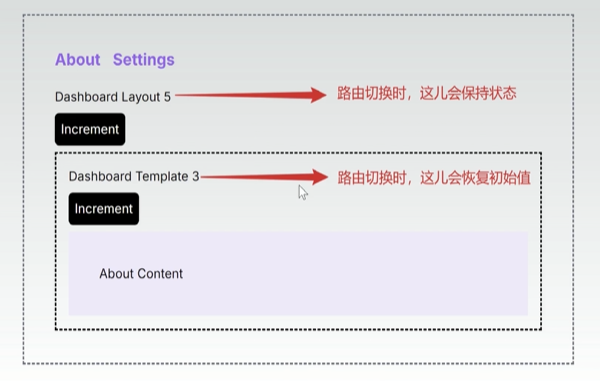

官网教程：https://nextjs.org/docs

视频教程（围绕官网教程）：https://www.bilibili.com/video/BV157pRe8EyD

尚硅谷TS学员笔记：https://blog.csdn.net/qq_33650655/article/details/141372645


## Project structure

如何切换nvm版本：

- 通过`nvm ls`获取有哪些版本
- 通过`nvm use 版本号` 切换版本


关于ts、txs、js：

- **.js**：表示纯 JavaScript 代码文件，浏览器或 Node.js 可以直接运行。
- **.ts**：表示 TypeScript 文件，包含类型信息，需要通过编译器转换成 JavaScript。
- **.tsx**：是 TypeScript 文件的一种，主要用于编写包含 JSX 语法的 React 组件，同样需要编译成 JavaScript。


关于启动项目：

- 在开发过程中使用 **npm run dev**，它启动开发服务器，提供热重载和详细错误信息，便于实时调试；
- 而当你准备将应用部署到生产环境时，先使用 **npm run build** 生成经过优化的生产构建，然后再用 **npm run start** 启动生产服务器。


代码补全：下载es7插件，输入rfc回车即可


如何修改启动端口：修改package.json中的`next dev`与`next start`指令，在其后加入`-p 端口`，如：

```
"scripts": {
    "dev": "next dev --turbopack -p 3005",
    "build": "next build",
    "start": "next start -p 3005",
    "lint": "next lint"
},
```


指定路由：

- 在app目录下创建新目录，新目录名字及为路由的名字
- 新目录下创建page.tsx文件，其内容即为新路由下的内容


## Layouts and Templates

layout与templates的区别：路由跳转时

例如，点击Increment按钮会让数字加1，而发生路由切换时，数字是否恢复初始值，就展现了layout与templates的区别


