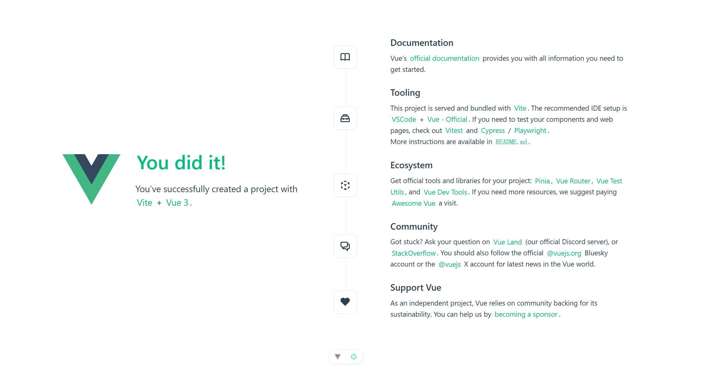
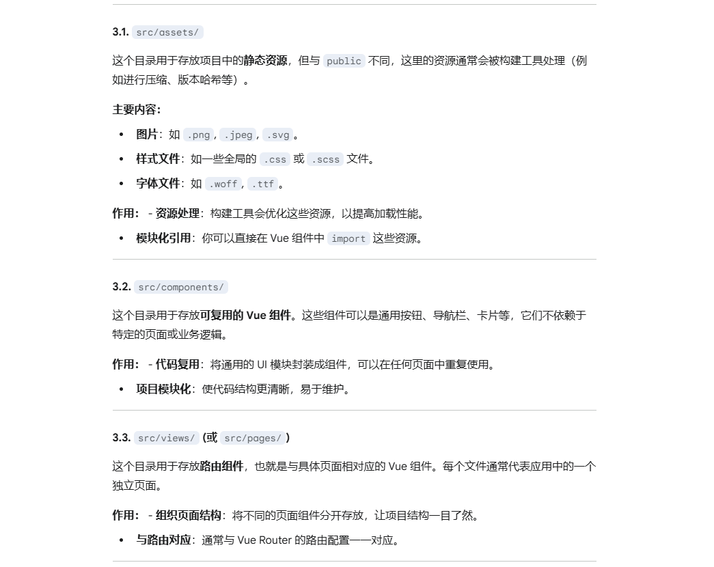
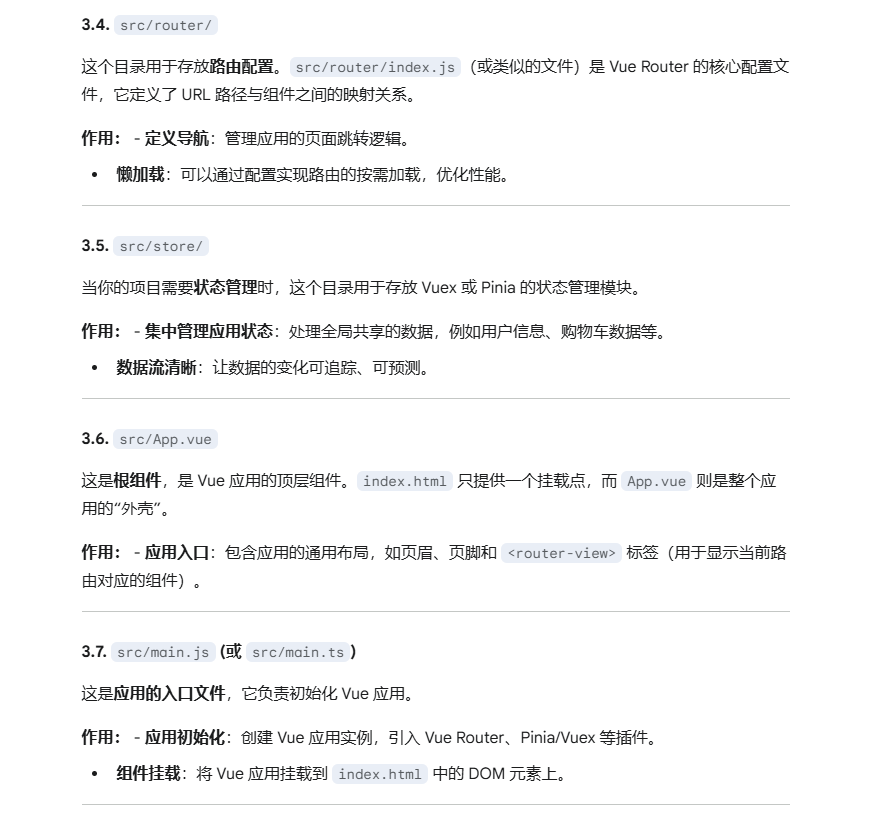
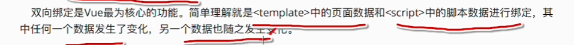
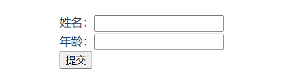
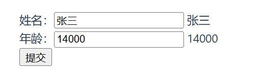
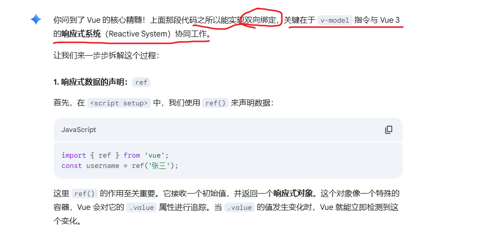
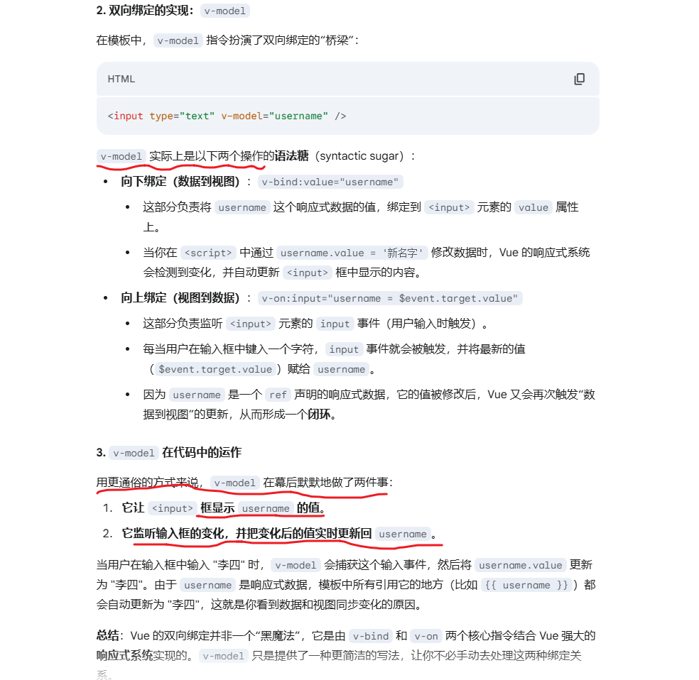
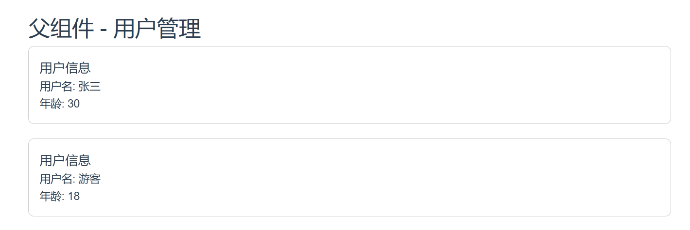
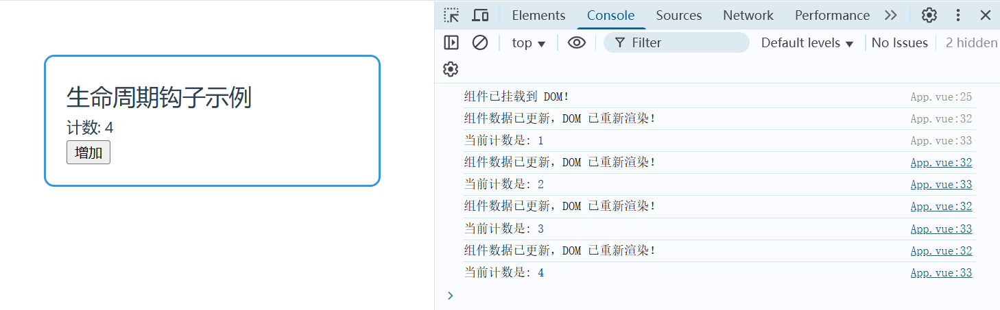

参考教程：

- [官方文档](https://cn.vuejs.org/guide/introduction)
- [楼兰 - 【Vue3极简2025版教程】2个半小时](https://www.bilibili.com/video/BV13tjqzmEDZ)


Vue 2 已于 2023 年 12 月 31 日停止维护，Vue3由2020年发布，且一般情况兼容Vue2。


**脚手架**（Scaffolding）是一个非常实用的工具，它就像建筑工地上的脚手架一样，帮助你快速、规范地搭建一个新项目的基本框架。

脚手架工具可以根据你的选择和配置，自动生成项目所需的**基础文件和目录结构**。这些文件通常包括：

- **项目配置文件**（例如 `package.json`、`pom.xml`、`Gemfile` 等）。
- **源代码的初始模板**（例如 `src` 目录下的主文件、组件文件等）。
- **构建和部署脚本**。
- **代码规范配置**（例如 ESLint、Prettier 等）。
- **测试文件**。

许多编程语言和框架都有自己的脚手架工具，一些非常知名的例子包括：

- **前端**：**Vite**、**Create React App**、**Vue CLI**、**Angular CLI**。
- **后端**：**Spring Initializr**（Java）、**Django**（Python）。


### Vue3安装

node.js不建议低于18。

```
npm create vue@latest
```

创建好后会提示自定义项目名称、开启哪些功能等。

运行项目：

```
cd vue-project
npm install
npm run dev
```

示例效果：




### 项目结构

VSCode推荐插件：Vue-Official


目录结构：

- .vscode：不用管
- node_modules：依赖存放的目录。当你运行 `npm install` 或 `yarn` 命令时，项目所需的所有第三方库和包（如 Vue 本身、Vue Router、Vite 等）都会被下载并存放在这里。
- public：静态资源
- src：源码
- index.html：项目入口，各种跳转及其他操作都是基于这个单页面实现的
- package.json：项目的**清单文件**。它记录了项目的名称、版本、依赖、开发依赖和可执行的脚本命令（如 `npm run dev`, `npm run build`）。
  - scripts含有项目的一些方法
  - devDependencies含有项目依赖项
- tsconfig.json、vite.config.ts：
  - 项目的**构建配置文件**。用于自定义构建行为，如设置代理、配置别名、修改打包规则等。
  - 如果不需要深度定制，一般不用动


特别是src：






### 数据双向绑定




修改原有的App.vue：仅保留.vue文件最常用的三个部分（`<template>`、`<script>` 和 `<style>`）

```vue
<template>
  <div>
    姓名：<input type="text"/> <br/>
    年龄：<input type="number"/> <br/>
    <button>提交</button>
  </div>
</template>

<script setup lang="ts">
</script>


<style scoped>
</style>
```

`npm run dev`不关闭，前端就会自动更新：



怎么做数据绑定？示例代码：

```vue
<template>
  <div>
    姓名：<input type="text" v-model="username" /> {{ username }}<br />

    年龄：<input type="number" v-model="salary" /> {{ salary }}<br />

    <button v-on:click="addSalary">提交</button>
  </div>
</template>

<script setup lang="ts">
  // 1. 导入 Vue 3 中的核心函数 ref。
  // ref 是用来声明响应式数据的，它能让你的数据在改变时自动更新视图。
  import { ref } from 'vue';

  // 2. 使用 ref() 来声明响应式数据
  // ref() 接收一个初始值作为参数，返回一个响应式对象。
  // 在 <script setup> 内部，你可以直接通过变量名访问和修改 ref 对象的值。
  // 在 <template> 模板中，Vue 会自动解包 ref 对象，你无需使用 .value 访问。
  const username = ref('张三');
  const salary = ref(10000);

  // 3. 定义一个方法。
  // 在 <script setup> 中，你可以像写普通 JavaScript 函数一样定义方法。
  // 你不需要再将它们放到 methods 选项中。
  const addSalary = () => {
    // 4. 修改响应式数据。
    // 在 <script> 内部修改 ref 声明的数据时，需要通过 .value 属性来访问和改变它的值。
    // 这与模板中的自动解包行为不同。
    salary.value += 1000;
  };
</script>

<style scoped>
/* style 标签中的代码用于样式，这里保持为空 */
</style>
```

点击提交，薪资就是涨1000：



备注：视频教程源代码可能因为版本问题，无法运行。


关于上述代码与数据双向绑定：






### OptionsAPI 和 CompositionAPI

Options API 

- 概述：是 Vue 2 的主要开发模式，它的核心思想是**将组件的逻辑按照功能划分到不同的选项中**。这些选项包括 `data`, `methods`, `computed`, `watch`, `props`, `components` 等。
- 工作原理：你需要在 Vue 实例中定义一个对象，然后在这个对象里，用固定的键（如 `data`、`methods`）来存放相应的功能。

示例代码：

```
<template>
  <div>
    <p>计数：{{ count }}</p>
    <button @click="addCount">增加</button>
  </div>
</template>

<script>
export default {
  // 1. data 选项：用于存放组件的响应式数据
  data() {
    return {
      count: 0 // 声明一个名为 count 的数据，初始值为 0
    };
  },
  // 2. methods 选项：用于存放组件的方法
  methods: {
    addCount() {
      // 通过 this 关键字访问 data 中的数据
      this.count++;
    }
  },
  // 3. 其它选项（此处未用）：
  // props, computed, watch, mounted 等
};
</script>
```

示例效果：点击“增加”按钮，数值+1


Composition API 

- 概述：是 Vue 3 的核心特性，它旨在解决 Options API 在大型复杂组件中遇到的问题。它的核心思想是**根据功能将相关的逻辑“组合”在一起**。
- 工作原理：它提供了一系列函数（如 `ref`, `reactive`, `computed`, `watchEffect`），让你可以在 `setup` 函数中将相关的逻辑组织在一起。


示例代码：

```
<template>
  <div>
    <p>计数：{{ count }}</p>
    <button @click="addCount">增加</button>
  </div>
</template>

<script setup>
import { ref } from 'vue'; // 从 vue 库中导入 ref 函数

// 1. 使用 ref 声明一个响应式数据
// ref 是一个函数，它接受一个值作为参数并返回一个响应式对象
const count = ref(0);

// 2. 声明一个方法
// 在 <script setup> 中，你可以像写普通 JavaScript 函数一样定义方法
const addCount = () => {
  // 在 script 中修改 ref 的值时，需要通过 .value 属性
  count.value++;
};
</script>
```

示例效果：点击“增加”按钮，数值+1


### 自定义组件传参 Props

> 在 Vue 中，**Props** 是实现父子组件通信最基本、最重要的方式。简单来说，它允许**父组件**向**子组件**传递数据。

#### Props 的基本概念

- **父组件**：拥有并管理数据。
- **子组件**：通过 Props 接收数据，并使用这些数据来渲染自己的视图。
- **单向数据流**：Props 的数据流是单向的，**永远从父组件流向子组件**。子组件**不应该直接修改**从父组件接收到的 Prop 值。如果子组件需要修改数据，应该通过事件（`$emit`）通知父组件进行修改。这被称为“单向数据流”，是 Vue 数据管理的核心原则。

#### 如何在父组件中传递数据

在父组件中，你只需要像使用 HTML 属性一样，将数据绑定到子组件上。

**语法：**

HTML

```
<MyComponent :prop-name="dataVariable" />
```

- `MyComponent`：你的子组件名。
- `:prop-name`：这是 `v-bind` 的缩写，用于动态绑定一个 Prop。`prop-name` 是你在子组件中定义的 Prop 名称。
- `dataVariable`：这是父组件中的一个数据变量（可以是 `data`、`computed` 或 `ref` 声明的变量）。

#### 如何在子组件中接收数据

在子组件中，你需要明确声明自己希望接收哪些 Props。在 Vue 3 的 `<script setup>` 模式下，这通过 `defineProps` 宏实现。

**语法：**

```
// <script setup> 中
const props = defineProps({
  propName: String, // 声明一个名为 propName 的 Prop，其类型为 String
  anotherProp: {
    type: Number,
    required: true, // 还可以设置一些验证规则，如 required
    default: 0
  }
})
```

- `defineProps`：这是一个**编译时宏**（无需导入），用于声明组件接收的 Props。
- 声明 Props 时，你可以只指定类型（`String`、`Number`、`Boolean`、`Array`、`Object`等），也可以使用一个对象来提供更详细的验证（`type`、`required`、`default` 等）。

#### 代码示例

我们来创建一个简单的父子组件，父组件传递一个用户名和一个用户年龄给子组件。

##### 1. 子组件：`UserProfile.vue`

这个组件负责接收并显示用户的个人信息。

```
<template>
  <div class="user-card">
    <h3>用户信息</h3>
    <p>用户名: {{ userName }}</p>
    <p>年龄: {{ userAge }}</p>
  </div>
</template>

<script setup>
// 从 'vue' 导入 defineProps，但实际上在 <script setup> 中无需导入
// 它会自动成为全局可用的宏

// 使用 defineProps 宏来声明组件接收的 props
// 这将使组件能够接收来自父组件的数据
const props = defineProps({
  // 1. 声明一个名为 userName 的 prop，类型为 String
  // 当父组件传递的数据不符合此类型时，Vue 会发出警告
  userName: String,

  // 2. 声明一个名为 userAge 的 prop，类型为 Number
  userAge: {
    type: Number, // 类型为数字
    default: 18 // 如果父组件没有传递此 prop，则使用默认值 18
  }
});

// 你也可以通过 console.log(props.userName) 来访问 props 的值
</script>

<style scoped>
.user-card {
  border: 1px solid #ccc;
  padding: 15px;
  border-radius: 8px;
  margin-bottom: 20px;
}
</style>
```

##### 2.父组件：`App.vue`

这个组件负责管理数据，并向子组件传递数据。

```
<template>
  <div class="app-container">
    <h1>父组件 - 用户管理</h1>
    
    <UserProfile 
      :user-name="currentUser.name" 
      :user-age="currentUser.age" 
    />
    
    <UserProfile :user-name="guest.name" />
    
  </div>
</template>

<script setup>
import { ref } from 'vue';
// 导入自定义组件
import UserProfile from './components/UserProfile.vue';

// 定义父组件中的响应式数据
const currentUser = ref({
  name: '张三',
  age: 30
});

const guest = ref({
  name: '游客'
});
</script>

<style scoped>
.app-container {
  font-family: Arial, sans-serif;
  padding: 20px;
}
</style>
```

在上面的例子中，`App.vue`（父组件）通过 `:user-name` 和 `:user-age` 将数据传递给了 `UserProfile.vue`（子组件）。子组件通过 `defineProps` 声明并接收了这些数据，并在模板中进行了渲染。


示例效果：



### 组件声明周期

> 组件的生命周期指的是从创建到销毁的整个过程，在这个过程中，Vue 会自动执行一些特殊的函数，我们称之为**生命周期钩子（Lifecycle Hooks）**。通过这些钩子，我们可以在组件的不同阶段插入自己的代码，执行特定的逻辑，比如获取数据、操作 DOM、清除定时器等。

#### 1、基础概念

Vue 3 的生命周期钩子与 Vue 2 略有不同，但概念基本一致。下面是 Vue 3 中最常用的钩子及其执行顺序：

1. **挂载阶段（Mounting）**：组件实例被创建并挂载到 DOM 上。
   - `beforeCreate`
   - `created`
   - `onBeforeMount`
   - `onMounted`
2. **更新阶段（Updating）**：组件的响应式数据发生变化，导致组件重新渲染。
   - `onBeforeUpdate`
   - `onUpdated`
3. **卸载阶段（Unmounting）**：组件实例从 DOM 中被移除。
   - `onBeforeUnmount`
   - `onUnmounted`
4. **调试阶段**：用于调试组件。
   - `onErrorCaptured`
   - `onRenderTracked`
   - `onRenderTriggered`


#### 2、详细解析与代码示例

在 Vue 3 的 **Composition API** 中，我们使用以 `on` 开头的函数来调用这些钩子。这些函数必须在 `<script setup>` 中或 `setup` 函数的同步代码中调用。

下面我们通过一个计数器组件的完整示例，来演示每个常用生命周期钩子的作用。

```
<template>
  <div class="counter">
    <h2>生命周期钩子示例</h2>
    <p>计数: {{ count }}</p>
    <button @click="increment">增加</button>
  </div>
</template>

<script setup>
import { ref, onMounted, onUpdated, onBeforeUnmount, onUnmounted } from 'vue';

// 1. 数据声明
const count = ref(0);

// 2. 方法声明
const increment = () => {
  count.value++;
};

// 3. 生命周期钩子

// onMounted: 在组件被挂载到 DOM 后调用。
// 通常在这里进行异步数据请求、初始化第三方库或操作 DOM。
onMounted(() => {
  console.log('组件已挂载到 DOM！');
  // 可以在这里获取 DOM 元素，例如：document.querySelector('.counter')
});

// onUpdated: 在组件的响应式数据发生变化并导致 DOM 更新后调用。
// 可以在这里执行依赖于更新后 DOM 的操作。
onUpdated(() => {
  console.log('组件数据已更新，DOM 已重新渲染！');
  console.log('当前计数是:', count.value);
});

// onBeforeUnmount: 在组件实例被卸载之前调用。
// 可以在这里执行清理操作，如清除定时器、取消网络请求等。
onBeforeUnmount(() => {
  console.log('组件即将被卸载！准备进行清理...');
});

// onUnmounted: 在组件实例被卸载并从 DOM 中移除后调用。
onUnmounted(() => {
  console.log('组件已完全卸载！清理工作完成。');
});

// 其他生命周期钩子（为了简洁，此处未包含在示例中）：
// onBeforeMount: 在组件挂载到 DOM 之前调用。
// onBeforeUpdate: 在组件更新数据但 DOM 尚未更新之前调用。
</script>

<style scoped>
.counter {
  border: 2px solid #3498db;
  padding: 20px;
  border-radius: 10px;
  margin: 20px;
}
</style>
```

当你将上述组件添加到你的 Vue 应用中并打开浏览器控制台时，你会看到以下输出：

1. **页面初次加载**：
   - 控制台输出：`组件已挂载到 DOM！`
2. **点击“增加”按钮**：
   - `count` 的值变为 `1`。
   - Vue 触发更新，`onUpdated` 钩子执行。
   - 控制台输出：`组件数据已更新，DOM 已重新渲染！` 和 `当前计数是: 1`
3. **重复点击**：
   - 每次点击都会重复上面的更新过程。
4. **如果从 DOM 中移除此组件（比如通过路由切换到另一个页面）**：
   - `onBeforeUnmount` 钩子执行。
   - 控制台输出：`组件即将被卸载！准备进行清理...`
   - `onUnmounted` 钩子执行。
   - 控制台输出：`组件已完全卸载！清理工作完成。`


示例效果：



### 路由插件基础使用

Vue Router 是 Vue.js 官方的路由管理器。它让构建**单页应用（Single-Page Application，SPA）**变得非常简单。在 SPA 中，当你点击链接时，页面不会重新加载，而是只更新部分内容。Vue Router 负责管理 URL 地址与组件之间的映射关系，让你可以像在传统多页应用中一样进行导航，但体验更流畅。


### 路由工作模式和replace属性

#### 路由工作模式

Vue Router 提供了两种主要的路由模式，它们决定了 URL 的显示形式和页面的导航方式。

------

##### 1. Hash 模式 (`createWebHashHistory`)

这是 Vue Router 的**默认模式**。它使用 URL 中的 **hash**（`#`）部分来模拟完整的 URL 路径，因此浏览器不会向服务器发送任何请求。

- **URL 形式**：`http://example.com/#/user/profile`
- **工作原理**：当 hash 值改变时，浏览器并不会重新加载页面，而是触发 `hashchange` 事件。Vue Router 监听这个事件，并根据新的 hash 值渲染对应的组件。
- **优点**：
  - **兼容性好**：对所有现代浏览器和旧版本浏览器都支持。
  - **部署简单**：不需要服务器端做任何特殊配置，所有路由都在客户端完成。
- **缺点**：
  - **URL 不美观**：带有 `#` 符号，看起来不那么直观。

------

##### 2. History 模式 (`createWebHistory`)

这种模式利用了 HTML5 的 **History API** (`pushState` 和 `replaceState`)，使得 URL 看起来像传统的网页地址一样干净。

- **URL 形式**：`http://example.com/user/profile`
- **工作原理**：当导航发生时，History API 会改变 URL，但不会触发页面的重新加载。Vue Router 同样会监听这些变化并渲染组件。
- **优点**：
  - **URL 干净美观**：没有 `#` 符号，更符合用户习惯和搜索引擎优化（SEO）。
- **缺点**：
  - **需要服务器配置**：如果用户直接访问 `http://example.com/user/profile`，服务器会收到一个对 `user/profile` 的请求。如果服务器找不到对应的文件，就会返回 404 错误。因此，你需要配置服务器，将所有请求都重定向到你的 Vue 应用的入口文件 (`index.html`)。


#### `router-link` 的 `replace` 属性

`router-link` 是用于导航的组件。通常，它会将新路由添加到浏览器的历史记录栈中，就像你点击一个普通链接一样。

`replace` 属性可以改变这个默认行为。当你在 `router-link` 上添加 `replace` 属性时，它会**替换**当前的历史记录，而不是推入一个新的。

- **默认行为（不使用 `replace`）**：
  - 从 `/A` 导航到 `/B` 时，浏览器历史记录栈：`[ /A, /B ]`
  - 此时点击浏览器回退按钮，会回到 `/A`。
- **使用 `replace` 属性**：
  - 从 `/A` 导航到 `/B` 时，历史记录栈：`[ /B ]`
  - 此时点击浏览器回退按钮，会直接跳过 `/A`，回到 `/A` 之前的页面。


### pinia集中状态存储

#### 什么是 Pinia？

**Pinia** 是一个轻量级、类型安全的 Vue 状态管理库，被誉为 Vuex 5 的替代品。它旨在提供一个更简单、更直观的方式来管理应用中的全局共享状态。

**为什么选择 Pinia？**

- **API 简洁直观**：学习成本低，语法更像 Vue 3 的 Composition API。
- **类型安全**：为 TypeScript 提供了出色的支持，可以获得完整的类型推断，减少错误。
- **模块化**：每个 Store 都是一个独立的模块，方便组织和维护，且支持动态创建和销毁。
- **Devtools 支持**：在 Vue Devtools 扩展中提供强大的调试功能，如时间旅行、状态快照等。

------

#### Pinia 的核心概念

Pinia 的核心是 **Store**。一个 Store 就像一个独立的、中心化的数据容器，它包含以下三个核心部分：

1. **`state`**：定义应用中的**共享数据**。类似于组件中的 `data`，但它是全局可用的。
2. **`getters`**：定义对 `state` 的**计算属性**。类似于组件中的 `computed`，用于从 `state` 派生出新数据，且具有缓存功能。
3. **`actions`**：定义可以**修改 `state` 的方法**。类似于组件中的 `methods`，可以进行同步或异步操作。

------

#### 基础使用步骤与代码示例

```
npm install pinia
```


### 路由嵌套和路由传参

这两个概念是构建复杂单页应用（SPA）必不可少的功能。

#### 1. 路由嵌套 (Nested Routes)

路由嵌套允许你在一个父级路由下定义子级路由，从而构建复杂的 UI 结构。这种结构非常常见，例如一个用户管理页面，通常会包含“用户信息”、“用户设置”、“订单列表”等子页面。

**核心思想：**

- **父级路由**：负责渲染一个通用的布局（比如侧边栏、导航栏）。
- **子级路由**：负责在父级路由的 `<router-view>` 中渲染自己的组件。

------

#### 2. 路由传参 (Route Params & Queries)

路由传参是实现动态路由和页面间数据传递的关键。Vue Router 提供了两种主要的传参方式：

##### a. 动态路由参数 (Params)

- **定义方式**：在路由路径中使用冒号 `:` 来定义一个参数。例如：`path: '/users/:id'`。
- **URL 形式**：`http://example.com/users/123`
- **用途**：用于传递**必选**的、作为路径一部分的参数，通常用来标识一个唯一的资源，如用户的 ID、产品的 ID。
- **获取方式**：在组件中通过 `$route.params` 或 `useRoute().params` 来获取。

##### b. 查询参数 (Queries)

- **定义方式**：无需在路由路径中声明，直接在导航时添加到 URL 的问号 `?` 后面。
- **URL 形式**：`http://example.com/search?keyword=vue`
- **用途**：用于传递**可选**的、不作为路径一部分的参数，通常用于筛选、排序、搜索等。
- **获取方式**：在组件中通过 `$route.query` 或 `useRoute().query` 来获取。


### 快速上手element-plus

Element Plus 是一套基于 Vue 3 的桌面端组件库，它提供了大量预先构建好的 UI 组件，可以让你轻松地搭建美观、功能齐全的后台管理系统。

```
npm install element-plus --save
```


