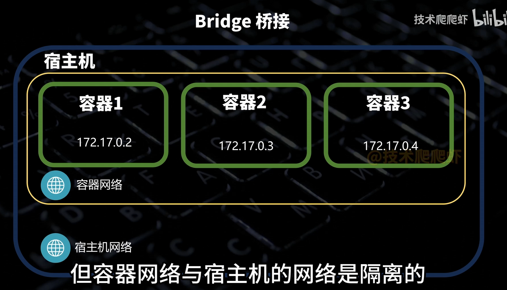
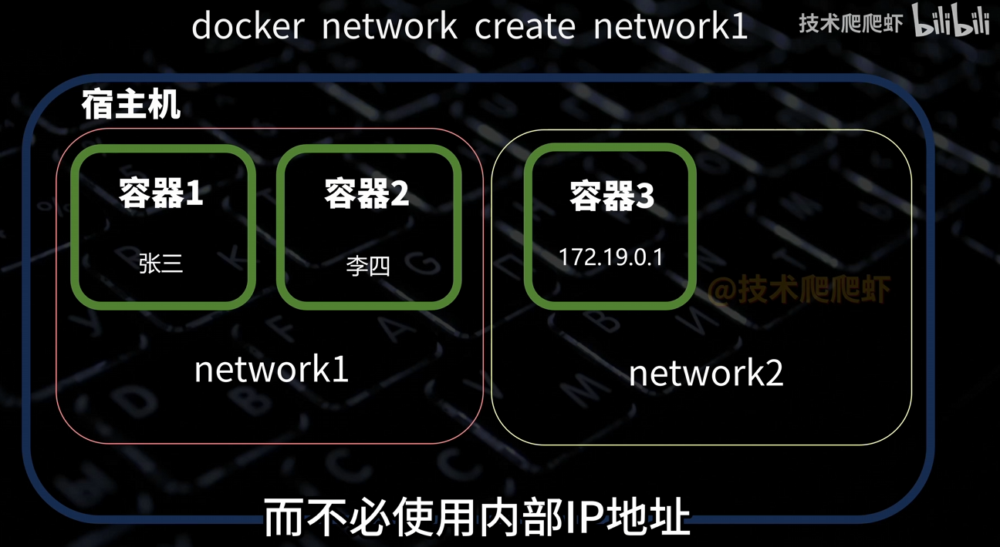

# Docker基础

参考：

- [40分钟的Docker实战攻略](https://www.bilibili.com/video/BV1THKyzBER6)

docker容器与虚拟机的区别：docker容器共用一套内核，而每个虚拟机都包含一个操作系统的完整内核

### 镜像

关于docker拉取镜像时，镜像的命名，比如`docker pull docker.io/library/nginx:latest`，其中：

- `docker.io` 为 registry（仓库地址），拉去官方仓库时，可省略
- `library`为 namespace（命名空间，或者说：作者名），docker官方仓库的namespace，可省略

关于镜像与CPU架构，一般不需要特殊指定，对于特殊的开发板等情况，有些镜像可能没有对目标架构没有支持。

### 容器

容器原理：

- Cgroups
- Namespaces

每个容器都类似独立的操作系统

#### 参数

一些参数

- `-d` 表示分离模式，容器在后台执行
- `-p` 端口映射
- `-V` 挂载卷。
  - 类似对数据做持久化保存，删除了容器后，数据由于存在宿主机目录下，就不会被删除。
  - 多种挂载方式
- `--restart` 重启策略

#### 调试容器

概述：

- stop
- start
- inspect 可以查看容器设置了什么（复制给大模型即可）
- create 创建容器，但不启动
- logs 加上 -f 可以滚动查看日志
- exec
  - 进入容器内部，比如 `docker exec -it 容器ID /bin/sh`
  - 也可以在后面直接加上一些linux指令

#### 构建镜像

撰写Dockerfile：

- 所有Dockerfile第一行是From **，表示引用哪个基础镜像
- 后面都是在镜像内做的操作（？）
- 一个Dockerfile里只能写一个CMD指令（？）

`docker build -t 镜像名称 其他参数` 构建镜像

docker run 运行镜像

docker push 推送到docker hub

### 网络

常见形式：

- 默认桥接模式：所有容器都连接到这个网络，每个容器都分配了一个内部IP地址，一般为172.17开头，在子网中，容器可以通过内部ip互相访问。但是容器网络与宿主机的网络是隔离的
  
- 创建子网（也是一钟桥接模式）：创建出子网，也是桥接网络的一种，同一子网下的容器可以互相通信，不同子网不可通信
  
- Host模式：直接用宿主机的网络空间
- none模式

### 一些概念

一些文件处理、文件路径相关的概念：

- **build context（构建上下文）**
  - 是 `docker build`（或 docker-compose 的 `build:`）时“要发送给 Docker daemon”的那一片目录。Docker 只会把这个目录（受 `.dockerignore` 过滤后）里的文件发送到守护进程用于构建镜像。
  - 举例：`context: ./containers/app_mcp` → 只有 `containers/app_mcp` 下的内容会被当作构建上下文发送；`context: ./` → 整个 repo 会被发送（除被 `.dockerignore` 忽略的）。
- **Dockerfile（位置）**
  - `docker build -f <Dockerfile-path> <context>`：`-f` 可以指向任何路径（客户端可读），但 **COPY** 指向的源仍然只能来自 `context`。
  - 在 `docker-compose.yml` 中 `build.dockerfile` 的路径 **通常相对于 `build.context`**。也就是说，`dockerfile: containers/app_mcp/Dockerfile` 与 `context: ./` 时，Docker 会在 `./containers/app_mcp` 找 Dockerfile（Compose 具体实现会从客户端读取该 Dockerfile）。
- **COPY / ADD（用法与语义）**
  - **语法**：`COPY <src> <dest>` 或 JSON 形式 `COPY ["src","/dest/"]`。
  - **src**：*必须*位于构建上下文内（相对路径或 glob 模式）。如果 src 不在 context，构建会失败（或不会被包含）。
  - **dest**：容器镜像内的路径（可以是绝对 `/app` 或相对 `./`，相对时相对于 `WORKDIR`）。
  - 关键：`COPY . .` 的第一个 `.` 是“构建上下文的根”而不是宿主机的任意路径。
- **WORKDIR**
  - `WORKDIR /app` 会在镜像内创建并切换当前工作目录。后续 `COPY . .`（右侧的 `.`）如果是相对路径会放到 `/app`（或你写的 `/app/xxx`）。
- **.dockerignore**
  - 控制“哪些文件不被包含在构建上下文里”。如果把 `containers/app_mcp/mcp_server.py` 错误地加入 `.dockerignore`，就会导致文件没被发送给 daemon。
- **runtime volume（运行时卷、bind mount）会覆盖镜像文件**
  - 如果 `docker-compose.yml` 把宿主目录或其它目录 mount 到镜像内的**同一路径**（比如 `/app`），挂载会在容器启动时覆盖镜像里该路径的内容 —— 即使镜像里有 `mcp_server.py`，也会被宿主挂载的空目录或其它内容“遮住”，导致“文件不存在”的错误。
  - 常见例子：`volumes: - ./:/app` 会把宿主当前目录覆盖镜像的 `/app`。

# Docker Compose教程

官方文档：

- https://docs.docker.com/compose/

大佬分享：

- [Docker Compose 基础教程](https://www.cnblogs.com/johnnyzen/p/17785405.html)
- [Docker Compose 安装及使用](https://cloud.tencent.com/developer/article/2454497)

docker compose并不是把一堆容器打包成一个大容器，因为好的分布式，应该是各个容器相互独立，而不是坏了一个，整个docker compose就崩了，docker compose只是方便统一管理。

一些编写技巧：

- 每个容器对应docker-compose中的一个services服务
- depends_on表示依赖关系，并且决定了容器的启动顺序

直接把所有容器的指令给大模型，撰写docker-compose.yml即可

常见指令：

- docker compose up -d 启动容器（不会重复启动）
- docker compose down 停止并删除容器
- docker compose stop 停止并不删除容器
- docker compose start 启动容器

docker compose主要还是适合单机运行，多机还需要k8s帮忙。
