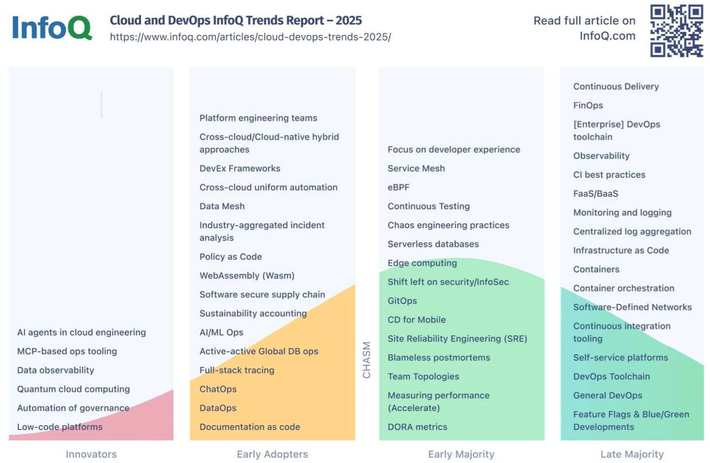
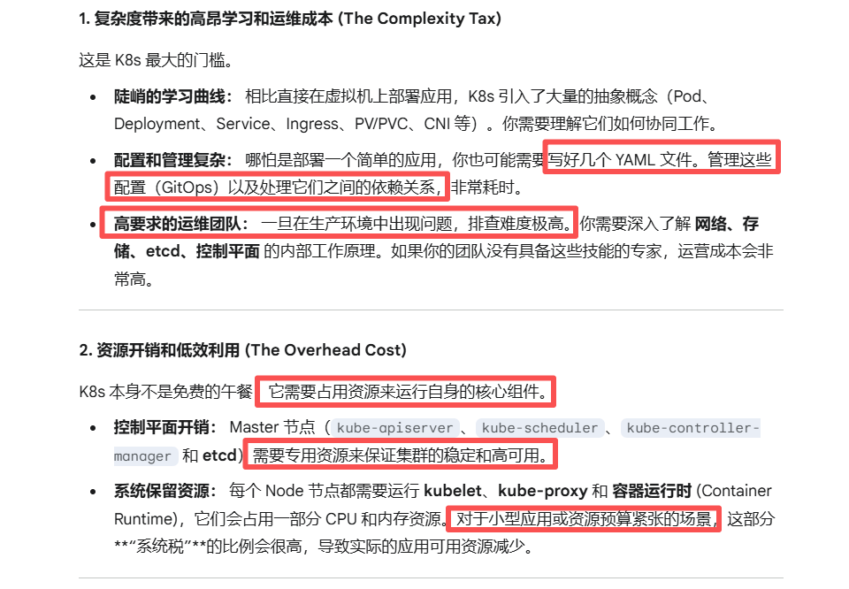
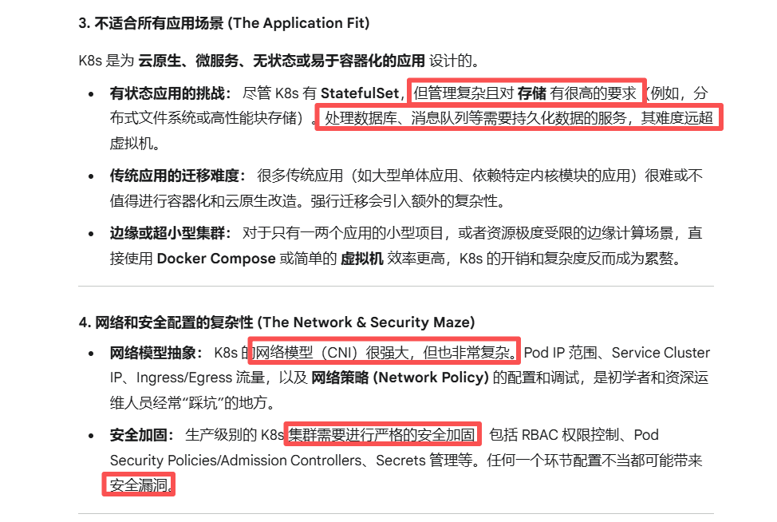
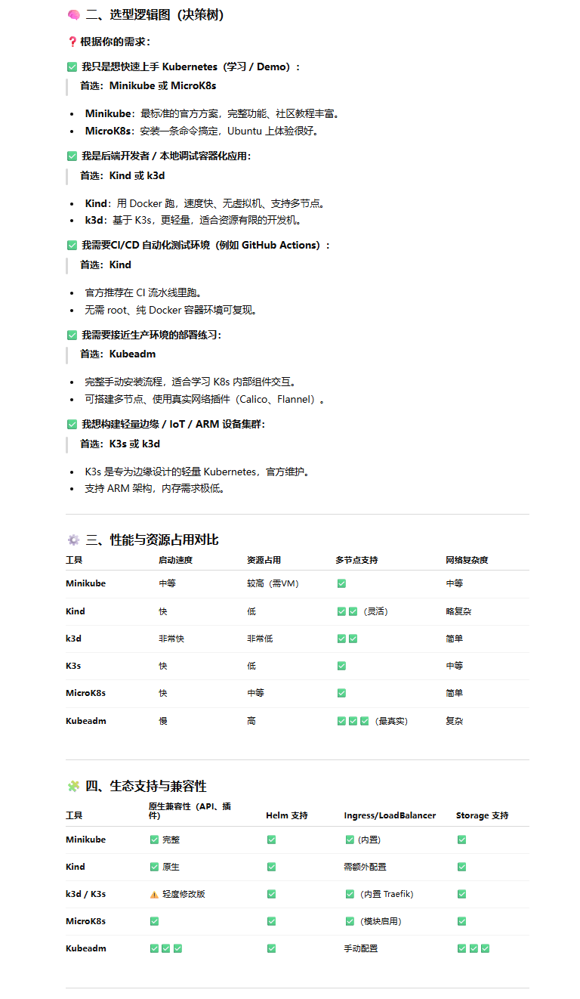
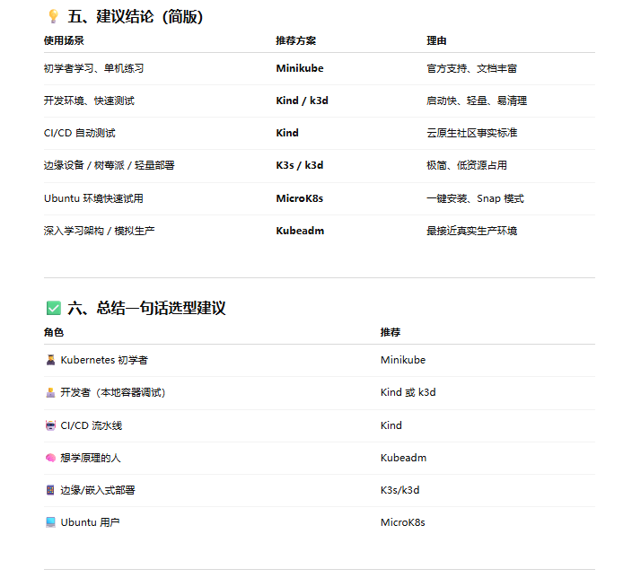
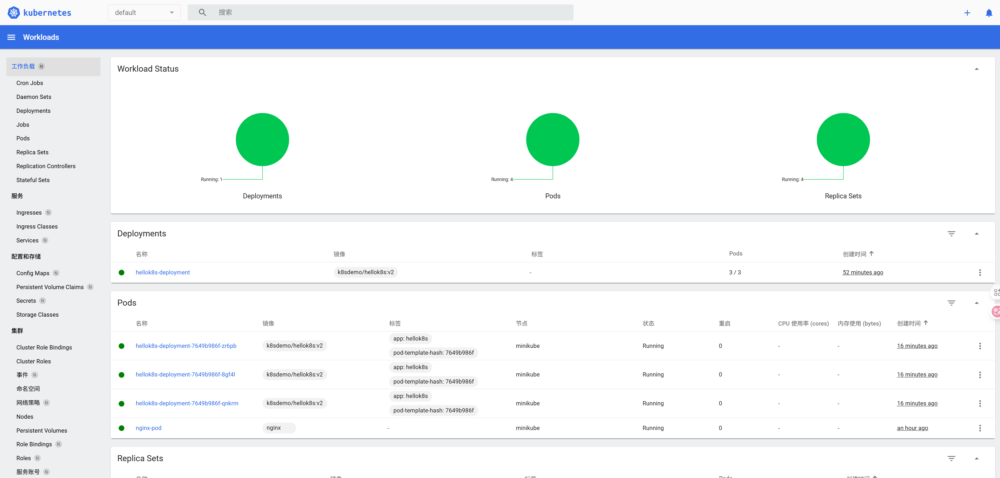
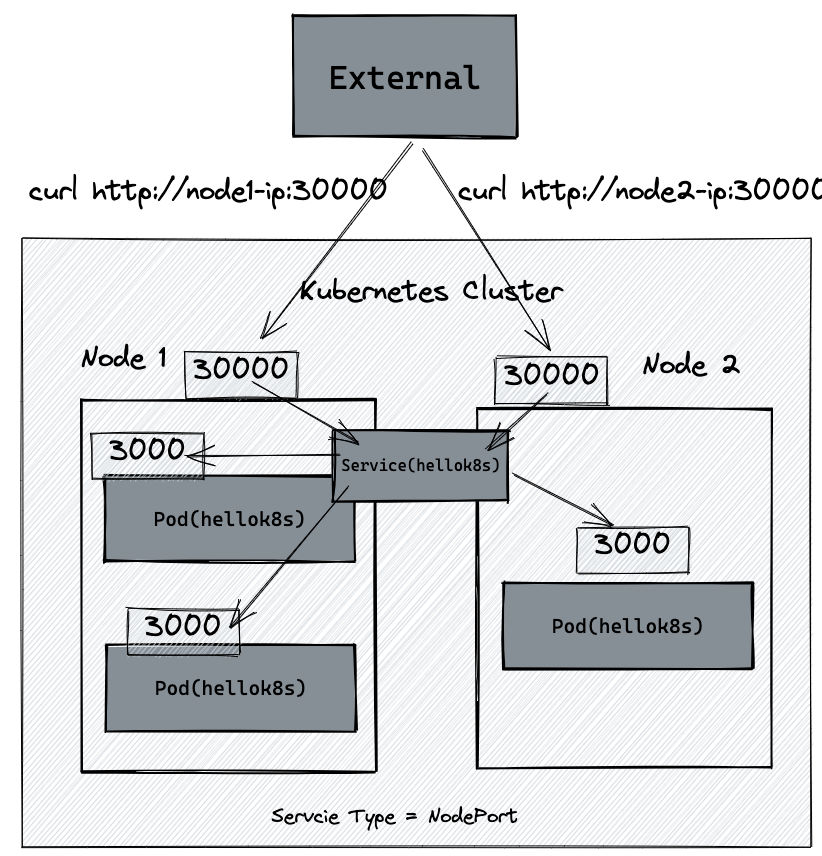
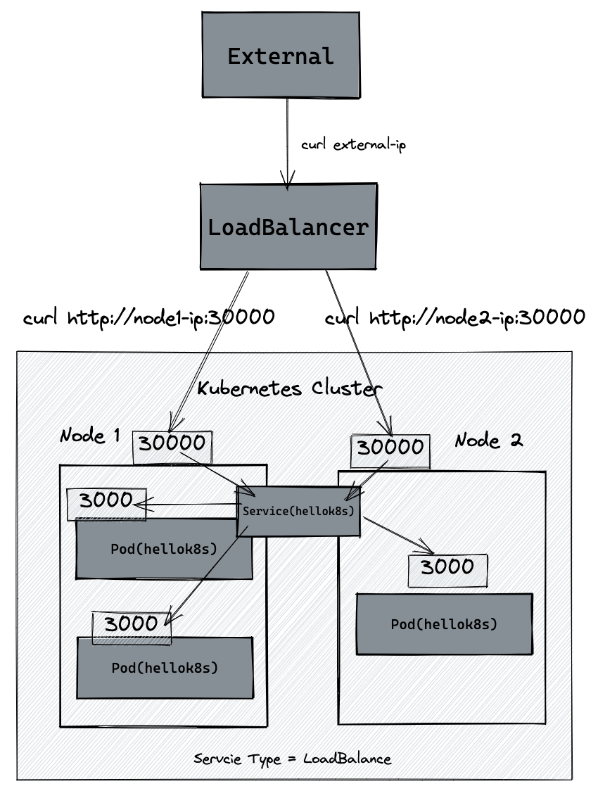
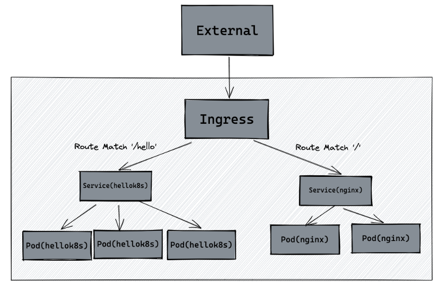
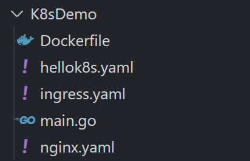

[TOC]


# 内容概述

## 0、前要

>官网介绍（多年未变）：[Kubernetes](https://kubernetes.io/docs/concepts/overview/), also known as K8s, is an open source system for automating deployment, scaling, and management of containerized applications.

K8s是大规模容器应用的自动化工具，如果你的业务不是以容器方式管理/容器数量较少，没必要用K8s。

K8s常用于：DevOps、SRE、云原生等

技术报告：参考[InfoQ的2025年报告](https://www.infoq.com/articles/cloud-devops-trends-2025/)




## 1、开源教程

### 入门教程

官网：https://kubernetes.io/zh-cn/docs/tutorials/kubernetes-basics/

k8s各个发行版框架教程：后文会介绍为什么分了那么多框架，以及如何抉择

- kubeadm：
  - [官方 - 使用 kubeadm 引导集群](https://kubernetes.io/zh-cn/docs/setup/production-environment/tools/kubeadm/)
  - [kubeadm部署Kubernetes（k8s）](https://www.cnblogs.com/heian99/p/12173599.html)
  - [王树森 - 196小时讲完的kubernetes（k8s）教程](https://www.bilibili.com/video/BV1uF411Q7hD)
- minikube：
  - https://github.com/guangzhengli/k8s-tutorials

- k3s：
  - https://docs.k3s.io/zh/
  - https://www.escapelife.site/posts/754ba85c.html
- 其他：
  - [Kuboard](https://kuboard.cn/learning/)：一款专为 Kubernetes 设计的免费管理界面


### K8s的边界

一言以蔽之：K8s 是解决“规模化”和“自动化”问题的利器。

- 弊端/边界： 如果你的应用 规模很小、团队经验不足、预算有限，或者应用本身 **非云原生且不适合容器化**，那么 K8s 的 复杂度 和 资源开销 会成为沉重的负担。
- 正确使用： 只有当你面对 数十甚至数百个微服务、需要 高可用、自动化运维、快速迭代 时，K8s 的强大编排能力才能完全发挥价值，其带来的效率提升才能覆盖掉初始的复杂度成本。






### 学习顺序

以下内容由大模型列出，仅供参考。

------

01 基础 - 核心概念与工作负载  (The Basics)

> 核心概念（Pod、Deployment、Service、Ingress、Volume等）

这个阶段，你需要理解 K8s 世界里的基本元素和它们之间的关系。

| 核心内容      | 关键理解点                                                   | 实战目标                                                     |
| ------------- | ------------------------------------------------------------ | ------------------------------------------------------------ |
| **容器技术**  | 熟悉 Docker 或其他容器运行时（如 containerd）的基本操作，理解 镜像 (Image)、容器 (Container) 的生命周期和原理。这是 K8s 的基石。 | 能够创建自己的 Dockerfile 并运行一个简单的应用。             |
| **Pod**       | K8s 的最小部署单元。理解 Pod 为什么需要包含一个或多个容器（Sidecar 模式），以及 Pause 容器 的作用。 | 编写第一个 Pod YAML 并成功运行。                             |
| **Workloads** | 理解三大工作负载的作用和区别：<ul><li>**Deployment**: 适合无状态应用，负责声明式更新和回滚。</li><li>**StatefulSet**: 适合有状态应用（如数据库），确保顺序性和唯一性。</li><li>**DaemonSet**: 确保每个 Node 上都运行一个 Pod（如监控 Agent）。</li> | 部署一个高可用的 Nginx Deployment，并尝试进行一次版本升级和回滚。 |
| **Service**   | 如何让外部访问到 Pod？理解 ClusterIP、NodePort 和 LoadBalancer 三种核心 Service 类型的作用和使用场景。 | 通过 Service 暴露你的 Nginx Deployment。                     |

------

02 框架 - 集群架构与核心组件 (The Architecture)

只有理解 K8s 集群是如何运作的，才能进行有效的故障排查和调优。

| 核心内容                 | 关键理解点                                                   | 实战目标                                                     |
| ------------------------ | ------------------------------------------------------------ | ------------------------------------------------------------ |
| **Master/Control Plane** | **控制平面** 的核心组件：**API Server**（集群入口）、**etcd**（持久化存储/集群大脑）、**Scheduler**（调度器）、**Controller Manager**（控制器）。理解它们之间的通信。 | 能够用 `kubeadm` 或 Minikube/Kind 搭建一个简单的集群，并查看组件日志。 |
| **Node/Worker**          | **工作节点** 的核心组件：**Kubelet**（与 Master 通信）、**Kube-proxy**（网络代理）、**Container Runtime**。 | 理解 Pod 是如何被 Kubelet 运行起来的。                       |
| **Networking**           | **K8s 网络模型** 的设计哲学。了解 **CNI** (Container Network Interface) 的作用。理解 Pod 之间、Pod 与 Service 之间是如何通信的。 | 部署一个 CNI 插件（如 Calico 或 Flannel），并排查简单的网络不通问题。 |
| **Storage**              | 理解 **Volume**、**PersistentVolume (PV)** 和 **PersistentVolumeClaim (PVC)** 的抽象，这是有状态应用的关键。 | 成功地为 StatefulSet 挂载一个 PVC，确保数据持久化。          |

------

03 实战 - 生产环境必备 (The Production Drill)

这个阶段是让你从“能用”到“用得好”的关键，贴近生产环境需求。

| 核心内容                | 关键理解点                                                   | 实战目标                                                     |      |
| ----------------------- | ------------------------------------------------------------ | ------------------------------------------------------------ | ---- |
| **Ingress/Gateway API** | 理解 **Ingress Controller** 的作用（如 Nginx/Traefik），如何进行 **路由分发**、**SSL 终结**。**Gateway API** 是未来趋势。 | 配置一个 Ingress 规则，实现基于域名的路由。                  |      |
| **配置与秘钥管理**      | 熟悉 **ConfigMap**（配置数据）和 **Secret**（敏感数据）的管理，以及它们如何安全地注入到 Pod 中。 | 使用 Secret 安全地存储数据库密码。                           |      |
| **RBAC**                | **基于角色的访问控制**。理解 **Role/ClusterRole** 和 **RoleBinding/ClusterRoleBinding** 的作用，实现最小权限原则。 | 为开发人员配置一个只能查看特定 Namespace 资源的 ServiceAccount。 |      |
| **Helm**                | **K8s 应用包管理工具**。学会使用 Helm 来简化复杂应用的部署和管理。 | 能够修改现有的 Helm Chart 并部署一个应用。                   |      |

------

04 专家 - 运维、排查与优化 (The Expertise)

这是成为资深专家的必经之路。

- **监控与日志 (Observability)**：搭建 **可观测性体系** (Prometheus + Grafana/Loki + Alertmanager)。
- **故障排查 (Troubleshooting)**：掌握 **Master/Node/Pod** 层的常见故障和排查思路。例如，**Pending/CrashLoopBackOff** 等状态的原因分析。
- **集群优化**：理解 **资源限制 (Limits/Requests)**，进行 **HPA** (Horizontal Pod Autoscaler) 和 **VPA** (Vertical Pod Autoscaler) 配置，实现资源优化。
- **GitOps (ArgoCD/Flux)**：将 K8s 配置的修改流程化、自动化，实现基础设施即代码。


## 2、方案选型

主要本地集群方案对比总览：

| 工具                            | 核心定位                              | 运行方式               | 优势                           | 局限 / 缺点                      | 典型使用场景                    |
| ------------------------------- | ------------------------------------- | ---------------------- | ------------------------------ | -------------------------------- | ------------------------------- |
| **Minikube**                    | 官方推荐的本地 K8s 单节点集群         | 虚拟机 / 容器          | 官方维护、功能全、稳定性高     | 启动慢、占资源                   | 本地开发、教学、官方文档示例    |
| **Kind (Kubernetes in Docker)** | K8s in Docker（轻量）                 | Docker 容器            | 极快、资源占用少、CI/CD 友好   | 无图形界面、网络略复杂           | CI/CD 测试、多集群模拟          |
| **k3d (K3s in Docker)**         | 轻量版 K8s（K3s）in Docker            | Docker 容器            | 超轻量、速度快、兼容K3s生态    | 功能不如完整版K8s                | 轻量测试、IoT、边缘模拟         |
| **K3s**                         | 官方轻量级 Kubernetes（Rancher 出品） | 直接运行（单机或多机） | 安装极快、低资源占用           | 非原生完全兼容性（去掉部分组件） | 边缘计算、小型集群、嵌入式      |
| **MicroK8s**                    | Canonical 出品的“Snap” K8s            | Snap 包运行            | 单命令安装、支持多节点、模块化 | 需要 Snap 支持、较封闭           | Ubuntu/Dev 测试环境、本地开发   |
| **Kubeadm**                     | 官方生产级安装工具                    | 手动或脚本配置         | 完整原生控制、最接近真实集群   | 安装复杂、非一键式               | 模拟生产环境、深入学习 K8s 架构 |

一些概述，供参考：

- **简述**：学习k8s概念可以使用**Minikube**，单机即可学习，非常便捷，如果想使用轻量版k8s，可以考虑**k3s**，如果使用完整的k8s功能，则使用**kubeadm**。
- **kubectl**： 是 Kubernetes 的官方命令行客户端。通过它，你可以访问 Kubernetes 的 **API Server**，管理集群里的 Pod、Service、Deployment 等资源。**无论集群是谁搭建的**（标准 k8s、k3s、minikube），最终都是 Kubernetes API，所以都可以用 kubectl 操作。






## 3、概念概述

> 此处仅为空泛的概述内容，方便回顾知识。结合下文实战案例，更容易理解这些概念。

简述：

- **Container：** 应用的饭盒
- **Pod：** 装饭盒的袋子（有 IP）
- **Deployment：** 店长，管理所有袋子
- **Service：** 不变的门牌号，顾客找它
- **Ingress：** 购物中心入口 + 前台指引
- **Dashboard：** 系统监控大屏

现在，我们把这些概念按照一个应用程序部署的流程串联起来：

------

第一步：制作和封装 (Container & Pod)

- Container（容器）：容器就是一种轻量、独立、可移植的软件运行环境。
- Pod：Kubernetes 里最小的可部署单位。
  - 它里面可以放 1 个或多个容器，但一般我们只放 1 个主容器。
  - 为什么需要 Pod 而不是直接容器？因为 K8s 要给容器加一些运行管理的东西，比如网络IP、存储挂载等

第二步：定义和调度 (Deployment)

- Deployment：管理多个 Pod 副本，负责创建/更新 Pod、自动重启宕掉的 Pod等
  - 重点：你永远不要直接管理 Pod，而是管理 Deployment！

第三步：内部稳定访问 (Service)

- 问题： Pod 的 IP 会变（因为 Pod 可被调度到不同节点、重启）。那外部是谁都找不到它。

- Service 解决：

  - 给一组 Pod 提供一个 永不变化的访问地址（ClusterIP、NodePort、LoadBalancer）

  - 实现负载均衡

  - 自动感知 Pod 增减

第四步：外部接入 (Ingress)

- Ingress 为 HTTP/HTTPS 服务提供：
  - 域名访问
  - URL 路由
  - TLS（HTTPS）管理
  - 反向代理和七层负载均衡
- 需要依赖 Ingress Controller 才能工作（Nginx Ingress 最常见）

------

示例链路图1：

```
用户请求 → Ingress → Service → Pod（容器运行应用） ← Deployment 管理 Pod
```

示例链路图2：

```
Namespace
  ├── Deployment → 管 Pod
  │       └── Pod → 装 Container
  ├── Service → Pod 的稳定入口
  ├── Ingress → Service 的外部入口（域名）
  ├── ConfigMap → 非敏感配置
  ├── Secret → 敏感配置（密码/证书）
  ├── Job → 一次性任务/批处理
  └── CronJob → 定时任务（基于 Job）

集群之外：
Helm → 用模板自动生成/安装以上所有资源
```


## 4、其他

（某招聘需求）自研 sidecar 做动态配置、热升级，单集群 100+ 微服务、CPU 利用率>60%，写过 CRDT 或分布式事务


# 快速入门

## Minikube

参考：https://github.com/guangzhengli/k8s-tutorials

参考原教程即可，半天内可跑完教程，下文为一些操作记录，设备为Ubuntu系统的单个服务器。


#### 前要

Minikube 是一个在本地运行 Kubernetes 的工具，主要目标是简化本地开发和测试流程。

| **关键词**   | **Kubernetes (K8s)**                                         | **Minikube**                                                 |
| ------------ | ------------------------------------------------------------ | ------------------------------------------------------------ |
| **定义**     | 容器编排系统。一个用于自动化部署、扩展和管理容器化应用程序的开源平台。 | 本地 K8s 环境工具。一个在本地计算机（如笔记本电脑）上轻松运行单节点 K8s 集群的工具。 |
| **角色**     | 目标平台。您最终要将应用程序部署到的环境或技术。             | 开发/学习环境。提供一个轻量级、独立的沙盒环境，用于学习、开发和测试 K8s。 |
| **规模**     | 生产环境可以是多节点、高可用的大型集群。                     | 通常是单节点集群，不适合生产或高负载环境。                   |
| **运行方式** | 部署在物理机、云服务器或虚拟机上。                           | 在宿主机上创建一个虚拟机 (VM) 或 Docker 容器来运行 K8s。     |
| **关系**     | Minikube 是 Kubernetes 的一个轻量级实现和发行版。            | Minikube 运行着 Kubernetes。 离开了 Kubernetes，Minikube 也就失去了意义。 |


#### 环境配置

安装minikube

```bash
curl -LO https://storage.googleapis.com/minikube/releases/latest/minikube_latest_amd64.deb
sudo dpkg -i minikube_latest_amd64.deb
```

启动minikube：非常丝滑

```bash
$ minikube start
😄  Ubuntu 24.04 上的 minikube v1.37.0
✨  自动选择 docker 驱动。其他选项：ssh, none
📌  使用具有 root 权限的 Docker 驱动程序
👍  在集群中 "minikube" 启动节点 "minikube" primary control-plane
🚜  正在拉取基础镜像 v0.0.48 ...
💾  正在下载 Kubernetes v1.34.0 的预加载文件...
    > preloaded-images-k8s-v18-v1...:  337.07 MiB / 337.07 MiB  100.00% 18.67 M
    > gcr.io/k8s-minikube/kicbase...:  488.51 MiB / 488.52 MiB  100.00% 24.20 M
🔥  创建 docker container（CPU=2，内存=64300MB）...
🐳  正在 Docker 28.4.0 中准备 Kubernetes v1.34.0…
🔗  配置 bridge CNI (Container Networking Interface) ...
🔎  正在验证 Kubernetes 组件...
    ▪ 正在使用镜像 gcr.io/k8s-minikube/storage-provisioner:v5
🌟  启用插件： storage-provisioner, default-storageclass
💡  kubectl 未找到。如果你需要使用它，请尝试：'minikube kubectl -- get pods -A'
🏄  完成！kubectl 现在已配置，默认使用"minikube"集群和"default"命名空间
```

```bash
$ minikube status
minikube
type: Control Plane
host: Running
kubelet: Running
apiserver: Running
kubeconfig: Configured
```

安装kubectl：

```bash
# 下载安装包
curl -LO "https://dl.k8s.io/release/$(curl -L -s https://dl.k8s.io/release/stable.txt)/bin/linux/amd64/kubectl"
# 安装
sudo install -o root -g root -m 0755 kubectl /usr/local/bin/kubectl
# 验证
kubectl version --client
```


#### container

参考：https://guangzhengli.com/courses/kubernetes/container

基于`docker build . -t k8sdemo/hellok8s:v1`创建了镜像并测试可以docker run


#### pod

创建`nginx.yaml`，并运行

```bash
$ kubectl apply -f nginx.yaml
pod/nginx-pod created

$ kubectl get pods
NAME        READY   STATUS    RESTARTS   AGE
nginx-pod   1/1     Running   0          36s

$ kubectl port-forward nginx-pod 4001:80
Forwarding from 127.0.0.1:4001 -> 80
Forwarding from [::1]:4001 -> 80
```

部署成功后，可基于curl测试：

```bash
$ curl localhost:4001
<!DOCTYPE html>
<html>
<head>
<title>Welcome to nginx!</title>
<style>
html { color-scheme: light dark; }
body { width: 35em; margin: 0 auto;
font-family: Tahoma, Verdana, Arial, sans-serif; }
</style>
</head>
<body>
<h1>Welcome to nginx!</h1>
<p>If you see this page, the nginx web server is successfully installed and
working. Further configuration is required.</p>

<p>For online documentation and support please refer to
<a href="http://nginx.org/">nginx.org</a>.<br/>
Commercial support is available at
<a href="http://nginx.com/">nginx.com</a>.</p>

<p><em>Thank you for using nginx.</em></p>
</body>
</html>
```

之后可以基于`kubectl exec -it` 可以用来进入 Pod 内容器的 Shell。通过命令下面的命令来配置 `nginx` 的首页内容。

```bash
kubectl exec -it nginx-pod -- /bin/bash

echo "hello kubernetes by nginx!" > /usr/share/nginx/html/index.html
```

之后重新运行：

```bash
$ kubectl port-forward nginx-pod 4001:80
Forwarding from 127.0.0.1:4001 -> 80
Forwarding from [::1]:4001 -> 80
```

并基于curl测试：

```bash
$ curl localhost:4001
hello kubernetes by nginx
```

修改成功


#### Deployment

在生产环境中，我们基本上不会直接管理 pod，我们需要 `kubernetes` 来帮助我们来完成一些自动化操作。

下面将借助`deployment`资源，批量将手动部署的 10 个 `hellok8s:v1` 的 pod升级为`hellok8s:v2` 版本。


基础步骤：

- 编辑 `deployment.yaml` 并执行：

  ```bash
  $ kubectl apply -f deployment.yaml
  deployment.apps/hellok8s-deployment create
  
  $ kubectl get deployments
  NAME                  READY   UP-TO-DATE   AVAILABLE   AGE
  hellok8s-deployment   1/1     1            1           32m
  
  $ kubectl get pods
  NAME                                  READY   STATUS    RESTARTS   AGE
  hellok8s-deployment-bb688bc64-wvwtj   1/1     Running   0          101s
  nginx-pod                             1/1     Running   0          58
  
  $ kubectl delete pod he
  llok8s-deployment-bb688bc64-wvwtj
  pod "hellok8s-deployment-bb688bc64-wvwtj" deleted from default namespace
  
  $ kubectl get pods
  NAME                                  READY   STATUS    RESTARTS   AGE
  hellok8s-deployment-bb688bc64-txddm   1/1     Running   0          6s
  nginx-pod                             1/1     Running   0          58m
  ```

- （上述步骤补充）注意，如果没有docker push推送镜像，get pods后Status会出现ErrImagePull，因为他会去云端拉镜像

  - 如果想要用本地镜像，在development.yaml中加入`imagePullPolicy: Never  *# 强制不从远程拉取*`，之后重新apply会出现ImagePullBackOff

  - 这是因为你的镜像 `k8sdemo/hellok8s:v2` 存在于你的**主机**的 Docker 中，但**不存在**于 Kubernetes **工作节点**的 Docker/Containerd 中。

  - 这里使用Minikube：

    ```bash
    # 切换到 Minikube 的 Docker 环境
    eval $(minikube docker-env)
    
    # 重新编译
    docker build -t k8sdemo/hellok8s:v2 .
    
    # 确认镜像存在
    docker images | grep k8sdemo/hellok8s
    
    # 重新应用 Deployment
    kubectl apply -f deployment.yaml
    
    # 重新kubectl get pods，成功！
    ```

- 上述步骤可知，手动删除一个pod后会自动新建一个。当生产环境管理着成千上万个 pod 时，我们不需要关心具体的情况，只需要维护好这份 `deployment.yaml` 文件的资源定义即可。

- 通过将 `replicas` 的值设置成 3，执行apply指令，即可将 `hellok8s:v1` 的资源扩容到 3 个副本

  ```bash
  $ kubectl apply -f deployment.yaml
  deployment.apps/hellok8s-deployment configured
  ```


接下来考虑升级pod到v2：

- 修改之前的go脚本，新建一个镜像：

  ```bash
  docker build . -t k8sdemo/hellok8s:v2
  ```

- 编写新的deployment 资源文件

- 执行：

  ```bash
  $ kubectl apply -f deployment.yaml
  deployment.apps/hellok8s-deployment configured
  ```

- 查看：

  ```bash
  $ kubectl get pods
  NAME                                  READY   STATUS    RESTARTS   AGE
  hellok8s-deployment-7649b986f-gpd8n   1/1     Running   0          9s
  hellok8s-deployment-7649b986f-nqfl9   1/1     Running   0          8s
  hellok8s-deployment-7649b986f-ztznh   1/1     Running   0          10s
  nginx-pod                             1/1     Running   0          50m
  ```

- 测试：基于`port-forward`将 pod 的端口暴露到本地

  ```bash
  $ kubectl port-forward hellok8s-deployment-7649b986f-gpd8n 4002:3000
  Forwarding from 127.0.0.1:4002 -> 3000
  Forwarding from [::1]:4002 -> 3000
  ```

- 新启动一个终端基于curl测试一下：pod更新成功！

  ```bash
  $ curl http://localhost:4002
  [v2] Hello, Kubernetes!
  ```

  

Rolling Update(滚动更新)：

- 像上面那样的部署方式是可以的，但是也会带来一个问题，就是所有的副本在同一时间更新，这会导致我们 `hellok8s` 服务在短时间内是不可用的

- 这个时候我们就需要滚动更新 (rolling update)，在保证新版本 `v2` 的 pod 还没有 `ready` 之前，先不删除 `v1` 版本的 pod

- 先基于rollout undo将v2回滚到v1（可以加入`--to-revision=2` 来回滚到指定版本）

  ```bash
  kubectl rollout undo deployment hellok8s-deployment
  kubectl get pods
  ```

- 接着设置 `strategy=rollingUpdate` , `maxSurge=1` , `maxUnavailable=1` 和 `replicas=3` 到 deployment.yaml

  ```yaml
  apiVersion: apps/v1
  kind: Deployment
  metadata:
    name: hellok8s-deployment
  spec:
    strategy:
       rollingUpdate:
        maxSurge: 1
        maxUnavailable: 1
    replicas: 3
    selector:
      matchLabels:
        app: hellok8s
    template:
      metadata:
        labels:
          app: hellok8s
      spec:
        containers:
          - image:  k8sdemo/hellok8s:v2
            name: hellok8s-container
            imagePullPolicy: Never  # 强制不从远程拉取
  ```

- 这个参数配置意味着最大可能会创建 4 个 hellok8s pod (replicas + maxSurge)，最小会有 2 个 hellok8s pod 存活 (replicas - maxUnavailable)。


存活探针 (livenessProb)：

- 在生产中，有时候因为某些 bug 导致应用死锁或者线程耗尽了，最终会导致应用无法继续提供服务，这个时候如果没有手段来自动监控和处理这一问题的话，可能会导致很长一段时间无人发现。kubelet 使用存活探测器 (livenessProb) 来确定什么时候要重启容器。
- 具体步骤：略


就绪探针 (readiness)：

- 在生产环境中，升级服务的版本是日常的需求，这时我们需要考虑一种场景，即当发布的版本存在问题，就不应该让它升级成功。
- 具体步骤：略


#### Dashboard

在本地 minikube 环境，可以直接通过下面命令开启 Dashboard。

```bash
$ minikube dashboard
🔌  正在开启 dashboard ...
    ▪ 正在使用镜像 docker.io/kubernetesui/metrics-scraper:v1.0.8
    ▪ 正在使用镜像 docker.io/kubernetesui/dashboard:v2.7.0
💡  某些仪表板功能需要 metrics-server 插件。要启用所有功能，请运行：

        minikube addons enable metrics-server

🤔  正在验证 dashboard 运行情况 ...
🚀  正在启动代理...
🤔  正在验证 proxy 运行状况 ...
🎉  正在使用默认浏览器打开 http://127.0.0.1:44999/api/v1/namespaces/kubernetes-dashboard/services/http:kubernetes-dashboard:/proxy/ ...
```

效果展示：




#### Service

经过前面几节的练习，可能你会有一些疑惑：

- 为什么 pod 不就绪 (Ready) 的话，`kubernetes` 不会将流量重定向到该 pod，这是怎么做到的？
- 前面访问服务的方式是通过 `port-forword` 将 pod 的端口暴露到本地，不仅需要写对 pod 的名字，一旦 deployment 重新创建新的 pod，pod 名字和 IP 地址也会随之变化，如何保证稳定的访问地址呢？。
- 如果使用 deployment 部署了多个 Pod 副本，如何做负载均衡呢？

`kubernetes` 提供了一种名叫 `Service` 的资源帮助解决这些问题，它为 pod 提供一个稳定的 Endpoint。


ClusterIP：`Service`的 默认类型

- 修改golang脚本：

  ```yaml
  package main
  
  import (
  	"fmt"
  	"io"
  	"net/http"
  	"os"
  )
  
  func hello(w http.ResponseWriter, r *http.Request) {
  	host, _ := os.Hostname()
  	io.WriteString(w, fmt.Sprintf("[v3] Hello, Kubernetes!, From host: %s", host))
  }
  
  func main() {
  	http.HandleFunc("/", hello)
  	http.ListenAndServe(":4000", nil)
  }
  ```

- build 镜像 v3

  ```bash
  minikube start
  
  # 切换到 Minikube 的 Docker 环境
  eval $(minikube docker-env)
  
  # 重新编译
  docker build -t k8sdemo/hellok8s:v3 .
  
  # 确认镜像存在
  docker images | grep k8sdemo/hellok8s
  ```

- 修改 deployment 的 `hellok8s` 为 `v3` 版本，并apply

  ```yaml
  apiVersion: apps/v1
  kind: Deployment
  metadata:
    name: hellok8s-deployment
  spec:
    replicas: 3
    selector:
      matchLabels:
        app: hellok8s
    template:
      metadata:
        labels:
          app: hellok8s
      spec:
        containers:
          - image:  k8sdemo/hellok8s:v3
            name: hellok8s-container
            imagePullPolicy: Never  # 强制不从远程拉取
  ```

  ```bash
  kubectl apply -f deployment.yaml
  ```

-  `Service` 资源的定义：service-hellok8s-clusterip.yaml 文件

  ```yaml
  apiVersion: v1
  kind: Service
  metadata:
    name: service-hellok8s-clusterip
  spec:
    type: ClusterIP
    selector:
      app: hellok8s
    ports:
    - port: 4000
      targetPort: 4000
  ```

- 执行

  - 应用Service配置

    ```bash
    $ kubectl apply -f service-hellok8s-clusterip.yaml
    service/service-hellok8s-clusterip created
    ```

  - 查看Endpoint信息

    ```bash
    $ kubectl get endpoints
    Warning: v1 Endpoints is deprecated in v1.33+; use discovery.k8s.io/v1 EndpointSlice
    NAME                         ENDPOINTS                                            AGE
    kubernetes                   192.168.139.2:8443                                   19h
    service-hellok8s-clusterip   10.244.0.47:4000,10.244.0.48:4000,10.244.0.49:4000   13s
    ```

  - 查看Pod信息：加上wide参数

    ```bash
    $ kubectl get pod -o wide
    NAME                                   READY   STATUS    RESTARTS        AGE   IP            NODE       NOMINATED NODE   READINESS GATES
    hellok8s-deployment-6d6c8d6b54-2j2kb   1/1     Running   0               41s   10.244.0.49   minikube   <none>           <none>
    hellok8s-deployment-6d6c8d6b54-kb5zb   1/1     Running   0               44s   10.244.0.47   minikube   <none>           <none>
    hellok8s-deployment-6d6c8d6b54-tbdts   1/1     Running   0               42s   10.244.0.48   minikube   <none>           <none>
    nginx-pod                              1/1     Running   1 (5m30s ago)   17h   10.244.0.39   minikube   <none>           <none>
    ```

  - 查看Service信息

    ```bash
    $ kubectl get service
    NAME                         TYPE        CLUSTER-IP      EXTERNAL-IP   PORT(S)    AGE
    kubernetes                   ClusterIP   10.96.0.1       <none>        443/TCP    19h
    service-hellok8s-clusterip   ClusterIP   10.96.112.136   <none>        4000/TCP   28s
    ```

- 在集群内创建一个 `nginx` 来访问 `hellok8s` 服务

  ```yaml
  apiVersion: v1
  kind: Pod
  metadata:
    name: nginx
    labels:
      app: nginx
  spec:
    containers:
      - name: nginx-container
        image: nginx
  ```

  ```bash
  $ kubectl apply -f nginx2.yaml
  pod/nginx created
  
  $ kubectl get service
  NAME                         TYPE        CLUSTER-IP      EXTERNAL-IP   PORT(S)    AGE
  kubernetes                   ClusterIP   10.96.0.1       <none>        443/TCP    19h
  service-hellok8s-clusterip   ClusterIP   10.96.112.136   <none>        4000/TCP   5m58s
  
  $ kubectl get pods
  NAME                                   READY   STATUS    RESTARTS      AGE
  hellok8s-deployment-6d6c8d6b54-2j2kb   1/1     Running   0             14m
  hellok8s-deployment-6d6c8d6b54-kb5zb   1/1     Running   0             14m
  hellok8s-deployment-6d6c8d6b54-tbdts   1/1     Running   0             14m
  nginx                                  1/1     Running   0             9m39s
  nginx-pod                              1/1     Running   1 (19m ago)   17h
  
  $ kubectl exec -it nginx -- /bin/bash
  ```

- 在nginx容器内用curl访问

  ```bash
  # curl 10.96.112.136:4000
  [v3] Hello, Kubernetes!, From host: hellok8s-deployment-6d6c8d6b54-kb5zbroot
  ```

- 且多次curl返回的hostname不同：Service自动负载均衡

  ```bash
  root@nginx:/# curl 10.96.112.136:4000
  [v3] Hello, Kubernetes!, From host: hellok8s-deployment-6d6c8d6b54-kb5zb
  root@nginx:/# curl 10.96.112.136:4000
  [v3] Hello, Kubernetes!, From host: hellok8s-deployment-6d6c8d6b54-tbdts
  ```

- 备注：第一次curl的时候出错了，返回`curl: (7) Failed to connect to 10.96.112.136 port 4000 after 0 ms: Could not connect to server`，因为golang脚本中定义内部监听端口为3000，但是Service配置中转发的是4000的端口，所以修改Serice配置重新apply一下即可

  ```yaml
  ports:
    - port: 4000
      targetPort: 3000
  ```

  ```bash
  $ kubectl apply -f service-hellok8s-clusterip.yaml
  $ kubectl exec -it nginx -- /bin/bash
  root@nginx:/# curl 10.96.112.136:4000
  ```


Service 类型，默认是 `ClusterIP`，其`Type` 的值包括如下：

- `ClusterIP`：通过集群的内部 IP 暴露服务，选择该值时服务只能够在集群内部访问。 这也是默认的 `ServiceType`。
- [`NodePort`](https://kubernetes.io/docs/concepts/services-networking/service/#type-nodeport)：通过每个节点上的 IP 和静态端口（`NodePort`）暴露服务。 `NodePort` 服务会路由到自动创建的 `ClusterIP` 服务。 通过请求 `<节点 IP>:<节点端口>`，你可以从集群的外部访问一个 `NodePort` 服务。
- [`LoadBalancer`](https://kubernetes.io/docs/concepts/services-networking/service/#loadbalancer)：使用云提供商的负载均衡器向外部暴露服务。 外部负载均衡器可以将流量路由到自动创建的 `NodePort` 服务和 `ClusterIP` 服务上。
- [`ExternalName`](https://kubernetes.io/docs/concepts/services-networking/service/#externalname)：通过返回 `CNAME` 和对应值，可以将服务映射到 `externalName` 字段的内容（例如，`foo.bar.example.com`）。 无需创建任何类型代理。


NodePort：`kubernetes` 集群并不是单机运行，它管理着多台节点即 [Node](https://kubernetes.io/docs/concepts/architecture/nodes/)，可以通过每个节点上的 IP 和静态端口（`NodePort`）暴露服务。



- 虽然当前仅一台机器，无法体现集群的作用，不过还是可以用于学习NodePort

- 拿到 k8s cluster node IP地址

  ```bash
  $ minikube ip
  192.168.139.2
  ```

- 修改Service配置，将type类型由ClusterIP改为NodePort

  ```yaml
  apiVersion: v1
  kind: Service
  metadata:
    name: service-hellok8s-nodeport
  spec:
    type: NodePort             # <--- 改为 NodePort
    selector:
      app: hellok8s
    ports:
    - port: 4000
      targetPort: 3000         # 假设您已经修正为 3000
      # nodePort: 30080        # (可选) 如果不指定，K8s 会自动分配一个 30000-32767 之间的端口
  ```

- 应用 Service:

  ```bash
  $ kubectl apply -f service-
  hellok8s-clusterip.yaml 
  service/service-hellok8s-nodeport created
  ```

- 获取 NodePort 信息:

  ```bash
  $ kubectl get service service-hellok8s-nodeport
  NAME                        TYPE       CLUSTER-IP      EXTERNAL-IP   PORT(S)          AGE
  service-hellok8s-nodeport   NodePort   10.103.51.162   <none>        4000:31699/TCP   26s
  ```

- 通过 Minikube 获取外部访问 URL:

  ```bash
  $ minikube service service-hellok8s-nodeport --url
  # 输出: http://192.168.139.2:31699 <-- 这就是您的访问地址
  ```

- 从宿主机浏览器或命令行访问服务

  ```bash
  $ curl http://192.168.139.2:31699
  [v3] Hello, Kubernetes!, From host: hellok8s-deployment-6d6c8d6b54-tbdts
  ```

- 备注：为什么这个ip不是宿主机ip？

  - Minikube 默认是在您的宿主机（Host Machine）上创建一个虚拟机 (VM)，或者是一个特殊的 Docker 容器来运行 Kubernetes 集群。与宿主机ip自然会不同，因为 Minikube 是一台“虚拟”的机器，它有自己的网络接口和 IP 地址。

  - 而我们启动minikube时设置的是Docker 驱动 (`minikube start --driver=docker`)

  - 不过也可以通过配置，使其他机器访问 Minikube 上的服务，这里以Minikube Tunnel方法为例

  - 执行minikube tunnel

    ```bash
    $ minikube tunnel
    Status:
            machine: minikube
            pid: 284031
            route: 10.96.0.0/12 -> 192.168.139.2
            minikube: Running
            services: []
        errors: 
                    minikube: no errors
                    router: no errors
                    loadbalancer emulator: no errors
    ```

  - 允许宿主机防火墙访问 NodePort

    ```bash
    # 允许外部访问 TCP 协议的 31699 端口
    sudo ufw allow 31699/tcp
    # 重新加载防火墙规则
    sudo ufw reload
    ```

  - 不过依旧没法基于宿主机ip访问，采用ssh转发也不行


LoadBalancer：Service的Type之一，云提供商的负载均衡器向外部暴露服务。



- | **Type (类型)**  | **适用场景**                                     | **关键特点**                                           | **访问范围**                      |
  | ---------------- | ------------------------------------------------ | ------------------------------------------------------ | --------------------------------- |
  | **ClusterIP**    | **集群内部**访问（Service的默认类型）。          | 只能通过 Service 的 ClusterIP 及其端口在集群内部访问。 | 仅限 K8s 集群内部                 |
  | **NodePort**     | 需要通过**每个节点 IP** 暴露给**集群外部**访问。 | K8s 在所有 Node 上打开一个静态端口（$30000-32767$）。  | 集群外部（通过 Node IP:NodePort） |
  | **LoadBalancer** | 需要**云服务商**提供**专用的负载均衡器**。       | 会自动创建一个外部负载均衡器，将流量转发到 NodePort。  | 集群外部（通过 Load Balancer IP） |

- 可以使用 `minikube tunnel` 来辅助创建 LoadBalancer 的 `EXTERNAL_IP`


#### Ingress

[Ingress](https://kubernetes.io/docs/reference/generated/kubernetes-api/v1.25/#ingress-v1beta1-networking-k8s-io) 公开从集群外部到集群内[服务](https://kubernetes.io/docs/concepts/services-networking/service/)的 HTTP 和 HTTPS 路由。 流量路由由 Ingress 资源上定义的规则控制。Ingress 可为 Service 提供外部可访问的 URL、负载均衡流量、 SSL/TLS，以及基于名称的虚拟托管。

你必须拥有一个 [Ingress 控制器](https://kubernetes.io/zh-cn/docs/concepts/services-networking/ingress-controllers) 才能满足 Ingress 的要求。 仅创建 Ingress 资源本身没有任何效果。 [Ingress 控制器](https://kubernetes.io/docs/concepts/services-networking/ingress-controllers) 通常负责通过负载均衡器来实现 Ingress，例如 `minikube` 默认使用的是 [nginx-ingress](https://minikube.sigs.k8s.io/docs/tutorials/nginx_tcp_udp_ingress/)，目前 `minikube` 也支持 [Kong-Ingress](https://minikube.sigs.k8s.io/docs/handbook/addons/kong-ingress/)。



具体步骤：

- 开启 Ingress-Controller 的功能。默认使用的是 [nginx-ingress](https://minikube.sigs.k8s.io/docs/tutorials/nginx_tcp_udp_ingress/)。

  ```bash
  $ minikube addons enable ingress
  💡  ingress 是由 Kubernetes 维护的插件。如有任何问题，请在 GitHub 上联系 minikube。
  您可以在以下链接查看 minikube 的维护者列表：https://github.com/kubernetes/minikube/blob/master/OWNERS
      ▪ 正在使用镜像 registry.k8s.io/ingress-nginx/controller:v1.13.2
      ▪ 正在使用镜像 registry.k8s.io/ingress-nginx/kube-webhook-certgen:v1.6.2
      ▪ 正在使用镜像 registry.k8s.io/ingress-nginx/kube-webhook-certgen:v1.6.2
  🔎  正在验证 ingress 插件...
  🌟  启动 'ingress' 插件
  ```

- 删除之前创建的所有 `pod`, `deployment`, `service` 资源

  ```bash
  $ kubectl delete deployment,service --all
  deployment.apps "hellok8s-deployment" deleted from default namespace
  service "kubernetes" deleted from default namespace
  service "service-hellok8s-clusterip" deleted from default namespace
  service "service-hellok8s-loadbalancer" deleted from default namespace
  service "service-hellok8s-nodeport" deleted from default namespace
  ```

- 修改现有资源

  - 修改hellok8s服务相关资源

    - 创建hellok8s:v3：

      ```bash
      # 切换到 Minikube 的 Docker 环境
      eval $(minikube docker-env)
      
      # 重新编译
      docker build -t k8sdemo/hellok8s:v3 .
      
      # 确认镜像存在
      docker images | grep k8sdemo/hellok8s
      ```

    - 配置Deployment与Service（通过分隔符，二者可以写入一个yaml，不需要分两个文件再分别apply了）：hellok8s.yaml

      ```yaml
      apiVersion: v1
      kind: Service
      metadata:
        name: service-hellok8s-clusterip
      spec:
        type: ClusterIP
        selector:
          app: hellok8s
        ports:
        - port: 4000
          targetPort: 3000             # 保持 Go 程序的 3000 端口不变
      
      ---
      
      apiVersion: apps/v1
      kind: Deployment
      metadata:
        name: hellok8s-deployment
      spec:
        replicas: 3
        selector:
          matchLabels:
            app: hellok8s
        template:
          metadata:
            labels:
              app: hellok8s
          spec:
            containers:
              - image:  k8sdemo/hellok8s:v3
                name: hellok8s-container
                imagePullPolicy: Never  # 强制不从远程拉取
      ```

  - 修改nginx服务相关资源

    - 配置Deployment与Service：nginx.yaml

      ```yaml
      apiVersion: v1
      kind: Service
      metadata:
        name: service-nginx-clusterip
      spec:
        type: ClusterIP
        selector:
          app: nginx
        ports:
        - port: 4001
          targetPort: 80
      
      ---
      
      apiVersion: apps/v1
      kind: Deployment
      metadata:
        name: nginx-deployment
      spec:
        replicas: 2
        selector:
          matchLabels:
            app: nginx
        template:
          metadata:
            labels:
              app: nginx
          spec:
            containers:
            - image: nginx
              name: nginx-container
      ```

  - 应用二者的development与service：

    ```bash
    $ kubectl apply -f hellok8s.yaml
    service/service-hellok8s-clusterip created
    deployment.apps/hellok8s-deployment created
    
    $ kubectl apply -f nginx.yaml
    service/service-nginx-clusterip created
    deployment.apps/nginx-deployment created
    ```

  - 查看相关资源：这样在 k8s 集群中，就有 3 个 `hellok8s:v3` 的 pod，2 个 `nginx` 的 pod。并且`hellok8s:v3` 的端口映射为 `4000:3000`，`nginx` 的端口映射为 `4001:80`

    ```bash
    $ kubectl get pods 
    NAME                                   READY   STATUS    RESTARTS       AGE
    hellok8s-deployment-6d6c8d6b54-97rbt   1/1     Running   0              88s
    hellok8s-deployment-6d6c8d6b54-bb7rr   1/1     Running   0              88s
    hellok8s-deployment-6d6c8d6b54-wqfnt   1/1     Running   0              88s
    nginx                                  1/1     Running   0              105m
    nginx-deployment-7478b88676-5nkn8      1/1     Running   0              43s
    nginx-deployment-7478b88676-dm89n      1/1     Running   0              43s
    nginx-pod                              1/1     Running   1 (115m ago)   18h
    
    $ kubectl get service
    NAME                         TYPE        CLUSTER-IP      EXTERNAL-IP   PORT(S)    AGE
    kubernetes                   ClusterIP   10.96.0.1       <none>        443/TCP    97s
    service-hellok8s-clusterip   ClusterIP   10.110.146.30   <none>        4000/TCP   92s
    service-nginx-clusterip      ClusterIP   10.109.156.60   <none>        4001/TCP   89s
    ```

  - 在这个基础上，接下来编写 Ingress 资源的定义：ingress.yaml，`nginx.ingress.kubernetes.io/ssl-redirect: "false"` 的意思是这里关闭 `https` 连接，只使用 `http` 连接。

    ```yaml
    apiVersion: networking.k8s.io/v1
    kind: Ingress
    metadata:
      name: hello-ingress
      annotations:
        # We are defining this annotation to prevent nginx
        # from redirecting requests to `https` for now
        nginx.ingress.kubernetes.io/ssl-redirect: "false"
    spec:
      rules:
        - http:
            paths:
              - path: /hello
                pathType: Prefix
                backend:
                  service:
                    name: service-hellok8s-clusterip
                    port:
                      number: 4000
              - path: /
                pathType: Prefix
                backend:
                  service:
                    name: service-nginx-clusterip
                    port:
                      number: 4001
    ```

  - 备注：当前目录结构
    

  - 应用Ingerss：

    ```bash
    $ kubectl apply -f ingress.yaml
    ingress.networking.k8s.io/hello-ingress created
    
    $ kubectl get ingress
    NAME            CLASS   HOSTS   ADDRESS   PORTS   AGE
    hello-ingress   nginx   *                 80      7s
    ```

  - 测试：匹配前缀为 `/hello` 的路由规则，重定向到 `hellok8s:v3` 服务，匹配前缀为 `/` 的跟路径重定向到 `nginx`

    ```bash
    $ minikube ip
    192.168.139.2
    
    $ curl http://192.168.139.2/hello
    [v3] Hello, Kubernetes!, From host: hellok8s-deployment-6d6c8d6b54-97rbt
    
    $ curl http://192.168.139.2
    <!DOCTYPE html>
    <html>
    <head>
    <title>Welcome to nginx!</title>
    <style>
    html { color-scheme: light dark; }
    body { width: 35em; margin: 0 auto;
    font-family: Tahoma, Verdana, Arial, sans-serif; }
    </style>
    </head>
    <body>
    <h1>Welcome to nginx!</h1>
    <p>If you see this page, the nginx web server is successfully installed and
    working. Further configuration is required.</p>
    
    <p>For online documentation and support please refer to
    <a href="http://nginx.org/">nginx.org</a>.<br/>
    Commercial support is available at
    <a href="http://nginx.com/">nginx.com</a>.</p>
    
    <p><em>Thank you for using nginx.</em></p>
    </body>
    </html>
    ```


#### NameSpace

k8s 提供了名为 Namespace 的资源来帮助隔离资源，使其能在不同环境 `dev` `test` `uat` `prod` 中区分资源。


具体步骤：

- 例如新建一个namespaces.yaml：定义了两个不同的 namespace，分别是 `dev` 和 `test`

  ```yaml
  apiVersion: v1
  kind: Namespace
  metadata:
    name: dev
    
  ---
  
  apiVersion: v1
  kind: Namespace
  metadata:
    name: test
  ```

- 应用namespace.yaml：创建两个新的 namespace，分别是 `dev` 和 `test`

  ```bash
  $ kubectl apply -f namespaces.yaml   
  namespace/dev created
  namespace/test created
  
  $ kubectl get namespaces  
  NAME                   STATUS   AGE
  default                Active   21h
  dev                    Active   10s
  ingress-nginx          Active   30m
  kube-node-lease        Active   21h
  kube-public            Active   21h
  kube-system            Active   21h
  kubernetes-dashboard   Active   17h
  test                   Active   10s
  ```


那么如何在新的 namespace 下创建资源和获取资源呢？

- 只需要在命令后面加上 `-n namespace` 即可。例如根据上面教程中，在名为 `dev` 的 namespace 下创建 `hellok8s:v3` 的 deployment 资源。

  ```bash
  $ kubectl apply -f hellok8s.yaml -n dev
  service/service-hellok8s-clusterip created
  deployment.apps/hellok8s-deployment created
  
  $ kubectl get pods -n dev
  NAME                                   READY   STATUS    RESTARTS   AGE
  hellok8s-deployment-6d6c8d6b54-gkj7r   1/1     Running   0          4s
  hellok8s-deployment-6d6c8d6b54-rc2vs   1/1     Running   0          4s
  hellok8s-deployment-6d6c8d6b54-tflh5   1/1     Running   0          4s
  ```

  

#### ConfigMap

上面的教程提到，我们在不同环境 `dev` `test` `uat` `prod` 中区分资源，可以让其资源独立互相不受影响，但是随之而来也会带来一些问题，例如不同环境的数据库的地址往往是不一样的，那么如果在代码中写同一个数据库的地址，就会出现问题。

K8S 使用 ConfigMap 来将你的配置数据和应用程序代码分开，将非机密性的数据保存到键值对中。下面我们可以来看一个例子，我们修改之前代码，假设不同环境的数据库地址不同，下面代码从环境变量中获取 `DB_URL`，并将它返回。


具体步骤：

- 创建`hellok8s:v4`

  - 修改go脚本源码：

    ```yaml
    package main
    
    import (
    	"fmt"
    	"io"
    	"net/http"
    	"os"
    )
    
    func hello(w http.ResponseWriter, r *http.Request) {
    	host, _ := os.Hostname()
    	dbURL := os.Getenv("DB_URL")
    	io.WriteString(w, fmt.Sprintf("[v4] Hello, Kubernetes! From host: %s, Get Database Connect URL: %s", host, dbURL))
    }
    
    func main() {
    	http.HandleFunc("/", hello)
    	http.ListenAndServe(":3000", nil)
    }
    ```

  - 编译镜像：

    ```bash
    # 切换到 Minikube 的 Docker 环境
    eval $(minikube docker-env)
    
    # 重新编译
    docker build -t k8sdemo/hellok8s:v4 .
    
    # 确认镜像存在
    docker images | grep k8sdemo/hellok8s
    ```

  - 删除之前创建的所有资源：

    ```bash
    kubectl delete deployment,service,ingress --all
    ```

- 编写ConfigMap：创建不同 namespace 的 configmap 来存放 `DB_URL`

  - 创建 `hellok8s-config-dev.yaml` 文件

    ```yaml
    apiVersion: v1
    kind: ConfigMap
    metadata:
      name: hellok8s-config
    data:
      DB_URL: "http://DB_ADDRESS_DEV"
    ```

  - 创建 `hellok8s-config-test.yaml` 文件

    ```yaml
    apiVersion: v1
    kind: ConfigMap
    metadata:
      name: hellok8s-config
    data:
      DB_URL: "http://DB_ADDRESS_TEST"
    ```

  - 上述过程中，我们分别在 `dev` `test` 两个 namespace 下创建相同的 `ConfigMap`，名字都叫 hellok8s-config，但是存放的 Pair 对中 Value 值不一样。下面应用他们：

    ```bash
    $ kubectl apply -f hellok8s-config-dev.yaml -n dev
    configmap/hellok8s-config created
    
    $ kubectl apply -f hellok8s-config-test.yaml -n test 
    configmap/hellok8s-config created
    
    $ kubectl get configmap --all-namespaces
    NAMESPACE              NAME                                                   DATA   AGE
    default                kube-root-ca.crt                                       1      21h
    dev                    hellok8s-config                                        1      10s
    test                   hellok8s-config                                        1      6s
    ......
    ```

- 接着使用 POD 的方式来部署 `hellok8s:v4`

  - 编写pod-hellok8s.yaml：

    - 其中 `env.name` 表示的是将 configmap 中的值写进环境变量，这样代码从环境变量中获取 `DB_URL`，这个 KEY 名称必须保持一致。

    - `valueFrom` 代表从哪里读取，`configMapKeyRef` 这里表示从名为 `hellok8s-config` 的 `configMap` 中读取 `KEY=DB_URL` 的 Value。

    - 具体内容：

      ```yaml
      apiVersion: v1
      kind: Pod
      metadata:
        name: hellok8s-pod
      spec:
        containers:
          - name: hellok8s-container
            image: k8sdemo/hellok8s:v4
            imagePullPolicy: Never  # 强制不从远程拉取
            env:
              - name: DB_URL
                valueFrom:
                  configMapKeyRef:
                    name: hellok8s-config
                    key: DB_URL
      ```

  - 下面分别在 `dev` `test` 两个 namespace 下创建 `hellok8s:v4`：使用相同的配置文件（pod-hellok8s.yaml），加入-n参数指定NameSpace即可

    ```bash
    $ kubectl apply -f pod-hellok8s.yaml -n dev
    pod/hellok8s-pod created
    
    $ kubectl apply -f pod-hellok8s.yaml -n test
    pod/hellok8s-pod created
    ```

  - 通过 `port-forward` 的方式访问不同 namespace 的服务，可以看到返回的 `Get Database Connect URL: http://DB_ADDRESS_TEST` 是不一样的！

    ```bash
    $ kubectl port-forward hellok8s-pod 3000:3000 -n dev
    Forwarding from 127.0.0.1:3000 -> 3000
    Forwarding from [::1]:3000 -> 3000
    
    $ curl http://localhost:3000
    [v4] Hello, Kubernetes! From host: hellok8s-pod, Get Database Connect URL: http://DB_ADDRESS_DEV
    
    $ kubectl port-forward hellok8s-pod 3000:3000 -n test
    Forwarding from 127.0.0.1:3000 -> 3000
    Forwarding from [::1]:3000 -> 3000
    
    $ curl http://localhost:3000
    [v4] Hello, Kubernetes! From host: hellok8s-pod, Get Database Connect URL: http://DB_ADDRESS_TEST
    ```

    

#### Secret

上面提到，我们会选择以 configmap 的方式挂载配置信息，但是当我们的配置信息需要加密的时候， configmap 就无法满足这个要求。例如上面要挂载数据库密码的时候，就需要明文挂载，这个时候就需要 Secret 来存储加密信息。


具体步骤

- 通过下面命令快速 Base64 编解码:

  ```bash
  $ echo "db_password" | base64
  ZGJfcGFzc3dvcmQK
  
  $ echo "ZGJfcGFzc3dvcmQK" | base64 -d
  db_password
  ```

- 创建hellok8s-secret.yaml：这里将 Base64 编码过后的值，填入对应的 key - value 中。

  ```bash
  # hellok8s-secret.yaml
  apiVersion: v1
  kind: Secret
  metadata:
    name: hellok8s-secret
  data:
    DB_PASSWORD: "ZGJfcGFzc3dvcmQK"
  ```

- 创建hellok8s.yaml

  ```yaml
  # hellok8s.yaml
  apiVersion: v1
  kind: Pod
  metadata:
    name: hellok8s-pod
  spec:
    containers:
      - name: hellok8s-container
        image: k8sdemo/hellok8s:v5
        imagePullPolicy: Never  # 强制不从远程拉取
        env:
          - name: DB_PASSWORD
            valueFrom:
              secretKeyRef:
                name: hellok8s-secret
                key: DB_PASSWORD
  ```

- 制作新镜像：

  - 修改go脚本

    ```yaml
    package main
    
    import (
    	"fmt"
    	"io"
    	"net/http"
    	"os"
    )
    
    func hello(w http.ResponseWriter, r *http.Request) {
    	host, _ := os.Hostname()
    	dbPassword := os.Getenv("DB_PASSWORD")
    	io.WriteString(w, fmt.Sprintf("[v5] Hello, Kubernetes! From host: %s, Get Database Connect Password: %s", host, dbPassword))
    }
    
    func main() {
    	http.HandleFunc("/", hello)
    	http.ListenAndServe(":3000", nil)
    }
    
    ```

  - 编译镜像

    ```bash
    # 切换到 Minikube 的 Docker 环境
    eval $(minikube docker-env)
    
    # 重新编译
    docker build -t k8sdemo/hellok8s:v5 .
    
    # 确认镜像存在
    docker images | grep k8sdemo/hellok8s
    ```

- 在代码中读取 `DB_PASSWORD` 环境变量，直接返回对应字符串。Secret 的使用方法和前面教程中 ConfigMap 基本一致，这里就不再过多赘述。

  ```bash
  $ kubectl apply -f hellok8s-secret.yaml
  secret/hellok8s-secret created
  
  $ kubectl apply -f hellok8s.yaml
  pod/hellok8s-pod created
  
  $ kubectl port-forward hellok8s-pod 3000:3000
  Forwarding from 127.0.0.1:3000 -> 3000
  Forwarding from [::1]:3000 -> 300
  
  $ curl http://localhost:3000
  [v5] Hello, Kubernetes! From host: hellok8s-pod, Get Database Connect Password: db_password
  ```

  

#### Job

在实际的开发过程中，还有一类任务是之前的资源不能满足的，即一次性任务。例如常见的计算任务，只需要拿到相关数据计算后得出结果即可，无需一直运行。而处理这一类任务的资源就是 Job。


具体操作：

- 新建hello-job.yaml：参数含义见[原文](https://guangzhengli.com/courses/kubernetes/job)

  ```yaml
  apiVersion: batch/v1
  kind: Job
  metadata:
    name: hello-job
  spec:
    parallelism: 3
    completions: 5
    template:
      spec:
        restartPolicy: OnFailure
        containers:
          - name: echo
            image: busybox
            command:
              - "/bin/sh"
            args:
              - "-c"
              - "for i in 9 8 7 6 5 4 3 2 1 ; do echo $i ; done"
  ```

- 应用：

  ```bash
  $ kubectl apply -f hello-job.yaml
  job.batch/hello-job created
  
  $ kubectl get jobs 
  NAME        STATUS    COMPLETIONS   DURATION   AGE
  hello-job   Running   0/5           4s         4s
  
  $ kubectl get pods
  NAME              READY   STATUS      RESTARTS       AGE
  hello-job-jx82x   0/1     Completed   0              8s
  hello-job-kfrww   0/1     Completed   0              17s
  hello-job-pt9gc   0/1     Completed   0              5s
  hello-job-q25wb   0/1     Completed   0              17s
  hello-job-zkgjz   0/1     Completed   0              17s
  hellok8s-pod      1/1     Running     0              79m
  nginx             1/1     Running     0              3h54m
  nginx-pod         1/1     Running     1 (4h4m ago)   20h
  
  $ kubectl logs -f hello-job-jx82x
  9
  8
  7
  6
  5
  4
  3
  2
  1
  ```


*CronJob* 可以理解为定时任务，创建基于 Cron 时间调度的 [Jobs](https://kubernetes.ion/docs/concepts/workloads/controllers/job/)。可以定义任务开始执行的时间间隔。

- 创建hello-cronjob.yaml

  ```yaml
  apiVersion: batch/v1
  kind: CronJob
  metadata:
    name: hello-cronjob
  spec:
    schedule: "* * * * *" # Every minute
    jobTemplate:
      spec:
        template:
          spec:
            restartPolicy: OnFailure
            containers:
              - name: echo
                image: busybox
                command:
                  - "/bin/sh"
                args:
                  - "-c"
                  - "for i in 9 8 7 6 5 4 3 2 1 ; do echo $i ; done"
  ```

- 应用：等待一段时间后，get pods可以看到hello-cronjob-29364791-fdbjn

  ```bash
  $ kubectl apply -f hello-cronjob.yaml
  cronjob.batch/hello-cronjob create
  
  $ kubectl get cronjob  
  NAME            SCHEDULE    TIMEZONE   SUSPEND   ACTIVE   LAST SCHEDULE   AGE
  hello-cronjob   * * * * *   <none>     False     0        <none>          5s
  
  $ kubectl get pods 
  NAME                           READY   STATUS              RESTARTS       AGE
  hello-cronjob-29364791-fdbjn   0/1     ContainerCreating   0              3s
  ```

  

#### Helm

>Helm 的 **Chart** 让您能够**一次性、可重复地、参数化地**部署包含多个 K8s 资源的完整应用栈。对于您后续要引入的 Ingress 资源，Helm 也能很自然地将其包含在 Chart 中，并通过 `values.yaml` 灵活配置主机名等参数。

一个一个apply -f 创建 `pod`, `deployment`, `service`, `ingress`, `configmap`,`secret` 等资源太麻烦。Helm 帮助您管理 Kubernetes 应用—— Helm Chart，Helm 是查找、分享和使用软件构建 [Kubernetes](https://kubernetes.io/) 的最优方式。


安装helm：参考[官方文档](https://helm.sh/zh/docs/intro/install/)。

```bash
$ curl -fsSL -o get_helm.sh https://raw.githubusercontent.com/helm/helm/main/scripts/get-helm-3
$ chmod 700 get_helm.sh

$ ./get_helm.sh
Downloading https://get.helm.sh/helm-v3.19.0-linux-amd64.tar.gz
Verifying checksum... Done.
Preparing to install helm into /usr/local/bin
[sudo] user 的密码： 
helm installed into /usr/local/bin/helm
```


用helm安装hellok8s：

- 先创建好了一个 hellok8s（包括会创建 deployment, service, ingress, configmaps, secret）的 helm chart，这里作者已经封装好了，我们直接拉取即可

  ```bash
  $ helm repo add hellok8s https://guangzhengli.github.io/k8s-tutorials/
  "hellok8s" has been added to your repositorie
  ```

- 略（参考原文即可）


接下来，作者给出了从零创建 helm charts 的过程：

- 初始化项目：`helm create hello-helm`
- 修改配置文件：参考原文
- 一键启动：`helm upgrade --install hello-helm --values values.yaml .`


Helm 也提供了 Rollback 的功能：

- 修改配置文件
- `helm upgrade` 命令更新 k8s 资源
- 再通过 `helm rollback` 快速回滚回去


使用 Helm 也很容易多环境部署：

- 新建 `values-dev.yaml` 文件，里面内容自定义 `dev` 环境需要的配置信息

  ```yaml
  application:
    hellok8s:
      message: "It works with Helm Values values-dev.yaml!"
      database:
        url: "http://DB_ADDRESS_DEV"
        password: "db_password_dev"
  ```

- 可以多次指定'--values -f'参数

  ```bash
  helm upgrade --install hello-helm -f values.yaml -f values-dev.yaml -n dev .
  ```

  

helm chart 打包和发布：

- 在官网中，提供了两种教程，一种是以 [GCS 存储的教程](https://helm.sh/zh/docs/howto/chart_repository_sync_example/)，还有一种是以 [GitHub Pages 存储的教程](https://helm.sh/zh/docs/howto/chart_releaser_action/)。
- 作者以第二种为例：
  - 将chart目录打包到chart归档中：`helm package hello-helm`
  - 基于包含打包chart的目录，生成仓库的索引文件 `index.yaml`：`helm repo index .`
  - 安装指定包： `helm upgrade --install *.tgz` 


## K8s

机器为八个Centos刀片服务器组成的集群

#### 安装minikube

根据系统环境，安装minikube：

```bash
curl -LO https://storage.googleapis.com/minikube/releases/latest/minikube-latest.x86_64.rpm
sudo rpm -Uvh minikube-latest.x86_64.rpm

minikube version
```

启动minikube：在您的宿主机的 Docker Engine 中，以 Docker 容器的形式启动 Minikube 集群，并且该集群内部的 Kubernetes 节点也将使用 Docker 作为其运行应用容器的运行时。

```bash
# 一句话： 用 Docker 托管 Minikube 集群，集群内用 Docker 运行应用容器。这在希望利用本地 Docker 环境进行开发的场景中非常有用。
minikube start --vm-driver docker --container-runtime=docker
```

备注：

- 出现了如下问题：

  ```
  🔥  创建 docker container（CPU=2，内存=15800MB）...
  🐳  正在 Docker 28.4.0 中准备 Kubernetes v1.34.0…
  💢  初始化失败，将再次重试：wait: /bin/bash -c "sudo env PATH="/var/lib/minikube/binaries/v1.34.0:$PATH" kubeadm init --config /var/tmp/minikube/kubeadm.yaml  --ignore-preflight-errors=DirAvailable--etc-kubernetes-manifests,DirAvailable--var-lib-minikube,DirAvailable--var-lib-minikube-etcd,FileAvailable--etc-kubernetes-manifests-kube-scheduler.yaml,FileAvailable--etc-kubernetes-manifests-kube-apiserver.yaml,FileAvailable--etc-kubernetes-manifests-kube-controller-manager.yaml,FileAvailable--etc-kubernetes-manifests-etcd.yaml,Port-10250,Swap,NumCPU,Mem,SystemVerification,FileContent--proc-sys-net-bridge-bridge-nf-call-iptables": Process exited with status 1
  
  .....
  Unfortunately, an error has occurred, likely caused by:
          - The kubelet is not running
          - The kubelet is unhealthy due to a misconfiguration of the node in some way (required cgroups disabled)
  
  If you are on a systemd-powered system, you can try to troubleshoot the error with the following commands:
          - 'systemctl status kubelet'
          - 'journalctl -xeu kubelet'
  ......
  
  stderr:
          [WARNING Swap]: swap is supported for cgroup v2 only. The kubelet must be properly configured to use swap. Please refer to https://kubernetes.io/docs/concepts/architecture/nodes/#swap-memory, or disable swap on the node
          [WARNING SystemVerification]: unexpected kernel config: CONFIG_MEMCG
          [WARNING SystemVerification]: failed to get cgroups v2 subsystems: open /sys/fs/cgroup/cgroup.controllers: no such file or directory
          [WARNING Service-Kubelet]: kubelet service is not enabled, please run 'systemctl enable kubelet.service'
  error: error execution phase wait-control-plane: failed while waiting for the control plane to start: [kube-scheduler check failed at https://127.0.0.1:10259/livez: Get "https://127.0.0.1:10259/livez": dial tcp 127.0.0.1:10259: connect: connection refused, kube-controller-manager check failed at https://127.0.0.1:10257/healthz: Get "https://127.0.0.1:10257/healthz": dial tcp 127.0.0.1:10257: connect: connection refused, kube-apiserver check failed at https://192.168.49.2:8443/livez: Get "https://control-plane.minikube.internal:8443/livez?timeout=10s": dial tcp 192.168.49.2:8443: connect: connection refused]
  To see the stack trace of this error execute with --v=5 or higher
  ```

  - 尝试 `systemd` 驱动：无效

    ```
    # 若输出Cgroup Driver: cgroupfs，说明你的 Docker 使用的是 cgroupfs。但 Minikube（和 kubeadm）默认现在使用 systemd。
    docker info | grep -i cgroup
    
    # 解决方法一
    minikube delete
    minikube start --driver=docker --container-runtime=docker \
    --extra-config=kubelet.cgroup-driver=systemd
    
    # 解决方法二：将如下内容添加入 /etc/docker/daemon.json，重启docker后再重新启动Minikube
    {
      "exec-opts": ["native.cgroupdriver=systemd"]
    }
    ```

  - 尝试`cgroupfs`驱动

    ```
    minikube delete --all --purge
    minikube start --driver=docker --container-runtime=docker --extra-config=kubelet.cgroup-driver=cgroupfs
    ```

    - 出现：

      ```
      🚜  正在拉取基础镜像 v0.0.48 ...
      🏃  正在更新运行中的 docker "minikube" container ...
      🐳  正在 Docker 28.4.0 中准备 Kubernetes v1.34.0…
          ▪ kubelet.cgroup-driver=cgroupfs
      🔎  正在验证 Kubernetes 组件...
          ▪ 正在使用镜像 gcr.io/k8s-minikube/storage-provisioner:v5
      ❌  在 kubelet 中 检测到问题：
          Oct 30 02:36:19 minikube kubelet[52870]: E1030 02:36:19.069579   52870 kubelet.go:1703] "Failed to start ContainerManager" err="system validation failed - Following Cgroup subsystem not mounted: [memory]"
      ```

    - 检查发现当前未启用memory cgroup，且临时启用失败

- 网络环境不好可为docker加上镜像源

  - 使用 `vim` 或 `nano` 编辑配置文件：

  ```
  sudo vim /etc/docker/daemon.json
  ```

  如果文件是空的，或者您只添加镜像源，内容应如下所示。

  ```
  {
    "registry-mirrors": [
    	"https://docker.1ms.run",
      "https://<您的加速器代码>.mirror.aliyuncs.com",
      "https://registry.docker-cn.com" 
      // 您可以添加多个加速器，Docker 会按顺序尝试
    ]
  }
  ```

  - 重新加载并重启 Docker

  ```
  sudo systemctl daemon-reload
  sudo systemctl restart docker
  ```

  - 验证是否生效

  ```
  docker info
  ```

启动完成后，运行 `minikube status` 查看当前状态确定是否启动成功！

minikube 命令速查

- `minikube stop` 不会删除任何数据，只是停止 VM 和 k8s 集群。
- `minikube delete` 删除所有 minikube 启动后的数据。
- `minikube ip` 查看集群和 docker enginer 运行的 IP 地址。
- `minikube pause` 暂停当前的资源和 k8s 集群
- `minikube status` 查看当前集群状态


#### 安装kubectl

这一步是可选的，如果不安装的话，后续所有 `kubectl` 相关的命令，使用 `minikube kubectl` 命令替代即可。安装方法参考官网（根据系统类型选择安装指令）：https://kubernetes.io/zh-cn/docs/tasks/tools/

```
curl -LO "https://dl.k8s.io/release/$(curl -L -s https://dl.k8s.io/release/stable.txt)/bin/linux/amd64/kubectl"
```


# 实践经验

## 案例1：每个用户一个docker容器

### 需求描述

当前项目使用 **Golang** 开发了一个 **用户登录与容器启动系统**。

- 系统主要功能：用户登录后，会为每个用户动态启动一个 **专属的 Docker 容器**，以提供隔离的运行环境。
- 出于安全与结构考虑，Golang 应用本身 **未被容器化**（避免 Docker-in-Docker 问题）。

------

⚙️ 当前实现逻辑

1. 用户登录后，后端通过业务逻辑生成唯一参数（如用户名、容器名、端口号等），并基于 `docker-compose` 启动该用户对应的容器。
2. 每个容器运行时需要注入用户特有的信息（例如账号、端口映射、自定义启动参数等）。
3. 目前所有容器都部署在单台物理机上。

------

🚧 当前问题

随着用户量的增加：

- 单机资源（CPU、内存、网络端口等）逐渐成为瓶颈；
- 容器数量过多导致单节点调度、管理和资源隔离困难；
- 期望能扩展到多节点运行，但当前基于 Minikube 的尝试发现：
  - Minikube 主要用于本地单节点开发环境；
  - 对多节点集群的支持较弱，不适合生产级多节点调度。

------

🎯 目标需求

1. **容器多节点调度与自动伸缩**：希望能在 8 节点刀片服务器集群上，将不同用户的容器分布调度运行。
2. **用户容器个性化配置**：仍需支持每个容器的个性化启动参数（如用户标识、端口映射、环境变量等）。
3. **高可用与可扩展性**：支持负载均衡、资源限制与动态扩容，避免单机瓶颈。
4. **兼容现有 Golang 登录逻辑**：希望最小化对现有登录系统逻辑的改动。


### 解决方案

TODO
