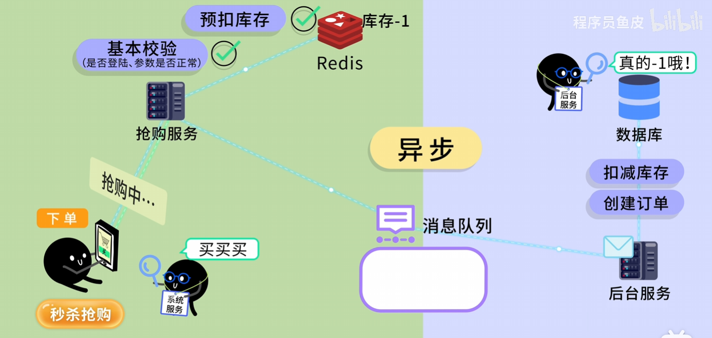

> 参考：[什么是消息队列？不就是排个队么？](https://www.bilibili.com/video/BV12qmyBQEwL)




## Kafka

概要介绍：[消息队列Kafka是什么？架构是怎么样的？5分钟快速入门](https://www.bilibili.com/video/BV1TT421y79S)

快速入门：[16分钟彻底学会Kafka](https://www.bilibili.com/video/BV17hdXYZE78)

教程：[kafka一小时入门精讲课程](https://www.bilibili.com/video/BV1h94y1Q7Xg)


### 理论基础

大纲：

- 消息队列 vs Kafka 的特点（高吞吐量、持久化、分布式）。
- Kafka 核心概念（Topic、Partition、Producer、Consumer、Offset）。
- Kafka 集群架构和数据存储原理。

| 模块         | 关键知识点                                                   | 目标                                                         |
| ------------ | ------------------------------------------------------------ | ------------------------------------------------------------ |
| **核心概念** | **Broker**（服务器）、**Producer**（生产者）、**Consumer**（消费者）、**Topic**（主题）。 | 理解 Kafka 的基本组成部分和数据流动路径。                    |
| **数据存储** | **Partition**（分区）、**Offset**（偏移量）。                | 理解数据如何被分散存储，以及消费者如何追踪消费进度。**分区是实现高吞吐和并行处理的关键！** |
| **高可用性** | **Replication**（副本）、**Leader/Follower**。               | 理解 Kafka 如何通过副本机制保证数据不丢失和高可用。          |
| **消息语义** | **At Least Once**, **At Most Once**, **Exactly Once**。      | 理解 Kafka 在不同配置下能提供的消息投递保障级别。            |


### 安装与基本操作

- 本地单机 Kafka 安装。
- 通过命令行创建 Topic、发送和消费消息。
- 理解 offset、消费组的概念。


### 开发实践

- 使用 Java 或 Python/Kafka 客户端编写 Producer 和 Consumer。
- 学习同步发送 vs 异步发送、批量发送。
- 学习消费模式：
  - 自动提交 offset
  - 手动提交 offset
  - 消费组

| 模块           | 关键操作/工具                                                | 目标                                 |
| -------------- | ------------------------------------------------------------ | ------------------------------------ |
| **环境搭建**   | Docker或本地安装 **Kafka + Zookeeper**（Zookeeper用于集群管理，但未来会被Kafka自身取代）。 | 成功运行一个单节点或简易集群。       |
| **命令行操作** | 使用自带的 `kafka-topics.sh`、`kafka-console-producer.sh`、`kafka-console-consumer.sh`。 | 能够创建主题，发送和接收消息。       |
| **客户端编程** | 学习你熟悉的编程语言（如Java/Python）的 **Producer API** 和 **Consumer API**。 | 能写出简单的程序发送和消费真实数据。 |


### 高级特性

- 分区策略（按 key 分区，保证顺序）。
- 消息可靠性：
  - ACK 机制（acks=0/1/all）
  - 重试与幂等性
- Kafka Streams / ksqlDB 实时流处理。
- 监控与性能调优：
  - 延迟、吞吐量、磁盘 IO
  - Broker 副本、ISR、分区均衡

| 模块           | 关键知识点                                                   | 目标                                                         |
| -------------- | ------------------------------------------------------------ | ------------------------------------------------------------ |
| **配置调优**   | **Producer** acks、batch.size；**Consumer** group.id、auto.offset.reset；**Broker** log.retention.hours。 | 掌握关键参数的含义和调优方法，解决性能问题。                 |
| **生态系统**   | **Kafka Connect**（数据集成）、**Kafka Streams/KSQL**（流处理）。 | 了解如何将 Kafka 与其他系统（如数据库、Elasticsearch）集成和处理流数据。 |
| **监控与运维** | JMX指标、Prometheus/Grafana 监控。                           | 了解如何监控 Kafka 的健康状况和性能。                        |


### 实战案例：一个简单的日志系统

常见案例：

- 日志采集系统（类似 ELK）
- 电商订单系统（订单消息流）
- 实时数据分析（用户行为统计）


我们通过一个 Python 程序的示例，来模拟一个最常见的 Kafka 应用场景：**日志事件的异步传输**。

假设你有一个 Web 应用，需要将用户点击事件发送给一个分析系统。


#### 步骤 1: 确保 Kafka 正在运行

你需要一个正在运行的 Kafka Broker。


#### 步骤 2: 创建一个主题（Topic）

这是消息的类别。所有关于“用户点击”的事件都发送到这个主题。

```
# 命令行操作 (假设你的 Kafka 目录在当前路径)
./bin/kafka-topics.sh --create --topic user_clicks --bootstrap-server localhost:9092 --partitions 3 --replication-factor 1
```

- `user_clicks`：主题名称
- `partitions 3`：主题被分成3个分区，可以并行处理。


#### 步骤 3: 生产者（Producer）程序 - 发送日志

使用 Python 库 `confluent-kafka` (或其他你熟悉的语言库) 编写。

```
from confluent_kafka import Producer
import json
import time

# Kafka 配置
config = {'bootstrap.servers': 'localhost:9092'}
producer = Producer(config)
topic_name = 'user_clicks'

# 模拟发送 5 条点击事件
for i in range(5):
    # 模拟一个用户点击事件数据
    data = {
        'user_id': f'user_{100 + i}',
        'timestamp': time.time(),
        'action': 'page_view',
        'page': f'/product/{i}'
    }
    
    # 异步发送消息
    # key 用于决定消息发送到哪个分区（key相同，分区相同）
    producer.produce(
        topic_name, 
        key=str(data['user_id']).encode('utf-8'), 
        value=json.dumps(data).encode('utf-8')
    )
    print(f"Produced event: {data['user_id']}")

# 确保所有消息都被发送
producer.flush()
```


#### 步骤 4: 消费者（Consumer）程序 - 实时分析

分析系统订阅这个主题，实时接收并处理数据。

```
from confluent_kafka import Consumer, KafkaException, OFFSET_BEGINNING
import json

# Kafka 配置
config = {
    'bootstrap.servers': 'localhost:9092',
    'group.id': 'analytics_group_1',  # 消费者组ID，用于追踪消费进度
    'auto.offset.reset': 'earliest' # 从最早的消息开始消费
}

consumer = Consumer(config)
topic_name = 'user_clicks'

# 订阅主题
consumer.subscribe([topic_name])

print(f"Consumer started, listening to topic: {topic_name}...")

try:
    while True:
        # 3.0 秒内尝试从 Kafka 拉取一条消息
        msg = consumer.poll(3.0) 
        
        if msg is None:
            continue
        if msg.error():
            # 处理错误
            if msg.error().code() == KafkaException._PARTITION_EOF:
                # 达到分区末尾，可以继续等待新消息
                continue
            else:
                print(f"Consumer error: {msg.error()}")
                break
        
        # 成功接收到消息
        data = json.loads(msg.value().decode('utf-8'))
        print(f"Received from partition {msg.partition()} [offset {msg.offset()}]: User {data['user_id']} viewed {data['page']}")

except KeyboardInterrupt:
    pass
finally:
    # 关闭消费者，记录当前的消费进度 (offset)
    consumer.close()
```

运行生产者和消费者程序，你就能看到生产者不断地发送点击事件到 Kafka，而消费者则实时地接收和打印这些事件。

**重点理解：** 即使你先启动生产者，然后关闭它，再启动消费者，消费者依然能从 Kafka 中读取到之前发送的消息，这就是 **持久化** 和 **解耦** 的力量！