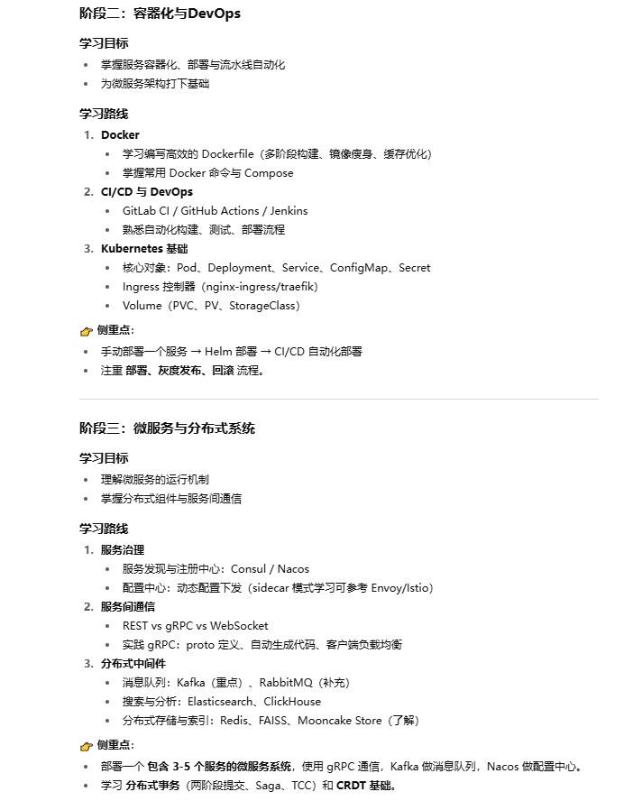

参考：[Agent 工程师绕不开的必修课：API 网关 vs API 管理](https://mp.weixin.qq.com/s/9V4QqmxQ7g1qLGRn9bop1Q)

# 基础概念

分布式与微服务概念及区分：[三分钟彻底弄懂什么是分布式和微服务架构](https://zhuanlan.zhihu.com/p/107142852)

- 分布式

- 微服务

- SOA架构

> 参考：[微服务是毒瘤吗？](https://mp.weixin.qq.com/s/tWWLrCwwcKmH2AShKUeleg)，评论区的讨论也值得参考

判断是否应该微服务的关键是三点：

1. 团队是否足够大到需要独立边界；

2. 技术栈是否多到必须解耦；
3. 系统的变更是否频繁到难以整体发布。

如果这三点都没触发，微服务不是救星，而是拖累。

对开发者来说，最重要的一点是：别急着跟风，先判断自己到底到了哪一步。

# 初步学习路线

# 大模型应用相关

分布式与微服务相关框架较多，概念也多，为了快速用起来，打算先从其在大模型应用领域入手，开展实战开发。

一些推文：

- [CloudWeGo 技术沙龙《云原生 × AI 时代的微服务架构与技术实践》](https://www.infoq.cn/article/vaq0471b61xfexfabqbu)：字节、智谱等在云原生、微服务相关的实战与分享

相关调研：

- AI Agent  / 大语言模型 与微服务
- AI Agent  / 大语言模型 与分布式
- AI Agent  / 大语言模型 与云原生
- Go语言开发Agent的设计与实现
- LLM从单体到微服务架构的转型

大模型回答了一堆内容，正在划分重点学习对象ing

- ...

# 其他概念

### nacos-serving-python

> 参考：[开源｜Python 应用往微服务迈进的 1*3 种 Pythonic 步伐](https://mp.weixin.qq.com/s/vUCy7rj-EHhJGp4QEdvfcg)

一个刚刚开源的Python微服务中间件。

Python在Web开发、数据分析、AI等领域占据重要地位，但在微服务架构中却面临诸多挑战：

1. 服务注册通常需要手动处理，缺乏自动机制；
2. 服务发现往往依赖硬编码或外部负载均衡器；
3. 配置管理难以动态更新，需要重启应用；

nacos-serving-python的一些作用：

- 低侵入的服务发现策略
- 三种低侵入的自动注册方式

使用起来也比较简单，跟requests库、flask、fastapi等库相适配
