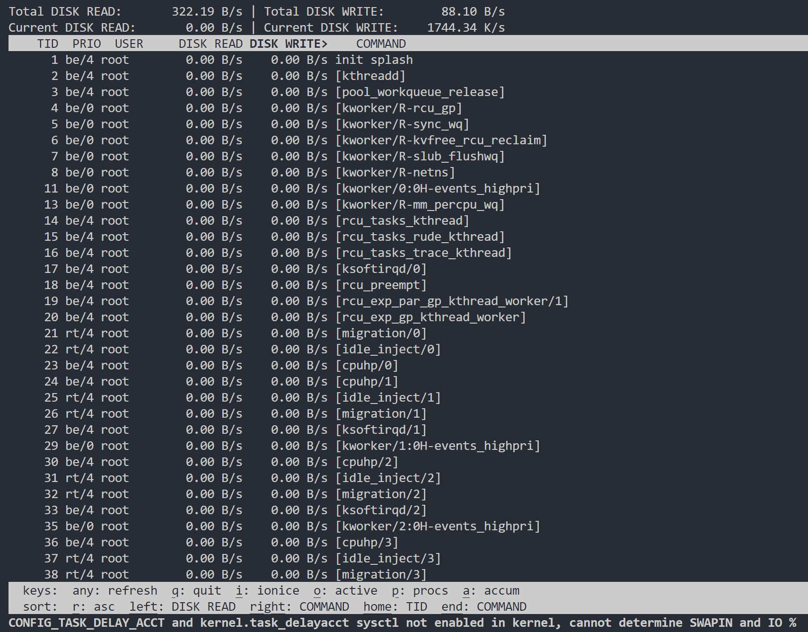
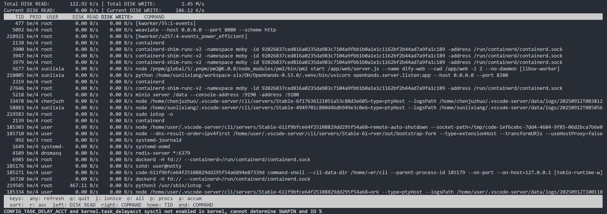
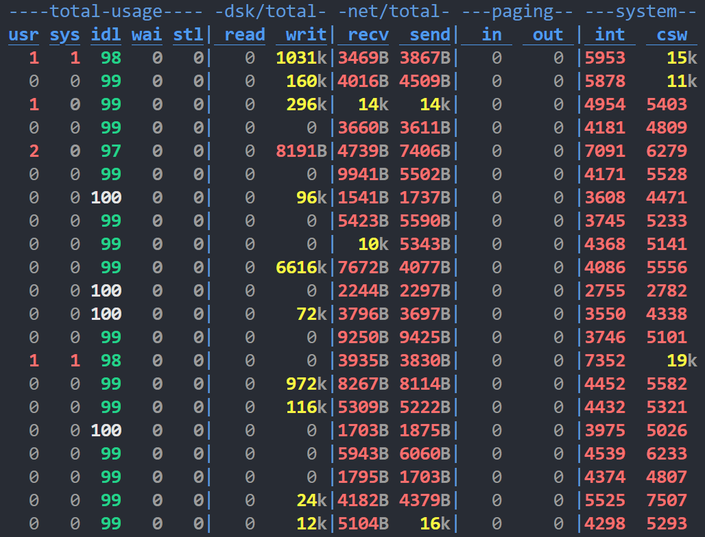

`top`：略

`htop`：略

`iotop`功能简介

- 类似 `top`，但专注于 **I/O 使用情况**。
- 可以显示 **每个进程/线程的磁盘读写速率**。
- 常用于定位某个进程是否导致磁盘高负载。

安装：`sudo apt install iotop`

`dstat`功能简介

- 更通用的 **系统资源统计工具**，可以替代 `vmstat`, `iostat`, `netstat` 等。
- 支持 **CPU、内存、I/O、网络、磁盘、系统调用** 等多维度监控。
- 可输出为 **CSV**，方便导入 Excel/Grafana 分析。

安装：`sudo apt install dstat`

