> 课程链接：[【matplotlib折线图】01matplotlib的基础绘图_哔哩哔哩_bilibili](https://www.bilibili.com/video/BV1hx411d7jb?p=3&vd_source=35dfee2e398af56613f978fc65d6defb)
>
> 官方代码：[TheisTrue/DataAnalysis: Python数据分析教程的资料 (github.com)](https://github.com/TheisTrue/DataAnalysis/tree/master)
>

[TOC]

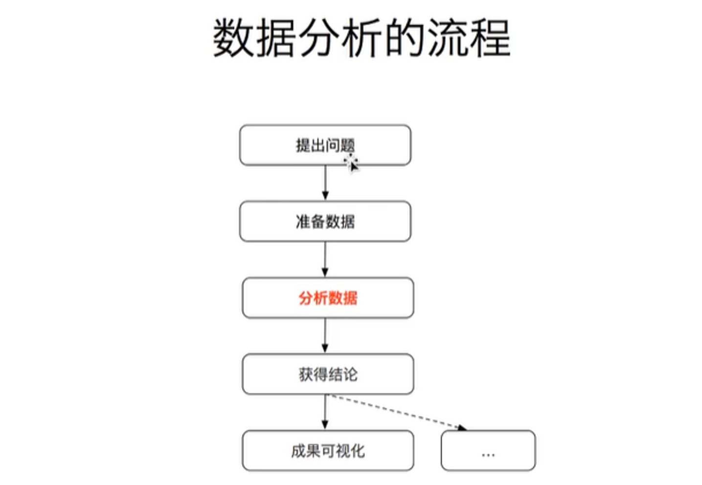

# 一、matplotlib

matplotlib概念：主要做数据可视化图表，名字取材于MATLAB，模仿MATLAB构造

## 1、绘制折线图

总结：

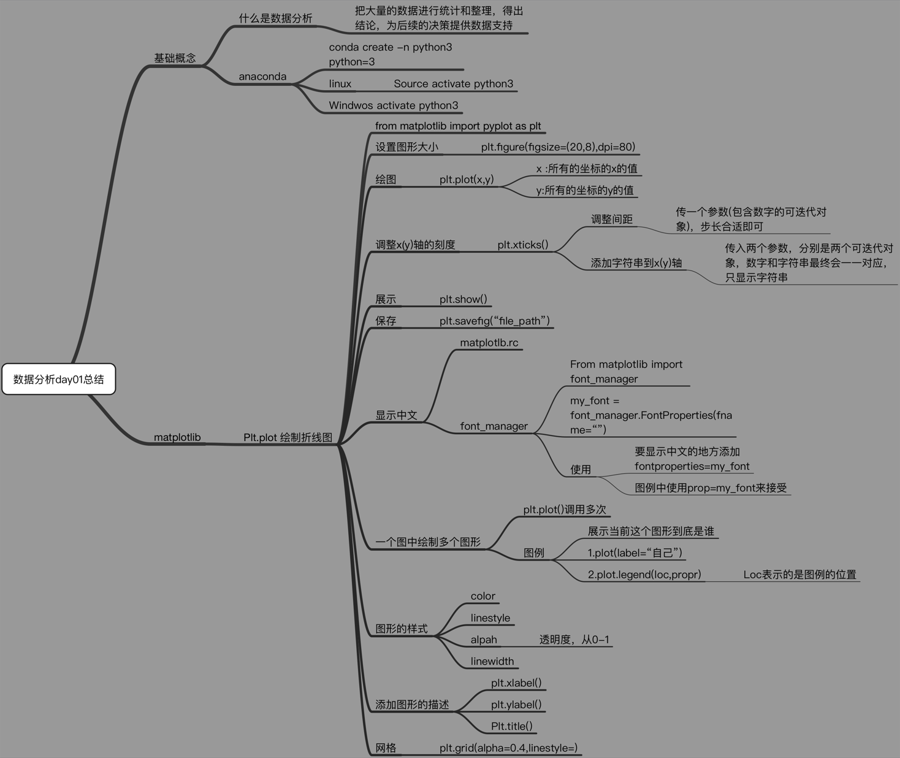


首先，看一段示例代码：

```python
from matplotlib import pyplot as plt

x = range(2, 26, 2)
y = [11, 22, 33, 44, 55, 66, 88, 33, 22, 44, 99, 11]

plt.plot(x,y)
plt.show()
```

结果展示：

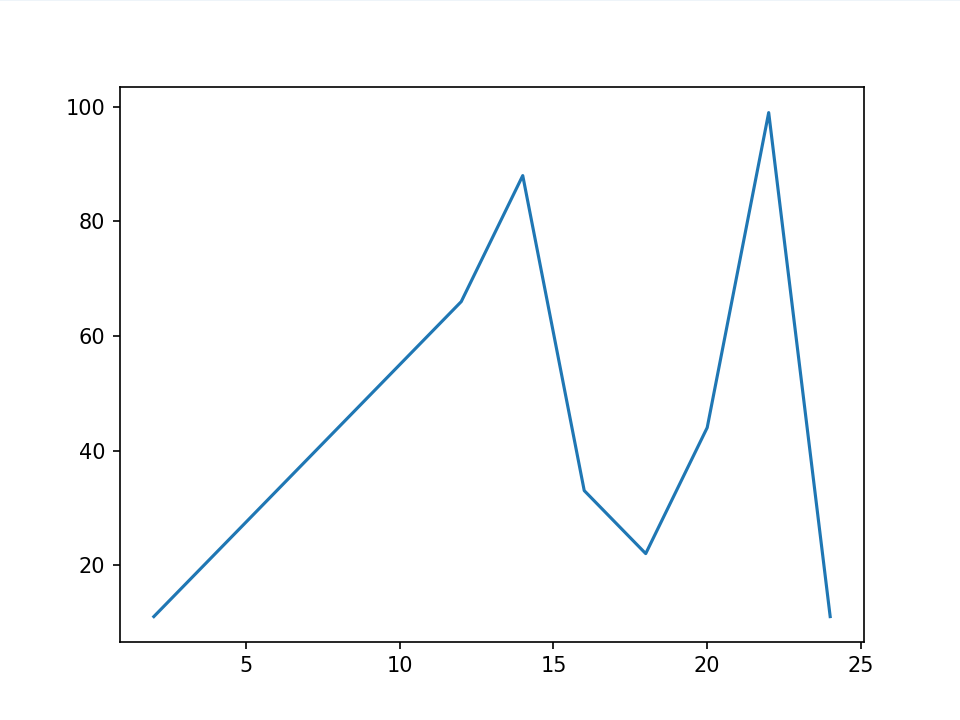

下面需要从以下几个方面优化此折线图：


### 1.1 图片窗口大小、保存本地、刻度间距

示例代码：

```python
from matplotlib import pyplot as plt

x = range(2,26,2)
y = [15, 13, 14.5, 17, 20, 25, 26, 26, 27, 22, 18, 15]

plt.figure(figsize=(20,8),dpi=80)  # 设置图片窗口大小

plt.plot(x,y) # 绘图

#设置x轴的刻度
_xtick_labels = [i/2 for i in range(4,49)]  # 通过控制步长，来调整x轴刻度
plt.xticks(_xtick_labels)  # 显示x轴刻度
plt.yticks(range(min(y),max(y)+1))  # 显示y轴刻度。通过max与min函数快速设置y轴刻度

# plt.savefig("./t1.png")  # 保存图片

plt.show() # 展示图形
```

结果展示：

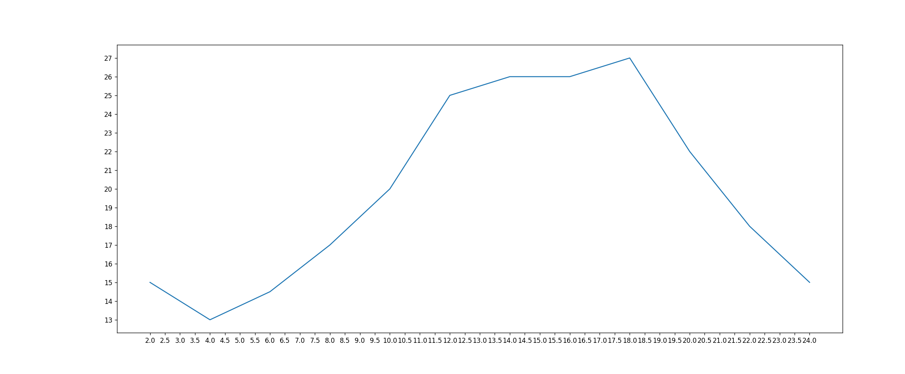

同样，可以通过调整步长来缩小x轴刻度

```python
_xtick_labels = [i/2 for i in range(4,49)]  # 通过控制步长，来调整x轴刻度
plt.xticks(_xtick_labels[::3])
```

结果展示：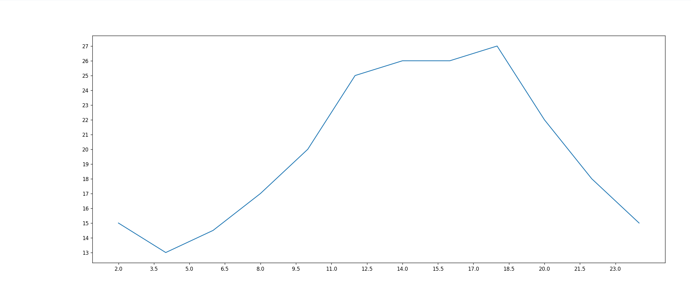


关于figure的参数：`figure(num=None, figsize=None, dpi=None, facecolor=None, edgecolor=None, frameon=True)`

- num:图像编号或名称，数字为编号 ，字符串为名称
- figsize:指定figure的宽和高，单位为英寸；
- dpi参数指定绘图对象的分辨率，即每英寸多少个像素，缺省值为80 1英寸等于2.5cm,A4纸是 21*30cm的纸张
- facecolor:背景颜色
- edgecolor:边框颜色
- frameon:是否显示边框


### 1.2 字体

下面看一个新需求：

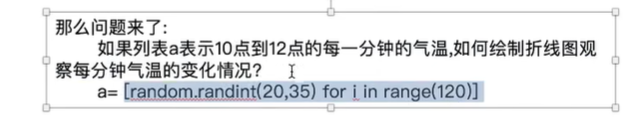

示例代码：

```python
from matplotlib import pyplot as plt
import random


x = range(0,120)
y = [random.randint(20,35) for i in range(120)]

plt.plot(x,y)
plt.show()
```

结果展示：

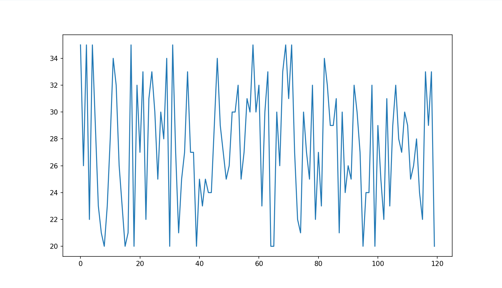

下面我们根据需求不断去优化这张图的表达，首先：

- 调整显示图片的大小
- 需要将x轴的刻度值变为10:01、10:02等代表时间的字符串，并且调整x轴刻度的疏密。

示例代码：

```python
from matplotlib import pyplot as plt
import random


x = range(0,120)
y = [random.randint(20,35) for i in range(120)]

plt.figure(figsize=(20,8),dpi=80)  #设置图片大小

# 调整x轴的刻度
_xtick_labels = ["10点{}分".format(i) for i in range(60)]
_xtick_labels += ["11点{}分".format(i) for i in range(60)]
# 取步长，数字和字符串一一对应，数据的长度一样。
plt.xticks(list(x)[::3], _xtick_labels[::3])

plt.plot(x,y)
plt.show()
```

结果展示：

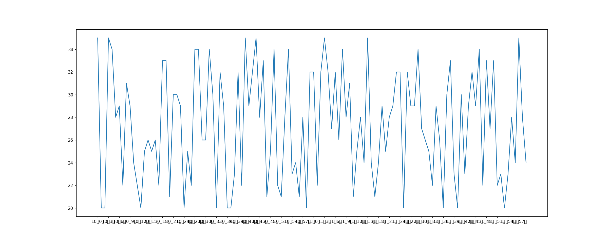


我们发现由于x轴要显示的刻度过于密集，导致出现过于拥挤，且由于中文无法显示导致出现乱码，这里解决方式如下

- 通过斜着显示刻度的方式，解决拥挤问题
- 通过设置字体，解决乱码问题
  

示例代码如下：

```python
from matplotlib import pyplot as plt
import matplotlib
import random


# windws和linux设置字体的方式
font = {'family' : 'MicroSoft YaHei',
        'weight': 'bold',
        'size': 14}
matplotlib.rc("font",**font)
matplotlib.rc("font",family='MicroSoft YaHei',weight="bold")

x = range(0,120)
y = [random.randint(20,35) for i in range(120)]

plt.figure(figsize=(20,8),dpi=80)  #设置图片大小

# 调整x轴的刻度
_xtick_labels = ["10点{}分".format(i) for i in range(60)]
_xtick_labels += ["11点{}分".format(i) for i in range(60)]
# 取步长，数字和字符串一一对应，数据的长度一样。rotaion表示旋转的度数
plt.xticks(list(x)[::3], _xtick_labels[::3], rotation=45)

plt.plot(x,y)
plt.show()

```

注意：

- 设置字体时，如果`size`参数指定为`larger`等，会出现`ValueError: Key font.size: Could not convert 'larger' to float`

结果展示：


另外，字体有两种导入方式：

1. 如上述示例代码所示：

   ```python
   # windws和linux设置字体的方式
   font = {'family' : 'MicroSoft YaHei',
           'weight': 'bold',
           'size': 14}
   matplotlib.rc("font",**font)
   matplotlib.rc("font",family='MicroSoft YaHei',weight="bold")
   ```

2. 通过指定字体文件位置（系统自带的字体文件在哪，参考上文，linux/mac在终端基于`fc-list`查看，windows自行百度），如在mac下：

   ```python
   # 另外一种设置字体的方式
   my_font = font_manager.FontProperties(fname="/System/Library/Fonts/PingFang.ttc")
   
   ...
   plt.xticks(list(x)[::3],_xtick_labels[::3], rotation=45, fontproperties=my_font)
   ```


### 1.3 x轴和y轴描述信息

接下来为x轴和y轴添加描述信息，核心代码如下：

```python
# 添加描述信息
plt.xlabel("时间")
plt.ylabel("温度 单位(℃)")
plt.title("10点到12点每分钟的气温变化情况")
plt.plot(x,y)
```

如果要指定字体，需要额外加上`fontpropertie`参数：

```python
plt.xlabel("时间", fontproperties=my_font)
plt.ylabel("温度 单位(℃)", fontproperties=my_font)
plt.title("10点到12点每分钟的气温变化情况", fontproperties=my_font)
```

完整示例代码如下：

```python
from matplotlib import pyplot as plt
import matplotlib
import random


# windws和linux设置字体的方式
font = {'family' : 'MicroSoft YaHei',
        'weight': 'bold',
        'size': 14}
matplotlib.rc("font",**font)
matplotlib.rc("font",family='MicroSoft YaHei',weight="bold")

# 另外一种设置字体的方式
# my_font = font_manager.FontProperties(fname="/System/Library/Fonts/PingFang.ttc")

x = range(0,120)
y = [random.randint(20,35) for i in range(120)]

plt.figure(figsize=(20,8),dpi=80)  #设置图片大小

# 调整x轴的刻度
_xtick_labels = ["10点{}分".format(i) for i in range(60)]
_xtick_labels += ["11点{}分".format(i) for i in range(60)]
# 取步长，数字和字符串一一对应，数据的长度一样。rotaion表示旋转的度数
plt.xticks(list(x)[::3], _xtick_labels[::3], rotation=45)

# 添加描述信息
plt.xlabel("时间")
plt.ylabel("温度 单位(℃)")
plt.title("10点到12点每分钟的气温变化情况")
plt.plot(x,y)
plt.show()

```

结果展示：

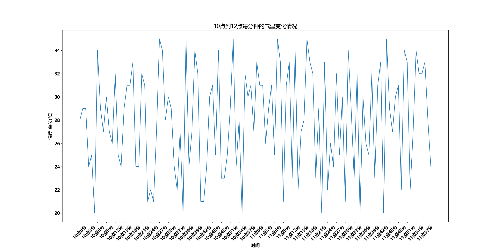


### 1.4 绘图并设置网格

核心代码：

```python
#绘制网格
plt.grid(alpha=0.1)  # 通过alpha设置网格透明度
```

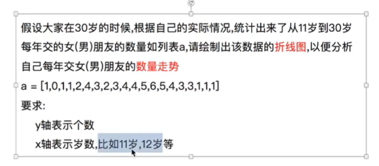

先做一个基础的展示，后续再一点点优化，示例代码如下：

```python
# coding=utf-8
from matplotlib import pyplot as plt
import matplotlib

# windws和linux设置字体的方式
font = {'family' : 'MicroSoft YaHei',
        'weight': 'bold',
        'size': 14}
matplotlib.rc("font",**font)
matplotlib.rc("font",family='MicroSoft YaHei',weight="bold")

y = [1,0,1,1,2,4,3,2,3,4,4,5,6,5,4,3,3,1,1,1]
x = range(11,31)

#设置图形大小
plt.figure(figsize=(20,8),dpi=80)

plt.plot(x,y)

#设置x轴刻度
_xtick_labels = ["{}岁".format(i) for i in x]
plt.xticks(x,_xtick_labels)
plt.yticks(range(0,9))

#绘制网格
plt.grid(alpha=0.1)  # 通过alpha设置网格透明度

#展示
plt.show()
```

结果展示：

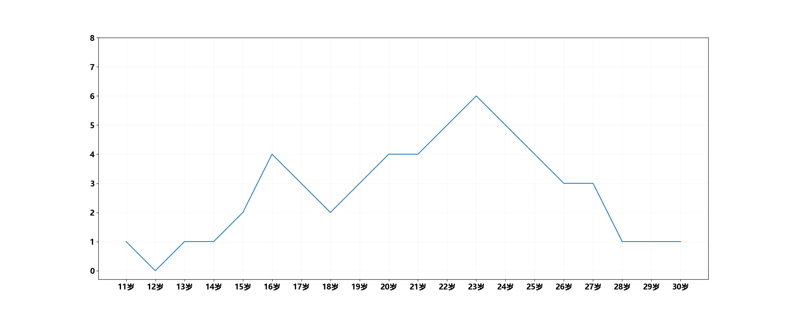


### 1.5 多次绘图

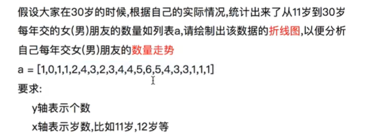

核心代码：

- 多条线的坐标

  ```python
  y_1 = [1,0,1,1,2,4,3,2,3,4,4,5,6,5,4,3,3,1,1,1]
  y_2 = [1,0,3,1,2,2,3,3,2,1 ,2,1,1,1,1,1,1,1,1,1]
  ...
  plt.plot(x,y_1,label="自己",color="#F08080")
  plt.plot(x,y_2,label="同桌",color="#DB7093",linestyle="--")
  ```

- 设置图例：label、color、plt.legend等等，更多需求百度即可

  ```python
  plt.plot(x,y_1,label="自己",color="#F08080")
  plt.plot(x,y_2,label="同桌",color="#DB7093",linestyle="--")
  ...
  #添加图例，并设置图例位置（有哪些设置方法直接参考源码即可）
  plt.legend(loc="upper left")
  ```


示例代码：

```python
# coding=utf-8
from matplotlib import pyplot as plt
import matplotlib

font = {'family' : 'MicroSoft YaHei',
        'weight': 'bold',
        'size': 14}
matplotlib.rc("font",**font)
matplotlib.rc("font",family='MicroSoft YaHei',weight="bold")

y_1 = [1,0,1,1,2,4,3,2,3,4,4,5,6,5,4,3,3,1,1,1]
y_2 = [1,0,3,1,2,2,3,3,2,1 ,2,1,1,1,1,1,1,1,1,1]

x = range(11,31)

#设置图形大小
plt.figure(figsize=(20,8),dpi=80)

plt.plot(x,y_1,label="自己",color="#F08080")
plt.plot(x,y_2,label="同桌",color="#DB7093",linestyle="--")

#设置x轴刻度
_xtick_labels = ["{}岁".format(i) for i in x]
plt.xticks(x,_xtick_labels)
# plt.yticks(range(0,9))

#绘制网格
plt.grid(alpha=0.4,linestyle=':')

#添加图例，并设置图例位置（有哪些设置方法直接参考源码即可）
plt.legend(loc="upper left")

#展示
plt.show()
```

结果展示：

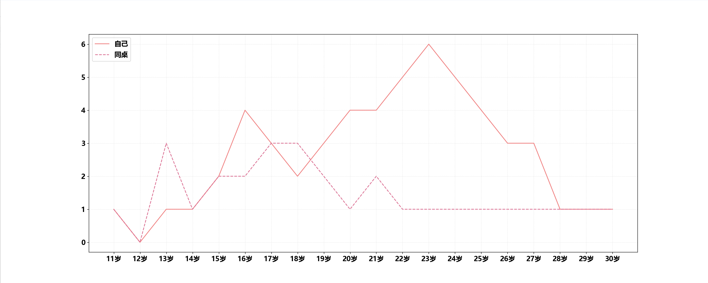


## 2、其他统计图

总结：

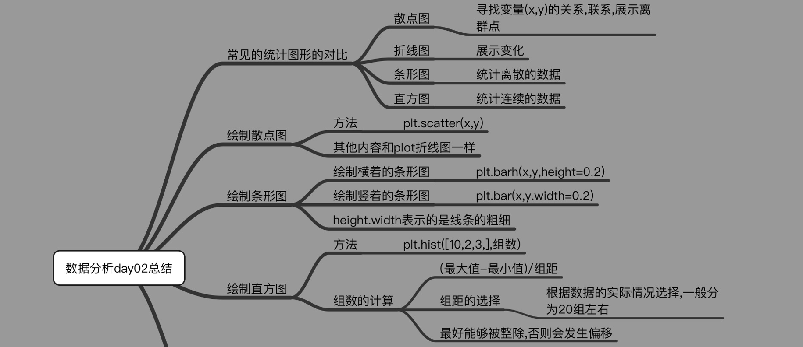

除了折线图，还可以绘制什么？

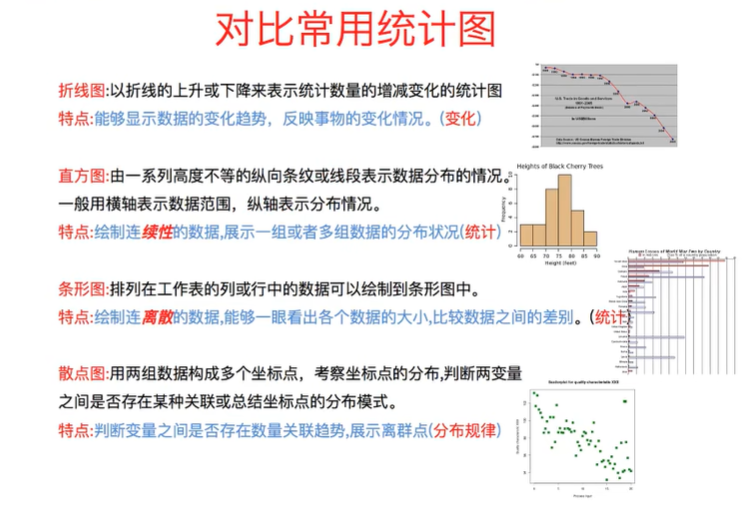

### 2.1 绘制散点图

技术要点：`plt.scatter(x,y)`

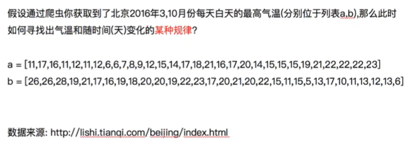

核心代码：

```python
#使用scatter方法绘制散点图,和之前绘制折线图的唯一区别
plt.scatter(x_3,y_3,label="3月份")
plt.scatter(x_10,y_10,label="10月份")
```

示例代码：

```python
# coding=utf-8
from matplotlib import pyplot as plt
import matplotlib

font = {'family' : 'MicroSoft YaHei',
        'weight': 'bold',
        'size': 14}
matplotlib.rc("font",**font)
matplotlib.rc("font",family='MicroSoft YaHei',weight="bold")

y_3 = [11,17,16,11,12,11,12,6,6,7,8,9,12,15,14,17,18,21,16,17,20,14,15,15,15,19,21,22,22,22,23]
y_10 = [26,26,28,19,21,17,16,19,18,20,20,19,22,23,17,20,21,20,22,15,11,15,5,13,17,10,11,13,12,13,6]

x_3 = range(1,32)
x_10 = range(51,82)

# 设置图形大小
plt.figure(figsize=(20,8),dpi=80)

#使用scatter方法绘制散点图,和之前绘制折线图的唯一区别
plt.scatter(x_3,y_3,label="3月份")
plt.scatter(x_10,y_10,label="10月份")

# 调整x轴的刻度
_x = list(x_3)+list(x_10)
_xtick_labels = ["3月{}日".format(i) for i in x_3]
_xtick_labels += ["10月{}日".format(i-50) for i in x_10]
plt.xticks(_x[::3],_xtick_labels[::3],rotation=45)

# 添加图例
plt.legend(loc="upper left")

# 添加描述信息
plt.xlabel("时间")
plt.ylabel("温度")
plt.title("标题")
# 展示
plt.show()

```

结果展示：

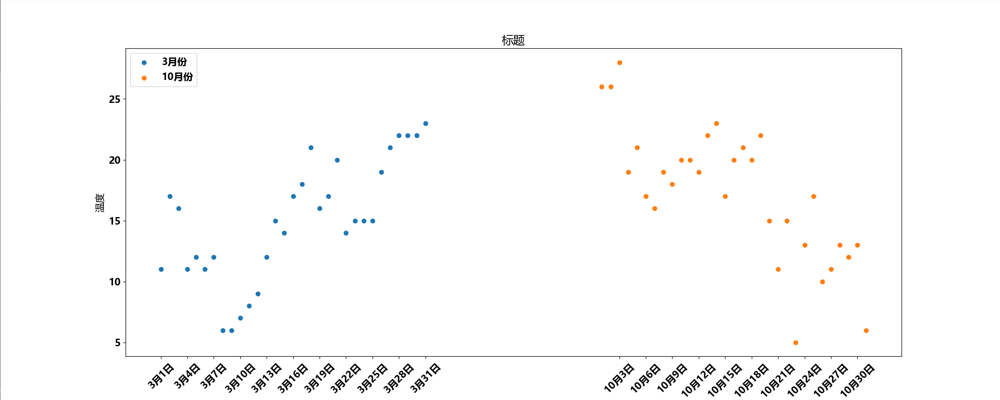


### 2.2、绘制条形图

#### 2.2.1 基础


示例代码：

```python
# coding=utf-8
from matplotlib import pyplot as plt
import matplotlib

font = {'family' : 'MicroSoft YaHei',
        'weight': 'bold',
        'size': 14}
matplotlib.rc("font",**font)
matplotlib.rc("font",family='MicroSoft YaHei',weight="bold")

a = ["战狼2","速度与激情8","功夫瑜伽","西游伏妖篇","变形金刚5：最后的骑士","摔跤吧！爸爸","加勒比海盗5：死无对证","金刚：骷髅岛","极限特工：终极回归","生化危机6：终章","乘风破浪","神偷奶爸3","智取威虎山","大闹天竺","金刚狼3：殊死一战","蜘蛛侠：英雄归来","悟空传","银河护卫队2","情圣","新木乃伊",]

b =[56.01,26.94,17.53,16.49,15.45,12.96,11.8,11.61,11.28,11.12,10.49,10.3,8.75,7.55,7.32,6.99,6.88,6.86,6.58,6.23]

# 设置图形大小
plt.figure(figsize=(20,15),dpi=80)
# 绘制条形图
plt.bar(range(len(a)),b,width=0.3)
# 设置字符串到x轴
plt.xticks(range(len(a)),a,rotation=90)

# plt.savefig("./movie.png")
plt.show()
```

结果展示：

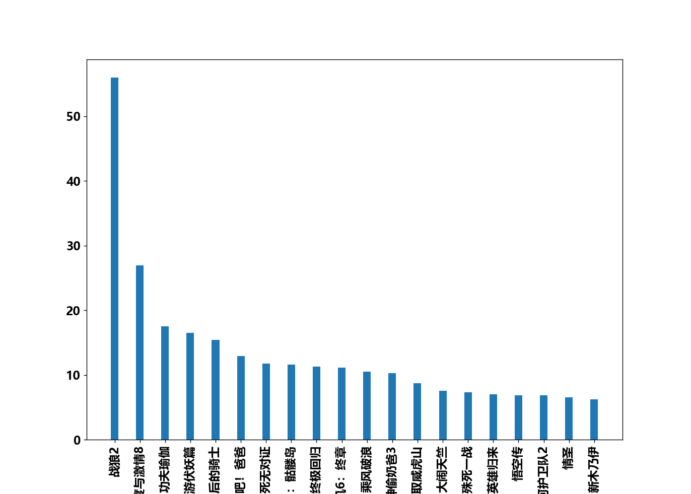

某个字符串过长，可以直接在字符串里添加`\n`

```python
a = ["战狼2","速度与激情8","功夫瑜伽","西游伏妖篇","变形金刚5：\n最后的骑士","摔跤吧！爸爸","加勒比海盗5：\n死无对证","金刚：骷髅岛","极限特工：\n终极回归","生化危机6：\n终章","乘风破浪","神偷奶爸3","智取威虎山","大闹天竺","金刚狼3：\n殊死一战","蜘蛛侠：英雄归来","悟空传","银河护卫队2","情圣","新木乃伊",]
```


#### 2.2.2 横状的条形图

当然，除了`\n`，也可以直接画横状的条形图，示例代码如下：

```python
# 绘制横着的条形图
from matplotlib import pyplot as plt
import matplotlib

font = {'family' : 'MicroSoft YaHei',
        'weight': 'bold',
        'size': 14}
matplotlib.rc("font",**font)
matplotlib.rc("font",family='MicroSoft YaHei',weight="bold")


a = ["战狼2","速度与激情8","功夫瑜伽","西游伏妖篇","变形金刚5：最后的骑士","摔跤吧！爸爸","加勒比海盗5：死无对证","金刚：骷髅岛","极限特工：终极回归","生化危机6：终章","乘风破浪","神偷奶爸3","智取威虎山","大闹天竺","金刚狼3：殊死一战","蜘蛛侠：英雄归来","悟空传","银河护卫队2","情圣","新木乃伊",]

b =[56.01,26.94,17.53,16.49,15.45,12.96,11.8,11.61,11.28,11.12,10.49,10.3,8.75,7.55,7.32,6.99,6.88,6.86,6.58,6.23]


# 设置图形大小
plt.figure(figsize=(20,8),dpi=80)
# 绘制条形图
plt.barh(range(len(a)),b,height=0.3,color="orange")
# 设置字符串到x轴
plt.yticks(range(len(a)),a)

plt.grid(alpha=0.3)
# plt.savefig("./movie.png")

plt.show()
```

结果展示：

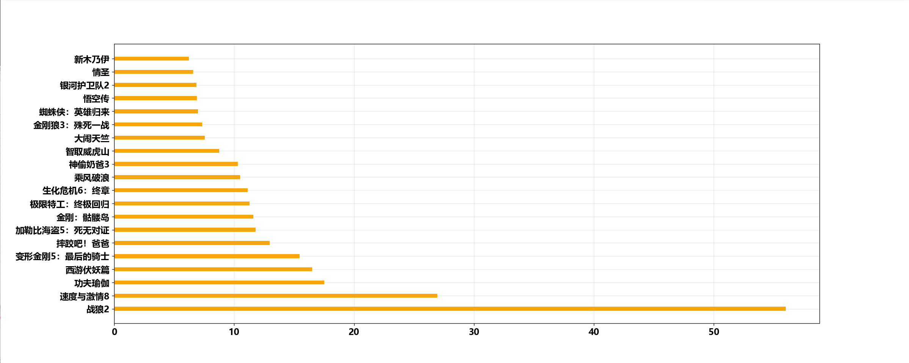


#### 2.2.3 多次绘图

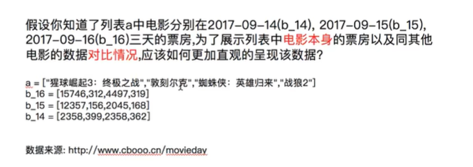

示例代码：特别注意各个条形图间距的设置

```python
# coding=utf-8
from matplotlib import pyplot as plt
import matplotlib

font = {'family' : 'MicroSoft YaHei',
        'weight': 'bold',
        'size': 14}
matplotlib.rc("font",**font)
matplotlib.rc("font",family='MicroSoft YaHei',weight="bold")


a = ["猩球崛起3：终极之战","敦刻尔克","蜘蛛侠：英雄归来","战狼2"]
b_16 = [15746,312,4497,319]
b_15 = [12357,156,2045,168]
b_14 = [2358,399,2358,362]

bar_width = 0.2

x_14 = list(range(len(a)))
x_15 =  [i+bar_width for i in x_14]
x_16 = [i+bar_width*2 for i in x_14]

# 设置图形大小
plt.figure(figsize=(20,8),dpi=80)

plt.bar(range(len(a)),b_14,width=bar_width,label="9月14日")
plt.bar(x_15,b_15,width=bar_width,label="9月15日")
plt.bar(x_16,b_16,width=bar_width,label="9月16日")

# 设置图例
plt.legend()

# 设置x轴的刻度
plt.xticks(x_15,a)

plt.show()
```

结果展示：

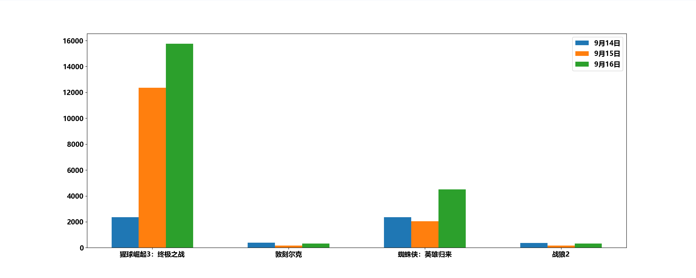


### 2.3 绘制直方图

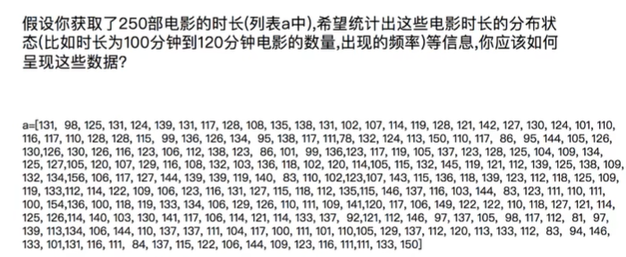

组数、组距如何设置？

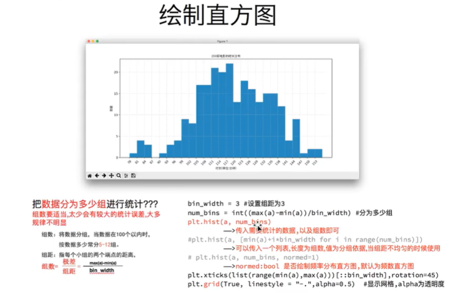

示例代码：

```python
# coding=utf-8
from matplotlib import pyplot as plt
import matplotlib

font = {'family' : 'MicroSoft YaHei',
        'weight': 'bold',
        'size': 14}
matplotlib.rc("font",**font)
matplotlib.rc("font",family='MicroSoft YaHei',weight="bold")

a=[131,  98, 125, 131, 124, 139, 131, 117, 128, 108, 135, 138, 131, 102, 107, 114, 119, 128, 121, 142, 127, 130, 124, 101, 110, 116, 117, 110, 128, 128, 115,  99, 136, 126, 134,  95, 138, 117, 111,78, 132, 124, 113, 150, 110, 117,  86,  95, 144, 105, 126, 130,126, 130, 126, 116, 123, 106, 112, 138, 123,  86, 101,  99, 136,123, 117, 119, 105, 137, 123, 128, 125, 104, 109, 134, 125, 127,105, 120, 107, 129, 116, 108, 132, 103, 136, 118, 102, 120, 114,105, 115, 132, 145, 119, 121, 112, 139, 125, 138, 109, 132, 134,156, 106, 117, 127, 144, 139, 139, 119, 140,  83, 110, 102,123,107, 143, 115, 136, 118, 139, 123, 112, 118, 125, 109, 119, 133,112, 114, 122, 109, 106, 123, 116, 131, 127, 115, 118, 112, 135,115, 146, 137, 116, 103, 144,  83, 123, 111, 110, 111, 100, 154,136, 100, 118, 119, 133, 134, 106, 129, 126, 110, 111, 109, 141,120, 117, 106, 149, 122, 122, 110, 118, 127, 121, 114, 125, 126,114, 140, 103, 130, 141, 117, 106, 114, 121, 114, 133, 137,  92,121, 112, 146,  97, 137, 105,  98, 117, 112,  81,  97, 139, 113,134, 106, 144, 110, 137, 137, 111, 104, 117, 100, 111, 101, 110,105, 129, 137, 112, 120, 113, 133, 112,  83,  94, 146, 133, 101,131, 116, 111,  84, 137, 115, 122, 106, 144, 109, 123, 116, 111,111, 133, 150]

#计算组数
d = 3  #组距
num_bins = (max(a)-min(a))//d
print(max(a),min(a),max(a)-min(a))
print(num_bins)


#设置图形的大小
plt.figure(figsize=(20,8),dpi=80)
# 使用 density 参数代替 normed
plt.hist(a, num_bins, density=True)

#设置x轴的刻度
plt.xticks(range(min(a),max(a)+d,d))

plt.grid()

plt.show()
```

注意：

- 在 `matplotlib.pyplot.hist` 函数中，`normed` 参数已经被弃用。如果你想要得到归一化的直方图，你应该使用 `density` 参数，而不是 `normed`。
  - 设置x轴的刻度时，细节`max(a)+d`，否则显示不全

结果展示：

```python
156 78 78
26
```

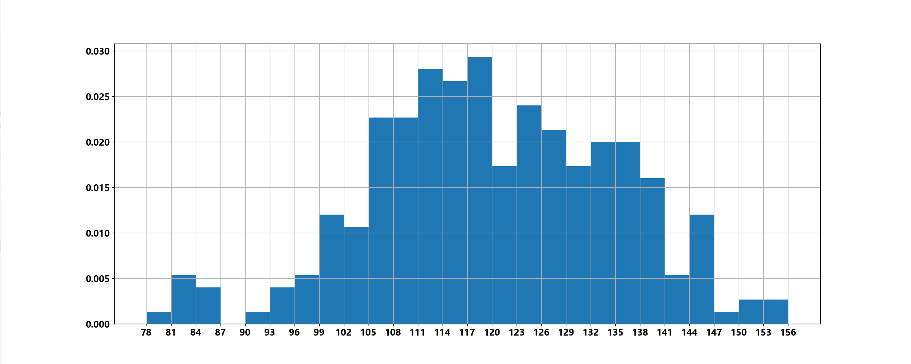


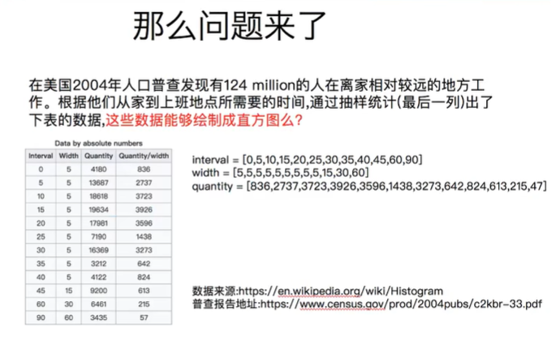

示例代码：

```python
from matplotlib import pyplot as plt

interval = [0,5,10,15,20,25,30,35,40,45,60,90]
width = [5,5,5,5,5,5,5,5,5,15,30,60]
quantity = [836,2737,3723,3926,3596,1438,3273,642,824,613,215,47]
print(len(interval),len(width),len(quantity))

#设置图形大小
plt.figure(figsize=(20,8),dpi=80)

plt.bar(range(12),quantity,width=1)

#设置x轴的刻度
_x = [i-0.5 for i in range(13)]
_xtick_labels =  interval+[150]
plt.xticks(_x,_xtick_labels)

plt.grid(alpha=0.4)
plt.show()
```

结果展示：


示例代码：

```python
# coding=utf-8
from matplotlib import pyplot as plt

interval = [0,5,10,15,20,25,30,35,40,45,60,90]
width = [5,5,5,5,5,5,5,5,5,15,30,60]
quantity = [836,2737,3723,3926,3596,1438,3273,642,824,613,215,47]
print(len(interval),len(width),len(quantity))

#设置图形大小
plt.figure(figsize=(20,8),dpi=80)

plt.bar(interval,quantity,width=width)

#设置x轴的刻度
temp_d = [5]+ width[:-1]
_x = [i-temp_d[interval.index(i)]*0.5 for i in interval]
plt.xticks(_x,interval)

plt.grid(alpha=0.4)
plt.show()
```

结果展示：

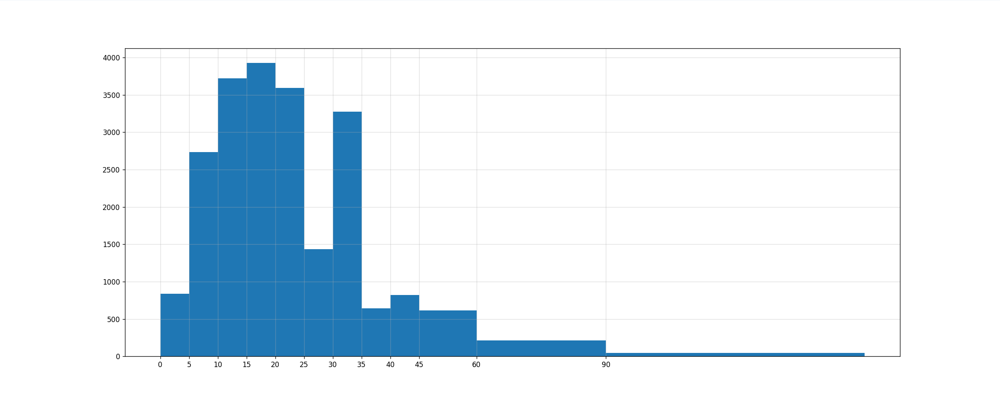

## 3、matplotlib常见问题总结

### 3.1 使用流程与常见问题

使用流程：


常见问题：

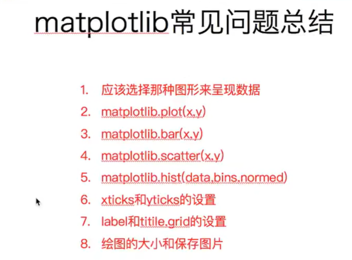

更多需求，参考官网。


### 3.2 常用工具

一些工程中常用的画图工具：

- ECharts：[Apache ECharts](https://echarts.apache.org/zh/index.html)
- plotly：[Plotly Python Graphing Library](https://plotly.com/python/)
- seaborn：[seaborn: statistical data visualization — seaborn 0.13.2 documentation (pydata.org)](https://seaborn.pydata.org/)

具体用法就不一一展开了，直接搜索即可。


# 二、numpy

*NumPy(Numerical Python) 是 Python 语言的一个扩展程序库，支持大量的维度数组与矩阵运算，此外也针对数组运算提供大量的数学函数库。*

## 1、创建数组与数组类型

总结：

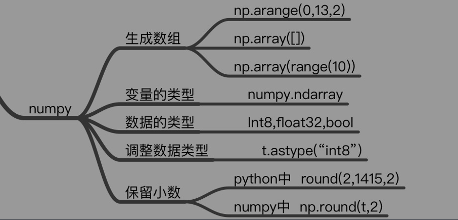


首先创建数组：

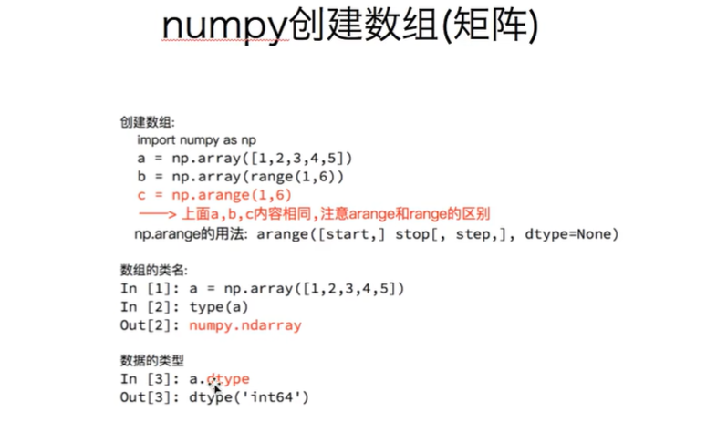

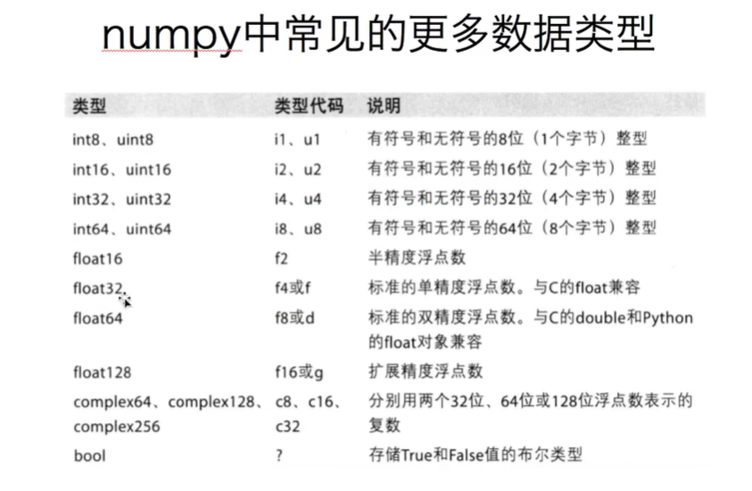


示例代码：

```
# coding=utf-8
import numpy as np
import random

# 使用numpy生成数组,得到ndarray的类型
t1 = np.array([1,2,3,])
print(t1)
print(type(t1))

t2 = np.array(range(10))
print(t2)
print(type(t2))

t3 = np.arange(4,10,2)
print(t3)
print(type(t3))

print(t3.dtype)
print("*"*100)
# numpy中的数据类型

t4 = np.array(range(1,4),dtype="i1")
print(t4)
print(t4.dtype)

# numpy中的bool类型
t5 = np.array([1,1,0,1,0,0],dtype=bool)
print(t5)
print(t5.dtype)

# 调整数据类型
t6 = t5.astype("int8")
print(t6)
print(t6.dtype)

# numpy中的小数
t7 = np.array([random.random() for i in range(10)])
print(t7)
print(t7.dtype)

t8 = np.round(t7,2)
print(t8)
```

结果展示：

```
[1 2 3]
<class 'numpy.ndarray'>
[0 1 2 3 4 5 6 7 8 9]
<class 'numpy.ndarray'>
[4 6 8]
<class 'numpy.ndarray'>
int32
****************************************************************************************************
[1 2 3]
int8
[ True  True False  True False False]
bool
[1 1 0 1 0 0]
int8
[0.99923993 0.58200892 0.3204886  0.17253484 0.21990347 0.72257043
 0.7640622  0.73068257 0.03456731 0.23390423]
float64
[1.   0.58 0.32 0.17 0.22 0.72 0.76 0.73 0.03 0.23]
```


## 2、数组的形状：shape、reshape、flatten

关于数组的形状，基于shape方法查看：


下面尝试一下改变数组形状：reshape

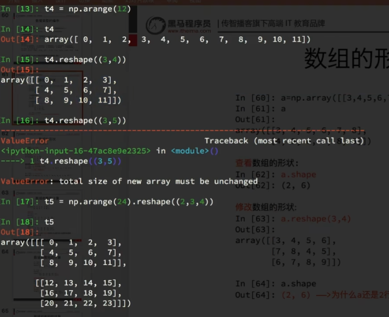

再比如，我们想把t5变为二维的数据。注意reshape本身不改变对象，需要进行赋值才可以。

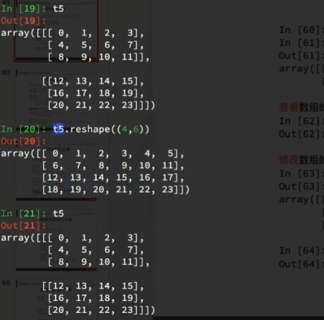

把数组变为一维的两种方法：

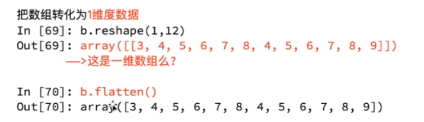


## 3、数组的计算

numpy具有广播机制，示例效果如下图所示。特别注意，除以0时不报错。

（1）数组与数字

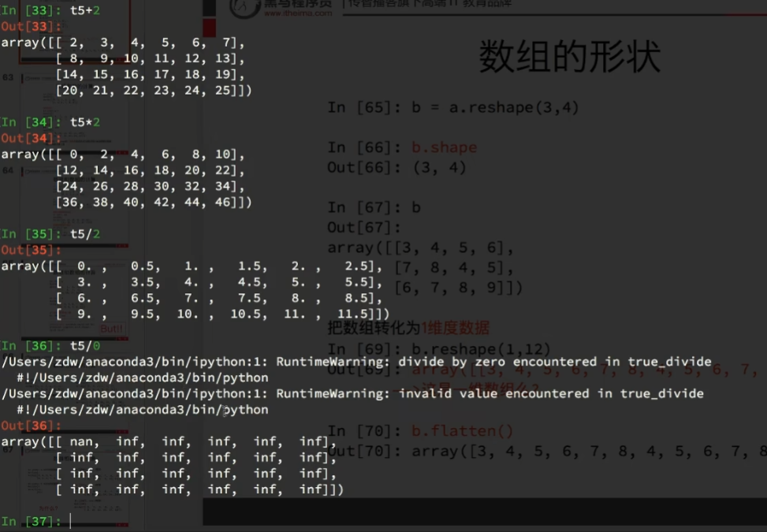

（2）数组与数组

- 维度相同时直接计算：
  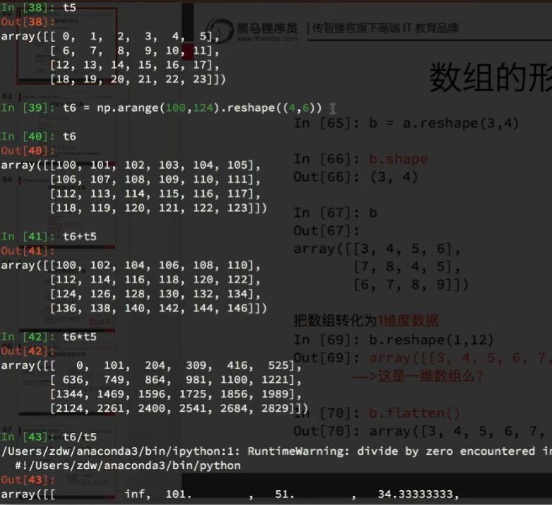
- 维度不同时：
  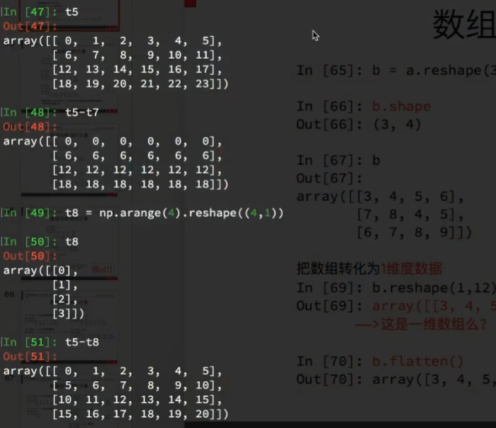
  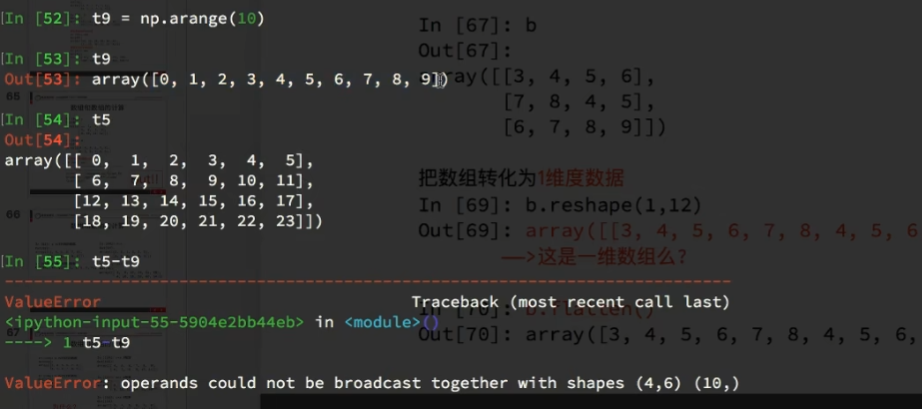


## 4、轴的概念

首先了解numpy中轴的概念：

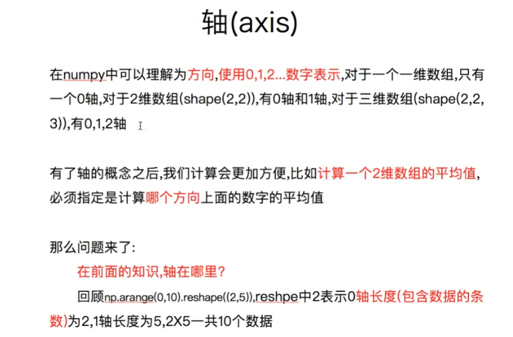


再来看看二维数组与三维数组的轴：

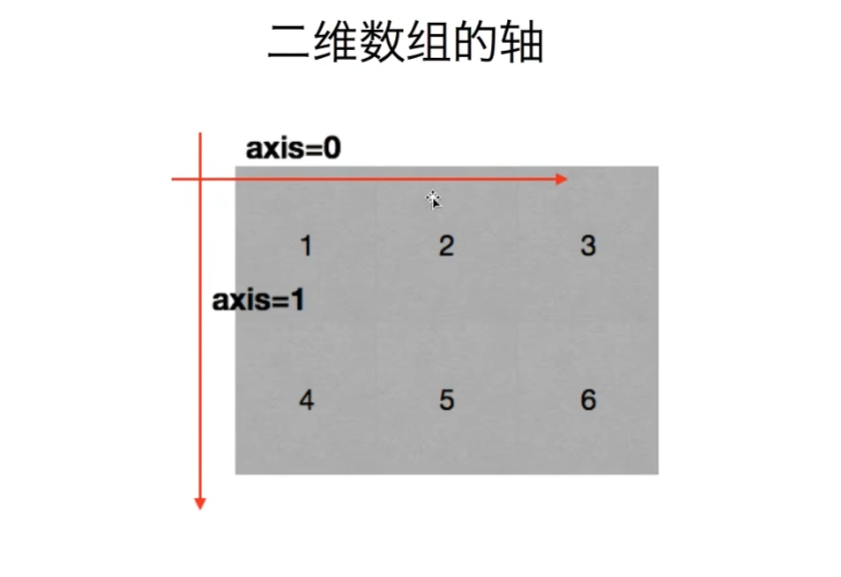


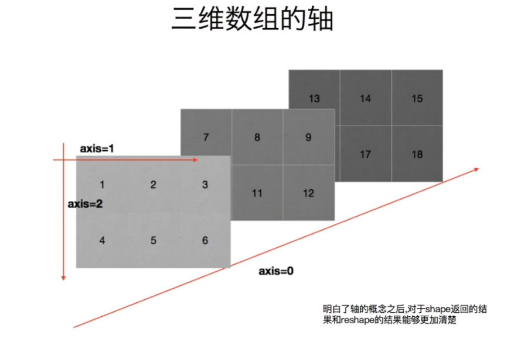


## 5、numpy读取本地文件

关于读取文件，实际上大多数情况，用pandas更加方便高效，这里简单了解一下numpy读取文件的方法：以读取csv格式文件为例

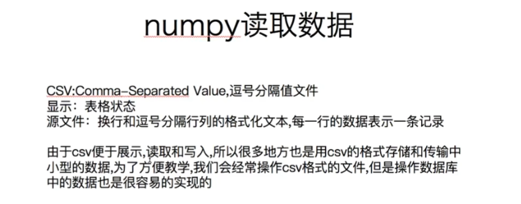

具体方法：

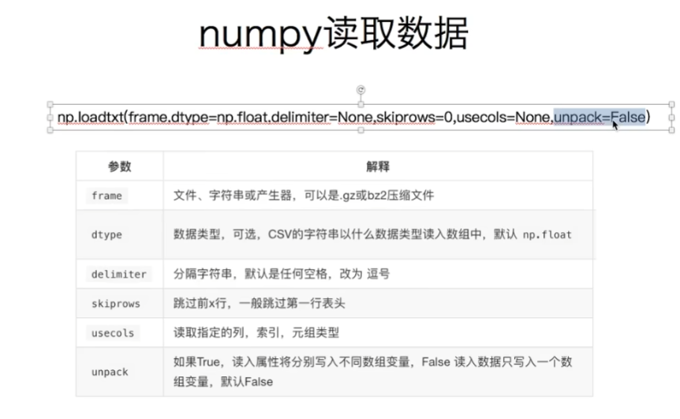

下面看一个例子：


示例文件参考官方文件：[DataAnalysis/day03/code/youtube_video_data at master · TheisTrue/DataAnalysis · GitHub](https://github.com/TheisTrue/DataAnalysis/tree/master/day03/code/youtube_video_data)

示例代码：

```
import numpy as np

us_file_path = "./youtube_video_data/US_video_data_numbers.csv"
uk_file_path = "./youtube_video_data/GB_video_data_numbers.csv"

t1 = np.loadtxt(us_file_path, delimiter=",")  # 数据按照逗号进行分割
print(t1)

```

结果展示：

```
[[4.394029e+06 3.200530e+05 5.931000e+03 4.624500e+04]
 [7.860119e+06 1.858530e+05 2.667900e+04 0.000000e+00]
 [5.845909e+06 5.765970e+05 3.977400e+04 1.707080e+05]
 ...
 [1.424630e+05 4.231000e+03 1.480000e+02 2.790000e+02]
 [2.162240e+06 4.103200e+04 1.384000e+03 4.737000e+03]
 [5.150000e+05 3.472700e+04 1.950000e+02 4.722000e+03]]
```

我们发现读取的全为科学计数法，看起来很不方便，那么如何用整数表示呢？

```
import numpy as np

us_file_path = "./youtube_video_data/US_video_data_numbers.csv"
uk_file_path = "./youtube_video_data/GB_video_data_numbers.csv"

# t1 = np.loadtxt(us_file_path, delimiter=",")  # 数据按照逗号进行分割
t1 = np.loadtxt(us_file_path, delimiter=",", dtype="int")
print(t1)
```

结果展示：

```
[[4394029  320053    5931   46245]
 [7860119  185853   26679       0]
 [5845909  576597   39774  170708]
 ...
 [ 142463    4231     148     279]
 [2162240   41032    1384    4737]
 [ 515000   34727     195    4722]]
```

并且我们提到`loadtxt`方法中有一个`unpack`方法，下面对比看一下效果：出现了转置的效果，行变成列，列变成行

```
import numpy as np

us_file_path = "./youtube_video_data/US_video_data_numbers.csv"
uk_file_path = "./youtube_video_data/GB_video_data_numbers.csv"

# t1 = np.loadtxt(us_file_path, delimiter=",")  # 数据按照逗号进行分割
t1 = np.loadtxt(us_file_path, delimiter=",", dtype="int", unpack=True)
t2 = np.loadtxt(us_file_path, delimiter=",", dtype="int", unpack=False)
print(t1)
print("*" * 10)
print(t2)
```

结果展示：

```
[[4394029 7860119 5845909 ...  142463 2162240  515000]
 [ 320053  185853  576597 ...    4231   41032   34727]
 [   5931   26679   39774 ...     148    1384     195]
 [  46245       0  170708 ...     279    4737    4722]]
**********
[[4394029  320053    5931   46245]
 [7860119  185853   26679       0]
 [5845909  576597   39774  170708]
 ...
 [ 142463    4231     148     279]
 [2162240   41032    1384    4737]
 [ 515000   34727     195    4722]]
```

三种方法来看看什么是转置：

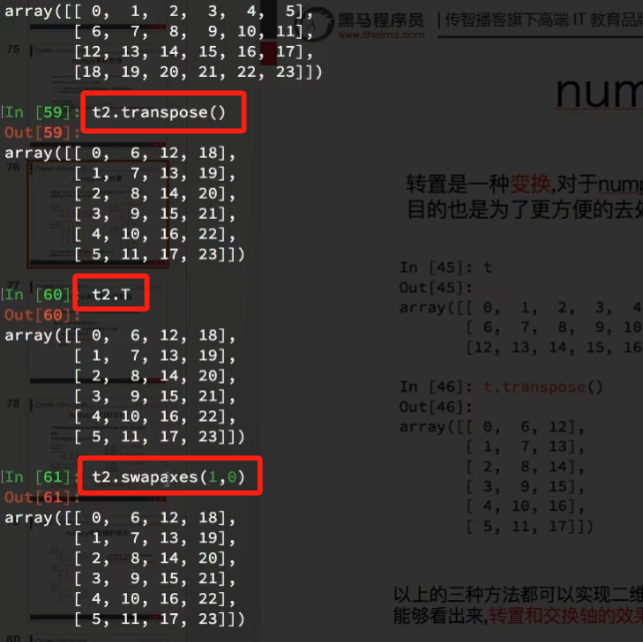


## 6、numpy索引和切片

主要用法参考如下代码：

```
import numpy as np

us_file_path = "./youtube_video_data/US_video_data_numbers.csv"
uk_file_path = "./youtube_video_data/GB_video_data_numbers.csv"

# t1 = np.loadtxt(us_file_path, delimiter=",")  # 数据按照逗号进行分割
t1 = np.loadtxt(us_file_path, delimiter=",", dtype="int", unpack=True)
t2 = np.loadtxt(us_file_path, delimiter=",", dtype="int", unpack=False)
print(t1)
print("*" * 10)
print(t2)

# print("*" * 100)

# 取行
# print(t2[2])

# 取连续的多行
# print(t2[2:])

# 取不连续的多行
# print(t2[[2,8,10]])

# print(t2[1,:])
# print(t2[2:,:])
# print(t2[[2,10,3],:])

# 取列
# print(t2[:,0])

# 取连续的多列
# print(t2[:,2:])

# 取不连续的多列
# print(t2[:,[0,2]])

# 取行和列：取第3行，第四列的值
# a = t2[2,3]
# print(a)
# print(type(a))

# 取多行和多列，取第3行到第五行，第2列到第4列的结果
# 去的是行和列交叉点的位置
# b = t2[2:5, 1:4]
# print(b)

# 取多个不相邻的点
# 选出来的结果是（0，0） （2，1） （2，3）
# c = t2[[0, 2, 2], [0, 1, 3]]
# print(c)

```


## 7、numpy中数值的修改

### 7.1 直接修改

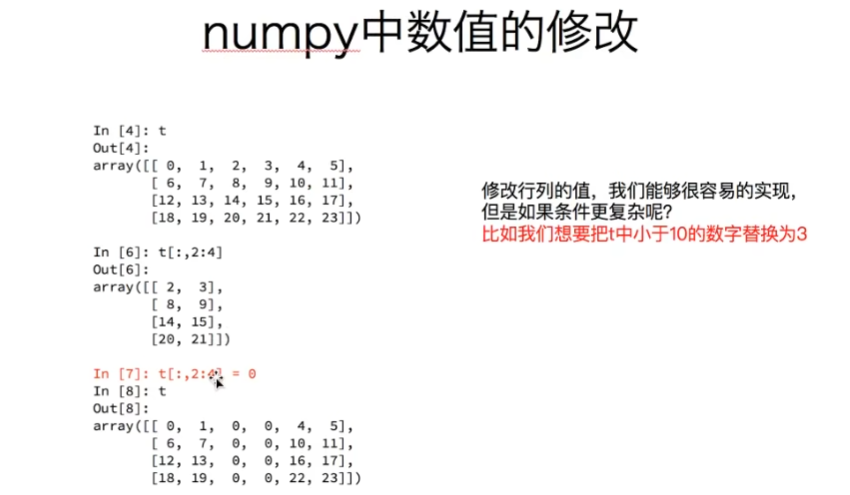

示例：

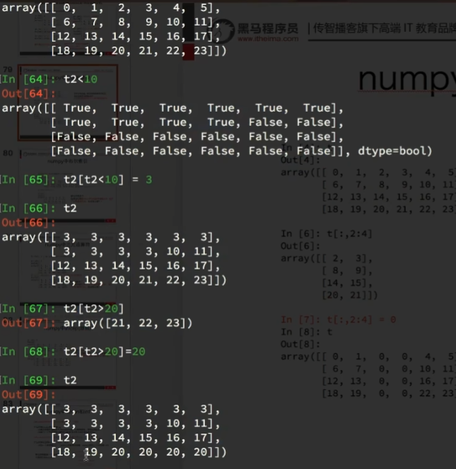

### 7.2 where方法

新需求：


像上述思路一样，可以分两步解决，那么有没有其他方法呢？

可以使用where方法，类似于Python中的三元运算符


where的其他示例：

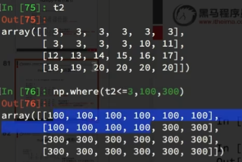


### 7.3 clip方法

如下图所示，基于clip的方法，小于10的数替换为10，大于18的数替换为18

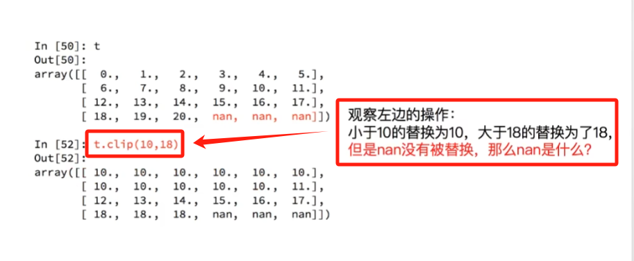

关于空值NaN：

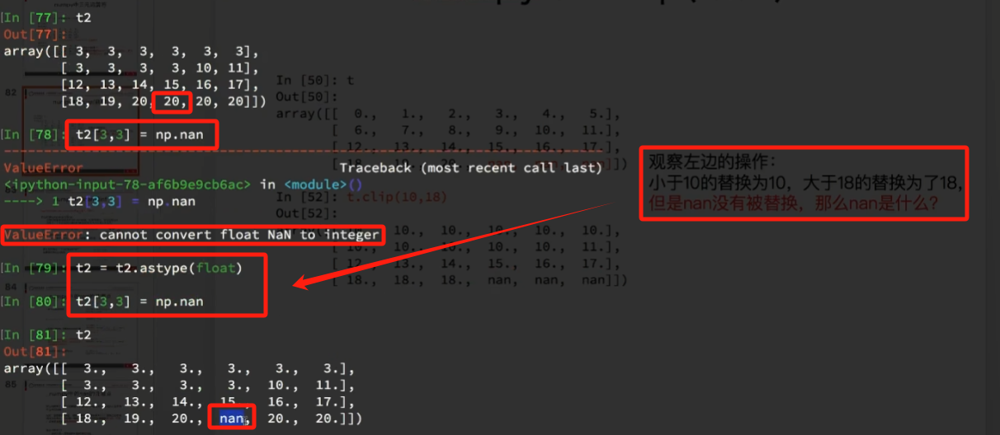


## 8、数组拼接

数组的拼接示例：

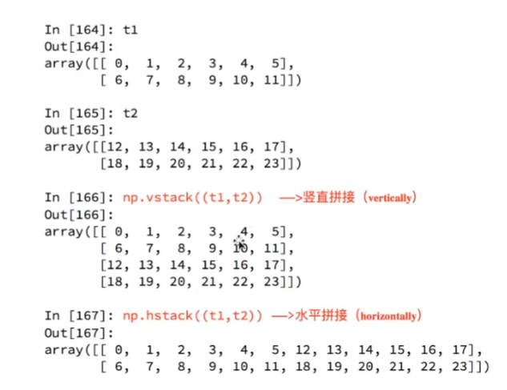

## 9、交换行列


示例：

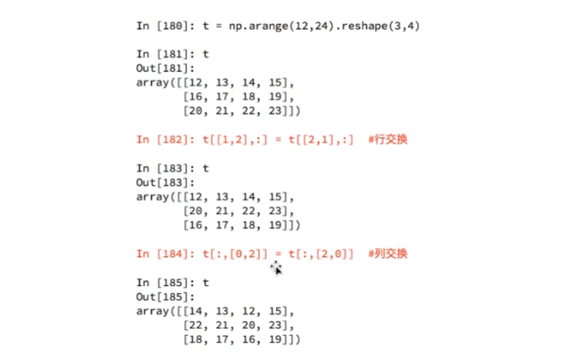


下面做一个练习：

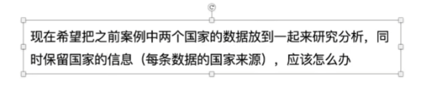


示例代码：

```
import numpy as np

us_file_path = "./youtube_video_data/US_video_data_numbers.csv"
uk_file_path = "./youtube_video_data/GB_video_data_numbers.csv"

# 加载国家数据
us_data = np.loadtxt(us_file_path, delimiter=",", dtype="int")
uk_data = np.loadtxt(uk_file_path, delimiter=",", dtype="int")

# 添加国家信息
zeros_data = np.zeros((us_data.shape[0], 1)).astype(int)  # 构造全为0的数据。另外，注意细节：指定类型，方便后续处理
ones_data = np.ones((uk_data.shape[0], 1)).astype(int)  # 构造全为1的数据
"""
上述加双括号的原因是，np.zeros、np.ones的参数是一个元组（tuple），该元组指定了返回数组的形状。
即(us_data.shape[0], 1)是一个元组，作为np.zeros函数的一个参数。
"""
# us_data、uk_data分别添加一列全为0、全为1的数据
us_data = np.hstack((us_data, zeros_data))  # 水平拼接
uk_data = np.hstack((uk_data, ones_data))  # 水平拼接

# 拼接两组数据
final_data = np.vstack((us_data, uk_data))
print(final_data)

```

结果展示：

```
[[4394029  320053    5931   46245       0]
 [7860119  185853   26679       0       0]
 [5845909  576597   39774  170708       0]
 ...
 [ 109222    4840      35     212       1]
 [ 626223   22962     532    1559       1]
 [  99228    1699      23     135       1]]
```


## 10、其他方法


## 11、生成随机数

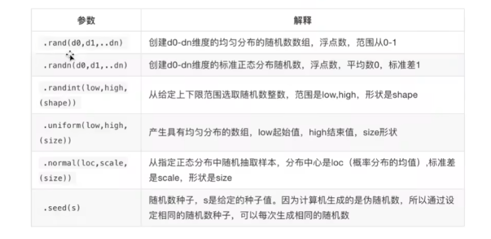


## 12、copy和view


## 13、nan和inf

### 13.1 基本概念

nan和inf的概念如下图所示，特别注意二者的类型为浮点型，非浮点型的数不能直接修改为nan或inf，也就是说如非浮点型数想改为nan或者inf要先转为float然后再改。

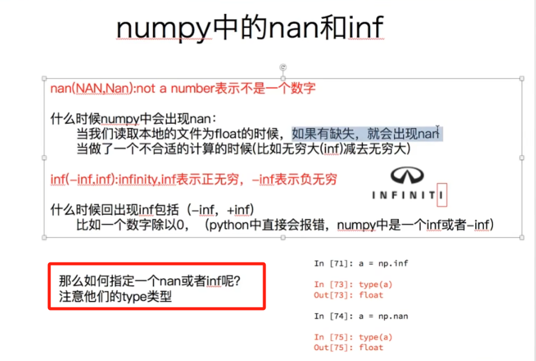

### 13.2 注意点

注意：`np.nan`（表示“Not a Number”）不等于 `np.nan` ，这是因为 `NaN` 表示一个未定义或不可表示的值，而未定义的值之间不应该相等。这是 IEEE 浮点数标准（IEEE 754）的规定，具体原因就不赘述了。

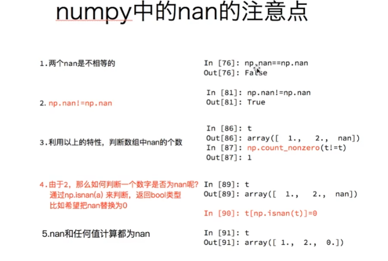

### 13.3 替换nan

这种特性就引发了新问题：


关于计算中值或均值等，numpy提供了一些函数：

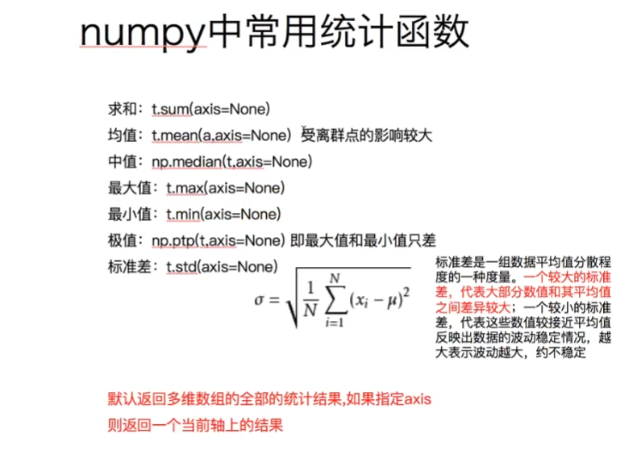

关于将数据替换为nan，先写一段基础代码：

```
import numpy as np

t1 = np.arange(12).reshape((3, 4)).astype("float")
t1[1, 2:] = np.nan
print(t1)

```

结果展示：

```
[[ 0.  1.  2.  3.]
 [ 4.  5. nan nan]
 [ 8.  9. 10. 11.]]
```

再遍历数组检索nan，并将数组中的nan换为均值数据，示例代码如下：

```
import numpy as np


def fill_ndarrary(t1):
    for i in range(t1.shape[1]):
        temp_col = t1[:, i]  # 当前的一列数据
        nan_num = np.count_nonzero(temp_col != temp_col)  # 统计nan数量
        if nan_num != 0:
            temp_not_nan_col = temp_col[temp_col == temp_col]  # 提取当前一列不为nan的array
            temp_col[np.isnan(temp_col)] = temp_not_nan_col.mean()  # 将当前列的nan赋值为：提取当前一列不为nan的array的平均值
    return t1


if __name__ == '__main__':
    t1 = np.arange(12).reshape((3, 4)).astype("float")
    t1[1, 2:] = np.nan
    print(t1)
    print("*" * 10)
    t1 = fill_ndarrary(t1)
    print(t1)

```

结果展示：

```
[[ 0.  1.  2.  3.]
 [ 4.  5. nan nan]
 [ 8.  9. 10. 11.]]
**********
[[ 0.  1.  2.  3.]
 [ 4.  5.  6.  7.]
 [ 8.  9. 10. 11.]]
```


# 三、pandas

## 1、pandas介绍


Pandas 概念：

- 是一个开放源码、BSD 许可的库，提供高性能、易于使用的数据结构和数据分析工具。


主要数据结构：

- Series （一维数据）：是一种类似于一维数组的对象，它由一组数据（各种 Numpy 数据类型）以及一组与之相关的数据标签（即索引）组成。
- DataFrame（二维数据）：是一个表格型的数据结构，它含有一组有序的列，每列可以是不同的值类型（数值、字符串、布尔型值）。DataFrame 既有行索引也有列索引，它可以被看做由 Series 组成的字典（共同用一个索引）。


## 2、Series

### 2.1 Series创建

通过列表或字典创建Series对象

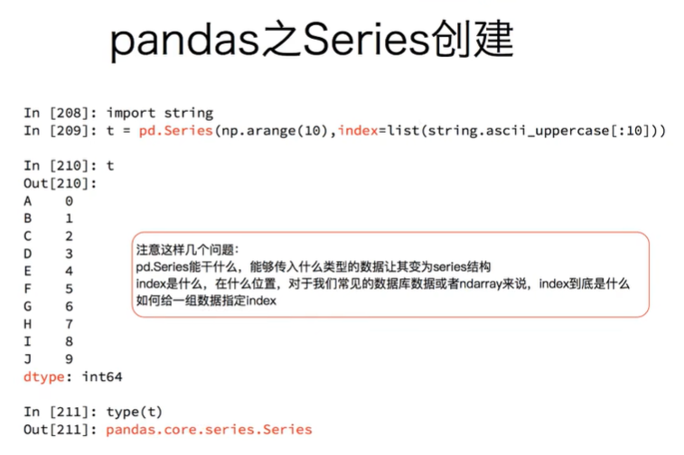


Series示例代码：

```
import pandas as pd


t1 = pd.Series([1,2,4,88,10])
print(t1)
print(t1.dtype)
print(type(t1))

t2 = pd.Series([1,22,33,44,55], index=list("abcde"))
print(t2)
print(t2.dtype)
print(type(t2))
t2 = t2.astype(float)
print(t2)

temp_dict = {"name":"xiaoming", "age":18}
t3 = pd.Series(temp_dict)
print(t3)
print(t3.dtype)
print(type(t3))
```

结果展示：

```
0     1
1     2
2     4
3    88
4    10
dtype: int64
int64
<class 'pandas.core.series.Series'>
a     1
b    22
c    33
d    44
e    55
dtype: int64
int64
<class 'pandas.core.series.Series'>
a     1.0
b    22.0
c    33.0
d    44.0
e    55.0
dtype: float64
name    xiaoming
age           18
dtype: object
object
<class 'pandas.core.series.Series'>
```


### 2.2 Series切片和索引

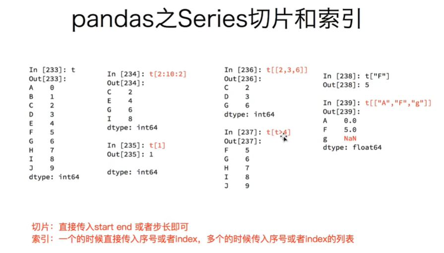


## 3、读取外部数据

首先看一下pandas读取外部数据，这里先看一下读取csv与读取数据库，除此之外pandas还可以读取剪切板等等内容。


示例代码：

```
import pandas as pd

df = pd.read_csv("./GBvideos.csv")
print(df)
print(type(df))
print(df.dtypes)

```

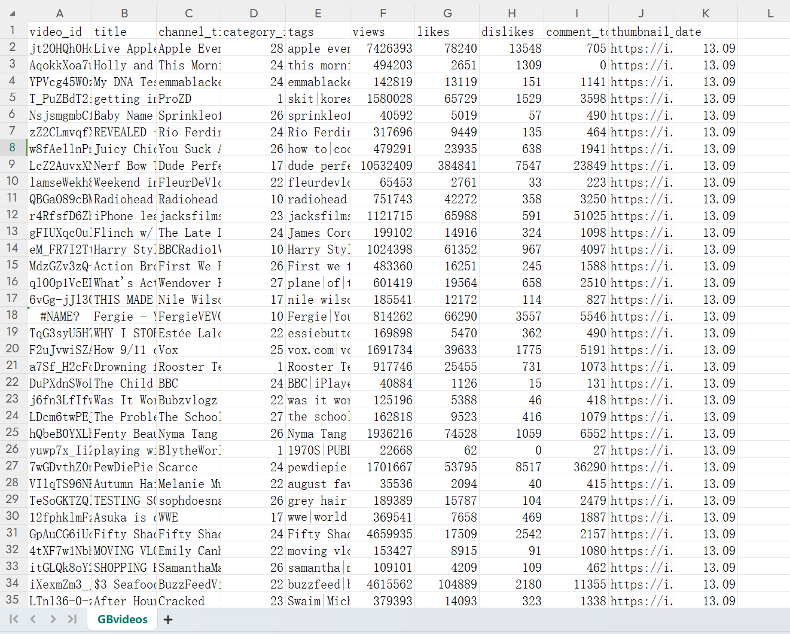

结果展示：

```
         video_id  ...   date
0     jt2OHQh0HoQ  ...  13.09
1     AqokkXoa7uE  ...  13.09
2     YPVcg45W0z4  ...  13.09
3     T_PuZBdT2iM  ...  13.09
4     NsjsmgmbCfc  ...  13.09
...           ...  ...    ...
1595  w8fAellnPns  ...  20.09
1596  RsG37JcEQNw  ...  20.09
1597  htSiIA2g7G8  ...  20.09
1598  ZQK1F0wz6z4  ...  20.09
1599  DuPXdnSWoLk  ...  20.09

[1600 rows x 11 columns]
<class 'pandas.core.frame.DataFrame'>
video_id           object
title              object
channel_title      object
category_id         int64
tags               object
views               int64
likes               int64
dislikes            int64
comment_total       int64
thumbnail_link     object
date              float64
dtype: object
```


## 4、DataFrame

### 4.1 DataFrame创建

首先了解一下DataFrame的创建与索引

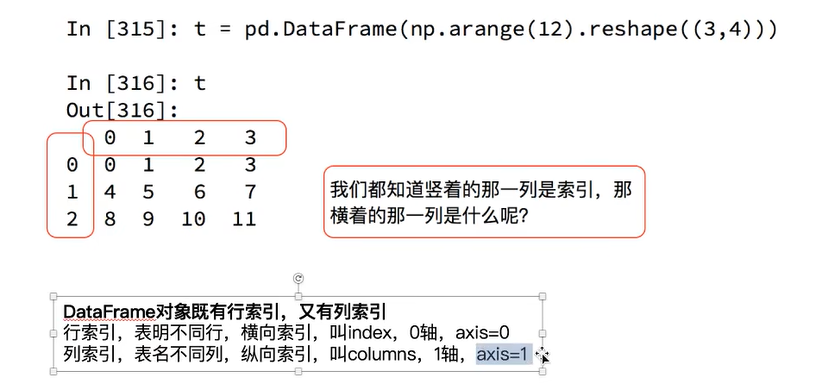

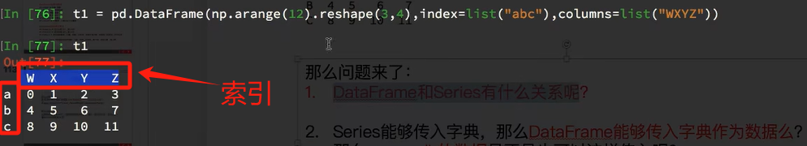

Pandas常见问题：

- DataFrame与Series有什么关系

  - **Series**:
    - Series 是一个一维的数据结构，可以看作是带有标签的一维数组。
    - 每个 Series 有一个索引（index），它可以是数字索引或标签索引。
  - **DataFrame**:
    - DataFrame 是一个二维的数据结构，它可以看作是由多个 Series 组成的表格。
    - DataFrame 有行索引和列索引，每列可以看作是一个 Series。
  - 简而言之，DataFrame 是多个 Series 按列组合在一起形成的二维数据结构。

- Series能够传入字典，那么DataFrame可以吗？那么mongodb的数据是否也可以这样传入呢？

  - DataFrame 也可以传入字典来创建

    - Series 传入字典:

      ```
      python复制代码import pandas as pd
      
      data = {'a': 1, 'b': 2, 'c': 3}
      series = pd.Series(data)
      print(series)
      ```

    - DataFrame 传入字典: DataFrame 可以传入字典，其中字典的键是列名，值是列数据。

      ```
      python复制代码import pandas as pd
      
      data = {
          'name': ['Alice', 'Bob', 'Charlie'],
          'age': [25, 30, 35]
      }
      df = pd.DataFrame(data)
      print(df)
      ```

  - MongoDB 的数据通常是以 JSON 格式存储的，可以通过 pymongo 库将其导入 pandas DataFrame 中。示例代码如下：

    ```
    from pymongo import MongoClient
    import pandas as pd
    
    # 连接到 MongoDB
    client = MongoClient('mongodb://localhost:27017/')
    db = client['your_database']
    collection = db['your_collection']
    
    # 从 MongoDB 中读取数据
    data = list(collection.find())
    
    # 将数据转换为 DataFrame
    df = pd.DataFrame(data)
    print(df)
    ```

- 对于一个DataFrame类型，既有行索引，又有列索引，我们能够对他做什么操作呢？

  - 选择行和列、过滤数据、添加/删除列、数据统计、数据清洗、数据合并、数据分组等等，这里就不一一展开了


### 4.2 常用属性

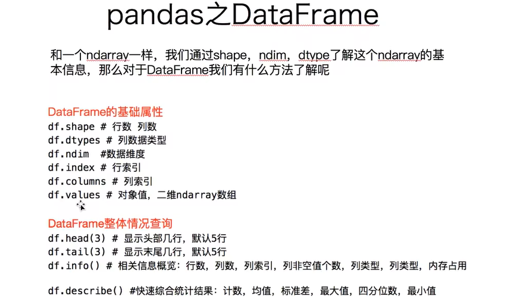

练习：

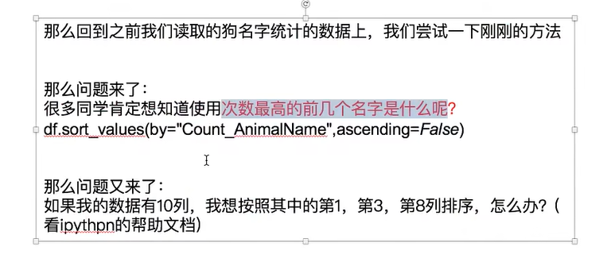

示例：

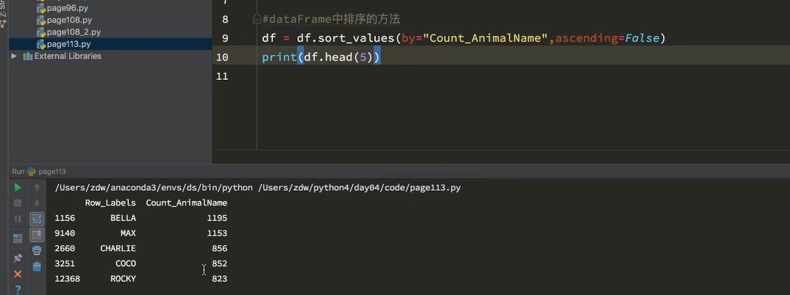


### 4.3 索引

#### 1）直接索引

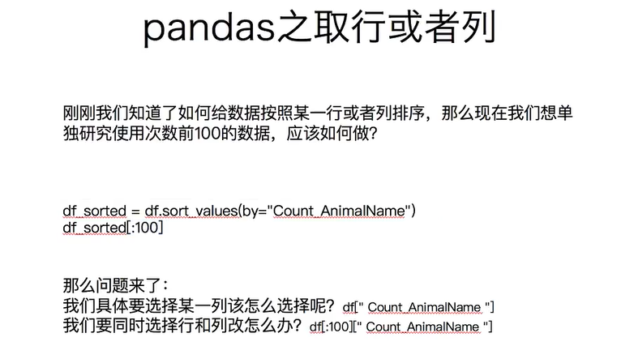

#### 2）loc方法与iloc方法

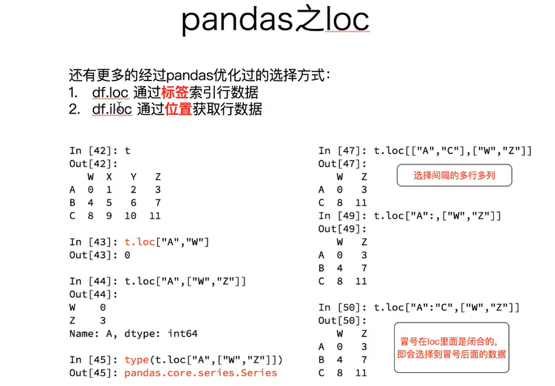

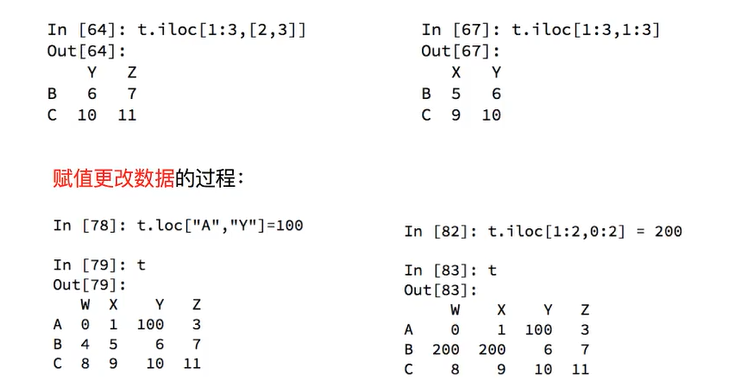

#### 3）bool索引

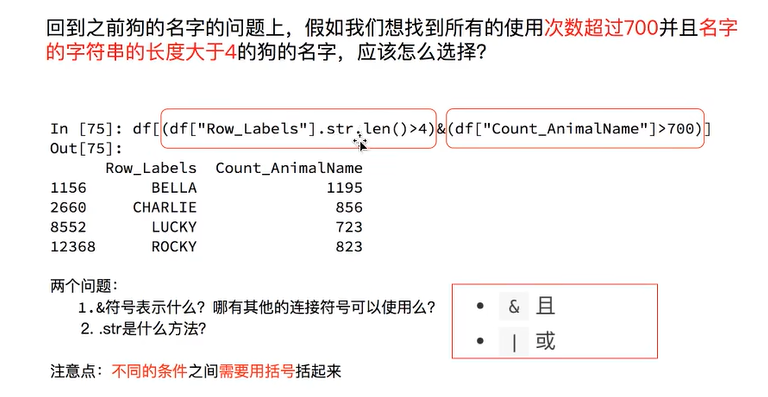

关于str方法：

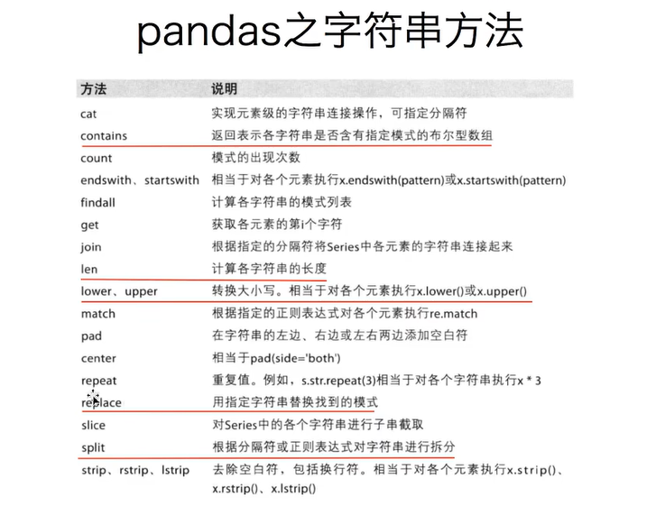


## 5、缺失数据处理

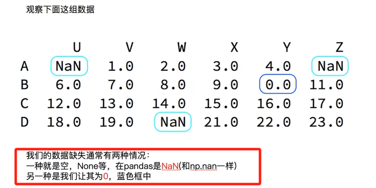

具体处理方式：

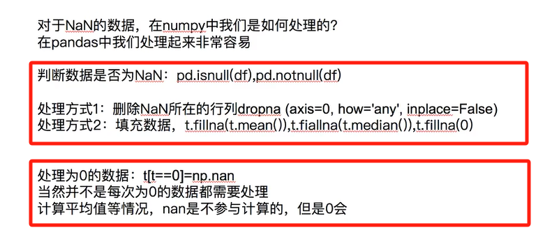


## 统计方法

针对pandas常用统计方法，我们做一组练习：

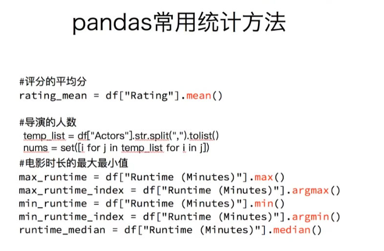

### 例题1

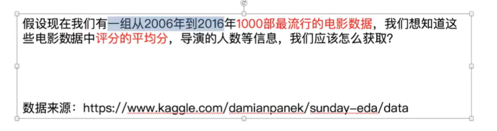

示例代码：

```

```

结果展示：


### 例题2

例题如下：


数据情况如下：

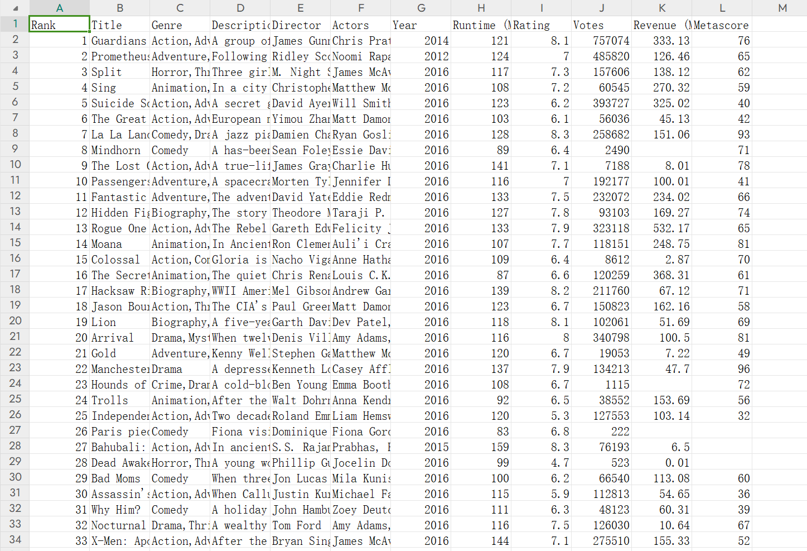

示例代码：

```
# coding=utf-8
import pandas as pd
from matplotlib import pyplot as plt
file_path = "./IMDB-Movie-Data.csv"

df = pd.read_csv(file_path)
print(df.head(1))
print(df.info())

# rating,runtime分布情况
# 选择图形，直方图
# 准备数据
runtime_data = df["Runtime (Minutes)"].values

max_runtime = runtime_data.max()
min_runtime = runtime_data.min()

# 计算组数
print(max_runtime-min_runtime)
num_bin = int((max_runtime-min_runtime)//0.5)


# 设置图形的大小
plt.figure(figsize=(20,8),dpi=80)
plt.hist(runtime_data,num_bin)

# 设置x轴的刻度
# _x = list(range(int(min_runtime), int(max_runtime) + 1, 1))
_x = [min_runtime]
i = min_runtime
while i <= max_runtime + 0.5:
    i = i + 0.5
    _x.append(i)

plt.xticks(_x)

plt.show()

```

结果展示：

```
   Rank                    Title  ... Revenue (Millions) Metascore
0     1  Guardians of the Galaxy  ...             333.13      76.0

[1 rows x 12 columns]
<class 'pandas.core.frame.DataFrame'>
RangeIndex: 1000 entries, 0 to 999
Data columns (total 12 columns):
 #   Column              Non-Null Count  Dtype  
---  ------              --------------  -----  
 0   Rank                1000 non-null   int64  
 1   Title               1000 non-null   object 
 2   Genre               1000 non-null   object 
 3   Description         1000 non-null   object 
 4   Director            1000 non-null   object 
 5   Actors              1000 non-null   object
 6   Year                1000 non-null   int64
 7   Runtime (Minutes)   1000 non-null   int64
 8   Rating              1000 non-null   float64
 9   Votes               1000 non-null   int64
 10  Revenue (Millions)  872 non-null    float64
 11  Metascore           936 non-null    float64
dtypes: float64(3), int64(4), object(5)
memory usage: 93.9+ KB
None
125
```

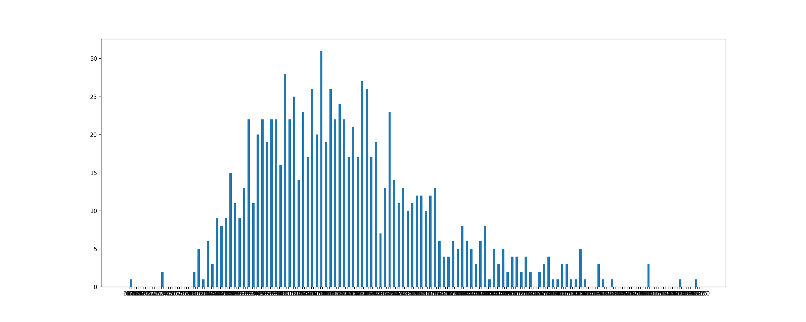


示例代码：

```
import numpy as np
from matplotlib import pyplot as plt

runtime_data = np.array([8.1, 7.0, 7.3, 7.2, 6.2, 6.1, 8.3, 6.4, 7.1, 7.0, 7.5, 7.8, 7.9, 7.7, 6.4, 6.6, 8.2, 6.7, 8.1, 8.0, 6.7, 7.9, 6.7, 6.5, 5.3, 6.8, 8.3, 4.7, 6.2, 5.9, 6.3, 7.5, 7.1, 8.0, 5.6, 7.9, 8.6, 7.6, 6.9, 7.1, 6.3, 7.5, 2.7, 7.2, 6.3, 6.7, 7.3, 5.6, 7.1, 3.7, 8.1, 5.8, 5.6, 7.2, 9.0, 7.3, 7.2, 7.4, 7.0, 7.5, 6.7, 6.8, 6.5, 4.1, 8.5, 7.7, 7.4, 8.1, 7.5, 7.2, 5.9, 7.1, 7.5, 6.8, 8.1, 7.1, 8.1, 8.3, 7.3, 5.3, 8.8, 7.9, 8.2, 8.1, 7.2, 7.0, 6.4, 7.8, 7.8, 7.4, 8.1, 7.0, 8.1, 7.1, 7.4, 7.4, 8.6, 5.8, 6.3, 8.5, 7.0, 7.0, 8.0, 7.9, 7.3, 7.7, 5.4, 6.3, 5.8, 7.7, 6.3, 8.1, 6.1, 7.7, 8.1, 5.8, 6.2, 8.8, 7.2, 7.4, 6.7, 6.7, 6.0, 7.4, 8.5, 7.5, 5.7, 6.6, 6.4, 8.0, 7.3, 6.0, 6.4, 8.5, 7.1, 7.3, 8.1, 7.3, 8.1, 7.1, 8.0, 6.2, 7.8, 8.2, 8.4, 8.1, 7.4, 7.6, 7.6, 6.2, 6.4, 7.2, 5.8, 7.6, 8.1, 4.7, 7.0, 7.4, 7.5, 7.9, 6.0, 7.0, 8.0, 6.1, 8.0, 5.2, 6.5, 7.3, 7.3, 6.8, 7.9, 7.9, 5.2, 8.0, 7.5, 6.5, 7.6, 7.0, 7.4, 7.3, 6.7, 6.8, 7.0, 5.9, 8.0, 6.0, 6.3, 6.6, 7.8, 6.3, 7.2, 5.6, 8.1, 5.8, 8.2, 6.9, 6.3, 8.1, 8.1, 6.3, 7.9, 6.5, 7.3, 7.9, 5.7, 7.8, 7.5, 7.5, 6.8, 6.7, 6.1, 5.3, 7.1, 5.8, 7.0, 5.5, 7.8, 5.7, 6.1, 7.7, 6.7, 7.1, 6.9, 7.8, 7.0, 7.0, 7.1, 6.4, 7.0, 4.8, 8.2, 5.2, 7.8, 7.4, 6.1, 8.0, 6.8, 3.9, 8.1, 5.9, 7.6, 8.2, 5.8, 6.5, 5.9, 7.6, 7.9, 7.4, 7.1, 8.6, 4.9, 7.3, 7.9, 6.7, 7.5, 7.8, 5.8, 7.6, 6.4, 7.1, 7.8, 8.0, 6.2, 7.0, 6.0, 4.9, 6.0, 7.5, 6.7, 3.7, 7.8, 7.9, 7.2, 8.0, 6.8, 7.0, 7.1, 7.7, 7.0, 7.2, 7.3, 7.6, 7.1, 7.0, 6.0, 6.1, 5.8, 5.3, 5.8, 6.1, 7.5, 7.2, 5.7, 7.7, 7.1, 6.6, 5.7, 6.8, 7.1, 8.1, 7.2, 7.5, 7.0, 5.5, 6.4, 6.7, 6.2, 5.5, 6.0, 6.1, 7.7, 7.8, 6.8, 7.4, 7.5, 7.0, 5.2, 5.3, 6.2, 7.3, 6.5, 6.4, 7.3, 6.7, 7.7, 6.0, 6.0, 7.4, 7.0, 5.4, 6.9, 7.3, 8.0, 7.4, 8.1, 6.1, 7.8, 5.9, 7.8, 6.5, 6.6, 7.4, 6.4, 6.8, 6.2, 5.8, 7.7, 7.3, 5.1, 7.7, 7.3, 6.6, 7.1, 6.7, 6.3, 5.5, 7.4, 7.7, 6.6, 7.8, 6.9, 5.7, 7.8, 7.7, 6.3, 8.0, 5.5, 6.9, 7.0, 5.7, 6.0, 6.8, 6.3, 6.7, 6.9, 5.7, 6.9, 7.6, 7.1, 6.1, 7.6, 7.4, 6.6, 7.6, 7.8, 7.1, 5.6, 6.7, 6.7, 6.6, 6.3, 5.8, 7.2, 5.0, 5.4, 7.2, 6.8, 5.5, 6.0, 6.1, 6.4, 3.9, 7.1, 7.7, 6.7, 6.7, 7.4, 7.8, 6.6, 6.1, 7.8, 6.5, 7.3, 7.2, 5.6, 5.4, 6.9, 7.8, 7.7, 7.2, 6.8, 5.7, 5.8, 6.2, 5.9, 7.8, 6.5, 8.1, 5.2, 6.0, 8.4, 4.7, 7.0, 7.4, 6.4, 7.1, 7.1, 7.6, 6.6, 5.6, 6.3, 7.5, 7.7, 7.4, 6.0, 6.6, 7.1, 7.9, 7.8, 5.9, 7.0, 7.0, 6.8, 6.5, 6.1, 8.3, 6.7, 6.0, 6.4, 7.3, 7.6, 6.0, 6.6, 7.5, 6.3, 7.5, 6.4, 6.9, 8.0, 6.7, 7.8, 6.4, 5.8, 7.5, 7.7, 7.4, 8.5, 5.7, 8.3, 6.7, 7.2, 6.5, 6.3, 7.7, 6.3, 7.8, 6.7, 6.7, 6.6, 8.0, 6.5, 6.9, 7.0, 5.3, 6.3, 7.2, 6.8, 7.1, 7.4, 8.3, 6.3, 7.2, 6.5, 7.3, 7.9, 5.7, 6.5, 7.7, 4.3, 7.8, 7.8, 7.2, 5.0, 7.1, 5.7, 7.1, 6.0, 6.9, 7.9, 6.2, 7.2, 5.3, 4.7, 6.6, 7.0, 3.9, 6.6, 5.4, 6.4, 6.7, 6.9, 5.4, 7.0, 6.4, 7.2, 6.5, 7.0, 5.7, 7.3, 6.1, 7.2, 7.4, 6.3, 7.1, 5.7, 6.7, 6.8, 6.5, 6.8, 7.9, 5.8, 7.1, 4.3, 6.3, 7.1, 4.6, 7.1, 6.3, 6.9, 6.6, 6.5, 6.5, 6.8, 7.8, 6.1, 5.8, 6.3, 7.5, 6.1, 6.5, 6.0, 7.1, 7.1, 7.8, 6.8, 5.8, 6.8, 6.8, 7.6, 6.3, 4.9, 4.2, 5.1, 5.7, 7.6, 5.2, 7.2, 6.0, 7.3, 7.2, 7.8, 6.2, 7.1, 6.4, 6.1, 7.2, 6.6, 6.2, 7.9, 7.3, 6.7, 6.4, 6.4, 7.2, 5.1, 7.4, 7.2, 6.9, 8.1, 7.0, 6.2, 7.6, 6.7, 7.5, 6.6, 6.3, 4.0, 6.9, 6.3, 7.3, 7.3, 6.4, 6.6, 5.6, 6.0, 6.3, 6.7, 6.0, 6.1, 6.2, 6.7, 6.6, 7.0, 4.9, 8.4, 7.0, 7.5, 7.3, 5.6, 6.7, 8.0, 8.1, 4.8, 7.5, 5.5, 8.2, 6.6, 3.2, 5.3, 5.6, 7.4, 6.4, 6.8, 6.7, 6.4, 7.0, 7.9, 5.9, 7.7, 6.7, 7.0, 6.9, 7.7, 6.6, 7.1, 6.6, 5.7, 6.3, 6.5, 8.0, 6.1, 6.5, 7.6, 5.6, 5.9, 7.2, 6.7, 7.2, 6.5, 7.2, 6.7, 7.5, 6.5, 5.9, 7.7, 8.0, 7.6, 6.1, 8.3, 7.1, 5.4, 7.8, 6.5, 5.5, 7.9, 8.1, 6.1, 7.3, 7.2, 5.5, 6.5, 7.0, 7.1, 6.6, 6.5, 5.8, 7.1, 6.5, 7.4, 6.2, 6.0, 7.6, 7.3, 8.2, 5.8, 6.5, 6.6, 6.2, 5.8, 6.4, 6.7, 7.1, 6.0, 5.1, 6.2, 6.2, 6.6, 7.6, 6.8, 6.7, 6.3, 7.0, 6.9, 6.6, 7.7, 7.5, 5.6, 7.1, 5.7, 5.2, 5.4, 6.6, 8.2, 7.6, 6.2, 6.1, 4.6, 5.7, 6.1, 5.9, 7.2, 6.5, 7.9, 6.3, 5.0, 7.3, 5.2, 6.6, 5.2, 7.8, 7.5, 7.3, 7.3, 6.6, 5.7, 8.2, 6.7, 6.2, 6.3, 5.7, 6.6, 4.5, 8.1, 5.6, 7.3, 6.2, 5.1, 4.7, 4.8, 7.2, 6.9, 6.5, 7.3, 6.5, 6.9, 7.8, 6.8, 4.6, 6.7, 6.4, 6.0, 6.3, 6.6, 7.8, 6.6, 6.2, 7.3, 7.4, 6.5, 7.0, 4.3, 7.2, 6.2, 6.2, 6.8, 6.0, 6.6, 7.1, 6.8, 5.2, 6.7, 6.2, 7.0, 6.3, 7.8, 7.6, 5.4, 7.6, 5.4, 4.6, 6.9, 6.8, 5.8, 7.0, 5.8, 5.3, 4.6, 5.3, 7.6, 1.9, 7.2, 6.4, 7.4, 5.7, 6.4, 6.3, 7.5, 5.5, 4.2, 7.8, 6.3, 6.4, 7.1, 7.1, 6.8, 7.3, 6.7, 7.8, 6.3, 7.5, 6.8, 7.4, 6.8, 7.1, 7.6, 5.9, 6.6, 7.5, 6.4, 7.8, 7.2, 8.4, 6.2, 7.1, 6.3, 6.5, 6.9, 6.9, 6.6, 6.9, 7.7, 2.7, 5.4, 7.0, 6.6, 7.0, 6.9, 7.3, 5.8, 5.8, 6.9, 7.5, 6.3, 6.9, 6.1, 7.5, 6.8, 6.5, 5.5, 7.7, 3.5, 6.2, 7.1, 5.5, 7.1, 7.1, 7.1, 7.9, 6.5, 5.5, 6.5, 5.6, 6.8, 7.9, 6.2, 6.2, 6.7, 6.9, 6.5, 6.6, 6.4, 4.7, 7.2, 7.2, 6.7, 7.5, 6.6, 6.7, 7.5, 6.1, 6.4, 6.3, 6.4, 6.8, 6.1, 4.9, 7.3, 5.9, 6.1, 7.1, 5.9, 6.8, 5.4, 6.3, 6.2, 6.6, 4.4, 6.8, 7.3, 7.4, 6.1, 4.9, 5.8, 6.1, 6.4, 6.9, 7.2, 5.6, 4.9, 6.1, 7.8, 7.3, 4.3, 7.2, 6.4, 6.2, 5.2, 7.7, 6.2, 7.8, 7.0, 5.9, 6.7, 6.3, 6.9, 7.0, 6.7, 7.3, 3.5, 6.5, 4.8, 6.9, 5.9, 6.2, 7.4, 6.0, 6.2, 5.0, 7.0, 7.6, 7.0, 5.3, 7.4, 6.5, 6.8, 5.6, 5.9, 6.3, 7.1, 7.5, 6.6, 8.5, 6.3, 5.9, 6.7, 6.2, 5.5, 6.2, 5.6, 5.3])
max_runtime = runtime_data.max()
min_runtime = runtime_data.min()
print(min_runtime,max_runtime)

#设置不等宽的组距，hist方法中取到的会是一个左闭右开的去见[1.9,3.5)
num_bin_list = [1.9,3.5]
i=3.5
while i<=max_runtime:
    i += 0.5
    num_bin_list.append(i)
print(num_bin_list)

#设置图形的大小
plt.figure(figsize=(20,8),dpi=80)
plt.hist(runtime_data,num_bin_list)

#xticks让之前的组距能够对应上
plt.xticks(num_bin_list)

plt.show()

```

结果展示：

```
1.9 9.0
[1.9, 3.5, 4.0, 4.5, 5.0, 5.5, 6.0, 6.5, 7.0, 7.5, 8.0, 8.5, 9.0, 9.5]
```

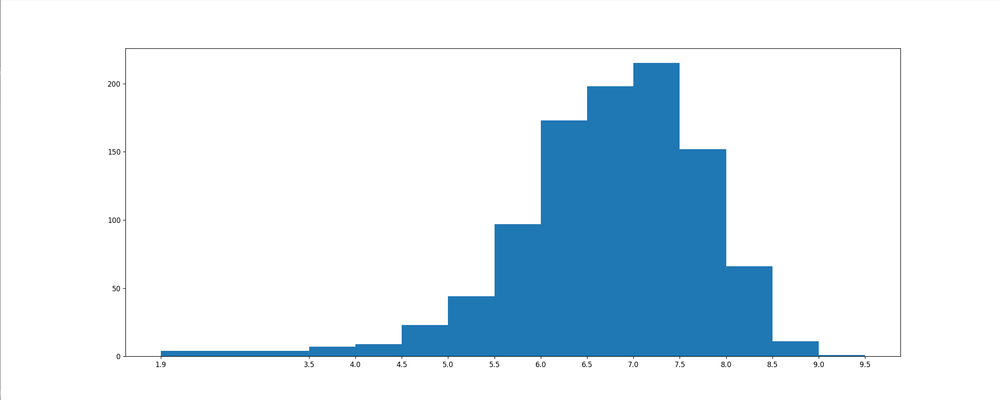


