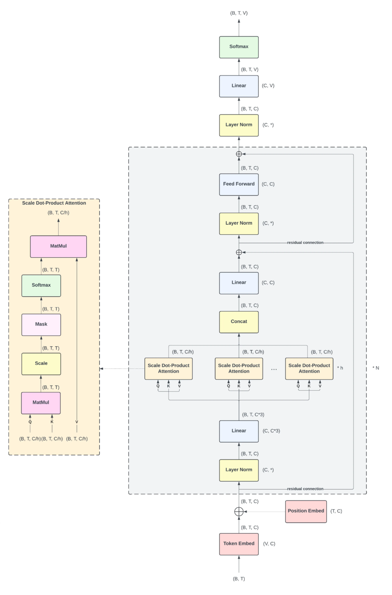
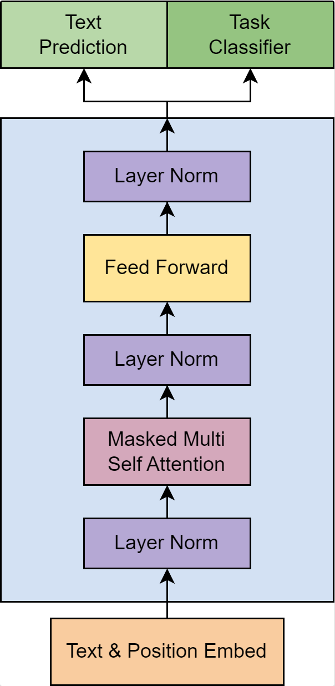
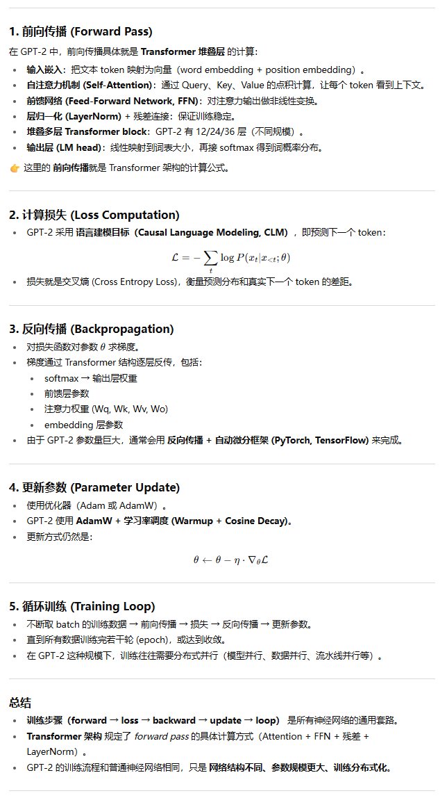

>NanoGPT是Karpathy大佬近乎从一个空文件、基于Pytorch、同时结合GPT-3的一些技巧，4h复现的GPT-2。


官网代码：

- Karpathy官方：
  - https://github.com/karpathy/build-nanogpt
  - https://github.com/karpathy/nanoGPT
- OpenAI官方：https://github.com/openai/gpt-2

视频教程：

- 原教程：[Let's reproduce GPT-2 (124M)](https://www.youtube.com/watch?v=l8pRSuU81PU)
- b站翻译版：[【精校】“让我们重现GPT-2（1.24亿参数）!”](https://www.bilibili.com/video/BV12s421u7sZ)

参考笔记：

- [NanoGPT从零开始搭建代码解读](https://aidenlee.tech/2025/01/10/%E3%80%90LLM%E8%AE%AD%E7%BB%83%E7%B3%BB%E5%88%97%E3%80%91NanoGPT%E4%BB%8E%E9%9B%B6%E5%BC%80%E5%A7%8B%E6%90%AD%E5%BB%BA%E4%BB%A3%E7%A0%81%E8%A7%A3%E8%AF%BB/)
- [GPT2复现笔记 Let's reproduce GPT-2](https://zhuanlan.zhihu.com/p/16880416388)
- [NanoGPT：从头训练一个GPT]()


------

 介绍GPT-2结构等宏观的信息。


先撰写了GPT-2的Class，之后逐步实现各个函数细节，最终效果：https://github.com/karpathy/nanoGPT/blob/master/model.py


关于原GPT-2的结构图，参考：[GPT-2 Detailed Model Architecture](https://medium.com/@hsinhungw/gpt-2-detailed-model-architecture-6b1aad33d16b)




关于复现的GPT-2的结构，可以参考：[NanoGPT从零开始搭建代码解读](https://aidenlee.tech/2025/01/10/%E3%80%90LLM%E8%AE%AD%E7%BB%83%E7%B3%BB%E5%88%97%E3%80%91NanoGPT%E4%BB%8E%E9%9B%B6%E5%BC%80%E5%A7%8B%E6%90%AD%E5%BB%BA%E4%BB%A3%E7%A0%81%E8%A7%A3%E8%AF%BB/)，笔记中前半部分讲述了GPT-2的结构。



结构图对照

```text
输入序列 idx
    │
    ↓
词嵌入 (wte) + 位置嵌入 (wpe)
    │
    ↓
Dropout
    │
    ↓
[Transformer Block] × n_layer
    │
    ↓
LayerNorm (ln_f)
    │
    ↓
输出层 (lm_head)
    │
    ↓
softmax 预测下一个 token
```

关键实现与 GPT-2 对应说明

- **多头自注意力**：和 GPT-2 完全一致，采用 causal mask 保证解码器结构。
- **残差连接+LayerNorm**：每个 Block 内均有两次残差和前置归一化。
- **前馈网络**：两层 MLP，激活为 GELU。
- **词嵌入与权重绑定**：词嵌入和输出层权重共享。
- **预训练权重加载**：支持从 HuggingFace 官方 GPT-2 权重加载，并自动处理权重转置等细节。
- **高效推理**：支持 Flash Attention（PyTorch >= 2.0），推理时只输出最后 token 的 logits。


补充：[从粗粒度上上来讲，深度神经网络训练过程有 5 步](https://mp.weixin.qq.com/s/1t7WmIPvDCqAcTdkaQqRpw)：

1. 前向传播
2. 计算损失

3. 反向传播

4. 更新参数

5. 循环训练

那么，Transformer架构、GPT-2训练过程，如何结合上述五步去理解？

在 **GPT-2 等大语言模型（LLM）** 的训练中依然成立。区别主要在于：**Transformer 架构规定了“前向传播”的具体计算形式**，而训练步骤的流程本质上是所有深度神经网络都共有的。



