# MiniMind

官方项目：https://github.com/jingyaogong/minimind

其他参考：

- [Only三小时！Pytorch从零手敲大模型，架构到训练全教程](https://www.bilibili.com/video/BV1T2k6BaEeC)
- https://github.com/MLNLP-World/minimind-notes


## 一、架构图

### 1、Dense Model

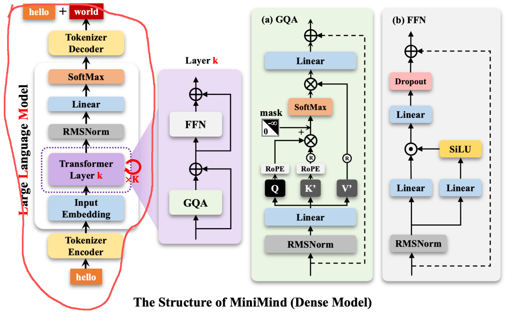


### 2、MoE Model

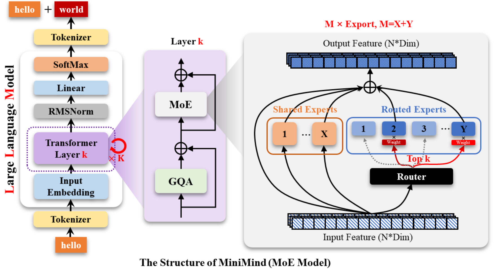


## 二、初始化项目

1、准备Python环境：`uv init` 初始化项目；更新`pyproject.toml`中的`dependencies`；基于`uv sync`一键安装

```python
dependencies = [
    "numpy>=2.3.4",
    "pandas>=2.3.3",
    "torch>=2.9.0",
    "transformers>=4.57.1",
]
```

2、创建dataset、model、trainer初始文件夹及空脚本

```python
$ tree
.
├── dataset
│   └── lm_dataset.py
├── main.py
├── model
│   └── model_minimind.py
├── pyproject.toml
├── README.md
├── trainer
│   ├── trainer_utils.py
│   └── train_pretrain.py
└── uv.lock

4 directories, 8 files
```

3、撰写model_minimind.py：直接复制即可

```python
from transformers import PretrainedConfig


class MokioMindConfig(PretrainedConfig):
    model_type = "mokiomind"

    def __init__(
        self,
        dropout: float = 0.0,
        bos_token_id: int = 1,
        eos_token_id: int = 2,
        hidden_act: str = "silu",
        hidden_size: int = 512,
        intermediate_size: int = None,
        max_position_embeddings: int = 32768,
        num_attention_heads: int = 8,
        num_hidden_layers: int = 8,
        num_key_value_heads: int = 2,
        vocab_size: int = 6400,
        rms_norm_eps: float = 1e-05,
        rope_theta: int = 1000000,
        inference_rope_scaling: bool = False,
        flash_attention: bool = True,
        
        ############ MoE ############
        use_moe:bool=False,
        num_experts_per_tok:int=2,
        n_routed_experts:int=4,
        n_shared_experts:int=1,
        scoring_func:str='softmax',
        aux_loss_alpha:float=0.1,
        seq_aux:bool=True,
        norm_topk_prob:bool=True,
        **kwargs,
    ):
        super().__init__(**kwargs)

        self.dropout = dropout
        self.bos_token_id = bos_token_id
        self.eos_token_id = eos_token_id
        self.hidden_act = hidden_act
        self.hidden_size = hidden_size
        self.intermediate_size = intermediate_size
        self.max_position_embeddings = max_position_embeddings
        self.num_attention_heads = num_attention_heads
        self.num_hidden_layers = num_hidden_layers
        self.num_key_value_heads = num_key_value_heads
        self.vocab_size = vocab_size
        self.rms_norm_eps = rms_norm_eps
        self.rope_theta = rope_theta
        self.inference_rope_scaling = inference_rope_scaling
        self.flash_attention = flash_attention
        self.use_moe=use_moe
        self.num_experts_per_tok=num_experts_per_tok
        self.n_routed_experts=n_routed_experts
        self.n_shared_experts=n_shared_experts
        self.seq_aux=seq_aux
        self.norm_topk_prob=norm_topk_prob
        self.aux_loss_alpha=aux_loss_alpha
        self.scoring_func=scoring_func

        self.rope_scaling = (
            {
                "beta_fast": 4,
                "beta_slow": 1,
                "factor": 4,
                "original_max_position_embeddings": 2048,
                "type": "yarn",
            }
            if self.inference_rope_scaling
            else None
        )
```


## 三、RMSNorm

### 1、理论

>RMSNorm 是一个轻量、高效、稳定的归一化方法：它不管平均值，只通过“整体大小”的均方根调整数值幅度。

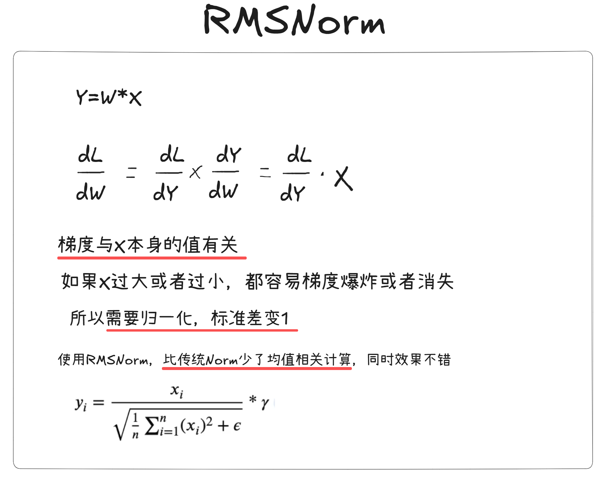

RMSNorm（Root Mean Square Layer Normalization）是一种比 LayerNorm（层归一化）更简单、更高效的归一化方法。
 **它不减均值，只除以“均方根（RMS）”。**

公式如下：
$$
\text{RMSNorm}(x) = \frac{x}{\text{RMS}(x)} \cdot g
$$
其中：
$$
\text{RMS}(x)=\sqrt{\frac{1}{n} \sum_{i=1}^n x_i^2 + \epsilon}
$$
抽象解释：

```python
1、假设有一群学生的“成绩”组成一个向量
x = [小明的成绩，小红的成绩，小刚的成绩，...]
我们想让整个“班级表现”更稳定，不会有特别大的数影响计算，这时候要做归一化（Normalization）。

2、LayerNorm 的做法（传统）
LayerNorm 会：
1）求平均成绩
2）每个人的成绩都减去平均值
3）再除以标准差
这相当于：把平均水平抹掉，让大家更“公平”

3、RMSNorm 的做法（更简单）
RMSNorm 不减平均分！它做的更像是：“看看大家整体成绩有多大，然后都按比例缩小一下”。

数学上就是把每个数都除以整个向量的“均方根”：
1）RMS 越大 → 表示整体偏高 → 自动缩小
2）RMS 越小 → 表示整体偏低 → 自动放大
就像：如果全班成绩都偏高，就整体压缩一下；如果成绩都偏低，就整体拉高一下。

这样做更快、更稳定，也更适合大模型训练。
```

为什么不减均值会更好？

- 在自注意力 Transformer 输入里，向量的均值不一定提供有意义信息，反而有时会引入噪声。
   所以 RMSNorm 直接忽略掉均值，只调节“整体大小（幅度）”，提高速度和稳定性

示例代码：与 LLaMA/Qwen 的版本一致

1. 明确 RMSNorm 的目标：只调节幅度，不做均值中心化
2. 确认归一化维度：hidden_size
3. 实现 RMS：平方 → 求均值 → 开根号
4. 除以 RMS 得到归一化结果
5. 再乘上可训练的缩放参数 weight
6. 完整实现仅需几行，非常高效

```python
import torch
import torch.nn as nn

class RMSNorm(nn.Module):
    def __init__(self, dim, eps=1e-8):
        """
        dim: 输入向量的维度（例如 hidden_size）
        eps: 为了防止除以 0 的极小数
        """
        super().__init__()
        
        # 可训练的缩放系数 g，形状和 dim 一样
        self.weight = nn.Parameter(torch.ones(dim))
        self.eps = eps

    def forward(self, x):
        # x 的形状通常为 [batch, seq, hidden_dim]

        # 1. 计算均方根 RMS
        #   x.pow(2).mean(-1, keepdim=True) 等价于：对最后一个维度求平均
        rms = torch.sqrt(x.pow(2).mean(-1, keepdim=True) + self.eps)

        # 2. 将 x 除以 RMS，完成归一化
        output = x / rms

        # 3. 再乘上可训练参数 weight（逐元素缩放）
        return output * self.weight


# ---------------------------
# 测试一下
# ---------------------------
if __name__ == "__main__":
    norm = RMSNorm(4)
    x = torch.tensor([[1.0, 2.0, 3.0, 4.0]])
    print(norm(x))

```


### 2、代码

先了解几个torch方法：

```python
import torch

# rsqrt方法：计算每个元素的平方根的倒数
t = torch.tensor([1, 4, 9, 16])
print(torch.rsqrt(t))  # tensor([1.0000, 0.5000, 0.3333, 0.2500])

# ones方法：生成一个全为1的数组
t1 = torch.ones(3, 4)
print(t1)  # tensor([[1., 1., 1., 1.],[1., 1., 1., 1.],[1., 1., 1., 1.]])
```


针对RMSNorm，先撰写大纲，然后一点点补充：

- 集成nn.Module类
- init初始化
- _norm
- forward

也就是在`model/model_minimind.py`下加入：

```python
import torch
import torch.nn as nn

class RMSNorm(torch.nn.Module):
    """
    RMSNorm：仅归一化均方根，不减均值；参数量更小，数值更稳
    公式：y = w * x / sqrt(mean(x^2) + eps)
    """
    def __init__(self, dim: int, eps: float = 1e-5):
        super().__init__()
        self.eps = eps
        self.weight = nn.Parameter(torch.ones(dim))  # 可学习的缩放参数 γ

    def _norm(self, x):
        # 在最后一维做 RMS 归一化
        return x * torch.rsqrt(x.pow(2).mean(-1, keepdim=True) + self.eps)

    def forward(self, x):
        # 用权重缩放，保持 dtype 与输入一致
        return self.weight * self._norm(x.float()).type_as(x)
```


## 四、RoPE&YaRN

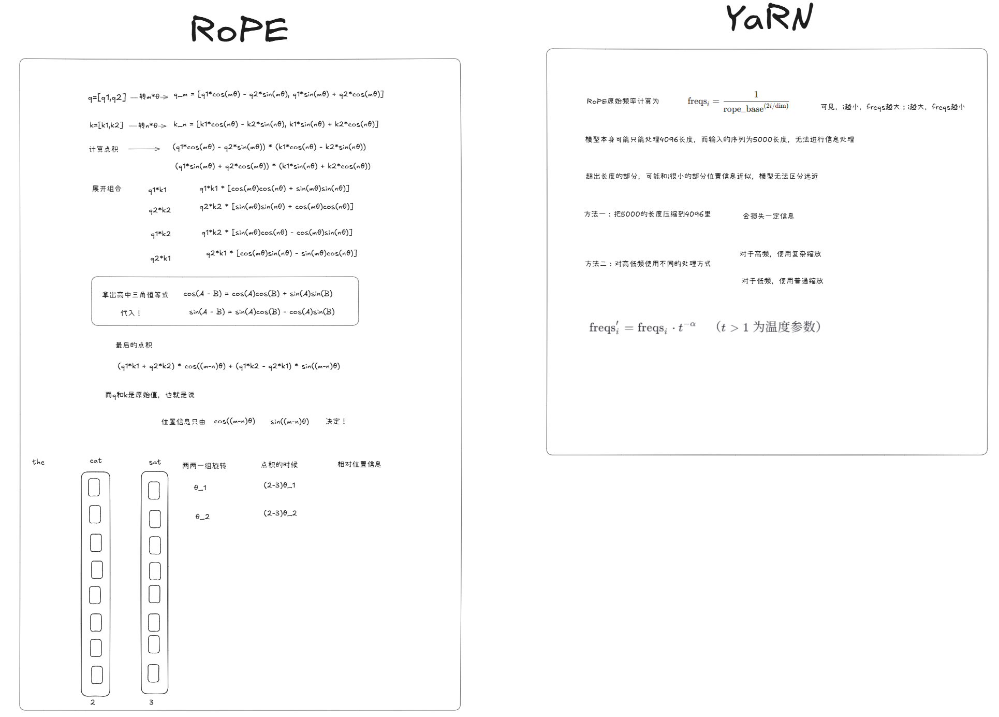

### 1、理论

超简总结：

| 方法     | 原理                 | 优点             | 缺点           |
| -------- | -------------------- | ---------------- | -------------- |
| 绝对位置 | 给每个位置固定向量   | 简单             | 不支持长序列   |
| 相对位置 | 表达 token 距离      | 灵活             | 实现较复杂     |
| RoPE     | 用旋转角度表示位置差 | 快、准、强       | 长序列旋转太快 |
| YaRN     | 缓和 RoPE 的角度增长 | 适用于超长上下文 | 需要额外计算   |

#### 1）位置编码

Transformer 的 Attention 本身 **不理解顺序**（不像 RNN，有天然的时间序列结构）。

因此我们必须告诉模型：第 1 个词、第 2 个词……之间是有顺序关系的！如“人咬狗”与“狗咬人”，顺序变了语义就变了。

**位置编码（Position Encoding）就是给每个 token 一个“位置信号”。**

位置编码有分为两种：

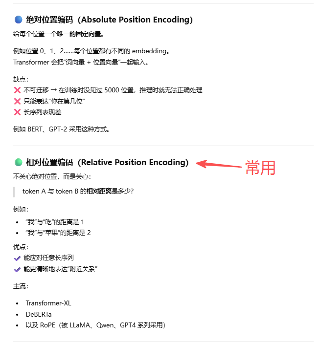

#### 2）RoPE 

RoPE — Rotary Position Embedding（旋转位置编码），是 **基于复数相位旋转**的相对位置编码。

核心思想：

> 把 Query 和 Key 看成二维坐标，把它们绕原点旋转不同角度
>  角度 ∝ 位置 index

数学形式是旋转矩阵：
$$
\text{RoPE}(x) = R(\theta \cdot \text{pos}) \cdot x
$$
优点：

- ✔ 自然支持**相对位置**
- ✔ 不需要额外参数
- ✔ 计算高效
- ✔ 大模型（LLaMA、GPT-J、Qwen）主流方案

缺点：

- ❌ 长上下文能力有限（角度增长太快，会发生“转多圈 → 信息混乱”）

因此大家提出了长上下文增强方法，比如：YaRN


#### 3）YaRN

YaRN — 扩展 RoPE 范围的改进（用于超长上下文），YaRN（Yarn: Efficient Long-Context Scaling for RoPE）主要思想：

> 调整旋转角度的增长速度，使得在长序列时不“转晕”。

更具体：

YaRN = 缩放 RoPE 的角度 (θ)

RoPE 的角度随位置线性增长：
$$
\theta_i = \frac{1}{10000^{2i/d}}
$$
YaRN 在 RoPE 之前加一个 scaling：
$$
\theta_i' = f(\theta_i, \text{位置})
$$
YaRN 的 scaling 原理可以概括为：

- 🚀 **前半段位置：保持 RoPE 精度**
- 🧘 **后半段位置：让旋转变慢，避免失真**

结果：

- ✔ 实现 *非常长上下文*（128k、1M、甚至无限）
- ✔ 不会破坏原模型训练分布
- ✔ 推理高效


#### 4）抽象简述

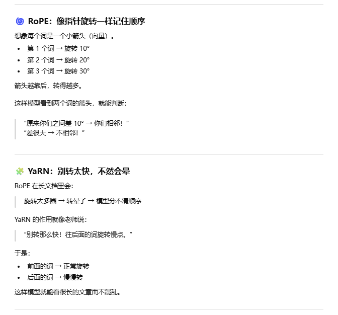


#### 5）示例代码

从 0 实现 RoPE & YaRN 的思路：

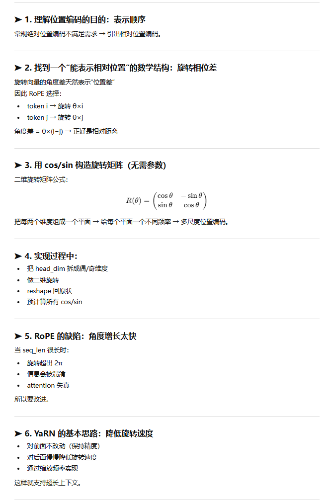

------

RoPE示例代码：

```python
import torch
import math

def apply_rope(x, rope_freqs):
    """
    x: [batch, seq, heads, head_dim]
    rope_freqs: 预计算好的 cos/sin 频率
    """

    # 分成偶数维与奇数维
    x1 = x[..., ::2]   # even 维
    x2 = x[..., 1::2]  # odd 维

    cos, sin = rope_freqs

    # RoPE 核心公式：
    # (x1, x2) 旋转成 (x1*cos - x2*sin, x1*sin + x2*cos)
    x_rotated = torch.stack(
        [x1 * cos - x2 * sin,
         x1 * sin + x2 * cos],
        dim=-1
    )

    # 把最后的 [head_dim/2, 2] reshape 回原维度
    return x_rotated.flatten(-2, -1)


def build_rope_freqs(dim, seq_len, base=10000):
    """
    构建 RoPE 的 cos/sin 表
    dim: head_dim
    seq_len: 最大序列长度
    """
    half_dim = dim // 2
    # 每一维的频率缩放 (Theta)
    freq = 1.0 / (base ** (torch.arange(0, half_dim) / half_dim))

    # 序列位置
    t = torch.arange(seq_len)

    # 外积得到所有 θ * pos
    freqs = torch.outer(t, freq)

    return torch.cos(freqs), torch.sin(freqs)

```

------

YaRN：对 RoPE 频率进行 scaling

```python
def yarn_scale(freqs, scale=1.0, alpha=1.0):
    """
    YaRN 对 RoPE 的频率 freq 进行缩放：
    freqs: RoPE 的 θ（pos × freq）
    scale: 缩放区间，例如 8、16、32
    alpha: 缩放强度（1~2 常见）
    """
    # 最核心：减少远位置的旋转速度
    return freqs * (scale ** (freqs / freqs.max()) ** alpha)

```

更真实的 YaRN 会分区间缩放，这里给一个更接近论文的版本：

```python
def yarn_rope(freqs, long_factor=4.0, ext_factor=1.0):
    """
    更接近 YaRN 论文：
    - 对低频部分保持不变
    - 对高频部分进行缓和处理（slow down）
    """
    # freqs: [seq_len, dim/2]
    max_freq = freqs.max()

    # 分段缩放：越靠后旋转越慢
    scale = 1 + (long_factor - 1) * (freqs / max_freq) ** ext_factor

    return freqs / scale

```

------

将 YaRN + RoPE 结合在一起

```python
def apply_rope_with_yarn(x, cos, sin, yarn_freqs):
    """
    x: 输入向量
    yarn_freqs: 使用 YaRN 处理后的 freqs
    """
    cos = torch.cos(yarn_freqs)
    sin = torch.sin(yarn_freqs)
    return apply_rope(x, (cos, sin))

```


### 2、代码

首先学习几个torch方法：

```python
import torch

# where方法：根据条件返回两个数组中对应位置的数据
x = torch.tensor([1, 2, 3, 4, 5])
y = torch.tensor([2, 4, 6, 8, 10])
condition = x > 3  # 不符合条件的数据，返回y中对应位置的数据
print(torch.where(condition, x, y))  # tensor([2, 4, 6, 4, 5])

# arrage方法: 生成一个一维数组
t1 = torch.arange(0, 10, 2)  # 0开始，步长为2，到10结束
t2 = torch.arange(5, 0, -1)  # 5开始，步长为-1，到0结束
print(t1, t2)  # tensor([0, 2, 4, 6, 8]) tensor([5, 4, 3, 2, 1])

# outer方法：计算两个数组的乘积
t3 = torch.tensor([1, 2, 3])
t4 = torch.tensor([7, 8, 9])
print(torch.outer(t3, t4))  # tensor([[ 7,  8,  9],[14, 16, 18],[21, 24, 27]])

# cat方法：连接两个数组，可以指定连接的维度(维度的意思为：数组的行或列)，默认为0
t5 = torch.tensor([[1, 2, 3], [4, 5, 6]])
t6 = torch.tensor([[7, 8, 9], [10, 11, 12]])
print(torch.cat((t5, t6), dim=0))  # tensor([[ 1,  2,  3],[ 4,  5,  6],[ 7,  8,  9],[10, 11, 12]])
print(torch.cat((t5, t6), dim=1))  # tensor([[ 1,  2,  3,  7,  8,  9],[ 4,  5,  6, 10, 11, 12]])

# unsqueeze方法：在指定位置插入一个维度为1的维度
t7 = torch.tensor([1, 2, 3])
print(t7.unsqueeze(0))  # tensor([[1, 2, 3]])
print(t7.unsqueeze(1))  # tensor([[1],[2],[3]])
print(t7.unsqueeze(-1))  # tensor([[1],[2],[3]])
```


构思YaRN的大纲：

- 写出RoPE
- 计算corr_dim
- 计算power
- 计算beta
- 计算scale
- 应用scale
- 返回cos和sin，用于应用

然后结合公式敲代码，在`model/model_minimind.py`下加入：

```python
import torch
import torch.nn as nn

import math
from typing import Optional, Tuple, List, Union


def precompute_freqs(
    dim: int,
    end: int = int(32 * 1024),
    rope_base: float = 1e6,
    rope_scaling: Optional[dict] = None,
):
    """
    Precompute the frequencies for the rotary positional embeddings.

    Args:
        dim: The dimension of the embeddings.
        end: The maximum sequence length.
        rope_base: The base of the exponential function.
        rope_scaling: A dictionary containing the scaling parameters for the rotary positional embeddings.

    Returns:
        A tuple of two tensors containing the cosine and sine frequencies.
    """

    freqs = 1.0 / (rope_base ** (torch.arange(0, dim, 2)[: (dim // 2)].float() / dim))

    if rope_scaling is not None:
        original_max, factor, beta_fast, beta_slow = (
            rope_scaling.get("original_max_position_embeddings", 2048),
            rope_scaling.get("factor", 4),
            rope_scaling.get("beta_fast", 4.0),
            rope_scaling.get("beta_slow", 1.0),
        )

        if end / original_max > 1.0:
            corr_dim = next(
                (i for i in range(dim // 2) if 2 * math.pi / freqs[i] > original_max),
                dim // 2,
            )

            power = torch.arange(0, dim // 2, device=freqs.device).float() / max(
                dim // 2 - 1, 1
            )

            beta = beta_slow + (beta_fast - beta_slow) * power

            scale = torch.where(
                torch.arange(dim // 2, device=freqs.device) < corr_dim,
                (beta * factor - beta + 1) / (beta * factor),
                1.0 / factor,
            )

            freqs = freqs * scale

        t = torch.arange(end, device=freqs.device)
        freqs = torch.outer(t, freqs).float()

        freqs_cos = torch.cat([torch.cos(freqs), torch.cos(freqs)], dim=-1)
        freqs_sin = torch.cat([torch.sin(freqs), torch.sin(freqs)], dim=-1)

        return freqs_cos, freqs_sin


def apply_rotary_pos_emb(
    q, k, cos, sin, position_ids=None, unsqueeze_dim=1
) -> Tuple[torch.Tensor, torch.Tensor]:
    def rotate_half(x):
        return torch.cat(
            (-x[..., x.shape[-1] // 2 :], x[..., : x.shape[-1] // 2]), dim=-1
        )

    q_embed = (q * cos.unsqueeze(unsqueeze_dim)) + (
        rotate_half(q) * sin.unsqueeze(unsqueeze_dim)
    )
    k_embed = (k * cos.unsqueeze(unsqueeze_dim)) + (
        rotate_half(k) * sin.unsqueeze(unsqueeze_dim)
    )
    return q_embed, k_embed


def repeat_kv(x: torch.Tensor, n_rep: int) -> torch.Tensor:
    bs, slen, num_key_value_heads, head_dim = x.shape
    if n_rep == 1:
        return x

    return (
        x[:, :, :, None, :]
        .expand(bs, slen, num_key_value_heads, n_rep, head_dim)
        .reshape(bs, slen, num_key_value_heads * n_rep, head_dim)
    )
```


## 五、GQA

🧩 GQA（Grouped Query Attention）小结

- 对 Q 保留所有注意力头
- 对 K/V 进行分组共享
- 节省 50%-90% KV cache
- 推理更快
- 质量几乎不变
- 已成为现代 LLM 的标配结构

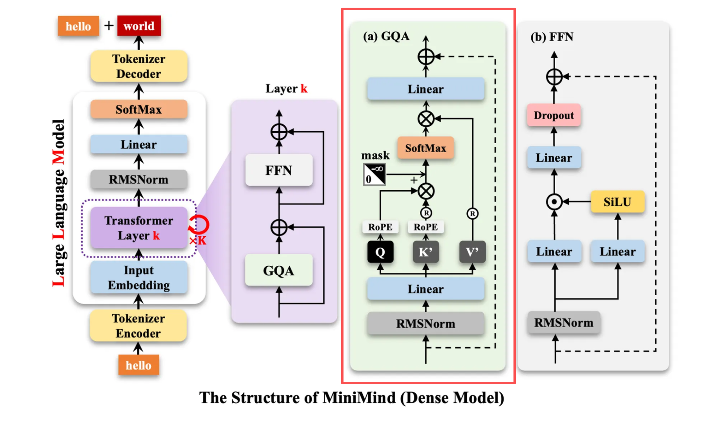

### 1、理论

GQA（Grouped Query Attention）是一种 **介于 Multi-Head Attention（MHA）和 Multi-Query Attention（MQA）之间的折中方案**。
 它最早被 **PaLM、Qwen、LLaMA2 等大模型**采用，用来：

> **减少 KV Cache 存储 & 加快推理速度，同时不损失太多模型质量。**

------

🔵 背景：为什么要 GQA？

在 Transformer 的 Self-Attention 里：

- Q（Query）：每个头独立
- K（Key）和 V（Value）通常每个头也独立 → **KV 很大**

对于 **推理（inference）** 来说：

- KV 需要缓存（KV Cache）来避免重复计算
- 如果有 32 个注意力头，就有 32 份 KV → 非常占显存且慢

于是研究者提出：

------

🔵 MQA：Key/Value 共享（极端版本）

MQA（Multi-Query Attention）做的是：

> 全部注意力头共享 1 份 Key 和 1 份 Value。

优点：
 ✔ KV Cache 从 N 份变成 1 份（巨省显存）
 缺点：
 ❌ 质量下降（表现不如 MHA）

------

🟢 GQA：在 MHA 与 MQA 之间取折中

GQA（Grouped Query Attention）做的是：

> 将注意力头分成若干组
>  每组共享 **一份** Key 和 Value

例如：

- 有 32 个头（head）
- 分成 4 组（group）
- 则每组 8 个头共用一份 KV

------

🧠 数学结构

- **Q**：每个头仍然独立（保持建模能力）
- **K/V**：按组共享（减少存储和计算）

KV cache 数量从 `num_heads` 变成了 `num_groups`：
$$
\text{KV Cache Size}_\text{GQA} = \frac{1}{G} \times \text{MHA Cache Size}
$$
当 G=1 → MQA
 当 G=head_num → MHA
 当 1 < G < heads → **GQA**

------

🟢 GQA 的优点

- ✔ **显著减少 KV cache**（加速推理）
- ✔ **接近 MHA 的质量表现**
- ✔ **实现简单**

因此 LLaMA2、Qwen、PaLM2 等都采用。

------

2️⃣ 用小学生也能听懂的话描述 GQA

想象你在班里做小组作业：

- “查询”（Q）是每个学生自己做的事情（因为每个人想问的问题不同）
- “知识库”（K/V）像老师给的资料本

传统做法（MHA）：每个学生都发一本自己的资料本 → 太浪费纸！

MQA：全班只发一本资料本 → 大家挤来挤去，找资料很慢品质也差。

GQA 的做法非常聪明：班上 32 个学生分成 4 组，每组只有 1 本资料本 → 节省纸本，又不会大家挤来挤去。

所以：

- 每个学生（每个头）保持个性（Q 仍独立）
- 每组共享一本资料本（K/V 按组共享）
- 节省很多成本
- 效果几乎和每人一本一样好

------

示例代码：结构与 LLaMA2/Qwen 的真实实现一致（简化后的版本）

```python
import torch
import torch.nn as nn
import math

class GQA(nn.Module):
    def __init__(self, dim, num_heads, num_kv_groups):
        """
        dim: hidden size
        num_heads: 注意力头数量（Q头数）
        num_kv_groups: KV 的共享组数量，例如 32 头分 4 组，则 group=4
        
        注意：每组共享一份 K、V
        """
        super().__init__()
        
        assert num_heads % num_kv_groups == 0
        self.num_heads = num_heads
        self.num_kv_groups = num_kv_groups
        self.head_dim = dim // num_heads

        # Q 仍然是为每个 head 单独计算
        self.Wq = nn.Linear(dim, dim)
        
        # K/V 按组计算，只生成 num_kv_groups 份
        kv_dim = num_kv_groups * self.head_dim
        self.Wk = nn.Linear(dim, kv_dim)
        self.Wv = nn.Linear(dim, kv_dim)

        self.out = nn.Linear(dim, dim)

    def forward(self, x):
        B, L, D = x.shape

        # -----------------------------
        # 1. 计算 Q、K、V
        # -----------------------------
        q = self.Wq(x)                 # [B, L, dim]
        k = self.Wk(x)                 # [B, L, kv_dim]
        v = self.Wv(x)                 # [B, L, kv_dim]

        # reshape 成多头形式
        q = q.view(B, L, self.num_heads, self.head_dim)         # [B, L, H, d]
        k = k.view(B, L, self.num_kv_groups, self.head_dim)     # [B, L, G, d]
        v = v.view(B, L, self.num_kv_groups, self.head_dim)     # [B, L, G, d]

        # -----------------------------
        # 2. 将 K/V 扩展到对应的 Q 头数
        #    举例：32个Q头，4组KV → 每组重复8次
        # -----------------------------
        repeat_factor = self.num_heads // self.num_kv_groups
        k = k.repeat_interleave(repeat_factor, dim=2)   # [B, L, H, d]
        v = v.repeat_interleave(repeat_factor, dim=2)

        # -----------------------------
        # 3. 标准的 Attention 操作
        # -----------------------------
        att = torch.einsum("blhd,blHd->bh lH", q, k) / math.sqrt(self.head_dim)
        att = torch.softmax(att, dim=-1)
        out = torch.einsum("bh lH,blHd->blhd", att, v)

        # 合并多头
        out = out.reshape(B, L, D)

        return self.out(out)

```

从 0 撰写 GQA 的思路

**① 明确需求：KV cache 太大了，必须缩小**

查询 Q 可以多头独立
 但 K/V 完全没必要给每个头都独立 → 可以合并

**② 选择折中方案：按组共享 K/V**

- 给 Q 保留所有头 → 保持模型表达能力
- 给 K/V 减少头数 → 降低 KV cache

核心思想：

> Q: head = N
>  K/V: head = groups
>  groups << N

**③ 设计维度：**

hidden_dim = 1024
 num_heads = 32
 num_kv_groups = 4

则：

- Q projection 输出：32 heads
- K/V projection 输出：4 heads
- 每组必须平分 → head_dim = 1024 / 32 = 32

**④ 关键操作：repeat K/V**

因为 Q 有 32 个头，K/V 只有 4 个组，所以：

- 每个 K/V 组要重复 8 次（32/4=8）
- 用 `repeat_interleave` 最方便

这一行是 GQA 的灵魂：

```python
k = k.repeat_interleave(repeat_factor, dim=2)
v = v.repeat_interleave(repeat_factor, dim=2)
```

**⑤ 之后就是标准 Attention**

与普通 MHA 一模一样。

**⑥ 输出 reshape 回原向量并通过线性层**

完全标准。


### 2、代码

先了解一些torch方法：

```python
import torch
import torch.nn as nn


# Dropout层：随机将部分神经元输出置零，防止过拟合
dropout_layer = nn.Dropout(p=0.5)  # 0.5 的概率进行 dropout
t1 = torch.Tensor([1, 2, 3, 4, 5])
t2 = dropout_layer(t1)
print(t2)  # tensor([0., 0., 6., 8., 0.])

dropout_layer = nn.Dropout(p=0.1)  # 0.5 的概率进行 dropout
t1 = torch.Tensor([1, 2, 3, 4, 5])
t2 = dropout_layer(t1)
print(t2)  # tensor([1.1111, 2.2222, 3.3333, 4.4444, 0.0000])


# Linear层：全连接层，线性变换，y = xA^T + b
linear_layer = nn.Linear(
    in_features=5, out_features=3, bias=True
)  # 输入维度为 5，输出维度为 3, 有偏置
t1 = torch.Tensor([[1, 2, 3, 4, 5]])
t2 = linear_layer(t1)
print(t2)  # tensor([[1.1818, 1.8421, 2.1359]], grad_fn=<AddmmBackward0>)


# view方法：改变张量的形状，不改变数据
t1 = torch.Tensor([[1, 2, 3, 4, 5, 6]])
t2 = t1.view(2, 3)
print(t2)  # tensor([[1., 2., 3.], [4., 5., 6.]])
print(t2.shape)  # torch.Size([2, 3])


# transpose方法：转置张量，不改变数据
t1 = torch.Tensor([[1, 2, 3], [4, 5, 6]])
t2 = t1.transpose(0, 1)
print(t2)  # tensor([[1, 4], [2, 5], [3, 6]])
print(t2.shape)  # torch.Size([3, 2])


# triu方法：取上三角矩阵，不改变数据。做掩码计算时会使用
t1 = torch.Tensor([[1, 2, 3], [4, 5, 6], [7, 8, 9]])
t2 = t1.triu(1)
print(t2)  # tensor([[0, 2, 3], [0, 0, 6], [0, 0, 0]])
print(t2.shape)  # torch.Size([3, 3])


# reshape方法：改变张量的形状，不改变数据
t1 = torch.Tensor([[1, 2, 3, 4, 5, 6]])
t2 = t1.reshape(2, 3)
print(t2)  # tensor([[1, 2, 3], [4, 5, 6]])
print(t2.shape)  # torch.Size([2, 3])

```


撰写一些工具函数：在`model/model_minimind.py`下加入如下代码

```python
def repeat_kv(x: torch.Tensor, n_rep: int) -> torch.Tensor:
    """
    重复key-value张量以匹配query头数 (用于分组查询注意力GQA)
    等价于torch.repeat_interleave(x, dim=2, repeats=n_rep)，但更高效
    
    在GQA中，key和value的头数少于query，需要重复来匹配
    例如：8个query头，2个kv头，则需要每个kv头重复4次
    
    Args:
        x: kv张量 [batch, seq_len, num_kv_heads, head_dim]
        n_rep: 重复次数
    
    Returns:
        重复后的张量 [batch, seq_len, num_kv_heads * n_rep, head_dim]
    """
    bs, slen, num_key_value_heads, head_dim = x.shape  # 解包获取各维度大小
    if n_rep == 1:
        return x  # 无需重复直接返回
    
    # 高效的重复实现：
    # 1. x[:, :, :, None, :]: 在第4维插入新维度 -> [bs, slen, num_kv_heads, 1, head_dim]
    # 2. .expand(...): 扩展第4维到n_rep -> [bs, slen, num_kv_heads, n_rep, head_dim]
    # 3. .reshape(...): 合并第3、4维 -> [bs, slen, num_kv_heads * n_rep, head_dim]
    return (
        x[:, :, :, None, :].expand(bs, slen, num_key_value_heads, n_rep, head_dim)
        .reshape(bs, slen, num_key_value_heads * n_rep, head_dim)
    )
```


开始编写Attention层的内容：在`model/model_minimind.py`下加入如下代码

```python
import torch
import math
import torch.nn as nn
from typing import Optional, Tuple, List, Union
import torch.nn.functional as F
from transformers.activations import ACT2FN
from transformers import PreTrainedModel, GenerationMixin, PretrainedConfig
from transformers.modeling_outputs import CausalLMOutputWithPast


class Attention(nn.Module):
    """
    多头自注意力机制，支持分组查询注意力(GQA)和Flash Attention优化

    GQA介绍：
    - 传统MHA：query、key、value头数相同
    - GQA：key、value头数少于query头数，通过重复匹配
    - 优点：减少KV cache内存占用，保持性能
    """

    def __init__(self, args: MokioMindConfig):
        super().__init__()

        # 处理GQA：如果没有指定kv头数，则使用与query相同的头数
        # 三元运算符：condition ? value1 : value2
        self.num_key_value_heads = (
            args.num_attention_heads
            if args.num_key_value_heads is None
            else args.num_key_value_heads
        )

        # assert语句：断言检查，如果条件为False则抛出AssertionError
        # 确保query头数能被kv头数整除（GQA的基本要求）
        assert args.num_attention_heads % self.num_key_value_heads == 0

        # 设置注意力头配置
        self.n_local_heads = args.num_attention_heads  # query头数
        self.n_local_kv_heads = self.num_key_value_heads  # key-value头数
        self.n_rep = (
            self.n_local_heads // self.n_local_kv_heads
        )  # 每个kv头需要重复的次数
        self.head_dim = args.hidden_size // args.num_attention_heads  # 每个头的维度

        # 定义线性投影层 (无偏置，节省参数)
        # nn.Linear(in_features, out_features, bias=False)
        self.q_proj = nn.Linear(
            args.hidden_size, args.num_attention_heads * self.head_dim, bias=False
        )  # Query投影
        self.k_proj = nn.Linear(
            args.hidden_size, self.num_key_value_heads * self.head_dim, bias=False
        )  # Key投影
        self.v_proj = nn.Linear(
            args.hidden_size, self.num_key_value_heads * self.head_dim, bias=False
        )  # Value投影
        self.o_proj = nn.Linear(
            args.num_attention_heads * self.head_dim, args.hidden_size, bias=False
        )  # 输出投影

        # Dropout层用于正则化
        self.attn_dropout = nn.Dropout(args.dropout)  # 注意力权重dropout
        self.resid_dropout = nn.Dropout(args.dropout)  # 残差连接dropout
        self.dropout = args.dropout  # 保存dropout率

        # 检查是否支持Flash Attention
        # hasattr(obj, 'attr'): 检查对象是否有指定属性
        # Flash Attention需要PyTorch >= 2.0
        self.flash = (
            hasattr(torch.nn.functional, "scaled_dot_product_attention")
            and args.flash_attn
        )
        # 如果不支持可以打印警告: print("WARNING: using slow attention. Flash Attention requires PyTorch >= 2.0")

    def forward(
        self,
        x: torch.Tensor,
        position_embeddings: Tuple[torch.Tensor, torch.Tensor],  # 修改为接收cos和sin
        past_key_value: Optional[Tuple[torch.Tensor, torch.Tensor]] = None,
        use_cache=False,
        attention_mask: Optional[torch.Tensor] = None,
    ):
        # x: [batch_size, seq_len, hidden]
        bsz, seq_len, _ = x.shape

        # 线性投影为Q,K,V
        # q_proj: hidden -> num_heads * head_dim
        # k_proj/v_proj: hidden -> num_kv_heads * head_dim (GQA情形)
        xq, xk, xv = self.q_proj(x), self.k_proj(x), self.v_proj(x)

        # 将投影结果reshape成多头格式
        # q: [bsz, seq_len, n_local_heads, head_dim]
        # k/v: [bsz, seq_len, n_local_kv_heads, head_dim]
        xq = xq.view(bsz, seq_len, self.n_local_heads, self.head_dim)
        xk = xk.view(bsz, seq_len, self.n_local_kv_heads, self.head_dim)
        xv = xv.view(bsz, seq_len, self.n_local_kv_heads, self.head_dim)

        # position_embeddings是预计算的(cos, sin)，按序列位置切片并应用RoPE
        cos, sin = position_embeddings
        # 只取当前序列长度的前缀（用于inference时从start_pos开始）
        xq, xk = apply_rotary_pos_emb(xq, xk, cos[:seq_len], sin[:seq_len])

        # -------------------- KV cache 处理 --------------------
        # past_key_value: (past_k, past_v) 或 None
        # 当存在past时，将past拼接到当前k,v的时间维度上，便于自回归推理
        if past_key_value is not None:
            # past_key_value[0] 的shape为 [bsz, past_seq_len, n_local_kv_heads, head_dim]
            xk = torch.cat([past_key_value[0], xk], dim=1)
            xv = torch.cat([past_key_value[1], xv], dim=1)

        # 如果需要缓存，返回拼接后的(k,v)，否则past_kv置为None
        past_kv = (xk, xv) if use_cache else None

        # -------------------- GQA: 对KV重复以匹配Q头 --------------------
        # transpose到形状 [bsz, n_heads, seq_len, head_dim] 以便矩阵乘法
        xq = xq.transpose(1, 2)
        # repeat_kv会把k/v的头数从 n_local_kv_heads -> n_local_kv_heads * n_rep (即等于n_local_heads)
        xk = repeat_kv(xk, self.n_rep).transpose(1, 2)
        xv = repeat_kv(xv, self.n_rep).transpose(1, 2)

        # -------------------- Attention计算 --------------------
        # 优先使用PyTorch 2.0+的scaled_dot_product_attention（Flash Attention实现）
        if (
            self.flash
            and seq_len > 1
            and (attention_mask is None or torch.all(attention_mask == 1))
        ):
            # 如果没有显式的attention_mask，直接传None让底层高效实现
            attn_mask = (
                None
                if attention_mask is None
                else attention_mask.view(bsz, 1, 1, -1)
                .expand(bsz, self.n_local_heads, seq_len, -1)
                .bool()
            )
            # F.scaled_dot_product_attention是PyTorch在新版本中提供的高效实现
            output = F.scaled_dot_product_attention(
                xq,
                xk,
                xv,
                attn_mask=attn_mask,
                dropout_p=self.dropout if self.training else 0.0,
                is_causal=True,  # 自回归（因果）注意力
            )
        else:
            # 标准实现：scores = Q @ K^T / sqrt(d)
            scores = (xq @ xk.transpose(-2, -1)) / math.sqrt(self.head_dim)

            # causal mask: 上三角（对角线以上）置为 -inf，防止看到未来信息
            causal_mask = torch.triu(
                torch.full((seq_len, seq_len), float("-inf"), device=scores.device),
                diagonal=1,
            )
            scores = scores + causal_mask.unsqueeze(0).unsqueeze(
                0
            )  # 扩展batch和head维度

            # 如果有attention_mask(0/1)，将其扩展后转为 -1e9 的加性mask（掩掉pad位置）
            if attention_mask is not None:
                extended_attention_mask = attention_mask.unsqueeze(1).unsqueeze(2)
                extended_attention_mask = (1.0 - extended_attention_mask) * -1e9
                scores = scores + extended_attention_mask

            # softmax得到注意力权重
            scores = F.softmax(scores.float(), dim=-1).type_as(xq)
            scores = self.attn_dropout(scores)
            # 加权求和得到输出
            output = scores @ xv

        # 恢复形状并做输出投影 + 残差dropout
        output = output.transpose(1, 2).reshape(
            bsz, seq_len, -1
        )  # [bsz, seq_len, hidden]
        output = self.resid_dropout(self.o_proj(output))
        return output, past_kv

```


## 六、FFN

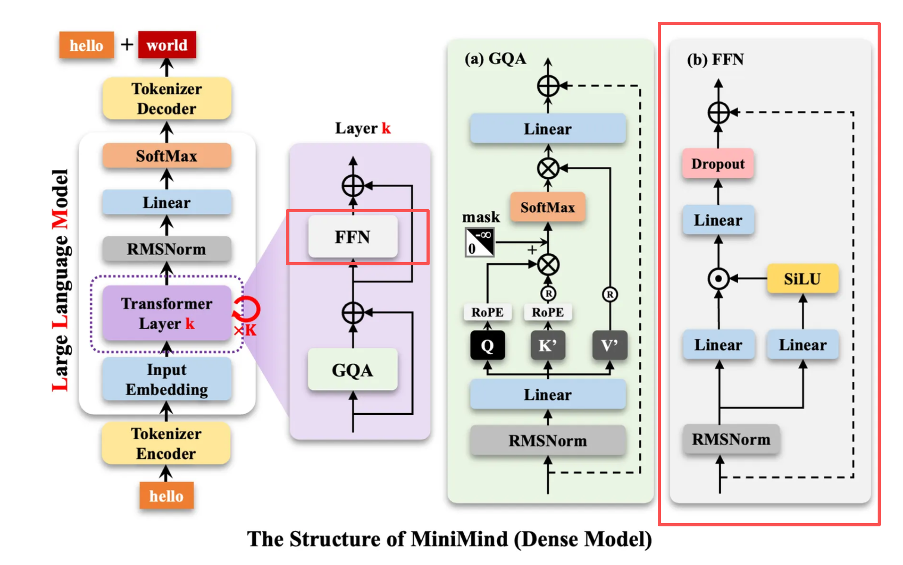

### 1、理论

简要总结：

- FFN 是 Transformer 表达能力的核心
- Attention 决定“看谁”，FFN 决定“怎么理解”
- SiLU / SwiGLU 是为大模型稳定性与性能而生

#### 1）FFN 模块

1️⃣ FFN 在整体架构中的位置

以标准 Transformer Block 为例（LLaMA / Qwen / GPT 都遵循这一范式）：

```python
x
 ├─ Multi-Head Attention
 │
 ├─ Add & Norm
 │
 ├─ FFN  ← 你现在关心的模块
 │
 └─ Add & Norm
```

👉 **Attention 负责“信息交互”**
 👉 **FFN 负责“逐 token 的非线性变换与特征升维”**

> 一个关键点：
>  **FFN 不做 token 之间的交互，只在 feature 维度上操作**

------

2️⃣ FFN 的标准数学形式

以最经典的 Transformer FFN 为例：
$$
\text{FFN}(x) = W_2 \cdot \sigma(W_1 x + b_1) + b_2
$$
其中：

- $$
  $x \in \mathbb{R}^{d_{\text{model}}}$
  $$

  

- $$
  $W_1: d_{\text{model}} \rightarrow d_{\text{ff}}$
  $$

  

- $$
  $W_2: d_{\text{ff}} \rightarrow d_{\text{model}}$
  $$

  

- $$
  $d_{\text{ff}} \approx 4 \times d_{\text{model}}$
  $$

  

**解释：**

- 第一步：**升维（投影到更高维空间）**
- 第二步：**非线性激活**
- 第三步：**降维（映射回模型维度）**

------

3️⃣ 为什么 FFN 必不可少？

从大模型架构角度看：

| 模块      | 主要能力                 |
| --------- | ------------------------ |
| Attention | 建立 token 之间的依赖    |
| FFN       | 提供强大的非线性表达能力 |
| LayerNorm | 稳定训练                 |
| Residual  | 保留梯度流               |

> **没有 FFN 的 Transformer，本质上是一个“线性注意力模型”**

------


#### 2）SiLU（Swish）

1️⃣ SiLU 的定义

SiLU（Sigmoid Linear Unit），也叫 Swish：
$$
\text{SiLU}(x) = x \cdot \sigma(x)
$$
其中：
$$
\sigma(x) = \frac{1}{1 + e^{-x}}
$$

------

2️⃣ 与 ReLU / GELU 的对比

| 激活函数 | 特点              | 问题       |
| -------- | ----------------- | ---------- |
| ReLU     | 简单高效          | 死神经元   |
| GELU     | 平滑，表现好      | 计算略复杂 |
| **SiLU** | 平滑 + 非零负区间 | 稍慢但稳定 |

**SiLU 的优势（工程角度）：**

- 连续可导（对大模型很重要）
- 负区间非零 → 梯度更稳定
- 实证效果好（LLaMA、Qwen 全用）

> **LLaMA / Qwen：FFN = Linear → SiLU → Linear**

------

3️⃣ SiLU 的直觉理解

- 当 x << 0：输出接近 0（但不为 0）
- 当 x >> 0：接近线性（≈ x）
- 自动“门控”信息流（类似 soft gate）

这也是为什么它非常适合 **大规模 FFN**


#### 3）现代大模型中的 FFN 变体

LLaMA 使用的是 **SwiGLU FFN**（非常重要）

SwiGLU 结构：
$$
\text{FFN}(x) = W_2(\text{SiLU}(W_1 x) \odot W_3 x)
$$
结构示意：

```python
          ┌── W1 ── SiLU ─┐
x ──┬─────┤               ├─ element-wise mul ─ W2
    └─────└── W3 ─────────┘
```

**为什么更强？**

- 引入显式 gating（门控）
- 更好的参数利用率
- 在相同参数量下效果更好


#### 4）示例代码

下面的代码 **可以直接运行**，并且**结构与你在 LLaMA / Qwen 中看到的几乎一致**

------

1️⃣ 基础 FFN（Linear → SiLU → Linear）

```python
import torch
import torch.nn as nn
import torch.nn.functional as F

class FFN(nn.Module):
    def __init__(self, d_model, d_ff):
        super().__init__()
        self.fc1 = nn.Linear(d_model, d_ff)
        self.fc2 = nn.Linear(d_ff, d_model)

    def forward(self, x):
        """
        x: (batch, seq_len, d_model)
        """
        x = self.fc1(x)          # 升维
        x = F.silu(x)            # SiLU 激活
        x = self.fc2(x)          # 降维
        return x
```

🧠 代码设计思路

- **完全逐 token 操作**（不关心 seq_len）
- Linear 本质上是对最后一维做映射
- 与 Attention 解耦，便于并行

------

2️⃣ LLaMA 风格的 SwiGLU FFN（推荐重点掌握）

```python
class SwiGLUFFN(nn.Module):
    def __init__(self, d_model, d_ff):
        super().__init__()
        self.w1 = nn.Linear(d_model, d_ff)
        self.w3 = nn.Linear(d_model, d_ff)
        self.w2 = nn.Linear(d_ff, d_model)

    def forward(self, x):
        """
        x: (batch, seq_len, d_model)
        """
        gate = F.silu(self.w1(x))     # 门控分支
        value = self.w3(x)            # 值分支
        x = gate * value              # 元素级乘法
        x = self.w2(x)                # 投影回 d_model
        return x
```

🧠 这是 LLaMA / Qwen FFN 的核心思想

- 两条并行线性投影
- 一条负责 gate，一条负责 value
- 用 SiLU 做软门控

------

3️⃣ 简单测试

```python
if __name__ == "__main__":
    batch, seq_len, d_model = 2, 4, 8
    d_ff = 32

    x = torch.randn(batch, seq_len, d_model)

    ffn = FFN(d_model, d_ff)
    y = ffn(x)

    swiglu = SwiGLUFFN(d_model, d_ff)
    y2 = swiglu(x)

    print(y.shape, y2.shape)
```

输出：

```python
torch.Size([2, 4, 8]) torch.Size([2, 4, 8])
```


### 2、代码

开始编写FFN模块：在`model/model_minimind.py`下加入如下代码

```python
class FeedForward(nn.Module):
    def __init__(self, config: MokioMindConfig):
        super().__init__()
        if config.intermediate_size is None:
            intermediate_size = int(config.hidden_size * 8 / 3)
            config.intermediate_size = 64 * ((intermediate_size + 64 - 1) // 64)
        # SwiGLU类似于Gated Linear Unit变体：act(gate(x)) * up(x)
        # gate_proj: hidden -> intermediate (用于计算gate部分)
        # up_proj: hidden -> intermediate (用于被gate的部分)
        # down_proj: intermediate -> hidden (用于投影回hidden维度)
        self.gate_proj = nn.Linear(
            config.hidden_size, config.intermediate_size, bias=False
        )
        self.down_proj = nn.Linear(
            config.intermediate_size, config.hidden_size, bias=False
        )
        self.up_proj = nn.Linear(
            config.hidden_size, config.intermediate_size, bias=False
        )
        self.dropout = nn.Dropout(config.dropout)
        # ACT2FN是transformers里激活函数的映射表，支持'silu','gelu'等
        self.act_fn = ACT2FN[config.hidden_act]

    def forward(self, x):
        """
        forward实现使用SwiGLU风格的门控激活：
        output = down_proj( act_fn(gate_proj(x)) * up_proj(x) )
        并在输出前应用dropout
        """
        gated = self.act_fn(self.gate_proj(x)) * self.up_proj(x)
        return self.dropout(self.down_proj(gated))

```


## 七、Block

组装Transformer：

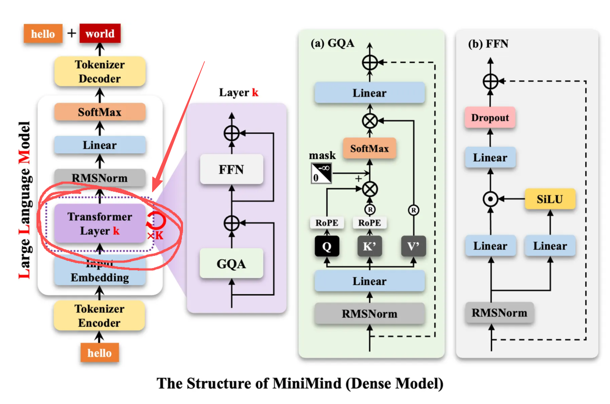

在`model/model_minimind.py`下加入如下代码

```python
class MiniMindBlock(nn.Module):
    def __init__(self, layer_id: int, config: MokioMindConfig):
        super().__init__()
        self.num_attention_heads = config.num_attention_heads
        self.hidden_size = config.hidden_size
        self.head_dim = config.hidden_size // config.num_attention_heads
        self.self_attn = Attention(config)

        self.layer_id = layer_id
        self.input_layernorm = RMSNorm(config.hidden_size, eps=config.rms_norm_eps)
        self.post_attention_layernorm = RMSNorm(
            config.hidden_size, eps=config.rms_norm_eps
        )
        # self.mlp = FeedForward(config) if not config.use_moe else MOEFeedForward(config)
        self.mlp = FeedForward(config)

    def forward(
        self,
        hidden_states,
        position_embeddings,
        past_key_value=None,
        use_cache=False,
        attention_mask=None,
    ):
        # 残差连接模式：先做LayerNorm -> Attention -> 残差相加 -> LayerNorm -> FFN -> 残差相加
        # 保存残差以供后续相加
        residual = hidden_states

        # 注意力子层：输入先归一化（RMSNorm），返回hidden_states和present_key_value（用于cache）
        hidden_states, present_key_value = self.self_attn(
            self.input_layernorm(hidden_states),  # pre-norm
            position_embeddings,
            past_key_value,
            use_cache,
            attention_mask,
        )

        # 注意力输出与残差相加
        hidden_states = hidden_states + residual

        # 前馈子层（post-attention layernorm）并相加
        hidden_states = hidden_states + self.mlp(
            self.post_attention_layernorm(hidden_states)
        )
        return hidden_states, present_key_value
```


## 八、Model

将前述所有内容整合起来，编写成完整的模型：在`model/model_minimind.py`下加入如下代码

```python
class MokioMindModel(nn.Module):
    def __init__(self, config: MokioMindConfig):
        super().__init__()
        self.config = config
        self.vocab_size, self.num_hidden_layers = (
            config.vocab_size,
            config.num_hidden_layers,
        )
        self.embed_tokens = nn.Embedding(config.vocab_size, config.hidden_size)
        self.dropout = nn.Dropout(config.dropout)
        self.layers = nn.ModuleList(
            [MiniMindBlock(l, config) for l in range(self.num_hidden_layers)]
        )
        self.norm = RMSNorm(config.hidden_size, eps=config.rms_norm_eps)

        freqs_cos, freqs_sin = precompute_freqs(
            dim=config.hidden_size // config.num_attention_heads,
            end=config.max_position_embeddings,
            rope_base=config.rope_theta,
            rope_scaling=config.rope_scaling,
        )
        self.register_buffer("freqs_cos", freqs_cos, persistent=False)
        self.register_buffer("freqs_sin", freqs_sin, persistent=False)

    def forward(
        self,
        input_ids: Optional[torch.Tensor] = None,
        attention_mask: Optional[torch.Tensor] = None,
        past_key_values: Optional[List[Tuple[torch.Tensor, torch.Tensor]]] = None,
        use_cache: bool = False,
        **kwargs,
    ):
        # input_ids: [bsz, seq_len]
        batch_size, seq_length = input_ids.shape

        if hasattr(past_key_values, "layers"):
            past_key_values = None

        past_key_values = past_key_values or [None] * len(self.layers)

        # 计算start_pos：如果存在past，则start_pos为已有past序列长度
        start_pos = (
            past_key_values[0][0].shape[1] if past_key_values[0] is not None else 0
        )

        # Embedding + dropout
        hidden_states = self.dropout(
            self.embed_tokens(input_ids)
        )  # [bsz, seq_len, hidden]

        position_embeddings = (
            self.freqs_cos[start_pos : start_pos + seq_length],
            self.freqs_sin[start_pos : start_pos + seq_length],
        )
        presents = []
        for layer_idx, (layer, past_key_value) in enumerate(
            zip(self.layers, past_key_values)
        ):
            hidden_states, present = layer(
                hidden_states,
                position_embeddings,
                past_key_value=past_key_value,
                use_cache=use_cache,
                attention_mask=attention_mask,
            )
            presents.append(present)

        hidden_states = self.norm(hidden_states)

        return hidden_states, presents

        # # 如果使用MoE，收集每层的aux_loss并求和返回以便训练使用
        # aux_loss = sum(
        #     layer.mlp.aux_loss
        #     for layer in self.layers
        #     if isinstance(layer.mlp, MOEFeedForward)
        # )

        # return hidden_states, presents, aux_loss

```


## 九、CausalLM

集成Huggingface的两个库，建立Huggingface风格的Model：在`model/model_minimind.py`下加入如下代码

```python
class MokioMindForCausalLM(PreTrainedModel, GenerationMixin):
    config_class = MokioMindConfig

    def __init__(self, config: MokioMindConfig):
        super().__init__(config)
        self.model = MokioMindModel(config)
        self.lm_head = nn.Linear(config.hidden_size, config.vocab_size, bias=False)
        self.model.embed_tokens.weight = self.lm_head.weight

    def forward(
        self,
        input_ids: Optional[torch.Tensor] = None,
        attention_mask: Optional[torch.Tensor] = None,
        past_key_values: Optional[List[Tuple[torch.Tensor, torch.Tensor]]] = None,
        use_cache: bool = False,
        logits_to_keep: Union[int, torch.Tensor] = 0,
        **args,
    ):
        h, past_kvs,aux_loss = self.model(
            input_ids=input_ids,
            attention_mask=attention_mask,
            past_key_values=past_key_values,
            use_cache=use_cache,
            **args,
        )

        slice_indices = (
            slice(-logits_to_keep, None)
            if isinstance(logits_to_keep, int)
            else logits_to_keep
        )
        logits = self.lm_head(h[:, slice_indices, :])

        return CausalLMOutputWithPast(
            logits=logits,
            past_key_values=past_kvs,
            hidden_states=h,
        )
```


## 十、回顾整个过程

大佬原文：

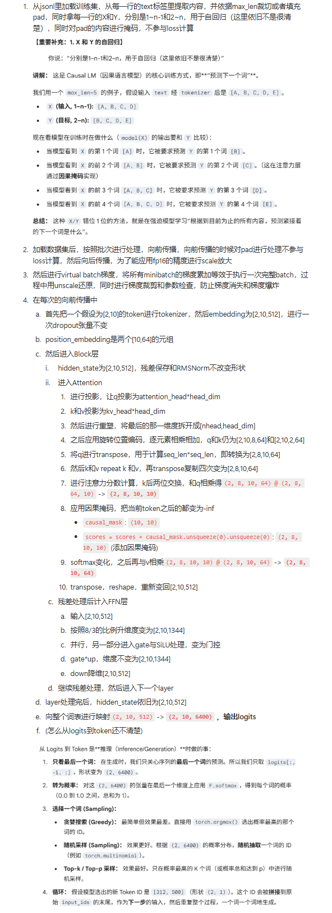


## 十一、Dataset

### 1、理论

了解jsonl格式：略

自回归：略

损失掩码：略


### 2、代码

在`dataset/lm_dataset.py`下加入：

```python
import json

from torch.utils.data import Dataset
import torch
import os

os.environ["TOKENIZERS_PARALLELISM"] = "false"


class PretrainDataset(Dataset):
    def __init__(self, data_path, tokenizer, max_length=512):
        super().__init__()
        self.tokenizer = tokenizer
        self.max_length = max_length
        self.samples = self.load_data(data_path)

    def load_data(self, path):
        samples = []
        with open(path, "r", encoding="utf-8") as f:
            for line_num, line in enumerate(f, 1):
                # 提取每一行内容放到sample
                data = json.loads(line.strip())
                samples.append(data)
        return samples

    def __len__(self):
        return len(self.samples)

    def __getitem__(self, index):
        sample = self.samples[index]
        # 用tokenizer进行编码
        # 超过max_length的截断，不到的填充
        encoding = self.tokenizer(
            str(sample["text"]),
            max_length=self.max_length,
            padding="max_length",
            truncation=True,
            return_tensors="pt",
        )

        input_ids = encoding.input_ids.squeeze()
        # 忽略padding产生的Y
        loss_mask = input_ids != self.tokenizer.pad_token_id
        # 第一个到倒数第二个token
        X = torch.tensor(input_ids[:-1], dtype=torch.long)
        # 第二个到最后一个token
        Y = torch.tensor(input_ids[1:], dtype=torch.long)
        loss_mask = torch.tensor(loss_mask[1:], dtype=torch.long)
        return X, Y, loss_mask
```


## 十二、Pretrain

### 1、理论

动态学习：动态学习率等，略。

梯度累计：显存有限，无法大的batch加载，用小的batch累计。


### 2、代码

在trainer/trainer_utils.py中写入一些训练工具：

```python
import math
import os
import random

import numpy as np
import torch
import torch.distributed as dist
from torch.utils.data import Sampler


# 检查是否是主进程
def is_main_process():
    return not dist.is_initialized() or dist.get_rank() == 0


# 日志
def Logger(content):
    if is_main_process():
        print(content)


# 动态学习率计算
def get_lr(current_step, total_steps, lr):
    return lr / 10 + 0.5 * lr * (1 + math.cos(math.pi * current_step / total_steps))


# 初始化分布式
def init_distributed_mode():
    if int(os.environ.get("RANK", -1)) == -1:
        return 0  # 非DDP模式

    dist.init_process_group(backend="nccl")
    local_rank = int(os.environ["LOCAL_RANK"])
    torch.cuda.set_device(local_rank)
    return local_rank


# 设置种子
def setup_seed(seed: int):
    random.seed(seed)
    np.random.seed(seed)
    torch.manual_seed(seed)
    torch.cuda.manual_seed(seed)
    torch.cuda.manual_seed_all(seed)
    torch.backends.cudnn.deterministic = True
    torch.backends.cudnn.benchmark = False


# 设置检查点
def lm_checkpoint(
    lm_config,
    weight="full_sft",
    model=None,
    optimizer=None,
    epoch=0,
    step=0,
    wandb=None,
    save_dir="checkpoints",
    **kwargs,
):
    os.makedirs(save_dir, exist_ok=True)

    moe_path = "_moe" if hasattr(lm_config, "use_moe") and lm_config.use_moe else ""
    ckp_path = f"{save_dir}/{weight}_{lm_config.hidden_size}{moe_path}.pth"
    resume_path = f"{save_dir}/{weight}_{lm_config.hidden_size}{moe_path}_resume.pth"

    if model is not None:
        from torch.nn.parallel import DistributedDataParallel

        if isinstance(model, DistributedDataParallel):
            state_dict = model.module.state_dict()
        else:
            state_dict = model.state_dict()

        ckp_tmp = ckp_path + ".tmp"
        torch.save({k: v.half() for k, v in state_dict.items()}, ckp_tmp)
        os.replace(ckp_tmp, ckp_path)

        wandb_id = None
        if wandb:
            if hasattr(wandb, "get_run"):
                run = wandb.get_run()
                wandb_id = getattr(run, "id", None) if run else None
            else:
                wandb_id = getattr(wandb, "id", None)

        resume_data = {
            "model": state_dict,
            "optimizer": optimizer.state_dict(),
            "epoch": epoch,
            "step": step,
            "world_size": dist.get_world_size() if dist.is_initialized() else 1,
            "wandb_id": wandb_id,
        }

        for key, value in kwargs.items():
            if value is not None:
                if hasattr(value, "state_dict"):
                    if isinstance(value, DistributedDataParallel):
                        resume_data[key] = value.module.state_dict()
                    else:
                        resume_data[key] = value.state_dict()
                else:
                    resume_data[key] = value

        resume_tmp = resume_path + ".tmp"
        torch.save(resume_data, resume_tmp)
        os.replace(resume_tmp, resume_path)

    else:  # 加载模式
        if os.path.exists(resume_path):
            ckp_data = torch.load(resume_path, map_location="cpu")
            saved_ws = ckp_data.get("world_size", 1)
            current_ws = dist.get_world_size() if dist.is_initialized() else 1

            if saved_ws != current_ws:
                ckp_data["step"] = ckp_data["step"] * saved_ws // current_ws
                Logger(
                    f"GPU数量变化({saved_ws}→{current_ws})，step已自动转换为{ckp_data['step']}"
                )

            return ckp_data
        return None


# 初始化模型
def init_model(
    lm_config,
    from_weight="pretrain",
    tokenizer_path=None,
    save_dir="out",
    device="cuda",
):
    from transformers import AutoTokenizer

    from model.model_minimind import MokioMindForCausalLM

    # 如果没有指定 tokenizer_path，使用项目根目录下的 model 文件夹
    if tokenizer_path is None:
        # 获取当前文件所在目录的父目录（项目根目录）
        current_dir = os.path.dirname(os.path.abspath(__file__))
        project_root = os.path.dirname(current_dir)
        tokenizer_path = os.path.join(project_root, "model")

    tokenizer = AutoTokenizer.from_pretrained(tokenizer_path)

    model = MokioMindForCausalLM(lm_config)

    if from_weight != "none":
        moe_suffix = (
            "_moe" if hasattr(lm_config, "use_moe") and lm_config.use_moe else ""
        )
        weight_path = (
            f"{save_dir}/{from_weight}_{lm_config.hidden_size}{moe_suffix}.pth"
        )

        weights = torch.load(weight_path, map_location=device)

        model.load_state_dict(weights, strict=False)

    total_params = sum(p.numel() for p in model.parameters() if p.requires_grad)
    Logger(f"所加载Model可训练参数：{total_params / 1e6:.3f} 百万")

    return model.to(device), tokenizer


class SkipBatchSampler(Sampler):
    def __init__(self, sampler, batch_size, skip_batches=0):
        self.sampler = sampler  #
        self.batch_size = batch_size
        self.skip_batches = skip_batches

    def __iter__(self):
        batch = []  # 当前批次
        skipped = 0  # 已跳过的批次数

        for idx in self.sampler:
            batch.append(idx)  # 添加样本到当前批次

            if len(batch) == self.batch_size:
                if skipped < self.skip_batches:
                    skipped += 1  # 增加跳过计数
                    batch = []  # 清空批次，不返回
                    continue  # 跳过这个批次

                yield batch
                batch = []  # 重置批次

        if len(batch) > 0 and skipped >= self.skip_batches:
            yield batch

    def __len__(self):
        total_batches = (len(self.sampler) + self.batch_size - 1) // self.batch_size

        return max(0, total_batches - self.skip_batches)

```

在trainer/train_pretrain.py中写入一些训练代码：

```python
import os
import sys

__package__ = "trainer"
sys.path.append(os.path.abspath(os.path.join(os.path.dirname(__file__), "..")))

import argparse  # 命令行参数解析
import time  # 时间统计
import warnings  # 警告控制
from contextlib import nullcontext  # 上下文管理器

import torch
import torch.distributed as dist  # 分布式训练支持
from torch import nn, optim  # 优化器和神经网络模块
from torch.nn.parallel import DistributedDataParallel  # 分布式数据并行
from torch.utils.data import DataLoader, DistributedSampler  # 数据加载器

from dataset.lm_dataset import PretrainDataset
from model.model_minimind import MokioMindConfig
from trainer.trainer_utils import (  # 训练工具函数
    Logger,
    SkipBatchSampler,
    get_lr,
    init_distributed_mode,
    init_model,
    is_main_process,
    lm_checkpoint,
    setup_seed,
)

# 忽略警告信息，保持输出清洁
warnings.filterwarnings("ignore")


def train_epoch(epoch, loader, iters, start_step=0, wandb=None):
    loss_fct = nn.CrossEntropyLoss(reduction="none")
    start_time = time.time()  # 记录开始时间

    # 遍历数据批次
    for step, (X, Y, loss_mask) in enumerate(loader, start=start_step + 1):
        X = X.to(args.device)
        Y = Y.to(args.device)
        loss_mask = loss_mask.to(args.device)

        lr = get_lr(epoch * iters + step, args.epochs * iters, args.learning_rate)

        for param_group in optimizer.param_groups:
            param_group["lr"] = lr

        with autocast_ctx:
            # 前向传播
            res = model(X)

            loss = loss_fct(
                res.logits.view(-1, res.logits.size(-1)),  # [batch*seq, vocab_size]
                Y.view(-1),  # [batch*seq]
            ).view(Y.size())  # 恢复为 [batch_size, seq_len]

            loss = (loss * loss_mask).sum() / loss_mask.sum()

            loss += res.aux_loss

            loss = loss / args.accumulation_steps

        scaler.scale(loss).backward()

        if (step + 1) % args.accumulation_steps == 0:
            # scaler.unscale_(): 还原梯度的真实值
            scaler.unscale_(optimizer)

            torch.nn.utils.clip_grad_norm_(model.parameters(), args.grad_clip)

            # 📚 优化器更新知识点
            # scaler.step(): 执行参数更新
            # scaler.update(): 更新scaler的缩放因子
            scaler.step(optimizer)
            scaler.update()

            optimizer.zero_grad(set_to_none=True)

        if step % args.log_interval == 0 or step == iters - 1:
            spend_time = time.time() - start_time
            current_loss = loss.item() * args.accumulation_steps  # 恢复真实损失值
            current_lr = optimizer.param_groups[-1]["lr"]  # 当前学习率

            eta_min = spend_time / (step + 1) * iters // 60 - spend_time // 60

            Logger(
                f"Epoch:[{epoch + 1}/{args.epochs}]({step}/{iters}) loss:{current_loss:.6f} lr:{current_lr:.12f} epoch_Time:{eta_min}min:"
            )

            # 记录到实验跟踪系统
            if wandb:
                wandb.log(
                    {"loss": current_loss, "lr": current_lr, "epoch_Time": eta_min}
                )

        if (step % args.save_interval == 0 or step == iters - 1) and is_main_process():
            model.eval()  # 切换到评估模式

            # 构建保存路径
            moe_suffix = (
                "_moe" if hasattr(lm_config, "use_moe") and lm_config.use_moe else ""
            )
            ckp = f"{args.save_dir}/{args.save_weight}_{lm_config.hidden_size}{moe_suffix}.pth"

            # 📚 分布式模型保存知识点
            # DDP模型需要通过.module访问真正的模型
            if isinstance(model, torch.nn.parallel.DistributedDataParallel):
                state_dict = model.module.state_dict()
            else:
                state_dict = model.state_dict()

            # 📚 半精度保存知识点
            # 将float32参数转为float16，减少存储空间
            state_dict = {k: v.half() for k, v in state_dict.items()}
            torch.save(state_dict, ckp)

            # 保存完整训练状态
            lm_checkpoint(
                lm_config,
                weight=args.save_weight,
                model=model,
                optimizer=optimizer,
                scaler=scaler,
                epoch=epoch,
                step=step,
                wandb=wandb,
                save_dir="checkpoints",
            )

            model.train()  # 恢复训练模式


if __name__ == "__main__":
    parser = argparse.ArgumentParser(description="MiniMind Pretraining")

    # ========== 基础训练参数 ==========
    parser.add_argument("--save_dir", type=str, default="out", help="模型保存目录")
    parser.add_argument(
        "--save_weight", default="pretrain", type=str, help="保存权重的前缀名"
    )
    parser.add_argument(
        "--epochs", type=int, default=1, help="训练轮数（建议1轮zero或2-6轮充分训练）"
    )
    parser.add_argument("--batch_size", type=int, default=32, help="batch size")
    parser.add_argument("--learning_rate", type=float, default=5e-4, help="初始学习率")

    # ========== 硬件和性能参数 ==========
    parser.add_argument(
        "--device",
        type=str,
        default="cuda:0" if torch.cuda.is_available() else "cpu",
        help="训练设备",
    )
    parser.add_argument("--dtype", type=str, default="bfloat16", help="混合精度类型")
    parser.add_argument("--num_workers", type=int, default=1, help="数据加载线程数")

    # ========== 训练策略参数 ==========
    parser.add_argument(
        "--accumulation_steps", type=int, default=8, help="梯度累积步数"
    )
    parser.add_argument("--grad_clip", type=float, default=1.0, help="梯度裁剪阈值")
    parser.add_argument("--log_interval", type=int, default=100, help="日志打印间隔")
    parser.add_argument("--save_interval", type=int, default=100, help="模型保存间隔")

    # ========== 模型架构参数 ==========
    parser.add_argument("--hidden_size", default=512, type=int, help="隐藏层维度")
    parser.add_argument("--num_hidden_layers", default=8, type=int, help="隐藏层数量")
    parser.add_argument(
        "--max_seq_len", default=512, type=int, help="训练的最大截断长度"
    )
    parser.add_argument(
        "--use_moe",
        default=0,
        type=int,
        choices=[0, 1],
        help="是否使用MoE架构（0=否，1=是）",
    )

    # ========== 数据和恢复参数 ==========
    parser.add_argument(
        "--data_path",
        type=str,
        default="dataset/pretrain_hq.jsonl",
        help="预训练数据路径",
    )
    parser.add_argument(
        "--from_weight",
        default="none",
        type=str,
        help="基于哪个权重训练，为none则从头开始",
    )
    parser.add_argument(
        "--from_resume",
        default=0,
        type=int,
        choices=[0, 1],
        help="是否自动检测&续训（0=否，1=是）",
    )

    # ========== 实验跟踪参数 ==========
    parser.add_argument("--use_wandb", action="store_true", help="是否使用wandb")
    parser.add_argument(
        "--wandb_project", type=str, default="MiniMind-Pretrain", help="wandb项目名"
    )

    # 解析命令行参数
    args = parser.parse_args()

    # ========== 1. 初始化环境和随机种子 ==========
    """
    📚 分布式训练初始化知识点：
    - local_rank: 当前进程在本机上的GPU编号
    - 随机种子: 确保不同进程有不同但可复现的随机序列
    - 这样既保证了随机性，又保证了可复现性
    """
    local_rank = init_distributed_mode()
    if dist.is_initialized():
        args.device = f"cuda:{local_rank}"  # 分布式训练时使用对应的GPU

    # 📚 随机种子设置知识点
    # 不同进程使用不同的种子，避免数据采样完全相同
    # 42是基础种子，每个进程加上自己的rank保证不同
    setup_seed(42 + (dist.get_rank() if dist.is_initialized() else 0))

    # ========== 2. 配置目录、模型参数、检查点 ==========
    """
    📚 模型配置和检查点管理：
    - 创建保存目录
    - 构建模型配置对象
    - 尝试加载断点续训数据
    """
    os.makedirs(args.save_dir, exist_ok=True)  # 确保保存目录存在

    # 创建MiniMind模型配置
    lm_config = MokioMindConfig(
        hidden_size=args.hidden_size,
        num_hidden_layers=args.num_hidden_layers,
        use_moe=bool(args.use_moe),
    )

    # 📚 断点续训知识点
    # 如果开启了断点续训，尝试加载之前的训练状态
    ckp_data = (
        lm_checkpoint(lm_config, weight=args.save_weight, save_dir="checkpoints")
        if args.from_resume == 1
        else None
    )

    # ========== 3. 设置混合精度 ==========
    """
    📚 混合精度训练知识点：
    - bfloat16: Google开发，数值范围大，更稳定
    - float16: 标准半精度，节省内存但可能溢出
    - autocast: 自动选择精度，关键运算用float32
    """
    device_type = "cuda" if "cuda" in args.device else "cpu"
    dtype = torch.bfloat16 if args.dtype == "bfloat16" else torch.float16

    # 📚 上下文管理器知识点
    # CPU不支持autocast，使用nullcontext作为空操作
    autocast_ctx = (
        nullcontext() if device_type == "cpu" else torch.cuda.amp.autocast(dtype=dtype)
    )

    # ========== 4. 配置WandB实验跟踪 ==========
    """
    📚 实验跟踪系统知识点：
    - WandB: 实验管理平台，记录训练过程
    - SwanLab: 国产替代方案
    - 支持断点续训时恢复到同一个实验
    """
    wandb = None
    if args.use_wandb and is_main_process():
        # 使用SwanLab作为WandB的替代
        import swanlab as wandb

        # 📚 实验恢复知识点
        # 如果有检查点数据，获取之前的wandb_id来恢复实验
        wandb_id = ckp_data.get("wandb_id") if ckp_data else None
        resume = "must" if wandb_id else None  # 必须恢复到指定实验

        # 构建实验名称，包含关键超参数
        wandb_run_name = f"MiniMind-Pretrain-Epoch-{args.epochs}-BatchSize-{args.batch_size}-LearningRate-{args.learning_rate}"
        wandb.init(
            project=args.wandb_project, name=wandb_run_name, id=wandb_id, resume=resume
        )

    # ========== 5. 定义模型、数据、优化器 ==========
    """
    📚 训练组件初始化：
    - 模型: 根据配置创建MiniMind模型
    - 数据集: 加载预训练数据
    - 采样器: 分布式训练的数据分配
    - 优化器: AdamW优化器
    - 缩放器: 混合精度训练的梯度缩放
    """
    # 初始化模型和分词器
    model, tokenizer = init_model(lm_config, args.from_weight, device=args.device)

    train_ds = PretrainDataset(args.data_path, tokenizer, max_length=args.max_seq_len)

    train_sampler = DistributedSampler(train_ds) if dist.is_initialized() else None

    scaler = torch.cuda.amp.GradScaler(enabled=(args.dtype == "float16"))

    optimizer = optim.AdamW(model.parameters(), lr=args.learning_rate)

    start_epoch, start_step = 0, 0
    if ckp_data:
        # 恢复模型参数
        model.load_state_dict(ckp_data["model"])
        # 恢复优化器状态（动量、方差估计等）
        optimizer.load_state_dict(ckp_data["optimizer"])
        # 恢复梯度缩放器状态
        scaler.load_state_dict(ckp_data["scaler"])
        # 恢复训练进度
        start_epoch = ckp_data["epoch"]
        start_step = ckp_data.get("step", 0)

    if dist.is_initialized():
        # 📚 RoPE位置编码特殊处理
        # freqs_cos, freqs_sin是位置编码缓存，不需要梯度同步
        model._ddp_params_and_buffers_to_ignore = {"freqs_cos", "freqs_sin"}
        model = DistributedDataParallel(model, device_ids=[local_rank])

    for epoch in range(start_epoch, args.epochs):
        # 📚 分布式采样器epoch设置
        # 每个epoch设置不同的随机种子，确保数据顺序随机化
        if train_sampler:
            train_sampler.set_epoch(epoch)

        # 📚 断点续训逻辑
        if epoch == start_epoch and start_step > 0:  # 第一个epoch且存在检查点
            # 使用跳批采样器，跳过已训练的数据
            batch_sampler = SkipBatchSampler(
                train_sampler or range(len(train_ds)), args.batch_size, start_step + 1
            )
            loader = DataLoader(
                train_ds,
                batch_sampler=batch_sampler,
                num_workers=args.num_workers,
                pin_memory=True,
            )
            Logger(
                f"Epoch [{epoch + 1}/{args.epochs}]: 跳过前{start_step}个step，从step {start_step + 1}开始"
            )
            train_epoch(epoch, loader, len(loader) + start_step + 1, start_step, wandb)
        else:  # 默认从头开始
            loader = DataLoader(
                train_ds,
                batch_size=args.batch_size,
                shuffle=(train_sampler is None),
                sampler=train_sampler,
                num_workers=args.num_workers,
                pin_memory=True,
            )
            train_epoch(epoch, loader, len(loader), 0, wandb)

```


## 十三、训练

测试cuda是否可用：

```python
$ python
Python 3.13.4 (main, Jun  4 2025, 17:37:06) [Clang 20.1.4 ] on linux
Type "help", "copyright", "credits" or "license" for more information.
Ctrl click to launch VS Code Native REPL
>>> import torch
>>> print(torch.__version__)
2.9.1+cu128
>>> print(torch.cuda.is_available())
True
```

准备数据集：从下文提供的[数据集下载链接](https://www.modelscope.cn/datasets/gongjy/minimind_dataset/files) 下载需要的数据文件（创建`./dataset`目录）并放到`./dataset`下

<details open="" style="box-sizing: border-box; display: block; margin-top: 0px; margin-bottom: 16px;"><summary style="box-sizing: border-box; display: list-item; cursor: pointer;">注：数据集须知</summary><p dir="auto" style="box-sizing: border-box; margin-top: 0px; margin-bottom: 16px;">默认推荐下载<code style="box-sizing: border-box; font-family: &quot;Monaspace Neon&quot;, ui-monospace, SFMono-Regular, &quot;SF Mono&quot;, Menlo, Consolas, &quot;Liberation Mono&quot;, monospace; font-size: 13.6px; tab-size: 4; padding: 0.2em 0.4em; margin: 0px; white-space: break-spaces; background-color: rgba(129, 139, 152, 0.12); border-radius: 6px;">pretrain_hq.jsonl</code><span>&nbsp;</span>+<span>&nbsp;</span><code style="box-sizing: border-box; font-family: &quot;Monaspace Neon&quot;, ui-monospace, SFMono-Regular, &quot;SF Mono&quot;, Menlo, Consolas, &quot;Liberation Mono&quot;, monospace; font-size: 13.6px; tab-size: 4; padding: 0.2em 0.4em; margin: 0px; white-space: break-spaces; background-color: rgba(129, 139, 152, 0.12); border-radius: 6px;">sft_mini_512.jsonl</code>最快速度复现Zero聊天模型。</p><p dir="auto" style="box-sizing: border-box; margin-top: 0px; margin-bottom: 16px;">数据文件可自由选择，下文提供了多种搭配方案，可根据自己手头的训练需求和GPU资源进行适当组合。</p></details>


下载数据集具体步骤：这里仅下载`pretrain_hq.jsonl`一个苏聚集，且下载到`dataset`目录下

```
pip install modelscope
modelscope download --dataset gongjy/minimind_dataset pretrain_hq.jsonl --local_dir dataset
```

将项目中的tokenizer_config.json与tokenizer.json放入model目录下。

开始训练：

```python
$ python trainer/train_pretrain.py 
```


```
所加载Model可训练参数：25.830 百万
Epoch:[1/1](100/44160) loss:7.074585 lr:0.000549993674 epoch_Time:72.0min:
Epoch:[1/1](200/44160) loss:6.974608 lr:0.000549974695 epoch_Time:73.0min:
...
Epoch:[1/1](23900/44160) loss:2.311245 lr:0.000267721147 epoch_Time:36.0min:
Epoch:[1/1](24000/44160) loss:2.250305 lr:0.000265958338 epoch_Time:35.0min:
...
Epoch:[1/1](33700/44160) loss:2.309148 lr:0.000116081702 epoch_Time:19.0min:
Epoch:[1/1](33800/44160) loss:2.280215 lr:0.000114881704 epoch_Time:18.0min:
...
Epoch:[1/1](44100/44160) loss:2.116215 lr:0.000050002277 epoch_Time:0.0min:
Epoch:[1/1](44159/44160) loss:2.223341 lr:0.000050000001 epoch_Time:0.0min:
```

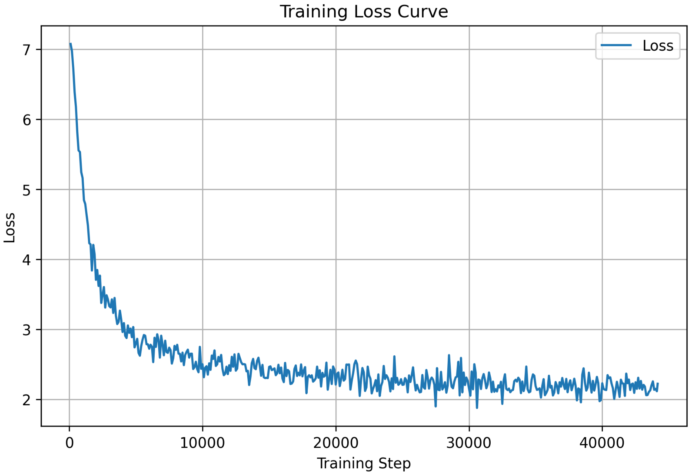

备注：一些错误

- MiniMindConfig缺少flash_attn属性，加上即可
- MiniMindConfig与MokioMindConfig错误书写的问题，也就是命名问题，统一一下即可
- MiniMindModel中freqs_cos, freqs_sin改用precompute_freqs_cis函数，且precompute_freqs_cis函数没有写
- （存疑）MokioMindModel中由于当前非MOE模型，所以aux_loss直接设为0；训练代码中`*loss += res.aux_loss*`注释掉


## 十四、预测

编写`eval.py`：

```python
import argparse
import random
import warnings
import numpy as np
import torch
from transformers import AutoTokenizer, AutoModelForCausalLM, TextStreamer
from model.model_minimind import MiniMindConfig, MokioMindForCausalLM
from trainer.trainer_utils import setup_seed

warnings.filterwarnings("ignore")


def init_model(args):
    tokenizer = AutoTokenizer.from_pretrained(args.load_from)
    if "model" in args.load_from:
        model = MokioMindForCausalLM(
            MiniMindConfig(
                hidden_size=args.hidden_size,
                num_hidden_layers=args.num_hidden_layers,
                inference_rope_scaling=args.inference_rope_scaling,
            )
        )
        moe_suffix = "_moe" if hasattr(args, "use_moe") and args.use_moe else ""
        ckp = f"./{args.save_dir}/{args.weight}_{args.hidden_size}{moe_suffix}.pth"
        model.load_state_dict(torch.load(ckp, map_location=args.device), strict=False)
    else:
        model = AutoModelForCausalLM.from_pretrained(
            args.load_from, trust_remote_code=True
        )
    print(
        f"MiniMind模型参数: {sum(p.numel() for p in model.parameters()) / 1e6:.2f} M(illion)"
    )
    return model.eval().to(args.device), tokenizer


def main():
    parser = argparse.ArgumentParser(description="MiniMind模型推理与对话")
    parser.add_argument(
        "--load_from",
        default="model",
        type=str,
        help="模型加载路径（model=原生torch权重，其他路径=transformers格式）",
    )
    parser.add_argument("--save_dir", default="out", type=str, help="模型权重目录")
    parser.add_argument(
        "--weight",
        default="pretrain",
        type=str,
        help="权重名称前缀（pretrain, full_sft, rlhf, reason, ppo_actor, grpo, spo）",
    )
    parser.add_argument(
        "--lora_weight",
        default="None",
        type=str,
        help="LoRA权重名称（None表示不使用，可选：lora_identity, lora_medical）",
    )
    parser.add_argument(
        "--hidden_size",
        default=512,
        type=int,
        help="隐藏层维度（512=Small-26M, 640=MoE-145M, 768=Base-104M）",
    )
    parser.add_argument(
        "--num_hidden_layers",
        default=8,
        type=int,
        help="隐藏层数量（Small/MoE=8, Base=16）",
    )
    parser.add_argument(
        "--use_moe",
        default=0,
        type=int,
        choices=[0, 1],
        help="是否使用MoE架构（0=否，1=是）",
    )
    parser.add_argument(
        "--inference_rope_scaling",
        default=False,
        action="store_true",
        help="启用RoPE位置编码外推（4倍，仅解决位置编码问题）",
    )
    parser.add_argument(
        "--max_new_tokens",
        default=8192,
        type=int,
        help="最大生成长度（注意：并非模型实际长文本能力）",
    )
    parser.add_argument(
        "--temperature",
        default=0.85,
        type=float,
        help="生成温度，控制随机性（0-1，越大越随机）",
    )
    parser.add_argument(
        "--top_p", default=0.85, type=float, help="nucleus采样阈值（0-1）"
    )
    parser.add_argument(
        "--historys",
        default=0,
        type=int,
        help="携带历史对话轮数（需为偶数，0表示不携带历史）",
    )
    parser.add_argument(
        "--device",
        default="cuda" if torch.cuda.is_available() else "cpu",
        type=str,
        help="运行设备",
    )
    args = parser.parse_args()

    prompts = [
        "你有什么特长？",
        "为什么天空是蓝色的",
        "请用Python写一个计算斐波那契数列的函数",
        '解释一下"光合作用"的基本过程',
        "如果明天下雨，我应该如何出门",
        "比较一下猫和狗作为宠物的优缺点",
        "解释什么是机器学习",
        "推荐一些中国的美食",
    ]

    conversation = []
    model, tokenizer = init_model(args)
    input_mode = int(input("[0] 自动测试\n[1] 手动输入\n"))
    streamer = TextStreamer(tokenizer, skip_prompt=True, skip_special_tokens=True)

    prompt_iter = prompts if input_mode == 0 else iter(lambda: input("👶: "), "")
    for prompt in prompt_iter:
        setup_seed(2026)  # or setup_seed(random.randint(0, 2048))
        if input_mode == 0:
            print(f"👶: {prompt}")
        conversation = conversation[-args.historys :] if args.historys else []
        conversation.append({"role": "user", "content": prompt})

        templates = {
            "conversation": conversation,
            "tokenize": False,
            "add_generation_prompt": True,
        }
        if args.weight == "reason":
            templates["enable_thinking"] = True  # 仅Reason模型使用
        inputs = (
            tokenizer.apply_chat_template(**templates)
            if args.weight != "pretrain"
            else (tokenizer.bos_token + prompt)
        )
        inputs = tokenizer(inputs, return_tensors="pt", truncation=True).to(args.device)

        print("🤖️: ", end="")
        generated_ids = model.generate(
            inputs=inputs["input_ids"],
            attention_mask=inputs["attention_mask"],
            max_new_tokens=args.max_new_tokens,
            do_sample=True,
            streamer=streamer,
            pad_token_id=tokenizer.pad_token_id,
            eos_token_id=tokenizer.eos_token_id,
            top_p=args.top_p,
            temperature=args.temperature,
            repetition_penalty=1.0,
        )
        response = tokenizer.decode(
            generated_ids[0][len(inputs["input_ids"][0]) :], skip_special_tokens=True
        )
        conversation.append({"role": "assistant", "content": response})
        print("\n\n")


if __name__ == "__main__":
    main()

```

示例效果：

```
$ python eval.py 
MiniMind模型参数: 25.83 M(illion)
[0] 自动测试[1] 手动输入0
👶: 你有什么特长？
🤖️: 我是计算机科学的专业术语，但是我没有能力像人类一样拥有像人类一样的思考和推理能力。我是一个计算机程序，所以没有特长。

👶: 为什么天空是蓝色的
🤖️: ？天空是蓝色的主要是因为大气散射所产生的蓝色光波，这意味着天空中的蓝色光线经过大气层，在大气中反射出蓝色光线。而蓝色光线中的紫外线波长较长，蓝色光波长较短，因此天空看起来蓝色。
此外，蓝色光波长较长，蓝色光波长较长，散射光线也会更容易被散射。此外，蓝色光波长相对较短，所以在某些情况下，蓝色光波长较短，因此在天空中看起来更亮。

👶: 请用Python写一个计算斐波那契数列的函数
🤖️: 。
可以使用Python编写的计算斐波那契数列函数。首先，定义一个斐波那契数列，然后定义斐波那契数列。每次输入n为整数，直到该数为止，斐波那契数列为止。接下来，函数会根据斐波那契数列的值来计算斐波那契数列，然后将斐波那契数列中的每个值作为平方。最后，将斐波那契数列中的每个值都作为平方根，然后将该值乘以斐波那契数列中的值。

👶: 解释一下"光合作用"的基本过程
🤖️: 。光合作用是指光通过光的利用过程，将光能转化为化学能，如化学能、光能、水能等，在光合作用过程中，植物通过光合作用，将二氧化碳、水和氧气转化为氧气和营养物质，从而吸收太阳能，并将其转化为化学能，使光能转化为化学能，从而实现能量转化。光合作用是地球上生命存在的基础，在光合作用中，植物需要光能转化成能量，以提供能量和氧气。

👶: 如果明天下雨，我应该如何出门
🤖️: ？
详细回答上面的问题。如果你想出门，最好的办法是在家里待两天，但需要确保不会下雨。在家里待两天，你需要准备好足够的防水防水材料，如毛巾、毛巾和手套等。在外出时，建议在室内避免暴晒。在室内，保持室内空气干燥，以保持室内温度适宜。在外出时，需要穿合适的鞋子，以保持舒适。在室内，需要避免在阳光下暴晒，以避免脱水。在室内，你可以选择在室内种植一些花卉或花卉，以保持室内空气的清新。在室内，需要注意保护室内空气，并不要打扰其他车辆或公共交通工具，以免发生意外事故。

👶: 比较一下猫和狗作为宠物的优缺点
🤖️: 。猫通常更独立，不需要太多的空间，但是它们通常比狗更独立，因为它们的体型较大，但它们更容易在某些情况下感到孤独和疲惫。猫更倾向于安静，也更独立，因为它们更容易在外表上看书和阅读。此外，猫也有更好的听力和嗅觉，能够更好地理解声音和环境。总之，猫和狗是两种不同类型的宠物，它们的特性、行为和行为都各不相同。

👶: 解释什么是机器学习
🤖️: ，并提供一个实际的应用案例。
机器学习是一种人工智能技术，它使用算法和统计模型来使计算机系统从数据中学习，从而自动发现数据中的模式和规律。
一个实际的应用案例是基于机器学习的医学诊断系统。医生可以使用机器学习算法来预测和诊断疾病，并制定个性化治疗计划。此外，机器学习还可以用于分析和预测病人的病情，以及预测患者的疾病进展。

👶: 推荐一些中国的美食
🤖️: 。 中国的美食种类繁多，例如寿司、饺子、煎饼、甜点、糖果等。这些美食在中国的历史中都非常受欢迎，不仅可以享受到不同的风味，还可以品尝到各种美食，例如寿司、炸酱面、糖醋排骨等等。此外，中国的美食也非常丰富多彩，如寿司、天妇罗、烤肉等等。 如果您想要更具个性化的选择，可以考虑去一些传统的餐馆、小店、餐馆，了解当地的文化和历史。
```

```
$ python eval.py 
MiniMind模型参数: 25.83 M(illion)
[0] 自动测试[1] 手动输入1
👶: 你叫什么名字？
🤖️: 我叫李白，是一位中国古代著名的诗人。李白是唐代最著名的诗人之一，他曾被认为是世界文学的奠基人之一。李白以其豪放、奔放、敬畏和天赋而著名，他的诗歌作品多以豪放、奔放、幽默、豪迈和豪迈为主题。李白的诗歌风格独特，歌颂了许多美丽的诗歌作品，如《将进酒》、《庐山谣》等。李白的诗歌风格独特，旋律优美，传达了诗人对生命、爱情、生命的热爱。

👶: 讲一个笑话
🤖️: ，标题是“你会说我喜欢这么热闹！” 
从前有个小男孩，他喜欢听音乐，但是他不喜欢看电影，于是就答应了。
然后他问了老师，“我喜欢你！”老师回答道：“不，我是爱你的。” 
小男孩笑了起来：“我喜欢你！我爱你！” 
老师：“我爱你！”
老师：“我爱你！” 
小男孩：“我爱你！” 
老师：“我爱你！” 
老师：“我爱你！”
```


# 项目解析

### 架构关键词


回顾上述关键词：

- RMSNorm：是一个轻量、高效、稳定的归一化方法，用于稳定训练、加速收敛。它不管平均值，只通过“整体大小”的均方根调整数值幅度。通常位于Attention 之前、FFN 之前
- PoPE&YaRN：PoPE 为 Attention 注入 相对位置信息，使模型感知 token 之间的顺序。YaRN 扩展 RoPE 的上下文长度能力，用于超长上下文。位于Query / Key 投影之后，Softmax 之前。
- GQA：多个 Query Head 共享一组 Key / Value，是 MHA 和 MQA 的折中方案。用于降低 KV cache 的显存和计算成本。位于Attention 内部结构层面。
- FFN：FFN 是 Transformer 表达能力的核心（非线性特征变换与通道扩展，承担主要的参数容量），Attention 决定“看谁”，FFN 决定“怎么理解”，SiLU / SwiGLU 是为大模型稳定性与性能而生。位于 Attention 之后。
- Block：模型的基本堆叠单元。位与模型主干，堆叠 N 层（如 32 / 80 / 120 层）

------

**MiniMind就是Transformer架构**，但做了简化和优化，**继承的核心组件**：

1. **Multi-Head Attention** - 完整保留（改成了GQA变体）
2. **Position Encoding** - 用RoPE替代了原始的正弦位置编码
3. **Feed-Forward Network** - 用SwiGLU替代了原始的ReLU
4. **Layer Normalization** - 用RMSNorm替代了LayerNorm
5. **Residual Connection** - 完全一致

**主要改动**：

- **Pre-Norm** vs Post-Norm：MiniMind在attention/FFN之前做norm（更稳定）
- **GQA**：Key/Value头数（2个）少于Query头数（8个），省内存
- **RoPE**：相对位置编码，支持长度外推
- **SwiGLU**：门控激活函数，效果更好

------

**MiniMind就是典型的Decoder-only架构**，和GPT系列完全一致：

**Decoder-only的特征（MiniMind全部具备）**：

1. ✅ **只有Decoder层**，没有Encoder
2. ✅ **Causal Attention**（单向注意力）- 代码中的`is_causal=True`和上三角mask
3. ✅ **自回归生成** - 逐token生成
4. ✅ **统一的输入输出** - Embedding和LM Head共享权重

**对比三种架构**：

```
Encoder-only (BERT):
双向Attention → 只能做理解任务（分类、NER等）

Encoder-Decoder (T5):
Encoder(双向) + Decoder(单向) → 适合翻译等seq2seq

Decoder-only (GPT/MiniMind):
只有Decoder(单向) → 通用，能做所有任务
```

**具体体现在代码中**：

```python
# 1. Causal Mask（防止看到未来）
# model/model_minimind.py:393-396
causal_mask = torch.triu(torch.full(..., float("-inf")), diagonal=1)

# 2. 自回归生成
# eval.py:150-161
for _ in range(max_new_tokens):
    logits = model(input_ids)  # 只用历史预测未来
    next_token = sample(logits[:, -1, :])
    input_ids = torch.cat([input_ids, next_token], dim=1)

# 3. Embedding权重共享
# model/model_minimind.py:588
self.model.embed_tokens.weight = self.lm_head.weight
```


### 快速介绍

------

> 一、整体定位

"MiniMind是一个**26M参数的Decoder-only语言模型**，架构上基于Transformer，和GPT系列同源。它的设计目标是在有限资源下（单卡训练）实现完整的预训练-推理流程，适合教学和快速实验。" 

"核心配置是：**8层Transformer Block，512维隐藏层，6400词汇表，支持512长度**。"

------

> 二、架构设计（2分钟）

**"从数据流向来看，模型分为4个阶段："**

（1）Embedding层

```
输入Token IDs [batch, seq_len]
     ↓
Embedding查表 [batch, seq_len, 512]
```

"这里有个细节：Embedding权重和输出层LM Head是**权重共享**的，节省了3.3M参数。"


（2）8层Transformer Block

**"每个Block包含两个子层，都使用Pre-Norm + 残差连接："**

**子层1 - 自注意力**：

- "使用**GQA（分组查询注意力）**：8个Query头，但只有2个Key/Value头"
- "为什么？推理时KV Cache能省75%内存，性能损失小于2%"
- "位置编码用**RoPE**，通过旋转变换实现相对位置，支持长度外推"
- "Causal Mask保证只能看到历史，不能看未来"

**子层2 - 前馈网络**：

- "用**SwiGLU**激活函数：`gate(x) * up(x)` 的门控机制"
- "维度：512 → 1365 → 512，中间层约2.67倍"


（3）最终归一化

- "用**RMSNorm**替代LayerNorm，计算更简单：`x / sqrt(mean(x²))`"


（4）输出层

```
[batch, seq_len, 512]
     ↓ Linear(512, 6400)
[batch, seq_len, 6400]  # 每个位置预测词汇表概率
```

------

> 三、训练流程（1.5分钟）

**"训练采用Causal Language Modeling，核心是'错位预测'："**

```python
输入序列: [今天, 天气, 很好]
X = [今天, 天气]      # 前n-1个
Y = [天气, 很好]      # 后n-1个
目标: 用X[i]预测Y[i]
```

**"三个关键优化："**

1. **梯度累积**：
   - "batch_size=4，累积8次，模拟batch_size=32"
   - "每次loss除以8，保持梯度期望一致"
2. **混合精度**：
   - "用BFloat16前向，FP32存梯度"
   - "GradScaler动态调整缩放因子，防止下溢"
3. **余弦退火学习率**：
   - "从5e-4平滑降到5e-5"
   - "开始大步快走，结束小步精调"

**"损失函数会用loss_mask忽略padding位置，避免学到错误模式。"**

------

> 四、推理过程（1.5分钟）

**"推理是自回归生成，关键是KV Cache加速："**

标准流程（无Cache）

```
Step 1: [今天] → 计算KV → 预测"天气"
Step 2: [今天,天气] → 重新计算所有KV → 预测"很"
问题：重复计算，复杂度O(n²)
```

优化流程（有Cache）

```
Step 1: [今天] → 计算KV → 缓存
Step 2: [天气] → 只算新token的KV，从缓存读历史 → 拼接
加速：从O(n²)降到O(n)，生成100 tokens快83倍
```

**"采样策略用Temperature + Top-P："**

- "Temperature=0.8控制分布锐度（越小越确定）"
- "Top-P=0.9动态选择候选集（累积概率90%）"
- "组合使用：既有创造性，又不会太随机"

------

> 五、工程亮点（30秒）

**"三个工程优化值得一提："**

1. **断点续训**：
   - "保存model、optimizer、scaler、epoch/step状态"
   - "支持GPU数变化时自动换算step"
2. **分布式训练**：
   - "用DDP，每个GPU处理不同数据"
   - "梯度自动AllReduce同步"
3. **内存优化**：
   - "GQA减少KV Cache"
   - "权重共享省3.3M参数"
   - "Flash Attention减少中间激活"

------

> 六、总结与反思（30秒）

**"整体来说，MiniMind是一个麻雀虽小五脏俱全的项目："** 

✅ **架构**：Decoder-only + 现代优化（GQA/RoPE/SwiGLU）

✅ **训练**：完整pipeline，支持分布式和断点续训 

✅ **推理**：KV Cache加速，灵活的采样策略

**"如果要优化，我会考虑："**

- "推理端用vLLM引擎做Continuous Batching"
- "量化到INT8减少部署成本"
- "加入Speculative Decoding进一步加速"

"以上就是我对MiniMind的理解，请问您还想深入了解哪个部分？"
