> 官方项目：https://github.com/rasbt/LLMs-from-scratch
>
> 中文解析版：https://github.com/MLNLP-World/LLMs-from-scratch-CN

大纲：

1 理解大型语言模型 

2 处理文本数据 

3 编码注意力机制 

4 从头实现 GPT 模型以生成文本 

5 在未标记数据上进行预训练


补充：

VSCode远程连接目标服务器的Jupyter：https://blog.csdn.net/weixin_44244168/article/details/125698441

- 安装Jupyter插件
- tmux启动服务：`jupyter notebook --allow-root`
  - 在jupyter的右上角选择内核`select kernel`，将服务的ip及token填入即可：例如`http://127.0.0.1:8888/tree?token=c875a8dbb2ce2e065635df06ac0879d401aa86fcd2c21c70`


# 01 Ubderstanding LLMs

> 本涨价不含代码，后续章节均含代码

NLP在邮件分类等任务上表现出色，但在复杂任务或生成方便表现不佳。


当代 LLMs 与早期 NLP 模型之间的另一个重要区别在于，后者通常是为特定任务而设计的；而早期的 NLP 模型在其狭窄的应用领域表现出色，而 LLMs 则展现出在广泛的 NLP 任务中的更广泛能力。


## 1、What is an LLM？

An LLM, a large language model, is a neural network designed to understand, generate, and respond to human-like text.

LLM，即大型语言模型，是一种旨在理解、生成和响应类人文本的神经网络。


LLMs能生成文本，常被成为GenAI（不过从下图看，LLMs与GenAI范围存在不同，比如图像生成等？）

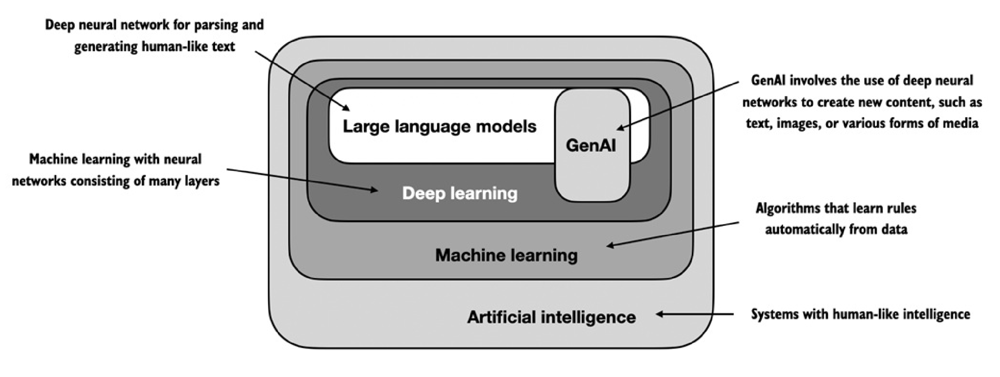


## 2、Applications of LLMs

略


## 3、Stages of  building and using LLMs

构建和使用LLMs阶段


创建LLM的过程一般包括预训练和微调。

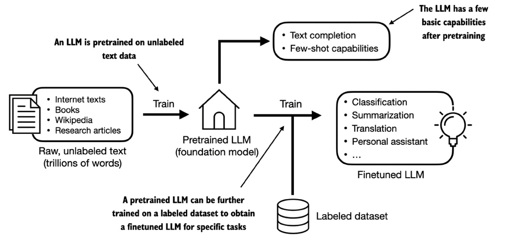


预训练阶段：

- 创建一个 LLM 的第一步是在大量文本数据集上对其进行训练，**这些数据有时也被称为原始文本。在这里，“原始”指的是这些数据仅仅是普通文本，没有任何标签信息**[1]。（可能会应用过滤，例如移除格式字符或未知语言的文档。）
- 这个 LLM 的第一阶段训练也称为预训练，创建一个初始预训练的 LLM，通常称为基础模型或底层模型。这种模型的一个典型例子是 GPT-3 模型（ChatGPT 中提供的原始模型的先导模型）。**该模型能够进行文本补全，即完成用户提供的半写句子。它还具有有限的 few-shot 能力**，这意味着它可以通过仅几个例子来学习执行新任务，而无需大量训练数据。


微调阶段：

- 获得预训练的 LLM 后，其中 LLM 被训练来**预测文本中的下一个词**，我们可以进一步在标记数据上训练 LLM，这被称为微调。
- 微调 LLMs 的两种最流行的类别包括**指令微调和用于分类任务的微调**。在指令微调中，标记数据集由指令和答案对组成，例如一个用于翻译文本的查询以及正确翻译的文本。在分类微调中，标记数据集由文本及其相关的类别标签组成，例如与垃圾邮件和非垃圾邮件标签相关的电子邮件。


## 4、Using LLMs for different tasks

初始的Transformer架构图如下：

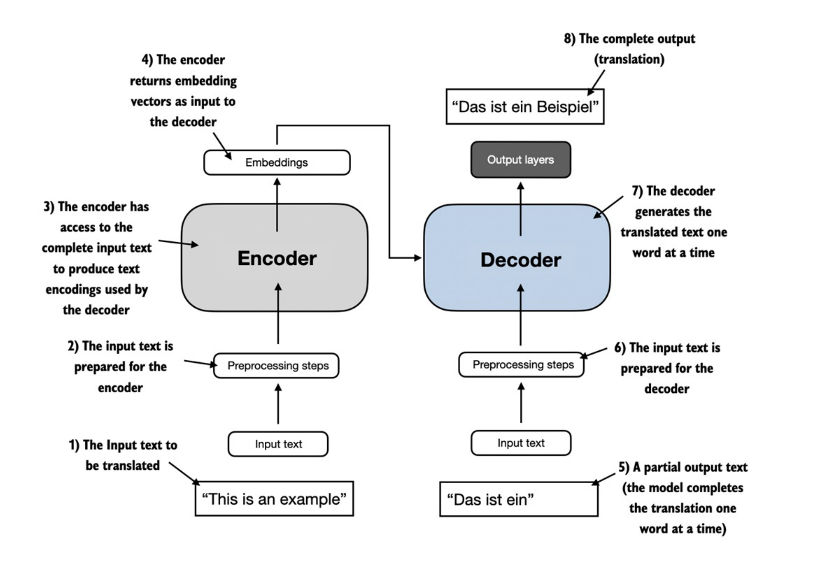

后续的 Transformer 架构变体，如所谓的 BERT（全称 bidirectional encoder representations from transformers）以及各种 GPT 模型（全称 generative pretrained transformers），基于这一概念来适应不同任务。

**BERT 基于原始 Transformer 的编码器子模块构建**，其训练方法与 GPT 不同。

**GPT 是为生成任务设计的**，而 **BERT 及其变体专门用于掩码词预测**，即模型预测给定句子中被掩码或隐藏的词。这种独特的训练策略使 BERT 具备了在文本分类任务中的优势，包括情感预测和文档分类。作为其能力的应用，截至本文写作时，Twitter 使用 BERT 检测有害内容。

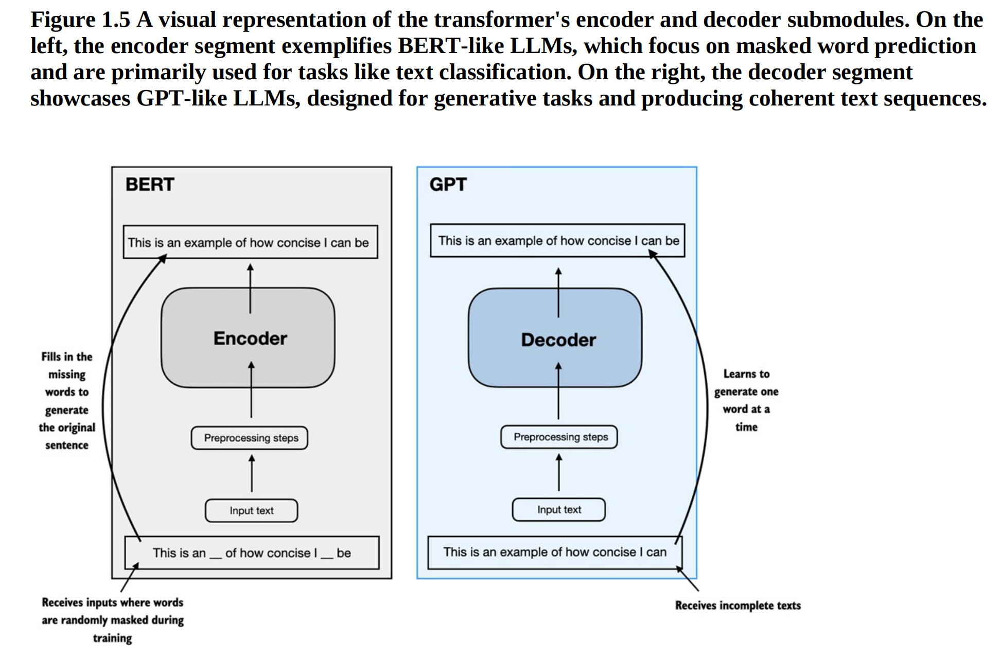


一、BERT 简介

**BERT** 是由 Google 于 2018 年提出的预训练语言模型。
 它的核心特点是：

- **双向编码（Bidirectional）**：BERT 同时考虑一个词左边和右边的上下文，有利于理解句子含义。
- **基于 Transformer Encoder**：只使用 Transformer 的编码器部分。
- **预训练任务**：
  - **Masked Language Model (MLM)**：随机遮盖输入句子的某些词，让模型预测这些词是什么。
  - **Next Sentence Prediction (NSP)**：判断两句话是否是原文中相邻的句子。

**用途**：BERT 主要用于理解任务，如文本分类、问答匹配、命名实体识别等。

------

二、GPT 简介

**GPT** 是由 OpenAI 提出的生成式语言模型，最早版本为 GPT-1（2018年），随后是 GPT-2、GPT-3、GPT-4。

- **单向编码（Unidirectional）**：GPT 只能从左到右生成文本（即每个词只能看到前面的词）。
- **基于 Transformer Decoder**：只使用 Transformer 的解码器部分。
- **预训练任务**：
  - **自回归语言模型（Autoregressive Language Modeling）**：预测下一个词，比如：“我今天很”→预测“开心”。

**用途**：GPT 主要用于生成任务，如对话生成、自动写作、代码生成等。

------

三、BERT 与 GPT 的主要区别

| 维度           | BERT                               | GPT                                |
| -------------- | ---------------------------------- | ---------------------------------- |
| 架构           | Transformer 的 Encoder             | Transformer 的 Decoder             |
| 上下文建模方式 | 双向（双向注意力）                 | 单向（从左到右）                   |
| 预训练目标     | Masked Language Model + NSP        | 自回归语言模型（预测下一个词）     |
| 应用类型       | 自然语言理解（分类、问答、NER 等） | 自然语言生成（写作、对话、翻译等） |
| 输出类型       | 句子或词的表示（embedding）        | 连续文本生成                       |
| 示例模型       | BERT, RoBERTa, ALBERT, DeBERTa     | GPT-2, GPT-3, GPT-4, ChatGPT       |

------

如今的大型语言模型基于上一节中介绍的 Transformer 架构。因此，Transformer 和 LLM 在文献中经常被用作同义词。但是请注意，自从 Transformer 也可以用于计算机视觉后，**并非所有 Transformer 都是LLMs** 。此外，并**非所有 LLMs 都是 Transformer**，因为存在基于循环和卷积架构的大型语言模型。


## 5、Utilizing large datasets

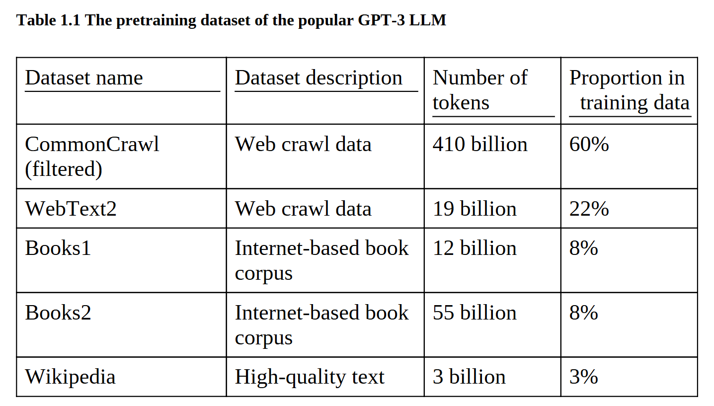

模型训练用的是**多个数据源中选出的部分数据**，总量控制在 3000 亿 token 左右，其中某些数据集被多次采样，某些则可能根本未被采纳。


GPT-3 论文的作者没有分享训练数据集，但一个公开可用的类似数据集是 The Pile(https://pile.eleuther.ai/)。然而，该集合可能包含受版权保护的作品，具体的使用条款可能取决于预期的使用场景和国家。更多信息，请查看 HackerNews 的讨论，链接为 https://news.ycombinator.com/item?id=25607809。

这些模型的预训练特性使它们在下游任务上进行进一步微调方面具有极高的通用性，这也是它们被称为基础模型或基准模型的原因。预训练 LLMs 需要访问大量资源，并且非常昂贵。例如，据估计，GPT-3 的预训练成本高达 460 万美元的云计算额度。


## 6、A closer look at the GPT architecture

GPT架构的深入解析。


GPT 模型是在相对简单的下一个词预测任务上进行预训练的。

**下一个词预测任务是一种自监督学习，属于自标注的一种形式。**这意味着我们不需要显式地为训练数据收集标签，而是可以利用数据本身的结构：我们可以将句子或文档中的下一个词作为模型需要预测的标签。由于这个下一个词预测任务允许我们"即时"创建标签，因此可以像第 1.5 节"利用大型数据集"中讨论的那样，利用海量未标记文本数据集来训练 LLMs。

与我们在 1.4 节“使用 LLMs 执行不同任务”中介绍的**原始 Transformer 架构相比，通用 GPT 架构相对简单。本质上，它只是没有编码器的解码器部分**，如图 1.8 所示。由于像 GPT 这样的解码器式模型通过逐个词预测来生成文本，因此它们被视为**一种自回归模型**。**自回归模型将其先前的输出作为未来预测的输入。**因此，在 GPT 中，每个新词都是根据其前面的序列来选择的，这提高了生成文本的连贯性。

像 GPT-3 这样的架构也远比原始的 Transformer 模型要大得多。例如，**原始的 Transformer 模型重复了编码器和解码器模块六次。GPT-3 总共有 96 层 Transformer，以及 1750 亿个参数。**

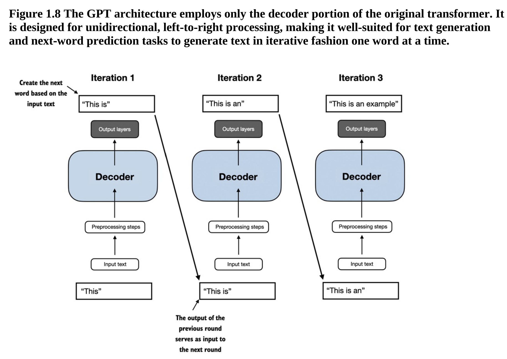

值得注意的是，尽管原始 Transformer 模型明确设计用于语言翻译，GPT 模型——尽管其架构更大但更简单，旨在进行下一词预测——同样能够执行翻译任务。这项能力最初让研究人员感到意外的是，该模型主要是在一个不专门针对翻译的下一词预测任务上训练的。

能够执行模型未明确训练的任务的能力被称为**"涌现行为"**。这种能力在训练过程中并未被明确教导，而是作为模型接触大量多语言数据并在不同环境中自然产生的结果而出现。


## 7、Building a large language model

官方概述视频：https://www.youtube.com/watch?v=kPGTx4wcm_w

三个阶段：Building、Training、Fintuning


### Stage 1 Building

#### 1）Data

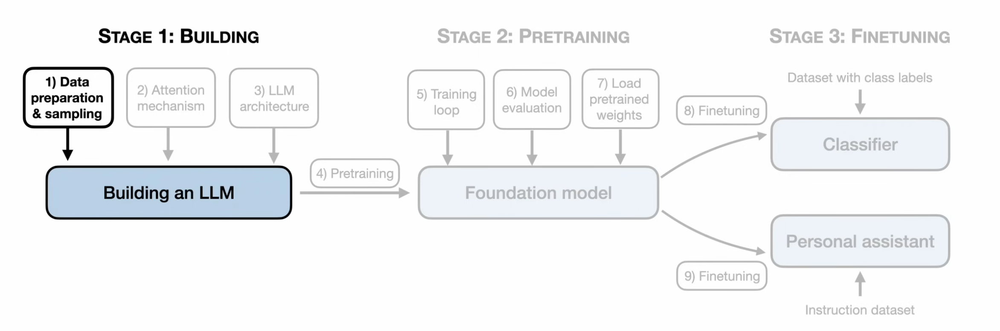

“LLM is a next-token prediction task”


BPE（Byte Pair Encoding）：一种常用于自然语言处理（NLP）中的**子词（subword）分词算法**。在 2016 年引入到神经机器翻译中，成为一种高效的**词汇表构造与文本编码技术**。

在 NLP 中，传统的词级别分词存在两个主要问题：

1. **词汇表太大**：每个词都是一个基本单位，导致词表膨胀，尤其在处理多语言或社交媒体文本时。
2. **未登录词（OOV）问题**：训练集中未出现的词在推理时无法处理。

为了解决这些问题，**子词（subword）分词**方法被提出，即将词拆成更小的单位，如词根、词缀、甚至字符，使得模型能更好地泛化。BPE 是其中最早、最经典的方法之一。


关于Pre-Training Datasets，一些简单数据集：

- **Common Crawl** 是一个开源项目，每月抓取全球范围内的网页，提供网页的原始内容和元数据。它是目前规模最大、覆盖最广的网页文本来源。
- **WebText** 是由 OpenAI 为训练 GPT-2 收集的网页数据集。它来源于 **被 Reddit 高质量用户推荐（k ≥ 3 upvotes）的外链内容**，避免了原始 Common Crawl 的噪声。
- Books1 和 Books2 这两个数据集被用于 OpenAI GPT-3 的训练，但官方并未公布详细来源或内容。
- 等等

比如Llama等模型的报告中，就会提到用了哪些数据集，token数量等，当然很多数据集可能涉及一些侵权问题，报告中并不会公开，以避免法律问题。


关于Quantity，这里提到了微软训练的Phi-3，他采用了少量的数据实现了有效。


#### LLM Architecture

以GPT-2和Llama的架构为例


### Stage 2 Pre-Training

Training for 1~2 epochs is usually a good sweet spot.


实际上大多数时候，we work with pretrained weights / Load pretrained weights


### Stage3 Finetuning

Bonus: Preference tuning


### Evaluation LLMs

MMLU（Massive Multitask Language Understanding）是一个用于评估大语言模型（LLM）多任务、多学科综合能力的高质量基准数据集。它被广泛用于测试如 GPT-3、GPT-4、Claude、LLaMA 等模型的实际**知识广度、推理能力和泛化能力**。


**AlpacaEval** 是一个用于评估**指令跟随能力**的自动化评测工具，由 Tatsu Lab（Stanford）团队于 2023 发布，基于 **AlpacaFarm** 的 eval 数据集构建 [谷歌Colab+13GitHub+13arXiv+13](https://github.com/tatsu-lab/alpaca_eval?utm_source=chatgpt.com)。其核心理念是用一个强大的 LLM（如 GPT‑4 或 GPT‑4 Turbo）作为对比和评审机制，自动判定模型输出的质量优劣。


### Rules of thumb

一些经验法则


1、从头训练很昂贵，几乎没必要

2、


## 8、Summery

略


# 02 Working with Text Data

在本章中，你将学习如何为训练 LLMs 准备输入文本。这包括

- **将文本分割成 individual word and subword tokens，然后将其编码为 LLM 的向量表示**。
- 你还将了解**高级标记化方案**，如字节对编码，它被广泛应用于 GPT 等流行 LLMs 中。
- 最后，我们将实现**一个采样和数据加载策略，以生成后续章节中训练 LLMs 所需的输入输出对**。

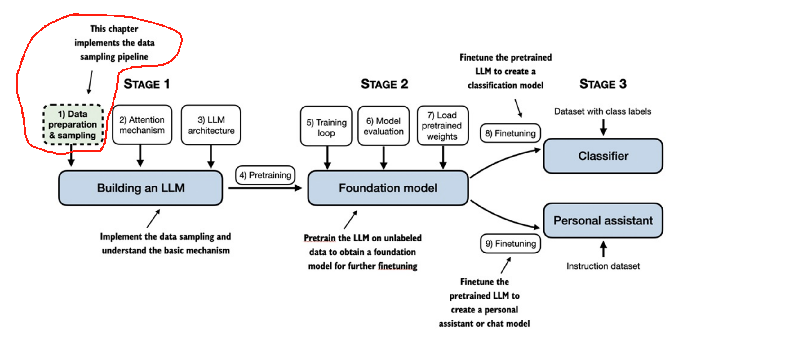

具体而言，就是蓝色大框标记的内容

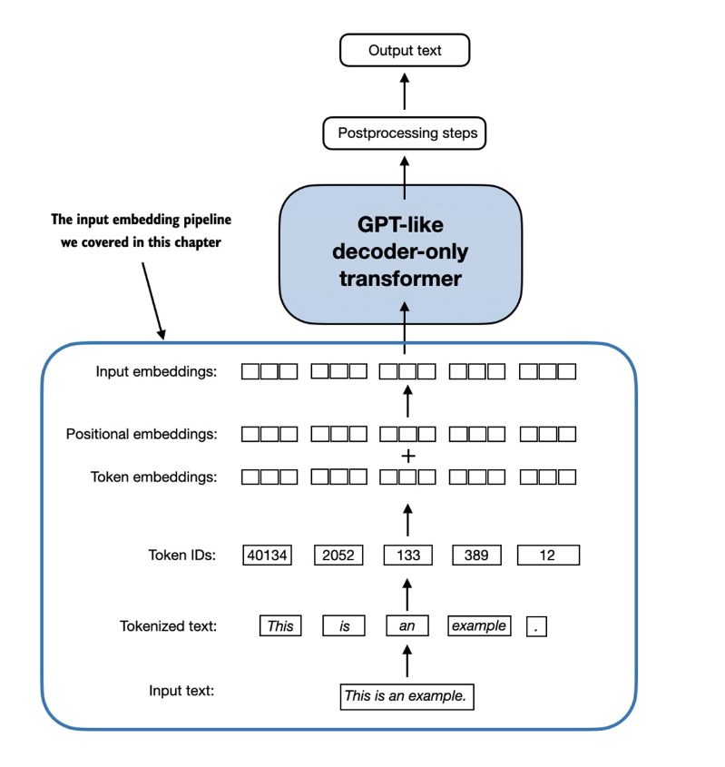

## 1、Understanding word embeddings

理解词嵌入


深度神经网络模型，包括 LLMs，不能直接处理原始文本。由于文本是分类的，它不兼容用于实现和训练神经网络的数学运算。因此，我们需要一种将单词表示为连续值向量的方法。（不熟悉计算环境中向量和张量的读者可以阅读附录 A，A2.2 节理解张量了解更多内容。）


将数据转换为向量格式的方法通常被称为嵌入。使用特定的神经网络层或另一个预训练的神经网络模型，**我们可以嵌入不同类型的数据**，例如视频、音频和文本。

（要注意的是，不同的数据格式需要不同的嵌入模型。例如，为文本设计的嵌入模型并不适用于嵌入音频或视频数据。）


**嵌入的核心**是将离散对象（如单词、图像，甚至整个文档）映射到连续向量空间中的点——嵌入的主要目的是将非数值数据转换为神经网络可以处理的格式。

虽然**词嵌入**是最常见的文本嵌入形式，但**也有句子、段落或整个文档的嵌入**。句子或段落嵌入是检索增强生成（RAG）的流行选择。


有几种算法和框架被开发出来用于生成词嵌入。较早且最受欢迎的一个例子是 **Word2Vec 方法**。

Word2Vec 训练神经网络架构来通过预测目标词的上下文或反之来生成词嵌入。

Word2Vec 的核心思想是：出现在相似上下文中的词往往具有相似的含义。因此，在用于可视化目的的二维词嵌入中，可以看到相似术语聚集在一起。


虽然我们可以使用预训练模型，例如 Word2Vec，为机器学习模型生成嵌入，但 **LLM 通常会生成自己的嵌入，这些嵌入是输入层的一部分，并在训练过程中进行更新。**将嵌入优化作为 LLM 训练的一部分而不是使用 Word2Vec 的优势在于，嵌入被优化以适应特定的任务和数据。


对于 GPT-2 和 GPT-3，**嵌入大小（通常被称为模型隐藏状态的维度）**根据具体的模型变体和大小而变化，这是一个性能和效率之间的权衡。最小的 GPT-2 模型（117M 和 125M 参数）使用 768 维的嵌入来提供具体示例。最大的 GPT-3 模型（175B 参数）使用 12,288 维的嵌入。


## 2、Tokenizing text


## 6、Data sampling with a sliding window

>滑动窗口数据采样

上一节详细介绍了分词步骤以及将字符串标记转换为整数标记 ID 的过程。在我们最终为 LLM 创建嵌入之前，下一步是生成用于训练 LLM 的输入-目标对。

这些输入-目标对看起来是怎样的？举个例子：

假设我们有一句话：`文本：The cat sat on the mat.`

经过分词并转成 ID 以后，可能变成：`[101, 202, 303, 404, 505, 606]`

那么输入-目标对可能就是：

| 输入（Input）        | 目标（Target） |
| -------------------- | -------------- |
| [101]                | [202]          |
| [101, 202]           | [303]          |
| [101, 202, 303]      | [404]          |
| [101, 202, 303, 404] | [505]          |
| ……                   | ……             |

也可以按固定长度来生成，比如每次输入长度是 4：

| 输入（Input）        | 目标（Target）       |
| -------------------- | -------------------- |
| [101, 202, 303, 404] | [202, 303, 404, 505] |

→ 模型的目标是：给定前面的 token 序列，预测下一个 token。


具体内容：

- 使用滑动窗口技术创建训练样本
- 每个样本包含输入序列和对应的目标序列（右移一个位置）
- 演示了不同步长(stride)参数的影响
- 实现了数据加载器用于批量处理


在使用**滑动窗口数据采样**（sliding window sampling）处理文本训练数据时，`max_length` 和 `stride` 是两个非常关键的参数，它们直接决定了输入-目标对的生成方式和数据的覆盖程度。

1. `max_length`

> 表示每个输入序列的最大长度（token 数量）。

- 这是喂给模型的序列长度。
- 通常等于模型的上下文窗口大小（如 GPT-2 是 1024）。

2. `stride`

> 表示滑动窗口每次滑动的步长（token 数量）。

- 控制从一个样本到下一个样本**有多少重叠**。
- 如果 stride < max_length，会有重叠（更高的数据利用率）。
- 如果 stride = max_length，则无重叠。
- 如果 stride > max_length，会有间隔（跳着取数据）。


## Summery

处理文本数据：

1、理解Embeddings（Understanding word Embeddings）

简略介绍Embedding：

- 概念：将数据转换为向量格式
- 核心
- 目的
- 应用：文本、音频、视频等


2、文本分词（Tokenizing text）

用re，即用正则表达式，实现了简易的分词示例：

- 将文本分解为更小的理解单元（单词、标点符号等）
- 使用正则表达式进行文本分割，处理各种标点符号和空白字符
- 通过 the-verdict.txt 示例文本演示了完整的分词过程
- 最终生成了4690个tokens的词汇表


3、将token转换为token ID（Converting tokens into token IDs）

Token编号与词汇表构建

- 创建词汇表映射：将每个唯一token映射到唯一整数ID
- 构建了包含1130个唯一token的词汇表


4、添加特殊上下文标记（Adding special context tokens）

分词器实现

- SimpleTokenizerV1 : 基础版本，包含encode和decode方法
  - encode: 将文本转换为token ID序列
  - decode: 将token ID序列还原为文本
- SimpleTokenizerV2 : 增强版本
  - 添加了特殊token： <|endoftext|> （文本结束）和 <|unk|> （标记替换未知单词）
  - 能够处理词汇表外的词汇


5、字节对编码（Byte Pair Encoding, BPE）

用tiktoken库，实现了简易的BPE案例：

- 介绍了GPT-2使用的BPE分词器
- 使用 tiktoken 库实现BPE分词
- 展示了BPE如何处理未知词汇（分解为子词单元）
- 对比了自定义分词器与BPE的差异


6、滑动窗口数据采样（Data sampling with a sliding window）

具体内容：

- 使用滑动窗口技术创建训练样本
- 每个样本包含输入序列和对应的目标序列（右移一个位置）
- 演示了不同步长(stride)参数的影响
- 实现了数据加载器用于批量处理

代码实现：

- GPTDatasetV1类 : 自定义PyTorch数据集
  - 处理文本编码
  - 实现滑动窗口采样
- create_dataloader_v1函数 : 创建训练用的数据加载器
  - 支持批量处理
  - 可配置窗口大小和步长


7、创建token嵌入（Creating token embedding）

为LLM输入文本的最后一步，即将token ID转换为嵌入向量。


具体内容：创建数据加载器

- 将token ID转换为连续向量表示
- 使用 torch.nn.Embedding 层实现
- 展示了嵌入权重的可视化
- 解释了嵌入层作为查找表的工作原理


位置编码（Positional Encoding）

- 为token添加位置信息
- 结合token嵌入和位置嵌入
- 最终生成用于LLM的输入表示


# 03 Coding Attention Mechanisms

>在传统的自然语言处理（NLP）模型中（比如RNN、LSTM），模型在处理长文本时常常“遗忘”前面出现的重要信息，尤其是当序列较长时。为了解决这个问题，**Attention机制（注意力机制）**被提出，最早在神经机器翻译中使用。
>
>它的核心思想是：在处理每一个词的时候，不是只依赖固定的上下文，而是**动态地去“关注”输入中对当前任务最重要的部分**。
>
>Transformer论文简读及手搓结构：https://www.bilibili.com/video/BV1k4o7YqEEi

本章主要独立的介绍Attention机制，下一章则会围绕Attention机制创建一个完整的生成文本的模型。

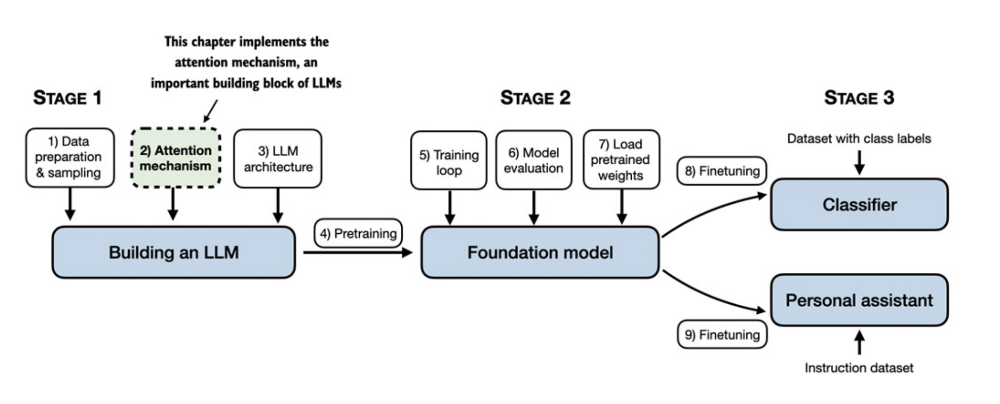


## 1、The problem with modeling long sequences

针对语言翻译，由于源语言和目标语言的语法结构，我们**无法逐字翻译文本**。例如从德语翻译成英语时，不可能仅仅逐字翻译，相反，**翻译过程需要上下文理解和语法对齐**。

**为了解决无法逐字翻译的问题**，通常使用一个包含两个子模块的深度神经网络，即所谓的编码器和解码器。编码器的工作是首先读取并处理整个文本，然后解码器生成翻译后的文本。


计算过程中，很多关键词没理解意思，导致对整个注意力机制的计算过程懵懵懂懂：

- 未归一化的注意力得分：
- 


## Summery

1、长序列的建模问题

> 因为有些语言的翻译涉及上下文，所以不能逐字翻译。在Transformer模型出现之前，机器翻译任务主要依赖于编码器(encoder)-解码器(decoder)架构的循环神经网络（RNNs）。

具体内容：

- 传统RNN的局限性 ：在处理长序列时，RNN存在梯度消失和难以并行计算的问题
- 注意力机制的优势 ：能够直接建模序列中任意两个位置之间的关系，不受距离限制


2、注意力机制的核心思想

- 选择性关注 ：允许模型在处理每个位置时，动态地关注输入序列中的相关部分
- 权重分配 ：通过计算注意力权重，决定不同输入对当前处理位置的重要性


3、注意力机制核心思想

（1）简化版自注意力（无参数）

基本流程：

- 

（2）完整版自注意力机制（含可训练参数）


4、因果自注意力（Causal Attention）

- **目的**：确保语言模型在生成文本时只能看到之前的位置信息
- **实现方式**：使用上三角掩码屏蔽未来位置的信息


5、多头注意力（Multi-Head Attention）


# 04 Implementing a GPT model from Scratch To Generate Text


关于复现GPT2的其他教程：

- 沐神论文精读：https://www.bilibili.com/video/BV1AF411b7xQ
- Karpathy复现：https://www.bilibili.com/video/BV12s421u7sZ
- OpenAI官方：https://github.com/openai/gpt-2/tree/master


> 沐神论文精读

transformer、gpt、bert、gpt-2、gpt-3相继出现，google发布Transformer和Bert更偏向于创新，一些小的团队解决一些小的问题，gpt系列类似于大力出奇迹，加大数据加大模型，去解决实际应用问题。

军备竞赛，money is all you need

1、GPT-1 117M

- 

2、GPT-2 1.5B

- 模块相比GPT-1不变，规模变大，但可能因为工程变大但是效果相比Bert-Large没那么惊艳，所以提出了另一个创新点，zero-shot
- 新意大，但有效价值小，GPT-3的有效价值高

3、GPT-3 175B

- GPT-3的论文更像是一个技术报告，63页，但是既没有讲的非常详细，也没有关联前面GPT-1、GPT-2的内容，只有非常出彩才敢这样写
- 不做梯度更新（without any gradient updates or fine-tuing）
- 


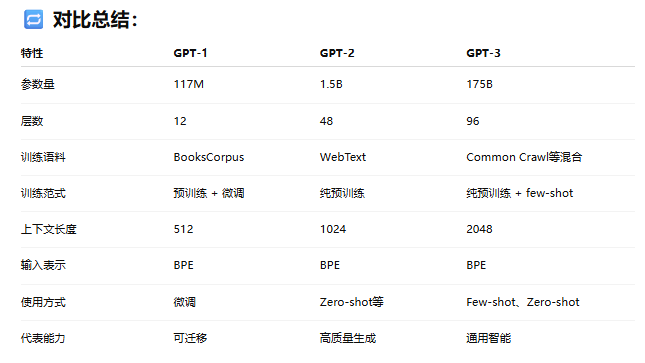


> Karpathy复现

另存在Karpathy相关的学习笔记下面了


## Summery

本章详细介绍了如何从零开始实现一个完整的 GPT 模型架构，主要包含以下核心内容：

### 4.1 LLM架构概述
- 模型规模 ：实现了1.24亿参数的GPT-2小型模型配置
- 架构特点 ：基于Transformer解码器架构，采用自回归生成方式
- 核心配置 ：
  - 词汇表大小：50,257（BPE分词器）
  - 上下文长度：1024 tokens
  - 嵌入维度：768维
  - 注意力头数：12个
  - Transformer层数：12层
  - Dropout率：0.1
### 4.2 归一化操作（Layer Normalization）
- 原理 ：将神经网络层的激活值中心化为均值为0，方差为1
- 作用 ：稳定训练过程，加速权重收敛
- 实现 ：自定义LayerNorm类，包含可学习的缩放参数scale和偏移参数shift
- 应用位置 ：多头注意力模块前后、最终输出层之前
### 4.3 GELU激活函数
- 优势 ：相比ReLU更平滑的激活函数，提升模型性能
- 数学公式 ：GELU(x) = 0.5 × x × (1 + tanh[√(2/π) × (x + 0.044715 × x³)])
- 实现 ：自定义GELU类，提供精确的近似计算
### 4.4 前馈神经网络（FeedForward Network）
- 结构 ：两层线性变换 + GELU激活函数
- 维度扩展 ：将768维输入扩展到4×768=3072维，再压缩回768维
- 残差连接 ：支持shortcut连接，缓解梯度消失问题
### 4.5 Transformer块的完整实现
- 核心组件 ：
  - 多头注意力机制（MultiHeadAttention）
  - 前馈神经网络（FeedForward）
  - 层归一化（LayerNorm）
  - Dropout和残差连接
- 处理流程 ：
  1. 1.
     输入经过层归一化
  2. 2.
     多头注意力处理
  3. 3.
     残差连接和Dropout
  4. 4.
     再次层归一化
  5. 5.
     前馈网络处理
  6. 6.
     最终残差连接
### 4.6 完整GPT模型架构
- 组件构成 ：
  - 词嵌入层（Token Embedding）
  - 位置嵌入层（Positional Embedding）
  - 12个Transformer块的堆叠
  - 最终层归一化
  - 输出投影层（线性层到词汇表）
- 输入处理 ：词嵌入 + 位置嵌入 → Transformer块 → 归一化 → 输出


```
class TransformerBlock(nn.Module):
    def __init__(self, cfg):
        super().__init__()
        self.att = MultiHeadAttention(
            d_in=cfg["emb_dim"],
            d_out=cfg["emb_dim"],
            context_length=cfg["context_length"],
            num_heads=cfg["n_heads"],
            dropout=cfg["drop_rate"],
            qkv_bias=cfg["qkv_bias"])
        self.ff = FeedForward(cfg)
        self.norm1 = LayerNorm(cfg["emb_dim"])
        self.norm2 = LayerNorm(cfg["emb_dim"])
        self.drop_shortcut = nn.Dropout(cfg["drop_rate"])

    def forward(self, x):
        # Shortcut connection for attention block
        shortcut = x
        x = self.norm1(x)
        x = self.att(x)   # Shape [batch_size, num_tokens, emb_size]
        x = self.drop_shortcut(x)
        x = x + shortcut  # Add the original input back

        # Shortcut connection for feed-forward block
        shortcut = x
        x = self.norm2(x)
        x = self.ff(x)
        x = self.drop_shortcut(x)
        x = x + shortcut  # Add the original input back

        return x


class GPTModel(nn.Module):
    def __init__(self, cfg):
        super().__init__()
        self.tok_emb = nn.Embedding(cfg["vocab_size"], cfg["emb_dim"])
        self.pos_emb = nn.Embedding(cfg["context_length"], cfg["emb_dim"])
        self.drop_emb = nn.Dropout(cfg["drop_rate"])

        self.trf_blocks = nn.Sequential(
            *[TransformerBlock(cfg) for _ in range(cfg["n_layers"])])

        self.final_norm = LayerNorm(cfg["emb_dim"])
        self.out_head = nn.Linear(cfg["emb_dim"], cfg["vocab_size"], bias=False)

    def forward(self, in_idx):
        batch_size, seq_len = in_idx.shape
        tok_embeds = self.tok_emb(in_idx)
        pos_embeds = self.pos_emb(torch.arange(seq_len, device=in_idx.device))
        x = tok_embeds + pos_embeds  # Shape [batch_size, num_tokens, emb_size]
        x = self.drop_emb(x)
        x = self.trf_blocks(x)
        x = self.final_norm(x)
        logits = self.out_head(x)
        return logits
```

`__init__`中定义了有哪些模块，`forward`中可以看出GPT2的组成、各个模块的执行顺序


# 05 Pretraining on Unlabled Data

在无标签数据上进行预训练

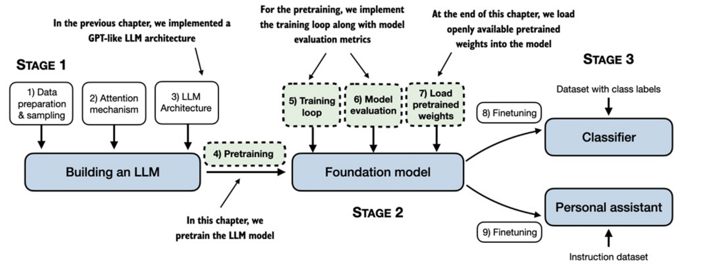


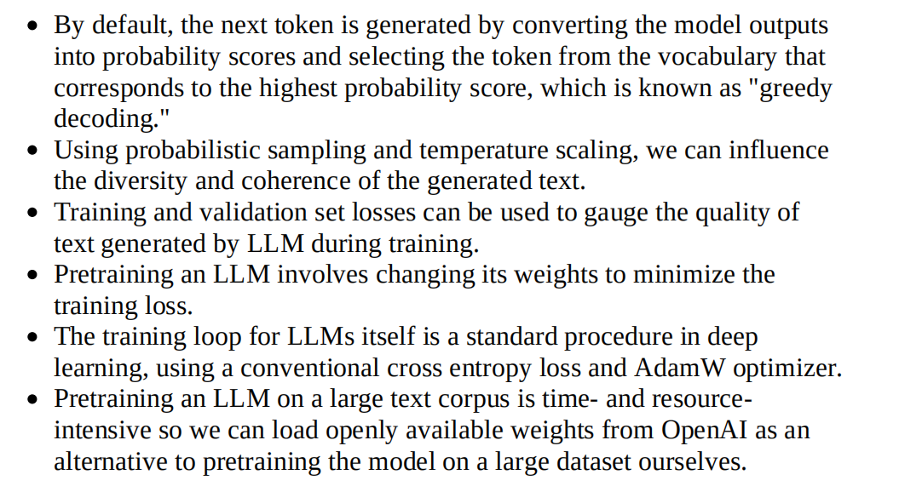


## Summery

### 5.1 评估文本生成大模型 

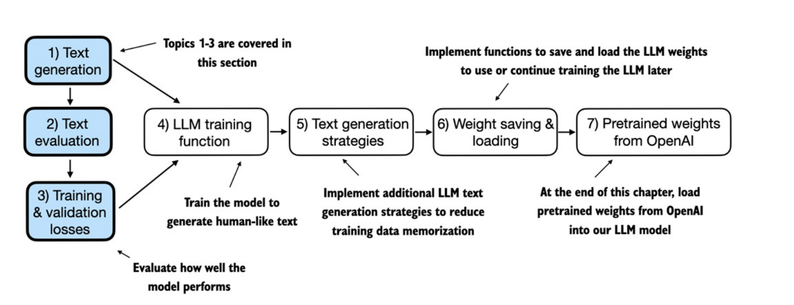

#### 5.1.1 模型初始化与配置

- GPT配置参数 ：使用1.24亿参数的GPT-2模型，配置包括：
  - 词汇表大小：50,257
  - 上下文长度：256（原为1024，为减少计算资源）
  - 嵌入维度：768
  - 注意力头数：12
  - 层数：12
  - Dropout率：0.1
  - QKV偏置：False（现代LLM标准） 

#### 5.1.2 文本生成与评估指标

使用GPT生成文本

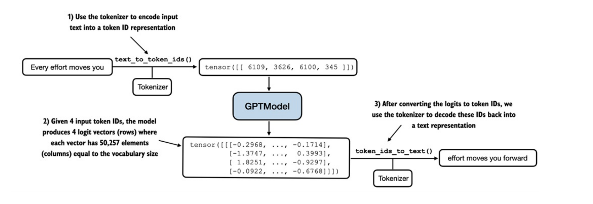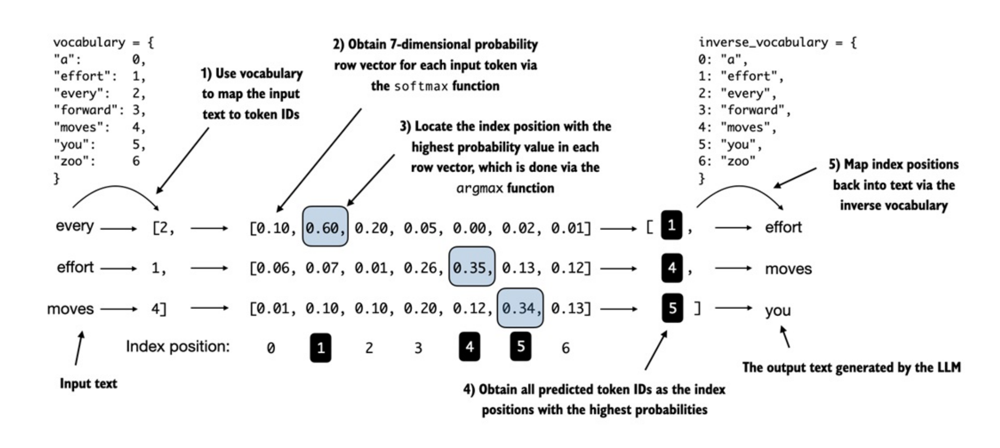

- 文本生成函数 ：实现了 generate_text_simple 用于基础文本生成
- Token处理工具 ：
  - text_to_token_ids ：文本转token ID
  - token_ids_to_text ：token ID转文本
- 评估指标 ：
  - 交叉熵损失(Cross-Entropy Loss) ：核心训练目标
  - 困惑度(Perplexity) ：exp(交叉熵损失)，衡量模型预测能力

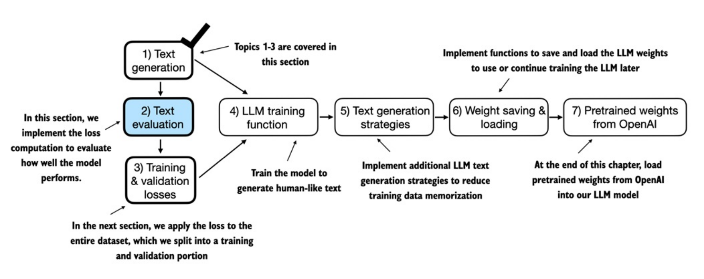


#### 5.1.3 损失计算机制

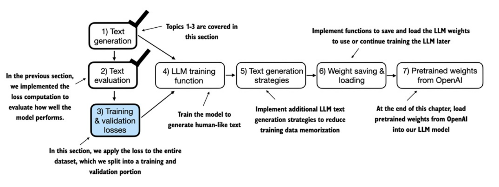

- 损失计算流程 ：
  1. 1.
     输入token序列生成logits
  2. 2.
     应用softmax获得概率分布
  3. 3.
     计算目标token的负对数似然
  4. 4.
     平均所有token的损失
- PyTorch实现 ：使用 torch.nn.functional.cross_entropy

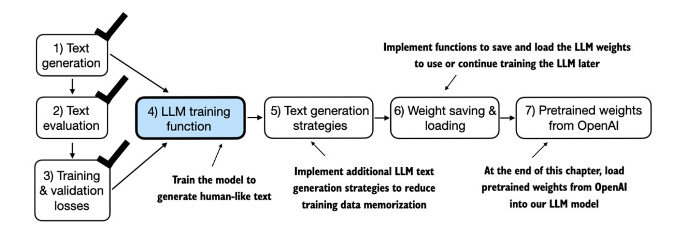


### 5.2 训练数据准备 

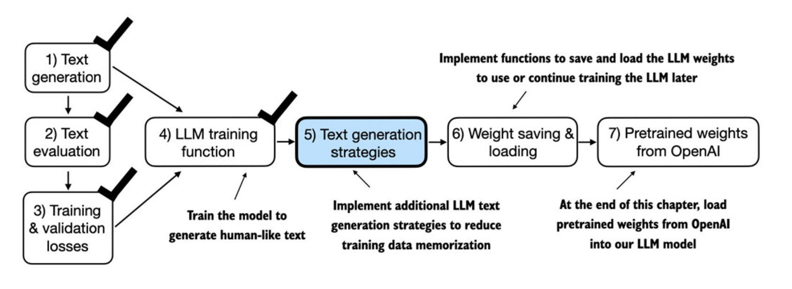

#### 5.2.1 数据集获取

- 数据源 ：使用"The Verdict"短篇小说作为训练数据
- 数据下载 ：自动从GitHub下载文本文件
- 数据分割 ：90%训练集，10%验证集 

#### 5.2.2 数据加载器

- 批处理 ：支持批量训练
- 序列长度 ：根据上下文长度配置
- 数据增强 ：通过滑动窗口创建训练样本


### 5.3 训练循环实现 

#### 5.3.1 核心训练函数

- train_model_simple函数 ：完整的训练循环实现
- 训练步骤 ：
  1. 1.前向传播计算损失
  2. 2.反向传播计算梯度
  3. 3.优化器更新权重
  4. 4.定期评估验证损失 
#### 5.3.2 训练监控

- 损失跟踪 ：记录训练和验证损失
- 进度显示 ：每个epoch后显示生成样本
- 可视化 ：绘制损失曲线


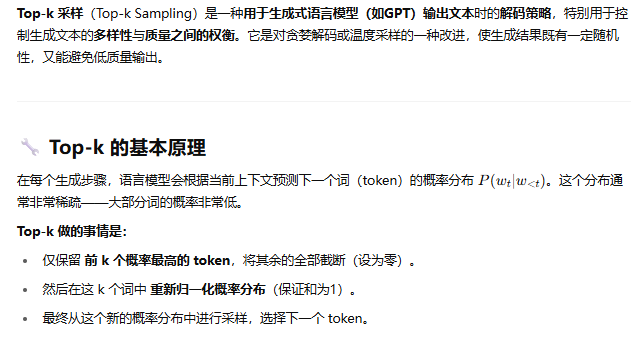

```
output = model.generate(
    input_ids,
    do_sample=True,
    top_k=40,
    max_length=100
)

```


### 5.4 预训练权重加载 

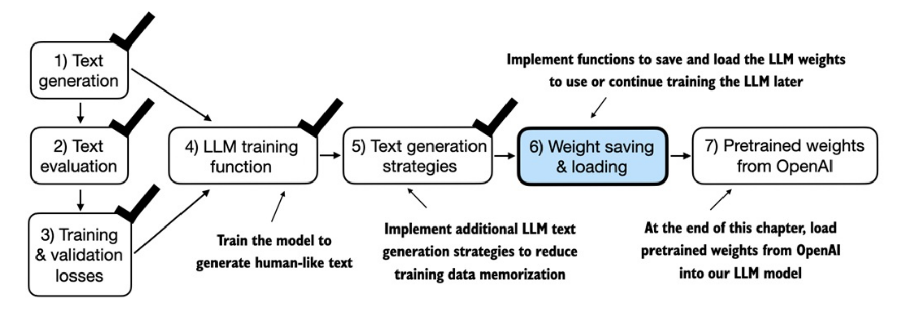

#### 5.4.1 OpenAI权重下载

- 模型规模 ：支持GPT-2的多个版本
  - 124M参数（小型）
  - 355M参数（中型）
  - 774M参数（大型）
  - 1558M参数（超大型）

####  5.4.2 权重加载机制

- 权重转换 ：将OpenAI格式转换为自定义模型格式
- 配置适配 ：自动调整模型配置以匹配预训练权重
- 性能评估 ：计算预训练模型的训练和验证损失


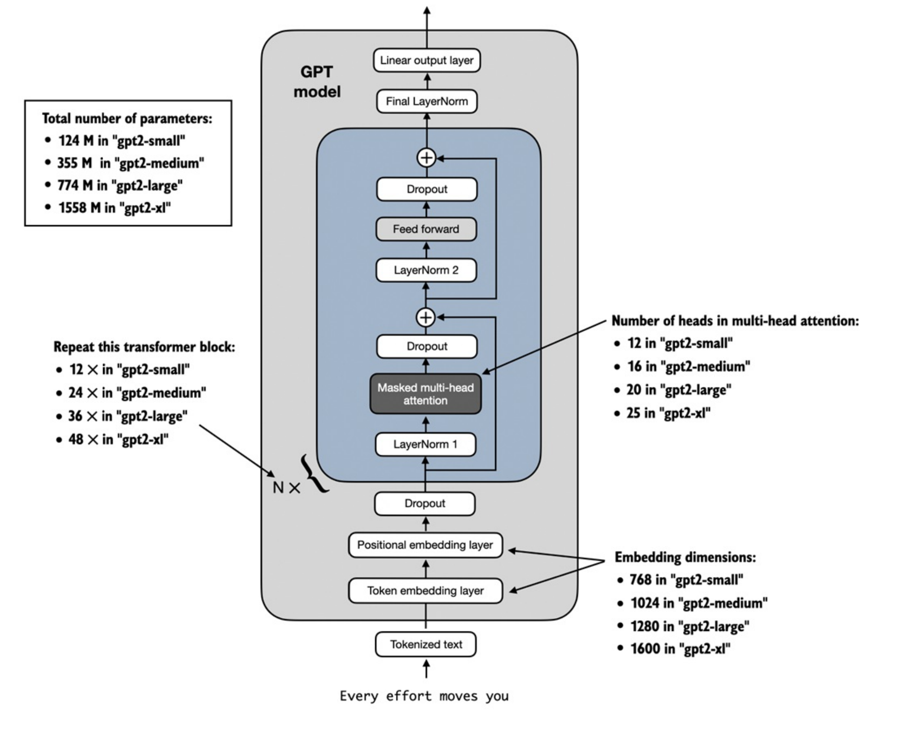


# 06 Finetuning for Classification

分类任务上的微调


## Summery

### 1. 微调类型对比

常见微调大语言模型的方法包括：

- 指令微调 （Instruction Fine-tuning）：让模型学习遵循指令，执行广泛任务
- 分类微调 （Classification Fine-tuning）：让模型学习预测特定类别标签，如垃圾邮件vs正常邮件


### 2. 数据准备与处理

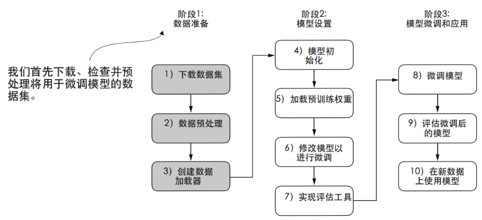

数据集 ：使用UCI SMS垃圾邮件数据集（包含垃圾邮件和正常邮件）

关键步骤 ：

- 数据下载与解压
- 类别平衡处理：通过下采样使垃圾邮件和正常邮件数量相等（各747个样本）
- 标签编码：将"spam"/"ham"转换为1/0
- 数据集划分：70%训练集、10%验证集、20%测试集


### 3. 数据加载器实现

SpamDataset类 ：

- 使用tiktoken进行文本编码
- 序列填充：使用 <|endoftext|> 作为填充符，将所有序列填充到最长序列长度
- 批次处理：批次大小为8，确保训练稳定性


### 4. 模型架构修改

基础模型 ：GPT-2 124M参数版本

关键修改 ：

- 冻结预训练权重 ：除最后几层外，所有参数设置为不可训练
- 添加分类头 ：将原本50,257维的输出层替换为2维输出层（对应二分类）
- 解冻关键层 ：使最后一个Transformer块和最终LayerNorm层可训练，提升性能


### 5. 训练策略

损失函数 ：交叉熵损失（Cross-Entropy Loss）

优化器 ：AdamW，学习率5e-5，权重衰减0.1

训练参数 ：

- 训练周期：5个epoch
- 评估频率：每50步评估一次
- 设备支持：自动检测CUDA、MPS或CPU


### 6. 性能评估

评估指标 ：

- 分类准确率（Accuracy）
- 训练/验证/测试损失
训练结果 ：

- 初始准确率：约50%（随机猜测水平）
- 训练后准确率：训练集、验证集、测试集均达到较高水平
- 损失曲线：训练损失和验证损失接近，表明过拟合程度较低


### 7. 实际应用

classify_review函数 ：实现端到端的垃圾邮件分类

- 输入任意文本
- 自动进行预处理、编码、填充
- 输出"spam"或"not spam"分类结果
模型保存与加载 ：

- 保存微调后的模型权重为 review_classifier.pth
- 支持后续直接加载使用，无需重复训练


# 07 Finetuning to Follow Instructions

微调以执行指令

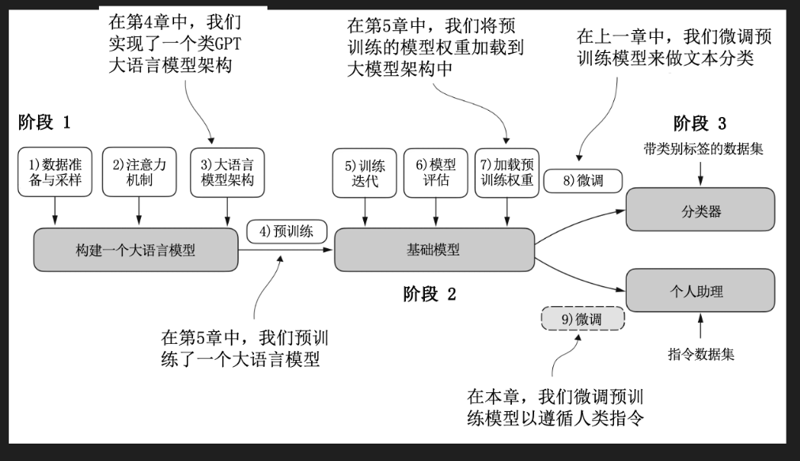

## 核心概念
第七章介绍了 指令微调（Instruction Tuning） ，这是将预训练的大语言模型从"文本补全专家"转变为"指令执行专家"的关键技术。与第五章的预训练（学习预测下一个词）和第六章的分类微调不同，指令微调让模型学会理解和执行人类指令。

## 技术架构
### 1. 数据集准备
- 数据来源 ：1100条指令数据集，包含instruction、input、output三元组
- 数据格式 ：采用Alpaca风格的提示模板
- 数据划分 ：85%训练集(935条)、10%测试集(110条)、5%验证集(55条)
- 格式化处理 ：
  ```
  Below is an instruction that describes a task...
  ### Instruction:
  [instruction]
  ### Input:
  [input]
  ### Response:
  [expected_output]
  ```
### 2. 数据加载与处理
- InstructionDataset类 ：预分词处理所有文本数据
- 自定义collate函数 ：动态批次填充，使用 <|endoftext|> (50256)作为填充token
- 批处理策略 ：每个批次内填充到相同长度，不同批次可以不同长度
### 3. 模型配置
- 基础模型 ：GPT-2 124M参数版本
- 配置参数 ：
  - 词汇表大小：50,257
  - 上下文长度：1024（比第六章的256更长）
  - 嵌入维度：768
  - 注意力头数：12
  - 层数：12
  - Dropout率：0.1
## 训练实现
### 训练策略
- 优化器 ：AdamW（学习率5e-5，权重衰减0.1）
- 训练周期 ：2个epoch
- 评估频率 ：每5步评估一次
- 批次大小 ：8
- 设备支持 ：CPU/GPU自动适配
### 训练过程
1. 1.
   初始状态 ：训练损失3.83，验证损失3.76
2. 2.
   训练进展 ：
   - 第1轮：损失显著下降
   - 第2轮：继续优化，最终训练损失降至约0.76，验证损失约1.56
3. 3.
   训练时间 ：约196分钟（GPU上）
### 关键代码组件
- train_model_simple ：复用第五章的训练循环
- calc_loss_loader ：损失计算函数
- generate_and_print_sample ：实时生成样本评估
## 性能评估
### 训练效果
- 损失下降 ：训练损失从3.83→0.76，验证损失从3.76→1.56
- 指令执行能力 ：成功学会格式转换、问答、拼写检查等多种任务
- 生成质量 ：能够生成符合指令要求的连贯响应
### 实际应用示例
输入 ："Convert the following sentence from active to passive voice: 'The chef cooks the meal every day.'"

微调前响应 ：重复输入内容，无法正确转换

微调后响应 ："The meal is cooked every day by the chef."

## 扩展技术
### 1. 大规模训练
- Alpaca 52K数据集 ：支持更大规模的指令微调
- 更大模型 ：支持GPT-2 medium(355M)、large(774M)、xl(1558M)
### 2. 参数高效微调
- LoRA技术 ：附录E提供参数高效微调方案
- 梯度冻结 ：可冻结大部分参数，只训练少量适配器层
### 3. 评估指标
- 自动化评估 ：使用Ollama进行响应质量评分
- 人工评估 ：检查指令遵循度和响应准确性
