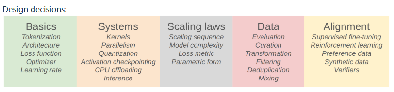
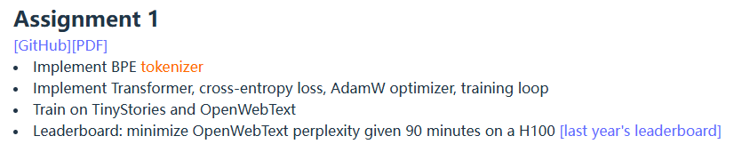

参考资源：

- https://www.bilibili.com/video/BV1zW5yz1Eom
- https://stanford-cs336.github.io/spring2025/
- https://github.com/stanford-cs336/spring2025-lectures/tree/main

# [01] Overview

> 课件：https://stanford-cs336.github.io/spring2025-lectures/?trace=var/traces/lecture_01.json
>
> 本节课（前半部分）主要讲述了课程大纲内容

课程三大要点：

- Mechanics 运行方式: how things work (what a Transformer is, how model parallelism leverages GPUs)
- Mindset 思维模式: squeezing the most out of the hardware, taking scale seriously (scaling laws)
- Intuitions 直觉: which data and modeling decisions yield good accuracy

课程大纲：

之后概述了整个大纲各个部分的学习内容：

### Basics

> 学习LLM基础，有训练Transformer模型的基础能力

任务：

Tokenization：基于BPE学习

Architecture：原生Transformer架构 + 激活函数SwiGLU等

Training：各个参数

### Systems

> 有了训练能力之后，开始考虑如何用好硬件
>
> Goal: squeeze the most out of the hardware
>
> Components: kernels, parallelism, inference

### Scaling Laws

### Data

### Alignment

对齐涵盖了三个Goals

- 

Alignment 主要内容：

- SFT与学习校验器（Verifiers）
- 

# [02] Basics

> 概述：
>
> - Tokenization
>   - 课件：https://stanford-cs336.github.io/spring2025-lectures/?trace=var/traces/lecture_01.json
>   - 本节课（后半部分）主要讲述了Tokenization
> - 

## Tokenization

## Pytorch，Resource accounting

大纲：

- 讲述了一些参数量的计算，和一些经验
- 资源计算相关：将计算/内存移动到gpu上等等

> 资源计算相关

float32 不是最高精度，但它是一般机器学习人员追求的最高精度。

| 特性          | `float16`     | `bfloat16`      |
| ------------- | ------------- | --------------- |
| 精度          | 较高（10 位） | 较低（7 位）    |
| 数值范围      | 较小          | 与 float32 相同 |
| 转换兼容性    | 与 float32 差 | 与 float32 好   |
| 用于训练/推理 | 推理更常用    | 训练中常用      |

简要来说，由于二者在指数和尾数中，位数的区别，bfloat16范围更大，但精度更低，通常**对神经网络影响不大**，因为模型对尾数误差不太敏感。

除此之外，还有fp8这类精度

当然，训练时可以采用混合的

Q：什么时候使用float32，什么时候使用bfloat16？

A：这个答案很细节，不过通常，对于模型参数和优化器，使用float32，bfloat16更像是一种零食的东西

MFU（**Model FLOPs Utilization**）是衡量一个深度学习模型在硬件上**运行效率**的指标。

MFU= 实际执行的 FLOPs 每秒 / 硬件的理论最大 FLOPs 每秒

1. 越接近 1，表示训练/推理越高效。
2. MFU 太低可能说明：
   - 模型太小（GPU 没吃饱）
   - 有大量 CPU/GPU 同步等待
   - I/O 开销大（比如 Dataloader 速度跟不上）
   - Kernel launch 不高效（例如频繁的小 kernel）

一个双层线性模型:

x @ w1 得到 h1

h1 @ w2 得到 h2

h2经过计算，得到loss

## Architectures，Hyperparameters

> 模型训练中的一些结构（如激活函数、Transformer变体等），以及随着大模型的发展，当前大家官方使用的一些方案，最后分享了一些训练技巧

一些答疑很有营养：

为什么dropout不流行了？

如果权重衰减对损失没有显著影响，为什么还要关注动态优化？

## Mixture of experts

# [03] Systems

## GPUs

### Part1：GPUs in depth - how they work in import parts

一些专业术语（设计Nvidia显卡架构、结构等）需要提前连接，比如：

- SM：Streaming Multiprocessor，流式多处理器
- SP：Streaming Processor，也叫 CUDA Core

一些关于TPUs相关内容：

- 

Recap: GPUs - what are thry and how are they work

- 

### Part2：Unstanding GPU performance

为什么GPU有时快有时慢？

How do we make GPUs go fast?

- 

### Part3: Putting it together - ubpacking FlashAttention

创造一个新架构，用CUDA去加速他

## Kernels, Triton

## Parallelism

## Scaling Laws

