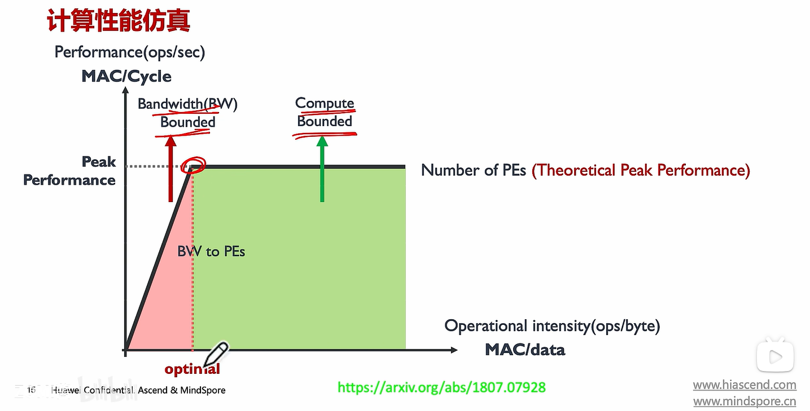

> 视频教程：https://www.bilibili.com/video/BV1DX4y1D7PC
>
> Github链接：https://github.com/chenzomi12/AIInfra/tree/main/01AIChip/01Foundation

## AI计算模式

三大范式：监督、无监督、强化学习

## AI芯片关键指标

> 参考：[假如我的超能力是手搓 GPU，我能搓成个世界首富吗？](https://www.bilibili.com/video/BV1Td6eB5EQr)

着重普及了三个概念：

- 数据传输延迟的重要性
- 硬件原生算子支持：普通 CUDA Core 一次算一个标量，灵活，但效率不极致；而Tensor Core 是为“矩阵乘加”而生的专用加速器
- 软硬件生态：CUDA为什么是护城河，国产GPU又是如何应对生态的

### 常见显卡

> 参考：[[硬件扫盲] GPU 核心参数及对比，4090/5090/A100/H100 M4 Max 芯片，显存带宽、算力、卡间通信](https://www.bilibili.com/video/BV16Fr2BPEdo)

| 特性参数                        | **RTX 4090**  (Consumer Flagship) | **RTX 5090**  (**New** Consumer Flagship) | **RTX Pro 6000 Blackwell**         | **NVIDIA A100**  (SXM 80GB)         | **NVIDIA A800**  (China Export Version) | **NVIDIA H100**  (SXM Version)     | **NVIDIA H200**  (**The New King**) | **Apple M4 Max**  (Unified Memory) | **核心差异 (针对 RL & LLM 研究)**                            |
| ------------------------------- | ------------------------------------ | -------------------------------------------- | ------------------------------------- | -------------------------------------- | ------------------------------------------ | ------------------------------------- | -------------------------------------- | ------------------------------------- | ------------------------------------------------------------ |
| **架构**                        | **Ada Lovelace (SM 8.9)**            | **Blackwell(SM 12.0)**                       | **Blackwell(SM 12.0)**                | **Ampere (SM 8.0)**                    | **Ampere (SM 8.0)**                        | **Hopper(SM 9.0)**                    | **Hopper(SM 9.0)**                     | **N/A**                               |                                                              |
| **浮点算子支持**                | FP32/TF32/FP16/BF16/**FP8**          | FP32/TF32/FP16/BF16/**FP8/FP6/FP4**          | FP32/TF32/FP16/BF16/**FP8/FP6/FP4**   | FP32/TF32/FP16/BF16                    | FP32/TF32/FP16/BF16                        | FP32/TF32/FP16/BF16/**FP8**           | FP32/TF32/FP16/BF16/**FP8**            |                                       | Ada Lovelace（40系）/Hopper之后引入了硬件FP8，极大提升了LLM推理速度，目前已广泛应用。Blackwell（50系）之后引入了硬件FP6/FP4，目前只有少量模型支持，仍处于“**战未来**”阶段。 |
| **显存带宽**                    | **1,008 GB/s**                       | **1,792 GB/s**                               | **1792 GB/s**                         | **2,039 GB/s**                         | **2,039 GB/s**                             | **3,350 GB/s**                        | **4,800 GB/s**                         | **546 GB/s**                          | **最核心差异**。H100 带宽是 4090 的 3.3 倍，直接决定 LLM 推理速度上限。 **[5090]** 带宽暴涨 78%，接近 A100 水平，推理速度将有质变。 **[H200]** 搭载 HBM3e，带宽提升 40% 达到 4.8TB/s，是目前业界最高吞吐，彻底释放 LLM 生成速度。 **[A800]** 显存带宽未被阉割，与 A100 一致，单卡推理性能基本无损。 **[M4 Max]** 虽不及独立显卡，但在移动端/SoC 中极强，带宽约为 4090 的一半，优于绝大多数消费级 CPU 方案。 |
| **显存容量**                    | **24 GB**                            | **32 GB**                                    | **96GB**                              | **80 GB**                              | **80 GB**                                  | **80 GB**                             | **141 GB**                             | **Up to 128 GB**  (Unified)        | 4090 无法全参数微调 70B 级模型；A100/H100 可容纳大 Batch Size 训练。 **[5090]** 32GB 虽仍不够全微调 70B，但可容纳 70B 量化模型及更长 Context。 **[H200]** 141GB 是质变，单卡即可运行 **Llama-3-70B (FP16/BF16)** 而无需量化，推理 KV Cache 容量翻倍。 **[A800]** 容量与 A100 一致，大模型微调的显存优势依然存在。 **[M4 Max]** **最大亮点**。统一内存架构 (UMA) 允许 CPU/GPU 共享高达 128GB 显存，是运行超大模型 (如 Llama-3-120B 量化版) 成本最低的方案，但仅限推理。 |
| **显存类型**                    | GDDR6X                               | **GDDR7**                                    | **GDDR7**                             | HBM2e                                  | HBM2e                                      | HBM3                                  | **HBM3e**                              | LPDDR5X-8533                          | HBM (High Bandwidth Memory) 就像把显存堆叠在芯片旁，延迟低、吞吐大。 **[5090]** GDDR7 进一步拉近了与 HBM 的延迟和带宽差距。 **[H200]** HBM3e 是目前最快显存技术，专为解决"内存墙"问题而生。 **[A800]** 与 A100 相同，维持了高带宽低延迟特性。 **[M4 Max]** 使用片上封装的高频 LPDDR5X，延迟极低，但物理原理上仍略逊于 HBM 堆叠。 |
| **显存位宽**                    | 384-bit                              | **512-bit**                                  | **512-bit**                           | **5,120-bit**                          | **5,120-bit**                              | **5,120-bit**                         | **6,144-bit**                          | 512-bit                               | 4090 靠高频 (21Gbps) 跑数据；H100 靠极宽的车道 (5120-bit) 跑数据。 **[5090]** 回归 512-bit 宽车道，基础物理通道更宽。 **[H200]** 激活了第 6 颗 HBM 堆栈，物理位宽进一步拓宽至 6144-bit。 **[A800]** 位宽未阉割，数据吞吐能力保留。 **[M4 Max]** 虽为 SoC，但 512-bit 位宽已达到顶级桌面显卡 (如 5090) 的水平，保障了数据吞吐。 |
| **显存频率**                    | ~1,313 MHz (等效 **21 Gbps**)     | ~1,750 MHz (等效 **28 Gbps**)             | ~1,750 MHz (等效 **28 Gbps**)      | ~1,512 MHz (等效 **3.2 Gbps**)      | ~1,512 MHz (等效 **3.2 Gbps**)          | ~1,313 MHz (等效 **5.3 Gbps**)     | ~1,313 MHz (等效 **6.3 Gbps**)      | 8,533 Mbps                            | GDDR6X 虽频率极高，但位宽太窄，总吞吐量依然不如 HBM。 **[5090]** 依靠 GDDR7 的超高频 (28Gbps+) 再次拔高吞吐上限。 **[H200]** 频率并未大幅提升，主要靠位宽和 HBM3e 技术提升效率。 **[A800]** 频率与 A100 一致。 **[M4 Max]** 依靠极高的 LPDDR 频率弥补带宽，但在"大规模并行读写"上仍不如 HBM 架构。 |
| **CUDA Cores**                  | 16,384                               | **21,760**                                   | **24576**                             | 6,912                                  | 6,912                                      | 16,896                                | 16,896                                 | **N/A**  (40 GPU Cores)            | 4090 的 FP32 通用计算极强，适合 RL 环境仿真 (Isaac Gym) 等计算密集型任务。 **[5090]** 核心数激增 ~33%，单卡仿真效率进一步碾压计算卡。 **[H200]** 计算核心与 H100 完全相同 (Hopper 架构)，算力无本质区别。 **[A800]** 核心数未变，单卡计算能力 (FP32) 与 A100 相同。 **[M4 Max]** 无 CUDA 核心，主要依靠 Metal/MPS 加速。RL 仿真 (Isaac Gym/Sim) 兼容性较差，不适合需要大量 CUDA 交互的训练任务。 |
| **Tensor Cores**                | 512 (第 4 代)                        | 680 （第 5 代）                              | 752 （第 5 代）                       | 432 (第 3 代)                          | 432 (第 3 代)                              | 528 (第 4 代)                         | 528 (第 4 代)                          | **N/A**  (16 NPU Cores)            | 4090/H100 支持 **FP8** 精度训练/推理；A100 最低只支持 BF16/FP16。 **[5090]** 新增支持 **FP4**，为未来的极低精度推理做好了准备。 **[H200]** 与 H100 一样支持 FP8，但在显存受限的场景下（Memory Bound），Tensor Core 利用率更高。 **[A800]** Tensor Core 数量与 A100 一致，矩阵运算理论峰值未变。 **[M4 Max]** 依靠 Neural Engine (NPU) 加速 INT8/FP16，推理能效极高，但缺乏 Tensor Core 带来的训练加速通用性。 |
| **BF****16** **/ FP16****算力** | 165 TFLOPS                           | 210 TFLOPS                                   | 504 TFLOPS                            | 312 TFLOPS                             | 312 TFLOPS                                 | 989 TFLOPS                            | 989 TFLOPS                             | ~35 TFLOPS  (Est. GPU)             | H100 在矩阵运算上遥遥领先；但 4090 单卡算力其实略强于 A100。 **[5090]** 算力翻倍，理论指标已超越 A100，逼近 H100/H200。 **[H200]** 算力指标与 H100 一致，优势全在数据搬运速度上。 **[A800]** 算力未受限，主要算力指标与 A100 相同。 **[M4 Max]** 纯算力显著弱于 NVIDIA 旗舰卡 (约差一个数量级)，不适合从头训练模型，但在做 Batch Size=1 的推理时，算力通常不是瓶颈。 |
| **FP8 算力**                    | 660 TFLOPS                           | ～838 TFLOPS                                 | 1008 TFLOPS                           | N/A                                    | N/A                                        | 1979 TFLOPS                           | 1979 TFLOPS                            |                                       | Nvidia从Adalovelace架构(SM>8.9)开始硬件支持FP8计算，目前已经在推理端大规模使用。 |
| **FP4算力**                     | N/A                                  | ～1676FLOPS                                  | 2015 TFLOPS                           | N/A                                    | N/A                                        | N/A                                   | N/A                                    |                                       |                                                              |
| **PPT算力**                     | **1,321 TFLOPS** (FP8算力 * 稀疏2倍) | **3352 TFLOPS**(FP4 算力 * 稀疏2倍)          | **4030 TFLOPS**（FP4 算力 * 稀疏2倍） | **1,248 TFLOPS** (INT8 算力 * 稀疏2倍) | **N/A**                                    | **3,958 TFLOPS** (FP8 算力 * 稀疏2倍) | **N/A**                                |                                       | NVIDIA每次发布会PPT上发布的算力（黄式比较法）                |
| **卡间互联**                    | 不支持 (PCIe Only)                   | **不支持** (PCIe Only)                       | **不支持** (PCIe Only)                | **NVLink (600 GB/s)**                  | **NVLink (400 GB/s)**                      | **NVLink (900 GB/s)**                 | **NVLink (900 GB/s)**                  | **N/A**                               | 4090 做多卡训练效率极低 (通信瓶颈)；SXM 卡专为分布式集群设计。 **[5090]** 依然无 NVLink，多卡扩展性仍是其最大短板。 **[H200]** 维持 H100 的高速互联，完美兼容现有 H100 集群架构。 **[A800]** **关键阉割点**。NVLink 带宽从 600GB/s 降至 400GB/s，导致多卡大规模集群训练时通信效率下降，扩展性不如 A100。 **[M4 Max]** 单体强劲，但无法通过高速互联扩展，仅适合单机任务。 |
| **典型功耗**                    | 450W                                 | **600****/575****W**                         | **600W**                              | 400W                                   | 400W                                       | 700W                                  | 700W                                   | **~70-100W**                          | H100 功耗极高，通常需要专用机房/液冷散热。 **[5090]** 功耗激增，对个人工作站电源和散热提出严苛要求。 **[H200]** 功耗维持不变，能效比（Performance per Watt）显著提升。 **[A800]** 功耗与 A100 相同。 **[M4 Max]** **能效之王**。功耗仅为 NVIDIA 旗舰卡的 1/5 到 1/10，适合本地离线、长续航的推理开发环境。 |

### 相关指标

算力单位：

- OPS：Operations Per Second，处理器每秒的计算次数，进一步，引出TOPS的概念
- MACs：Multiply-Accumulate Operations 乘加累计操作
- FLOPS：Floating Point Operations 浮点运算次数
- MAC：Memory Access Cost 内存占用量

------

关于时延（Latency）：时延指从用户发起请求到模型返回完整响应所需的时间。根据阶段不同，时延可进一步分为

- **首 Token 时延（Time to First Token, TTFT）**：从请求开始到生成第一个输出 Token 的时间。
- **生成时延（Per-Token Latency）**：生成后续每个 Token 的时间。
- **端到端时延（End-to-End Latency）**：从请求开始到完整响应返回的总时间（首 Token 时延 + 所有生成时延）。

**时延与其他指标的关系**

(1) Token 输出速度（Tokens/s）

- 正向关系：Token 输出速度越高，生成时延（每个 Token 的时间）越低。
- 例外：首 Token 时延与 Token 输出速度无关，主要取决于模型初始计算和预处理。

(2) 吞吐量（Throughput）

- 权衡关系：吞吐量（单位时间处理的 Token 数或请求数）与时延通常存在矛盾。
  - 高吞吐量需要增大 Batch Size，但会导致单个请求的时延增加（需等待其他请求完成）。
  - 低时延需要小 Batch Size 或实时处理，但会降低吞吐量。
- 动态批处理（Dynamic Batching）：通过合并请求提高吞吐量，同时尽量控制时延（需平衡调度策略）。

(3) 显存占用

- 显存不足会触发显存交换（如CPU-GPU数据传输），大幅增加时延。

------

优化Latency很重要的两个点：

- 带宽
- 缓存

取计算能力（Compute Capability）和带宽（Bandwidth）的平衡点，让计算性能最大化

它们的关系类似于“木桶效应”——整体性能受限于两者的短板

**瓶颈分析：计算与带宽的平衡**

- **计算密集场景**（如矩阵乘法）
  若芯片计算能力远高于带宽，计算单元会因等待数据而空闲，称为 **“内存墙”（Memory Wall）**。
  例如：计算一个FP16矩阵乘法需要2N³ FLOPS，但仅需3N²字节数据，此时算力利用率取决于带宽能否及时供数。
- **带宽密集场景**（如数据搬运、逐元素操作）
  若带宽不足，即使算力再高也无法发挥，例如激活函数（如ReLU）或数据预处理阶段。

**关键指标：运算强度（Operational Intensity）**

定义为单位数据量所需的计算量（FLOPS/Byte）。芯片的 **“屋顶线模型”（Roofline Model）** 可直观展示性能上限：

- **低运算强度任务**（如向量加法）：性能受限于带宽。
- **高运算强度任务**（如大矩阵乘法）：性能受限于计算能力。

**实际案例分析**

**(1) 矩阵乘法优化（GEMM）**

- **问题**：A100的FP16算力为312 TFLOPS，HBM带宽为1.5 TB/s。对于M=K=N=8192的矩阵乘法：
  - 运算强度 = (2×8192³) / (3×8192²×2 bytes) ≈ 2736 FLOPS/Byte。
  - 理论性能上限 = min(312 TFLOPs, 1.5 TB/s ×2736 FLOPs/Byte) = 312 TFLOPs → **计算能力是瓶颈**。
- **优化**：若使用FP8计算，算力提升至624 TFLOPS，但带宽需求减半，运算强度翻倍 → 可能转为带宽瓶颈，需进一步优化数据搬运。

**(2) Transformer推理优化**

- **挑战**：自注意力机制需要频繁读写KV Cache，带宽压力大。
- **解决方案**：
  - FlashAttention：通过分块计算减少HBM访问次数。
  - PagedAttention（vLLM）：动态管理KV Cache显存，避免碎片化。

## 矩阵计算

> AI计算中最核心的计算，软件和硬件如何提高计算能力？

## 比特位宽

三种量化方法

怎么决定Bit Width？哪些时候采用低Bit？
**Bit Width（位宽）** 的选择直接影响计算效率、功耗、内存占用和模型精度。位宽越低，计算速度和能效通常越高，但可能牺牲模型精度；位宽越高，精度保留越好，但资源消耗更大。以下是决定位宽的关键因素和低Bit适用的典型场景：

略

## 计算体系回顾

> 前面的内容比较零散，此小结负责串通

略

