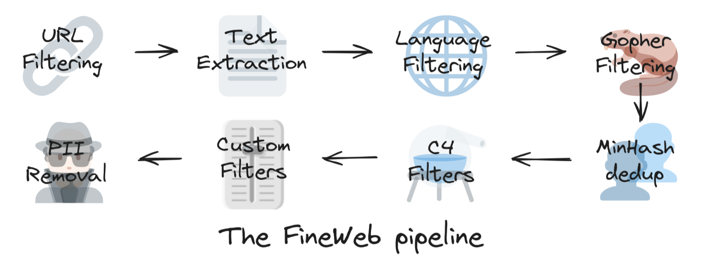
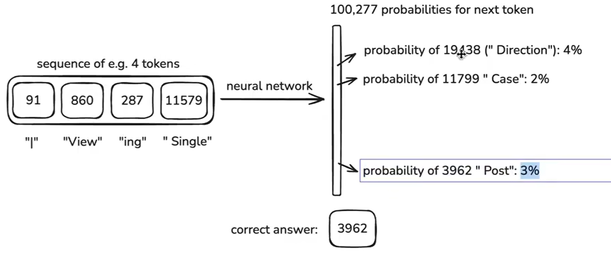
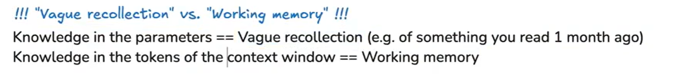
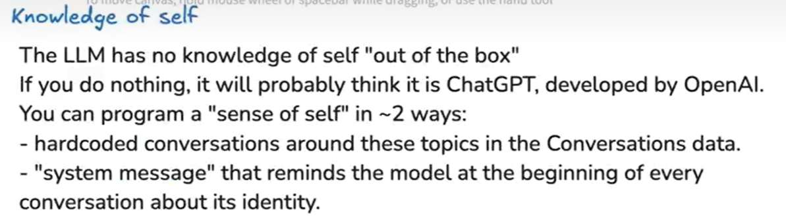
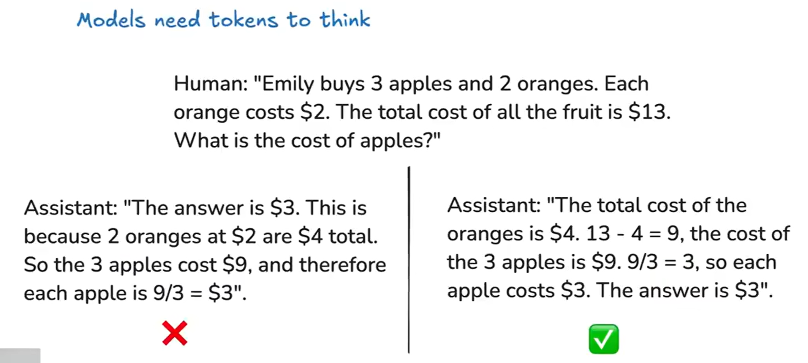
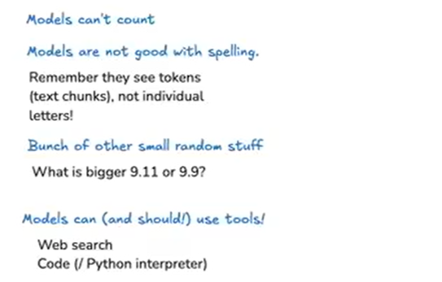
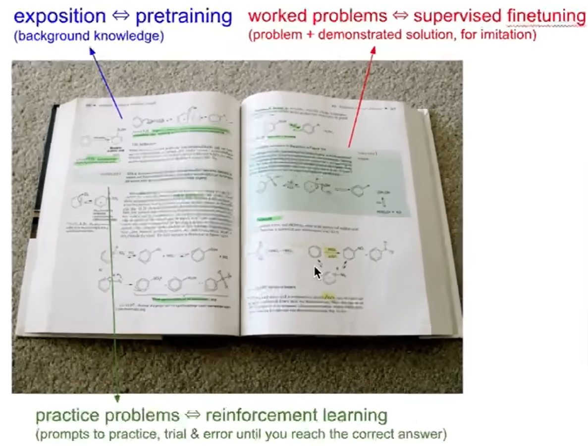

参考资源：

课程资料：

- 总览：[Excalidraw 文稿](https://link.juejin.cn/?target=https%3A%2F%2Fdrive.google.com%2Ffile%2Fd%2F1EZh5hNDzxMMy05uLhVryk061QYQGTxiN%2Fview%3Fusp%3Dsharing)
- 优质笔记：
  - https://juejin.cn/post/7480012979212976166

# 预训练阶段 pre-training

## Step1：download and preprocess the internet

Hugging Face的公司收集并创建了一个名为[FineWeb](https://huggingface.co/spaces/HuggingFaceFW/blogpost-fineweb-v1)的数据集，他们在博客文章中详细介绍了如何构建这个数据集。像OpenAI、Anthropic、Google等主要的LLM（大型语言模型）提供商内部都会有类似FineWeb的数据集。

参考官方文档，FineWeb实现步骤如下：

- url filtering：
- text extraction：
- base filtering：
- .....

## Step2：tokenization

如何实现Tiktokenizer：

体验Tiktokenizer：

为了缩短序列长度，我们运行一种称为**字节对编码（Byte Pair Encoding, BPE）** 的算法。这个算法的基本思想是寻找非常常见的连续字节或符号对。例如，116和32这个序列非常常见，出现频率很高。因此，我们会将这个符号对组合成一个新的符号，赋予它一个新的ID，比如256。

FineWeb，含44TB数据，约15亿万词元

## Step3：neural network training

next token 有 100277个可能性，其中，编号为3962为正确答案，代表“Post”，其概率为3%

我们希望增加其概率，使所有其他次元概率较低

这个过程不仅针对一个词元，而是针对整个数据集中所有词元上

### netural network internals

参考：https://bbycroft.net/llm

可以观察大模型普遍采用的transformer内部结构

### inference

base模型一般不发布，因为他仅仅是完成几个步骤中高低第一步

以GPT-2与Llama-3.1-405B-Base为例，生成Token，提出幻觉等话题

幻觉问题

# 后训练阶段 post-training：supervised finetuning

经过上述操作，得到了Base模型，下一步，我们将其变为助手

## Conversation

如何在token space 中重新创建这个conversation

## Conversation Protocol / Format

## Conversation Datasets

众多SFT数据集，比如UrtalChat

比如ChatGPT-4o的回答（不借助工具），就是结合base模型与后训练，最终的结果

## Hallucinations

尝试理解幻觉是如何产生的？

Meta是如何处理Lama3系列模型的幻觉问题？

1、new training example：训练集中加入“我不知道”，可以减少幻觉

2、tool：

3、

1、神经网络中的参数知识是一种模糊的记忆

2、而构成上下文窗口的知识和词元，则是工作记忆

比如，System Message：你是一个**助手

PS：但即便是加入了推理，依旧是“心算”，正确性并没有保证。在prompt中加入“Use Code”，这样也许会更好些

# post-training RL

> 回顾：
>
> - 预训练阶段：基于互联网上的文档训练一个语言模型，得到一个Base Model，但他只是一个互联网文档，并非助手
> - 后训练阶段：我们可以借助后训练构建一个助手，这个算法过程和预训练相似，主要区别在于数据集
>
> 
>
> 强化学习仍然被认为是后训练的一部分，他也是三大主要阶段之一。
>
> 例如OpenAI，一个团队负责预训练的数据，一个团队负责预训练的训练，一个团队负责后训练的数据（对话文本），一个团队负责后训练的训练（监督微调），还有一个团队负责RL

让LLM去上学！！

比如学习一本书，预训练和后训练类似于把课本学完了（监督微调教会LLM模仿人类回应，但是，一旦模型在互联网数据上完成训练,它仍然不知道如何有效运用其知识），而RL相当于去做练习题

如何评判基于强化学习后训练时的回答？RLHF提出了方法

RLHF 通常分为以下三个步骤：

**1. 预训练（Supervised Fine-Tuning, SFT）**

- 以大量人类编写的数据（比如对话、问答）对模型进行监督式微调。
- 目的是让模型具有基本的语言理解和生成能力。
- 示例：让模型学习“如何回答一个提问”。

**2. 训练奖励模型（Reward Model, RM）(一个标准的监督学习过程)**

- 人类评审者对模型的多个回答进行打分或排序（例如比较哪个回答更好）。
- 使用这些人类偏好数据来训练一个奖励模型，它能够自动为模型输出打分。
- 奖励模型的作用是：**将人类偏好转化为可优化的奖励信号**。

**3. 强化学习优化（RL：PPO 方法）**

- 使用强化学习算法（通常是 **Proximal Policy Optimization, PPO**）来优化模型，使其在奖励模型上获得更高评分。
- 在这个阶段，模型通过探索/更新策略，学习如何更好地生成人类喜欢的输出。
- PPO 保证策略更新不会太剧烈，避免模型“跑偏”。

