## 2011.09 复杂动力学的第一定律

原文地址：[The First Law of Complexodynamics](https://scottaaronson.blog/?p=762)

视频教程：[复杂熵 - 复杂动力学第一法则 | 混沌与秩序之间的新物理定律](https://www.bilibili.com/video/BV1kUaszBEfm)

------

这篇文章探讨了一个有趣的悖论：在一个封闭系统中，熵（混乱度）总是不断增加，而系统的复杂性却经历了一个先增加后减少的过程。不过文章还是猜想。

------

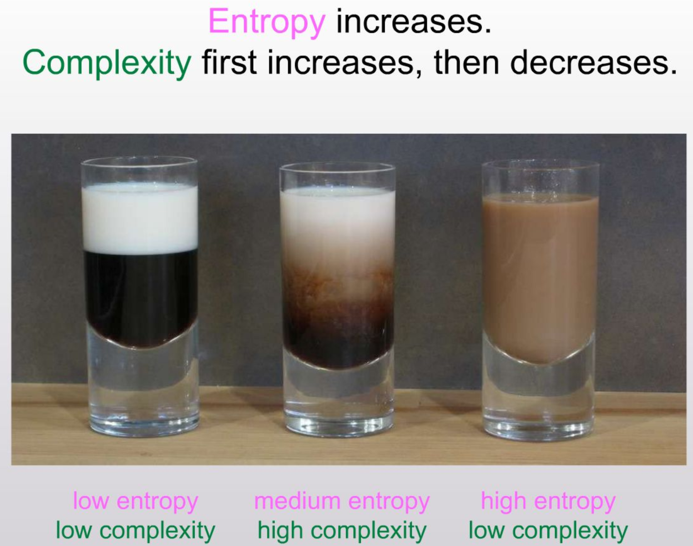

想象你面前有一杯刚冲好的**黑咖啡**，还有一杯**白牛奶**。

1. **第一阶段（开始）：** 你把牛奶倒在咖啡上面，但还没搅拌。这时候，上面是全白，下面是全黑。
   - **描述它很简单**：“上面白，下面黑。”
   - **状态**：很整齐，但也挺无聊的。
2. **第二阶段（中间）：** 你拿勺子搅了两下。
   - **发生了什么？** 咖啡和牛奶开始混合，你看到了极其漂亮的漩涡、云朵一样的纹路，甚至像星云一样的图案。
   - **描述它很难**：你要画出每一条曲线、每一个漩涡的形状，这太复杂了！
   - **状态**：这就是**“复杂”**。它既不是整齐的（不像开始），也不是乱糟糟的（不像最后），它有**结构**，所以最“有趣”。
3. **第三阶段（最后）：** 你搅了一分钟，完全搅匀了。
   - **发生了什么？** 杯子里变成了一杯均匀的浅褐色液体。
   - **描述它很简单**：“这就是一杯褐色的液体。”
   - **状态**：虽然它是最“乱”的（每一滴奶都随机跑到了咖啡里），但因为它哪儿都一样，没有任何图案，所以又变得无聊了。

------

视频将通过一个简单的“牛奶与咖啡混合”的例子，带你了解科学家们为了精确定义“复杂性”所做的各种尝试，从经典的热力学熵、柯氏复杂度（Kolmogorov Complexity），再到“老练度”（Sophistication），并最终引出一个可能存在的、全新的物理定律。 

最关键的是，我们会将这个深刻的概念与人工智能联系起来。你将理解为什么Ilya Sutskever将大语言模型（LLM）视为终极的信息压缩器，以及“复杂动力学第一法则”如何为我们理解智能的本质提供了一个强大的理论框架。

------

Ilya Sutskever 将这个带入LLM，LLM可以视作复杂熵的巅峰。


## 2015.05 循环神经网络的不可思议的有效性

原文地址：https://karpathy.github.io/2015/05/21/rnn-effectiveness/

视频教程：https://www.bilibili.com/video/BV11nHUzUEyS

------

这篇文章充满了魔法：一个简单的RNN模型，仅仅通过逐个字符地学习，就能模仿莎士比亚的戏剧、编写看似合理的Linux代码，甚至生成维基百科条目和数学公式。我们将详细解析RNN的内部工作原理，并通过六个生动有趣的实例，亲眼见证它是如何从零开始掌握语言、风格和复杂结构的。

------

RNN的概念：


------

通过六个生动有趣的实例，亲眼见证它是如何从零开始掌握语言、风格和复杂结构的：

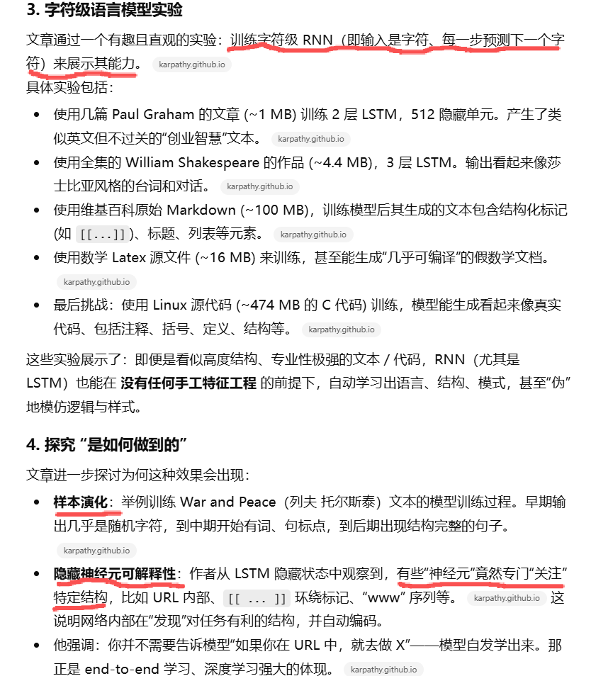

------

未来展望：RNN／LSTM 当前的挑战与研究方向

- 虽然 RNN 很强，但它们主要是“记忆”型，对真正的归纳、推理、抽象能力还不够。
- 传统 RNN 的状态大小与每步计算成本耦合：隐藏状态越大、每步运算越多。理想中希望有大“记忆”但每次更新计算仍维持低成本。
- 提到了 Neural Turing Machine (NTM)、注意力机制（attention）等方向。
- 在视觉、语音、自然语言处理 (NLP) 等领域，RNN/LSTM 正被越来越广泛使用。

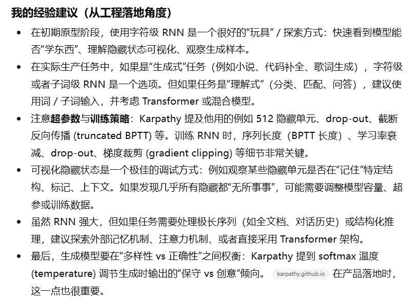

------

下面就是一个**完整可运行的最简字符级 RNN**（只用 NumPy），演示了文章中所说的 **“序列建模”“从字符学习结构”“前向、反向传播”** 等机制。
 你可以直接基于此继续扩展，例如：

- 换成更长的训练文本
- 修改隐藏层大小
- 实现采样生成文本
- 改成 LSTM
- 更接近 Karpathy 文中“字符级语言模型”的实验

```python
import numpy as np

# Minimal character-level RNN demo (no external libraries)

text = "hello world\n"
chars = sorted(list(set(text)))
vocab_size = len(chars)
char_to_ix = {ch:i for i,ch in enumerate(chars)}
ix_to_char = {i:ch for ch,i in char_to_ix.items()}

# Hyperparameters
hidden_size = 32
seq_length = 5
learning_rate = 1e-1

# Model parameters
Wxh = np.random.randn(hidden_size, vocab_size)*0.01
Whh = np.random.randn(hidden_size, hidden_size)*0.01
Why = np.random.randn(vocab_size, hidden_size)*0.01
bh = np.zeros((hidden_size, 1))
by = np.zeros((vocab_size, 1))

def loss_and_gradients(inputs, targets, hprev):
    xs, hs, ys, ps = {}, {}, {}, {}
    hs[-1] = hprev
    loss = 0
    
    # Forward
    for t in range(len(inputs)):
        xs[t] = np.zeros((vocab_size,1))
        xs[t][inputs[t]] = 1
        hs[t] = np.tanh(Wxh @ xs[t] + Whh @ hs[t-1] + bh)
        ys[t] = Why @ hs[t] + by
        ps[t] = np.exp(ys[t]) / np.sum(np.exp(ys[t]))
        loss += -np.log(ps[t][targets[t],0])
    
    # Backward
    dWxh = np.zeros_like(Wxh)
    dWhh = np.zeros_like(Whh)
    dWhy = np.zeros_like(Why)
    dbh = np.zeros_like(bh)
    dby = np.zeros_like(by)
    dhnext = np.zeros_like(hs[0])
    
    for t in reversed(range(len(inputs))):
        dy = np.copy(ps[t])
        dy[targets[t]] -= 1
        dWhy += dy @ hs[t].T
        dby += dy
        dh = Why.T @ dy + dhnext
        dhraw = (1 - hs[t] * hs[t]) * dh
        dbh += dhraw
        dWxh += dhraw @ xs[t].T
        dWhh += dhraw @ hs[t-1].T
        dhnext = Whh.T @ dhraw
    
    # Clip gradients
    for dparam in [dWxh, dWhh, dWhy, dbh, dby]:
        np.clip(dparam, -5, 5, out=dparam)
    
    return loss, dWxh, dWhh, dWhy, dbh, dby, hs[len(inputs)-1]

# Simple training loop
n_iter = 50
hprev = np.zeros((hidden_size,1))
data = [char_to_ix[ch] for ch in text]

for i in range(n_iter):
    idx = 0
    if idx + seq_length + 1 >= len(data):
        hprev = np.zeros((hidden_size,1))
        idx = 0
    inputs = data[idx:idx+seq_length]
    targets = data[idx+1:idx+seq_length+1]
    
    loss, dWxh, dWhh, dWhy, dbh, dby, hprev = loss_and_gradients(inputs, targets, hprev)
    
    # SGD
    Wxh -= learning_rate * dWxh
    Whh -= learning_rate * dWhh
    Why -= learning_rate * dWhy
    bh  -= learning_rate * dbh
    by  -= learning_rate * dby

print(loss)

```

示例结果：

```
0.16299322447956405
```


## 2015.08 理解 LSTM 网络

原文地址：https://colah.github.io/posts/2015-08-Understanding-LSTMs/

------

这篇文章从 RNN（循环神经网络）的问题入手，引出 LSTM（长短期记忆网络，Long Short Term Memory）的设计思路和工作机制。文章结构大致如下：

1. 介绍 RNN：为何 “循环” 是必要的，以及 RNN 的基本结构。 [colah.github.io+1](https://colah.github.io/posts/2015-08-Understanding-LSTMs/)
2. “长期依赖问题”（Long-Term Dependencies）：传统 RNN 在时间跨度较长的依赖上训练困难。 [colah.github.io+1](https://colah.github.io/posts/2015-08-Understanding-LSTMs/)
3. LSTM 的基本思想：引入 cell state（细胞状态）、门控机制（gates）来解决上述问题。 [colah.github.io](https://colah.github.io/posts/2015-08-Understanding-LSTMs/)
4. 详细逐步解析 LSTM 模块内部（按时间步 t）— 忘记门（forget gate）、输入门（input gate）、候选值、状态更新、输出门（output gate）等。 [colah.github.io+1](https://colah.github.io/posts/2015-08-Understanding-LSTMs/)
5. LSTM 的变体（如 peephole connections、GRU 等）简要讨论。 [colah.github.io](https://colah.github.io/posts/2015-08-Understanding-LSTMs/)
6. 总结：LSTM 在很多序列任务上比传统 RNN 好很多，但也不是终极解答，Attention 等机制是下一步。 

------

关键概念与机制解析：

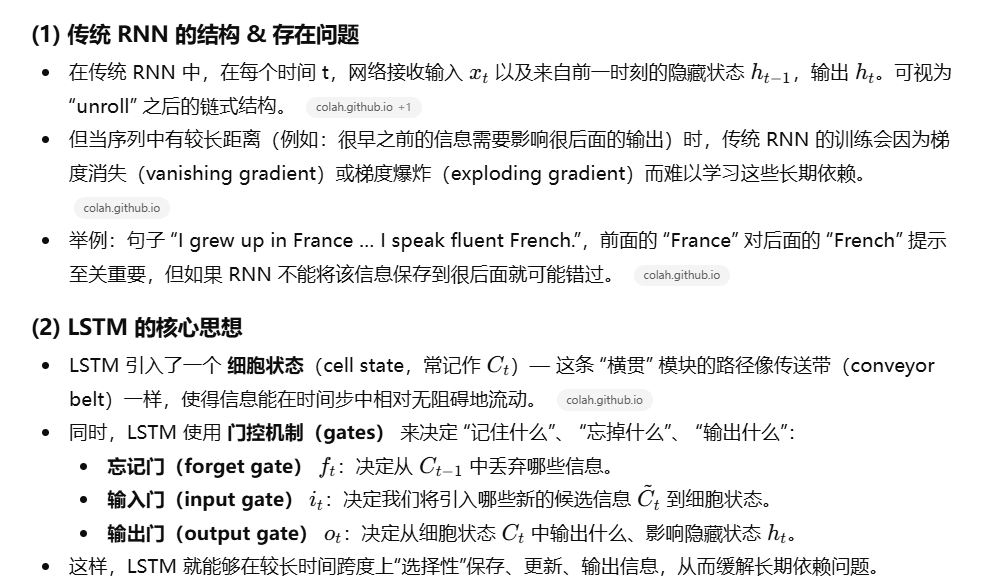

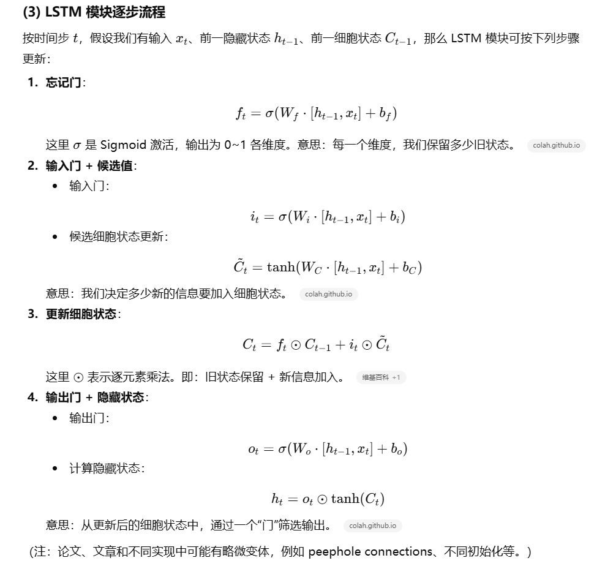

------

以 Python + NumPy 写一个简化版的 LSTM 单元，用于教育理解（并非工业级效率或稳定性），帮助 “落实” 文章中的步骤：

```python
import numpy as np

def sigmoid(x):
    return 1.0 / (1.0 + np.exp(-x))

def tanh(x):
    return np.tanh(x)

class SimpleLSTMCell:
    def __init__(self, input_dim, hidden_dim):
        # 初始化权重（这里为了简化，一次性将 [h_{t-1}, x_t] 连接作为输入）
        self.hidden_dim = hidden_dim
        # 忘记门
        self.W_f = np.random.randn(hidden_dim, hidden_dim + input_dim) * 0.1
        self.b_f = np.zeros((hidden_dim, 1))
        # 输入门
        self.W_i = np.random.randn(hidden_dim, hidden_dim + input_dim) * 0.1
        self.b_i = np.zeros((hidden_dim, 1))
        # 候选 C_t 值
        self.W_C = np.random.randn(hidden_dim, hidden_dim + input_dim) * 0.1
        self.b_C = np.zeros((hidden_dim, 1))
        # 输出门
        self.W_o = np.random.randn(hidden_dim, hidden_dim + input_dim) * 0.1
        self.b_o = np.zeros((hidden_dim, 1))
        
    def forward(self, x_t, h_prev, C_prev):
        """单步 forward，返回 h_t, C_t"""
        concat = np.vstack((h_prev, x_t))
        
        f_t = sigmoid(self.W_f.dot(concat) + self.b_f)
        i_t = sigmoid(self.W_i.dot(concat) + self.b_i)
        C_tilde = tanh(self.W_C.dot(concat) + self.b_C)
        C_t = f_t * C_prev + i_t * C_tilde
        o_t = sigmoid(self.W_o.dot(concat) + self.b_o)
        h_t = o_t * tanh(C_t)
        
        return h_t, C_t

# 测试这个 cell
input_dim = 3
hidden_dim = 5
cell = SimpleLSTMCell(input_dim, hidden_dim)

# 模拟 4 步输入
x_seq = [np.random.randn(input_dim,1) for _ in range(4)]
h = np.zeros((hidden_dim,1))
C = np.zeros((hidden_dim,1))

for t, x_t in enumerate(x_seq):
    h, C = cell.forward(x_t, h, C)
    print(f"step {t}, h = {h.ravel()}, C = {C.ravel()}")

```

说明：

- 这里 `SimpleLSTMCell` 实现了文章所述的四个主要门（忘记、输入、候选、输出）。
- 我们在每一步将前一隐藏状态 `h_prev` 和当前输入 `x_t` 拼接（concatenate）后，用于各个门的计算。
- 测试部分模拟了一个长度为 4 的输入序列。你会看到 `h` 和 `C` 随时间步变化。
- 虽然这个实现未做梯度反向、训练、批量化、稳定化（如梯度裁剪、dropout、LayerNorm 等），但足够用于理解机制。

你也可以扩展：例如多层 LSTM、加上输出层用于分类／回归任务、用真实序列（如文字、时间序列）训练。

------

补充：

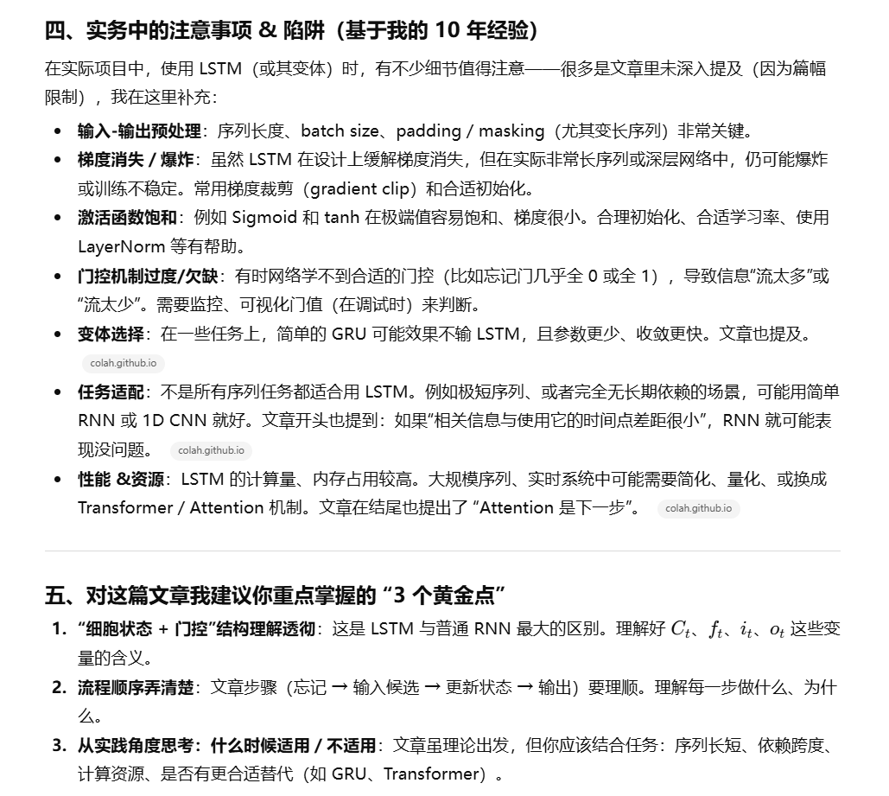


## 2014.09 Recurrent Neural Network Regularization

>We present a simple regularization technique for Recurrent Neural Networks (RNNs) with Long Short-Term Memory (LSTM) units. Dropout, the most successful technique for regularizing neural networks, does not work well with RNNs and LSTMs. In this paper, we show how to correctly apply dropout to LSTMs, and show that it substantially reduces overfitting on a variety of tasks. These tasks include language modeling, speech recognition, image caption generation, and machine translation.

论文地址：https://arxiv.org/abs/1409.2329v5


### 概述

概述1：

- Authors: Wojciech Zaremba, Ilya Sutskever, Oriol Vinyals
- The paper “Recurrent Neural Network Regularization” presents a novel method for applying dropout to Long Short-Term Memory (LSTM) networks to mitigate overfitting. **Traditional dropout techniques are ineffective for Recurrent Neural Networks (RNNs) due to noise amplification in recurrent connections,** which hampers learning. **The authors propose a specialized dropout application that targets only non-recurrent connections in LSTMs, preserving the network’s ability to retain information over long sequences while reducing overfitting.**
- The study demonstrates significant performance improvements across various tasks, including language modeling, speech recognition, machine translation, and image caption generation. In language modeling, regularized LSTMs achieved **better word-level perplexity** on the Penn Tree Bank dataset **compared to non-regularized models.** The medium and large regularized LSTMs showed **substantial reductions in perplexity**, highlighting the efficacy of the proposed method.
- **For speech recognition**, the authors tested their method on an internal Google Icelandic Speech dataset, showing that dropout improves **frame accuracy**, a critical metric correlating with Word Error Rate (WER). Regularized LSTMs achieved **better generalization**, indicating the potential of the proposed regularization technique for improving acoustic modeling.
- **In machine translation**, the method was evaluated on the WMT’14 English to French dataset. The regularized LSTM outperformed non-regularized models, demonstrating **higher BLEU scores**, which measure translation quality. Although the regularized LSTM **did not surpass the phrase-based LIUM SMT system**, the results affirmed that dropout enhances translation performance.
- **The image caption generation task** involved testing the dropout variant on an LSTM model that **converts image vectors into captions**. The authors used the MSCOCO dataset for this evaluation. The results showed that dropout helps **improve caption quality**, with regularized models performing comparably to model ensembles.
- Overall, the paper establishes that correctly applying dropout to LSTMs effectively reduces overfitting and enhances performance across diverse applications. The authors suggest that this approach can be extended to other RNN architectures, potentially broadening the scope of improved regularization in neural networks.

------

**核心问题**：传统的 dropout（在前馈网络上非常成功）**直接应用到 RNN/LSTM 的“所有连接”会损害记忆能力**，因为 dropout 随时间逐步干扰循环状态，长期记忆被噪声冲淡，从而 RNN 难以保留跨很长步的信息。

**主要贡献 / 结论**：

1. **只对非循环（non-recurrent）连接施加 dropout**：也就是对 *输入→隐藏* 或 *隐藏→输出 / 层间* 的连接使用 dropout，但**不要对隐藏→隐藏（recurrent）连接使用 dropout**。这种做法既能获得 dropout 的正则化效果，又不会破坏跨时间步的记忆传递。
2. **直观原因**：如果在循环（隐藏→隐藏）上 dropout，则一个通过多个时间步向后传播的信息会在每一步都被置零的概率影响，噪声随着时间被“放大”，导致长时记忆难以学习；而把 dropout 限于非循环连接，信息沿时间流动时只会被固定次数（与网络深度有关）所扰动，不依赖于跨越时序长度。论文用图与解析解释了这一点。
3. **实证结果**：在若干任务（PTB 语言建模、语音识别、英法翻译、图像描述）上，按上述方法 regularize 的 LSTM 显著降低过拟合并提升验证 / 测试性能（论文给出 PTB 上 perplexity 与 Machine Translation 的 BLEU 等表格作为证据）。例如在 PTB 上，regularized LSTM 显著优于非正则化 LSTM（文中给出数值表格）。

**论文代码与复现**：作者提供了代码链接 (GitHub) 并在论文中给出训练细节（超参、梯度裁剪、学习率 schedule 等），这有助于复现实验。

------

简要说明：

- 设想一条信息从时间 t0 经由 LSTM 传到时间 t10。如果在**循环权重**上做 dropout，那么每一个时间步都有可能“断掉”或放大噪声，使得跨时间的信息被严重破坏。
- 如果我们只在 **输入 embedding → LSTM** 或 **LSTM 输出 → 全连接** 上做 dropout（且对于多层 LSTM，只在层间的 “非循环” 路径上做 dropout），那么这条信息在时间流动时并不会在每一步被随机扰动，从而保留长期依赖能力，同时仍可获得 dropout 带来的抗过拟合效果。


### 示例代码

------

示例代码1：**PyTorch 示例（推荐）** — 逼近论文中“对非循环连接 dropout”的实现思路（在 embedding 和输出 projection 上使用 dropout，而不使用 `nn.LSTM` 的 `dropout` 来干扰循环）。请在本地有 PyTorch 环境时运行（例如 `pip install torch`）。

```python
# rnn_dropout_demo_pytorch.py
# 依赖: torch, matplotlib
# pip install torch matplotlib

import random
import numpy as np
import torch
import torch.nn as nn
from torch.utils.data import DataLoader, Dataset
import matplotlib.pyplot as plt

# reproducibility
seed = 42
random.seed(seed)
np.random.seed(seed)
torch.manual_seed(seed)

# tiny synthetic dataset
V = 50
L = 8
train_n = 200
val_n = 1000

def make_dataset(n):
    X = np.random.randint(0, V, size=(n, L))
    # simple target: sum of tokens mod V -> task learnable
    y = (X.sum(axis=1) % V).astype(np.int64)
    return X, y

X_train, y_train = make_dataset(train_n)
X_val, y_val = make_dataset(val_n)

class SeqDataset(Dataset):
    def __init__(self, X, y):
        self.X = torch.tensor(X, dtype=torch.long)
        self.y = torch.tensor(y, dtype=torch.long)
    def __len__(self):
        return len(self.X)
    def __getitem__(self, idx):
        return self.X[idx], self.y[idx]

train_loader = DataLoader(SeqDataset(X_train, y_train), batch_size=64, shuffle=True)
val_loader = DataLoader(SeqDataset(X_val, y_val), batch_size=256, shuffle=False)

class TinyLSTM(nn.Module):
    def __init__(self, vocab_size, emb=32, hid=64, drop_p=0.0):
        super().__init__()
        self.embed = nn.Embedding(vocab_size, emb)
        # note: do not set dropout inside LSTM (that would apply between layers / or to recurrent part)
        self.lstm = nn.LSTM(input_size=emb, hidden_size=hid, num_layers=1, batch_first=True)
        self.input_dropout = nn.Dropout(p=drop_p)   # NON-recurrent dropout (input->LSTM)
        self.output_dropout = nn.Dropout(p=drop_p)  # NON-recurrent dropout (LSTM->fc)
        self.fc = nn.Linear(hid, vocab_size)
    def forward(self, x):
        e = self.embed(x)           # (batch, seq_len, emb)
        e = self.input_dropout(e)   # dropout on inputs only
        out, _ = self.lstm(e)       # recurrent weights untouched by dropout
        h = out[:, -1, :]           # use last timestep
        h = self.output_dropout(h)  # dropout before final layer
        return self.fc(h)

def train(model, loader, opt, loss_fn):
    model.train()
    total = 0.0
    for xb, yb in loader:
        logits = model(xb)
        loss = loss_fn(logits, yb)
        opt.zero_grad()
        loss.backward()
        torch.nn.utils.clip_grad_norm_(model.parameters(), 5.0)
        opt.step()
        total += loss.item() * xb.size(0)
    return total / len(loader.dataset)

def evaluate(model, loader, loss_fn):
    model.eval()
    total = 0.0
    with torch.no_grad():
        for xb, yb in loader:
            logits = model(xb)
            loss = loss_fn(logits, yb)
            total += loss.item() * xb.size(0)
    return total / len(loader.dataset)

def run_experiment(drop_p):
    model = TinyLSTM(V, emb=32, hid=128, drop_p=drop_p)
    opt = torch.optim.Adam(model.parameters(), lr=1e-3)
    loss_fn = nn.CrossEntropyLoss()
    train_losses, val_losses = [], []
    for epoch in range(12):
        tr = train(model, train_loader, opt, loss_fn)
        va = evaluate(model, val_loader, loss_fn)
        train_losses.append(tr)
        val_losses.append(va)
        print(f"drop={drop_p} epoch={epoch+1} train={tr:.4f} val={va:.4f}")
    return train_losses, val_losses

if __name__ == "__main__":
    tr_no, va_no = run_experiment(0.0)
    tr_do, va_do = run_experiment(0.5)

    plt.plot(tr_no, label='train no-drop')
    plt.plot(va_no, label='val no-drop')
    plt.plot(tr_do, label='train drop p=0.5')
    plt.plot(va_do, label='val drop p=0.5')
    plt.legend()
    plt.xlabel("Epoch")
    plt.ylabel("Cross-Entropy Loss")
    plt.title("Dropout on non-recurrent connections (toy demo)")
    plt.show()

```

------

示例代码2：**NumPy 极简演示（即时可跑）** — 用非常小的 RNN（非 LSTM）和简单梯度步骤示例化“对输入做 dropout vs 不做”的差异，便于在没有深度学习框架时直观观察训练/验证损失的行为差异。

```python
# rnn_dropout_demo_numpy.py
# 只需标准 Python + numpy + matplotlib

import numpy as np
import random
import matplotlib.pyplot as plt

np.random.seed(0)
random.seed(0)

V = 30   # vocab size
L = 6
train_n = 150
val_n = 500

def make_dataset(n):
    X = np.random.randint(0, V, size=(n, L))
    y = (X.sum(axis=1) % V)
    return X, y

X_tr, y_tr = make_dataset(train_n)
X_va, y_va = make_dataset(val_n)

# one-hot embeddings
def one_hot_batch(X):
    b, L = X.shape
    o = np.zeros((b, L, V), dtype=float)
    for i in range(b):
        o[i, np.arange(L), X[i]] = 1.0
    return o

# tiny RNN params
H = 40
Wx = np.random.randn(V, H) * 0.1  # input->hidden
Wh = np.random.randn(H, H) * 0.1  # hidden->hidden (recurrent)
Wo = np.random.randn(H, V) * 0.1  # hidden->output
bh = np.zeros(H)
bo = np.zeros(V)

def softmax(x):
    e = np.exp(x - x.max(axis=1, keepdims=True))
    return e / e.sum(axis=1, keepdims=True)

def forward_batch(X, dropout_p=0.0):
    # X: (batch, L)
    B = X.shape[0]
    xoh = one_hot_batch(X)  # (B,L,V)
    h = np.zeros((B, H))
    for t in range(L):
        xt = xoh[:, t, :]                   # (B,V)
        if dropout_p > 0:
            mask = (np.random.rand(*xt.shape) >= dropout_p).astype(float) / (1.0 - dropout_p)
            xt = xt * mask
        h = np.tanh(xt.dot(Wx) + h.dot(Wh) + bh)
    logits = h.dot(Wo) + bo
    probs = softmax(logits)
    return probs, h

def loss_and_acc(X, y, dropout_p=0.0):
    probs, _ = forward_batch(X, dropout_p=0.0)  # eval w/o dropout
    # cross-entropy
    idx = np.arange(len(y))
    loss = -np.mean(np.log(probs[idx, y] + 1e-12))
    preds = probs.argmax(axis=1)
    acc = (preds == y).mean()
    return loss, acc

# Very simple "training" to show trends (not full gradient descent impl) - we just update Wo a bit
def train_epoch(Wo, lr=0.03, dropout_p=0.0):
    # simple finite-diff-ish update on Wo to keep code short (not recommended for real training)
    # This is intentionally simplistic: the goal is to see train vs val loss trends changing with dropout.
    for i in range(0, train_n, 30):
        xb = X_tr[i:i+30]
        probs, h = forward_batch(xb, dropout_p=dropout_p)
        # gradient for Wo from cross-entropy
        yb = y_tr[i:i+30]
        B = len(yb)
        target = np.zeros_like(probs)
        target[np.arange(B), yb] = 1.0
        grad = h.T.dot(probs - target) / B
        Wo -= lr * grad
    return Wo

# run small experiments
epochs = 20
Wo1 = Wo.copy()
train_losses_0, val_losses_0 = [], []
for e in range(epochs):
    Wo1 = train_epoch(Wo1, lr=0.05, dropout_p=0.0)
    l_tr, _ = loss_and_acc(X_tr, y_tr, dropout_p=0.0)
    l_va, _ = loss_and_acc(X_va, y_va, dropout_p=0.0)
    train_losses_0.append(l_tr); val_losses_0.append(l_va)

# with input dropout during training
Wo2 = Wo.copy()
train_losses_1, val_losses_1 = [], []
for e in range(epochs):
    Wo2 = train_epoch(Wo2, lr=0.05, dropout_p=0.4)  # training uses input dropout
    l_tr, _ = loss_and_acc(X_tr, y_tr, dropout_p=0.0)
    l_va, _ = loss_and_acc(X_va, y_va, dropout_p=0.0)
    train_losses_1.append(l_tr); val_losses_1.append(l_va)

plt.plot(train_losses_0, label="train no-drop")
plt.plot(val_losses_0, label="val no-drop")
plt.plot(train_losses_1, label="train input-drop")
plt.plot(val_losses_1, label="val input-drop")
plt.legend(); plt.xlabel("Epoch"); plt.ylabel("Loss"); plt.title("NumPy toy demo")
plt.show()

```

------


### QA

#### 1）关于 non-recurrent

概述：

- 👉 **“非循环（non-recurrent）连接” = 不沿时间传播信息的连接**
  - 对它们 dropout，只会影响某一时间步，不会破坏长时记忆。
- 👉 **“循环（recurrent）连接” = 负责把记忆从前一时刻传到下一时刻的连接**
  - 对它 dropout，就是在时间上的记忆链路上制造随机断裂，会毁掉 RNN/LSTM 的能力。

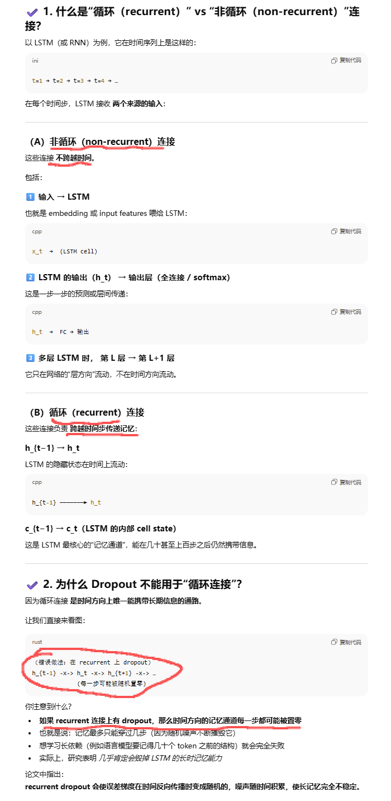

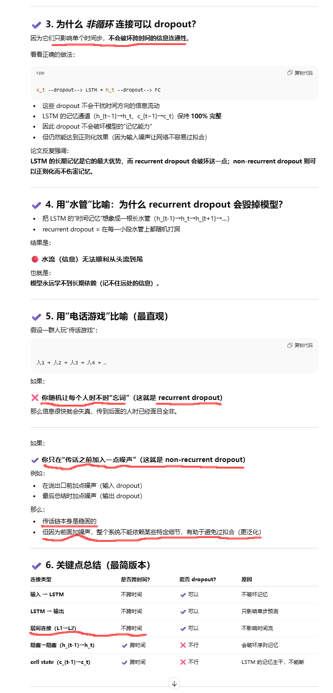


#### 2）层间连接（L1 → L2）不跨时间

👉 “跨层连接”发生在**同一时间步**，仅用于把当前时间步的特征在不同深度间传递，不涉及跨时间的记忆流动，所以不是 recurrent。

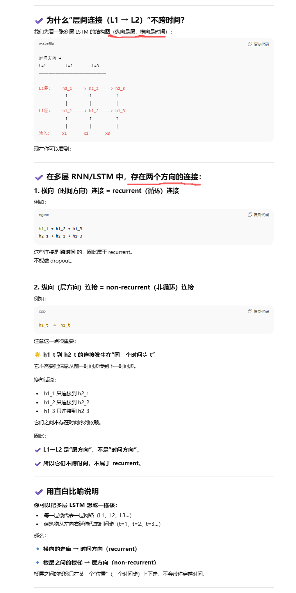

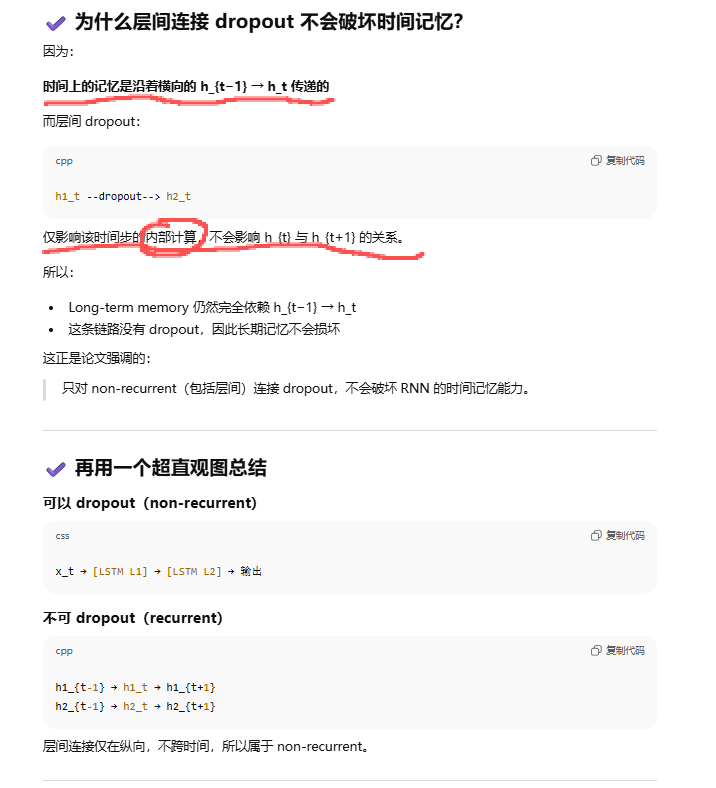


## 1993.08 Keeping Neural Networks Simple by Minimizing the Description Length of the Weights

论文地址：https://www.cs.toronto.edu/~hinton/absps/colt93.pdf


### 概述

概述1：

- Authors: Geoffrey E. Hinton and Drew van Camp
- The paper “Keeping Neural Networks Simple by Minimizing the Description Length of the Weights” by Hinton and van Camp introduces **a method to regularize neural networks by penalizing the information content in the weights**. The key idea is to **add Gaussian noise to the weights and adapt the noise level during training** to balance the trade-off between the network’s error and the complexity of the weights.
- The Minimum Description Length (MDL) Principle underpins this method, suggesting that the best model minimizes the total cost of describing both the model and the errors it makes. For neural networks, this translates to minimizing the bits required to encode the weights and the discrepancies between the predicted and actual outputs.
- By applying Gaussian noise to the weights, the authors effectively control the precision of weight values. This approach helps in reducing overfitting, especially in scenarios with limited training data. The noise level is adjusted to optimize the network’s performance while keeping the weights as simple as possible.
- The method involves computing the derivatives of both the expected squared error and the information content in the weights. These derivatives are calculated efficiently without resorting to time-consuming Monte Carlo simulations, provided the output units are linear.
- The authors introduce the concept of “noisy weights” where adding Gaussian noise allows for a more compact encoding of the weights. This noisy weight approach leverages the MDL principle to communicate weights more efficiently, balancing the trade-off between weight precision and the network’s error.
- The study explores the application of this technique across different tasks, including language modeling, speech recognition, and image caption generation. The results show that the proposed regularization method significantly improves generalization by reducing overfitting.
- Additionally, the paper discusses the benefits of using an adaptive mixture of Gaussians for encoding the weights. This mixture model adapts to the distribution of the weights during training, further enhancing the network’s ability to generalize from limited data.
- Preliminary experiments on a high-dimensional task with scarce training data demonstrate that the new method allows for fitting complex non-linear models effectively. The results suggest that this approach is slightly better than traditional weight-decay methods, offering a new perspective on regularizing neural networks.
- The authors conclude by acknowledging that while the new method shows promise, more experimental work is needed to determine its competitiveness with other statistical techniques for handling non-linear tasks with limited training data. They also highlight the potential for further refinements to enhance its performance.

------

概述2：

- **核心想法 — 最小描述长度（MDL）**
   MDL 原则认为：最好模型是能同时最短地**描述模型本身**（也就是权重所需的位数）和**描述数据误差**（模型预测与真实标签之间差值）的模型。换句话说，不能只追求训练误差小，还要保证权重本身“简单”（信息量小），因为权重越复杂越容易过拟合。
- **把描述长度和常见损失联系起来**
  - 如果把数据误差（每个输出的误差）假设为高斯噪声，那么用 MDL 最小化数据误差的项等价于最小化均方误差（MSE）。（论文公式 1–3）
  - 如果把权重的先验假设为零均值高斯分布，权重的描述长度（log 概率）是与权重平方和成正比的——这就是常见的 **weight decay / L2 正则化**。（论文公式 4）
- **缺点与改进**
  - 简单的 weight decay 假设所有权重都以相同精度编码（相同的方差），这忽略了“权重可以用不同精度编码”的事实。有些权重可以很粗糙（高方差）地表示而不影响输出；有些权重必须很精确（低方差）。如果能为每个权重（或每组权重）选择合适的精度，会更节省比特，从而更好地平衡模型复杂度和训练误差。
  - 论文提出对权重使用**带噪声的后验分布**（posterior Q），也就是把权重看成随机变量 $w \sim Q(w)$，并同时把编码先验 $P(w)$ 设为高斯。要最小化的目标变为：期望（在 Q 下）数据误差 + 编码成本（即 $\text{KL}(Q\|P)$ 或不对称散度）。这实际上是变分视角 / 贝叶斯思路的雏形。
- **“noisy weights” 的直觉**
  - 允许权重带有方差（噪声）意味着：某些权重的 posterior 方差会变大（表明这个权重可以粗略编码），从而降低编码成本，但会增加数据误差的期望值。训练的目标是平衡这两者——这是 MDL 的自然诠释。
- **实际计算**
  - 论文在“有一层隐藏层且输出层线性”的架构下，提出了可以精确计算期望误差与其导数的方法，从而避免昂贵的蒙特卡洛估计（在当时非常关键）。现代实践中通常用蒙特卡洛采样或重参数化技巧（reparameterization trick）来近似计算期望项并对均值和方差做梯度更新（这与论文思路一致）。

直观比喻：

- 把模型的每个权重看成“我们要发送给接收者的数”。有两件事要付费：发送权重本身（越精确越贵）和发送模型对训练数据的剩余误差。MDL 要我们用最少的总位数完成两件事：编码模型 + 编码误差。允许对某些权重“马虎”一些（噪声大）可以节省位数，但会让误差稍微增大。合适的折中就是最好的模型。


### 示例代码

下面代码演示三种方法在一个一维回归（toy）上的对比：

- **Plain MLP**：只最小化 MSE。
- **Weight-decay MLP**：MSE + L2（代表论文里的固定方差先验）。
- **Variational / Noisy-weights MLP**：每层用参数化的 posterior（均值 + 方差标量），训练时把目标设为期望 MSE（用采样近似）+ KL(Q||P)。

```python
# 可复制到本地或 Colab 运行（需要安装 PyTorch）
import torch, math
import torch.nn as nn
import torch.optim as optim
torch.manual_seed(1)

# --- 生成 toy 数据 ---
def make_toy(n=120):
    x = torch.linspace(-4, 4, n).unsqueeze(1)
    y = (torch.sin(x*1.5) + 0.3*torch.randn_like(x)).float()
    return x.float(), y.float()

x_train, y_train = make_toy(120)
x_val, y_val = make_toy(120)

device = torch.device("cpu")
x_train, y_train, x_val, y_val = [t.to(device) for t in (x_train, y_train, x_val, y_val)]

# --- 普通 MLP ---
class MLP(nn.Module):
    def __init__(self, hidden=8):
        super().__init__()
        self.net = nn.Sequential(nn.Linear(1, hidden), nn.Tanh(), nn.Linear(hidden, 1))
    def forward(self, x): return self.net(x)

# --- 变分 / 带噪声权重的 MLP ---
class VariationalMLP(nn.Module):
    def __init__(self, hidden=8, prior_var=1.0):
        super().__init__()
        # mu parameters (means) for each weight tensor/bias
        self.fc1_mu = nn.Parameter(torch.randn(hidden, 1)*0.1)
        self.fc1_bias_mu = nn.Parameter(torch.zeros(hidden))
        self.fc2_mu = nn.Parameter(torch.randn(1, hidden)*0.1)
        self.fc2_bias_mu = nn.Parameter(torch.zeros(1))
        # one scalar log-variance per layer (简化，便于观察)
        self.logvar1 = nn.Parameter(torch.tensor(-6.0))
        self.logvar2 = nn.Parameter(torch.tensor(-6.0))
        self.prior_var = prior_var

    def sample_weights(self):
        w1 = self.fc1_mu + torch.randn_like(self.fc1_mu) * torch.exp(0.5*self.logvar1)
        b1 = self.fc1_bias_mu + torch.randn_like(self.fc1_bias_mu) * torch.exp(0.5*self.logvar1)
        w2 = self.fc2_mu + torch.randn_like(self.fc2_mu) * torch.exp(0.5*self.logvar2)
        b2 = self.fc2_bias_mu + torch.randn_like(self.fc2_bias_mu) * torch.exp(0.5*self.logvar2)
        return w1, b1, w2, b2

    def forward_with_sample(self, x):
        w1, b1, w2, b2 = self.sample_weights()
        h = torch.tanh(x @ w1.t() + b1)
        y = h @ w2.t() + b2
        return y

    def kl_term(self):
        # KL between Q=N(mu, var_q) and P=N(0, prior_var)
        def kl_gauss(mu, logvar, prior_var):
            var_q = torch.exp(logvar)
            # 按元素的 KL，sum 到张量级别
            kl = 0.5*(torch.log(prior_var) - logvar + (var_q + (mu**2))/prior_var - 1.0)
            return kl.sum()
        k = kl_gauss(self.fc1_mu, self.logvar1, self.prior_var) + kl_gauss(self.fc1_bias_mu, self.logvar1, self.prior_var) \
            + kl_gauss(self.fc2_mu, self.logvar2, self.prior_var) + kl_gauss(self.fc2_bias_mu, self.logvar2, self.prior_var)
        return k

# --- 训练与比较函数 ---
def mse(a, b): return ((a-b)**2).mean()

def train_plain(epochs=200, lr=0.02):
    model = MLP().to(device)
    opt = optim.Adam(model.parameters(), lr=lr)
    for ep in range(epochs):
        pred = model(x_train)
        loss = mse(pred, y_train)
        opt.zero_grad(); loss.backward(); opt.step()
    return model, mse(model(x_val), y_val).item()

def train_wdecay(epochs=200, lr=0.02, weight_decay=1e-3):
    model = MLP().to(device)
    opt = optim.Adam(model.parameters(), lr=lr, weight_decay=weight_decay)
    for ep in range(epochs):
        pred = model(x_train)
        loss = mse(pred, y_train)
        opt.zero_grad(); loss.backward(); opt.step()
    return model, mse(model(x_val), y_val).item()

def train_variational(epochs=400, lr=0.02, mc_samples=1, beta=1.0):
    # mc_samples 用于近似期望数据误差（通常 1 或 2 就够 toy 示范）
    model = VariationalMLP().to(device)
    opt = optim.Adam(model.parameters(), lr=lr)
    for ep in range(epochs):
        loss_mse = 0.0
        for _ in range(mc_samples):
            pred = model.forward_with_sample(x_train)
            loss_mse = loss_mse + mse(pred, y_train)
        loss_mse = loss_mse / float(mc_samples)
        kl = model.kl_term() / x_train.shape[0]   # 平均到每个训练样本上，scale 更合理
        loss = loss_mse + beta * kl
        opt.zero_grad(); loss.backward(); opt.step()
    val_mse = mse(model.forward_with_sample(x_val), y_val).item()
    std1 = float(torch.exp(0.5*model.logvar1).item())
    std2 = float(torch.exp(0.5*model.logvar2).item())
    return model, val_mse, std1, std2

# --- 运行实验（本地运行） ---
if __name__ == "__main__":
    plain_model, plain_val = train_plain()
    wdec_model, wdec_val = train_wdecay(weight_decay=5e-4)
    var_model, var_val, s1, s2 = train_variational(beta=1.0)
    print("Validation MSEs: plain=%.4f, weight-decay=%.4f, variational=%.4f" % (plain_val, wdec_val, var_val))
    print("Variational learned stds: layer1=%.4f, layer2=%.4f" % (s1, s2))

    # （可选）画一下三种模型在区间上的拟合曲线以直观对比
    import matplotlib.pyplot as plt
    xs = torch.linspace(-4,4,400).unsqueeze(1)
    with torch.no_grad():
        y_plain = plain_model(xs).cpu().numpy()
        y_wdec = wdec_model(xs).cpu().numpy()
        # 对变分模型用多次采样平均得到预测平均
        preds = []
        for _ in range(30):
            preds.append(var_model.forward_with_sample(xs).cpu().numpy())
        y_var = sum(preds)/len(preds)

    plt.scatter(x_val.cpu().numpy(), y_val.cpu().numpy(), s=6, label="val data", alpha=0.6)
    plt.plot(xs.cpu().numpy(), y_plain, label="plain")
    plt.plot(xs.cpu().numpy(), y_wdec, label="weight-decay")
    plt.plot(xs.cpu().numpy(), y_var, label="variational (mean of samples)")
    plt.legend(); plt.show()

```

输出解读：

- `Validation MSEs`: 三种方法的验证误差（越小越好）。通常情况下：
  - plain 可能拟合训练数据但泛化不好（视种子与超参而定）。
  - weight-decay 往往降低 overfitting（尤其在数据少时）。
  - variational 方法（论文主张的“最小化权重描述长度”）会学到某些层/某些权重具有**更大后验方差**（更粗糙地编码），从而节省编码位并在泛化上优于 plain，有时优于固定 L2。
- `Variational learned stds`: 如果某一层或偏置被允许更大 std，说明该层的参数在编码时可以更粗糙（即这些参数对输出不敏感或冗余）；反之 std 很小说明必须精确编码。

与论文的对应关系（把代码和公式对应起来）：

- 代码中的 `loss_mse` 就是期望数据误差项（论文中 data-misfit，Gaussian 编码对应 MSE）。
- `kl_term()` 对应编码成本（论文中用非对称散度或 KL 来衡量从先验 P 到 posterior Q 的额外位数），也就是权重的“描述长度”项。论文在 5 节里详细推导了这些形式。
- `beta` 可以看成对 KL 的权重（在 MDL 语境下它和如何把总位数分配到每个训练样本上有关），改变它可以调节“偏爱更简单模型”还是“偏爱更精确拟合”。


## 2017.01 Pointer Networks

### 概述

------

概述1：

- Authors: Oriol Vinyals, Meire Fortunato, Navdeep Jaitly
- The paper “Pointer Networks” introduces **a novel neural architecture** designed to **learn the conditional probability of an output sequence with elements that are discrete tokens corresponding to positions in an input sequence**. This model, called Pointer Networks (Ptr-Nets), **addresses** the limitation of existing sequence-to-sequence models and Neural Turing Machines, which **struggle with variable-sized output dictionaries**. Ptr-Nets leverage a neural attention mechanism to **select members of the input sequence as the output**, making them particularly effective for problems **such as sorting variable-sized sequences and various combinatorial optimization tasks**.
- **Key Contributions:**
  - The Ptr-Net architecture is proposed to handle variable-length dictionaries using a softmax probability distribution as a pointer. This method is simple, effective, and enables the model to generalize to different input and output lengths.
  - Ptr-Nets are applied to three challenging geometric problems: computing planar convex hulls, Delaunay triangulations, and the planar Travelling Salesman Problem (TSP). The models learn to produce approximate solutions purely from training examples, demonstrating significant improvements over sequence-to-sequence models with input attention.
  - The learned models generalize beyond the maximum lengths they were trained on, showing the robustness and versatility of Ptr-Nets in handling variable-sized input and output sequences.
- **Models:**
  - **Sequence-to-Sequence Model:** This baseline model uses an encoder-decoder RNN framework to map an input sequence to an output sequence, but it requires a fixed output dictionary size. It uses Long Short Term Memory (LSTM) networks to estimate conditional probabilities, but struggles with tasks where the output size depends on the input length.
  - **Content Based Input Attention:** An enhancement over the vanilla sequence-to-sequence model, this method introduces an attention mechanism that allows the decoder to focus on different parts of the input sequence. However, it still assumes a fixed output dictionary size.
  - **Pointer Networks (Ptr-Net):** Ptr-Nets modify the attention mechanism to function as pointers, selecting elements from the input sequence as the output. This allows Ptr-Nets to handle variable-sized output dictionaries and solve combinatorial optimization problems effectively.
- **Empirical Results:**
  - **Convex Hull:** Ptr-Nets significantly outperform both the LSTM and LSTM with attention models on the convex hull problem. The Ptr-Net achieves high accuracy and nearly 100% area coverage, demonstrating its effectiveness in handling this combinatorial task.
  - **Delaunay Triangulation:** Ptr-Nets achieve high triangle coverage and accuracy, showing their capability in solving the Delaunay triangulation problem. Although accuracy decreases for larger input sizes, the model still performs competitively.
  - **Travelling Salesman Problem (TSP):** Ptr-Nets are tested on the planar symmetric TSP, demonstrating the ability to learn competitive solutions. The model performs well on small-scale TSP instances and generalizes to larger instances, though with some performance degradation.
- **Conclusion:**
  - The Ptr-Net architecture successfully addresses the challenge of variable-length output dictionaries, outperforming traditional sequence-to-sequence models on fixed input size problems. By using attention mechanisms to solve combinatorial optimization problems, Ptr-Nets open up new possibilities for neural networks to tackle a broader class of problems without artificial constraints. Future work will explore the application of Ptr-Nets to other combinatorial problems such as sorting, aiming to further demonstrate their versatility and effectiveness.

------

概述2：

Pointer Networks（Ptr-Net）是把注意力机制（attention）**不是用来做加权求和生成上下文向量**，而是直接把注意力的 softmax 分布当作“指针”——即把输出词汇表替换为“输入序列的位置”，从而允许输出字典大小随输入长度变化（适合排序、凸包、TSP 等问题）。论文里用 LSTM 编码器/解码器 + attention-as-pointer，并在若干几何组合优化任务上做了实验，且报告了能在未见过的更长序列上泛化的现象。


### 示例代码

该脚本并不训练 Pointer-Net，而是用极简、可读的方式模拟论文中“注意力作为指针”的前向过程，并用凸包问题演示输入位置如何被指向。运行后会显示两幅图：点与选择序列；以及每个解码步对输入的 attention 分布（softmax）。

```python
# pointer_demo.py
# 运行环境: Python 3.x, 需要 numpy 和 matplotlib
import numpy as np
import matplotlib.pyplot as plt

def monotone_chain(points):
    """Andrew's monotone chain convex hull.
    Returns indices of points forming the hull in CCW order starting from leftmost lowest.
    """
    pts = np.asarray(points)
    N = len(pts)
    # sort by x then y
    order = np.lexsort((pts[:,1], pts[:,0]))
    pts_sorted = pts[order]

    def cross(o, a, b):
        return (a[0]-o[0])*(b[1]-o[1]) - (a[1]-o[1])*(b[0]-o[0])

    lower = []
    for i in range(N):
        while len(lower) >= 2 and cross(pts_sorted[lower[-2]], pts_sorted[lower[-1]], pts_sorted[i]) <= 0:
            lower.pop()
        lower.append(i)
    upper = []
    for i in range(N-1, -1, -1):
        while len(upper) >= 2 and cross(pts_sorted[upper[-2]], pts_sorted[upper[-1]], pts_sorted[i]) <= 0:
            upper.pop()
        upper.append(i)
    hull_idx_sorted = lower[:-1] + upper[:-1]
    hull_idxs = order[hull_idx_sorted]
    return list(hull_idxs)

def pointer_step(encoder_outputs, decoder_state, W_enc, W_dec, v):
    """
    encoder_outputs: (N, H)
    decoder_state: (H,)
    score_i = v^T tanh(W_enc * enc_i + W_dec * dec)
    returns softmax probs over N inputs
    """
    enc_term = encoder_outputs @ W_enc.T   # (N, H)
    dec_term = (W_dec @ decoder_state)    # (H,)
    scores = np.tanh(enc_term + dec_term) @ v   # (N,)
    exp = np.exp(scores - np.max(scores))
    probs = exp / np.sum(exp)
    return probs

def demo(N=20, H=64, seed=42):
    np.random.seed(seed)
    points = np.random.rand(N, 2)
    hull = monotone_chain(points)

    # encoder outputs: embed 2D coords to H-dim via linear + tanh
    rng = np.random.RandomState(seed+1)
    W_embed = rng.normal(scale=0.5, size=(H, 2))
    encoder_outputs = np.tanh(points @ W_embed.T)  # (N, H)

    # toy pointer weights (random)
    W_enc = rng.normal(scale=0.1, size=(H, H))
    W_dec = rng.normal(scale=0.1, size=(H, H))
    v = rng.normal(scale=0.1, size=(H,))

    decoder_state = np.mean(encoder_outputs, axis=0)

    steps = max(1, len(hull))
    attention_matrix = np.zeros((steps, N))
    selected_sequence = []

    for t in range(steps):
        probs = pointer_step(encoder_outputs, decoder_state, W_enc, W_dec, v)
        attention_matrix[t] = probs
        pick = int(np.argmax(probs))
        selected_sequence.append(pick)
        decoder_state = encoder_outputs[pick]  # feed chosen encoder vector next step (as paper suggests)

    # Plot
    fig, (ax1, ax2) = plt.subplots(1, 2, figsize=(12,5))
    ax1.scatter(points[:,0], points[:,1])
    for i, (x,y) in enumerate(points):
        ax1.text(x, y, str(i), fontsize=9, va='bottom', ha='right')
    if len(hull) >= 2:
        hull_pts = points[hull + [hull[0]]]
        ax1.plot(hull_pts[:,0], hull_pts[:,1], linestyle='--', linewidth=1, label='True Hull')
    seq_pts = points[selected_sequence]
    ax1.plot(seq_pts[:,0], seq_pts[:,1], marker='o', linewidth=1.5, label='Pointer sequence')
    ax1.set_title('Points, true convex hull (dashed), and toy pointer-selected sequence')
    ax1.set_xlabel('x'); ax1.set_ylabel('y')
    ax1.legend()

    im = ax2.imshow(attention_matrix, aspect='auto', origin='lower')
    ax2.set_xlabel('Input index (position in sequence)')
    ax2.set_ylabel('Decoder step')
    ax2.set_title('Attention (softmax) over input positions — "pointer" distribution')
    fig.colorbar(im, ax=ax2, fraction=0.046, pad=0.04)

    plt.tight_layout()
    plt.show()

    print("True hull indices (in sorted/ordered form):", hull)
    print("Toy pointer selected indices:", selected_sequence)

if __name__ == "__main__":
    demo()

```

补充：

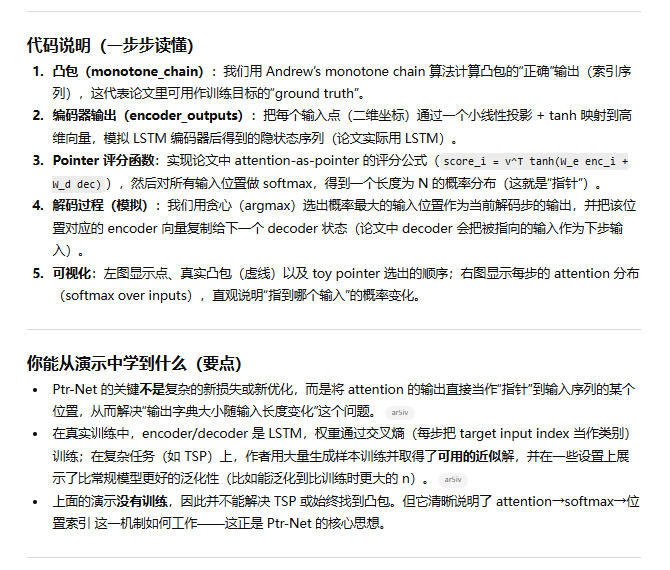


### QA

#### **1. Pointer Network 最核心的创新是什么？**

**答：**
 传统 seq2seq 模型的输出词典是固定大小的，而像**排序、凸包、TSP**这类任务的输出需要从输入序列「指向」某些位置，输出词典大小必须随输入长度变化。

Ptr-Net 的创新是：

> **使用注意力分布（attention softmax）本身作为指向输入序列中某一个位置的指针。**

也就是说：

- attention = 一个 N 维概率分布
- N = 输入序列长度
- argmax → 输出位置 index

因此输出字典大小 = 输入长度，实现输出词表动态扩展。

这是论文的关键突破，使 seq2seq 模型可以解决一些组合优化问题。
 这也是为什么它叫 Pointer Network。

------

#### **2. Pointer Net 与普通 Attention seq2seq 的根本区别是什么？**

| 模型               | Attention 的用途                                         |
| ------------------ | -------------------------------------------------------- |
| **普通 attention** | 产生 context vector（加权求和）                          |
| **Pointer Net**    | **直接对输入位置做 softmax**，作为输出的 predicted index |

普通 attention：

> 用来读信息（context）

Pointer Net：

> 用来输出位置（index），替代固定词汇表

因此 Pointer Net 是 *attention as output*，不是 *attention as context*。

------

#### **3. 为什么 Pointer Net 尤其适合几何/组合优化任务？**

因为这些任务的输出都是：

- 输入序列中点的**次序**（排序）
- 输入点的**子集**（凸包）
- 输入城市的**路径顺序**（TSP）

这些问题的共同点是：

> **输出是输入序列的排列或子序列。**

而固定词典 seq2seq 无法做到产出长度为 N 的词典。
 Ptr-Net 完全匹配这种输出结构。

------

#### **4. Pointer Net 如何训练？损失函数是什么？**

**和普通 seq2seq 一样，使用交叉熵。**

每一个输出步 t：

- target 是输入位置 target_index[t]
- 模型输出的是一个 softmax attention 分布 over N inputs

所以 loss：
$$
L = -\sum_{t} \log p(\text{target\_index}_t)
$$
训练时：

- 使用 teacher forcing（上一时刻的真实位置 feeding）
- decoder 是 LSTM（论文中如此实现）

损失非常简单。

------

#### **5. Pointer Net 的计算复杂度如何？为什么比之前方法更优？**

在每个 decoder 生成步：

- attention over N inputs → O(N)

总共 T 步（T≈N），因此：

- **总复杂度 = O(N²)**

论文指出：

- 传统计算凸包或排序等任务复杂度通常为 O(N log N)
- 但是神经模型 O(N²) 在 GPU 上并不慢
- 同时可以泛化到新规模

其优势不是理论复杂度，而是：

> 能让深度学习 end-to-end 学习组合结构。

------

#### **6. Pointer Net 能泛化到更长序列吗？论文有什么发现？**

论文中的实验显示一个特性：

> 模型可以泛化到比训练时更长的序列（例如训练 n<=50，在 n=100 或 n=300 上仍有不错表现）。

尤其是在：

- **凸包（Convex Hull）任务**：泛化非常好
- **Delaunay triangulation**：也能泛化
- **TSP（近似）**：泛化但误差随着 n 增加

原因在于 pointer 机制与输入长度无关，因此能自然扩展到新的 n。

------

#### **7. 为什么 TSP 精度比凸包低？**

因为：

- 凸包结构更加**局部性强、确定性强**
- TSP 是 NP-hard，全局最优路径难寻
- TSP 的输出顺序依赖非局部信息（全局距离结构）

论文发现：

- Ptr-Net 在凸包上可以达到**几乎完美的 F-score**
- 但在 TSP 上只能给出**不错的近似解**（误差 1～2%）
- 更长 n 会额外降低准确度

这与任务难度有关。

------

#### **8. Pointer Net 需要显式防止输出重复节点吗？**

论文中使用 **teacher forcing ⇒ 不需要显式约束**。
 但推理时可出现重复节点，因此通常做法是：

- 禁止模型再指向已经选过的点（在 inference 时 mask softmax）
- 或者贪心选完自动排除已选元素

论文在 TSP 中也采用过类似技巧。

------

#### **9. Pointer Net 的输入顺序是否会影响性能？**

是的。
 由于 LSTM 编码器序列化输入，输入顺序会影响 encoder hidden states。

例如在凸包任务中：

- 随机顺序 → 模型表现可能下降
- 固定按坐标排序输入 → 模型更稳定

但论文强调：

> Ptr-Net 的学习能力足以适应随机输入顺序。

------

#### **10. Pointer Net 是否已被替代？现在还常用吗？**

Pointer Net 的思想仍非常重要，但其具体模型已被更多现代方法替代：

##### 强势替代者

- **Transformers + Pointer / Copy Mechanism**
- **Graph Neural Networks + Attention**
- **Neural Combinatorial Optimization (2017+)**
- **Reinforcement Learning for TSP / OR-Tools Neural 基线**

现在几乎不再使用基于 LSTM 的 Pointer Net，但它的思想：

##### 仍广泛使用：

- 文本摘要 / 机器翻译中的 copy mechanism（CopyNet, Pointer Generator）
- 结构预测（Parsing）
- 图模型的 node selection

Pointer Net 是所有 pointer/copy 类模型的奠基工作。


## 2012 AlexNet

论文地址： [ImageNet Classification with Deep Convolutional Neural Networks（通常也称为 AlexNet）](https://proceedings.neurips.cc/paper_files/paper/2012/file/c399862d3b9d6b76c8436e924a68c45b-Paper.pdf)

### 概述

> 可以结合沐神[《动手学习深度学习》](https://zh.d2l.ai/chapter_convolutional-modern/index.html)中，按时间/发展顺序讲解LeNet、AlexNet、VGG、NiN、GoogleNet、ResNet、DenseNet，会更好理解一些


### 示例代码

下面是一个非常简化 (toy) 的 “AlexNet-like” 网络结构 (并不完全一样)，用 PyTorch 写，帮助你理解 “5 层卷积 + 几个技巧” 是如何用代码实现的。

```
# 这是一个简化版 AlexNet (PyTorch) 示例，仅供学习理解
import torch
import torch.nn as nn
import torch.nn.functional as F

class SimpleAlexNet(nn.Module):
    def __init__(self, num_classes=1000):
        super(SimpleAlexNet, self).__init__()
        self.features = nn.Sequential(
            nn.Conv2d(3, 64, kernel_size=11, stride=4, padding=2),  # conv1
            nn.ReLU(inplace=True),
            nn.MaxPool2d(kernel_size=3, stride=2),                  # pool1
            # 可加 LRN，但 PyTorch 中没有内建；这里省略 / 用 BatchNorm 代替
            nn.Conv2d(64, 192, kernel_size=5, padding=2),          # conv2
            nn.ReLU(inplace=True),
            nn.MaxPool2d(kernel_size=3, stride=2),                 # pool2
            nn.Conv2d(192, 384, kernel_size=3, padding=1),         # conv3
            nn.ReLU(inplace=True),
            nn.Conv2d(384, 256, kernel_size=3, padding=1),         # conv4
            nn.ReLU(inplace=True),
            nn.Conv2d(256, 256, kernel_size=3, padding=1),         # conv5
            nn.ReLU(inplace=True),
            nn.MaxPool2d(kernel_size=3, stride=2),                 # pool5
        )
        self.classifier = nn.Sequential(
            nn.Dropout(p=0.5),
            nn.Linear(256 * 6 * 6, 4096),  # 假设输入图像 crop/pad 到 224x224
            nn.ReLU(inplace=True),
            nn.Dropout(p=0.5),
            nn.Linear(4096, 4096),
            nn.ReLU(inplace=True),
            nn.Linear(4096, num_classes),
        )

    def forward(self, x):
        x = self.features(x)
        x = x.view(x.size(0), 256 * 6 * 6)
        x = self.classifier(x)
        return x

# 使用方式
if __name__ == "__main__":
    model = SimpleAlexNet(num_classes=1000)
    dummy = torch.randn(1, 3, 224, 224)  # 模拟一张 224x224 RGB 图像
    out = model(dummy)
    print(out.shape)  # 应该是 [1, 1000]

```

说明 / 如何对应论文中的设计：

- `Conv2d + ReLU` 对应论文的卷积层 + ReLU 激活。
- `MaxPool2d` 对应池化 (pooling) 层 (虽然是非重叠池化，但逻辑类似)；如果你想更贴近论文，也可以实现 overlapping pool (pool size > stride)；
- `Dropout(p=0.5)` 对应论文用于防止过拟合的 “dropout” 技术。
- 输入尺寸假设为 224×224，这是现代标准 (现代很多实现把原论文的 256×256 crop / central-crop + random crop / flip / resize 等 data augmentation 合并成 “224×224 + aug” pipeline)。
- 输出是 `num_classes` (通常 1000) — 对应 ImageNet 1000 类分类任务。


### QA

| 问题 (Question)                                              | 答案 / 提示 (Answer / Hint)                                  |
| ------------------------------------------------------------ | ------------------------------------------------------------ |
| **为什么要用 ReLU？不能用 tanh / sigmoid 吗？**              | ReLU 是非饱和 (non-saturating) 的：相比 tanh/sigmoid，可以让网络训练更快、更深；论文实验表明，用 ReLU 的 CNN 收敛速度是 saturating nonlinearities 的数倍。 ([NeurIPS 会议记录](https://proceedings.neurips.cc/paper_files/paper/2012/file/c399862d3b9d6b76c8436e924a68c45b-Paper.pdf)) |
| **为什么需要数据增强 (data augmentation)？**                 | 尽管有百万级数据，但对于一个有千万级 /亿级参数 (或说大量自由度) 的深网络来说，依然可能过拟合。数据增强 (如随机翻转、随机裁剪、颜色扰动) 能人为“放大”训练集、增加变异性，从而提升泛化能力。论文正是通过这种方式缓解过拟合。 ([Alex Hex](https://alexhex7.github.io/2017/09/29/ImageNet classification with deep convolutional neural networks/?utm_source=chatgpt.com)) |
| **Dropout 是做什么？为什么只在全连接层用？**                 | Dropout 是一种随机正则化方法：在训练过程中，以一定概率 (论文用 p=0.5) 随机“屏蔽 (置零)”神经元的输出，从而避免网络过度依赖某些特定神经元、减轻过拟合。作者主要在全连接层使用，因为这些层参数量大、最容易过拟合。 ([NeurIPS 会议记录](https://proceedings.neurips.cc/paper_files/paper/2012/file/c399862d3b9d6b76c8436e924a68c45b-Paper.pdf)) |
| **为什么要用多 GPU 训练？**                                  | 当时单块 GPU 的显存 /计算能力有限，而 AlexNet 的模型 +大数据非常消耗资源。通过把网络分布在两块 GPU 上 (model-parallel / data-parallel hybrid)，可以同时容纳模型与数据，并且加速训练。 ([NeurIPS 会议记录](https://proceedings.neurips.cc/paper_files/paper/2012/file/c399862d3b9d6b76c8436e924a68c45b-Paper.pdf)) |
| **Local Response Normalization (LRN) 的作用是什么？现代网络还用吗？** | LRN 类似生物神经网络里的 lateral inhibition — 让某些响应强 (“激活”) 的 feature map 对附近 map 的响应产生抑制 / 竞争，从而增强差异性 / 稀疏性，有助于泛化。论文指出加上 LRN 后 error rate 有下降。 ([NeurIPS 会议记录](https://proceedings.neurips.cc/paper_files/paper/2012/file/c399862d3b9d6b76c8436e924a68c45b-Paper.pdf)) 。不过在后来的很多现代网络 (如 VGG / ResNet / EfficientNet 等) 中，LRN 被更有效 (更稳定) 的机制 (如 BatchNorm / 组归一化 /更深结构) 所替代。 |
| **为什么论文中 convolutional layer 很多，但卷积层的参数占比 << 全连接层？** | 虽然网络有 5 层卷积 + 3 层全连接，但很多参数都集中在全连接层。作者在论文中提到，如果去掉任何一个卷积层 (哪怕它只占整个参数量 < 1%)，都会导致性能下降。说明卷积层 (特征提取层) 的深度和表达能力对最终分类效果极为关键。 ([NeurIPS 会议记录](https://proceedings.neurips.cc/paper_files/paper/2012/file/c399862d3b9d6b76c8436e924a68c45b-Paper.pdf)) |
| **输入图像为什么统一到固定尺寸 (e.g. 256×256 再中心 crop)?** | CNN 要求固定尺寸输入 (因为全连接层需要固定维度)；而原 ImageNet 的图像分辨率 /长宽比不一。论文中他们先把短边缩放到 256，然后从中心裁剪 256×256，再在训练时做随机 crop / flip / color transform 作为数据增强。 ([NeurIPS 会议记录](https://proceedings.neurips.cc/paper_files/paper/2012/file/c399862d3b9d6b76c8436e924a68c45b-Paper.pdf)) |
| **这个网络为什么在当时如此 “革命性”？**                      | 在 2012 年之前，图像分类 /识别领域多用手工设计特征 (比如 SIFT / HOG / Bag-of-Visual-Words 等) + 浅层分类器 (SVM, Softmax, shallow NN…)。这篇论文证明：自动学习 (深 CNN) + 大规模数据 + GPU + 训练/正则技巧 — 能取得远超传统方法的性能。从此 “深度学习 (deep learning)” 成为 computer vision 的主流。 |


## 2016.02 Order Matters: Sequence to Sequence for Sets

论文地址：https://arxiv.org/pdf/1511.06391


### 概述

------

- Authors: Oriol Vinyals, Samy Bengio, Manjunath Kudlur
- The paper “Order Matters: Sequence to Sequence for Sets” explores the significance of input and output order in sequence-to-sequence (seq2seq) models, especially for tasks where the input or output is a set rather than a naturally ordered sequence. The authors propose methods to adapt seq2seq models for handling sets and demonstrate the impact of order on performance across various tasks.
- **Key Contributions:**
  - The authors highlight the limitations of traditional seq2seq models when dealing with sets, where the order of elements does not matter. They show that the order in which input and output data are presented significantly affects the learning and performance of these models.
  - They introduce an extension to the seq2seq framework to handle input sets in a principled way. This involves using an attention mechanism to process unordered sets, allowing the model to remain invariant to the input order.
  - For output sets, the authors propose a loss function that searches over possible orders during training to find the optimal arrangement, improving the model’s ability to generalize and perform accurately.
- **Experiments and Results:**
  - **Language Modeling:** The authors experiment with different orderings of input sentences and show that reversing the order of words in the source sentence can improve performance in machine translation tasks. They also find that for parsing tasks, the choice of traversal order (depth-first vs. breadth-first) significantly impacts the model’s accuracy.
  - **Combinatorial Problems:** The paper demonstrates the importance of ordering in combinatorial problems such as sorting numbers and computing convex hulls. For example, sorting the input points by angle simplifies the convex hull computation, leading to faster training and higher accuracy.
  - **Graphical Models:** The authors create artificial datasets with star-like graphical models and show that it is easier to learn the joint probability distribution when the head variable is presented first. This experiment highlights the significance of choosing the optimal order for modeling complex dependencies among random variables.
- **Model Architecture:**
  - **Read, Process, Write Model:** The proposed model consists of three components: a reading block that embeds each input element, a processing block that performs computation over the embeddings using an attention mechanism, and a writing block that produces the output sequence using a pointer network. This architecture ensures permutation invariance and effectively handles input sets.
  - **Attention Mechanisms:** The authors leverage attention mechanisms to integrate information from variable-length input structures, maintaining the order invariance property crucial for handling sets.
  - **Finding Optimal Orderings:** To address the challenge of determining the best output order, the authors propose an algorithm that explores different orderings during training. By sampling from the probability distribution over possible orders, the model can identify and reinforce the most suitable order for the task.
- **Conclusion:**
  - The paper concludes that order significantly influences the performance of seq2seq models when dealing with sets. The proposed methods for handling input and output sets improve the generalization and accuracy of the models. The authors demonstrate the effectiveness of their approach through various experiments, including sorting, language modeling, parsing, and graphical model estimation. This work opens up new possibilities for extending seq2seq models to a broader range of tasks that involve unordered sets.

------

论文概述（3–6 句）

- 这篇论文指出，当我们将“集合 (set)”数据 — 无论是输入 (input) 还是输出 (output) — 强行当作序列 (sequence) 来处理 (即用经典的 seq2seq 框架)，所选的数据顺序 (ordering) 对模型性能有重大影响。作者通过一系列任务 (sorting, 图模型联合分布建模, parsing, 语言建模等) 展示了“不恰当顺序”会导致性能下降，而合适顺序能显著提升效果。为了解决对“顺序 (order)”的依赖，他们提出了一种扩展 seq2seq 的方法，使其能够以“集合 (set)”为输入 (invariant to permutation)，并对输出为集合 (set) 的情况通过训练时搜索 (search) 输出顺序来学习最优序列化方式。实验表明，这种修改在人工任务 (如排序) 和真实任务 (如 parsing) 上都有益。

关键贡献要点

- **揭示 “order matters”**：证明即便数据本质是无顺序的 (set)，将其视为有序 (sequence) 并选取不同顺序，也会对学习结果 (收敛、性能) 产生很大影响。[arXiv+1](https://arxiv.org/pdf/1511.06391?utm_source=chatgpt.com)
- **提出处理 input set 的机制**：设计了 “Read-Process-Write (RPW)” 模型 — 通过 attention + memory + LSTM，使对输入集合 (unordered) 的编码对元素顺序 (permutation) 不敏感 (invariant) 。[arXiv](https://arxiv.org/pdf/1511.06391?utm_source=chatgpt.com)
- **提出处理 output set 的训练方法**：对于输出为集合 (无固定顺序) 的情况，引入一种训练时对输出顺序进行搜索 (search over possible orders) 的损失 (loss)，让模型自动选择“对它最有利”的序列化顺序。[arXiv](https://arxiv.org/pdf/1511.06391?utm_source=chatgpt.com)
- **广泛实验证明**：不仅在人工合成任务 (例如排序、组合优化 / 图模型概率估计)，也在自然语言任务 (language modeling, parsing) 上，展示顺序选择与 RPW 的实际效益。[arXiv+1](https://arxiv.org/pdf/1511.06391?utm_source=chatgpt.com)

研究背景与动机

- 随着 RNN / LSTM 等序列模型的发展，许多复杂任务 (机器翻译、图像 captioning、解析 (parsing)、组合问题求解等) 都被建模为序列到序列 (seq2seq) 的映射。[arXiv+1](https://arxiv.org/pdf/1511.06391?utm_source=chatgpt.com)
- 然而，有很多任务的数据并不是天然有序 (例如一组数字要排序，一个图像可能包含一组检测到的对象，一组随机变量要估计联合分布等)。直接把这些集合 (sets) 转换成序列 (sequence) — 比如随机排列，或按某人为设定的固定顺序 — 是一种任意 (arbitrary) 的设计决策。作者怀疑这种随意设计顺序可能影响学习效率和最终效果。[arXiv+1](https://arxiv.org/pdf/1511.06391?utm_source=chatgpt.com)
- 因此，必要探索：**是否可以构建一种对顺序不敏感 (permutation-invariant) 的架构**，使其能“正确”处理集合 (sets)； 以及在输出为集合 (sets) 的情境下，**能否自动选择 (learn) 一个“合适”的输出序列化 (ordering)**，而不需要人工指定。

方法细节

- 经典 seq2seq 回顾
- “Read-Process-Write (RPW)” 模型 for input sets
- 对 output set 的处理

------

局限与改进建议（至少 4 点）

1. **输出顺序搜索 (search over orders) 的计算复杂性** — 对于输出集合 (尤其大的集合) 来说，可能的排列 (permutations) 数量极大 ( $n!$ )，在训练期间搜索最优顺序可能非常耗时 / 不可扩展。论文虽然提出这一思路，但并没有给出高效、可扩展的搜索/近似算法。
2. **对大规模 / 高维集合 (large sets) 的泛化能力有限** — 在排序 (数字) 的大 N 情况下 (比如 N = 15)，模型表现已经很差 (准确率很低)。说明 RPW + pointer-net 在实际复杂集合任务上扩展性可能受限。
3. **输出为固定字典 (vocabulary) 的集合 / 多标签 (multi-label) 任务欠缺实验** — 论文主要关注输出为 pointer → 输入集合元素 (如排序) 或输出结构 (如 parse tree)，对输出为 “无序标签集 (multi-label classification)” 的通用集合情况，缺乏验证。
4. **对实际自然场景 (真实数据集) 的应用较少 / 有局限** — 尽管 parsing 和语言模型使用了真实数据，但像检测一组对象、图结构预测、多标签分类等更贴近日常应用的数据类型并未体现。结果不一定能直接推广。
5. **不确定性与稳定性** — 由于模型训练中对输出顺序进行搜索和选择，不同随机种子 /训练 run 可能学到不同序列化顺序，加上训练复杂度、non-convex optimization，可能导致不稳定 / 不可重复。
6. **缺乏理论保证 (theoretical guarantee)** — 论文主要从经验 (empirical) 角度论证 “order matters” 和 “RPW 有益”，缺少对何种数据 / 任务 / 集合大小 /结构 下模型能泛化 /稳定工作的理论分析。

改进建议 (future work)：

- 设计高效可扩展的 **输出顺序搜索 /优化算法**，例如用近似、启发式搜索、学习一个 order-policy，而不是穷举 /随机搜索。
- 在更大规模、更复杂的真实任务 (e.g. multi-label classification,对象检测 + 多目标输出, 图结构预测) 上测试 RPW + 输出顺序学习，以验证其通用性。
- 探索更强的 permutation-invariant / equivariant 架构 (例如基于集合网络 /图网络 /Transformer)，以改善对大集合 /复杂结构的适应性。
- 为训练过程添加正则化 /稳定机制，以减少对随机初始化 /训练顺序 /search randomness 的敏感性。
- 从理论上分析何种任务 / 数据分布 /集合特性 (size, cardinality, structure) 下 “order matters” 的影响较大，以及 RPW 等方法的极限 /保证。


### 示例代码

下面是一个 **极简化 (toy)** 的 Python 代码示例，用于展示 “Read-Process-Write” 思路 — 对一组数字 (set) 编码 (permutation-invariant)，然后通过简单 decoder (pointer 模拟) 输出排序 (sort) 的索引。

```
import torch
import torch.nn as nn
import torch.nn.functional as F
import random

class ReadProcessWrite(nn.Module):
    def __init__(self, in_dim=1, hid_dim=32, process_steps=3):
        super().__init__()
        self.encoder = nn.Linear(in_dim, hid_dim)
        self.process_steps = process_steps
        self.proc_lstm = nn.LSTMCell(hid_dim * 2, hid_dim)
        self.decoder = nn.LSTMCell(hid_dim, hid_dim)
        self.output_linear = nn.Linear(hid_dim, hid_dim)
        self.hid_dim = hid_dim

    def forward(self, xs):
        # xs: tensor of shape (batch, N, in_dim)
        batch, N, dim = xs.size()
        # Read
        mem = self.encoder(xs)  # (batch, N, hid_dim)
        # Process: attention over mem for a few steps
        h = torch.zeros(batch, self.hid_dim, device=xs.device)
        c = torch.zeros(batch, self.hid_dim, device=xs.device)
        for _ in range(self.process_steps):
            # compute attention weights
            q = h  # query
            attn = torch.einsum('bd,bnd->bn', q, mem)  # dot-product
            a = F.softmax(attn, dim=1)  # (batch, N)
            r = torch.einsum('bn,bnd->bd', a, mem)  # (batch, hid_dim)
            inp = torch.cat([q, r], dim=1)
            h, c = self.proc_lstm(inp, (h, c))
        context = h  # (batch, hid_dim)

        # For simplicity: we produce a score for each input element, then sort
        scores = torch.einsum('bd,bnd->bn', context, mem)  
        # return indices of sorted (ascending)
        idx = torch.argsort(scores, dim=1)
        return idx

# toy demonstration
if __name__ == "__main__":
    model = ReadProcessWrite(in_dim=1, hid_dim=32, process_steps=5)
    xs = torch.rand(2, 5, 1)  # batch size 2, 5 numbers each
    idx = model(xs)
    print("inputs:", xs)
    print("sorted indices by model:", idx)
    print("ground truth sort:", torch.argsort(xs.squeeze(-1), dim=1))

```


### QA

以下是 8 道练习题 (理解 / 思考)：

------

**Q1.** 为什么将集合 (set) 当作序列 (sequence) 输入给经典 seq2seq 模型，可能不合理？

**A1.** 因为集合本质上无序 (permutation invariant)，而序列 (sequence) 有固定顺序 (ordering) — 将集合当成序列就隐含了人为制定的顺序，这种任意顺序可能影响学习 (性能、收敛) 并破坏集合的不变性。

------

**Q2.** 在 “Read-Process-Write” 模型中，为何 attention + memory 的机制是 permutation-invariant 的？

**A2.** 因为 attention 的 soft-attention 权重是对 memory set 中所有记忆向量 $m_i$ 计算 (并做归一化)，所以无论 memory 向量在内部列表中顺序如何 (shuffle)， attention 结果 (读出的向量) 都不会改变 — 保持对集合元素顺序不敏感。

------

**Q3.** 在排序 (sorting) 任务实验中，为什么 baseline pointer-net (用 LSTM 顺序编码) 随 N 增大表现急剧下降，而 RPW 模型能更好应对？

**A3.** 因为当 N 较大时，随机顺序或人为顺序对 LSTM 编码可能造成难以学习 (非结构化 / 无规律) 的输入顺序，导致 encoder 难以捕捉集合内部关系。RPW 通过 permutation-invariant 编码 + attention 多步处理 (process) 可以更有效地聚合整个集合的信息，因此更稳健。

------

**Q4.** 对于一个输出是一个无序集合 (例如图像多目标检测输出多个对象 bounding-box, 无固定义序列) 的任务，用经典 seq2seq + chain-rule + 固定顺序 (例如按 x 座标排序) 会有什么潜在问题？

**A4.** 固定排序可能人为引入 bias — 并不一定与任务结构对齐；而若排序不合理 (例如按 x 座标排序对语义没有意义)，模型可能学不到好的联合分布 / 结构；此外，对某些输出集合 (objects) 的多样性 /对称性 (permutation invariance) 会被破坏。

------

**Q5.** 论文中对 output set 的处理方法是什么？简述思路。

**A5.** 在训练过程中对所有 (或部分) 可能的输出序列化 (ordering) 进行搜索 (search over orders)，选择对当前模型最有利 (最容易学) 的序列化顺序 — 从而让模型自动学到一个对该任务 /数据最合适的输出顺序，而不是人工设定固定顺序。

------

**Q6.** “Read-Process-Write” 模型在理论上满足什么性质 (关于输入集合)？

**A6.** 它满足对输入集合的 **permutation invariance** — 即对输入集合中元素顺序 (排列) 的任意打乱 (shuffle) 不会改变模型对集合的编码 /表示。

------

**Q7.** 你认为为什么在语言模型 (sequence 数据) 上，用 “不自然 / 扰乱顺序 (比如 3-word reversal)” 训练出的模型虽然性能下降 (perplexity ↑)，但仍能取得合理效果？

**A7.** 因为即使顺序被扰乱，经典 seq2seq + LSTM 仍能通过大量数据学习到某种联合分布 (虽然 n-gram / 语法结构被破坏)，而 LSTM 的强建模能力 + chain-rule decomposition 使它有一定鲁棒性。不过，这样学到的模型可能捕捉到的是 “顺序统计 (order-agnostic) + approximate correlations” 而非真实语言结构，因此性能略差。

------

**Q8.** 假如你要把这篇论文的方法 (RPW + 输出顺序学习) 应用于一个现实任务 —— 比如对图像做多目标检测并输出一组边界框 (bounding boxes, 无特定顺序) —— 你会面临哪些挑战？

**A8.** 挑战包括：大量可能的输出排列 (bounding boxes 的不同顺序)，搜索 /学习合适顺序的计算复杂度极高；集合规模 (目标数) 和多样性高，对 memory 和 attention 资源要求大；训练数据中标注顺序不固定 (或多样) — 需要设计兼容 label 的方式；此外，对输出边界框坐标 +类别 +其他属性 (不仅仅是从输入中 pointer) 的复杂性也高 — 需要扩展 decoder / loss 设计。

------


## 2018.11 GPipe

论文地址：[GPipe: Easy Scaling with Micro-Batch Pipeline Parallelism](https://arxiv.org/abs/1811.06965)


### 概述

------

概述1：

- Authors: Yanping Huang, Youlong Cheng, Ankur Bapna, Orhan Firat, Mia Xu Chen, Dehao Chen, HyoukJoong Lee, Jiquan Ngiam, Quoc V. Le, Yonghui Wu, Zhifeng Chen
- The paper “GPipe: Easy Scaling with Micro-Batch Pipeline Parallelism” introduces GPipe, a scalable model-parallelism library designed to enable efficient training of large neural networks by partitioning models across multiple accelerators. GPipe overcomes memory limitations and achieves almost linear speedup by using a novel batch-splitting pipelining algorithm.
- **Key Contributions:**
  - **GPipe Architecture:** The GPipe library partitions a neural network into smaller sub-sequences of layers, or “cells,” which are distributed across multiple accelerators. This setup allows the training of models that exceed the memory capacity of a single accelerator.
  - **Batch-Splitting Pipeline Parallelism:** GPipe divides each mini-batch of training data into smaller micro-batches. These micro-batches are then processed in a pipelined manner across the different accelerators, ensuring high hardware utilization and minimizing idle time.
  - **Synchronous Gradient Descent:** The library uses synchronous mini-batch gradient descent, where gradients are accumulated across all micro-batches before being applied to update the model parameters. This approach ensures consistent gradient updates regardless of the number of partitions.
- **Experiments and Results:**
  - **Image Classification:** GPipe was used to train a 557-million-parameter AmoebaNet model on the ImageNet-2012 dataset. The model achieved a top-1 accuracy of 84.4%, demonstrating the effectiveness of GPipe in scaling large convolutional networks.
  - **Multilingual Neural Machine Translation:** GPipe enabled the training of a single 6-billion-parameter, 128-layer Transformer model on a corpus spanning over 100 languages. This model outperformed individually trained bilingual models, highlighting GPipe’s ability to handle diverse and large-scale NLP tasks.
- **Performance Optimization:**
  - **Re-materialization:** To reduce activation memory requirements, GPipe supports re-materialization, where only output activations at partition boundaries are stored during the forward pass. The required activations are recomputed during the backward pass, reducing peak memory usage.
  - **Load Balancing:** The partitioning algorithm aims to balance the computational load across accelerators by minimizing the variance in the estimated costs of all cells. This optimization ensures efficient pipeline execution.
- **Design Features and Trade-Offs:**
  - **Flexibility:** GPipe supports any neural network that can be expressed as a sequence of layers, providing a versatile solution for various architectures and tasks.
  - **Efficiency:** By minimizing communication overhead and utilizing batch-splitting pipeline parallelism, GPipe achieves near-linear scaling with the number of accelerators, even in environments with limited inter-device communication bandwidth.
  - **Training Stability:** The use of synchronous gradient updates ensures stable and consistent training across different partitioning configurations, making GPipe reliable for large-scale model training.
- **Conclusion:**
  - The GPipe library offers an efficient and flexible approach to scaling deep neural networks beyond single-accelerator memory limits. Its batch-splitting pipelining algorithm allows for significant improvements in training throughput and model capacity. GPipe’s design principles ensure that it can be applied to a wide range of machine learning tasks, from image classification to multilingual machine translation, with strong empirical results. The library’s ability to handle large models and achieve near-linear speedup positions it as a valuable tool for advancing deep learning research and applications.

------

3–6 句论文概述

- GPipe 提出一种通用的**流水线并行（pipeline parallelism）**框架，允许把任意可表示为“层序列”的神经网络划分为若干“cell”并把每个 cell 放到不同加速器上，同时将一个 mini-batch 划分为若干 micro-batch 来进行流水线化执行，从而在不改变同步 SGD 语义下扩展模型容量与加速训练。为了节省激活（activation）内存，GPipe 结合了**re-materialization（重计算）**策略，仅在分区边界缓存激活，反向传播时按需重算。论文展示了 GPipe 在图像分类（训练 5.57e8 参数 AmoebaNet 到 ImageNet 84.4% top-1）和多语言机器翻译（训练 6B、128 层 Transformer）上的成功应用与几乎线性扩展性。总体目标是提供任务 & 架构无关、实现简单、且能把单卡无法容纳的大模型切分到多卡上训练的通用工具。[ar5iv](https://ar5iv.org/pdf/1811.06965)

关键贡献要点

1. 提出 GPipe：一个面向“层序列”网络的通用流水线并行库与接口（用户只需指定 partition 数、micro-batch 数和层序列）。[ar5iv](https://ar5iv.org/pdf/1811.06965)
2. 引入 **batch-splitting pipelining（micro-batch 划分 + 同步梯度累积）** 的训练算法：将 mini-batch 划成 micro-batches，流水线执行，并在 mini-batch 结束时同步应用梯度，从而保证训练语义与单卡一致。[ar5iv](https://ar5iv.org/pdf/1811.06965)
3. 结合 **re-materialization**（在反向时重算中间激活）大幅降低峰值激活内存，允许单卡训练更深/更宽网络或把更大的模型切分到更多卡上。[ar5iv](https://ar5iv.org/pdf/1811.06965)
4. 大规模实证：训练 557M AmoebaNet（ImageNet top-1 84.4%）和 6B、128-layer Transformer（多语翻译超越多个双语 baseline），并展示近线性吞吐量扩展。[ar5iv](https://ar5iv.org/pdf/1811.06965)

研究背景与动机

- 近年来模型容量增长显著（ImageNet、NLP 均显示更大模型效果更好），但单个加速器（GPU/TPU）内存限制阻碍了进一步扩容。已有的 model-parallel 方法通常针对特定架构（如某些 Transformer 专用切分）或需要复杂通信/实现，缺乏通用性。GPipe 的动机是设计一个**通用、简单、跨架构**的并行化方案，使“任意按层定义的网络”都能通过流水线分区与 micro-batch 策略扩展到巨型模型，同时尽量保持高利用率与低通信/内存开销。[ar5iv](https://ar5iv.org/pdf/1811.06965)

------

> 实验与结论摘要（含关键数值）

论文在两类任务上验证 GPipe 的有效性：

**图像分类（ImageNet）**：

- 使用 AmoebaNet（扩展后达 557M 参数，即论文中约 5.57e8 参数的模型）。训练结果：**ImageNet-2012 top-1 accuracy = 84.4%**（论文声称达该 SOTA 水平）。训练在 TPU 上使用 GPipe 扩展模型到单卡无法承载的规模。[ar5iv](https://ar5iv.org/pdf/1811.06965)

**多语言机器翻译（Multilingual NMT）**：

- 训练一个 **128-layer, 6-billion-parameter Transformer**（覆盖 103 语言对，102→En）并与多个双语 350M Transformer Big 比较。结果：**单一 6B 多语模型整体优于每对训练的 bilingual 350M 模型**（具体 BLEU 改善见论文相关表/图）。[ar5iv](https://ar5iv.org/pdf/1811.06965)

**扩展性 / 吞吐量**：

- Table 1/2 展示：对于 Transformer，当 micro-batch 数 $M \ge K$ 时，训练吞吐量随 partition 数接近线性增长（论文报告在 TPU 上几乎线性加速；Transformer 在分区 2/4/8 时 normalized throughput 分别大幅增加，见 Table 2）。另外，使用 GPipe 在 8 张 8GB GPU 上能把 AmoebaNet 扩到 1.8B 参数（在不同硬件配置下论文给出多组数值）。[ar5iv](https://ar5iv.org/pdf/1811.06965)

**结论要点**：GPipe 可在不改变同步 SGD 语义的情况下，通过 micro-batch 流水线与重计算显著扩展模型容量并在多类架构上取得实际收益；在合理选择 micro-batch 数量以 amortize bubble 后可获得接近线性的速度扩展

------

局限与改进建议（至少 4 点）

1. **分区负载不均（load imbalance）**：论文采用启发式切分以尽量均衡每个 cell 的成本，但对于非均匀层（如 AmoebaNet）仍会出现子线性扩展。
    建议：引入更精细的静态/动态分区器（比如混合整数规划或基于测量的动态分区），或允许跨设备重划分/迁移以适应训练阶段的实际负载分布。
2. **通信与延迟对流水线效率敏感**：在低带宽或高延迟互连（如 PCI-E 无 NVLink）场景，activation 传输仍会成为瓶颈。
    建议：增加 activation 压缩（量化 / 剪枝 /低秩近似）或异步压缩通信，并探索 overlap（通信/计算重叠）的更激进策略。
3. **对模型结构的限制（必须为“层序列”）**：GPipe 适用于顺序层模型，但对于图形化/有复杂 DAG 依赖（如多分支、跳跃连接密集的网络）支持较弱或需要手工拆分。
    建议：扩展接口以支持 DAG 型模型自动划分（构建依赖图并找到合适的 topological partitioning），并支持“分支合并”的通信调度策略。
4. **微批次数 M 选择权衡**：M 必须足够大以 amortize bubble，但过大则使每个 micro-batch 更小，可能影响统计效果（BN、优化稳定性）和硬件利用。
    建议：自动选择/调整 M（自适应增/减），或使用混合策略（部分数据并行 + 部分流水线）以在稳健性与效率之间取得折中。
5. **训练语义与调参影响**：虽然梯度累加保持了同步语义，但实际训练超参（学习率、batch-norm 统计、优化器状态）在非常大模型/大批量下可能需要重新调优。
    建议：提供开箱即用的超参推荐（基于规模的 LR scaling、warmup、正则化），并在库中集成自动学习率缩放与统计采样工具。
6. **容错与断点恢复**：论文未详述在多卡训练中出现单卡故障时的容错机制。
    建议：实现 checkpointing 在 partition 粒度（可保存每个 cell 的权重与 optimizer 状态，并能从任意单个 partition 恢复），并支持部分重启/替换 device。

------


### 示例代码

下面给出一个**可运行的 PyTorch 示范脚本**（可在 CPU 上运行，也可在单机多 GPU 上运行）来**模拟 GPipe 的 micro-batch 流水线分区**。此示例把一个 `nn.Sequential` 模型分为两段（两个 partition），将一个 mini-batch 切成若干 micro-batches，并按流水线时序在不同设备上顺序执行（若无多 GPU，会把 device 设为 CPU，但逻辑一致）。该脚本演示前向/反向的 micro-step 调度以及最后的梯度累加与一次 optimizer.step()。

```
# gpipe_sim.py -- 简单 GPipe 风格流水线模拟 (PyTorch)
import torch
import torch.nn as nn
import torch.optim as optim

# 配置
B = 16              # mini-batch 大小
M = 4               # micro-batches 数 (M <= B 且 B % M == 0)
b = B // M
in_dim = 32
hidden = 64
out_dim = 10
device0 = torch.device('cpu')    # 若有多 GPU 可设 'cuda:0'
device1 = torch.device('cpu')    # 若有多 GPU 可设 'cuda:1'

# 构建一个简单的 Sequential 网络并分成 2 个 cell
cell1 = nn.Sequential(
    nn.Linear(in_dim, hidden),
    nn.ReLU(),
    nn.Linear(hidden, hidden),
).to(device0)

cell2 = nn.Sequential(
    nn.ReLU(),
    nn.Linear(hidden, hidden),
    nn.ReLU(),
    nn.Linear(hidden, out_dim)
).to(device1)

# 合并参数用于 optimizer（注意：真实分布式需每设备各自 optimizer 或分布式同步）
params = list(cell1.parameters()) + list(cell2.parameters())
opt = optim.SGD(params, lr=0.01)

# 损失
criterion = nn.CrossEntropyLoss()

# 人造数据
X = torch.randn(B, in_dim)
y = torch.randint(0, out_dim, (B,))

# 切分为 micro-batches
micro_X = torch.split(X, b)
micro_y = torch.split(y, b)

# 为了模拟 re-materialization，我们不缓存中间激活（这里只是示范）
# 记录每个 micro-batch 在 cell 上的 forward/activations（在真实实现中会传输 tensor）
# 这里使用简单的 time-step 调度：总步数 = M + K - 1 (K=2)
K = 2
total_steps = M + K - 1

# 用于累积梯度（PyTorch 默认是累加梯度，所以我们在 optimizer.step 前不清 grad）
opt.zero_grad()

# 模拟流水线：每个 step，检查哪些 (micro_index, cell_index) 应该执行
# micro_index 从 0..M-1, cell_index 从 0..K-1
for t in range(total_steps):
    for k in range(K):
        micro_index = t - k
        if 0 <= micro_index < M:
            # 执行前向或反向的简化调度：先全部forward，再在后续 step 做 backward
            # 为清晰起见，这里先做 forward 并保存 activation 到小变量，然后在
            # 当对应 micro 在最末 cell 完成前向后，我们立刻做 backward（简化）
            x_mb = micro_X[micro_index]
            y_mb = micro_y[micro_index]
            # 前向裁剪与设备传输（显式移动）
            if k == 0:
                x = x_mb.to(device0)
                a = cell1(x)            # activation 输出在 device0
                a_to_next = a.detach().to(device1)  # 模拟通信（detach 表示不保 gradient）
            else: # k==1
                a = a_to_next.to(device1)
                out = cell2(a)
                loss = criterion(out, y_mb.to(device1))
                # 反向：计算当前 micro 的梯度（将梯度累加到参数）
                loss.backward()
                # 注意：在真实 GPipe 中，还要考虑 re-materialization（这里略）
    # end inner for
# 在所有 micro-batches 完成后应用一次参数更新
opt.step()
opt.zero_grad()
print("Done. Simulated GPipe step applied optimizer.step() once for mini-batch.")

```


### QA

下面给一组练习题（带参考答案），适合用于理解论文要点与实现细节。

------

**题 1.** GPipe 的核心策略是什么？如何保证与单卡同步 SGD 的等价性？
 **答 1.** 核心策略是把 mini-batch 拆成多个 micro-batches 并流水线地在不同 partition 上并行执行，同时在每个 micro-batch 的反向过程中累加梯度，并在处理完整个 mini-batch 后一次性应用梯度（optimizer.step）。因此更新频率与单卡同步 SGD 一致，训练语义等价。[ar5iv](https://ar5iv.org/pdf/1811.06965)

**题 2.** 什么是 re-materialization（重计算），它在 GPipe 中起什么作用？
 **答 2.** re-materialization 指不在前向时缓存全部中间激活，而是在反向时重新计算需要的前向中间结果以节省内存。在 GPipe 中与分区结合后可显著降低峰值激活内存，从而允许更大模型。[ar5iv](https://ar5iv.org/pdf/1811.06965)

**题 3.** “bubble” 在流水线上下文是什么？如何减小它的影响？
 **答 3.** bubble 指加速器空闲等待时间（pipeline fill/drain 阶段产生的空闲槽），会降低并行效率。将 micro-batch 数 $M$ 增大（通常 $M \ge K$）可 amortize bubble 开销，从而降低其相对影响。[ar5iv](https://ar5iv.org/pdf/1811.06965)

**题 4.** 当网络层计算/参数分布不均匀时，GPipe 会面临什么问题？解决方案有哪些？
 **答 4.** 会出现 load imbalance（某些 partition 计算远多于其他 partition），导致吞吐量降低；可用更智能的分区器（基于计量的划分、优化求解器）或重分配 layer-granularity 的切分来缓解。[ar5iv](https://ar5iv.org/pdf/1811.06965)

**题 5.** 在没有高速互连（如 NVLink）的机器上，GPipe 的通信开销如何？论文给出的实验结论是什么？
 **答 5.** 通信需要通过主机内存（PCI-E）传输 activation 张量，会增加开销，但论文在 GPU 无 NVLink 的设置中仍观察到一定 speedup（视 micro-batch 数与 partition 设置而定），表明通信开销在合理设置下不是不可控的瓶颈。详见 Table 3。[ar5iv](https://ar5iv.org/pdf/1811.06965)

**题 6.** GPipe 可否直接用于任意 DAG（有分支/合并）的模型？为什么或为什么不？
 **答 6.** 论文主要针对线性层序列（sequence-of-layers）模型；复杂 DAG 需先将图转为线性序列或手工拆分，因其自动划分/调度更复杂，GPipe 原始实现对 DAG 支持有限。[ar5iv](https://ar5iv.org/pdf/1811.06965)

**题 7.** 在 GPipe 中选择 micro-batch 数 M 的主要考虑因素有哪些？
 **答 7.** 主要考虑 amortize bubble（M 应至少与 partition 数 K 相当或更大）、每 micro-batch 的 batch-norm 统计稳定性、以及整体内存可容纳性；过小 M 会导致低利用率，过大 M 可能影响统计/收敛与通信频率。[ar5iv](https://ar5iv.org/pdf/1811.06965)

**题 8.** 列举论文中两项关键实证性能指标（任务 + 数值）。
 **答 8.** (i) AmoebaNet 扩展至 ~557M 参数并在 ImageNet-2012 上达到 **84.4% top-1**；(ii) 训练单一 128-layer、6B 参数 Transformer 覆盖 103 语言，对比多对双语 350M 模型有更好表现。[ar5iv](https://ar5iv.org/pdf/1811.06965)

**题 9.** 若在 GPipe 中使用 BatchNorm，应如何处理统计量以保持一致性？
 **答 9.** 在论文中说明，BatchNorm 的统计应在 micro-batch 级别计算，并在需要时跨 replicas 汇总；同时记录 mini-batch 层面的 moving average 以用于评估（paper §2.2）。[ar5iv](https://ar5iv.org/pdf/1811.06965)

**题 10.** GPipe 能否与数据并行结合？有什么好处？
 **答 10.** 可以：GPipe 负责模型并行（跨层切分），数据并行负责跨 replica 的数据分布，两者结合可以进一步扩展训练到更多设备并增加吞吐量/缩短训练时间。论文建议可组合使用以扩展训练规模。[ar5iv](https://ar5iv.org/pdf/1811.06965)

------


## 2015.12 ResNet

论文原文：[Deep Residual Learning for Image Recognition](https://arxiv.org/abs/1512.03385)

神中神！


### 概述

------

概述：

- **Authors**: Kaiming He, Xiangyu Zhang, Shaoqing Ren, Jian Sun
- **Affiliation**: Microsoft Research
- This seminal paper introduces the concept of deep residual networks (ResNets), which significantly ease the training of networks that are substantially deeper than those used previously. By utilizing residual blocks that allow layers to fit a residual mapping instead of directly attempting to fit a desired underlying mapping, ResNets facilitate the training process and improve the accuracy from increased depth.

Key innovations and findings from the paper include:

1. **Residual Learning Framework**: The layers in ResNet learn residual functions with reference to the layer inputs, which simplifies the learning process because the network learns to modify the identity mapping rather than having to estimate the full output.
2. **Ease of Optimization**: The residual blocks make deeper networks easier to optimize because they mitigate the problem of vanishing gradients by using shortcut connections that perform identity mapping.
3. **Superior Performance on Deep Networks**: Extensive experiments demonstrate that ResNets, with their deeper architectures, outperform traditional networks on major datasets like ImageNet and CIFAR-10. For instance, ResNets with a depth of up to 152 layers show better performance and lower complexity compared to VGG nets.
4. **Broad Applicability**: The paper also highlights the effectiveness of ResNets across various tasks beyond image classification, such as object detection and localization, through adaptations like bottleneck designs that enhance computational efficiency.

- These contributions have had a profound impact on the field of deep learning, influencing a wide range of subsequent research and applications in both academia and industry.

------

### QA

下面给出 10 道练习题（覆盖概念、公式、架构、实验与批判性思考），每题后给出参考答案。

1. **问：残差块的基本思想是什么？为什么它能缓解“退化问题”？**
    答：基本思想是让子网络学习残差函数 $\mathcal{F}(x)=\mathcal{H}(x)-x$，并通过捷径把 $x$ 直接加回去（$\mathbf{y}=\mathcal{F}(x)+x$）。如果最优映射接近恒等映射，则残差接近 0，这样学习更容易，从而减轻深层网络训练时出现的训练误差上升（退化）。[ar5iv](https://ar5iv.org/pdf/1512.03385)
2. **问：写出论文中残差块在维度不匹配时的数学形式。**
    答：当输入输出维度不匹配时，使用线性投影 $W_s$ 来匹配：$\mathbf{y}=\mathcal{F}(\mathbf{x},\{W_i\})+W_s\mathbf{x}$。这是论文 Eqn.(2)。[ar5iv](https://ar5iv.org/pdf/1512.03385)
3. **问：论文中提到“identity shortcut 不引入额外参数或计算复杂度”，在什么条件下这一说法成立？**
    答：当输入与输出通道数匹配、且不需要下采样时，使用恒等捷径（直接相加）不会增加参数或显著的计算；仅相加操作成本很小。若维度不匹配则需投影（例如 $1\times1$ 卷积），此时会增加参数。[ar5iv](https://ar5iv.org/pdf/1512.03385)
4. **问：ResNet-50 与 ResNet-34 在结构上的主要差别是什么？**
    答：ResNet-34 使用 BasicBlock（两层 3×3），而 ResNet-50 使用 Bottleneck block（1×1 降维 → 3×3 → 1×1 恢复维度），因此 ResNet-50 能在更深的层数下保持计算效率。详见 Table 1。[ar5iv](https://ar5iv.org/pdf/1512.03385)
5. **问：论文在 ImageNet 上报告的 ResNet-152 单模型 top-5 验证误差大约是多少？集成测试误差是多少？**
    答：论文报告 ResNet-152 单模型 top-5 验证误差约 **4.49%**（或在另一表中 5.71%，取决于评测细节/变体）；集成（ensemble）在测试集上的 top-5 错误为 **3.57%**。[ar5iv](https://ar5iv.org/pdf/1512.03385)
6. **问：为什么论文强调残差函数的输出通常较小？这说明了什么？**
    答：作者在实验证明残差响应普遍偏小，说明在许多情况下最优映射接近恒等映射，残差学习将问题预调节（precondition）为“学习小的扰动”更容易优化。[ar5iv](https://ar5iv.org/pdf/1512.03385)
7. **问：列举至少两种可以替代或扩展恒等捷径的方法，并简短说明用途。**
    答：可学习的门控（如 highway networks）可以控制信息流；投影捷径（1×1 conv）用于匹配维度；注意力模块（SE, CBAM）可以对通道/空间加权以增强表征。每种方法可改进信息选择或建模能力。[ar5iv](https://ar5iv.org/pdf/1512.03385)
8. **问：在实际训练超深 ResNet（例如 152 层）时，哪些训练技巧是必需或非常重要的？**
    答：Batch Normalization、合适的参数初始化、适当的学习率计划（learning-rate schedule）、数据增强、大批量或梯度累积以及权重衰减常被用于稳定训练。论文使用 BN 并结合训练细节取得稳定训练。[ar5iv](https://ar5iv.org/pdf/1512.03385)
9. **问（思考题）：残差网络是否完全解决了深层网络的所有优化问题？举例说明仍可能遇到的问题。**
    答：不是。残差结构显著缓解但不能完全消除所有问题：例如在极端深度下仍需良好归一化/初始化技巧，BN 在少批次场景表现差；此外，计算与内存开销、推理延迟、模型解释性仍是实际问题。改进可包括归一化替代、模型压缩和理论分析。[ar5iv](https://ar5iv.org/pdf/1512.03385)
10. **问（工程实践）：你如何把 ResNet 迁移到目标检测任务？**
     答：把 ResNet 当作 backbone 提取多层特征（通常去掉最后的 FC，保留 conv 特征），再与 RPN + Fast/Faster R-CNN 或 FPN 等检测头连接。论文在 Faster R-CNN / RPN 框架上展示了迁移效果并在 COCO/ILSVRC detection 上取得提升。[ar5iv](https://ar5iv.org/pdf/1512.03385)


