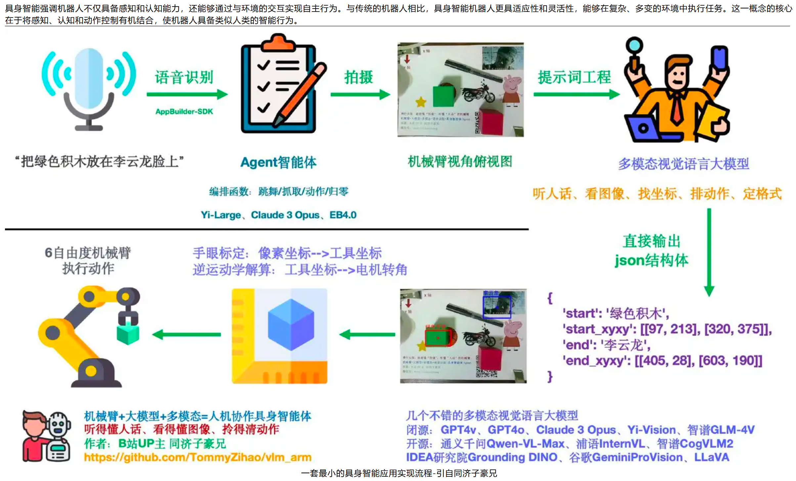

## 具身智能

参考：具身有很多VLA相关需求

- https://github.com/TianxingChen/Embodied-AI-Guide

- https://mp.weixin.qq.com/s/c3CGCcFggK5tVMq1Hm9ElQ

一套最小的具身智能应用实现流程：

> 参考：[英伟达具身智能布局藏哪些关键信号？](https://mp.weixin.qq.com/s/y9OMAw5JBgDMTbVQM4C_YA)

概括来说，Nvidia希望通过仿真获取丰富的数据集。

## 空间智能

> 参考：[李飞飞最新长文：AI的下一个十年——构建真正具备空间智能的机器](https://mp.weixin.qq.com/s/3w5zgnMXe13mKIR_ePBwAw)

李飞飞在最新发表的长文《From Words to Worlds: Spatial Intelligence is AI’s Next Frontier》中指出，**空间智能是人工智能发展的下一个关键方向**。她认为，当前以大语言模型为代表的AI虽在文本、图像生成等方面取得突破，但依然缺乏对物理世界的深层理解与交互能力。

**空间智能的核心价值**在于它将视觉转化为推理、感知转化为行动、想象转化为创造，是人类认知、想象力以及与环境互动的基础。从日常行为（如倒咖啡、停车）到专业领域（如消防员救援、科学家发现DNA结构），空间智能都发挥着关键作用。

为实现真正意义上的空间智能，李飞飞提出构建**“世界模型”** ，需具备三大核心能力：

1. 1.**生成性**：能生成在语义、几何、物理层面保持一致的世界；
2. 2.**多模态性**：支持图像、文本、动作等多种输入输出方式；
3. 3.**交互性**：能根据动作预测世界的下一个状态。

她进一步指出实现世界模型需突破三大技术挑战：

- •设计新的通用训练任务函数；
- •利用大规模图像、视频及合成数据；
- •开发新型模型架构，如支持三维、四维感知的表示方法。

李飞飞创立的World Labs已推出早期成果**Marble**，能够从单张图像生成一致且可交互的3D环境，展示了空间智能在创意、机器人、科学等领域的应用潜力。

**应用前景**涵盖三个维度：

- •**短期**：赋能创作者构建沉浸式叙事与设计空间；
- •**中期**：推动机器人具备协作与场景理解能力；
- •**长期**：加速科学、医疗、教育等领域的突破性发展。

全文强调，空间智能的目标是增强人类能力，而非取代人类，其发展需联合科研、产业与政策力量，共同构建能够深度理解并交互物理世界的AI系统。

> 参考：[谢赛宁、李飞飞、LeCun联手提出多模态LLM新范式，「空间超感知」登场](https://mp.weixin.qq.com/s/H7K8DQ4ztbO138R_STBDRQ)

**1、核心思想：从“超级智能”到“超感知”**

研究团队认为，在追求“超级智能”之前，必须先实现“超感知”。所谓“超感知”，并非指更好的硬件传感器，而是指一个数字生命体能够像人类一样，**持续地体验和理解无界的现实世界输入流**，并从中不断学习。这是AI在现实世界中成为智能体的关键基础。

**2、多模态智能的发展路径**

团队将多模态智能的发展划分为五个层次，当前模型大多停留在前两层，而“超感知”瞄准的是更高的层次：

1.**语言理解**：仅处理文本和符号。

2.**语义感知**：识别图像/视频中的物体、属性和关系（当前MLLM的主力能力）。

3.**流式事件认知**：实时处理和理解连续不断的事件流。

4.**隐式3D空间认知**：理解视频是3D世界的投影，知晓物体的空间位置和相互关系。

5.**预测性世界建模**：像人脑一样，能基于内部模型对世界状态进行无意识推理和预测。

**3、新基准：VSI-SUPER**

为了衡量“空间超感知”能力，团队发现现有视频基准大多偏向语言理解和语义感知，因此提出了一个新的、更具挑战性的基准**VSI-SUPER**。它包含两个核心任务：

- •**VSR（回忆）**：在超长视频（最长4小时）中，按顺序回忆一个异常物体出现的位置。
- •**VSC（计数）**：在跨越多个场景的连续视频中，持续累积计数特定物体的总数。

**实验结果**：即使是Gemini-2.5-Flash等最先进的模型，在这个新基准上也表现不佳，暴露了当前MLLM范式在真正空间推理和持续认知方面的根本局限。

**4、新范式：预测性感知**

团队提出了一种名为“**预测性感知**”的新范式作为解决方案。其核心是让模型学会**预测下一帧的画面**。

- •**原理**：受人类认知启发，大脑会忽略可预测的信息，而重点关注与预测不符的“意外”（惊讶度）。
- •**实现**：在模型（Cambrian-S）中增加一个“潜变量帧预测头”，通过预测误差来量化“惊讶度”。
- •**应用**：利用“惊讶度”信号来实现两大功能：1.**惊讶度驱动的记忆管理**：压缩或跳过不重要的帧，将计算资源集中在处理令人惊讶的关键信息上。2.**惊讶度驱动的事件分割**：自动检测场景变化或事件边界，将无界的视频流分割成有意义的片段进行处理。

**5、结论与意义**

这项研究指出，单纯地扩大模型规模、数据量和上下文长度不足以实现真正的超感知。未来的发展需要转向**构建内部世界模型**，使AI能够像人类一样进行预测性、选择性的感知和理解。Cambrian-S是迈向“空间超感知”的第一步，为多模态AI的发展指明了一个新的方向。