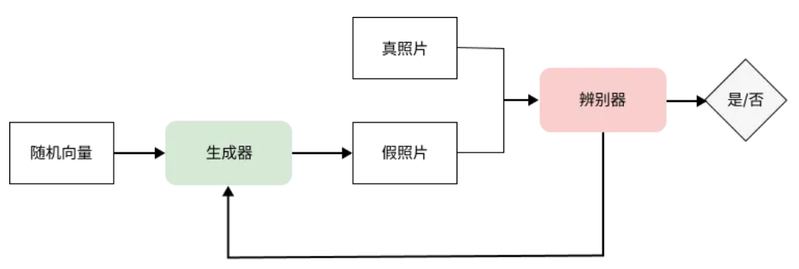
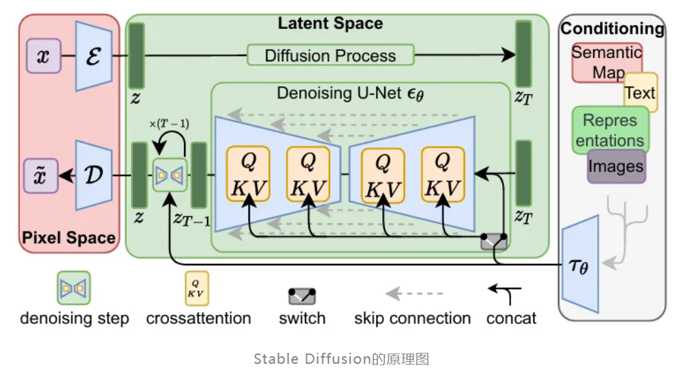

## VLA 基础

参考：

- https://lilianweng.github.io/posts/2021-07-11-diffusion-models/?utm_source=chatgpt.com
- https://www.bilibili.com/video/BV1ujazzoExc
- https://www.bilibili.com/video/BV1pafRY2EQG


ViT：

- [15分钟认识ViT！【视觉Transformer】](https://www.bilibili.com/video/BV1gnWdzSEzY)


> 参考：[王兴兴说了VLA很“傻瓜”，我们聊了聊为什么](https://mp.weixin.qq.com/s/D7G3S_AIfzQfITgqXIKQAg)

TODO


> 参考：[万字长文！关于AI绘图，一篇超详细的总结发布](https://mp.weixin.qq.com/s/ctK6ZqbqkegUK41hkmLQ7g)

**一、AI绘图的发展历程：从“模仿”到“扩散”**

- **第一阶段 生成对抗网络（GAN）时代**
  - 它的内部有一个负责造假的“生成器”和一个负责找茬的“判别器”，两者在不断的博弈中进化，通过这种方式训练出一个能够近乎以假乱真的图片生成模型。
  - GAN原理图如下
    
- **第二阶段 CLIP 的出现**
  - 真正的转折点，终于打通了“视觉”与“语言”之间的壁垒。
  - OpenAI 发布的 CLIP 模型做了一件极其简单却伟大的事：它阅读了互联网上数亿对图片和文本，建立了一种数学上的**映射关系**。简单来说，它学会了理解一张图片和一段文字描述之间的关联。
- **第三阶段 扩散模型时代**
  - 训练阶段，我们做的事情是“破坏”：把一张清晰的图片，一步步地添加高斯噪声，直到它变成一张完全看不出内容的“雪花图”（前向扩散过程）。而模型需要学会的，就是这个过程的“逆操作”——即如何从一张噪点图中，一步步把刚才添加的噪声预测出来并减去，从而还原回原本的清晰图片（反向扩散过程）。
  - 生成（推理）阶段，其实就是重演这个“反向过程”。我们会随机拿一张全是噪点的“雪花图”给模型，让它运用学会的“去噪能力”开始工作。
  - 这里有一个关键点：这个去噪过程并非一蹴而就，而是多步迭代的。
- 补充：GAN vs 扩散模型
  - 到这里你可能会困惑：GAN 一次就能生成图片，速度极快；而扩散模型要像雕刻一样“一步一步”去噪，计算量大且速度慢。为什么这种看似“笨重”的方法反而淘汰了 GAN？
  - 1. 多样化的细节学习（拒绝“偏科”）；2. 极高的训练稳定性（拒绝“内耗”）；3. 精细度的降维打击（拒绝“一锤子买卖”）

**二、AI绘图的基本原理：基于Stable Diffusion的系统梳理**

- SD 并没有推翻扩散模型（Diffusion Model），而是站在巨人的肩膀上进行了一次天才般的架构重组。
  
- 如果要用一句话概括 SD 的核心机制，那就是：在潜空间（Latent Space）中，利用 CLIP 提取的语义指令，指挥 U-Net 网络一步步预测并剔除噪声，最后解码成我们看到的图片。比起传统的扩散模型，SD 最核心的创新点，就在于引入了潜空间。
- 接下来，我们拆解这三个关键步骤。
  - 为什么要进入“潜空间”？
  - CLIP 是如何“听懂人话”的？
  - Stable Diffusion 的核心引擎：U-Net 与采样

**三、方法论：从“抽卡”到“掌控”的三重境界**

- 第一重境界：咒语通神 —— 提示词工程（原文写的挺细节的）
- 第二重境界：积木宗师 —— 模型选择与插件控制
  - 选对“地基”：大模型 (Checkpoint)
  - 加上“滤镜”：LoRA
  - 戴上“镣铐”：ControlNet
  - 其他神兵利器
- 第三重境界：造物主 —— 训练与微调
  - **什么时候训练 Text Embedding？**你只需要固定一个非常简单的物体或概念，且希望文件极小（几 KB）。
  - **什么时候训练 LoRA？**这是目前最主流的训练需求。你需要 AI 稳定生成某个特定的人（比如你自己、公司老板），或者某种特定的产品（公司的新款球鞋），又或者是一种独创的艺术画风。
  - **什么时候微调 Checkpoint (全量微调)？**这通常是大厂或专业工作室的事。你需要改变 AI 的底层认知，或者灌输海量的行业数据（比如医疗影像、特殊的工业设计图纸）。这对算力和数据量的要求极高，普通玩家极少涉足。


### VLM 与 VAT

1️⃣ VLM 典型架构

```
Image → Vision Encoder
                    ↘
                     Cross-modal Fusion → LLM → Text Output
                    ↗
Text  → Text Encoder
```

常见做法：

- Vision Encoder：ViT / CNN
- Text Encoder：Transformer / LLM
- 对齐方式：CLIP-style 对比学习 或 Q-Former

------

2️⃣ VAT 典型架构（更复杂）

```
Image  → Vision Encoder ┐
Audio  → Audio Encoder  ├→ Multimodal Fusion → LLM → Text / Speech
Text   → Text Encoder   ┘
```

关键挑战：

- 三模态时序对齐（尤其是视频 + 音频）
- 音频与语义空间的映射（如语音 vs 环境声）

------

核心区别对比：

| 维度       | VLM                | VAT                        |
| ---------- | ------------------ | -------------------------- |
| 模态数量   | 2（Vision + Text） | 3（Vision + Audio + Text） |
| 技术复杂度 | 中等               | 高                         |
| 对齐关系   | V ↔ T              | V ↔ A ↔ T（三元对齐）      |
| 训练数据   | 图文对             | 图-音-文对                 |
| 主要能力   | 看图理解、视觉推理 | 多感官理解、语音交互       |
| 应用重点   | 图像理解、助手     | 具身智能、虚拟人、AI Agent |


## 落地场景

常见落地场景：

- 工业质检与缺陷检测：结合视觉（图像/视频）与其他模态（传感器信号、热成像、声音等）进行 **实时缺陷检测与质量判定**。例如多模态融合视觉与声学数据提高缺陷检测准确率，为激光堆积制造等流程提供高效监测能力。
- 工具/设备运行监控与预测维护：利用 **图像、时序传感器信号、文本工单等**融合，生成告警、故障根因分析和维护建议报告，大大提高工业现场自动化运维效率。
- 视觉 + 文本的问答式交互系统：在工厂管理系统中，用户可通过自然语言提问机器设备状态、生产进度、流程 SOP 等，系统结合图像/图纸辅助的解释回答，提高非技术人员的可用性。
- 机器人视觉-语言-行动（VLA）模型：用于机器人或自动化设备理解指令并执行视觉引导动作，如在装配、拾取和分类任务中直接解释自然语言指令。


### 示例场景

工业界常用且成熟可复现的开源方案： **CLIP + 视觉分类 + 少量语言指令调度**，结合 Hugging Face 生态构建一个工业质检系统（视觉+文本）。

#### 1️⃣ 环境准备

```
# 安装基础库
pip install torch torchvision transformers pillow
```

------

#### 2️⃣ 数据准备

要求：

- 图像数据：正/负例
- 文本标签：如 `OK`, `Surface Defect`, `Crack`

```
import os
from PIL import Image
from torch.utils.data import Dataset

class IndustrialDataset(Dataset):
    def __init__(self, img_dir, label_map, transform=None):
        self.img_dir = img_dir
        self.transform = transform
        self.items = []
        for label, idx in label_map.items():
            folder = os.path.join(img_dir, label)
            for fname in os.listdir(folder):
                self.items.append((os.path.join(folder, fname), idx))
        self.label_map = label_map

    def __len__(self): return len(self.items)
    def __getitem__(self, i):
        path, label = self.items[i]
        img = Image.open(path).convert("RGB")
        if self.transform: img = self.transform(img)
        return img, label
```

------

#### 3️⃣ 模型 & 训练

3.1 加载预训练 CLIP

```
import torch
from transformers import CLIPProcessor, CLIPModel

model = CLIPModel.from_pretrained("openai/clip-vit-base-patch32")
processor = CLIPProcessor.from_pretrained("openai/clip-vit-base-patch32")
model.train()
```

------

3.2 添加分类头进行工业缺陷分类

```
import torch.nn as nn

class CLIPWithClassifier(nn.Module):
    def __init__(self, clip_model, num_classes):
        super().__init__()
        self.clip = clip_model
        hid_dim = clip_model.config.projection_dim
        self.classifier = nn.Linear(hid_dim, num_classes)

    def forward(self, images, texts=None):
        image_feats = self.clip.get_image_features(pixel_values=images)
        logits = self.classifier(image_feats)  # 缺陷分类
        return logits
```

------

3.3 训练循环

```
from torchvision import transforms
from torch.utils.data import DataLoader

transform = transforms.Compose([
    transforms.Resize((224,224)),
    transforms.ToTensor()
])

dataset = IndustrialDataset("data/train", {"OK":0,"SurfaceDefect":1,"Crack":2}, transform)
loader  = DataLoader(dataset, batch_size=16, shuffle=True)

model_with_cls = CLIPWithClassifier(model, num_classes=3).cuda()
optimizer = torch.optim.Adam(model_with_cls.parameters(), lr=1e-5)
loss_fn = nn.CrossEntropyLoss()

for epoch in range(10):
    for imgs, labels in loader:
        imgs, labels = imgs.cuda(), labels.cuda()
        optimizer.zero_grad()
        logits = model_with_cls(imgs)
        loss = loss_fn(logits, labels)
        loss.backward()
        optimizer.step()
    print(f"Epoch {epoch}, loss {loss.item():.4f}")
```

------

#### 4️⃣ 集成「自然语言指令问答」

这一部分利用 CLIP 的 **文本-图像共同向量空间**，实现自然语言图像理解。

```
def answer_query(image, text_query):
    inputs = processor(text=[text_query], images=image, return_tensors="pt", padding=True).to("cuda")
    outputs = model(**inputs)
    logits_per_image = outputs.logits_per_image
    probs = logits_per_image.softmax(dim=1)
    return probs
```

------

#### 5️⃣ 示例流程（工业质检 + 指令尝试）

```
from PIL import Image

img = Image.open("data/test/problem1.jpg").convert("RGB")
probs = answer_query(img, "Is this image OK or defective?")
print("Probabilities:", probs)
```

真实工业 Query 举例

| 自然语言               | 期待行为                          |
| ---------------------- | --------------------------------- |
| “这个零件有没有裂纹？” | 输出“Crack”的概率 / 推断          |
| “表面是否正常？”       | 输出“OK”概率或回答解释            |
| “生成缺陷检测报告”     | 结合分类 + 预设模板返回结构化报告 |


### 常见问题

用于“理解”图片/视频的模型，和用于“生成”图片/视频的模型，绝大多数情况下是两个不同的模型（甚至两条技术路线）。但在系统层面，它们可以被一个“统一的多模态大模型”调度和封装。

真实工业结构通常是这样：

```
           ┌────────────┐
           │ 多模态 LLM │  ←—— 中控 / 大脑
           └─────┬──────┘
                 │
     ┌───────────┼───────────┐
     │           │           │
┌────▼────┐ ┌────▼────┐ ┌────▼────┐
│ 视觉理解 │ │ 图像生成 │ │ 视频生成 │
│  (ViT)  │ │ (Diff.) │ │ (Diff.) │
└─────────┘ └─────────┘ └─────────┘
```

