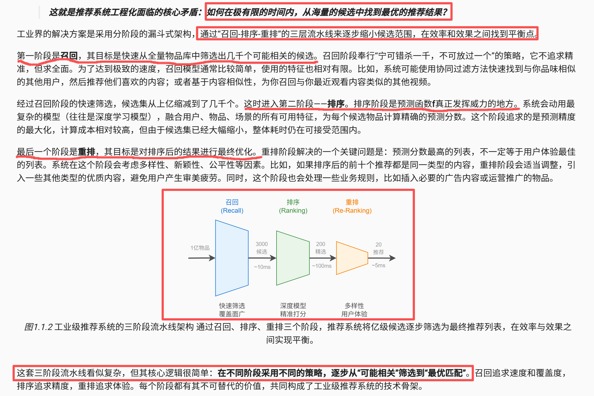
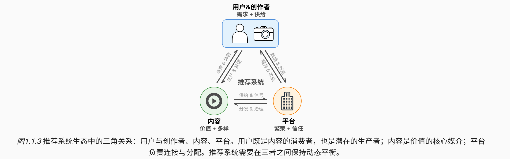
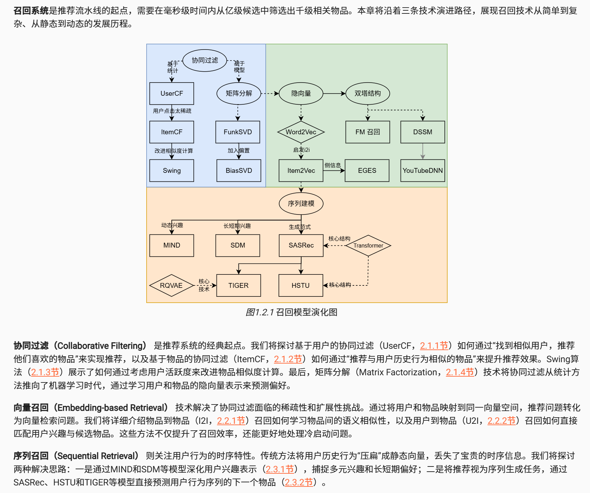
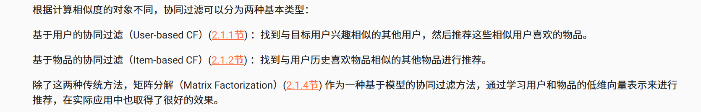
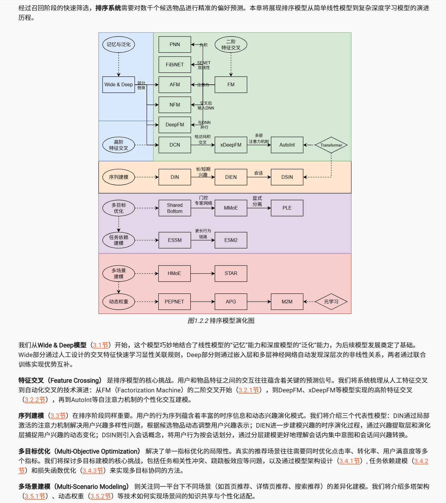
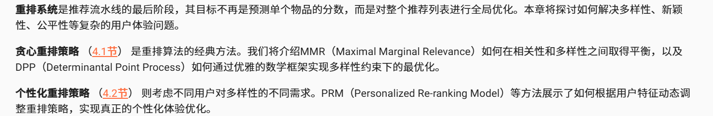

参考：

- [Datawhale - FunRec](https://datawhalechina.github.io/fun-rec/)
- [王树森 - 推荐系统公开课](https://github.com/wangshusen/RecommenderSystem)

TODO：

- [除开搜推广还有哪些，搜推广包含哪些？ - 挺逗的汪](https://www.xiaohongshu.com/discovery/item/6724c87e000000001a01edb9?source=webshare&xhsshare=pc_web&xsec_token=ABkXhVqgSw-bOM8g1BIidikgeyLJ1BqPwP0HOZL3jKW8U=&xsec_source=pc_share) 
  - 推荐：
    - 实时推荐业务：召回算法、精排模型、重排模型
    - 离线推荐业务：精排、召回、一般没有粗排、商品 or 内容理解
  - 风控：广告流量反作弊、商品鉴黄、政治正确、订单反作弊、舆情识别
  - CV：略
  - 搜索：query理解、query推荐、检索、排序、重排
  - 大模型：略
  - 评论区中对各个方向的讨论也很有价值
- [搜索引擎工作原理｜倒排索引｜query改写｜CTR点击率预估｜爬虫【重制版】](https://www.bilibili.com/video/BV1MYJczEEJj)
  - 爬虫
  - 索引&召回&query改写
  - 排序

## 概述

概述：[Bilibili - 为什么平台知道你喜欢看啥？深入底层原理~](https://www.bilibili.com/video/BV1sUpUzWEhb)

**推荐系统的最终目标不是单纯追求技术指标的最大化，而是构建一个能让所有参与方长期受益的健康生态**。在这个生态中，存在三个基本支点：**用户与创作者、内容、平台**。

## Ch1 召回

概述：

### 协同过滤

协同过滤的工作过程可以简单描述为：首先收集用户的历史行为数据（如评分、点击、购买记录），然后计算用户之间或物品之间的相似度，最后基于这些相似度为用户生成推荐。

方法分类：

总结：在本章中，我们学习了协同过滤的几种主要方法。协同过滤是推荐系统的基础技术，虽然看起来简单，但在实际应用中需要考虑很多问题。

- 我们首先学习了基于用户的协同过滤（UserCF）和基于物品的协同过滤（ItemCF）。这两种方法的思路都很直观：UserCF是找到兴趣相似的用户，然后推荐他们喜欢的物品；ItemCF是找到相似的物品进行推荐。在实际应用中，ItemCF往往比UserCF效果更好，主要原因是物品数量通常比用户数量少，物品的属性也比较稳定，相似度矩阵不需要频繁更新。
- Swing算法是对传统ItemCF的改进，它通过分析用户行为的结构特征来减少噪音的影响，从而提高推荐质量。这个算法展示了如何通过更仔细的数据分析来改进简单的统计方法。
- 矩阵分解方法代表了协同过滤的另一个发展方向。传统的UserCF和ItemCF在数据稀疏时效果不好，而矩阵分解通过学习用户和物品的隐向量表示，可以预测用户对没有交互过的物品的兴趣。FunkSVD和BiasSVD是两个典型的矩阵分解方法，它们通过训练得到用户和物品的向量表示，然后通过向量相似度来进行推荐。
- 协同过滤方法也有一些明显的局限性。最大的问题是冷启动：对于新用户或新物品，由于缺乏历史数据，很难给出好的推荐。另外，传统的协同过滤方法主要依靠用户-物品的交互数据，很难利用其他有用的信息，比如用户的个人信息、物品的内容特征等。
- 虽然有这些局限性，协同过滤的核心思想在现代推荐系统中仍然发挥着重要作用。在接下来的章节中，我们会看到许多新的方法都可以看作是协同过滤思想的延续和发展，比如Item2Vec、DSSM、YouTubeDNN等，它们用更先进的技术来实现相似的目标。

### 向量召回

技术背景：

- 虽然协同过滤技术在推荐系统发展史上扮演了重要角色，但当面对数亿用户和数千万商品的工业级规模时，传统方法开始暴露出根本性的局限。完整的用户-物品交互矩阵变得难以处理，数据的极度稀疏性使得有效信号稀缺，冷启动问题也始终无法得到根本解决。更重要的是，传统协同过滤方法在信息融合能力上的不足，限制了对用户画像、物品属性等多维数据的有效利用。
- 为了解决这些问题，向量召回技术被提出。它的核心思想源自一个简单而深刻的洞察——既然我们无法直接处理庞大的交互矩阵，为什么不将用户和物品都“压缩”成向量，然后在向量空间中进行搜索呢？

思路概述：

- 这种思想的灵感来自自然语言处理领域的嵌入（Embedding）技术。Word2Vec通过分析大量文本中词语的共现关系，能够为每个词学习一个稠密的向量表示，使得语义相近的词在向量空间中距离更近。这种嵌入技术的核心价值在于，它能够将离散的符号（如词语）映射到连续的向量空间中，让“距离”具有了语义意义。召回技术借鉴了这一嵌入思想，将用户和物品都映射到同一个向量空间中，让“距离”代表“相似度”。
- 在向量空间中，推荐问题得到了根本性的简化。原本需要遍历巨大交互矩阵的召回过程，转变为在高维向量空间中根据一个“查询”向量快速搜索出距离最近的K个物品向量。这种转变不仅大幅提升了计算效率，还通过向量的表示能力捕捉到了更深层次的语义相似性。
- 向量召回技术主要沿着两条路径发展。**i2i（Item-to-Item）召回**（[2.2.1节](https://datawhalechina.github.io/fun-rec/chapter_1_retrieval/2.embedding/1.i2i.html#i2i)）专注于计算物品与物品之间的相似性。**u2i（User-to-Item）召回**（[2.2.2节](https://datawhalechina.github.io/fun-rec/chapter_1_retrieval/2.embedding/2.u2i.html#u2i)）则直接匹配用户与物品。

### 序列召回

技术背景：

- 在前面的章节中，我们学习了协同过滤和向量召回的方法。这些方法通常将用户的历史行为汇总成一个静态的表示（比如一个向量），然后基于这个表示进行推荐。但是，用户的行为其实是有时间顺序的，而且这个顺序往往包含了重要的信息。
- 比如，一个用户先浏览了跑鞋，然后看了运动服，接着又看了健身器材，这个顺序告诉我们这个用户可能对健身运动感兴趣。如果我们只是简单地把这些行为加起来或者平均，就丢失了这种时间顺序的信息。

思路概述：

- 序列召回就是要利用用户行为的时间顺序信息来进行推荐。它的基本想法是：用户的当前兴趣不仅取决于他过去喜欢什么，还取决于他最近在做什么，以及这些行为的顺序。
- 序列召回有几个明显的优势。首先，它能够理解用户行为之间的先后关系，比如用户买了手机后可能会买手机壳。其次，它能够捕捉用户兴趣的变化，比如用户从关注数码产品转向关注户外运动。最后，它能够更好地处理用户的多个兴趣，比如一个用户既喜欢看电影又喜欢运动。

方法概述：

- 第一种思路是改进用户的表示方法 ([2.3.1节](https://datawhalechina.github.io/fun-rec/chapter_1_retrieval/3.sequence/1.user_interests.html#user-interests))。传统方法用一个向量表示用户，而这种思路用多个向量或者更复杂的结构来表示用户的兴趣。比如MIND模型用多个向量来表示用户的不同兴趣，SDM模型则区分用户的长期兴趣和短期兴趣。
- 第二种思路是把推荐看作序列预测问题 ([2.3.2节](https://datawhalechina.github.io/fun-rec/chapter_1_retrieval/3.sequence/2.generateive_recall.html#generateive-recall))。就像语言模型预测下一个词一样，这种方法直接预测用户下一个可能感兴趣的物品。SASRec是这种方法的代表，它借鉴了自然语言处理中的Transformer模型。在此基础上，HSTU模型考虑了更多的特征信息，而TIGER模型则改进了物品的表示方法。

## Ch2 排序

概述：

在完成候选的快速筛选之后，精排面向千级候选进行精细化的偏好预测，核心在于以可接受的延迟实现准确性、泛化能力与稳定性的权衡。

本章从四个方面展开：

- 以 Wide & Deep 为起点，结合记忆能力与泛化能力建立强基线；
- 围绕特征交叉从 FM 到 DeepFM/xDeepFM，再到注意力驱动的自动化交互建模，系统提升高阶关系刻画能力；
- 引入序列建模（如 DIN/DIEN/DSIN）以捕捉兴趣的多样性与时序演化；
- 讨论多目标联合优化与多场景建模，通过架构设计、任务依赖与权重策略（如多塔与动态权重）在复杂业务约束下取得稳健收益。

## Ch3 重排

概述：

在推荐系统流程中，召回阶段从海量物品中筛选出数百到数千候选，精排阶段利用复杂模型对候选集精准打分，输出按预估分数降序排列的候选列表。

然而，仅按预估分数排序的列表往往并非最优推荐结果，直接呈现给用户会面临关键挑战：

1. **多样性缺失与审美疲劳**：列表顶部高度同质化，连续推荐相似内容易引发用户厌倦，降低平台粘性和长尾内容发现机会。
2. **上下文与整体性忽略**：精排模型较少考虑列表物品间的关联性、互补性或排斥性，缺乏对整体逻辑和流畅度的考量。

**重排（Re-ranking）** 阶段作为推荐流程的最终优化环节，其作用是对精排输出的高质量候选列表进行全局优化，生成更能满足用户体验需求和业务目标的最终推荐列表。

## 难点及研究热点

## 项目实践

Fun-rec自带项目

1. **the-algorithm** （**推荐**）- Twitter推荐系统算法源代码。
2. **EasyRec （推荐）**- 是一个阿里巴巴开源的大规模推荐算法框架。
3. **d2l-zh** （**推荐**）- 《动手学深度学习 Dive into Deep Learning，D2L.ai》面向中文读者、能运行、可讨论。中英文版被70多个国家的500多所大学用于教学。
4. **NewsRecommends** - Python网络爬虫与推荐算法的新闻推荐平台。
5. **scikit-opt** - 遗传算法、粒子群算法、模拟退火、蚁群算法、免疫优化算法、鱼群算法，旅行商问题
6. **recommend_system** （**推荐**）- 皮尔森(pearson)相关系数实现千人千面的推荐算法系统
7. **[idgenerator](https://zhida.zhihu.com/search?content_id=239217586&content_type=Article&match_order=1&q=idgenerator&zhida_source=entity)** - 雪花漂移算法,原生支持 C#/Java/Go/Rust/C/SQL 等多语言，且提供 PHP 扩展及 Python、Node.js、Ruby 多线程安全调用动态库（FFI）
8. **recommenders （推荐）** -微软开源的该库包含构建推荐系统的各种示例和最佳实践，以Jupyter notebooks的形式提供。
9. **Sudoku** - 一个使用暴力破解和普通逻辑算法解题的数独分析 SDK
10. **PaddleRec （推荐）** - 大规模推荐算法库
11. **SPA** - 连续投影算法（successive projections algorithm， SPA） 是前向特征变量选择方法。
12. **gorse （推荐）**-是一个用Go语言编写的开源推荐系统。
13. **RecommenderSystem （推荐）**- 工业界的推荐系统。

## 面试经验

TODO
