测试经验：

- 有些测试时间过久，建议在tmux里测试


## 前置知识

### llama.cpp背景知识

官方：https://github.com/ggml-org/llama.cpp

参考博客：[llama.cpp: The Ultimate Guide to Efficient LLM Inference and Applications](https://pyimagesearch.com/2024/08/26/llama-cpp-the-ultimate-guide-to-efficient-llm-inference-and-applications/)


### 源码解读-batched.cpp

#### 核心逻辑

1、通用工具

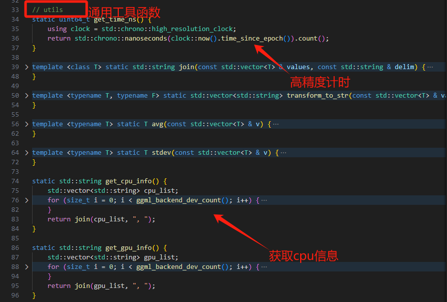


2、命令行参数解析

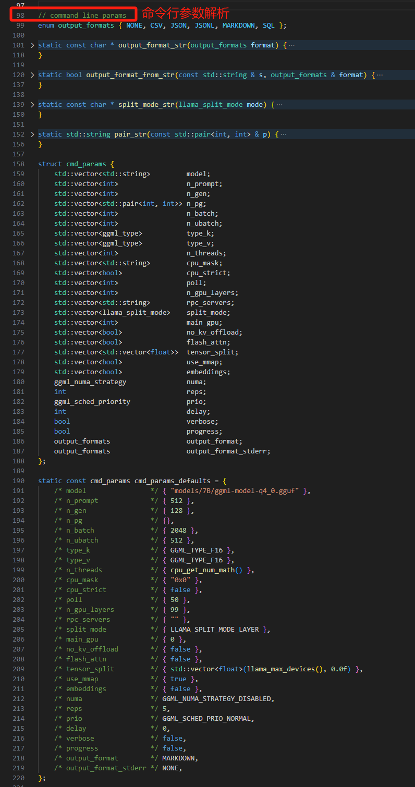

3、创建测试实例

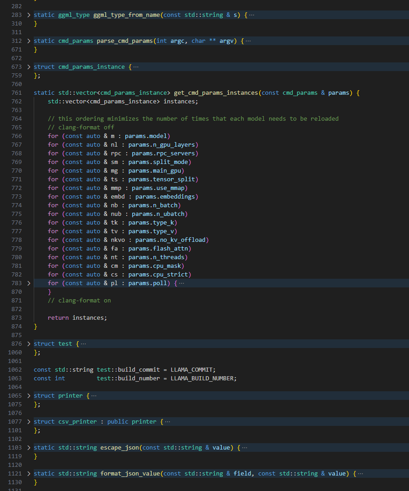


4、结果输出函数

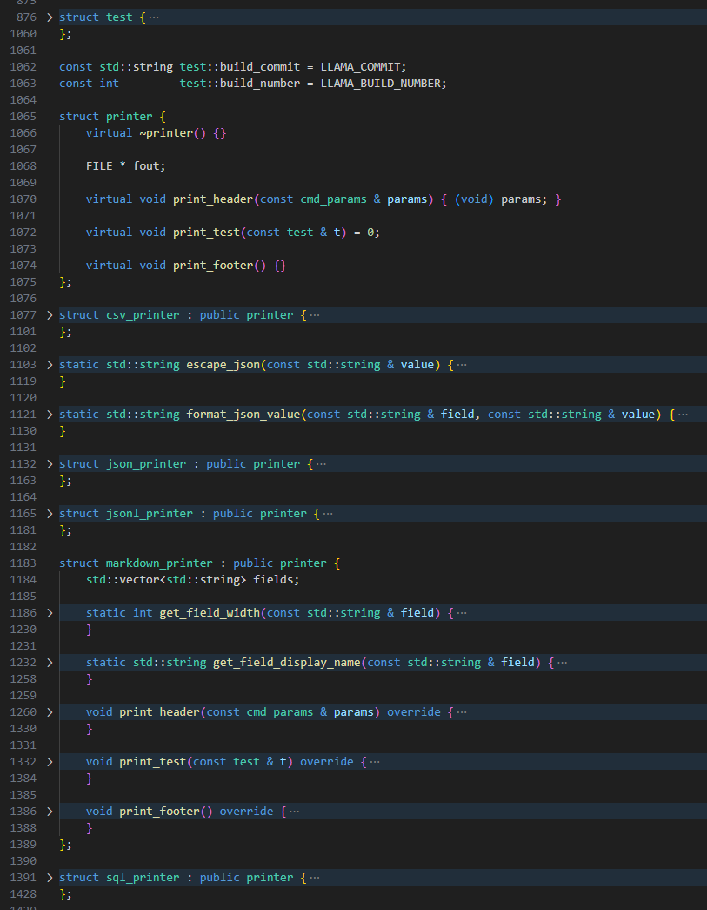


5、核心测试逻辑

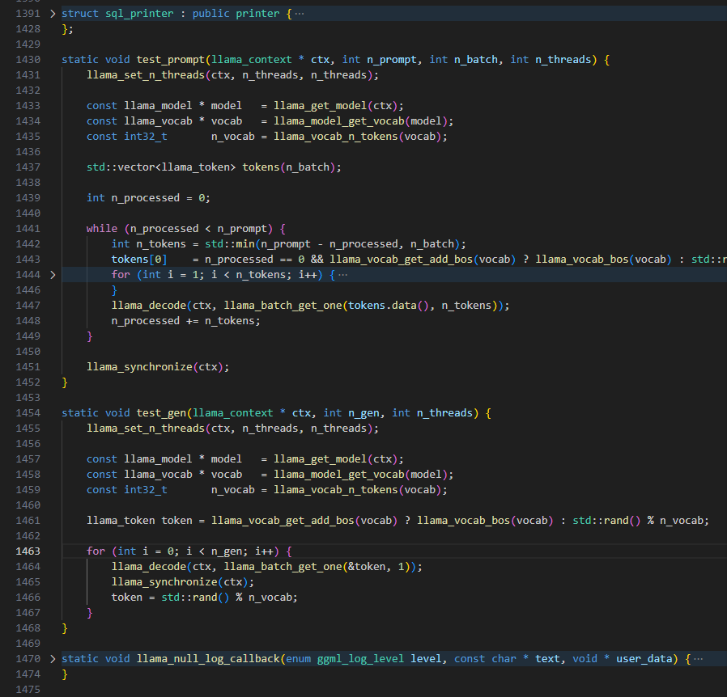


#### 测试并行压力分析

略


#### 详细参数解析

##### （1）模型相关

- `-m, --model <filename>`
  - **作用**：指定模型文件路径（支持多个模型，逗号分隔）
  - **建议**：
    - 优先使用量化模型（如q4_0/q8_0）减少内存占用
    - 多模型对比测试时用逗号分隔：`-m model1,model2`
- `-ngl, --n-gpu-layers <n>`
  - **作用**：指定GPU上运行的层数
  - **默认**：`99`（尽可能多使用GPU）
  - **建议**：
    - 显存不足时减少层数（如`-ngl 20`）
    - 设为`0`则完全使用CPU


##### （2）推理参数

-  `-p, --n-prompt <n>`
  - **作用**：提示（Prompt）处理的token数量
-  `-n, --n-gen <n>`
  - **作用**：生成（Generation）的token数量
-  `-pg <pp,tg>`
  - **作用**：同时测试Prompt处理+Token生成（格式：`提示token数,生成token数`）,设置每次生成的最大 token 数量的范围。
  - **示例**：`-pg 512,128` 测试512提示+128生成
  - **建议**：模拟真实端到端场景时使用


##### （3）批次与线程

- `-b, --batch-size <n>`
  - **作用**：推理批次大小
  - **默认**：`2048`
  - **建议**：适当增加批处理大小，以提高吞吐量，但需注意内存限制。
    - GPU推理：增大批次（`2048-4096`）提高吞吐
    - CPU推理：小批次（`512-1024`）减少内存压力
- `-ub, --ubatch-size <n>`
  - **作用**：微批次（Unroll Batch）大小
  - **默认**：`512`
  - **建议**：根据硬件性能调整批处理大小，以优化推理速度。
    - 当总批次超过显存时，用微批次分割处理
    - 通常设为`batch-size`的1/4到1/2
- `-t, --threads <n>`
  - **作用**：CPU线程数
  - **默认**：物理核心数
  - **建议**：
    - CPU推理：设为物理核心数（如`-t 8`）
    - GPU卸载：保留2-4线程处理CPU部分


##### （4）缓存与量化

- `-ctk, --cache-type-k <t>`
  - **作用**：K缓存的量化类型（`f16/q8_0/q4_0`等）
  - **默认**：`f16`
  - **建议**：
    - 显存不足时使用低精度（如`-ctk q4_0`）
    - 平衡方案：`-ctk q8_0`
- `-ctv, --cache-type-v <t>`
  - **作用**：V缓存的量化类型
  - **建议**：同`-ctk`，但V缓存对精度更敏感，建议保持`f16`


##### （5）GPU优化

- `-sm, --split-mode <none|layer|row>`
  - **作用**：多GPU并行策略
  - **默认**：`layer`（层级并行）
  - **建议**：
    - 单GPU：`none`
    - 多GPU同型号：`layer`
    - 显存差异大时：`row`（行级并行）
- `-mg, --main-gpu <i>`
  - **作用**：主GPU设备ID
  - **默认**：`0`
  - **建议**：多卡环境指定最强GPU为主卡
- `-ts, --tensor-split <ts0/ts1/...>`
  - **作用**：显存分配比例（多GPU）
  - **示例**：`-ts 70/30` GPU0占70%，GPU1占30%
  - **建议**：根据显存大小按比例分配


##### （6）CPU优化

- `-C, --cpu-mask <hex>`
  - **作用**：CPU核心绑定（十六进制掩码）
  - **示例**：`-C 0x3` 绑定core0-1
  - **建议**：
    - 避免核心竞争：`-C 0x55`（隔开核心）
    - NUMA架构：绑定同NUMA节点核心
- `--cpu-strict <0|1>`
  - **作用**：严格核心绑定（禁用线程迁移）
  - **默认**：`0`
  - **建议**：延迟敏感场景启用（`--cpu-strict 1`）
- `--numa <strategy>`
  - **作用**：NUMA内存策略
  - **选项**：`distribute`（分布）| `isolate`（隔离）| `numactl`
  - **建议**：
    - 多CPU插槽：`isolate`减少跨节点访问
    - 单节点：`distribute`


##### （7）高级参数

- `--flash-attn <0|1>`
  - **作用**：启用Flash Attention优化
  - **默认**：`0`
  - **建议**：支持GPU的必开（`--flash-attn 1`提速20%+）
- `--no-kv-offload <0|1>`
  - **作用**：禁用KV缓存卸载到GPU
  - **默认**：`0`（启用卸载）
  - **建议**：仅调试时禁用，正常使用保持默认
- `--mmap <0|1>`
  - **作用**：使用内存映射加载模型
  - **默认**：`1`（启用）
  - **建议**：除非内存不足，否则保持启用


##### （8）测试控制

- `-r, --repetitions <n>`
  - **作用**：测试重复次数
  - **默认**：`5`
  - **建议**：稳定性测试时增大（如`-r 10`）
-  `--delay <seconds>`
  - **作用**：测试间隔冷却时间
  - **默认**：`0`
  - **建议**：防止过热时设置（如`--delay 10`）
-  `-o, --output <format>`
  - **作用**：结果输出格式（`csv/json/md`等）
  - **建议**：
    - 快速查看：`-o md`（Markdown表格）
    - 数据分析：`-o csv`导入Excel


##### （9）调试参数

- `-v, --verbose`
  - **作用**：输出详细日志
  - **建议**：调试性能问题时启用
- `--progress`
  - **作用**：显示测试进度
  - **建议**：长时间测试时启用


### GGUF模型

#### 量化类型

> 在一个gguf文件夹下，经常看到不同编号的文件，如qwen2.5-7b-instruct-q4_0-00001-of-00002.gguf  、qwen2.5-7b-instruct-q4_0-00002-of-00002.gguf 、qwen2.5-7b-instruct-q4_k_m-00001-of-00002.gguf，区分q4_0、q4_k_m等，也区分001-002、002-002，这些命名有什么含义？

GGUF 文件支持多种量化方法，主要影响模型的 **精度、推理速度和内存占用**：

1. **`q4_0`（基础 4 位量化）**
   - 使用 4 位存储权重，精度较低但速度快。
   - 适合对速度敏感、硬件资源有限的场景（如 CPU 推理）。
2. **`q4_k_m`（改进型 4 位量化）**
   - 在 `q4_0` 基础上优化了量化策略（如分组量化），平衡精度与速度。
   - 通常比 `q4_0` 精度更高，但推理速度稍慢。
   - 适合需要更好效果的中端设备。

其他常见量化类型：

- `q5_0`, `q5_k_m`：5 位量化，精度更高
- `q8_0`：8 位量化，接近原始精度
- `f16`：半精度浮点，最高精度但占用内存最大


`00001-of-00002`为分片编号：表示该文件是分片后的第 1 块，总共有 2 块分片。

1. **分片原因**
   - 大模型单文件过大（如 7B 模型未量化时约 14GB），分片便于存储和传输。
   - 某些加载器支持按需加载分片，降低内存占用。
2. **使用规则**
   - 必须同时存在所有分片（如 `00001-of-00002` 和 `00002-of-00002`）。
   - **加载时会自动合并分片，用户只需指定主文件（通常附带 `gguf` 扩展名的文件会注明分片信息）。**
   - 若缺少任意分片文件，模型将无法加载。


如何选择文件？

1. **硬件配置优先**
   - 低配设备（如 8GB 内存）：选 `q4_0` 或 `q4_k_m`
   - 高性能设备（如 24GB+ 显存）：选 `q5_k_m` 或 `q8_0`
2. **精度与速度权衡**
   - 需要快速响应：`q4_0` > `q4_k_m` > `q5_k_m`
   - 需要高质量输出：`q8_0` > `q5_k_m` > `q4_k_m`
3. **实操建议**
   - 优先测试 `q4_k_m`（性价比最佳）


### KTransformers背景知识

官方Github：https://github.com/kvcache-ai/ktransformers

官方教程（涵盖了项目中的doc下的内容）：https://kvcache-ai.github.io/ktransformers/en/install.html

官方DeepSeek测试记录：https://github.com/kvcache-ai/ktransformers/blob/main/doc/en/DeepseekR1_V3_tutorial.md


默认启动方法：

```
python -m ktransformers.local_chat --model_path deepseek-ai/DeepSeek-V2-Lite-Chat --gguf_path ./DeepSeek-V2-Lite-Chat-GGUF
```

其他参数：

- `--max_new_tokens`： Int （默认 = 1000）。要生成的最大新令牌数。
- `--cpu_infer`：Int （默认值 = 10）。用于推理的 CPU 数量。理想情况下，应设置为 （内核总数 - 2）。


V0.2 针对双插槽的基准测试：

```
export USE_NUMA=1
python ./ktransformers/local_chat.py --model_path <your model path> --gguf_path <your gguf path>  --prompt_file <your prompt txt file>  --cpu_infer 65 --max_new_tokens 1000
```


### 源码解读-config

```
log:
  dir: "logs"          # 日志存储目录
  file: "lexllama.log" # 日志文件名
  #log level: debug, info, warn, error, crit
  level: "debug"       # 日志详细级别（debug最详细）
  backup_count: -1     # 日志备份数量（-1=无限制）

server:
  ip: 0.0.0.0         # 服务监听IP（0.0.0.0=允许所有网络访问）
  port: 10002          # 服务监听端口

db:
  type: "sqllite"      # 数据库类型（疑似拼写错误，应为sqlite）
  database: "server.db" # 数据库文件名
  host: "./"           # 数据库存储路径（当前目录）
  pool_size: 10        # 连接池大小（SQLite通常无效）

user:
  secret_key: "981f1dd2a44e27d68759d0252a486568ed43480b4e616a26e3af3709c3a7ce73"  # JWT签名密钥
  algorithm: "HS256"   # JWT签名算法（HS256=HMAC-SHA256）

model:
  # type: transformers # 被注释的选项
  type: ktransformers  # 模型加载框架类型（优化版transformers？）

  name: DeepSeek-Coder-V2-Instruct  # 显示用模型名称
  path: deepseek-ai/DeepSeek-V2-Lite-Chat  # HuggingFace模型路径
  gguf_path: ./DeepSeek-V2-Lite-Chat-GGUF  # GGUF量化模型路径（节省显存）

  device: cuda:0       # 模型运行设备（GPU 0）
  cache_lens: 8192     # 上下文缓存长度（关联模型最大窗口）

web:
  mount: False         # 是否挂载静态资源
  open_cross_domain: True  # 是否允许跨域请求（CORS）

ext:
  cpu_infer: 10        # CPU推理线程数/并发数

long_context:          # 长文本处理优化参数
  chunk_size: 4096     # 文本分块大小（tokens）
  max_seq_len: 32000   # 最大序列长度（tokens）
  block_size: 128      # 注意力块大小
  local_windows_len: 4096  # 局部注意力窗口长度
  second_select_num: 32  # 二次选择块数量
  anchor_type: DYNAMIC # 锚点类型（动态选择关键位置）
  kv_type: FP16        # Key-Value矩阵数据类型（半精度）
  dense_layer_num: 2   # 使用密集注意力的层数
  anchor_num: 1        # 每个块的锚点数量
  preselect_block: True  # 是否预选注意力块（提升效率）
  head_select_mode: SHARED  # 多头注意力选择模式（共享策略）
  preselect_block_count: 32  # 预选块数量
  layer_step: 1        # 注意力层处理步长（逐层处理）
  token_step:          # Token处理步长（未配置，需确认默认值）

local_chat:
  prompt_file: ""      # 本地聊天提示模板文件路径（空=未指定）
```


## 环境配置

#### 免密连接远程服务器

1. 在个人电脑生成密钥对：`ssh-keygen -t rsa -b 4096 -C "your_email@example.com"`，我这里就直接`ssh-keygen`不加参数了
2. 复制个人电脑公钥`id_rsa.pub`的内容：`cat $env:USERPROFILE\.ssh\id_rsa.pub`
3. 将个人电脑的公钥内容添加到远程服务器：
   - ssh连接远程服务器：`ssh username@server_ip -p 端口`
   - 将公钥内容添加到远程服务器的 `authorized_keys` 文件中（此文件可以存在多条密钥，且在 `nano` 中，按 `Ctrl + O` 保存，按 `Ctrl + X` 退出）：`nano ~/.ssh/authorized_keys`
   - 确保文件权限正确：`chmod 700 ~/.ssh`、`chmod 600 ~/.ssh/authorized_keys`
   - 备注：可一键完成添加
     - linux：`ssh-copy-id username@remote_host`
     - windows powershell：`type $env:USERPROFILE\.ssh\id_rsa.pub | ssh username@remote_host "mkdir -p ~/.ssh && cat >> ~/.ssh/authorized_keys"`
4. 测试免密连接：`ssh username@server_ip -p 端口`


#### tmux

安装：

```
# Ubuntu 或 Debian
$ sudo apt install tmux

# CentOS 或 Fedora
$ sudo yum install tmux

# Mac
$ brew install tmux
```

常用指令

- 启动 Tmux：`tmux`，或`tmux new -s [session_name]`
- 列出会话：`tmux ls`
- 进入指定会话：`tmux attach -t 会话名`
- 退出 Tmux 窗口：按下`Ctrl+d`或者显式输入`exit`命令

已经启动的终端是否可以加入tmux?

- 可以尝试`reptyr` 工具


#### 编译安装llama.cpp

官网链接：https://github.com/ggml-org/llama.cpp/blob/master/docs/build.md

- 拉取项目

  ```
  git clone https://github.com/ggerganov/llama.cpp
  cd llama.cpp
  ```

- 编译安装：

  ```
  # CPU编译安装
  cmake -B build  # 配置项目并生成构建系统文件
  cmake --build build --config Release  # 在构建目录中执行构建
  
  # 只编译安装部分部件，如llama-cli
  make llama-cli
  
  # GPU编译安装
  cmake -B build -DGGML_CUDA=ON
  cmake --build build --config Release
  
  # 示例使用方法
  CUDA_VISIBLE_DEVICES="-0" ./build/bin/llama-server --model /srv/models/llama.gguf
  ```

其中：

- **第一条指令：** `cmake -B build`。这条命令用于配置项目并生成构建系统文件。

  - `-B build`：指定构建目录为 `build`，即将构建文件生成到 `build` 目录中。
  - 执行此命令后，CMake 会在 `build` 目录下生成适合当前平台的构建系统文件（如 Makefile 或 Visual Studio 的项目文件），以供后续构建使用。

- **第二条指令：** `cmake --build build --config Release`：这条命令用于在指定的构建目录中执行构建操作。

  - `--build build`：指定构建目录为 `build`。

  - `--config Release`：指定构建配置为 `Release`，用于多配置生成器（如 Visual Studio）。
  - 执行此命令后，CMake 会调用相应的构建工具（如 `make` 或 Visual Studio 的构建系统）来编译项目，生成最终的可执行文件或库。


CMake 本身并不直接进行编译工作。它的主要作用是根据 `CMakeLists.txt` 文件生成适合当前平台的构建系统文件（如 Makefile 或 Visual Studio 的项目文件）。

这些构建系统文件定义了如何编译和链接源代码。

在生成了构建系统文件后，您可以使用相应的构建工具（如 `make` 或 Visual Studio）来实际执行编译过程。

即，在执行cmake --build build --config Release时，虽然cmake不负责编译，但是其调用了编译工具编译当前项目


**与直接使用 `make` 的区别与联系：**

- **区别：** 使用 `cmake` 命令可以自动生成适合当前平台的构建系统文件，而直接使用 `make` 需要手动编写或已有现成的 Makefile。

- **联系：** 在使用 CMake 生成了 Makefile 后，您可以在构建目录中直接使用 `make` 命令来编译项目。如：

  ```
  cd build
  make
  ```


#### 基准测试

官方链接：https://github.com/ggml-org/llama.cpp/blob/master/examples/llama-bench/README.md

示例：`./llama-bench -m models/7B/ggml-model-q4_0.gguf -m models/13B/ggml-model-q4_0.gguf -p 0 -n 128,256,512`

参数说明：

- `-m`：指定模型文件路径。
- `-p`：设置提示词长度。
- `-n`：设置生成文本的长度。
- `-b`：设置批处理大小。
- `-t`：设置使用的线程数。
- `-r`：设置每个测试的重复次数。
- `-o`：设置输出格式，如 `csv`、`json`、`md` 等。
- `-v`：启用详细输出。


详细说明：

- 略


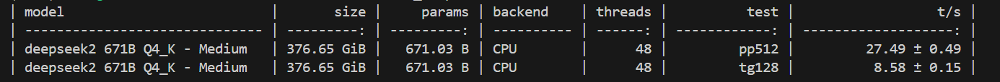

结果数据说明：

- `PP` - prompt tokens per batch
- `TG` - generated tokens per batch
- `B` - number of batches
- `N_KV` - required KV cache size
- `T_PP` - prompt processing time (i.e. time to first token)
- `S_PP` - prompt processing speed (`(B*PP)/T_PP` or `PP/T_PP`)
- `T_TG` - time to generate all batches
- `S_TG` - text generation speed (`(B*TG)/T_TG`)
- `T` - total time
- `S` - total speed (i.e. all tokens / total time)


单次测试示例：

```
curl --location 'http://0.0.0.0:8085/v1/chat/completions' \
  --header 'Content-Type: application/json' \
  --data '{
  "model": "DeepSeek-R1-Q4_K_M",
  "messages": [
    {
      "role": "user",
      "content": "解释一下量子计算"
    }
  ],
  "max_tokens": 512,
  "temperature": 0.2,
  "stream": true
}'
```


#### 资源监测

1、CPU、内存相关

```
import psutil
import time
import signal
import sys

# 用于存储CPU和内存的实时统计数据
cpu_usages = []
memory_usages = []
peak_cpu = 0
peak_memory = 0

# 捕获Ctrl+C退出时的信号
def signal_handler(sig, frame):
    avg_cpu = sum(cpu_usages) / len(cpu_usages) if cpu_usages else 0
    avg_memory = sum(memory_usages) / len(memory_usages) if memory_usages else 0

    # 打印CPU和内存的统计信息
    print(f"\nCPU占用率（均值/峰值）: {avg_cpu:.1f}% / {peak_cpu:.1f}%")
    print(f"内存占用（均值/峰值）: {avg_memory / 1024:.1f}MB / {peak_memory / 1024:.1f}MB")
    sys.exit(0)

# 注册Ctrl+C信号处理器
signal.signal(signal.SIGINT, signal_handler)

# 模拟运行的任务，收集CPU和内存使用情况
print("程序正在运行，请稍候...按Ctrl+C退出并查看结果")

try:
    while True:
        # 获取CPU占用率（每秒一次）
        cpu_usage = psutil.cpu_percent(interval=1)
        cpu_usages.append(cpu_usage)
        peak_cpu = max(peak_cpu, cpu_usage)

        # 获取内存占用情况（当前使用的物理内存）
        memory_usage = psutil.virtual_memory().used
        memory_usages.append(memory_usage)
        peak_memory = max(peak_memory, memory_usage)

        # 实时显示CPU和内存占用
        print(f"\r当前CPU占用率: {cpu_usage:.1f}%  当前内存占用: {memory_usage / 1024:.1f}MB", end='', flush=True)

        # 模拟一些计算任务，避免CPU占用过低
        time.sleep(0.1)

except KeyboardInterrupt:
    pass  # 通过Ctrl+C触发的异常处理

```


2、GPU相关

```
nvidia-smi --query-gpu=index,timestamp,utilization.gpu,memory.used,power.draw,temperature.gpu --format=csv,noheader,nounits -l 1 -f gpu_stats.log
```

```
import pandas as pd

# 读取日志文件
df = pd.read_csv("gpu_stats.log", header=None,
                 names=["index", "timestamp", "utilization.gpu [%]", "memory.used [MiB]", "power.draw [W]",
                        "temperature.gpu [°C]"])

# 确保所有列为字符串类型再进行提取
df['utilization.gpu [%]'] = df['utilization.gpu [%]'].astype(str).str.extract('(\d+)').astype(float)
df['memory.used [MiB]'] = df['memory.used [MiB]'].astype(str).str.extract('(\d+)').astype(float)
df['power.draw [W]'] = df['power.draw [W]'].astype(str).str.extract('(\d+\.?\d*)').astype(float)
df['temperature.gpu [°C]'] = df['temperature.gpu [°C]'].astype(str).str.extract('(\d+)').astype(float)

# 计算每个 GPU 的峰值
gpu_stats = {}

# 获取所有 GPU 索引
gpu_indexes = df['index'].unique()

for gpu in gpu_indexes:
    gpu_data = df[df['index'] == gpu]

    gpu_stats[gpu] = {
        "GPU利用率 (%)": gpu_data['utilization.gpu [%]'].max(),
        "显存占用峰值 (MiB)": gpu_data['memory.used [MiB]'].max(),
        "功耗峰值 (W)": gpu_data['power.draw [W]'].max(),
        "温度峰值 (°C)": gpu_data['temperature.gpu [°C]'].max()
    }

# 计算所有 GPU 显存的峰值总和
total_memory_peak = df.groupby('timestamp')['memory.used [MiB]'].max().sum()

# 输出每个 GPU 的峰值
print("每个 GPU 的峰值：")
for gpu, stats in gpu_stats.items():
    print(f"GPU-{gpu}:")
    for k, v in stats.items():
        print(f"  {k}: {v:.2f}")

# 输出所有 GPU 显存的峰值总和
print(f"\n所有 GPU 显存占用的峰值总和 (MiB): {total_memory_peak:.2f}")

```


#### huggingface_cli

下载工具：

```
pip install -U huggingface_hub
echo 'export HF_ENDPOINT=https://hf-mirror.com' >> ~/.bashrc
source ~/.bashrc
```

下载整个模型目录：

```
huggingface-cli download --resume-download Qwen/Qwen2.5-72B-Instruct-GPTQ-Int4 --local-dir Qwen/Qwen2.5-72B-Instruct-GPTQ-Int4
```

下载指定：

```
huggingface-cli download <模型名称> --include "<目录路径>/*" --local-dir <本地目录>
```

例如：

```
huggingface-cli download unsloth/DeepSeek-V3-GGUF --include "DeepSeek-V3-Q4_K_M*" --local-dir /home/user/LLM/models/unsloth/DeepSeek-V3-GGUF
```

下载特定文件：

```
huggingface-cli download <模型名称> <文件1> <文件2> --local-dir <本地目录>
```


#### CPU下vLLM部署

仅CPU环境下，不能直接pip install vllm，默认是gpu版本的，测试时会出现notimplementederror，需要参考官网教程进行编译安装：https://docs.vllm.ai/en/stable/getting_started/installation/cpu/index.html


安装后可能还会遇到：`ImportError: Please install intel_extension_for_pytorch>=2.5.0 via pip install intel_extension_for_pytorch>=2.5.0 to use IPEX-AWQ linear method.`

按要求安装后，进行基准测试会出现：`AttributeError: module 'os' has no attribute 'exit'. Did you mean: '_exit'?`


怀疑是intel_extension_for_pytorch版本问题，默认是安装2.6.0，换成2.5.0后问题解决


测试时如果出现（内存仍剩余许多）：`ValueError: The model's max seq len (32768) is larger than the maximum number of tokens that can be stored in KV cache (13104). Try increasing `VLLM_CPU_KVCACHE_SPACE` or decreasing `max_model_len` when initializing the engine.`

说明模型的最大序列长度 (32768) 大于 KV 缓存中可存储的最大 token 数。

解决方法：减少max_model_len，在命令后加上--max_model_len 4096


#### 环境问题

奇怪的现象，用vllm测试后，再去基于llama.cpp测试deepseek-r1，发现prompt阶段，cpu利用率只有17%左右，token输出速度很慢，生成阶段一切正常，cpu利用率是满的，速度稍微慢了一点，如下所示

```
| model                          |       size |     params | backend    | threads |          test |                  t/s |
| ------------------------------ | ---------: | ---------: | ---------- | ------: | ------------: | -------------------: |
| deepseek2 671B Q4_K - Medium   | 376.65 GiB |   671.03 B | BLAS       |      48 |         pp512 |          2.95 ± 0.00 |
| deepseek2 671B Q4_K - Medium   | 376.65 GiB |   671.03 B | BLAS       |      48 |         tg128 |          7.60 ± 0.03 |
```

重新编译了一下，prompt阶段的cpu利用率已恢复正常的接近100%，速度也恢复成了28，生成阶段再次降低，可能是引文当前修改了numa的缘故


#### EPYC测试经验

参考：

- 202502-修改numa提升速度：https://github.com/ggml-org/llama.cpp/discussions/11765
- 202501-numa与moe：https://github.com/ggml-org/llama.cpp/issues/11333
- 202501-deepseek-q1的基准测试-经验尝试：https://github.com/ggml-org/llama.cpp/issues/11474
- 202404-epyc未充分利用问题：https://github.com/ggml-org/llama.cpp/issues/6434
- 202402-openblas下线程增加性能下降：https://github.com/ggml-org/llama.cpp/issues/5534
- 202401-numa不起作用：https://github.com/ggml-org/llama.cpp/issues/5121
- 202401-AOCL：https://github.com/ggml-org/llama.cpp/issues/5005
- 202307-GPU显存占用少速度慢问题：https://github.com/ggml-org/llama.cpp/issues/2128
- 202305-AVX在不同精度上的尝试：https://github.com/ggml-org/llama.cpp/pull/1073

- 202305- numa修改-讨论了许多关于numa设置类型、smt等设置：https://github.com/ggml-org/llama.cpp/issues/1437 
- 202304 -BLAS与batch-size：https://github.com/ggml-org/llama.cpp/issues/817
- 202304-线程并非越多越好：https://github.com/ggml-org/llama.cpp/issues/34


## llama.cpp优化测试

实验总结：每个实验均在baseline的基础上，修改部分参数，与baseline结果做对比

| 实验编号 | 实验概述                       | 实验设计                                                     | 实验结果（tokens/s）                                         | 实验分析                                                     |
| -------- | ------------------------------ | ------------------------------------------------------------ | ------------------------------------------------------------ | ------------------------------------------------------------ |
| Baseline | Baseline                       | Q4_K_M模型 + 默认参数                                        | 8.47 ± 0.28                                                  | 速度低于正常人阅读速度，再加上推理模型需要输出大量的思考内容、项目中每次workflow里需要使用多次大模型。因此，不满足项目需求 |
| 实验1    | 增加生成token长度              | 从默认128提高到1024,4096,32768                               | tg1024：7.91 ± 0.13<br />tg4096：6.48 ± 0.01<br />tg32768：推理过久，略 | 增大token输出长度，可能导致token输出速度变慢                 |
| 实验2    | 使用不同量化方案               | 采用Q8_0                                                     | 6.18 ± 0.22                                                  | Q4换为Q8后，速度降低2左右，精度提高多少未知                  |
| 实验3    | 修改CPU多线程数                | 针对默认的CPU物理核心数（48），升高/减少线程数               | 减少（24）：7.62 ± 0.01<br />减少（35）：8.58 ± 0.01<br />增大（72）：1.97 ± 0.00 | 1、大幅减小线程数，在一些限制下，token输出速度小幅下降<br />2、小幅减小线程数，在一些限制下，token输出速度微微提高<br />3、增大线程数，token输出速度大幅下降<br />4、由于每次测试默认使用了全部的CPU物理核心，所以并行测试时会导致新测试所得输出速度非常小，不能并行测试 |
| 实验4    | BLAS                           | 重新编译llama.cpp，启用BLAS                                  | 7.35 ± 0.21                                                  | token输出速度小幅降低（尝试了两种启动BLAS方案，暂不确定是否有效使用BLAS，但结果是均降低） |
| 实验5    | AVX、FMA                       | 重新编译llama.cpp，启用AVX和FMA（当前CPU支持）               | 6.35 ± 0.21                                                  | token输出速度降低                                            |
| 实验6    | 提前缓存KV数据                 | 对于较长文本的推理，开启 KV 缓存可以避免重复计算             | llama-bench无相关参数                                        | -------                                                      |
| 实验7    | 调整KV精度                     | 从默认的fp16修改为q4_0（k可以降低，v降低后会报错，同时有人在issue中反馈ctv最好不要改） | 8.60 ± 0.39                                                  | 微微提高                                                     |
| 实验8    | 关闭mmap                       | llama.cpp 会使用 `mmap()` 加载模型，如果你的 CPU 高内存且 I/O 不是瓶颈，可以尝试关闭 | 8.22 ± 0.23                                                  | token输出速度小幅降低                                        |
| 实验9.1  | 调整batch_size                 | batch_size从默认2048修改到4096                               | tg128：8.52 ± 0.28<br />tg512：8.05 ± 0.05                   | 几乎无提升，增大token长度后，也几乎无提升                    |
| 实验9.2  | 调整微批次（Unroll Batch）大小 | 1、batch_size从默认2048修改到4096<br />2、Unroll Batch从默认512修改到1024 | 8.52 ± 0.36                                                  | 几乎无提升                                                   |
| 实验10   | 减低 `context length`          | 降低 `context length` 以减少计算量                           | llama-bench无相关参数                                        | -------                                                      |
| 实验11   | 使用Flash Attention            | 启用Flash Attention                                          | 8.46 ± 0.17                                                  | 与baseliene持平                                              |


### 0、测试环境及Baseline

CPU：`lscpu`

```
架构：                    x86_64
  CPU 运行模式：          32-bit, 64-bit
  Address sizes:          52 bits physical, 57 bits virtual
  字节序：                Little Endian
CPU:                      96
  在线 CPU 列表：         0-95
厂商 ID：                 AuthenticAMD
  型号名称：              AMD EPYC 9254 24-Core Processor
    CPU 系列：            25
    型号：                17
    每个核的线程数：      2
    每个座的核数：        24
    座：                  2
    步进：                1
    Frequency boost:      enabled
    CPU 最大 MHz：        4151.7568
    CPU 最小 MHz：        1500.0000
    BogoMIPS：            5799.73
    标记：                fpu vme de pse tsc msr pae mce cx8 apic sep mtrr pge mca cmov pat pse36 clflush mmx fxsr sse sse2 ht syscall nx mmxext fxsr_opt pdpe1gb rdtscp lm constant_tsc re
                          p_good amd_lbr_v2 nopl nonstop_tsc cpuid extd_apicid aperfmperf rapl pni pclmulqdq monitor ssse3 fma cx16 pcid sse4_1 sse4_2 x2apic movbe popcnt aes xsave avx f1
                          6c rdrand lahf_lm cmp_legacy svm extapic cr8_legacy abm sse4a misalignsse 3dnowprefetch osvw ibs skinit wdt tce topoext perfctr_core perfctr_nb bpext perfctr_llc
                           mwaitx cpb cat_l3 cdp_l3 hw_pstate ssbd mba perfmon_v2 ibrs ibpb stibp ibrs_enhanced vmmcall fsgsbase bmi1 avx2 smep bmi2 erms invpcid cqm rdt_a avx512f avx512d
                          q rdseed adx smap avx512ifma clflushopt clwb avx512cd sha_ni avx512bw avx512vl xsaveopt xsavec xgetbv1 xsaves cqm_llc cqm_occup_llc cqm_mbm_total cqm_mbm_local u
                          ser_shstk avx512_bf16 clzero irperf xsaveerptr rdpru wbnoinvd amd_ppin cppc arat npt lbrv svm_lock nrip_save tsc_scale vmcb_clean flushbyasid decodeassists pause
                          filter pfthreshold avic v_vmsave_vmload vgif x2avic v_spec_ctrl vnmi avx512vbmi umip pku ospke avx512_vbmi2 gfni vaes vpclmulqdq avx512_vnni avx512_bitalg avx512
                          _vpopcntdq la57 rdpid overflow_recov succor smca fsrm flush_l1d debug_swap
Virtualization features:  
  虚拟化：                AMD-V
Caches (sum of all):      
  L1d:                    1.5 MiB (48 instances)
  L1i:                    1.5 MiB (48 instances)
  L2:                     48 MiB (48 instances)
  L3:                     256 MiB (8 instances)
NUMA:                     
  NUMA 节点：             1
  NUMA 节点0 CPU：        0-95
Vulnerabilities:          
  Gather data sampling:   Not affected
  Itlb multihit:          Not affected
  L1tf:                   Not affected
  Mds:                    Not affected
  Meltdown:               Not affected
  Mmio stale data:        Not affected
  Reg file data sampling: Not affected
  Retbleed:               Not affected
  Spec rstack overflow:   Mitigation; Safe RET
  Spec store bypass:      Mitigation; Speculative Store Bypass disabled via prctl
  Spectre v1:             Mitigation; usercopy/swapgs barriers and __user pointer sanitization
  Spectre v2:             Mitigation; Enhanced / Automatic IBRS; IBPB conditional; STIBP always-on; RSB filling; PBRSB-eIBRS Not affected; BHI Not affected
  Srbds:                  Not affected
  Tsx async abort:        Not affected
```


内存：

- 内存情况：`free -h`

  ```
                 total        used        free      shared  buff/cache   available
  内存：      1.1Ti       8.7Gi       365Gi       139Mi       758Gi       1.1Ti
  交换：         0B          0B          0B
  ```

- 内存条情况：`sudo dmidecode -t memory`，24 * 48G = 1,152G

  ```
  Handle 0x003A, DMI type 16, 23 bytes
  Physical Memory Array
          Location: System Board Or Motherboard
          Use: System Memory
          Error Correction Type: Multi-bit ECC
          Maximum Capacity: 12 TB
          Error Information Handle: 0x0039
          Number Of Devices: 24
  
  Handle 0x003D, DMI type 17, 92 bytes
  Memory Device
          Array Handle: 0x003A
          Error Information Handle: 0x003C
          Total Width: 72 bits
          Data Width: 64 bits
          Size: 48 GB
          Form Factor: DIMM
          Set: None
          Locator: DIMM_P0_A0
          Bank Locator: BANK 0
          Type: DDR5
          Type Detail: Synchronous Registered (Buffered)
          Speed: 4800 MT/s
          Manufacturer: SK Hynix
          Serial Number: 46794939
          Asset Tag: Not Specified
          Part Number: HMCGY4MEBQB218N     
          Rank: 1
          Configured Memory Speed: 4800 MT/s
          Minimum Voltage: 1.1 V
          Maximum Voltage: 1.1 V
          Configured Voltage: 1.1 V
          Memory Technology: DRAM
          Memory Operating Mode Capability: Volatile memory
          Firmware Version: Unknown
          Module Manufacturer ID: Bank 1, Hex 0xAD
          Module Product ID: Unknown
          Memory Subsystem Controller Manufacturer ID: Unknown
          Memory Subsystem Controller Product ID: Unknown
          Non-Volatile Size: None
          Volatile Size: 48 GB
          Cache Size: None
          Logical Size: None
  ```

硬盘信息：

```
$ lsblk
NAME        MAJ:MIN RM   SIZE RO TYPE MOUNTPOINTS
loop0         7:0    0     4K  1 loop /snap/bare/5
loop1         7:1    0  74.3M  1 loop /snap/core22/1612
loop2         7:2    0 271.2M  1 loop /snap/firefox/4848
loop3         7:3    0 505.1M  1 loop /snap/gnome-42-2204/176
loop4         7:4    0  91.7M  1 loop /snap/gtk-common-themes/1535
loop5         7:5    0  12.9M  1 loop /snap/snap-store/1113
loop6         7:6    0  38.8M  1 loop /snap/snapd/21759
loop7         7:7    0   500K  1 loop /snap/snapd-desktop-integration/178
loop8         7:8    0  44.4M  1 loop /snap/snapd/23545
loop9         7:9    0   568K  1 loop /snap/snapd-desktop-integration/253
loop10        7:10   0  73.9M  1 loop /snap/core22/1748
nvme0n1     259:0    0   1.8T  0 disk 
├─nvme0n1p1 259:1    0   512M  0 part /boot/efi
└─nvme0n1p2 259:2    0   1.8T  0 part /

$ df -h
文件系统        大小  已用  可用 已用% 挂载点
tmpfs           114G   27M  114G    1% /run
/dev/nvme0n1p2  1.8T  1.1T  663G   62% /
tmpfs           567G  4.0K  567G    1% /dev/shm
tmpfs           5.0M     0  5.0M    0% /run/lock
efivarfs        128K   31K   93K   25% /sys/firmware/efi/efivars
/dev/nvme0n1p1  511M  6.1M  505M    2% /boot/efi
tmpfs           114G  1.7M  114G    1% /run/user/1000
```


系统信息：

```
$ uname -a
Linux user-MZ73-LM0-000 6.8.0-52-generic #53~22.04.1-Ubuntu SMP PREEMPT_DYNAMIC Wed Jan 15 19:18:46 UTC 2 x86_64 x86_64 x86_64 GNU/Linux

$ cat /etc/os-release
PRETTY_NAME="Ubuntu 22.04.5 LTS"
NAME="Ubuntu"
VERSION_ID="22.04"
VERSION="22.04.5 LTS (Jammy Jellyfish)"
VERSION_CODENAME=jammy
ID=ubuntu
ID_LIKE=debian
HOME_URL="https://www.ubuntu.com/"
SUPPORT_URL="https://help.ubuntu.com/"
BUG_REPORT_URL="https://bugs.launchpad.net/ubuntu/"
PRIVACY_POLICY_URL="https://www.ubuntu.com/legal/terms-and-policies/privacy-policy"
UBUNTU_CODENAME=jammy
```


测试默认参数：

```python
struct cmd_params {
    std::vector<std::string>         model;
    std::vector<int>                 n_prompt;
    std::vector<int>                 n_gen;
    std::vector<std::pair<int, int>> n_pg;
    std::vector<int>                 n_batch;
    std::vector<int>                 n_ubatch;
    std::vector<ggml_type>           type_k;
    std::vector<ggml_type>           type_v;
    std::vector<int>                 n_threads;
    std::vector<std::string>         cpu_mask;
    std::vector<bool>                cpu_strict;
    std::vector<int>                 poll;
    std::vector<int>                 n_gpu_layers;
    std::vector<std::string>         rpc_servers;
    std::vector<llama_split_mode>    split_mode;
    std::vector<int>                 main_gpu;
    std::vector<bool>                no_kv_offload;
    std::vector<bool>                flash_attn;
    std::vector<std::vector<float>>  tensor_split;
    std::vector<bool>                use_mmap;
    std::vector<bool>                embeddings;
    ggml_numa_strategy               numa;
    int                              reps;
    ggml_sched_priority              prio;
    int                              delay;
    bool                             verbose;
    bool                             progress;
    output_formats                   output_format;
    output_formats                   output_format_stderr;
};

static const cmd_params cmd_params_defaults = {
    /* model                */ { "models/7B/ggml-model-q4_0.gguf" },
    /* n_prompt             */ { 512 },
    /* n_gen                */ { 128 },
    /* n_pg                 */ {},
    /* n_batch              */ { 2048 },
    /* n_ubatch             */ { 512 },
    /* type_k               */ { GGML_TYPE_F16 },
    /* type_v               */ { GGML_TYPE_F16 },
    /* n_threads            */ { cpu_get_num_math() },
    /* cpu_mask             */ { "0x0" },
    /* cpu_strict           */ { false },
    /* poll                 */ { 50 },
    /* n_gpu_layers         */ { 99 },
    /* rpc_servers          */ { "" },
    /* split_mode           */ { LLAMA_SPLIT_MODE_LAYER },
    /* main_gpu             */ { 0 },
    /* no_kv_offload        */ { false },
    /* flash_attn           */ { false },
    /* tensor_split         */ { std::vector<float>(llama_max_devices(), 0.0f) },
    /* use_mmap             */ { true },
    /* embeddings           */ { false },
    /* numa                 */ GGML_NUMA_STRATEGY_DISABLED,
    /* reps                 */ 5,
    /* prio                 */ GGML_SCHED_PRIO_NORMAL,
    /* delay                */ 0,
    /* verbose              */ false,
    /* progress             */ false,
    /* output_format        */ MARKDOWN,
    /* output_format_stderr */ NONE,
};

static void print_usage(int /* argc */, char ** argv) {
    printf("usage: %s [options]\n", argv[0]);
    printf("\n");
    printf("options:\n");
    printf("  -h, --help\n");
    printf("  -m, --model <filename>                    (default: %s)\n", join(cmd_params_defaults.model, ",").c_str());
    printf("  -p, --n-prompt <n>                        (default: %s)\n",
           join(cmd_params_defaults.n_prompt, ",").c_str());
    printf("  -n, --n-gen <n>                           (default: %s)\n", join(cmd_params_defaults.n_gen, ",").c_str());
    printf("  -pg <pp,tg>                               (default: %s)\n",
           join(transform_to_str(cmd_params_defaults.n_pg, pair_str), ",").c_str());
    printf("  -b, --batch-size <n>                      (default: %s)\n",
           join(cmd_params_defaults.n_batch, ",").c_str());
    printf("  -ub, --ubatch-size <n>                    (default: %s)\n",
           join(cmd_params_defaults.n_ubatch, ",").c_str());
    printf("  -ctk, --cache-type-k <t>                  (default: %s)\n",
           join(transform_to_str(cmd_params_defaults.type_k, ggml_type_name), ",").c_str());
    printf("  -ctv, --cache-type-v <t>                  (default: %s)\n",
           join(transform_to_str(cmd_params_defaults.type_v, ggml_type_name), ",").c_str());
    printf("  -t, --threads <n>                         (default: %s)\n",
           join(cmd_params_defaults.n_threads, ",").c_str());
    printf("  -C, --cpu-mask <hex,hex>                  (default: %s)\n",
           join(cmd_params_defaults.cpu_mask, ",").c_str());
    printf("  --cpu-strict <0|1>                        (default: %s)\n",
           join(cmd_params_defaults.cpu_strict, ",").c_str());
    printf("  --poll <0...100>                          (default: %s)\n", join(cmd_params_defaults.poll, ",").c_str());
    printf("  -ngl, --n-gpu-layers <n>                  (default: %s)\n",
           join(cmd_params_defaults.n_gpu_layers, ",").c_str());
    if (llama_supports_rpc()) {
        printf("  -rpc, --rpc <rpc_servers>                 (default: %s)\n",
               join(cmd_params_defaults.rpc_servers, ",").c_str());
    }
    printf("  -sm, --split-mode <none|layer|row>        (default: %s)\n",
           join(transform_to_str(cmd_params_defaults.split_mode, split_mode_str), ",").c_str());
    printf("  -mg, --main-gpu <i>                       (default: %s)\n",
           join(cmd_params_defaults.main_gpu, ",").c_str());
    printf("  -nkvo, --no-kv-offload <0|1>              (default: %s)\n",
           join(cmd_params_defaults.no_kv_offload, ",").c_str());
    printf("  -fa, --flash-attn <0|1>                   (default: %s)\n",
           join(cmd_params_defaults.flash_attn, ",").c_str());
    printf("  -mmp, --mmap <0|1>                        (default: %s)\n",
           join(cmd_params_defaults.use_mmap, ",").c_str());
    printf("  --numa <distribute|isolate|numactl>       (default: disabled)\n");
    printf("  -embd, --embeddings <0|1>                 (default: %s)\n",
           join(cmd_params_defaults.embeddings, ",").c_str());
    printf("  -ts, --tensor-split <ts0/ts1/..>          (default: 0)\n");
    printf("  -r, --repetitions <n>                     (default: %d)\n", cmd_params_defaults.reps);
    printf("  --prio <0|1|2|3>                          (default: %d)\n", cmd_params_defaults.prio);
    printf("  --delay <0...N> (seconds)                 (default: %d)\n", cmd_params_defaults.delay);
    printf("  -o, --output <csv|json|jsonl|md|sql>      (default: %s)\n",
           output_format_str(cmd_params_defaults.output_format));
    printf("  -oe, --output-err <csv|json|jsonl|md|sql> (default: %s)\n",
           output_format_str(cmd_params_defaults.output_format_stderr));
    printf("  -v, --verbose                             (default: %s)\n", cmd_params_defaults.verbose ? "1" : "0");
    printf("  --progress                                (default: %s)\n", cmd_params_defaults.progress ? "1" : "0");
    printf("\n");
    printf(
        "Multiple values can be given for each parameter by separating them with ',' or by specifying the parameter "
        "multiple times.\n");
}
```


Baseline测试:

- 测试指令：`/home/user/LLM/llama.cpp/llama-bench -m /home/user/LLM/models/unsloth/DeepSeek-R1/DeepSeek-R1-Q4_K_M-00001-of-00009.gguf`

- 测试结果：

  ```
  | model                          |       size |     params | backend    | threads |          test |                  t/s |
  | ------------------------------ | ---------: | ---------: | ---------- | ------: | ------------: | -------------------: |
  | deepseek2 671B Q4_K - Medium   | 376.65 GiB |   671.03 B | CPU        |      48 |         pp512 |         27.86 ± 0.50 |
  | deepseek2 671B Q4_K - Medium   | 376.65 GiB |   671.03 B | CPU        |      48 |         tg128 |          8.47 ± 0.28 |
  ```

  


### 1、使用不同量化方案

Q4_K_M：

- 测试指令：`/home/user/LLM/llama.cpp/llama-bench -m /home/user/LLM/models/unsloth/DeepSeek-R1/DeepSeek-R1-Q4_K_M-00001-of-00009.gguf -n 1024,4096,32768`
- 测试结果：32768运行太慢，手动终止了

  ```
  | model                          |       size |     params | backend    | threads |          test |                  t/s |
  | ------------------------------ | ---------: | ---------: | ---------- | ------: | ------------: | -------------------: |
  | deepseek2 671B Q4_K - Medium   | 376.65 GiB |   671.03 B | CPU        |      48 |         pp512 |         27.86 ± 0.50 |
  | deepseek2 671B Q4_K - Medium   | 376.65 GiB |   671.03 B | CPU        |      48 |         tg128 |          8.47 ± 0.28 |
  | deepseek2 671B Q4_K - Medium   | 376.65 GiB |   671.03 B | CPU        |      48 |        tg1024 |          7.91 ± 0.13 |
  | deepseek2 671B Q4_K - Medium   | 376.65 GiB |   671.03 B | CPU        |      48 |        tg4096 |          6.48 ± 0.01 |
  ```

  

Q8_0

- 测试指令：`/home/user/LLM/llama.cpp/llama-bench -m /home/user/LLM/models/unsloth/DeepSeek-R1/DeepSeek-R1-Q4_K_M-00001-of-00009.gguf -n 128`
- 测试结果：

  ```
  | model                          |       size |     params | backend    | threads |          test |                  t/s |
  | ------------------------------ | ---------: | ---------: | ---------- | ------: | ------------: | -------------------: |
  | deepseek2 671B Q8_0            | 664.29 GiB |   671.03 B | CPU        |      48 |         pp512 |         27.09 ± 0.61 |
  | deepseek2 671B Q8_0            | 664.29 GiB |   671.03 B | CPU        |      48 |         tg128 |          6.18 ± 0.22 |
  ```

  

上述测试结果可知：Q4_K_M的token输出速度大概在7tokens/s，Q8_0略低，如果增大token输出长度，可能导致token输出速度变慢（运行时间太久，没有过多验证）


### 2、开启 CPU 多线程

用 `lscpu`（Linux）或 `sysctl -n hw.physicalcpu`（Mac）查询CPU核心数。

指定 `--threads` 选项，并设为 CPU 物理核心数，如

```
-t 24
```


llama-bench.cpp中，默认值为`cpu_get_num_math()`，即：

```c++
int32_t cpu_get_num_math() {
#if defined(__x86_64__) && defined(__linux__) && !defined(__ANDROID__)
    int n_cpu = sysconf(_SC_NPROCESSORS_ONLN);
    if (n_cpu < 1) {
        return cpu_get_num_physical_cores();
    }
    if (is_hybrid_cpu()) {
        cpu_set_t affinity;
        if (!pthread_getaffinity_np(pthread_self(), sizeof(affinity), &affinity)) {
            int result = cpu_count_math_cpus(n_cpu);
            pthread_setaffinity_np(pthread_self(), sizeof(affinity), &affinity);
            if (result > 0) {
                return result;
            }
        }
    }
#endif
    return cpu_get_num_physical_cores();
```


当前场景下，利用上述方法所得线程数为48，当前CPU信息如下：

- **每个座的核数**：24 核
- **座**：2（即系统有两个物理处理器）
- **每个核的线程数**：1（表示每个物理核心没有开启超线程，也就是说每个核心只支持一个线程）

即：

- **物理核心数**：每个处理器有 24 个物理核心，系统中有 2 个物理处理器，因此总的物理核心数为 **24 × 2 = 48** 个核心。
- **总CPU数（线程数）**：`lscpu`输出中的 **CPU** 为 96，表示系统总共有 96 个线程（即包括所有的核心和每个核心支持的线程数，考虑到超线程的情况，但由于没有开启超线程，实际上每个核心只能运行一个线程）。

上述函数结果与当前场景CPU物理核心数一致。

备注： CPU 信息中只有48个物理核心（2个座，每个24核），但mpstat却报告96个逻辑CPU时，可能的原因是开启了超线程SMT，48个物理核心可以呈现为96个逻辑核心，关闭SMT后，正常显示48个


如果尝试调整核心数：

- 小幅减小核心数：

  - 指令：`/home/user/LLM/llama.cpp/llama-bench -m /home/user/LLM/models/unsloth/DeepSeek-R1/DeepSeek-R1-Q4_K_M-00001-of-00009.gguf  -t 35`

  - 测试结果：

    ```
    | model                          |       size |     params | backend    | threads |          test |                  t/s |
    | ------------------------------ | ---------: | ---------: | ---------- | ------: | ------------: | -------------------: |
    | deepseek2 671B Q4_K - Medium   | 376.65 GiB |   671.03 B | CPU        |      35 |         pp512 |         22.60 ± 0.03 |
    | deepseek2 671B Q4_K - Medium   | 376.65 GiB |   671.03 B | CPU        |      35 |         tg128 |          8.58 ± 0.01 |
    ```

- 大幅减小核心数：

  - 指令：`/home/user/LLM/llama.cpp/llama-bench -m /home/user/LLM/models/unsloth/DeepSeek-R1/DeepSeek-R1-Q4_K_M-00001-of-00009.gguf  -t 24`

  - 测试结果：从top指令来看，cpu利用率确实较低，但token输出速度没有降低过多，可能更影响吞吐量一些

    ```
    | model                          |       size |     params | backend    | threads |          test |                  t/s |
    | ------------------------------ | ---------: | ---------: | ---------- | ------: | ------------: | -------------------: |
    | deepseek2 671B Q4_K - Medium   | 376.65 GiB |   671.03 B | CPU        |      24 |         pp512 |         18.12 ± 0.00 |
    | deepseek2 671B Q4_K - Medium   | 376.65 GiB |   671.03 B | CPU        |      24 |         tg128 |          7.62 ± 0.01 |
    ```

- 增大核心数：

  - 指令：`/home/user/LLM/llama.cpp/llama-bench -m /home/user/LLM/models/unsloth/DeepSeek-R1/DeepSeek-R1-Q4_K_M-00001-of-00009.gguf  -t 72`

  - 测试结果：从top指令来看，cpu利用率同样较低，计算pp时约80%，计算tg时约30%，两次测试，token输出速度均为1.97左右

    ```
    | model                          |       size |     params | backend    | threads |          test |                  t/s |
    | ------------------------------ | ---------: | ---------: | ---------- | ------: | ------------: | -------------------: |
    | deepseek2 671B Q4_K - Medium   | 376.65 GiB |   671.03 B | CPU        |      72 |         pp512 |         24.32 ± 0.03 |
    | deepseek2 671B Q4_K - Medium   | 376.65 GiB |   671.03 B | CPU        |      72 |         tg128 |          1.98 ± 0.00 |
    ```

    

可以看出：

- 减小线程数，在一些限制下，token输出速度小幅下降
- 增大线程数，token输出速度大幅下降

- 其次，由于每次测试默认使用了全部的CPU物理核心，所以并行测试时会导致新测试所得输出速度非常小，不能并行测试


### 3、`BLAS`/`MKL`

`BLAS`介绍：The aim was the standardization and speed improvement for low-level linear algebra operations.

- https://www.netlib.org/blas/
- https://fedoramagazine.org/introduction-to-blas/


启用 `BLAS`（如 `OpenBLAS` 或 `BLIS`）可以提高矩阵计算效率：

```
cmake -B build_blas -DLLAMA_BLAS=ON -DLLAMA_BLAS_VENDOR=OpenBLAS # 配置项目并生成构建系统文件
cmake --build build_blas --config Release  # 在构建目录中执行构建
```

如果是 `Intel CPU`，可以使用 **MKL（Intel Math Kernel Library）**：

```
LLAMA_BLAS=1 LLAMA_MKL=1 make -j
```


测试指令：`/home/user/LLM/llama.cpp/build_blas/bin/llama-bench -m /home/user/LLM/models/unsloth/DeepSeek-R1/DeepSeek-R1-Q4_K_M-00001-of-00009.gguf`

测试结果：token输出速度小幅下降

```
测试一：
| model                          |       size |     params | backend    | threads |          test |                  t/s |
| ------------------------------ | ---------: | ---------: | ---------- | ------: | ------------: | -------------------: |
| deepseek2 671B Q4_K - Medium   | 376.65 GiB |   671.03 B | CPU        |      48 |         pp512 |         28.44 ± 0.71 |
| deepseek2 671B Q4_K - Medium   | 376.65 GiB |   671.03 B | CPU        |      48 |         tg128 |          7.32 ± 0.20 |

测试二：
| model                          |       size |     params | backend    | threads |          test |                  t/s |
| ------------------------------ | ---------: | ---------: | ---------- | ------: | ------------: | -------------------: |
| deepseek2 671B Q4_K - Medium   | 376.65 GiB |   671.03 B | CPU        |      48 |         pp512 |         28.54 ± 0.57 |
| deepseek2 671B Q4_K - Medium   | 376.65 GiB |   671.03 B | CPU        |      48 |         tg128 |          7.39 ± 0.22 |
```


补充：大佬方案https://blog.csdn.net/WMX843230304WMX/article/details/142153810

修改llama.cpp/ggml/src/CMakeLists.txt ，

参考 GGML_BLAS ：

```
if (GGML_BLAS)
	# 省略
       set(GGML_HEADERS_BLAS ../include/ggml-blas.h)
       set(GGML_SOURCES_BLAS ggml-blas.cpp)
       
       list(APPEND GGML_EXTRA_LIBS_PRIVATE ${BLAS_LIBRARIES})
       list(APPEND GGML_EXTRA_INCLUDES     ${BLAS_INCLUDE_DIRS})
	# 省略
endif()

```

在这一行代码`if (GGML_BLAS) `前面添加以下代码：

自定义编译blas:

```
# add custom blas
if (CUSTOM_BLAS)
	set(BLAS_ROOT "C:/workspace/program/openblas")
	set(BLAS_INCLUDE_DIRS
        "${BLAS_ROOT}/include/"
        "${BLAS_ROOT}/include/openblas"
    )
	set(BLAS_LIBRARIES "${BLAS_ROOT}/lib/openblas.lib")
	list(APPEND GGML_CDEF_PUBLIC GGML_USE_BLAS)
	
	set(GGML_HEADERS_BLAS ../include/ggml-blas.h)
	set(GGML_SOURCES_BLAS ggml-blas.cpp)
	
    list(APPEND GGML_EXTRA_LIBS_PRIVATE ${BLAS_LIBRARIES})
    list(APPEND GGML_EXTRA_INCLUDES     ${BLAS_INCLUDE_DIRS})
endif()
```

然后编译时指定 CUSTOM_BLAS=ON:

```
cmake -B build_blas2 -DGGML_BLAS=OFF  -DCUSTOM_BLAS=ON
cmake --build build_blas2 --config Release
```


但实测发现，当前版本源码中没有包含类似博主上述源码，但是有如下部分：


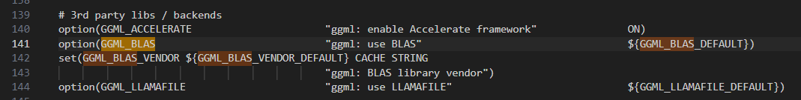

所以，尝试修改`set(GGML_BLAS_DEFAULT OFF)`为set(GGML_BLAS_DEFAULT ON)，重新编译：

```
cmake -B build_blas2 -DGGML_BLAS=OFF  -DCUSTOM_BLAS=ON
cmake --build build_blas2 --config Release
```

测试指令：`/home/user/LLM/llama.cpp/build_blas2/bin/llama-bench -m /home/user/LLM/models/unsloth/DeepSeek-R1/DeepSeek-R1-Q4_K_M-00001-of-00009.gguf`

测试结果：top指令下，us保持在99.9，token输出速度小幅降低

```
| model                          |       size |     params | backend    | threads |          test |                  t/s |
| ------------------------------ | ---------: | ---------: | ---------- | ------: | ------------: | -------------------: |
| deepseek2 671B Q4_K - Medium   | 376.65 GiB |   671.03 B | CPU        |      48 |         pp512 |         28.61 ± 0.55 |
| deepseek2 671B Q4_K - Medium   | 376.65 GiB |   671.03 B | CPU        |      48 |         tg128 |          7.33 ± 0.20 |
```


### **4、`AVX`、`FMA` **

Llama.cpp 支持 `AVX2` 和 `FMA`，可以手动开启：

- 检查 CPU 是否支持avx2（fma同理）：

  - 方法一：`cat /proc/cpuinfo | grep avx2`
  - 方法二：linux下，执行`lscpu | grep 'avx2'`或者`grep -o 'avx2' /proc/cpuinfo`，如果输出中显示`avx2`，则表示您的CPU支持AVX2指令集。

- 使用编译优化：

  ```
  cmake -B build_avx -DLLAMA_AVX2=ON -DLLAMA_FMA=ON
  cmake --build build_avx --config Release
  ```

  

检查发现，当前设备是支持 `AVX2` 和 `FMA`的。

测试指令：`/home/user/LLM/llama.cpp/build_avx/bin/llama-bench -m /home/user/LLM/models/unsloth/DeepSeek-R1/DeepSeek-R1-Q4_K_M-00001-of-00009.gguf`

测试结果：top指令下，us保持在99

```
| model                          |       size |     params | backend    | threads |          test |                  t/s |
| ------------------------------ | ---------: | ---------: | ---------- | ------: | ------------: | -------------------: |
| deepseek2 671B Q4_K - Medium   | 376.65 GiB |   671.03 B | CPU        |      48 |         pp512 |         27.19 ± 0.54 |
| deepseek2 671B Q4_K - Medium   | 376.65 GiB |   671.03 B | CPU        |      48 |         tg128 |          6.35 ± 0.21 |
```


### **5、 KV 缓存**

提前缓存 KV 数据：对于较长文本的推理，开启 KV 缓存可以避免重复计算：

```
./main -m model-q4_K_M.bin --temp 0.7 --repeat_penalty 1.1 --cache
```


ctk与ctv支持：

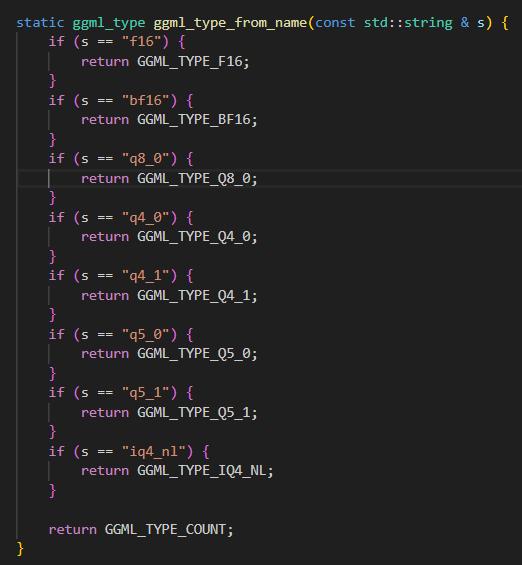


测试指令：`/home/user/LLM/llama.cpp/llama-bench -m /home/user/LLM/models/unsloth/DeepSeek-R1/DeepSeek-R1-Q4_K_M-00001-of-00009.gguf  -ctk q4_0`

测试结果：

```
| model                          |       size |     params | backend    | threads | type_k |          test |                  t/s |
| ------------------------------ | ---------: | ---------: | ---------- | ------: | -----: | ------------: | -------------------: |
| deepseek2 671B Q4_K - Medium   | 376.65 GiB |   671.03 B | CPU        |      48 |   q4_0 |         pp512 |         28.81 ± 0.51 |
| deepseek2 671B Q4_K - Medium   | 376.65 GiB |   671.03 B | CPU        |      48 |   q4_0 |         tg128 |          8.60 ± 0.39 |
```


测试指令：`/home/user/LLM/llama.cpp/llama-bench -m /home/user/LLM/models/unsloth/DeepSeek-R1/DeepSeek-R1-Q4_K_M-00001-of-00009.gguf  -ctk q4_0 -ctv q4_0`或者`/home/user/LLM/llama.cpp/llama-bench -m /home/user/LLM/models/unsloth/DeepSeek-R1/DeepSeek-R1-Q4_K_M-00001-of-00009.gguf  -ctk q4_0 -ctv q8_0`

测试结果：

```
main: error: failed to create context with model '/home/user/LLM/models/unsloth/DeepSeek-R1/DeepSeek-R1-Q4_K_M-00001-of-00009.gguf'
```


备注：有人在issue中反馈ctv最好不要改


### **6、关闭 `MMAP`，使用 `-no-mmap` 选项**

默认情况下，llama.cpp 会使用 `mmap()` 加载模型，如果你的 CPU 高内存且 I/O 不是瓶颈，可以尝试关闭：

```
./main -m model-q4_K_M.bin --no-mmap
```


测试指令：`/home/user/LLM/llama.cpp/llama-bench -m /home/user/LLM/models/unsloth/DeepSeek-R1/DeepSeek-R1-Q4_K_M-00001-of-00009.gguf  -mmp 0`

测试结果：

```
| model                          |       size |     params | backend    | threads | mmap |          test |                  t/s |
| ------------------------------ | ---------: | ---------: | ---------- | ------: | ---: | ------------: | -------------------: |
| deepseek2 671B Q4_K - Medium   | 376.65 GiB |   671.03 B | CPU        |      48 |    0 |         pp512 |         27.26 ± 0.72 |
| deepseek2 671B Q4_K - Medium   | 376.65 GiB |   671.03 B | CPU        |      48 |    0 |         tg128 |          8.22 ± 0.23 |
```


### **7、使用 `batch_size` 提升推理速度**

如果推理时 `batch_size` 过小，模型计算效率可能会下降：

```
./main -m model-q4_K_M.bin --threads 16 --batch_size 512
```

可以适当调整 `batch_size`，一般推荐 256~1024。


测试指令：`/home/user/LLM/llama.cpp/llama-bench -m /home/user/LLM/models/unsloth/DeepSeek-R1/DeepSeek-R1-Q4_K_M-00001-of-00009.gguf  -b 4096`

测试结果：比baseline略高

```
测试一：
| model                          |       size |     params | backend    | threads | n_batch |          test |                  t/s |
| ------------------------------ | ---------: | ---------: | ---------- | ------: | ------: | ------------: | -------------------: |
| deepseek2 671B Q4_K - Medium   | 376.65 GiB |   671.03 B | CPU        |      48 |    4096 |         pp512 |         27.71 ± 0.61 |
| deepseek2 671B Q4_K - Medium   | 376.65 GiB |   671.03 B | CPU        |      48 |    4096 |         tg128 |          8.53 ± 0.26 |

测试二：
| model                          |       size |     params | backend    | threads | n_batch |          test |                  t/s |
| ------------------------------ | ---------: | ---------: | ---------- | ------: | ------: | ------------: | -------------------: |
| deepseek2 671B Q4_K - Medium   | 376.65 GiB |   671.03 B | CPU        |      48 |    4096 |         pp512 |         27.50 ± 0.74 |
| deepseek2 671B Q4_K - Medium   | 376.65 GiB |   671.03 B | CPU        |      48 |    4096 |         tg128 |          8.51 ± 0.30 |
```

增大生成token长度：`-n 512`

```
| model                          |       size |     params | backend    | threads | n_batch |          test |                  t/s |
| ------------------------------ | ---------: | ---------: | ---------- | ------: | ------: | ------------: | -------------------: |
| deepseek2 671B Q4_K - Medium   | 376.65 GiB |   671.03 B | CPU        |      48 |    4096 |         pp512 |         27.74 ± 0.62 |
| deepseek2 671B Q4_K - Medium   | 376.65 GiB |   671.03 B | CPU        |      48 |    4096 |         tg512 |          8.05 ± 0.05 |
```


修改ub

测试指令：`/home/user/LLM/llama.cpp/llama-bench -m /home/user/LLM/models/unsloth/DeepSeek-R1/DeepSeek-R1-Q4_K_M-00001-of-00009.gguf  -b 4096 -ub 1024`

测试结果：

```
| model                          |       size |     params | backend    | threads | n_batch | n_ubatch |          test |                  t/s |
| ------------------------------ | ---------: | ---------: | ---------- | ------: | ------: | -------: | ------------: | -------------------: |
| deepseek2 671B Q4_K - Medium   | 376.65 GiB |   671.03 B | CPU        |      48 |    4096 |     1024 |         pp512 |         27.73 ± 0.49 |
| deepseek2 671B Q4_K - Medium   | 376.65 GiB |   671.03 B | CPU        |      48 |    4096 |     1024 |         tg128 |          8.52 ± 0.36 |
```


### **8、降低 `context length` 以减少计算量**

如果应用场景允许，可以降低 `context length` 以减少计算开销：

```
./main -m model-q4_K_M.bin --ctx_size 512
```

通常 `ctx_size` 设为 512~1024 是合理的，默认值 2048 可能会占用更多的计算资源。


llama-bench无相关参数


### **9、禁用 `logits_all` 以减少计算量**

如果你只需要生成文本，而不需要 logits 参与决策，可以禁用：

```
./main -m model-q4_K_M.bin --logits_all 0
```


llama-bench无相关参数


### **10、使用更快的 `swap space`（如果内存仍然不足）**

- 确保 `tmpfs` 目录（Linux 下可以使用 RAM Disk）：

  ```
  mkdir /mnt/ramdisk
  mount -t tmpfs -o size=10G tmpfs /mnt/ramdisk
  ```

- 运行 llama.cpp 时将模型复制到 `/mnt/ramdisk/`以减少磁盘 I/O：

  ```
  cp model-q4_K_M.bin /mnt/ramdisk/
  ./main -m /mnt/ramdisk/model-q4_K_M.bin
  ```


### 11、Flash Attention

Flash Attention是一种针对Transformer模型的注意力机制优化方法，旨在提高计算速度并降低内存占用。传统的自注意力机制在处理长序列时，计算和内存复杂度均为序列长度的平方，导致计算速度慢且内存消耗大。Flash Attention通过优化内存访问模式，减少GPU高带宽内存（HBM）和片上内存（SRAM）之间的数据读写次数，从而提升计算效率。

然而，Flash Attention的设计主要针对GPU环境，利用GPU的并行计算能力和高速内存。在纯CPU环境中，Flash Attention的优势可能无法充分发挥，因为CPU的内存访问速度和并行处理能力相对较低。因此，在纯CPU环境下，使用Flash Attention可能不会带来显著的性能提升，甚至可能由于其复杂性而导致性能下降。


测试指令：`/home/user/LLM/llama.cpp/llama-bench -m /home/user/LLM/models/unsloth/DeepSeek-R1/DeepSeek-R1-Q4_K_M-00001-of-00009.gguf  -fa 1`

测试结果：

```
| model                          |       size |     params | backend    | threads | fa |          test |                  t/s |
| ------------------------------ | ---------: | ---------: | ---------- | ------: | -: | ------------: | -------------------: |
| deepseek2 671B Q4_K - Medium   | 376.65 GiB |   671.03 B | CPU        |      48 |  1 |         pp512 |         27.23 ± 0.70 |
| deepseek2 671B Q4_K - Medium   | 376.65 GiB |   671.03 B | CPU        |      48 |  1 |         tg128 |          8.46 ± 0.17 |
```


### 12、线程绑定

```
cpu_mask = "0xff"; // 绑定前8个核心
cpu_strict = true; // 严格绑定减少上下文切换
```


### 13、限制CPU核心

如何禁用核心？

- 编辑GRUB配置文件

  ```
  sudo vim /etc/default/grub
  ```

  修改 GRUB_CMDLINE_LINUX，通过 isolcpus 隔离其他核心，或通过 maxcpus 限制启用核心。示例1（推荐）：启用所有CCD的第一个核心并禁用其他核心

  ```
  GRUB_CMDLINE_LINUX="isolcpus=1-5,7-11,13-17,19-23,25-29,31-35,37-41,43-47"
  ```

- 更新GRUB并重启

  ```
  sudo update-grub  # Ubuntu/Debian
  sudo reboot
  ```


如何暂时关闭超线程SMT：

- 可以通过 `sysfs` 接口动态关闭，**重启后失效**

  ```
  echo off | sudo tee /sys/devices/system/cpu/smt/control
  ```

- 验证是否生效：

  ```
  cat /sys/devices/system/cpu/smt/active        # 应输出 0
  lscpu | grep "Thread(s) per core"             # 应显示 1
  ```


如何监视每个cpu核心的利用率？

- 方法一：输入top指令，再按‘1’键即可
- 方法二：`sudo apt install sysstat`、`mpstat -P ALL 1`


针对当前系统，双核CPU（amd epyc 9254），每个cpu有24各物理核心，开启smt后即48个逻辑核心，其中，分为4个ccd，每个ccd各6各核心。


尝试禁用smt后，并针对当前设备总计8各ccd，禁用掉每个ccd中第一个核心以外的其他核心：`GRUB_CMDLINE_LINUX="isolcpus=1-5,7-11,13-17,19-23,25-29,31-35,37-41,43-47"`

测试发现，当前逻辑核心确实从96变为了48，推理时确实只调用没禁用的那几个核心，不过大模型推理速度也确实非常慢。

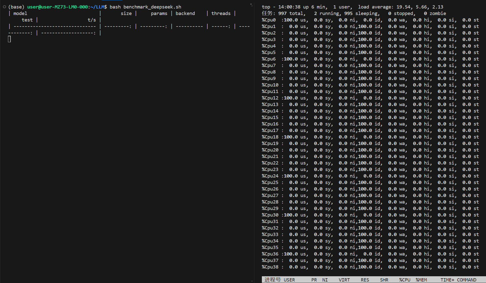

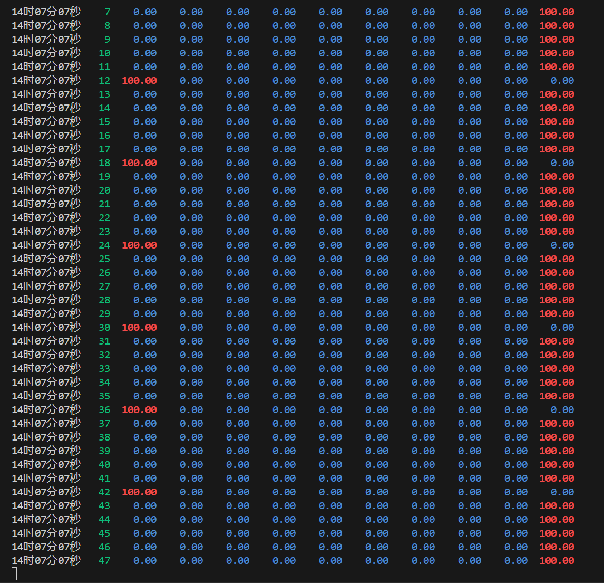


尝试禁用smt，不禁用任何物理核心：提升不大

```
| model                          |       size |     params | backend    | threads |          test |                  t/s |
| ------------------------------ | ---------: | ---------: | ---------- | ------: | ------------: | -------------------: |
| deepseek2 671B Q4_K - Medium   | 376.65 GiB |   671.03 B | CPU        |      48 |         pp512 |         27.15 ± 0.40 |
| deepseek2 671B Q4_K - Medium   | 376.65 GiB |   671.03 B | CPU        |      48 |         tg128 |          8.60 ± 0.14 |
```

尝试禁用smt，并限制线程数在35：

```
| model                          |       size |     params | backend    | threads |          test |                  t/s |
| ------------------------------ | ---------: | ---------: | ---------- | ------: | ------------: | -------------------: |
| deepseek2 671B Q4_K - Medium   | 376.65 GiB |   671.03 B | CPU        |      35 |         pp512 |         22.83 ± 0.02 |
| deepseek2 671B Q4_K - Medium   | 376.65 GiB |   671.03 B | CPU        |      35 |         tg128 |          8.67 ± 0.01 |
```

尝试禁用smt，并限制线程数在24：

```
| model                          |       size |     params | backend    | threads |          test |                  t/s |
| ------------------------------ | ---------: | ---------: | ---------- | ------: | ------------: | -------------------: |
| deepseek2 671B Q4_K - Medium   | 376.65 GiB |   671.03 B | CPU        |      24 |         pp512 |         18.49 ± 0.01 |
| deepseek2 671B Q4_K - Medium   | 376.65 GiB |   671.03 B | CPU        |      24 |         tg128 |          7.61 ± 0.00 |
```


### 14、调整noma

> NUMA 非一致内存访问结构 ( Non Uniform Memory Access ) 系统架构 , 可以 集成多个处理器 , 使得系统在 " 处理事务 " 方面 , 有着 很高的性能 ;
>
> NUMA 架构中 , 处理器 访问 自己的本地内存速度很快 , 但是 访问 其它处理器的内存速度慢 , 这样为了 保证事物的执行性能 , 需要 减少 CPU 处理器之间的数据交互 , NUMA 架构 只 适合 OLTP ( On-Line Transaction Processing 联机事务处理过程 ) 事务处理场景 

```
NUMA（非统一内存访问）节点的内存与电脑物理内存的关系可以通过以下几个关键点来理解：

1. NUMA的基本概念
设计目的：解决多处理器系统中内存访问的扩展性问题。传统UMA架构中，所有CPU共享同一内存控制器，导致带宽瓶颈；而NUMA将系统划分为多个节点，每个节点包含CPU和本地内存。

访问差异：CPU访问本地节点内存速度更快（低延迟、高带宽），访问其他节点内存（远程访问）则较慢。

2. NUMA节点内存与物理内存的关系
物理内存的分布：整个系统的物理内存是所有NUMA节点本地内存的总和。例如，若系统有两个NUMA节点，每个节点有32GB内存，则总物理内存为64GB。

本地与远程内存：每个节点的内存对其他节点而言是“远程内存”，操作系统需优化分配策略以减少跨节点访问。

3. 操作系统与NUMA的协同
内存分配策略：操作系统（如Linux、Windows）具备NUMA感知能力，优先为进程分配其运行CPU所在节点的本地内存。

示例工具：

Linux：使用 numactl 命令或查看 /sys/devices/system/node/ 目录配置NUMA策略。

Windows：通过任务管理器或性能监视器查看NUMA节点分布。

4. 应用程序优化
线程绑定：将线程绑定到特定NUMA节点的CPU，确保其使用本地内存（如通过 numactl --cpunodebind）。

数据局部性：编程时优化数据存储位置（如OpenMP的 firsttouch 策略），减少远程访问。

5. NUMA的实际应用场景
多CPU插槽系统：常见于服务器/工作站，每个CPU插座对应一个NUMA节点。

单CPU多节点设计：现代多核处理器（如AMD Ryzen）可能将核心分组为多个NUMA节点（如每个CCD作为一个节点），即使单插座也可受益于NUMA优化。

6. 性能影响与挑战
跨节点延迟：频繁远程访问可能导致性能下降，需通过监控工具（如 numastat）检测内存分布是否均衡。

内存不足处理：当某节点内存耗尽时，系统可能跨节点分配，导致性能波动。

7. 总结：NUMA vs 普通内存
特性	NUMA内存	普通内存（UMA）
内存访问	分本地/远程，延迟不同	统一延迟
适用场景	多CPU/多核高性能系统	单CPU家用电脑
管理复杂度	需操作系统和应用的协同优化	对应用透明，无需特殊处理
工具支持	专用工具（如numactl、hwloc）	常规内存管理工具
示例理解
假设一台服务器有两个NUMA节点（Node 0和Node 1），各含32GB内存：

进程A 运行在Node 0的CPU上，若分配Node 0的内存，访问时间为100ns。

若被迫使用Node 1的内存，访问时间可能增至200ns。

优化方法：通过 numactl --membind=0 将进程A的内存绑定到Node 0。

通过理解NUMA架构，用户可优化系统配置，提升内存密集型应用（如数据库、虚拟化）的性能。
```

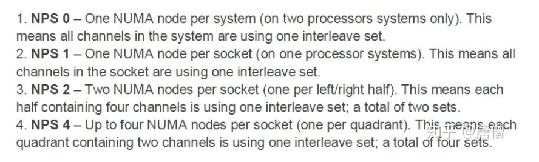

修改numa设置后，当前noma情况：

```
NUMA:                     
  NUMA 节点：             2
  NUMA 节点0 CPU：        0-23
  NUMA 节点1 CPU：        24-47
```

```
$ numactl --hardware
available: 2 nodes (0-1)
node 0 cpus: 0 1 2 3 4 5 6 7 8 9 10 11 12 13 14 15 16 17 18 19 20 21 22 23
node 0 size: 580352 MB
node 0 free: 578313 MB
node 1 cpus: 24 25 26 27 28 29 30 31 32 33 34 35 36 37 38 39 40 41 42 43 44 45 46 47
node 1 size: 580512 MB
node 1 free: 191915 MB
node distances:
node   0   1 
  0:  10  32 
  1:  32  10 
```

```
$ numastat -c

Per-node numastat info (in MBs):
                Node 0 Node 1   Total
                ------ ------ -------
Numa_Hit        745936 783869 1529805
Numa_Miss       315801      0  315801
Numa_Foreign         0 315801  315801
Interleave_Hit       1      1       2
Local_Node      745732 783730 1529462
Other_Node      316005    139  316144
```

```
$ numastat -m
						Node 0          Node 1           Total
                 --------------- --------------- ---------------
MemTotal               580352.64       580512.99      1160865.63
MemFree                578312.18       191929.04       770241.22
MemUsed                  2040.46       388583.95       390624.41
Active                    373.62       386590.64       386964.27
Inactive                  202.41          279.45          481.86
Active(anon)              165.23          366.02          531.25
Inactive(anon)              0.00            0.00            0.00
Active(file)              208.39       386224.62       386433.02
Inactive(file)            202.41          279.45          481.86
Unevictable                 0.00            8.80            8.80
Mlocked                     0.00            0.00            0.00
Dirty                       0.00            0.00            0.00
Writeback                   0.00            0.00            0.00
FilePages                 428.14       386527.55       386955.68
Mapped                     85.05          288.99          374.04
AnonPages                 148.03          351.53          499.56
Shmem                      17.34           23.47           40.81
KernelStack                 8.45            8.60           17.05
PageTables                  7.49           13.48           20.98
NFS_Unstable                0.00            0.00            0.00
Bounce                      0.00            0.00            0.00
WritebackTmp                0.00            0.00            0.00
Slab                      313.25         1077.95         1391.20
SReclaimable               81.94          917.08          999.02
SUnreclaim                231.31          160.87          392.18
AnonHugePages               0.00            0.00            0.00
ShmemHugePages              0.00            0.00            0.00
ShmemPmdMapped              0.00            0.00            0.00
HugePages_Total             0.00            0.00            0.00
HugePages_Free              0.00            0.00            0.00
HugePages_Surp              0.00            0.00            0.00
KReclaimable               81.94          917.08          999.02
```


##### 测试一：基于numactl指定cpu核心与numa

```
numactl --physcpubind=0-23 --cpunodebind=0 /home/user/LLM/llama.cpp/build2/bin/llama-bench -m /home/user/LLM/models/unsloth/DeepSeek-R1/DeepSeek-R1-Q4_K_M-00001-of-00009.gguf
```

运行效果：确实指定了cpu核心，numa0下的内存也有所消耗

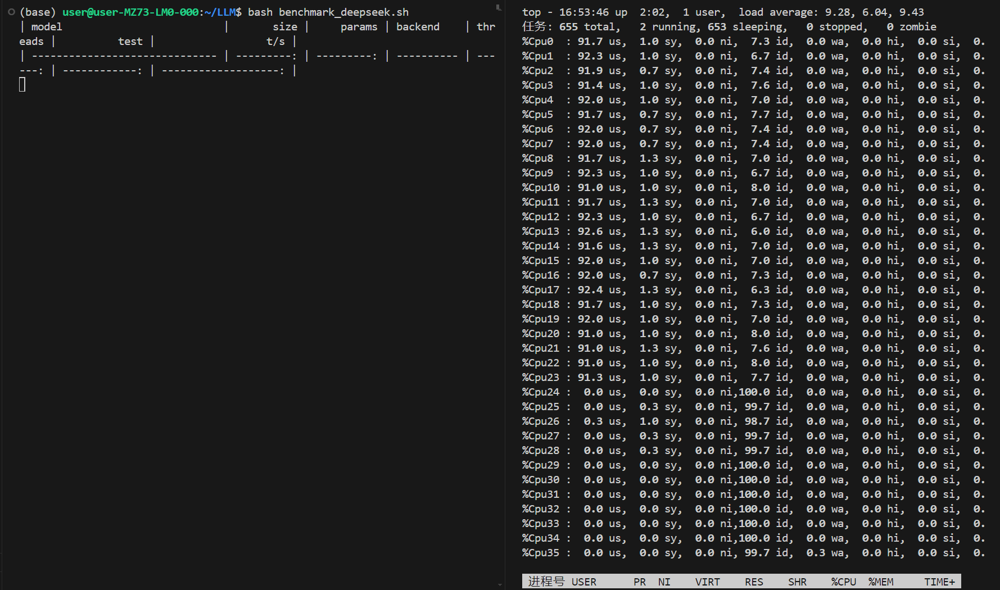

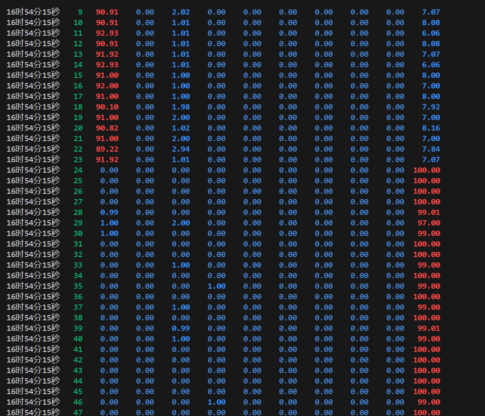

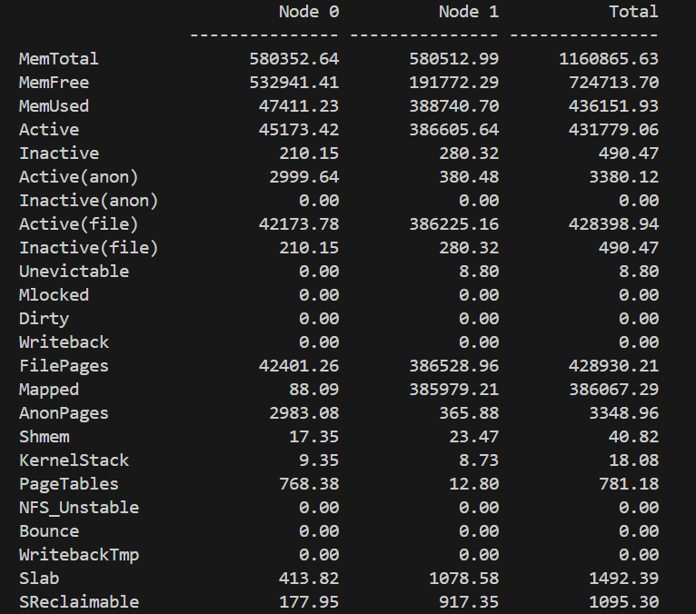

运行结果：

```
| model                          |       size |     params | backend    | threads |          test |                  t/s |
| ------------------------------ | ---------: | ---------: | ---------- | ------: | ------------: | -------------------: |
| deepseek2 671B Q4_K - Medium   | 376.65 GiB |   671.03 B | CPU        |      48 |         pp512 |         16.07 ± 0.02 |
| deepseek2 671B Q4_K - Medium   | 376.65 GiB |   671.03 B | CPU        |      48 |         tg128 |          2.15 ± 0.00 |
```


测试1：cpu0-23  + numa0

看起来上述还是指定了48个线程，因为48是程序的默认值，另外，生成阶段每个cpu核心的利用率只有50%，我们这里手动改为24再次测试：

```
| model                          |       size |     params | backend    | threads |          test |                  t/s |
| ------------------------------ | ---------: | ---------: | ---------- | ------: | ------------: | -------------------: |
| deepseek2 671B Q4_K - Medium   | 376.65 GiB |   671.03 B | CPU        |      24 |         pp512 |         17.40 ± 0.01 |
| deepseek2 671B Q4_K - Medium   | 376.65 GiB |   671.03 B | CPU        |      24 |         tg128 |          4.72 ± 0.00 |
```


测试2：cpu0-23  + numa1

可能numa的id对应存在问题？尝试修改numa

```
numactl --physcpubind=0-23 --cpunodebind=1 /home/user/LLM/llama.cpp/build2/bin/llama-bench -m /home/user/LLM/models/unsloth/DeepSeek-R1/DeepSeek-R1-Q4_K_M-00001-of-00009.gguf -t 24
```

测试结果：速度提升，但是通过numastat -m发现，Node0和Node1的内存占用怎么没变化？？难道numa1的剩余内存压根支撑不了模型？或者numa0中已经加载了模型，所以就算我指定numa1，他还是从numa0读模型？

```
| model                          |       size |     params | backend    | threads |          test |                  t/s |
| ------------------------------ | ---------: | ---------: | ---------- | ------: | ------------: | -------------------: |
| deepseek2 671B Q4_K - Medium   | 376.65 GiB |   671.03 B | CPU        |      24 |         pp512 |         17.91 ± 0.00 |
| deepseek2 671B Q4_K - Medium   | 376.65 GiB |   671.03 B | CPU        |      24 |         tg128 |          7.90 ± 0.00 |
```


测试3：cpu24-47  + numa1

会不会单纯是因为numa1比numa0快？

```
numactl --physcpubind=24-47 --cpunodebind=1 /home/user/LLM/llama.cpp/build2/bin/llama-bench -m /home/user/LLM/models/unsloth/DeepSeek-R1/DeepSeek-R1-Q4_K_M-00001-of-00009.gguf -t 24
```

测试结果：cpu核心24~47搭配numa1，与cpu核心0~23搭配numa1速度怎么一样的？？？

```
| model                          |       size |     params | backend    | threads |          test |                  t/s |
| ------------------------------ | ---------: | ---------: | ---------- | ------: | ------------: | -------------------: |
| deepseek2 671B Q4_K - Medium   | 376.65 GiB |   671.03 B | CPU        |      24 |         pp512 |         17.93 ± 0.01 |
| deepseek2 671B Q4_K - Medium   | 376.65 GiB |   671.03 B | CPU        |      24 |         tg128 |          7.90 ± 0.00 |
```

备注：如果把线程数改为48

```
numactl --physcpubind=24-47 --cpunodebind=1 /home/user/LLM/llama.cpp/build2/bin/llama-bench -m /home/user/LLM/models/unsloth/DeepSeek-R1/DeepSeek-R1-Q4_K_M-00001-of-00009.gguf -t 48
```

测试结果：

```
| model                          |       size |     params | backend    | threads |          test |                  t/s |
| ------------------------------ | ---------: | ---------: | ---------- | ------: | ------------: | -------------------: |
| deepseek2 671B Q4_K - Medium   | 376.65 GiB |   671.03 B | CPU        |      48 |         pp512 |         16.52 ± 0.03 |
| deepseek2 671B Q4_K - Medium   | 376.65 GiB |   671.03 B | CPU        |      48 |         tg128 |          2.83 ± 0.03 |
```


测试4：cpu24-47  + numa0

```
numactl --physcpubind=24-47 --cpunodebind=0 /home/user/LLM/llama.cpp/build2/bin/llama-bench -m /home/user/LLM/models/unsloth/DeepSeek-R1/DeepSeek-R1-Q4_K_M-00001-of-00009.gguf -t 24
```

测试结果：

```
| model                          |       size |     params | backend    | threads |          test |                  t/s |
| ------------------------------ | ---------: | ---------: | ---------- | ------: | ------------: | -------------------: |
| deepseek2 671B Q4_K - Medium   | 376.65 GiB |   671.03 B | CPU        |      24 |         pp512 |         17.39 ± 0.01 |
| deepseek2 671B Q4_K - Medium   | 376.65 GiB |   671.03 B | CPU        |      24 |         tg128 |          4.72 ± 0.00 |
```


测试5：cpu24-47  + numa均匀

如果采用--interleave=all，让内存分布在多个 NUMA 节点上均匀分配呢？

```
numactl --physcpubind=24-47 --interleave=all /home/user/LLM/llama.cpp/build2/bin/llama-bench -m /home/user/LLM/models/unsloth/DeepSeek-R1/DeepSeek-R1-Q4_K_M-00001-of-00009.gguf -t 24
```

测试结果：

```
| model                          |       size |     params | backend    | threads |          test |                  t/s |
| ------------------------------ | ---------: | ---------: | ---------- | ------: | ------------: | -------------------: |
| deepseek2 671B Q4_K - Medium   | 376.65 GiB |   671.03 B | CPU        |      24 |         pp512 |         17.36 ± 0.00 |
| deepseek2 671B Q4_K - Medium   | 376.65 GiB |   671.03 B | CPU        |      24 |         tg128 |          7.48 ± 0.00 |
```


##### 测试二：基于llama-bench直接指定numa

如果直接通过llama-bench指定numa呢？

在 llama‑bench 中，--numa 参数用于在 NUMA 系统上优化线程和内存的分布，它有三个可选值：

- **distribute**：将执行均匀分布在所有 NUMA 节点上，这样所有节点的资源都能得到利用；
- **isolate**：仅在程序启动时所在的 NUMA 节点上生成所有线程，从而确保线程和内存局部性，但不会利用其他节点的资源；
- **numactl**：使用由 numactl 命令提供的 CPU 映射（这要求你事先用 numactl 配置好节点和核心绑定）。


测试1.1：尝试numactl模式

```
numactl --physcpubind=0-23 /home/user/LLM/llama.cpp/build2/bin/llama-bench -m /home/user/LLM/models/unsloth/DeepSeek-R1/DeepSeek-R1-Q4_K_M-00001-of-00009.gguf -t 24 --numa numactl
```

测试结果：确实是0-23核心在使用，numa的内存看起来依旧没啥变化

```
| model                          |       size |     params | backend    | threads |          test |                  t/s |
| ------------------------------ | ---------: | ---------: | ---------- | ------: | ------------: | -------------------: |
| deepseek2 671B Q4_K - Medium   | 376.65 GiB |   671.03 B | CPU        |      24 |         pp512 |         18.13 ± 0.01 |
| deepseek2 671B Q4_K - Medium   | 376.65 GiB |   671.03 B | CPU        |      24 |         tg128 |          4.75 ± 0.00 |
```

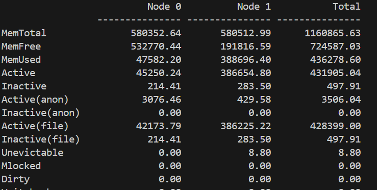


测试1.2：换另一个cpu试一下

```
numactl --physcpubind=24-47 /home/user/LLM/llama.cpp/build2/bin/llama-bench -m /home/user/LLM/models/unsloth/DeepSeek-R1/DeepSeek-R1-Q4_K_M-00001-of-00009.gguf -t 24 --numa numactl
```

测试结果：确实是24-47核心在使用，内存占用情况同上

```
| model                          |       size |     params | backend    | threads |          test |                  t/s |
| ------------------------------ | ---------: | ---------: | ---------- | ------: | ------------: | -------------------: |
| deepseek2 671B Q4_K - Medium   | 376.65 GiB |   671.03 B | CPU        |      24 |         pp512 |         18.48 ± 0.01 |
| deepseek2 671B Q4_K - Medium   | 376.65 GiB |   671.03 B | CPU        |      24 |         tg128 |          8.29 ± 0.00 |
```


测试2：尝试isolate模式

```
numactl --physcpubind=24-47 /home/user/LLM/llama.cpp/build2/bin/llama-bench -m /home/user/LLM/models/unsloth/DeepSeek-R1/DeepSeek-R1-Q4_K_M-00001-of-00009.gguf -t 24 --numa isolate
```

测试结果：内存占用情况同上

```
| model                          |       size |     params | backend    | threads |          test |                  t/s |
| ------------------------------ | ---------: | ---------: | ---------- | ------: | ------------: | -------------------: |
| deepseek2 671B Q4_K - Medium   | 376.65 GiB |   671.03 B | CPU        |      24 |         pp512 |         18.49 ± 0.01 |
| deepseek2 671B Q4_K - Medium   | 376.65 GiB |   671.03 B | CPU        |      24 |         tg128 |          8.29 ± 0.00 |
```


测试3：尝试distribute模式

```
numactl --physcpubind=24-47 /home/user/LLM/llama.cpp/build2/bin/llama-bench -m /home/user/LLM/models/unsloth/DeepSeek-R1/DeepSeek-R1-Q4_K_M-00001-of-00009.gguf -t 24 --numa distribute
```

测试结果：内存占用情况同上

```
| model                          |       size |     params | backend    | threads |          test |                  t/s |
| ------------------------------ | ---------: | ---------: | ---------- | ------: | ------------: | -------------------: |
| deepseek2 671B Q4_K - Medium   | 376.65 GiB |   671.03 B | CPU        |      24 |         pp512 |         19.20 ± 0.03 |
| deepseek2 671B Q4_K - Medium   | 376.65 GiB |   671.03 B | CPU        |      24 |         tg128 |          6.49 ± 0.00 |
```


##### 测试总结

**实验目的**

以下均采用numactl指定cpu核心（每次测试已确认是只有指定的核心在工作）、线程采用24（单个cpu对应的物理核心数）、关闭超线程smt，区别在于：

- 基于numactl还是基于llama-bench指定numa（因为numa内存一直不变，所以希望采用不同numa的指定方式，验证结果，但上述两种方案实际上本质都是软件层面指定）
- cpu（0-23与24-47）与numa（0与1）的搭配


简单来说，就是测试不同cpu核心与不同numa的组合，以得出单个cpu所有核心及其对应的numa所能达到的性能极限


**实验设计与结果**

实验一：基于numactl时发现：

- cpu0-23 + numa0：4.72
- cpu0-23 + numa1：7.90
- cpu24-47 + numa0：4.72
- cpu24-47 + numa1：7.90
- cpu24-47 + numa均匀分布：7.48

备注：如果把线程数从24提高到48

- cpu0-23 + numa0 + 48线程：2.15
- cpu24-47 + numa1 + 48线程：2.83


实验二：基于llama-bench直接指定numa发现：

- cpu0-23 + numactl：4.75
- cpu24-47 + numactl：8.29
- cpu24-47 + isolatel：8.29
- cpu24-47 + distribute：6.49


**实验总结与分析**

总的来说：

- 上述测试本质上是测试单个cpu所有核心 + 其对应的numa，所能达到的性能极限，实验一结果可知，无论cpu怎么选，numa1速度快于numa0，达到7.9，实验二验证了这一猜想。
- 但是，最高也就8.29，正常人阅读速度在12.5左右，不达标，且workflow流中涉及多次大模型调用，即便同时采用不同的大模型，串行的完成几次大模型分析下来，时间成本太高
- 其次，上述所有实验中，所有实验下来，基于numastat -m发现，内存占用没啥变化，可能原因：
  - 原因1：numa1的剩余内存压根支撑不了模型，所以只使用numa0的（测试前node 0 free: 578313 MB，node 1 free: 191915 MB，但是，虽然测试时node0的memused升高了，但其memfree竟然不变，并在之后的各种测试中node0和node1的memory指标一直不变，奇奇怪怪）
  - 原因2：numa0中已经加载了模型，所以就算我指定numa1，他还是从numa0读模型？
- 后续计划：
  - 解决上述内存问题，可能需要重启系统重新测一下部分任务，并且多从github上epyc与numa相关使用经验（暂时还没看完）上找找思路
  - 但是，但是，但是，猜测不管怎么优化numa，速度顶多提升1~2，吞吐量提高了，大概率不能达到单个用户使用时速度从8tokens/s提升到12tokens/s，所以，下一步还是尝试ktransformers好


### 15、其他测试

#### （1）DeepSeek-V3

基于llama.cpp测试：不添加任何参数，仅禁止smt，未修改numa

```
/home/user/LLM/llama.cpp/build2/bin/llama-bench -m /home/user/LLM/models/unsloth/DeepSeek-R1/DeepSeek-R1-Q4_K_M-00001-of-00009.gguf
```

测试结果：

```
| model                          |       size |     params | backend    | threads |          test |                  t/s |
| ------------------------------ | ---------: | ---------: | ---------- | ------: | ------------: | -------------------: |
| deepseek2 671B Q4_K - Medium   | 376.65 GiB |   671.03 B | BLAS       |      48 |         pp512 |          2.93 ± 0.01 |
| deepseek2 671B Q4_K - Medium   | 376.65 GiB |   671.03 B | BLAS       |      48 |         tg128 |          7.36 ± 0.07 |
```


基于vllm测试：暂未测试，无GQPT量化模型


#### （2）Qwen

基于llama.cpp测试：不添加任何参数，禁止smt并修改numa后：

```
/home/user/LLM/llama.cpp/build2/bin/llama-bench -m /home/user/LLM/models/Qwen/Qwen2.5-72B-Instruct-GGUF/qwen2.5-72b-instruct-q4_k_m-00001-of-00012.gguf
```

测试结果：

```
| model                          |       size |     params | backend    | threads |          test |                  t/s |
| ------------------------------ | ---------: | ---------: | ---------- | ------: | ------------: | -------------------: |
| qwen2 70B Q4_K - Medium        |  40.98 GiB |    72.96 B | CPU        |      48 |         pp512 |         19.63 ± 0.01 |
| qwen2 70B Q4_K - Medium        |  40.98 GiB |    72.96 B | CPU        |      48 |         tg128 |          5.14 ± 0.07 |
```


修改进程数：可以看到在执行过程中，cpu核心的利用是随机的

```
/home/user/LLM/llama.cpp/build2/bin/llama-bench -m /home/user/LLM/models/Qwen/Qwen2.5-72B-Instruct-GGUF/qwen2.5-72b-instruct-q4_k_m-00001-of-00012.gguf -t 24
```

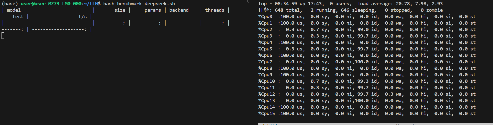

测试结果：

```
| model                          |       size |     params | backend    | threads |          test |                  t/s |
| ------------------------------ | ---------: | ---------: | ---------- | ------: | ------------: | -------------------: |
| qwen2 70B Q4_K - Medium        |  40.98 GiB |    72.96 B | CPU        |      24 |         pp512 |         11.83 ± 0.00 |
| qwen2 70B Q4_K - Medium        |  40.98 GiB |    72.96 B | CPU        |      24 |         tg128 |          4.70 ± 0.00 |
```


修改核心和numa指定：

```
numactl --physcpubind=24-47 --cpunodebind=1 /home/user/LLM/llama.cpp/build2/bin/llama-bench -m /home/user/LLM/models/Qwen/Qwen2.5-72B-Instruct-GGUF/qwen2.5-72b-instruct-q4_k_m-00001-of-00012.gguf -t 24
```

测试结果：

```
| model                          |       size |     params | backend    | threads |          test |                  t/s |
| ------------------------------ | ---------: | ---------: | ---------- | ------: | ------------: | -------------------: |
| qwen2 70B Q4_K - Medium        |  40.98 GiB |    72.96 B | CPU        |      24 |         pp512 |         10.40 ± 0.00 |
| qwen2 70B Q4_K - Medium        |  40.98 GiB |    72.96 B | CPU        |      24 |         tg128 |          2.77 ± 0.00 |
```

重启后，直接再次测试：

```
| model                          |       size |     params | backend    | threads |          test |                  t/s |
| ------------------------------ | ---------: | ---------: | ---------- | ------: | ------------: | -------------------: |
| qwen2 70B Q4_K - Medium        |  40.98 GiB |    72.96 B | CPU        |      24 |         pp512 |         10.44 ± 0.05 |
| qwen2 70B Q4_K - Medium        |  40.98 GiB |    72.96 B | CPU        |      24 |         tg128 |          4.71 ± 0.00 |
```


修改numa：

```
numactl --physcpubind=24-47 --cpunodebind=0 /home/user/LLM/llama.cpp/build2/bin/llama-bench -m /home/user/LLM/models/Qwen/Qwen2.5-72B-Instruct-GGUF/qwen2.5-72b-instruct-q4_k_m-00001-of-00012.gguf -t 24
```

测试结果：

```
| model                          |       size |     params | backend    | threads |          test |                  t/s |
| ------------------------------ | ---------: | ---------: | ---------- | ------: | ------------: | -------------------: |
| qwen2 70B Q4_K - Medium        |  40.98 GiB |    72.96 B | CPU        |      24 |         pp512 |         10.62 ± 0.00 |
| qwen2 70B Q4_K - Medium        |  40.98 GiB |    72.96 B | CPU        |      24 |         tg128 |          4.64 ± 0.00 |
```

重启后，测试完numa1，再次测试numa0：

```
| model                          |       size |     params | backend    | threads |          test |                  t/s |
| ------------------------------ | ---------: | ---------: | ---------- | ------: | ------------: | -------------------: |
| qwen2 70B Q4_K - Medium        |  40.98 GiB |    72.96 B | CPU        |      24 |         pp512 |         10.09 ± 0.03 |
| qwen2 70B Q4_K - Medium        |  40.98 GiB |    72.96 B | CPU        |      24 |         tg128 |          2.75 ± 0.00 |
```

重启后，直接再次测试：

```
| model                          |       size |     params | backend    | threads |          test |                  t/s |
| ------------------------------ | ---------: | ---------: | ---------- | ------: | ------------: | -------------------: |
| qwen2 70B Q4_K - Medium        |  40.98 GiB |    72.96 B | CPU        |      24 |         pp512 |         10.37 ± 0.01 |
| qwen2 70B Q4_K - Medium        |  40.98 GiB |    72.96 B | CPU        |      24 |         tg128 |          4.63 ± 0.00 |
```


基于vllm测试Qwen2.5-72B-Instruct-GPTQ-Int4：

```
python -m vllm.entrypoints.openai.api_server --host 0.0.0.0 --port 8007 --max-model-len 8000 --model models/Qwen/Qwen2.5-72B-Instruct-GPTQ-Int4 --disable-log-requests
```

测试:

```
curl --location 'http://0.0.0.0:8007/v1/chat/completions' \
  --header 'Content-Type: application/json' \
  --data '{
  "model": "models/Qwen/Qwen2.5-72B-Instruct-GPTQ-Int4",
  "messages": [
    {
      "role": "user",
      "content": "解释一下量子计算"
    }
  ],
  "temperature": 0.2,
  "stream": true
}'
```

在线测试：

```
python vllm/benchmarks/benchmark_serving.py --backend vllm --port 8007 --endpoint /v1/completions --model models/Qwen/Qwen2.5-72B-Instruct-GPTQ-Int4 --dataset-name sharegpt --dataset-path models/ShareGPT_V3_unfiltered_cleaned_split.json --request-rate 3 --num-prompts 100 --profile
```

测试结果：太慢了，不等结果了

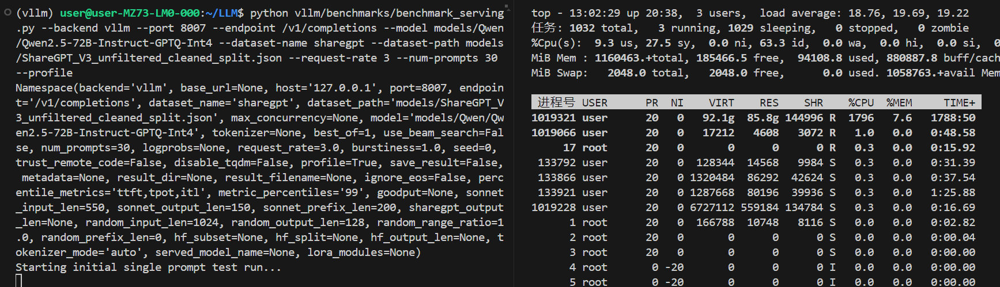

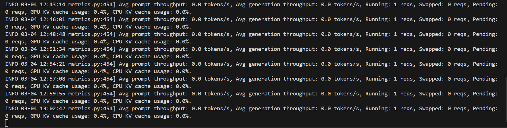


备注：离线测试时，约300个请求后，内存爆炸

```
python vllm/benchmarks/benchmark_throughput.py --backend vllm --model /home/user/LLM/models/Qwen/Qwen2.5-72B-Instruct-GPTQ-Int4 --dataset models/ShareGPT_V3_unfiltered_cleaned_split.json --max_model_len 4096
```


## ktransformers优化测试

### 接入远程主机Dify服务

ktransformers接入Dify问题：

- https://github.com/kvcache-ai/ktransformers/issues/514
- https://github.com/kvcache-ai/ktransformers/issues/817
- https://github.com/kvcache-ai/ktransformers/issues/456


将服务映射到当前主机的Dify上：

```
ssh -L 8085:localhost:8085 user@166.111.61.120 -p8022
```

命令的解释：

- `8090:localhost:11434`：将本地机器的 8090 端口映射到目标服务器的 11434 端口。

- `root@ssh.openbayes.com -p31894`：目标服务器的地址和端口。

然后，在校内服务器的dify中导入模型即可，如`http://host.docker.internal:8096`


简单测试：166.111.61.120、192.168.9.100、0.0.0.0

```
curl --location 'http://0.0.0.0:8085/v1/chat/completions' \
  --header 'Content-Type: application/json' \
  --data '{
  "model": "DeepSeek-Coder-V2-Instruct",
  "messages": [
    {
      "role": "user",
      "content": "用中文详细解释一下什么是人工智能？"
    }
  ],
  "temperature": 0.2,
  "stream": true
}'
```

```
curl --location "http://127.0.0.1:8085/v1/chat/completions" --header "Content-Type: application/json" --data "{\"model\": \"DeepSeek-Coder-V2-Instruct\", \"messages\": [{\"role\": \"user\", \"content\": \"用中文详细解释一下什么是人工智能？\"}], \"temperature\": 0.2, \"stream\": true}"
```


在校内服务器Dify中的OpenAI-API-compatible中加入当前模型进行测试：

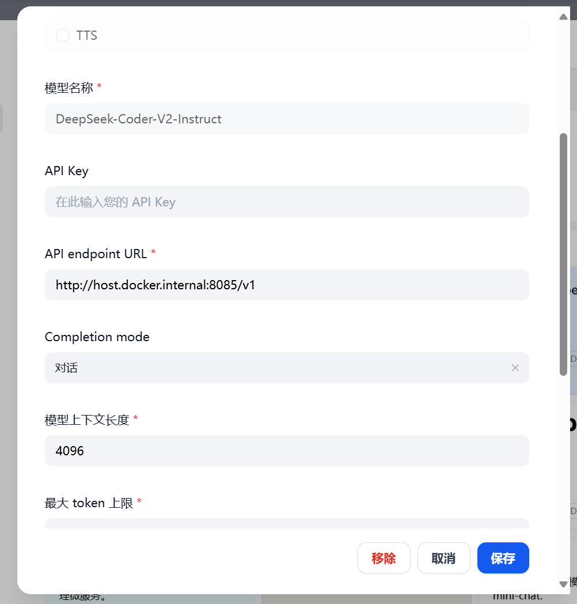

示例效果：


### 常见错误

```
RuntimeError: Expected all tensors to be on the same device, but found at least two devices, cpu and cuda:0! (when checking argument for argument mat2 in method wrapper_CUDA_bmm)
```

解决方法：yaml文件用的不对，直接用官方的示例yaml即可


### 0、测试环境及baseline

在开启服务前：

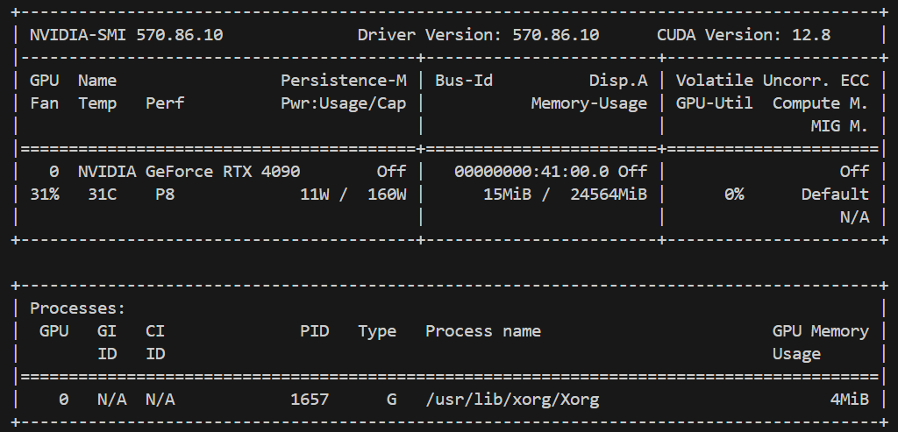

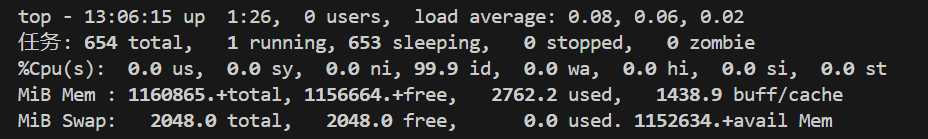

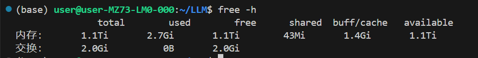

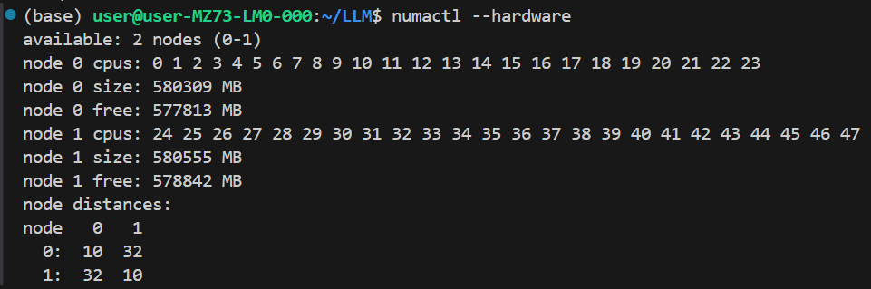

numastat -m

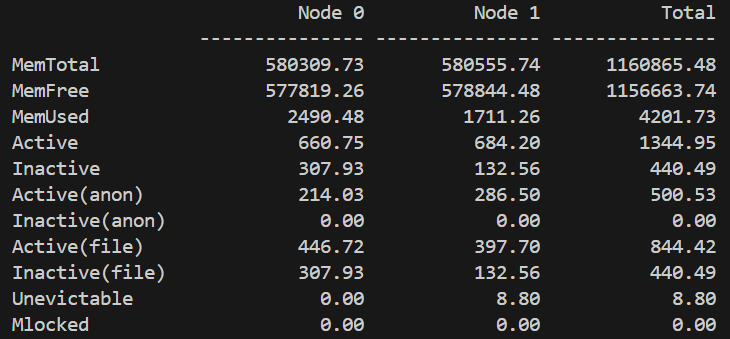


已禁止SMT：

```
cat /sys/devices/system/cpu/smt/active  # 输出为0
```

已区分numa：`lscpu`

```
NUMA:                     
  NUMA 节点：             2
  NUMA 节点0 CPU：        0-23
  NUMA 节点1 CPU：        24-47
```

噪音缘故，降低4090功耗：显卡设置为最大功耗180W，风扇转速大约为45%，和CPU风扇噪音相当，功耗最大为160W：

```
sudo nvidia-smi -pl 160
```

关闭SWAP，用NUMA模式跑ktransformers（每个节点一份模型权重）


启动服务：配置文件见`ktransformers/ktransformers/configs/config.yaml`

```
# ktransformers --model_path deepseek-ai/DeepSeek-R1 --gguf_path /home/user/LLM/models/unsloth/DeepSeek-R1 --port 8085 --cpu_infer 46 --cache_lens 128000 --force_think

ktransformers --model_path deepseek-ai/DeepSeek-V3 --gguf_path /home/user/LLM/models/unsloth/DeepSeek-V3-GGUF/DeepSeek-V3-Q4_K_M --port 8085 --cpu_infer 46 --cache_lens 128000 --force_think

```

测试：注意是否使用0.0.0.0

```
curl --location 'http://0.0.0.0:8085/v1/chat/completions' \
  --header 'Content-Type: application/json' \
  --data '{
  "model": "DeepSeek-Coder-V2-Instruct",
  "messages": [
    {
      "role": "user",
      "content": "你是V3还是R1？"
    }
  ],
  "temperature": 0.2,
  "stream": true
}'
```


测试时显存与内存占用情况：（未调参，资源剩余2个CPU物理核心，110G内存，4G显存）（未调参，资源剩余2个CPU物理核心，110G内存，4G显存）

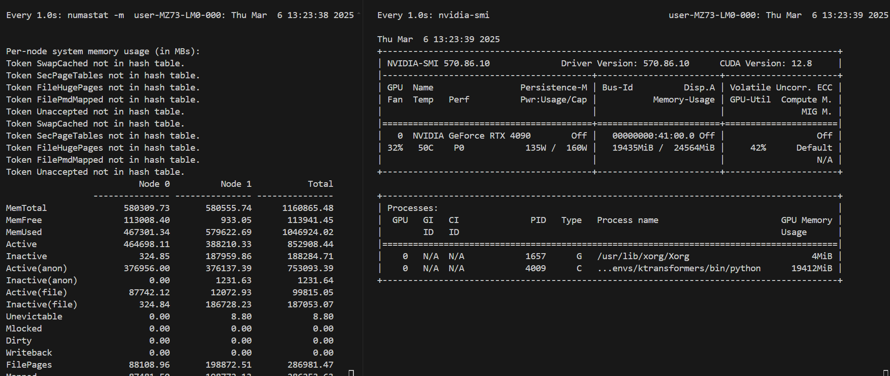

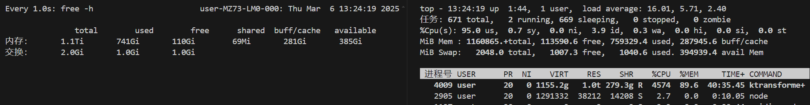

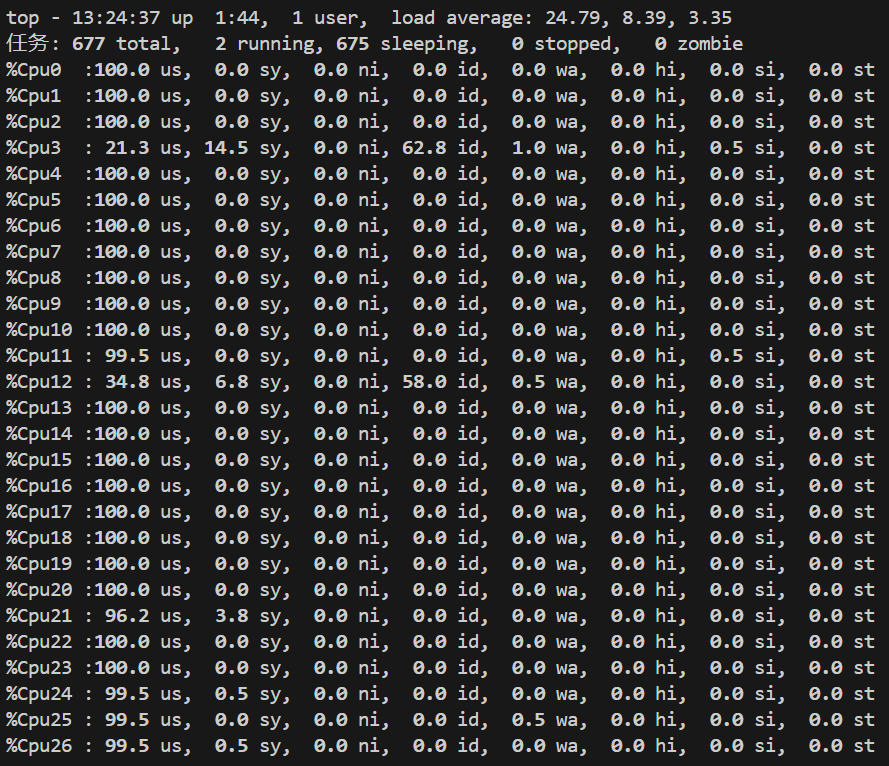

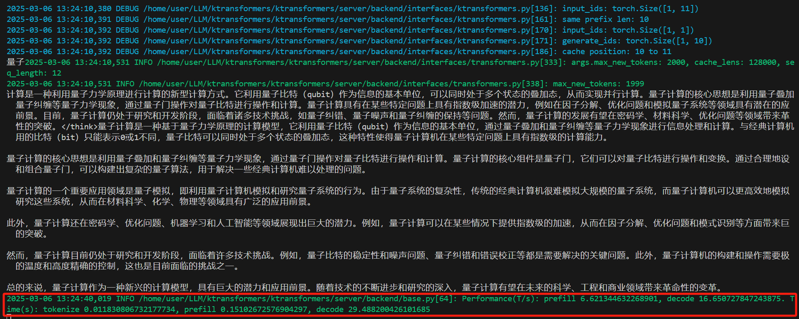

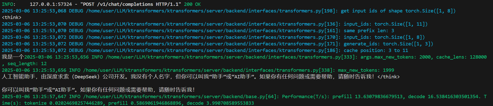

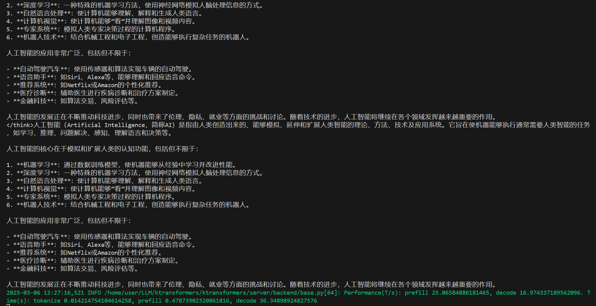

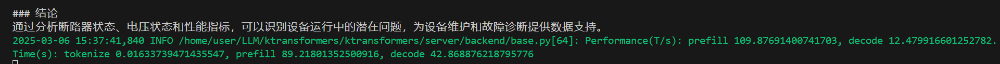


官方基准测试记录：https://github.com/kvcache-ai/ktransformers/blob/main/doc/en/benchmark.md

官方的基准测试程序：https://github.com/kvcache-ai/ktransformers/tree/main/ktransformers/tests的

但是貌似不能用


但是针对deepseek的测试，他们直接使用的local_chat.py演示了一次命令框对话的demo，配置文件参考目录：ktransformers/ktransformers/optimize/optimize_rules

```
numactl -N 1 -m 1 python3 ./ktransformers/local_chat.py --model_path deepseek-ai/DeepSeek-V3 --gguf_path /home/user/LLM/models/unsloth/DeepSeek-V3-GGUF/DeepSeek-V3-Q4_K_M --cpu_infer 46 --cache_lens 128000 --max_new_tokens 4096 --optimize_config_path /home/user/LLM/ktransformers/ktransformers/optimize/optimize_rules/DeepSeek-V3-Chat.yaml --force_think true
```

测试结果：

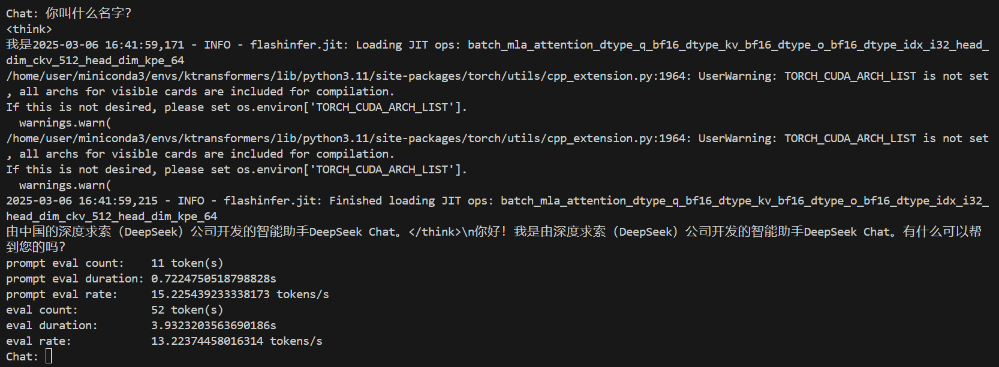


第三方的一些测试：

- https://github.com/ubergarm/r1-ktransformers-guide/blob/main/README.zh.md
- https://zhuanlan.zhihu.com/p/717118974


## 同时部署DeepSeek与Qwen

注意资源控制、模型特征

单个4090应该可以

qwen-32b-qwq等模型，各自擅长使用那些场景？


前要：

- 框架限制：ktransformers只能部署moe架构模型，不支持qwen-72b-instruct
- 资源占用：ktransformers部署大模型时，内存是一直占用的，但是cpu资源是只有使用大模型时才会占用，而基于vllm，内存占用较少，更多的是使用gpu


### 1、双EPYC 9254 + 1000G内存 + 单4090

#### 测试一

>  基于Ktransformer跑DeepSeek + 基于llama.cpp跑Qwen

```
# 基于KTransformers启动DeepSeek
ktransformers --model_path deepseek-ai/DeepSeek-V3 --gguf_path /home/user/LLM/models/unsloth/DeepSeek-V3-GGUF/DeepSeek-V3-Q4_K_M --port 8085 --cpu_infer 46 --cache_lens 128000 --force_think

# 基于vLLM启动Qwen
/home/user/LLM/llama.cpp/build2/bin/llama-server -m /home/user/LLM/models/Qwen/QwQ-32B-GGUF/qwq-32b-q4_k_m-00001-of-00005.gguf --port 8086
```


测试：

```
curl --location 'http://0.0.0.0:8085/v1/chat/completions' \
  --header 'Content-Type: application/json' \
  --data '{
  "model": "DeepSeek-Coder-V2-Instruct",
  "messages": [
    {
      "role": "user",
      "content": "用中文详细解释一下什么是人工智能？"
    }
  ],
  "temperature": 0.2,
  "stream": true
}'
```

```
curl --location 'http://0.0.0.0:8086/v1/chat/completions' \
  --header 'Content-Type: application/json' \
  --data '{
  "model": "Qwen/QwQ-32B-GGUF",
  "messages": [
    {
      "role": "user",
      "content": "用中文详细解释一下什么是人工智能？"
    }
  ],
  "temperature": 0.2,
  "stream": true
}'
```


目测qwen-qwq-32b-gguf基于llama.cpp，速度在10~40tokens/s，速度不固定，可以完成问题分类，但时间在30~50s


目测qwen2.5-72b-int4-gguf基于llama.cpp，速度在10~20tokens/s，速度不固定，可以完成问题分类，但时间在10~60s，后面让deepseek处理prompt太慢，96s后才生成结果

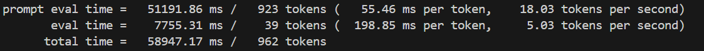

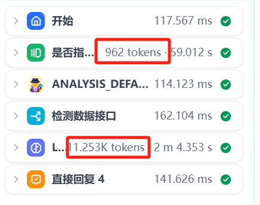

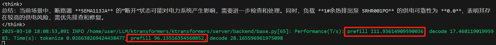


#### 测试二

>  基于Ktransformers跑DeepSeek + 基于Ktransformers跑Qwen-qwq-32b

单张4090显存不够同时启动DeepSeek和Qwen-qwq-32b

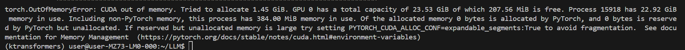


### 2、双EPYC 9254 + 1000G内存 + 单4090 + 双A6000

```
git clone -b v0.6.4.post1 --single-branch https://github.com/vllm-project/vllm.git
cd vllm
git describe --tags
```

```
python -m vllm.entrypoints.openai.api_server --host 0.0.0.0 --port 8007 --max-model-len 32768 --model Qwen/Qwen2.5-72B-Instruct-GPTQ-Int4 --disable-log-requests --swap-space 16 --tensor-parallel-size 2 --gpu-memory-utilization 0.9
```

消耗内存约：70G


远程连接：

```
ssh -L 8007:localhost:8007 root@ssh.openbayes.com -p32071
```


不考虑prompt处理，速度相当可观：


但是，我们的prompt过长，运行一个功能，deepseek的prompt处理约96s，之后才开始生成内容


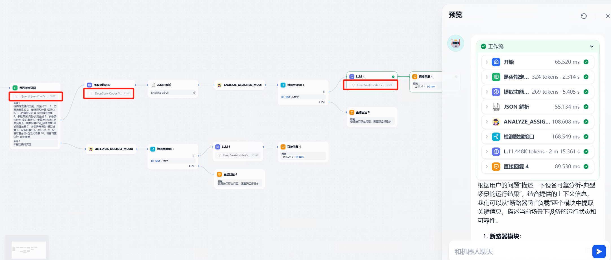

如果采用A6000部署的Qwen-72B-GPQT-Int4，prompt处理约14s，prefill阶段速度约为上述deepseek的8倍，之后才开始生成内容，速度约为22tokens/s：


刚测了下同时部署deepseek-r1与qwen（qwq-32b/instruct-72b），需要用deepseek-r1跑最后的也是最主要的文本生成任务，而需要用qwen做其他任务（这里具体是指问题分类任务）:

1、（资源支持，但速度不够）双EPYC 9254 + 1T内存 + 单4090：CPU + GPU0跑ktransformer+deepseek，CPU跑llama.cpp + qwen，可行，workflow流是串行的，cpu同时只有一个模型在用，跑qwen所费内存和其模型大小预计成线性，72B约费72G内存。但问题在于llama.cpp太慢了，跑qwen-72b-instruct，速度在10~20tokens/s，完成“问题分类节点”需10~60s，跑qwen-qwq-32b-gguf，速度在10~40tokens/s，时间在30~50s（推理模型思考内容太多）

2、（除了prompt处理阶段仍需提速，其他均可）双EPYC 9254 + 1T内存 + 单4090 + 双A6000：用qwen-72b，2s即可完成“问题分类节点”的任务，剩下的就是由deepseek做最终的文本生成任务，但是deepseek处理prompt速度（即prefill阶段）虽然有110tokens/s，但是奈何app中界面数据特别多，处理完数据约96s，之后才开始生成内容（生成速度在14~18tokens/s）。如果最终任务直接让qwen去做，虽然prefill阶段速度在900tokens/s，但是依旧要14s左右后，才开始生成内容（生成速度在22tokens/s）

所以，总的来说，当前设备（双EPYC 9254 + 1T内存 + 单4090），多部署一个qwen2.5-72b/qwen-qwq-32b，可以部署，但是速度不够，如果多加两个A6000专门部署qwen2.5-72b，速度够了，但是有一个新问题，我们最终需要把APP界面中的所有数据都给deepseek去分析，但是deepseek的prompt阶段速度不够，导致用户要等96s才能看到结果

根据上述实验结果，那么，现在首要处理的任务是提高处理promt速度，我明天从模型和界面数据本身两方面下手，去优化一下


补充实验：考虑到吞吐量，单4090和双A6000各用24个物理核心时？

在deepseek和qwen不同时使用的情况下，是没有cpu核心冲突的，但是如果项目中不同功能同时使用，导致了冲突，现在测一下各使用24核心时的大致情况

PS：prefill阶段速度与prompt长度有关

```
numactl --physcpubind=24-47 --cpunodebind=1 ktransformers --model_path deepseek-ai/DeepSeek-V3 --gguf_path /home/user/LLM/models/unsloth/DeepSeek-V3-GGUF/DeepSeek-V3-Q4_K_M --port 8085 --cpu_infer 24 --cache_lens 128000 --force_think
```

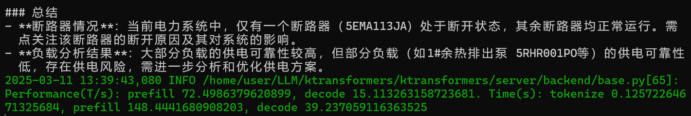


```
numactl --physcpubind=0-23 --cpunodebind=0 ktransformers --model_path deepseek-ai/DeepSeek-V3 --gguf_path /home/user/LLM/models/unsloth/DeepSeek-V3-GGUF/DeepSeek-V3-Q4_K_M --port 8085 --cpu_infer 24 --cache_lens 128000 --force_think
```

此时工作的核心看起来是随机分配的，并非指定的0~23（上面设置为numa1时，也一样，随机采用物理核心，不过确实都是24个），prefill和decode速度相对指定numa1略慢，但还在接受范围内

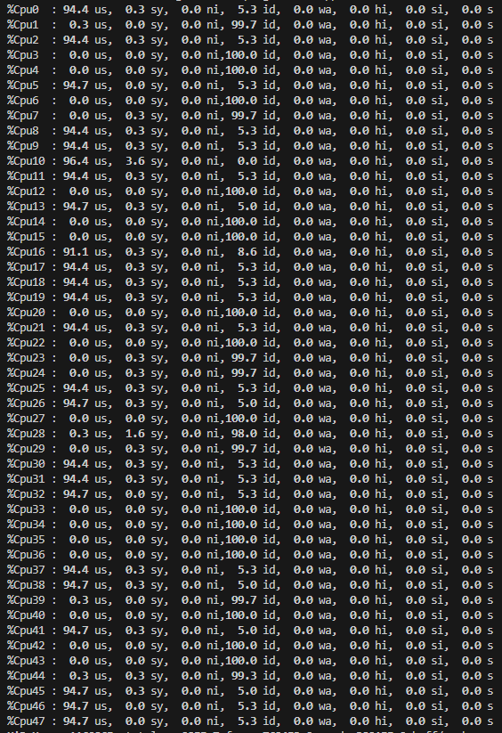


详细参数参考：https://github.com/kvcache-ai/ktransformers/blob/main/ktransformers/server/args.py


关于flash_attn

```
parser.add_argument("--no_flash_attn", type=bool, default=self.cfg.no_flash_attn)
```

```
numactl --physcpubind=24-47 --cpunodebind=1 ktransformers --model_path deepseek-ai/DeepSeek-V3 --gguf_path /home/user/LLM/models/unsloth/DeepSeek-V3-GGUF/DeepSeek-V3-Q4_K_M --port 8085 --cpu_infer 24 --cache_lens 128000 --force_think --no_flash_attn false
```

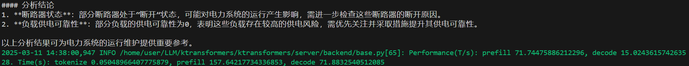


