您好，我目前在基于贵平台测试在各个显卡配置下大模型性能，需要请教一下贵平台GPU相关的几个问题：

- 请问贵平台的4090确定是满血4090吗？其余类型显卡的算力是否有出入？
  - NVIDIA RTX 4090 并未做任意阉割，为 ada 架构，本身没有 nvlink

- 请问多卡A6000或者3090等支持nvlink的显卡，是采用nvlink连接的，还是采用pcie？请问平台上的A6000是安培架构的吗？
  - RTX 3090 为 PCIe，A6000 是 ampere 架构，两两有 nvlink，支持 PCIe，不支持更多卡的互联；8 卡 4090 和 A6000 训练多卡或者跨节点互联需要工程调优，您可以先测试看看。


显卡性能认知：

- Ollama：
  - 单张4090：deepseek-r1:32b-qwen-distill-q4_K_M、qwen2.5:32b-instruct-q4_K_M
  - 三张4090：满血DeepSeek-R1-32B，但是量化此模型会显存爆炸
  - 四张4090：qwen2.5:72b-instruct-q4_K_M、deepseek-r1:70b-llama-distill-q4_K_M
  - 一张A6000：qwen2.5:72b-instruct-q4_K_M、deepseek-r1:70b-llama-distill-q4_K_M
  - 两张A6000：deepseek-r1:32b-qwen-distill-fp16

- vLLM：
  - 一张4090已经不够跑qwen2.5:32b-instruct-q4_K_M，显存爆炸


# 01 测试方案

## 一、测试token输出速度

> 需要测试首Token延迟(TTFT)和其余Token延迟 (TPOT)

合理的token输出速度：10-15 tokens/秒，参考https://www.zhihu.com/question/591112394/answer/3164341451

```
成年人的阅读速度：英文文本平均阅读速度大约是200-300词/分钟，即3-5词/秒。中文文本平均阅读速度大约是300-500字符/分钟，即5-8字符/秒。

英文中的一个token并不总是对应一个完整的单词。所以模型输出速度可能需要提高到**5-10 tokens/秒**。对于中文，由于其字符性质，常见的分词器可能会将每个字符视为一个token，但也可能会将常见的词汇或短语合并为一个token。输出速度应达到**5-8 tokens/秒。**

实际上，为了提供流畅的用户体验，模型的输出速度可能需要远远超过这个速度，尤其是在交互式应用中，用户可能希望模型能够即时响应。合理的目标是使模型的输出速度**至少达到10-15 tokens/秒。一般来说，单token的延迟在100ms以内，可确保流畅的用户体验。**
```

但不是用户可能更喜欢非流式，等模型输出完毕后再查看，所以一方面token速度要足够快，其次，根据实际需求，考虑是否一定要用推理模型。


### 1、基于ollama

安装ollama

```
curl -fsSL https://ollama.com/install.sh | sh

ollama run qwen2.5:0.5b
```

测试token输出速度：

- 基于verbose参数：`ollama run 你要跑的模型 - -verbose`
  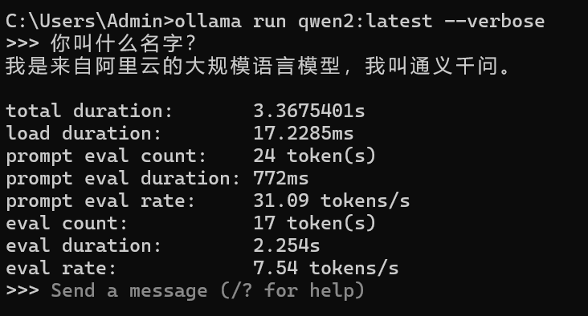
- 基于Ollama API测试 Token速度
- 基于开源项目：
  - 项目1（无人引用，测试效果不佳）：https://github.com/robbiemu/ollama_token_bench
    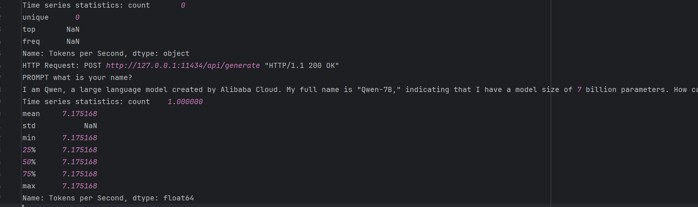


### 2、基于Dify

直接查看资源监控即可。


### 3、Transformers

直接源码调用模型并测试，如qwen2.5：https://github.com/QwenLM/Qwen2.5

官方提供了示例使用代码，注意查阅最新的文档，部分旧的api已无法使用


### 4、基于vLLM

略


## 二、测试显存等占用

基于nvidia-smi


基于第三方工具：

- https://techdiylife.github.io/blog/topic.html?category2=t05&blogid=0031


## 三、测试吞吐量

**吞吐量**是衡量系统处理能力的核心指标，表示单位时间内系统完成的有效工作量。在AI推理场景中：

1. **请求吞吐量 (Requests/s)**
   - 定义：每秒成功处理的完整请求数量
   - 意义：反映系统整体服务能力，数值越大说明系统能同时响应更多用户请求
   - 示例：若值为10 Requests/s，表示每秒可处理10个独立问题
2. **Token吞吐量 (Tokens/s)**
   - 定义：每秒生成的有效文本单元（Token）总数
   - 意义：体现文本生成效率，数值越大表示生成内容的速度越快
   - 示例：若值为500 Tokens/s，表示每秒可生成相当于500个汉字/单词的内容

两者关系：

1. Token吞吐量 = 请求吞吐量 × 平均每请求生成Token数
2. 高请求吞吐量适合短问答场景，高Token吞吐量适合长文本生成场景。


常见问题：

- Q1：吞吐量越大，用户的推理速度就越快吗？

  - **不一定。** 吞吐量的提高并不总是意味着单个用户的推理速度（即**推理延迟**）会变快，这主要取决于系统的调度方式和资源分配策略：
    - **吞吐量（Throughput）** 关注的是单位时间内模型能处理多少请求（QPS）或 Token（Token/s）。（关键因素：批处理Batching、并发调度Concurrency Scheduling、硬件资源的限制）
    - **推理速度（Latency）** 关注的是**单个请求**的处理时间，即从用户提交请求到收到响应所花的时间。

- Q2：如何测试吞吐量？

  吞吐量测试通常采用以下方法：

  1. **固定 QPS 方式**：
     - 设置固定的请求速率（如 1000 QPS），观察系统是否能稳定处理并计算吞吐量。
     - 主要衡量成功处理的请求数、失败率、延迟变化。
  2. **并发负载递增（Concurrency Scaling）**：
     - 逐步增加并发用户数（例如从 1 提高到 100、500、1000），观察系统在不同负载下的吞吐量变化。
     - 确定吞吐量达到瓶颈的位置。
  3. **批处理吞吐测试（Batch Throughput Testing）**：
     - 测试不同批大小（Batch Size = 1, 8, 16, 32, 64）对吞吐量的影响，找出最佳 Batch Size。
  4. **Token 速率测试（Token Per Second, TPS）**（适用于大语言模型）：
     - 计算每秒生成的 Token 数量，以评估模型的处理能力。

- Q3：GPU 利用率是否必须很高？

  **不一定。** 虽然高吞吐量通常会导致 GPU 利用率升高，但 GPU 资源利用率并不是唯一衡量吞吐量的指标：

  - **GPU 利用率高 ≠ 高吞吐量**
    - 如果 GPU 利用率高但吞吐量低，可能是因为计算效率低，例如：
      - Batch Size 过小，导致 GPU 计算资源未充分利用。
      - 数据传输（如 I/O 读取、网络传输）成为瓶颈，GPU 需要等待数据。
      - 内存管理或计算图优化不够高效，导致 GPU 计算负载不均衡。
  - **吞吐量测试的目标** 是**在尽可能低的延迟下，提高吞吐量**，而不仅仅是让 GPU 利用率达到 100%。
    - 在优化吞吐量时，通常会调整 **Batch Size、数据预加载、计算优化（如 FP16 量化、张量并行）** 等策略，以提高处理效率，而不仅仅是追求 GPU 利用率的最大化。


## 四、租用服务器

> 其中，OpenBayes和智星云支持多卡A6000，AutoDL不支持，但是口碑较好

### 1、OpenBayes

#### 01 平台介绍

关于OpenBayes部署Dify如何映射到本地：可采用免费的额度先测试一下

- 方案1：自动使用公网IP
  - https://openbayes.com/docs/tutorials/use-label-studio-ml-backend-with-uie#machine-learning-%E9%9B%86%E6%88%90
  - https://blog.csdn.net/OpenBayes/article/details/137153227
- 方案2：采用域名
  - https://blog.csdn.net/OpenBayes/article/details/136906762
- 方案3：编写server服务
  - https://openbayes.com/docs/serving/predictor
- 方案4：采用ssh直接映射


安装dify时：

- 平台libcurl` 和 `curl存在问题，需要重新安装一下

  ```
  apt-get update
  apt-get install --reinstall libcurl4 curl
  ```

- 安装docker-compose:

  ```
  # github: https://github.com/docker/compose/releases/tag/v2.20.2 
  # 国内下载地址：https://gitee.com/smilezgy/compose/releases/tag/v2.20.2
  curl -SL \
  https://github.com/docker/compose/releases/download/v2.20.2/docker-compose-linux-x86_64 \
  -o /usr/local/bin/docker-compose
  ```

- 安装docker：可以安装，正常输出docker版本，但是无法启动docker（systemctl start docker、service docker start、dockerd &），官方人员回应OpenBayes 平台容器本身是基于 Docker 的，因此不支持 Docker 套 Docker

  ```
  apt-get update
  apt-get install --reinstall libcurl4 curl
  
  curl -fsSL https://mirrors.aliyun.com/docker-ce/linux/ubuntu/gpg | sudo gpg --dearmor -o /usr/share/keyrings/docker-archive-keyring.gpg
  
  echo "deb [arch=$(dpkg --print-architecture) signed-by=/usr/share/keyrings/docker-archive-keyring.gpg] https://mirrors.aliyun.com/docker-ce/linux/ubuntu $(lsb_release -cs) stable" | tee /etc/apt/sources.list.d/docker.list > /dev/null
  
  apt update
  apt-get update
  apt install docker-ce docker-ce-cli containerd.io
  ```

后尝试避开docker，源码安装dify，存在其他多个问题难解决，目前打算直接测LLM的token输出速度，并将大模型服务通过开放API接口映射到本地Dify服务（涉及网络延迟，比本地部署略慢）


服务器上部署的模型映射到本地Dify：

- 基于Ollama
- 直接基于python代码


#### 02、平台环境问题

##### Q1：docker可安装，但无法使用

官方回应，平台是继续docker虚拟化的，不能docker里面嵌入docker


##### Q2：pip安装部分库报错

pip安装transformers或者vllm会出现如下错误：

```
Collecting tokenizers>=0.19.1 (from vllm)
  Using cached https://repo.huaweicloud.com/repository/pypi/packages/20/41/c2be10975ca37f6ec40d7abd7e98a5213bb04f284b869c1a24e6504fd94d/tokenizers-0.21.0.tar.gz (343 kB)
  Installing build dependencies ... done
  Getting requirements to build wheel ... done
  Preparing metadata (pyproject.toml) ... error
  error: subprocess-exited-with-error
  
  × Preparing metadata (pyproject.toml) did not run successfully.
  │ exit code: 1
  ╰─> [6 lines of output]
      
      Cargo, the Rust package manager, is not installed or is not on PATH.
      This package requires Rust and Cargo to compile extensions. Install it through
      the system's package manager or via https://rustup.rs/
      
      Checking for Rust toolchain....
      [end of output]
  
  note: This error originates from a subprocess, and is likely not a problem with pip.
error: metadata-generation-failed

× Encountered error while generating package metadata.
╰─> See above for output.

note: This is an issue with the package mentioned above, not pip.
hint: See above for details.
```

原因：**缺少Rust编译环境**。`tokenizers`库底层依赖Rust编写的扩展，而您的系统中未安装Rust工具链（Cargo和Rustc）。

解决方案步骤：

1. **安装Rust工具链**

   ```
   # 使用官方推荐的rustup安装（推荐）
   curl --proto '=https' --tlsv1.2 -sSf https://sh.rustup.rs | sh
   ```

   安装过程中选择默认选项（按回车确认），安装完成后执行：

   ```
   source "$HOME/.cargo/env"
   ```

   *如果无法使用curl，也可以通过apt安装（版本可能较旧）：*

   ```
   sudo apt update && sudo apt install -y rustc cargo
   ```

2. **验证Rust是否安装成功**

   ```
   rustc --version  # 应输出类似 "rustc 1.76.0 (07dca48 2024-02-04)"
   cargo --version  # 应输出类似 "cargo 1.76.0 (1ec8f49 2024-02-01)"
   ```

3. **安装编译依赖（可选但建议）**

   ```
   sudo apt install -y python3-dev python3-pip build-essential
   ```

4. **重新安装vllm**

   ```
   pip install vllm
   ```


##### Q3：重启后资源消失问题

参考：https://openbayes.com/docs/runtimes/faq

重启后，同样的工作空间，无法启动或者重新安装ollama，报错如下：

```
curl: (35) OpenSSL SSL_connect: SSL_ERROR_SYSCALL in connection to ollama.com:443
```

并且ollma模型并非下载在home目录下（需要修改），需要重新下载。

所以总的来说，为了避免ollama服务问题，需要解决：

- 重启服务器后的SSL问题：暂未解决
- 修改Ollama保存模型位置至home目录下：暂未解决
- 代码调用home路径下模型：暂未解决


##### Q4：transformer和vllm无法使用问题

报错：

```
RuntimeError: Failed to import transformers.models.auto because of the following error (look up to see its traceback):
/usr/local/lib/python3.8/site-packages/tokenizers/tokenizers.abi3.so: undefined symbol: PyInterpreterState_Get
```

解决方法为，重新开一个服务器，格式直接选vllm-gpu，里面已经配好了torch-gpu、cuda、transformers、vllm的环境


##### Q5：Ollama下载问题

下载ollama可能出现SSL问题

```
curl: (35) OpenSSL SSL_connect: SSL_ERROR_SYSCALL in connection to objects.githubusercontent.com:443
```

如果是启动旧的容器，重新下载Ollama，暂时没有解决方案

如果是新的容器出现了这个问题，多试几下应该可以，实在不行就问客服


### 2、智星云

官网链接：https://gpu.ai-galaxy.cn/store


### 3、AutoDL

官网链接：https://www.autodl.com/


# 02 测试结果

## 202502

> 以下测试，基于OpenBayes服务器租用平台，注意，平台开发票可能有低消，建议冲之前先邮件咨询客服

### 前要

#### 1、模型选择与测试环境

模型选择：

- 较大：
  - qwen2.5:72b-instruct-q4_K_M
  - deepseek-r1:70b-llama-distill-q4_K_M
  - deepseek-r1:32b-qwen-distill-fp16
- 较小：
  - qwen2.5:32b-instruct-q4_K_M
  - deepseek-r1:32b-qwen-distill-q4_K_M


测试结果：参考excel文件

测试方法总结：

- transformers
- vLLM
- Ollama + Dify + 与CloudPSS交互

其他测试方法：

- 发布算法API：与LLM离线模型类似，测试部分模型即可，无需全部实验都一一测试
- Xinference（咨询云琦哥）：由于涉及到界面，且指令导入失败，暂时不使用


确认cuda和cudnn是否安装：

```
nvcc -V

cat /usr/local/cuda/include/cudnn.h | grep CUDNN_MAJOR -A 2
cat /usr/local/cuda/include/cudnn_version.h | grep CUDNN_MAJOR -A 2
```


#### 2、加速模型下载

基于modelscope下载模型：

```
echo 'export VLLM_USE_MODELSCOPE=True' >> ~/.bashrc
source ~/.bashrc
```


基于huggingface的镜像网站`hf-mirror.com`下载整个仓库的模型：

```
pip install -U huggingface_hub
echo 'export HF_ENDPOINT=https://hf-mirror.com' >> ~/.bashrc
source ~/.bashrc
```

示例代码：

```
from huggingface_hub import snapshot_download
snapshot_download(repo_id="lysandre/arxiv-nlp")
```

或者使用`huggingface-cli`，示例代码如下：（感觉比huggingface和modelscope都略快，但是也会出现网络问题中断的情况，需要重复执行多次指令。此外，可以同时下载多个模型，每个权重下载的速度有上限，同时仅下载一个模型也不会提速）

```
huggingface-cli download --resume-download Qwen/Qwen2.5-72B-Instruct-GPTQ-Int4 --local-dir Qwen/Qwen2.5-72B-Instruct-GPTQ-Int4
```

Qwen/Qwen2.5-1.5B-Instruct-GPTQ-Int4

Qwen/Qwen2.5-32B-Instruct-GPTQ-Int4

Qwen/Qwen2.5-72B-Instruct-GPTQ-Int4


问题：

- 基于modelscope下载的模型，在租用平台
  - 如果中断下载，再次下载会出现代码卡住不下载的情况
  - 下载完毕，分析完毕，重新执行代码，代码会重新下载模型？！


#### 3、模型量化问题

问题：

- Q1：量化所需显存问题
  - 如果huggingface上开源了量化模型就用，如果没有开源且显存不够，那就不测了，用ollama测试一下，预估一下即可
- Q2：基于ollama下载的模型，是否可以用于transformers/vllm推理框架
  - 预计不行，ollama可以导出或者导入gguf格式的模型，但是transformers/vllm推理框架未提及可支持gguf，一般采用GPTQ格式
  - 有博客表示vLLM对 GGUF 文件的支持仍处于高度实验阶段（http://www.hubwiz.com/blog/ollama-vs-llama-cpp-performance-comparison/）
  - GGUF 量化仍处于实验阶段


如果涉及到量化模型：

**方法一：基于auto-gptq**

```
pip install auto-gptq
```

示例代码：

```

```


**方法二：基于swift框架**

魔搭社区推出的框架：https://github.com/modelscope/ms-swift

通过使用web-ui量化模型：

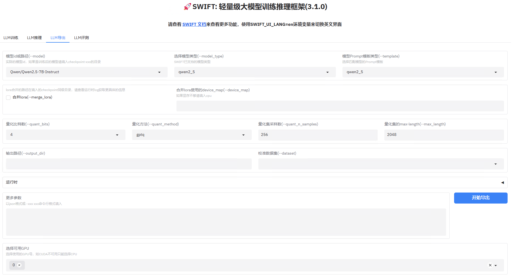

或者直接终端指令，如：

```
CUDA_VISIBLE_DEVICES=0 swift export --adapters 'output/some-model/vx-xxx/checkpoint-xxx' --quant_bits 4 --load_data_args true --quant_method gptq
```

```
# OMP_NUM_THREADS=14 please Check issue: https://github.com/AutoGPTQ/AutoGPTQ/issues/439
OMP_NUM_THREADS=14 \
CUDA_VISIBLE_DEVICES=0 \
swift export \
    --model Qwen/Qwen2.5-1.5B-Instruct \
    --dataset 'AI-ModelScope/alpaca-gpt4-data-zh#500' \
              'AI-ModelScope/alpaca-gpt4-data-en#500' \
    --quant_n_samples 256 \
    --quant_batch_size 1 \
    --max_length 2048 \
    --quant_method gptq \
    --quant_bits 4 \
    --output_dir Qwen2.5-1.5B-Instruct-GPTQ-Int4
```

```
swift export --model E:\work_zhaoyulong\Project\LLMProject\TokensTest\deepseek-ai\DeepSeek-R1-Distill-Llama-70B --quant_method gptq --quant_bits 4 --output_dir E:\work_zhaoyulong\Project\LLMProject\TokensTest\deepseek-ai\DeepSeek-R1-Distill-Llama-70B-GPTQ-Int4
```


常见问题：不能看终端的日志，要看web-ui的日志或者直接看log文件

1. 路径已存在问题：直接用空路径，绝对路径和相对路径都会报错
2. 校准数据集为空问题：校准可以按照“alpaca-gpt4-data-zh”这几个数据集做，也可以按照Qwen的官方教程做（https://qwen.readthedocs.io/zh-cn/latest/quantization/gptq.html）
3. `ModuleNotFoundError: No module named 'awq' `：pip install autoawq
4. `module 'torch.library' has no attribute 'register_fake'`：貌似是torch版本和torchvision版本匹配（安装autoawq时自动重装了torch），这里卸载了再次重装一下即可（autoawq的版本冲突别管他）
5. `ImportError: cannot import name 'shard_checkpoint' from 'transformers.modeling_utils' `：应该是 4.47 以后的 Transformers 把 shard_checkpoint 去掉了导致问题。这里尝试将 Transformers从4.48.3降为4.46.3即可
6. 显存爆炸问题：注意导出时要选择所有的GPU，仅靠默认的一张卡不够用，目前量化32B的deepseek-r1为int4，三张4090显存暂时不够

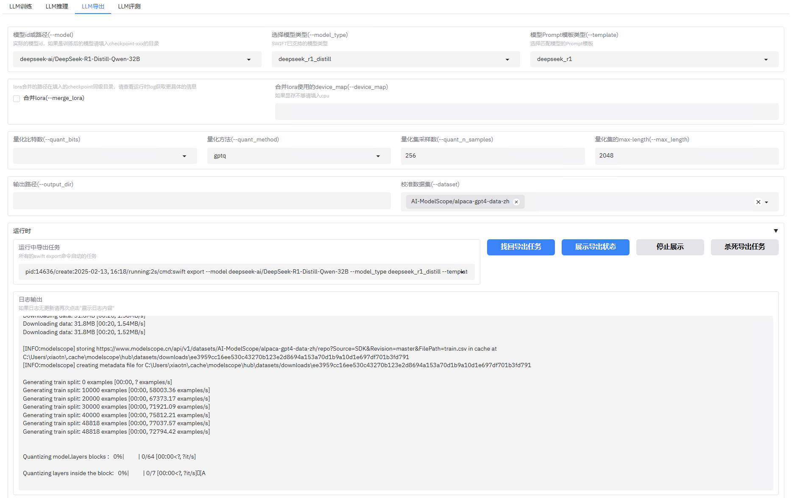


#### 4、推理时未充分利用多卡计算能力

多卡下，虽然GPU显存占满，但推理时GPU-util很小，即GPU利用率并不高

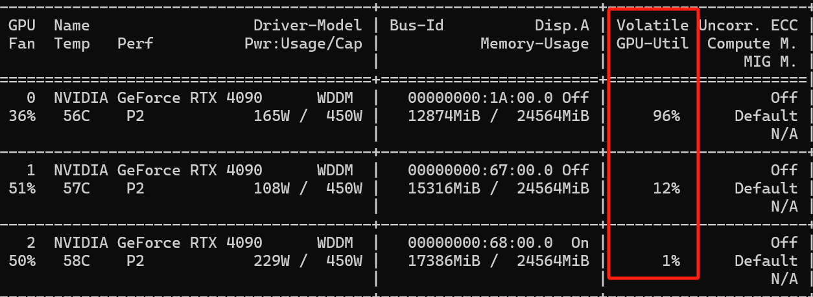


### 一、transformers

#### 1、token输出速度 + cpu占用 + 内存占用

##### Q1：环境配置

基础环境：

```
transformers>=4.32.0,<4.38.0
accelerate
tiktoken
einops
transformers_stream_generator==0.0.4
scipy
```

后续发现低版本的transformers可能会出现:

```
`rope_scaling` must be a dictionary with with two fields, `type` and `factor`, got {'factor': 8.0, 'high_freq_factor': 4.0, 'low_freq_factor': 1.0, 'original_max_position_embeddings': 8192, 'rope_type': 'llama3'}
```

即`rope_scaling`参数错误，还是需要更新一下（transformers参考4.46.3）

```
pip install --upgrade transformers
```

深度学习环境配置：直接安装torch会导致模型推理时只用cpu，需要安装与系统CUDA匹配的pytorch（版本低一点也没关系，可能存在cuda版本不存在的情况，如cu122，不过注意，这里尝试了一次还会报错，多重装几次才成功的），即便虚拟环境中没有安装cuda和cudnn，也会自动调用系统的cuda

```
# 卸载当前PyTorch
pip uninstall torch torchvision torchaudio

# 安装与系统CUDA版本匹配的PyTorch（以CUDA 11.8为例）
pip install torch torchvision torchaudio --index-url https://download.pytorch.org/whl/cu118
```


##### Q2：量化模型加载问题

环境配置：

```
pip install bitsandbytes
```

并采用transformers下BitsAndBytesConfig方法加载，但是后续发现，仍然出现如` 'BitsAndBytesConfig' object has no attribute 'get_loading_attributes'`等问题，但是BitsAndBytesConfig下是有get_loading_attributes方法的。

搜索发现大概率是`transformers`库和`bitsandbytes`库的版本问题，换了几版也不行，最后解决方法为直接用GPTQ加载

```
if "GPTQ" in model_name:
    from transformers import GPTQConfig
    quant_config = GPTQConfig(bits=4, dataset="c4")
```

后续查阅官网发现，最好的指定精度的方式就是不指定！直接注释掉quantization_config！


##### Q3：示例测试脚本

使用前，根据报错提示，安装各个库

```
pip install bitsandbytes
pip install --upgrade accelerate
pip install optimum
pip install auto-gptq
```

```
import os
import time
import threading
import torch
import psutil
import numpy as np
from transformers import AutoModelForCausalLM, AutoTokenizer, BitsAndBytesConfig

# 尝试导入ModelScope库（需提前安装 modelscope）
try:
    from modelscope import snapshot_download
except ImportError:
    snapshot_download = None


class ResourceMonitor:
    """系统资源监控器"""

    def __init__(self, interval=1):
        self.interval = interval  # 采样间隔（秒）
        self.cpu_percentages = []  # CPU使用率记录
        self.memory_usages = []  # 内存占用记录（MB）
        self.is_monitoring = False
        self.process = psutil.Process(os.getpid())  # 监控当前进程

    def _monitor(self):
        """监控线程主函数"""
        while self.is_monitoring:
            # 获取CPU使用率（系统级）
            cpu_percent = psutil.cpu_percent(interval=None)
            # 获取进程内存占用（RSS）
            mem_usage = self.process.memory_info().rss / 1024 / 1024  # 转换为MB

            self.cpu_percentages.append(cpu_percent)
            self.memory_usages.append(mem_usage)
            time.sleep(self.interval)

    def start(self):
        """启动监控"""
        self.is_monitoring = True
        self.thread = threading.Thread(target=self._monitor)
        self.thread.start()

    def stop(self):
        """停止监控并返回统计信息"""
        self.is_monitoring = False
        if self.thread.is_alive():
            self.thread.join()

        stats = {
            "cpu_avg": np.mean(self.cpu_percentages) if self.cpu_percentages else 0,
            "cpu_peak": np.max(self.cpu_percentages) if self.cpu_percentages else 0,
            "mem_avg": np.mean(self.memory_usages) if self.memory_usages else 0,
            "mem_peak": np.max(self.memory_usages) if self.memory_usages else 0
        }
        return stats


def benchmark_model(
        model_name="Qwen/Qwen2.5-0.5B",
        download_source="modelscope",  # 下载源选择：modelscope/huggingface/hf_mirror
        max_new_tokens=512,
        num_runs=3,
        device_type="auto",
        model_cache_dir=None,
):
    """
    增强版性能测试函数
    新增功能：
    1. 多下载源支持
    2. CPU/内存资源监控
    """

    # 配置下载源-----------------------------------------------------------
    if download_source == "hf_mirror":
        os.environ['HF_ENDPOINT'] = 'https://hf-mirror.com'
    elif download_source == "huggingface":
        os.environ.pop('HF_ENDPOINT', None)  # 恢复默认

    # 模型下载逻辑---------------------------------------------------------
    if download_source == "modelscope" and snapshot_download:
        if not os.path.exists(os.path.join(model_cache_dir or "", model_name)):
            print(f"\n=== 使用ModelScope下载模型 ===")
            model_name = snapshot_download(
                model_name,
                revision="master",
                cache_dir=model_cache_dir
            )

    # 设备检测-------------------------------------------------------------
    device = device_type.lower()
    if device == "auto":
        device = "cuda" if torch.cuda.is_available() else "cpu"
    print(f"\n=== 运行环境配置 ===")
    print(f"下载源: {download_source.upper()}")
    print(f"使用设备: {device.upper()}")

    # 模型加载-------------------------------------------------------------
    print("\n=== 正在加载模型 ===")
    load_start = time.time()

    try:
        # 自动选择精度
        torch_dtype = torch.bfloat16 if torch.cuda.is_bf16_supported() else torch.float16

        # 量化配置检测
        quant_config = None
        # if "Int4" in model_name or "4bit" in model_name.lower():
        #     quant_config = BitsAndBytesConfig(load_in_4bit=True)
        # elif "Int8" in model_name or "8bit" in model_name.lower():
        #     quant_config = BitsAndBytesConfig(load_in_8bit=True)
        if "Int4" in model_name or "4bit" in model_name.lower():
            quant_config = BitsAndBytesConfig(
                load_in_4bit=True,
                bnb_4bit_quant_type="nf4",  # 必需参数
                bnb_4bit_compute_dtype=torch_dtype,
                bnb_4bit_use_double_quant=True  # 可选双量化
            )
        elif "Int8" in model_name or "8bit" in model_name.lower():
            quant_config = BitsAndBytesConfig(
                load_in_8bit=True,
                llm_int8_threshold=6.0  # 调节量化阈值
            )

        # 如果仍遇到问题，可尝试直接加载GPTQ量化模型
        if "GPTQ" in model_name:
            from transformers import GPTQConfig
            quant_config = GPTQConfig(bits=4, dataset="c4")

        model = AutoModelForCausalLM.from_pretrained(
            model_name,
            torch_dtype=torch_dtype,
            # quantization_config=quant_config,  # 替换旧的load_in_8bit参数，后续发现，此参数会自动配置，注释掉更省事
            device_map="auto",  # 很奇怪，采用device这个变量，就无法使用多卡，但本质都是“auto”
            trust_remote_code=True
        )
        tokenizer = AutoTokenizer.from_pretrained(
            model_name,
            trust_remote_code=True
        )
    except ImportError as e:
        if "bitsandbytes" in str(e):
            print("量化需要安装bitsandbytes: pip install bitsandbytes")
        elif "accelerate" in str(e):
            print("需要更新accelerate: pip install --upgrade accelerate")
        else:
            print(f"缺少依赖库: {str(e)}")
        return
    except RuntimeError as e:
        if "CUDA out of memory" in str(e):
            print("显存不足！尝试：1.减小max_new_tokens 2.使用更低精度")
        else:
            print(f"运行时错误: {str(e)}")
        return

    print(f"模型加载耗时: {time.time() - load_start:.2f}s")

    # 输入准备-------------------------------------------------------------
    messages = [
        {"role": "user", "content": "请用中文简要介绍大语言模型"}
    ]
    text = tokenizer.apply_chat_template(messages, tokenize=False, add_generation_prompt=True)
    inputs = tokenizer(text, return_tensors="pt").to(device)

    # 预热阶段-------------------------------------------------------------
    print("\n=== 预热阶段 ===")
    with torch.no_grad():
        _ = model.generate(**inputs, max_new_tokens=1)
    if device == "cuda":
        torch.cuda.synchronize()

    # 性能测试-------------------------------------------------------------
    print(f"\n=== 开始性能测试（{num_runs}次平均）===")
    total_time = 0
    total_tokens = 0

    # 启动资源监控
    monitor = ResourceMonitor(interval=0.5)
    monitor.start()

    for run_idx in range(num_runs):
        if device == "cuda":
            torch.cuda.synchronize()

        start_time = time.time()

        with torch.no_grad():
            outputs = model.generate(
                **inputs,
                max_new_tokens=max_new_tokens,
                pad_token_id=tokenizer.eos_token_id,
                do_sample=False
            )

        if device == "cuda":
            torch.cuda.synchronize()

        elapsed = time.time() - start_time
        new_tokens = outputs[0].shape[-1] - inputs.input_ids.shape[-1]

        total_time += elapsed
        total_tokens += new_tokens

        print(
            f"[{run_idx + 1}/{num_runs}] Tokens: {new_tokens} | Time: {elapsed:.2f}s | Speed: {new_tokens / elapsed:.2f}tok/s")

    # 停止监控并获取数据
    resource_stats = monitor.stop()

    # 结果统计-------------------------------------------------------------
    avg_tps = total_tokens / total_time
    avg_latency = total_time / num_runs

    print("\n=== 测试结果汇总 ===")
    print(f"平均生成速度: {avg_tps:.2f} tokens/秒")
    print(f"平均延迟: {avg_latency:.2f} 秒/请求")
    print(f"CPU占用率（均值/峰值）: {resource_stats['cpu_avg']:.1f}% / {resource_stats['cpu_peak']:.1f}%")
    print(f"内存占用（均值/峰值）: {resource_stats['mem_avg']:.1f}MB / {resource_stats['mem_peak']:.1f}MB")

    # if device == "cuda":
    #     print(f"显存峰值占用: {torch.cuda.max_memory_allocated() / 1024 ** 3:.2f}GB")

    # 获取所有GPU的显存占用
    if device == "cuda" and torch.cuda.is_available():
        max_memory_per_gpu = []
        for i in range(torch.cuda.device_count()):
            max_memory_per_gpu.append(torch.cuda.max_memory_allocated(i) / 1024 ** 3)  # 显存以GB为单位
        # max_memory_all_gpus = max(max_memory_per_gpu) if max_memory_per_gpu else 0
        # print(f"所有GPU的显存峰值占用: {max_memory_all_gpus:.2f} GB")
        max_memory_all_gpus = 0
        for i, mem in enumerate(max_memory_per_gpu):
            print(f"GPU-{i} 显存峰值占用: {mem:.2f} GB")
            max_memory_all_gpus += mem
        print(f"所有GPU的显存峰值占用之和: {max_memory_all_gpus:.2f} GB")


if __name__ == "__main__":
    # llm_model_name = "Qwen/Qwen2.5-0.5B",
    # llm_model_name = "deepseek-ai/DeepSeek-R1-Distill-Llama-70B"
    # llm_model_name = "deepseek-ai/DeepSeek-R1-Distill-Qwen-32B"
    # llm_model_name = "Qwen/Qwen2.5-72B-Instruct"
    # llm_model_name = "Qwen/Qwen2.5-72B-Instruct-GPTQ-Int8"
    # llm_model_name = "Qwen/Qwen2.5-72B-Instruct-GPTQ-Int4"
    llm_model_name = "Qwen/Qwen2.5-32B-Instruct-GPTQ-Int4"

    benchmark_model(
        model_name=llm_model_name,
        download_source="modelscope",  # 测试镜像站下载："hf_mirror"、"modelscope"
        model_cache_dir=r"E:\work_zhaoyulong\Project\LLMProject\TokensTest",
        max_new_tokens=128,
        num_runs=3
    )

```

示例输出：

```
=== 开始性能测试（3次平均）===
[1/3] Tokens: 128 | Time: 105.26s | Speed: 1.22tok/s
[2/3] Tokens: 128 | Time: 105.47s | Speed: 1.21tok/s
[3/3] Tokens: 128 | Time: 105.84s | Speed: 1.21tok/s

=== 测试结果汇总 ===
平均生成速度: 1.21 tokens/秒
平均延迟: 105.52 秒/请求
CPU占用率（均值/峰值）: 33.6% / 98.3%
内存占用（均值/峰值）: 1416.3MB / 1436.5MB
```


#### 2、吞吐量

指标：

- 请求吞吐量: Requests/s

- Token吞吐量: Tokens/s

示例代码1：单卡

```
import time
import threading
import logging
from concurrent.futures import ThreadPoolExecutor
from transformers import AutoModelForCausalLM, AutoTokenizer

# 配置日志系统
logging.basicConfig(
    level=logging.INFO,
    format="%(asctime)s - %(levelname)s - %(threadName)s - %(message)s",
)
logger = logging.getLogger(__name__)

class ThroughputTester:
    def __init__(self):
        self._init_components()
        self._setup_test_config()
        
    def _init_components(self):
        """初始化模型和分词器"""
        logger.info("正在加载模型和分词器...")
        self.model = AutoModelForCausalLM.from_pretrained(
            "Qwen/Qwen2.5-32B-Instruct-GPTQ-Int4"
        ).cuda()
        self.tokenizer = AutoTokenizer.from_pretrained(
            "Qwen/Qwen2.5-32B-Instruct-GPTQ-Int4"
        )
        logger.info("模型加载完成")
        
        # 创建线程安全锁
        self.model_lock = threading.Lock()

    def _setup_test_config(self):
        """配置测试参数"""
        self.input_text = "请用中文简要介绍大语言模型。"
        self.num_requests = 40
        self.concurrency = 8
        self.max_new_tokens = 100
        
        # 统计变量
        self.completed_requests = 0
        self.failed_requests = 0
        self.total_tokens = 0
        self.start_time = None

    def _process_single_request(self, request_id):
        """处理单个请求"""
        try:
            start_time = time.time()
            logger.debug(f"请求 {request_id} 开始处理")
            
            # 使用线程锁保证模型调用安全
            with self.model_lock:
                inputs = self.tokenizer(
                    self.input_text, 
                    return_tensors="pt"
                ).to("cuda")
                
                outputs = self.model.generate(
                    **inputs,
                    max_new_tokens=self.max_new_tokens,
                    pad_token_id=self.tokenizer.eos_token_id
                )
            
            # 计算生成token数
            generated_tokens = outputs.shape[1] - inputs["input_ids"].shape[1]
            elapsed = time.time() - start_time
            
            # 更新统计信息
            with threading.Lock():
                self.completed_requests += 1
                self.total_tokens += generated_tokens
                logger.info(
                    f"请求 {request_id} 完成 | "
                    f"Tokens: {generated_tokens} | "
                    f"耗时: {elapsed:.2f}s | "
                    f"进度: {self.completed_requests}/{self.num_requests}"
                )
                
        except Exception as e:
            with threading.Lock():
                self.failed_requests += 1
            logger.error(f"请求 {request_id} 失败: {str(e)}", exc_info=True)

    def run_test(self):
        """执行压力测试"""
        logger.info("="*50)
        logger.info(f"开始性能测试 | 总请求数: {self.num_requests} | 并发数: {self.concurrency}")
        self.start_time = time.time()
        
        with ThreadPoolExecutor(
            max_workers=self.concurrency,
            thread_name_prefix="InferenceThread"
        ) as executor:
            # 提交所有任务
            futures = [
                executor.submit(self._process_single_request, i)
                for i in range(self.num_requests)
            ]
            
            # 等待所有任务完成
            for future in futures:
                try:
                    future.result()
                except Exception as e:
                    logger.error(f"任务执行异常: {str(e)}")

        # 计算结果
        total_time = time.time() - self.start_time
        success_rate = self.completed_requests / self.num_requests * 100
        
        logger.info("="*50)
        logger.info("测试结果:")
        logger.info(f"总耗时: {total_time:.2f}秒")
        logger.info(f"成功请求: {self.completed_requests}")
        logger.info(f"失败请求: {self.failed_requests}")
        logger.info(f"成功率: {success_rate:.2f}%")
        logger.info(f"请求吞吐量: {self.completed_requests / total_time:.2f} Requests/s")
        logger.info(f"Token吞吐量: {self.total_tokens / total_time:.2f} Tokens/s")
        logger.info("="*50)

if __name__ == "__main__":
    tester = ThroughputTester()
    tester.run_test()
```


示例代码2：

```
import time
import threading
from transformers import AutoModelForCausalLM, AutoTokenizer
import torch

# 加载模型和分词器
print("🔄 正在初始化模型...")
model = AutoModelForCausalLM.from_pretrained(
    "Qwen/Qwen2.5-32B-Instruct-GPTQ-Int4",
    device_map="auto",
    torch_dtype=torch.float16
)
tokenizer = AutoTokenizer.from_pretrained("Qwen/Qwen2.5-32B-Instruct-GPTQ-Int4")
print(f"✅ 模型加载完成 | 设备分布：{model.hf_device_map}")

# 定义测试参数
input_text = "请用中文简要介绍大语言模型。"
num_requests = 40
concurrency = 8
max_new_tokens = 100

# 全局状态变量
completed_requests = 0
start_time = None
print_lock = threading.Lock()
model_lock = threading.Lock()

def get_gpu_status():
    """获取GPU状态信息"""
    status = []
    for i in range(torch.cuda.device_count()):
        allocated = torch.cuda.memory_allocated(i) / 1024**2
        reserved = torch.cuda.memory_reserved(i) / 1024**2
        status.append(f"GPU{i}: {allocated:.1f}MB (预留:{reserved:.1f}MB)")
    return " | ".join(status)

def calculate_throughput():
    """计算实时吞吐量"""
    elapsed = time.time() - start_time
    if elapsed < 1e-6:  # 防止除零错误
        return 0.0, 0.0
    req_throughput = completed_requests / elapsed
    token_throughput = (completed_requests * max_new_tokens) / elapsed
    return req_throughput, token_throughput

# 请求处理函数
def process_request():
    global completed_requests
    thread_id = threading.get_ident()
    
    try:
        # 记录开始时间
        request_start = time.time()
        
        # 处理请求
        with model_lock:
            inputs = tokenizer(input_text, return_tensors="pt").to(model.device)
            outputs = model.generate(
                **inputs,
                max_new_tokens=max_new_tokens,
                pad_token_id=tokenizer.eos_token_id
            )
        
        # 更新统计信息
        with print_lock:
            completed_requests += 1
            current_time = time.time()
            
            # 计算指标
            req_tps, token_tps = calculate_throughput()
            latency = current_time - request_start
            elapsed_total = current_time - start_time
            gpu_status = get_gpu_status()
            
            # 格式化输出
            print(f"\n📊 请求完成 [{completed_requests}/{num_requests}]")
            print(f"├─ 线程ID: {thread_id}")
            print(f"├─ 单次延迟: {latency:.2f}s")
            print(f"├─ 累计耗时: {elapsed_total:.2f}s")
            print(f"├─ 请求吞吐量: {req_tps:.2f} Requests/s")
            print(f"├─ Token吞吐量: {token_tps:.2f} Tokens/s")
            print(f"└─ GPU状态: {gpu_status}")
            
    except Exception as e:
        with print_lock:
            print(f"❌ 请求处理失败 | 线程{thread_id} | 错误: {str(e)}")

# 启动测试
print("\n🔥 开始压力测试...")
start_time = time.time()
print(f"📌 测试参数：{num_requests}请求 | {concurrency}并发 | {max_new_tokens} tokens/请求")
print(f"🖥️ 硬件信息：{torch.cuda.device_count()}GPU | {torch.cuda.get_device_name(0)}")

# 创建线程池
threads = []
for i in range(num_requests):
    # 控制并发度
    while True:
        alive = sum(t.is_alive() for t in threads)
        if alive < concurrency:
            break
        time.sleep(0.1)
    
    t = threading.Thread(target=process_request)
    t.start()
    threads.append(t)
    
    # 打印启动状态
    if (i+1) % 10 == 0:
        print(f"🚀 已启动{i+1}/{num_requests}请求 | 当前并发: {alive+1}")

# 等待所有线程完成
print("\n⏳ 等待请求完成...")
[t.join() for t in threads]

# 最终性能报告
total_time = time.time() - start_time
print(f"\n🎯 最终性能报告:")
print(f"- 总耗时: {total_time:.2f}s")
print(f"- 平均请求吞吐量: {num_requests/total_time:.2f} Requests/s")
print(f"- 平均Token吞吐量: {(num_requests*max_new_tokens)/total_time:.2f} Tokens/s")
print(f"- 峰值显存使用:")
for i in range(torch.cuda.device_count()):
    print(f"  GPU{i}: {torch.cuda.max_memory_allocated(i)/1024**2:.1f}MB")
```


示例代码3：多卡，存在问题，代码是将请求分别放在不同显卡上去运行，根本逻辑上就存在问题，而且会遇到显存爆炸

```
CUDA_VISIBLE_DEVICES=0,1 python benchmark.py --log=DEBUG
```

```
略
```


#### 3、GPU相关

测试：GPU利用率 (%)、显存占用 (MiB)、功耗 (W)、温度 (°C)，测试结束时`ctrl + c`终止指令即可，注意，每次使用前，删除旧的log文件

```
nvidia-smi --query-gpu=index,timestamp,utilization.gpu,memory.used,power.draw,temperature.gpu --format=csv,noheader,nounits -l 1 -f gpu_stats.log
```

备注：动态查看nvidia-smi的输出结果

- windows下：`nvidia-smi -l x`
- linux下：`watch -n 1 nvidia-smi`


处理日志文件：

```python
import pandas as pd

# 读取日志文件
df = pd.read_csv("gpu_stats.log", header=None,
                 names=["index", "timestamp", "utilization.gpu [%]", "memory.used [MiB]", "power.draw [W]",
                        "temperature.gpu [°C]"])

# 确保所有列为字符串类型再进行提取
df['utilization.gpu [%]'] = df['utilization.gpu [%]'].astype(str).str.extract('(\d+)').astype(float)
df['memory.used [MiB]'] = df['memory.used [MiB]'].astype(str).str.extract('(\d+)').astype(float)
df['power.draw [W]'] = df['power.draw [W]'].astype(str).str.extract('(\d+\.?\d*)').astype(float)
df['temperature.gpu [°C]'] = df['temperature.gpu [°C]'].astype(str).str.extract('(\d+)').astype(float)

# 计算每个 GPU 的峰值
gpu_stats = {}

# 获取所有 GPU 索引
gpu_indexes = df['index'].unique()

for gpu in gpu_indexes:
    gpu_data = df[df['index'] == gpu]

    gpu_stats[gpu] = {
        "GPU利用率 (%)": gpu_data['utilization.gpu [%]'].max(),
        "显存占用峰值 (MiB)": gpu_data['memory.used [MiB]'].max(),
        "功耗峰值 (W)": gpu_data['power.draw [W]'].max(),
        "温度峰值 (°C)": gpu_data['temperature.gpu [°C]'].max()
    }

# 计算所有 GPU 显存的峰值总和
total_memory_peak = df.groupby('timestamp')['memory.used [MiB]'].max().sum()

# 输出每个 GPU 的峰值
print("每个 GPU 的峰值：")
for gpu, stats in gpu_stats.items():
    print(f"GPU-{gpu}:")
    for k, v in stats.items():
        print(f"  {k}: {v:.2f}")

# 输出所有 GPU 显存的峰值总和
print(f"\n所有 GPU 显存占用的峰值总和 (MiB): {total_memory_peak:.2f}")

```


### 二、vLLM

#### 001 环境配置

##### 1、针对租用平台

`torch.cuda.is_available()`出现cuda不可用，推测为CUDA 驱动或硬件兼容性问题，即vllm版本与torch、cuda版本不匹配

当前环境：

- vllm 0.7.2（是20250219当前最新版）
- torch 2.5.1+cu124
- 系统CUDA：12.4

尝试采用其他合理的版本，如：

```
pip install torch==2.1.0+cu118 torchvision==0.16.0+cu118 torchaudio==2.1.0+cu118 --extra-index-url https://download.pytorch.org/whl/cu118
```

```
pip install torch==2.3.0+cu121 torchvision==0.18.0+cu121 torchaudio==2.3.0 torchtext torchdata --index-url https://download.pytorch.org/whl/cu121
pip install vllm==0.5.1
```

不可用，尝试别人已经验证的环境：

```
pip uninstall torch
pip uninstall vllm

pip install torch==2.3.0+cu118 xformers -f https://download.pytorch.org/whl/torch_stable.html
pip install vllm==0.5.1
```

还是不可哟。

不过发现，VLLM官方提供的CUDA对应的版本有两个，分别是11.8和12.1。


最后解决方法：刚开始租服务器、选择镜像的时候，就选择旧的vllm版本，直接能用


##### 2、一般方法

环境配置：

```bash
pip install vllm transformers psutil numpy
```

安装cuda等深度学习环境：

```bash
conda install pytorch torchvision torchaudio cudatoolkit -c pytorch
```

默认情况下，vLLM从HuggingFace下载模型。如果您想在以下示例中使用ModelScope中的模型，请设置环境变量：

```bash
echo 'export VLLM_USE_MODELSCOPE=True' >> ~/.bashrc
source ~/.bashrc
```

vllm测试代码：

```python
from vllm import LLM
prompts = [
    "Hello, my name is",
    "The president of the United States is",
    "The capital of France is",
    "The future of AI is",
]

llm = LLM(model="Qwen/Qwen2-0.5B",trust_remote_code=True,gpu_memory_utilization=0.9) 

outputs = llm.generate(prompts)
for output in outputs:
    prompt = output.prompt
    generated_text = output.outputs[0].text
    print(f"Prompt: {prompt!r}, Generated text: {generated_text!r}")

```


#### 002 方案一、用vLLM原生的基准测试工具

源码参考：

- https://github.com/vllm-project/vllm/tree/main/benchmarks
- https://github.com/xorbitsai/inference/blob/main/xinference/model/llm/vllm/core.py

项目参考：

- https://blog.csdn.net/arkohut/article/details/135167762
- https://blog.csdn.net/qq_36221788/article/details/142982659
- https://zhuanlan.zhihu.com/p/694568911
- https://blog.csdn.net/qq_36221788/article/details/142980919?spm=1001.2014.3001.5501


##### 1、基准测试-吞吐量、Token输出速度

总的来说，官方的几个适用于当前场景的测试工具：

- [benchmark_serving.py](https://github.com/vllm-project/vllm/blob/main/benchmarks/benchmark_serving.py)：基准测试在线服务的吞吐量
- [benchmark_throughput.py](https://github.com/vllm-project/vllm/blob/main/benchmarks/benchmark_throughput.py)：基准测试离线推理的吞吐量
- [benchmark_long_document_qa_throughput.py](https://github.com/vllm-project/vllm/blob/main/benchmarks/benchmark_long_document_qa_throughput.py)：基准测试用于长文档QA吞吐量

其他脚本各有作用


环境配置：

```
git clone -b v0.6.4.post1 --single-branch https://github.com/vllm-project/vllm.git
cd vllm
git describe --tags
```

数据准备：数据集采用默认数据集（sharegpt），官方提供方法如下

```
wget https://huggingface.co/datasets/anon8231489123/ShareGPT_Vicuna_unfiltered/resolve/main/ShareGPT_V3_unfiltered_cleaned_split.json
```

错误方法：下载的内容有问题，基准测试时出现json.decoder.JSONDecodeError: Expecting value: line 1 column 1 (char 0)

```
git lfs install ; git clone https://www.modelscope.cn/datasets/otavia/ShareGPT_Vicuna_unfiltered.git
```


模型准备：

```
pip install -U huggingface_hub
huggingface-cli download --resume-download Qwen/Qwen2.5-72B-Instruct-GPTQ-Int4 --local-dir Qwen/Qwen2.5-72B-Instruct-GPTQ-Int4
```

Qwen/Qwen2.5-1.5B-Instruct-GPTQ-Int4

Qwen/Qwen2.5-32B-Instruct-GPTQ-Int4

Qwen/Qwen2.5-72B-Instruct-GPTQ-Int4


启动模型：如果指定CUDA_VISIBLE_DEVICES=1 反而会报错

```
python -m vllm.entrypoints.openai.api_server --host 0.0.0.0 --port 8007 --max-model-len 8000 --model Qwen/Qwen2.5-72B-Instruct-GPTQ-Int4 --disable-log-requests --swap-space 16 --tensor-parallel-size 2 --gpu-memory-utilization 0.9
```

其他参数：

- 限制并发请求数：

  ```
  --max-num-seqs 64 \        # 限制并发处理序列数（）
  --max-num-batched-tokens 2048 \  # 限制批处理token数（）
  --gpu-memory-utilization 0.8  # 预留20%显存余量（）
  ```

- 优化KV缓存管理：

  ```
  --block-size 16 \          # 减小KV缓存块大小（）
  --enable-chunked-prefill \ # 启用分块预填充（）
  --max-model-len 4096       # 根据实际需求缩短最大序列长度（）
  ```

- 内存回收策略：

  ```
  --swap-space 32 \          # 增大Swap空间至32GB（应对突发峰值）
  --enforce-eager \          # 禁用CUDA图模式（减少图内存占用，）
  ```
  
-  --save-result --result-dir=/home/temp 


注意：

- 要使用该类运行多 GPU 推理`LLM`，请将`tensor_parallel_size`参数设置为要使用的 GPU 数量

- 您还可以另外指定`--pipeline-parallel-size`启用管道并行性。例如，要在具有管道并行性和张量并行性的 8 个 GPU 上运行 API 服务器：`--tensor-parallel-size 4 --pipeline-parallel-size 2`

- VLLM_USE_PROFILER=1 VLLM_TORCH_PROFILER_DIR=/temp/ 用于指定分析日志输出目录，**停止服务时（正常退出服务：非ctrl + c，而是需要关闭进程）**，分析日志会自动保存到 `VLLM_TORCH_PROFILER_DIR` 指定的目录（格式为 `.pt.trace.json.gz`）。

  - 正常退出服务方法：

    ```
    # 查找进程ID（PID）
    ps aux | grep "vllm.entrypoints.openai.api_server"
    # 发送 SIGTERM 信号（允许服务完成当前请求）
    kill -15 <PID>
    
    # 或直接通过进程名终止
    pkill -f "vllm.entrypoints.openai.api_server"
    ```

    

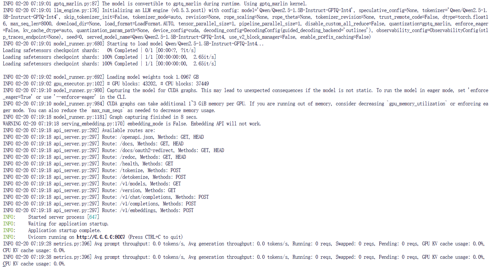


测试模型是否正常：

```
curl --location 'http://0.0.0.0:8007/v1/chat/completions' \
  --header 'Content-Type: application/json' \
  --data '{
  "model": "Qwen/Qwen2.5-72B-Instruct-GPTQ-Int4",
  "messages": [
    {
      "role": "user",
      "content": "简单解释一下量子计算"
    }
  ],
  "temperature": 0.2,
  "stream": true
}'
```


1、基准测试在线服务的吞吐量：

```
python vllm/benchmarks/benchmark_serving.py --backend vllm --port 8007 --endpoint /v1/completions --model Qwen/Qwen2.5-72B-Instruct-GPTQ-Int4 --dataset-name sharegpt --dataset-path ShareGPT_V3_unfiltered_cleaned_split.json --request-rate 10 --num-prompts 1000 --profile
```

注意：

- 模型文件夹的命名不能随便命名，最好用原本的名字
- 老版本的vllm没有--profile功能，文件上传https://ui.perfetto.dev/即可看到gpu等使用记录

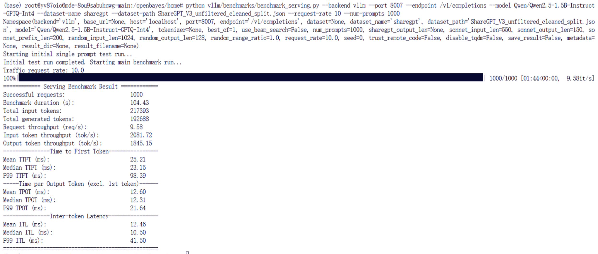


2、基准测试离线推理的吞吐量：需要先关闭上面的api_server，直接运行如下指令即可

```
python vllm/benchmarks/benchmark_throughput.py --backend vllm --model Qwen/Qwen2.5-72B-Instruct-GPTQ-Int4 --dataset ShareGPT_V3_unfiltered_cleaned_split.json --tensor-parallel-size 4
```

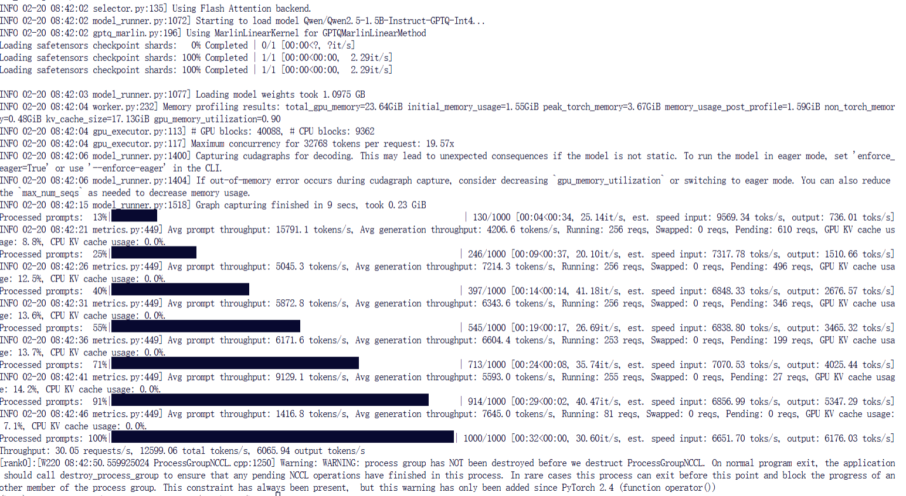


3、基准测试用于长文档QA吞吐量

```
python vllm/benchmarks/benchmark_long_document_qa_throughput.py --model Qwen/Qwen2.5-72B-Instruct-GPTQ-Int4 --enable-prefix-caching --num-documents 8 --repeat-count 2  --tensor-parallel-size 4
```


##### 2、CPU、内存占用

方案一：基于top指令


```
import os
import time
import signal
import sys

# 定义日志文件名
log_file = f"system_resource_log_{time.strftime('%Y%m%d%H%M%S')}.log"

# 处理 Ctrl+C 信号以退出并保存日志
def signal_handler(sig, frame):
    print("\n停止记录并保存日志。")
    sys.exit(0)

signal.signal(signal.SIGINT, signal_handler)

print("开始记录系统资源使用情况... 按 Ctrl+C 退出并保存日志")
print(f"日志文件路径: {log_file}")

# 持续记录资源使用情况
try:
    with open(log_file, "a") as f:
        while True:
            # 使用 top 命令以批处理模式获取资源使用情况
            top_output = os.popen("top -b -n 1").read()
            f.write(top_output)
            f.flush()
            time.sleep(1)  # 每秒记录一次
except KeyboardInterrupt:
    # 捕获 Ctrl+C 后退出
    print("\n记录已停止。日志保存完成。")

```

```

```


方案二：基于psutil库

示例脚本：测试代码执行过程中，系统cpu利用率的平均值和峰值、内存占用的平均值和峰值，用户终端输入ctrl+c时，输出相关指标

```
pip install psutil
```

```python
import psutil
import time
import signal
import sys

# 用于存储CPU和内存的实时统计数据
cpu_usages = []
memory_usages = []
peak_cpu = 0
peak_memory = 0

# 捕获Ctrl+C退出时的信号
def signal_handler(sig, frame):
    avg_cpu = sum(cpu_usages) / len(cpu_usages) if cpu_usages else 0
    avg_memory = sum(memory_usages) / len(memory_usages) if memory_usages else 0

    # 打印CPU和内存的统计信息
    print(f"\nCPU占用率（均值/峰值）: {avg_cpu:.1f}% / {peak_cpu:.1f}%")
    print(f"内存占用（均值/峰值）: {avg_memory / 1024:.1f}MB / {peak_memory / 1024:.1f}MB")
    sys.exit(0)

# 注册Ctrl+C信号处理器
signal.signal(signal.SIGINT, signal_handler)

# 模拟运行的任务，收集CPU和内存使用情况
print("程序正在运行，请稍候...按Ctrl+C退出并查看结果")

try:
    while True:
        # 获取CPU占用率（每秒一次）
        cpu_usage = psutil.cpu_percent(interval=1)
        cpu_usages.append(cpu_usage)
        peak_cpu = max(peak_cpu, cpu_usage)

        # 获取内存占用情况（当前使用的物理内存）
        memory_usage = psutil.virtual_memory().used
        memory_usages.append(memory_usage)
        peak_memory = max(peak_memory, memory_usage)

        # 实时显示CPU和内存占用
        print(f"\r当前CPU占用率: {cpu_usage:.1f}%  当前内存占用: {memory_usage / 1024:.1f}MB", end='', flush=True)

        # 模拟一些计算任务，避免CPU占用过低
        time.sleep(0.1)

except KeyboardInterrupt:
    pass  # 通过Ctrl+C触发的异常处理

```


##### 3、GPU相关

参考transformers方法

或者采用vllm自带的工具（暂未使用成功）


#### 003 方案二、自己撰写测试程序

##### 1、token输出速度 + cpu占用 + 内存占用

参考官方示例撰写的测试样例（注意，deepseek等写的代码，会乱用没有的函数）：tokens输出速度计算中，时间部分有问题，需纠正

```python
import time
import torch
from vllm import LLM, SamplingParams
 
# Step 1: 下载并加载模型
model_name = "model"  # 模型所在路径
 
# 初始化vLLM模型
device = "cuda" if torch.cuda.is_available() else "cpu"
if device == "cpu":
    raise RuntimeError("vLLM currently does not support CPU. Please use a compatible GPU.")
 
llm = LLM(model=model_name, trust_remote_code=True,gpu_memory_utilization=0.9)
 
# Step 2: 模型预热函数
def warm_up_model(warm_up_tokens=100):
    # 生成一定数量的tokens来进行预热
    prompt = "请用中文简要介绍大语言模型"
    sampling_params = SamplingParams(temperature=0.8, top_p=0.95, max_tokens=warm_up_tokens)
    outputs = llm.generate(prompt, sampling_params)
 
# Step 3: 进行token输出速度测试
def test_token_speed(warm_up_tokens=100, test_tokens=50000):
    # 预热模型
    print("开始预热模型...")
    warm_up_model(warm_up_tokens)
    print("模型预热完成！")
    
    sum_prompt_tokens = []
    sum_generated_text_tokens = []
    
    # 创建测试用的输入
    prompts = [
        "Hello, my name is",
        "The president of the United States is",
        "The capital of France is",
        "The future of AI is",
    ]
    # Create a sampling params object.
    sampling_params = SamplingParams(temperature=0.8, top_p=0.95)
 
    # 测试
    start_time = time.time()
    outputs = llm.generate(prompts, sampling_params)
    end_time = time.time()
    elapsed_time = end_time - start_time
    
    print("######")
    print(outputs)
    print("######")
    
    for output in outputs:
        prompt = output.prompt
        generated_text = output.outputs[0].text
        print(f"Prompt: {prompt!r}, Generated text: {generated_text!r}")
 
        tokens_prompt = len(prompt.split())
        tokens_generated = len(generated_text.split())  # 统计输出的token数量
        print(f"tokens_prompt: {tokens_prompt},tokens_generated: {tokens_generated}")
 
        sum_prompt_tokens.append(tokens_prompt)
        sum_generated_text_tokens.append(tokens_generated)
        
    # 计算平均速度
    average_speed = sum(sum_generated_text_tokens) / elapsed_time
    print(f"\n平均token输出速度: {average_speed:.2f} tokens/秒")
    return average_speed
 
# Step 4: 运行测试
if __name__ == "__main__":
    test_token_speed()
```

示例输出：

```
RequestOutput(
	request_id=1, 
	prompt='Hello, my name is', 
	prompt_token_ids=[9707, 11, 847, 829, 374], 
	prompt_logprobs=None, 
	outputs=[
	CompletionOutput(
        index=0, 
        text=' Margo, I have been running for 25 years. I was diagnosed', 
        token_ids=(386, 12088, 11, 358, 614, 1012, 4303, 369, 220, 17, 20, 1635, 13, 358, 572, 28604), 
        cumulative_logprob=-32.0423269867897, 
        logprobs=None, 
        finish_reason=length, 
        stop_reason=None)], 
	finished=True,
	metrics=RequestMetrics(
		arrival_time=1739948349.163026,
		last_token_time=1739948349.163026, 	
		first_scheduled_time=1739948349.1640651,
		first_token_time=1739948349.1878772,
		time_in_queue=0.0010390281677246094,
		finished_time=1739948349.2522297), 
	lora_request=None
)
```


##### 2、吞吐量

示例代码：tokens输出速度计算中，时间部分有问题，需纠正

```python
from vllm import LLM, SamplingParams
import time
 
# 1. 初始化本地大模型
llm = LLM(
    model="model",  # 本地模型路径
    # tensor_parallel_size=2,            # GPU并行数
    # max_model_len=102400               # 最大上下文长度
)
 
# 2. 定义测试参数
sampling_params = SamplingParams(
    temperature=0.7,
    top_k=50,
    max_tokens=512,        # 最大生成token数
    ignore_eos=True        # 强制生成到max_tokens
)
 
prompts = ["请解释量子力学的基本原理"] * 10  # 10个重复请求用于压力测试
 
# 3. 执行推理并测量性能
start_time = time.time()
outputs = llm.generate(prompts, sampling_params)
total_time = time.time() - start_time
 
# 4. 计算关键指标
total_tokens = sum(len(output.outputs[0].token_ids) for output in outputs)
avg_tput = total_tokens / total_time  # 总吞吐量（tokens/sec）
 
# 首token延迟（TTFT）统计
ttft_list = [output.metrics.first_token_time for output in outputs]
avg_ttft = sum(ttft_list) / len(ttft_list) * 1000  # 转换为毫秒
 
# 单token延迟（TPOT）统计
tpot_list = [
    (output.metrics.time_per_output_token * 1000)  # 毫秒/token
    for output in outputs if output.metrics.time_per_output_token
]
 
# 5. 输出结果
print(f"""
========== 性能测试报告 ==========
总请求数: {len(prompts)}
总生成token数: {total_tokens}
总耗时: {total_time:.2f}s
平均吞吐量: {avg_tput:.2f} tokens/sec
平均首token延迟: {avg_ttft:.2f} ms
平均单token延迟: {sum(tpot_list)/len(tpot_list):.2f} ms
==================================
""")
```


##### 3、GPU相关

参考测试“LLM离线模型”


### 三、基于ollama + 远程连接Dify + 与CloudPSS交互

采用Ollama默认配置文件，未修改

#### 0、环境配置

linux下ollama安装方法：

```
curl -fsSL https://ollama.com/install.sh | sh
```

有时候 `wget` 可能会比 `curl` 更加稳定，尤其在大部分情况下，它能更好地处理网络中断。你可以试试这个命令（实测要快很多）：

```
wget https://ollama.com/install.sh -O - | sh
```


启动服务：`ollama serve`，ollama下载大概10min，两个72B模型，大概下载1h

```
ollama run deepseek-r1:32b-qwen-distill-q4_K_M
ollama run qwen2.5:32b-instruct-q4_K_M

ollama run deepseek-r1:70b-llama-distill-q4_K_M
ollama run qwen2.5:72b-instruct-q4_K_M
ollama run deepseek-r1:32b-qwen-distill-fp16
```

如何提高下载速度：

- 方法一：下载过程中，使用 `Ctrl + C` 中断 `ollama run ***` 的命令后，再重新执行后，速度会快上一段时间。（这个过程也可以封装成脚本）
- 方法二：修改ollama服务文件，添加http_proxy、https_proxy加速地址，再重载systemd管理器配置，并重启ollama服务


注意：

- Q1：关于ollama所用gpu缓存如何释放？
  - A1：如果切换模型，ollama缓存会自动释放并加载新模型，如果是旧模型，短时间内ollama不会自己释放显存，目前没有通过代码实现这一过程，需要手动重启ollama服务即可
- Q2：如何清除ollama未下载完毕的模型占用的磁盘空间
  - cd ~/.ollama，删除models目录


#### 1、token输出速度 + cpu占用 + 内存占用

示例代码：

```python
import os
import time
import threading
import psutil
import numpy as np
import torch
import ollama

# 资源监控类
class ResourceMonitor:
    """系统资源监控器"""
    def __init__(self, interval=1):
        self.interval = interval  # 采样间隔（秒）
        self.cpu_percentages = []  # CPU使用率记录
        self.memory_usages = []  # 内存占用记录（MB）
        self.gpu_memory_usages = {}  # GPU显存使用情况
        self.is_monitoring = False
        self.process = psutil.Process(os.getpid())  # 监控当前进程

    def _monitor(self):
        """监控线程主函数"""
        while self.is_monitoring:
            # CPU和内存监控
            cpu_percent = psutil.cpu_percent(interval=None)
            mem_usage = self.process.memory_info().rss / 1024 / 1024  # 转换为MB
            self.cpu_percentages.append(cpu_percent)
            self.memory_usages.append(mem_usage)

            # GPU显存监控
            if torch.cuda.is_available():
                for i in range(torch.cuda.device_count()):
                    mem_allocated = torch.cuda.memory_allocated(i) / 1024 ** 3  # 转换为GB
                    if i not in self.gpu_memory_usages:
                        self.gpu_memory_usages[i] = []
                    self.gpu_memory_usages[i].append(mem_allocated)

            time.sleep(self.interval)

    def start(self):
        """启动监控"""
        self.is_monitoring = True
        self.thread = threading.Thread(target=self._monitor)
        self.thread.start()

    def stop(self):
        """停止监控并返回统计信息"""
        self.is_monitoring = False
        if self.thread.is_alive():
            self.thread.join()

        stats = {
            "cpu_avg": np.mean(self.cpu_percentages) if self.cpu_percentages else 0,
            "cpu_peak": np.max(self.cpu_percentages) if self.cpu_percentages else 0,
            "mem_avg": np.mean(self.memory_usages) if self.memory_usages else 0,
            "mem_peak": np.max(self.memory_usages) if self.memory_usages else 0
        }

        gpu_stats = {}
        if torch.cuda.is_available():
            for i, mem_usages in self.gpu_memory_usages.items():
                gpu_stats[f"gpu_{i}_avg"] = np.mean(mem_usages)
                gpu_stats[f"gpu_{i}_peak"] = np.max(mem_usages)

        stats.update(gpu_stats)
        return stats


# 性能测试函数
def benchmark_model(
        model_name="Qwen/Qwen2.5-72B",  # 使用的模型名称
        max_new_tokens=512,
        num_runs=3,
):
    if not model_name:
        print("错误: 未指定模型！请确保输入有效的模型名称。")
        return

    print(f"\n=== 运行环境配置 ===")
    print(f"使用的模型: {model_name}")

    print("\n=== 正在加载模型 ===")
    load_start = time.time()

    try:
        response = ollama.chat(model=model_name, messages=[{"role": "user", "content": "请用中文简要介绍大语言模型"}])
        print(f"模型加载耗时: {time.time() - load_start:.2f}s")
    except Exception as e:
        print(f"加载模型失败: {str(e)}")
        return

    messages = [{"role": "user", "content": "请用中文简要介绍大语言模型"}]

    print("\n=== 预热阶段 ===")
    response = ollama.chat(model=model_name, messages=messages)
    print("预热阶段响应:", response.message.content)

    print(f"\n=== 开始性能测试（{num_runs}次平均）===")
    total_time = 0
    total_tokens = 0

    # 启动资源监控
    monitor = ResourceMonitor(interval=0.5)
    monitor.start()

    for run_idx in range(num_runs):
        start_time = time.time()

        response = ollama.chat(model=model_name, messages=messages)

        elapsed = time.time() - start_time
        new_tokens = len(response.message.content)

        total_time += elapsed
        total_tokens += new_tokens

        print(f"[{run_idx + 1}/{num_runs}] Tokens: {new_tokens} | Time: {elapsed:.2f}s | Speed: {new_tokens / elapsed:.2f}tok/s")

    resource_stats = monitor.stop()

    avg_tps = total_tokens / total_time
    avg_latency = total_time / num_runs

    print("\n=== 测试结果汇总 ===")
    print(f"平均生成速度: {avg_tps:.2f} tokens/秒")
    print(f"平均延迟: {avg_latency:.2f} 秒/请求")
    print(f"CPU占用率（均值/峰值）: {resource_stats['cpu_avg']:.1f}% / {resource_stats['cpu_peak']:.1f}%")
    print(f"内存占用（均值/峰值）: {resource_stats['mem_avg']:.1f}MB / {resource_stats['mem_peak']:.1f}MB")

    if torch.cuda.is_available():
        for i in range(torch.cuda.device_count()):
            print(f"GPU-{i} 显存使用情况：均值: {resource_stats[f'gpu_{i}_avg']:.2f} GB, 峰值: {resource_stats[f'gpu_{i}_peak']:.2f} GB")

    if torch.cuda.is_available():
        torch.cuda.empty_cache()
        print("GPU缓存已释放。")


if __name__ == "__main__":
    # llm_model_name = "deepseek-r1:32b-qwen-distill-q4_K_M"
    # llm_model_name = "ddeepseek-r1:32b-qwen-distill-fp16"
    # llm_model_name = "deepseek-r1:70b-llama-distill-q4_K_M"
    llm_model_name = "qwen2.5:72b-instruct-q4_K_M"

    benchmark_model(
        model_name=llm_model_name,
        max_new_tokens=128,
        num_runs=3
    )

```


#### 2、吞吐量

调节MODEL_NAME等四个测试参数即可

```python
import ollama
import torch
import time
import threading
from concurrent.futures import ThreadPoolExecutor

# 获取可用 GPU 数量
if torch.cuda.is_available():
    num_gpus = torch.cuda.device_count()
else:
    num_gpus = 1  # 如果没有 GPU，则默认使用 CPU

# 测试参数，可调整
MODEL_NAME = "deepseek-r1:32b-qwen-distill-q4_K_M"  # 需要测试的 Ollama 模型名称
NUM_CONCURRENT_REQUESTS = num_gpus * 2  # 并发请求数，建议设为 GPU 数量的倍数
NUM_TEST_ROUNDS = 2  # 测试轮数
PROMPT = "请用中文简要介绍大语言模型"  # 需要测试的提示词


def generate_text(model: str, prompt: str):
    """
    调用 Ollama API 生成文本，并返回生成的文本及其 Token 数量
    :param model: 模型名称
    :param prompt: 输入文本
    :return: 生成的文本以及 Token 数量
    """
    try:
        # 调用 Ollama API 获取响应
        response = ollama.chat(model=model, messages=[{"role": "user", "content": prompt}])
        text = response.message.content
        # print(f"##################")
        # print(text)
        # print(f"##################")
        # 获取生成文本的 Token 数量（使用文本长度估算 Token 数量）
        token_count = len(text)  # 使用字符长度来估算 Token 数量

        return text, token_count  # 返回文本和 token 数量
    except Exception as e:
        return f"Error: {str(e)}", 0  # 如果发生错误，返回错误信息和0 token数


def throughput_test():
    """
    进行吞吐量测试，计算 QPS（Queries Per Second）以及 Token吞吐量
    """
    print(f"Running throughput test with {NUM_CONCURRENT_REQUESTS} concurrent requests...")

    total_requests = 0
    total_time = 0
    total_tokens = 0  # 累计 Token 数量

    for round_num in range(NUM_TEST_ROUNDS):
        start_time = time.time()

        with ThreadPoolExecutor(max_workers=NUM_CONCURRENT_REQUESTS) as executor:
            futures = [executor.submit(generate_text, MODEL_NAME, PROMPT) for _ in range(NUM_CONCURRENT_REQUESTS)]
            results = [future.result() for future in futures]

        round_time = time.time() - start_time
        total_time += round_time
        total_requests += NUM_CONCURRENT_REQUESTS

        # 累积 Token 数量
        round_tokens = sum([result[1] for result in results])
        total_tokens += round_tokens

        print(f"Round {round_num + 1}: {NUM_CONCURRENT_REQUESTS} requests in {round_time:.2f} seconds")

    avg_qps = total_requests / total_time
    avg_token_throughput = total_tokens / total_time  # 计算平均每秒 Token 数量

    print(f"\nFinal Throughput: {avg_qps:.2f} QPS")
    print(f"Final Token Throughput: {avg_token_throughput:.2f} Tokens/s")


if __name__ == "__main__":
    throughput_test()

```


#### 3、GPU相关

参考测试“LLM离线模型”


#### 4、其他

Dify常见输出错误：

- `Run failed: Model Parameter num_predict should be less than or equal to 4096.0.`
  - 模型设置时toeken大小设置过小，提高token即可
- `Run failed: got invalid json object. error: Expecting ',' delimiter: line 6 column 9 (char 379)`
  - 重新运行几次就好了
- `Run failed: [xinference] Server Unavailable Error, Failed to create the embeddings, detail: [address=127.0.0.1:60116, pid=15984] Model not found in the model list, uid: abge-large-zh-v1.5`
  - 用到了xinference的embedding模型，但是xinference没启动


租用平台ollama模型接入到校内服务器：

```
ssh -L 8090:localhost:11434 root@ssh.openbayes.com -p31898
```

命令的解释：

- `8090:localhost:11434`：将本地机器的 8090 端口映射到目标服务器的 11434 端口。
  
- `root@ssh.openbayes.com -p31894`：目标服务器的地址和端口。
  

然后，在校内服务器的dify中导入模型即可，如`http://host.docker.internal:8090`


### 四、测试总结


一、实验设计
见上文

二、实验分析
（1）首先，基于transformers测试：
    没有参考价值，transformers框架推理速度太慢，使用其做测试只是用于熟悉transformers库相关API与性能、学习基准测试参数。

（2）其次，基于Ollama测试：
    由于Ollama部署模型的简易性，可用于快速部署模型、了解模型大致情况。
    由测试结果可知，基于Ollama方案下，72B-int4左右的模型，大致需要4卡4090 / 2卡A6000，32B-int4左右模型，大致需要单卡4090，各个场景下模型的token输出速度均满足成年人正常阅读速度。
    但是存在以下几个问题：
    1、Ollama多卡、默认情况下，部分场景GPU利用率低：如果能够单卡运行某模型，Ollama就会直接闲置别的卡，这个需要修改配置文件，但是测试时没有注意此问题，需要在后续基于vLLM测试时注意；
    2、吞吐量较低，在并行请求较多的情况下token输出速度较低，仅适用于自己玩，不适用于给用户做部署，这个从根本上否定了Ollama部署的方案。
   总的来说，Ollama帮助测试者快速了解了各个模型的智力水平与大致性能，由测试结果可知：
    1、暂不采用deepseek-r1系统：虽然其token输出速度正常，但是思考过程中token过多，导致完成任务时间超出预期，所以不采用；
    2、交付必须采用vLLM而非Ollama：由于考虑搭配用户用法使用大模型，Ollama吞吐量较低，顾还是需要vLLM，并且以后，在熟悉vLLM框架的前提下，以后还是直接基于vLLM测试更方便；
    3、不采用qwen-32b-int4：虽然其仅需一张4090即可，但考虑项目的稳定性，所以不再采用此模型。

（3）最后，基于vLLM测试：
    vLLM确实比较耗显存，但是吞吐量优化效果明显，且对比四卡4090与双卡A6000

三、实验总结
   最后得出结论：
    1、采用双卡A6000执行qwen2.5:72b-instruct-q4_K_M,最适合当前项目，关于租用平台的A6000是否采用安培架构、是否采用Nvlink，正在咨询官方
    2、以后测试模型，直接采用vLLM框架，或者采用Xinference自带的基准测试方案，无需再测试Ollama/Transformers框架（且这两个框架基准测试工具均是自己写的，问题多、隐患多）
    

四、其他
   本实验所由脚本均已备份，部分脚本所得评测指标并不准确，仍需优化：
    1、cpu与内存占用不应该基于psutil库，在租用平台上，测试结果存在问题，直接解析linux的top指令的日志才是最准确的；
    2、vLLM基准测试中，在线测试内存消耗严重，必须降低测试压力，离线测试还算正常，优化中
    此外，还有Xinference测试方案，但涉及到模型导入失败，所以暂时没有测试。不过Xinference也有官方的基准测试程序，Github咨询官方后，其可能与vLLM官方测试程序有出入，但也算多了个选择


## 202503

### 一、SGLang

#### 1、环境配置

安装：官方教程很多，这里基于uv安装：https://docs.sglang.ai/start/install.html

```
pip install --upgrade pip
pip install uv
uv pip install "sglang[all]>=0.4.3.post4" --find-links https://flashinfer.ai/whl/cu124/torch2.5/flashinfer-python
```


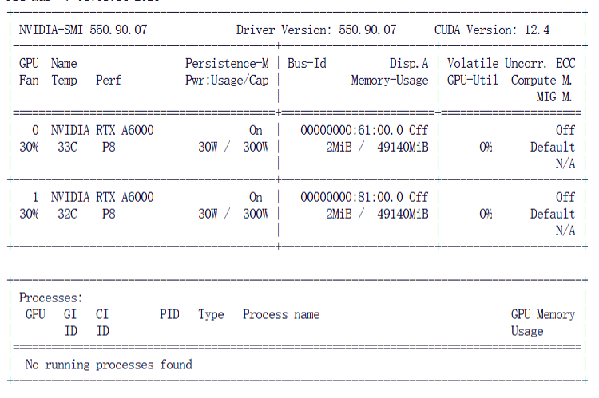

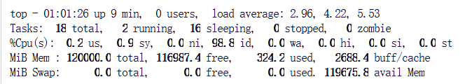


常见问题：

Q1：RuntimeError: CUDA error: invalid device ordinal

A1：因为指定了没有的CUDA，device那里设置错误，这里是因为服务器启动时设置了参数`--tp 8`，但实际上我只有两张卡，所以改为2即可


#### 2、benchmark

服务器启动常见参数：https://docs.sglang.ai/backend/server_arguments.html

基准测试相关：https://docs.sglang.ai/references/benchmark_and_profiling.html


测试API Server：

```
usage: bench_serving.py [-h] [--backend {sglang,sglang-native,sglang-oai,vllm,lmdeploy,trt,gserver,truss}] [--base-url BASE_URL] [--host HOST] [--port PORT]
                        [--dataset-name {sharegpt,random,generated-shared-prefix}] [--dataset-path DATASET_PATH] [--model MODEL] [--tokenizer TOKENIZER] [--num-prompts NUM_PROMPTS]
                        [--sharegpt-output-len SHAREGPT_OUTPUT_LEN] [--sharegpt-context-len SHAREGPT_CONTEXT_LEN] [--random-input-len RANDOM_INPUT_LEN] [--random-output-len RANDOM_OUTPUT_LEN]
                        [--random-range-ratio RANDOM_RANGE_RATIO] [--request-rate REQUEST_RATE] [--max-concurrency MAX_CONCURRENCY] [--output-file OUTPUT_FILE] [--disable-tqdm] [--disable-stream]
                        [--return-logprob] [--seed SEED] [--disable-ignore-eos] [--extra-request-body {"key1": "value1", "key2": "value2"}] [--apply-chat-template] [--profile] [--lora-name LORA_NAME]
                        [--prompt-suffix PROMPT_SUFFIX] [--pd-seperated] [--gsp-num-groups GSP_NUM_GROUPS] [--gsp-prompts-per-group GSP_PROMPTS_PER_GROUP] [--gsp-system-prompt-len GSP_SYSTEM_PROMPT_LEN]
                        [--gsp-question-len GSP_QUESTION_LEN] [--gsp-output-len GSP_OUTPUT_LEN]
```

```
python -m sglang.launch_server --model-path ./Qwen/Qwen2.5-72B-Instruct-GPTQ-Int4 --load-format dummy --tp 2 --disable-radix
 
python3 -m sglang.bench_serving --backend sglang --dataset-name sharegpt --dataset-path ShareGPT_V3_unfiltered_cleaned_split.json --num-prompt 1000 --request-rate 10 --host 127.0.0.1 --port 30000
```

测试结果：两张A6000利用率和显存已拉满

```
============ Serving Benchmark Result ============
Backend:                                 sglang    
Traffic request rate:                    10.0      
Max reqeuest concurrency:                not set   
Successful requests:                     1000      
Benchmark duration (s):                  619.25    
Total input tokens:                      302118    
Total generated tokens:                  195775    
Total generated tokens (retokenized):    195785    
Request throughput (req/s):              1.61      
Input token throughput (tok/s):          487.88    
Output token throughput (tok/s):         316.15    
Total token throughput (tok/s):          804.03    
Concurrency:                             492.06    
----------------End-to-End Latency----------------
Mean E2E Latency (ms):                   304707.80 
Median E2E Latency (ms):                 308827.73 
---------------Time to First Token----------------
Mean TTFT (ms):                          172371.83 
Median TTFT (ms):                        145852.25 
P99 TTFT (ms):                           396281.66 
---------------Inter-Token Latency----------------
Mean ITL (ms):                           679.43    
Median ITL (ms):                         394.89    
P95 ITL (ms):                            1673.45   
P99 ITL (ms):                            2490.47   
Max ITL (ms):                            103144.22 
==================================================
```


离线分析：

```
# 查看参数
python -m sglang.bench_offline_throughput -h
```

```
python -m sglang.bench_offline_throughput --model-path ./Qwen/Qwen2.5-72B-Instruct-GPTQ-Int4 --dataset-name sharegpt --dataset-path ShareGPT_V3_unfiltered_cleaned_split.json --num-prompt 1000 --tensor-parallel-size 2
```

测试结果：

```
====== Offline Throughput Benchmark Result =======
Backend:                                 engine    
Successful requests:                     1000      
Benchmark duration (s):                  622.93    
Total input tokens:                      302118    
Total generated tokens:                  195775    
Last generation throughput (tok/s):      27.27     
Request throughput (req/s):              1.61      
Input token throughput (tok/s):          484.99    
Output token throughput (tok/s):         314.28    
Total token throughput (tok/s):          799.27    
==================================================
```


 

### 二、LMDeploy

#### 1、环境配置

官方Github：https://github.com/InternLM/lmdeploy/blob/main/README_zh-CN.md

官方教程：https://lmdeploy.readthedocs.io/zh-cn/latest/get_started/installation.html


安装：

```
pip install lmdeploy
```


#### 2、benchmark

官方教程：https://lmdeploy.readthedocs.io/zh-cn/latest/benchmark/benchmark.html

```
git clone https://github.com/InternLM/lmdeploy.git
```


测试API Server：

```
lmdeploy serve api_server ./Qwen/Qwen2.5-72B-Instruct-GPTQ-Int4 --server-port 23333 --tp 2
```

```
python3 lmdeploy/benchmark/profile_restful_api.py --backend lmdeploy  --dataset-name sharegpt --dataset-path ShareGPT_V3_unfiltered_cleaned_split.json --num-prompt 1000 --request-rate 10
```

测试结果：

```
============ Serving Benchmark Result ============
Backend:                                 lmdeploy  
Traffic request rate:                    10.0      
Successful requests:                     1000      
Benchmark duration (s):                  479.52    
Total input tokens:                      224530    
Total generated tokens:                  193670    
Total generated tokens (retokenized):    194626    
Request throughput (req/s):              2.09      
Input token throughput (tok/s):          468.24    
Output token throughput (tok/s):         403.89    
----------------End-to-End Latency----------------
Mean E2E Latency (ms):                   192391.71 
Median E2E Latency (ms):                 189996.24 
---------------Time to First Token----------------
Mean TTFT (ms):                          139146.52 
Median TTFT (ms):                        135900.35 
P99 TTFT (ms):                           308954.79 
-----Time per Output Token (excl. 1st token)------
Mean TPOT (ms):                          346.50    
Median TPOT (ms):                        299.05    
P99 TPOT (ms):                           1593.03   
---------------Inter-token Latency----------------
Mean ITL (ms):                           275.07    
Median ITL (ms):                         166.47    
P99 ITL (ms):                            1081.47   
==================================================
```


测试推理引擎接口：

```
python3 lmdeploy/benchmark/profile_throughput.py --model-path ./Qwen/Qwen2.5-72B-Instruct-GPTQ-Int4 --dataset-name sharegpt --dataset-path ShareGPT_V3_unfiltered_cleaned_split.json --num-prompt 1000 --tensor-parallel-size 2
```

测试结果：报错，大概率因为github上的测试程序与当前下载的lmdeploy版本（pip下载的，而非源码编译的）不对应


# 其他测试


网上一些大佬的测试：重点关注其测试指标

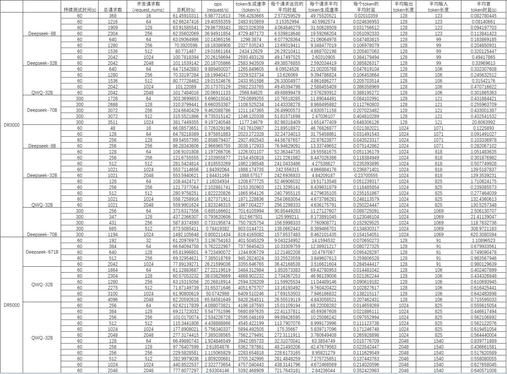


