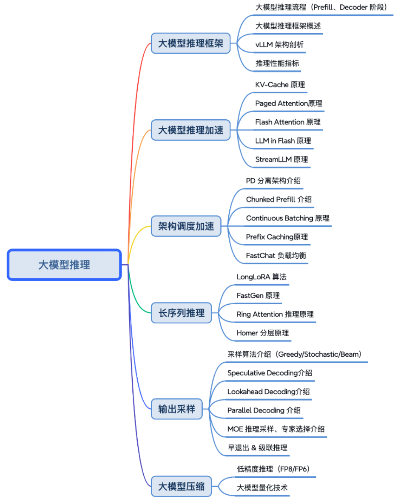

> 从最近的一些面经来看，主要问两个方面：vLLM核心技术 + vLLM推理加速方法

官方稳定版文档：https://docs.vllm.ai/en/stable/usage/index.html


TODO：

- [《Inside vLLM: Anatomy of a High-Throughput LLM Inference System》](https://mp.weixin.qq.com/s/NNLuVYjk_K8QqM9mXbxCPg)
  - 我们从基础的引擎核心（UniprocExecutor）开始，添加了诸如投机解码（speculative decoding）和前缀缓存（prefix caching）等高级功能。
  - 随后扩展到 MultiProcExecutor（TP/PP > 1），最终实现分布式扩展，将所有内容封装在异步引擎和分布式服务栈中：最后介绍了如何衡量系统性能。


# vLLM核心技术

参考一些综述：

- [Inside vLLM: Anatomy of a High-Throughput LLM Inference System](https://blog.vllm.ai/2025/09/05/anatomy-of-vllm.html)
- [ZOMI佬 - 大模型推理加速](https://infrasys-ai.github.io/aiinfra-docs/05Infer02InferSpeedUp/README.html)
- [AI Infra 学习会议](https://github.com/cr7258/ai-infra-learning/tree/main)

核心技术概述：

- 内存优化 Page Attention
- 连续批处理 Continuous Batching
- 内存池优化

参考架构图（来自ZOMI的AI Infra教程）：



## 1）推理加速

### KV Cache

> 为了解决Decode阶段的问题，产生了KV Cache的概念

概念：

- 原理讲解：https://www.bilibili.com/video/BV17CPkeEEzk
- 为什么没有 Q Cache？

KV Cache 瓶颈

- TODO


### FlashAttention

参考：

- [猛猿：图解大模型计算加速系列：FlashAttention V1，从硬件到计算逻辑](https://zhuanlan.zhihu.com/p/669926191)
- [猛猿：图解大模型计算加速系列：Flash Attention V2，从原理到并行计算](https://zhuanlan.zhihu.com/p/691067658)


### PageAttention

参考：

- [猛猿：图解大模型计算加速系列之：vLLM核心技术PagedAttention原理](https://zhuanlan.zhihu.com/p/691038809)


3Blue - Transformer及Attention：https://www.bilibili.com/video/BV1TZ421j7Ke


概念：

- **PagedAttention** 是一种优化 **注意力机制（Attention）** 的技术，特别用于 **大规模推理（inference）** 阶段，以提高内存利用率和计算效率。
- PagedAttention 的核心灵感来源于操作系统中的 **分页（paging）内存管理**：将大块的内存划分为**小页（pages）**，并用页表（Page Table）来动态管理访问和映射。

主要思路：

- **将 Key/Value 缓存拆分为固定大小的“页”（如大小为 1K Token）**。
- **使用页表结构来映射每个序列的实际上下文位置到对应的 K/V 页**。
- 推理时，不再为每个序列分配完整的大张量，而是通过页表动态引用多个共享或独立的页。


与 FlashAttention 的对比

| 特性             | PagedAttention       | FlashAttention                 |
| ---------------- | -------------------- | ------------------------------ |
| 目标阶段         | 推理阶段             | 训练 & 推理阶段                |
| 关注点           | 内存布局与缓存管理   | 注意力计算的内核加速           |
| 是否分页机制     | ✅ 是                 | ❌ 否                           |
| 是否避免重复复制 | ✅ 是                 | 部分                           |
| 使用方式         | 框架级管理（KV缓存） | 算子级优化（attention kernel） |


与普通Attention对比

| 比喻                 | 普通 Attention                  | PagedAttention              |
| -------------------- | ------------------------------- | --------------------------- |
| 💭 看前面的内容       | 每次都把整本作文重新翻一遍📖     | 只翻需要的几页📄             |
| 📚 作文越长怎么办     | 越来越慢，越来越累😩             | 没关系，只增加几页就行🙂     |
| 👥 多人一起写作文     | 每个人都要带一整本自己的作文📚📚📚 | 只带一张“页码表”+需要的页📑📑 |
| 🧠 占用的脑子（内存） | 很大，容易装不下                | 小而聪明，装得多            |
| 🚀 速度               | 慢                              | 快                          |


## 2）架构调度加速

### 1、分离式推理架构

参考：

- [猛猿：图解大模型计算加速系列：分离式推理架构1，从DistServe谈起](https://zhuanlan.zhihu.com/p/706761664)
- [猛猿：图解大模型计算加速系列：分离式推理架构2，模糊分离与合并边界的chunked-prefills](https://zhuanlan.zhihu.com/p/710165390)


#### Chunked-Prefills

**Chunked Prefills** 是一种用于加速 **长上下文输入**在大语言模型推理中的优化技术。它通过**将长输入（prompt）分块（chunk）处理**，以便更高效地填充 Key/Value 缓存，**节省显存、提高吞吐量**，尤其适用于多用户并发和大上下文窗口的场景。

做法：

1. **将输入 Prompt 分成多个小 chunk**（如每次处理 128 或 256 个 token）。
2. **分批处理这些 chunk**，每次只更新一部分 Key/Value 缓存。
3. **逐块执行前向传播**，逐步完成整个 prompt 的预填充过程。
4. 最后再进行正式的 token 生成阶段（decode）。


| 名字             | 它做了什么                     | 比喻                         |
| ---------------- | ------------------------------ | ---------------------------- |
| Chunked Prefills | 把长输入分段处理，慢慢存进脑子 | 搬书时分多次搬，不一次全拿   |
| 为什么要这样做？ | 避免太慢、太重或爆炸（OOM）    | 拿太多书会扭到腰，分批更安全 |
| 有什么好处？     | 快、省力，还能多个同学一起做   | 可以和同学同时搬更多的书 📚📚📚 |


#### Disaggregated Prefill

传说中的DP分离。**Disaggregated Prefill** 是一种在大语言模型推理阶段进行优化的方法，它将传统推理流程中一次性完成的 **“prefill + decode” 阶段进行解耦处理**，从而提高吞吐量、减少延迟，尤其适用于**多用户并发场景**和**长上下文输入**。


做法：**将 prefill 阶段和 decode 阶段进行解耦、分离（disaggregate）处理**

- **不同请求的 prefill 和 decode 可以并发执行**。
- 比如：
  - Request A 在 prefill
  - Request B、C 同时在 decode
- 这样就可以把计算资源合理切分，提高 **吞吐量（tokens/sec）** 和降低 **尾部延迟（P99 latency）**。


### 2、PrefixCaching

概念：**Prefix Caching（前缀缓存）** 是一种在大语言模型（LLM）推理阶段使用的 **加速技术**，主要用于处理带有 **静态前缀（prompt）** 的生成任务，比如 Chat、文档摘要、提示学习等。

核心思想：将输入中的“前缀部分”提前计算好，并 **缓存（cache）它的 Key 和 Value**，这样后续生成 token 时就不需要重复计算这部分内容。

| 名字           | 它做什么                         | 像什么举例                     |
| -------------- | -------------------------------- | ------------------------------ |
| Prefix Caching | 提前记住开头的内容，方便后面使用 | 把故事开头写在小纸条上方便翻看 |
| 为什么要用？   | 节省时间，写得快                 | 不用每次都重读开头的内容       |
| 哪些时候用？   | 开头不变，后面慢慢接着写的时候   | 老师给出题目，让你续写故事时   |


### 3、Speculative Decoding

**Speculative Decoding**（推测式解码）是一种用于 **加速大语言模型推理** 的方法，通过先让一个小模型快速“猜测”出一批 token，再用大模型验证这批 token 的有效性，从而减少大模型的推理次数，提高整体生成速度。


🎨 想象你在画图画故事：

你有个好朋友——

- 小画家 🧑‍🎨（画得快但不太准）
- 老画家 👨‍🎨（画得慢但很准）

你让他们帮你画漫画。

✏️ 你怎么安排工作？

1. 小画家先快速画出4格漫画的草图 ✏️
2. 老画家来检查 ✔️：
   - 如果前3格画得不错，就接受它们
   - 第4格不太像，那就从第4格开始重画
3. 这样你就不用老画家每一格都从头画啦！


## 3）vLLM解读

参考[猛猿 -【大模型推理/计算加速系列】](https://zhuanlan.zhihu.com/p/654910335)，涵盖如下内容：

- 图解vLLM v1系列：解读工作流程以及各个技术
- vLLM源码解读系列
- 其他：FlashAttention、分离式推理架构等


### 图解vLLM v1系列

> 参考：[图解Vllm V1系列1：整体流程](https://zhuanlan.zhihu.com/p/1900126076279160869)

Offline Batching（离线批处理）

- 首先观察架构图，主要有两部分process0为客户端，process1为EngineCoreProc，二者间基于ZMQ进行进程间的数据收发。

  ```
  1、vllm v1将请求的pre-process和输出结果的post-process与实际的推理过程拆分在2个不同的进程中(process0, process1)。
  2、Client负责请求的pre-process和输出结果的post-process，EngineCore负责实际的推理过程，不同进程间使用ZMQ来通信数据。
  ```

- 具体的流程：可以结合原文和架构图上标记的流程图来看，由`1、add req to`到`11、output until all reqs are finished`，猿姐写的太详细了。

Online Serving

- 首先观察架构图，与Offline Batching的区别仅在于Client中的部分细节
- 具体的流程：
  - 针对每一个req创建一个异步队列
  - 略


> 参考：[图解Vllm V1系列2：Executor-Workers架构](https://zhuanlan.zhihu.com/p/1900613601577899465)

Executor部分：

- 架构图里EngineCoreProc模块中管控模型分布式推理的核心部分
- Executor一共有4种类型，由配置参数--distributed-executor-backend决定，根据各自的适用场景进行选择：mp（单机多卡）、ray（多机多卡）、uni（单卡或Neuron环境）、external_launcher（想要用自定义的外部工具做分布式管理，如Slurm）

Executor -> Workers：

- 观察架构图：略

Executor与Worker间的数据传输机制，

- 重点关注`rpc_broadcast_mq`和`worker_response_mq`这两个输入输出队列

- 整体上说：

  - 当一个chunk过来时，我们会先检查它的大小：
    - 如果<=10MB，则装入shm对应的柜子中
    - 如果 > 10MB，则先在shm对应的柜子中记上一笔(buf[0]==1)，然后再通过zmq sokcet去send这份数据
    - 以上过程不在所提供的代码截图中，需要大家自行找相关代码阅读

  - 接着，我们会根据这个柜子的标志buf[0]是否为1，来检测对应的chunk是装在柜子里，还是通过zmq socket发送了。如果是前者，那么直接从shm读；如果是后者，那么就通过zmq socket做receive。

  - 最后，如果当前chunk是大数据，虽然它不会装在对应的柜子里，但我们也会认为这个柜子已经被使用过。这样后一个chunk来的时候，它不会使用当前的柜子，而是使用下一个可用的柜子。


> 参考：[图解Vllm V1系列3：KV Cache初始化](https://zhuanlan.zhihu.com/p/1900932850829730567)

TODO


### vLLM源码解读系列

TODO


# 推理加速方法

## 提速技巧

参考：

- [vLLM推理加速指南：7个技巧让QPS提升30-60%](https://mp.weixin.qq.com/s/opqOwiOkSZeCEksFmz0NIg)
- [vLLM 吞吐量优化实战：10个KV-Cache调优方法让tokens/sec翻倍](https://mp.weixin.qq.com/s/lwPf07KmLUmKyYOeusTX6g)


## 实战

看了些面经，似乎大多都是调参


# 快速上手

环境配置：

```bash
conda create -n vllm310 python=3.10 -y
conda activate vllm310
python -m pip install --upgrade pip
python -m pip install vllm
```

模型下载：

```bash
pip install -U huggingface_hub
echo 'export HF_ENDPOINT=https://hf-mirror.com' >> ~/.bashrc
source ~/.bashrc

conda activate vllm310
hf download Qwen/Qwen3-32B \
  --local-dir Qwen/Qwen3-32B
```

启动模型：

```bash
python -m vllm.entrypoints.openai.api_server   --host 0.0.0.0   --port 8007   --model Qwen/Qwen3-32B   --max-model-len 8000   --tensor-parallel-size 2   --gpu-memory-utilization 0.90   --swap-space 16   --disable-log-requests
```

测试：

```bash
curl --location 'http://0.0.0.0:8007/v1/chat/completions' \
  --header 'Content-Type: application/json' \
  --data '{
  "model": "Qwen/Qwen3-32B",
  "messages": [
    {
      "role": "user",
      "content": "简单解释一下量子计算"
    }
  ],
  "temperature": 0.2,
  "stream": true
}'
```
