>以目前双卡A6000的条件，仅能对1B左右模型进行RLHF，想要 70B 量级，可尝试 **QLoRA 4-bit**；**30B–40B** 以内可尝试 **LoRA 16-bit**；全量微调仅适合 **7B–13B** 左右的小模型。

TODO：对于大模型应用算法的需求

- ppo/grpo：懂初步原理
- dpo/kto等：必须懂，且实践，正式应用中不可或缺的一部分
- 微调：大量实践


# 基础概念

一些梳理

- [微调之后还能做什么？大模型后训练全链路技术解析](https://mp.weixin.qq.com/s/JNJjgFyl_WYPVISqQSRvZA)
- [如何在大模型基础上训练一个特定领域的专业模型](https://mp.weixin.qq.com/s/DAfrZVvDpLgKcgBHBN1gAA)
  - 💰 从零开始：一条高投入高回报的路
  - 🔧 持续预训练，更经济的再教育之路
  - ⚖️ 不同路线的资源投入对比
  - 🔢 一个亿的Token是什么概念？
  - 🧠 训练中的一个大问题，灾难性遗忘
  - 🛠️ 给重要参数上保护锁
  - 📚 课程学习与数据筛选
  - 🔬 一个具体的例子：FinPythia的训练过程

一些概念：

- [Datawhale - 大模型SFT 22条实践经验，干活效率翻倍！](https://mp.weixin.qq.com/s/XgAIsVQotlf5dfUlbn1t0w)


一般来说, 垂直领域的现状就是大家积累很多电子数据,从现实出发会把模型分成3个阶段:

1. 第一阶段:(Continue PreTraining)增量预训练，在海量领域文档数据上二次预训练GPT模型，以注入领域知识.
2. 第二阶段: SFT(Supervised Fine-tuning)有监督微调，构造指令微调数据集，在预训练模型基础上做指令精调，以对齐指令意图
3. 第三阶段 (1)RLHF(Reinforcement Learning from Human Feedback)基于人类反馈对语言模型进行强化学习，分为两步：RM(Reward Model)奖励模型建模，构造人类偏好排序数据集，训练奖励模型，用来建模人类偏好，主要是"HHH"原则，具体是"helpful, honest, harmless";RL(Reinforcement Learning)强化学习，用奖励模型来训练SFT模型，生成模型使用奖励或惩罚来更新其策略，以便生成更高质量、更符合人类偏好的文. DPO(Direct Preference Optimization)直接偏好优化方法，DPO通过直接优化语言模型来实现对其行为的精确控制，而无需使用复杂的强化学习，也可以有效学习到人类偏好，DPO相较于RLHF更容易实现且易于训练，效果更好


预训练、SFT、RLHF、DPO关系，简要概述：

```
           ┌───────┐
           │  预训练  │
           └───┬───┘
               │
         （模型不会聊天）
               ↓
       ┌────────────┐
       │   SFT（指令微调） │
       └────────────┘
               │
         （模型能聊天）
               ↓
     ┌──────────────────┐
     │ 偏好优化：DPO 或 RLHF │
     └──────────────────┘
               │
    （模型更安全、更礼貌、更稳定）

```


### CPT 与 SFT

增量训练（Continue PreTraining）与监督微调（Supervised Finetuning）的区别与联系：

1. 概念

- **增量训练（Continue Pre-training）**
  - 又叫继续预训练（CPT）。
  - 是在原有大规模无监督预训练模型的基础上，继续在新的无标注语料上进行语言建模训练（通常还是 **自回归预测下一个词** 或 **掩码预测**）。
  - 目的：让模型吸收新的知识（如最新新闻、专业领域文献），或者适应某个特定领域的语言风格。
- **监督微调（Supervised Fine-tuning, SFT）**
  - 在基础模型上，使用人工标注或高质量的指令-输出数据进行微调。
  - 训练目标从“预测下一个词”转变为“学习输入-输出的映射关系”。
  - 典型应用：ChatGPT 的对话能力就是通过 SFT 训练得到的。

------

2. 区别

| 维度     | 增量训练（CPT）                               | 监督微调（SFT）                               |
| -------- | --------------------------------------------- | --------------------------------------------- |
| 数据类型 | 无标注语料（如百科、代码、论文、领域语料）    | 有标注的输入-输出对（如问答、对话、任务演示） |
| 目标任务 | 保持原始预训练目标（语言建模/MLM/自回归预测） | 学习任务或指令映射关系                        |
| 作用     | 增强 **知识覆盖** 和 **领域适应性**           | 提升 **行为能力** 和 **任务完成度**           |
| 参数更新 | 通常全量参数更新，延续原训练过程              | 可全量更新或部分参数更新（LoRA/PEFT）         |
| 风险     | 可能遗忘通用知识（灾难性遗忘）                | 可能过拟合标注数据，失去开放泛化能力          |

------

3. 联系

1. **都基于预训练大模型**：两者都不是从零训练，而是在已有模型上进一步优化。
2. **常常组合使用**：
   - 先 **Continue Pre-training**：吸收领域知识（如法律、医疗、金融语料）。
   - 再 **Supervised Finetuning**：用标注的指令数据训练模型在该领域的任务中表现良好。
      → 例如：医疗大模型先用医学论文继续预训练，再用医生标注的病历问答对进行 SFT。
3. **都为对齐和应用打基础**：CPT 提供知识，SFT 提供能力，后续还可能加上 **RLHF/对齐训练** 来提升模型的交互质量。


### 微调算法

全参数微调（Full Fine-Tuning）

参数高效微调（PEFT）

- LoRA：PEFT 的基石技术
  - 在注意力权重矩阵上加上低秩分解矩阵，只训练低秩参数。
  - 是当前最流行的微调方法之一（应用在 LLaMA、ChatGLM 等）。
- QLoRA：更极致的效率
- Adapter 系列
  - Adapter：在 Transformer 层之间插入小型瓶颈网络，只训练 Adapter 参数。
  - AdapterFusion / Compacter / Prefix-Tuning + Adapter 等变体。
- Prefix-Tuning / Prompt-Tuning
  - Prompt-Tuning：直接在输入前添加可训练的 embedding，冻结模型参数。
  - Prefix-Tuning：在 Transformer 每层注入“可训练前缀向量”，比 Prompt-Tuning更强大。
- P-Tuning / P-Tuning v2
  - 结合 Prompt-Tuning 和 Prefix-Tuning，尤其在中文任务上应用广泛。
- BitFit
  - 只更新模型中的偏置参数（bias），非常轻量。
- IA³ (Infused Adapter by Inhibiting and Amplifying Inner Activations)
  - 通过缩放因子调节中间激活值，只训练少量缩放参数。

新兴技术展望：Mamba 与 L-Mul

其他相关策略

- 混合方法：如 LoRA + Prefix-Tuning。
- 指令微调（Instruction Tuning）：让模型学习遵循人类指令。
- RLHF（Reinforcement Learning with Human Feedback）：在微调后进一步通过人类偏好优化。


补充：

- 什么是参数选择方法微调：[大模型高效微调系列-参数选择方法微调](https://mp.weixin.qq.com/s/OHLaBypvmOHNvk0W9iJKsQ)
- 参数微调与指令微调是两种东西？参数微调是训练机制，指令微调是数据类型；它们是不同维度的概念，但经常联合使用


### RL算法

TODO


#### GRPO与PPO对比

Q：请对比PPO和GRPO算法原理

A：先介绍算法原理

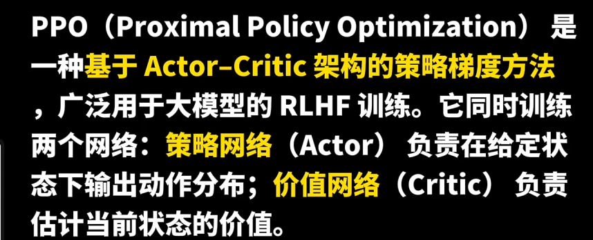

PPO在训练时训练两个模型：策略网络与价值网络

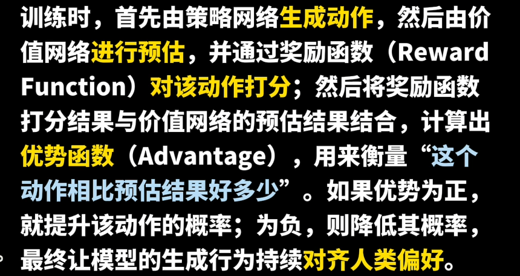

GRPO原理：PPO中的价值网络不好训练，二GRPO舍弃了它

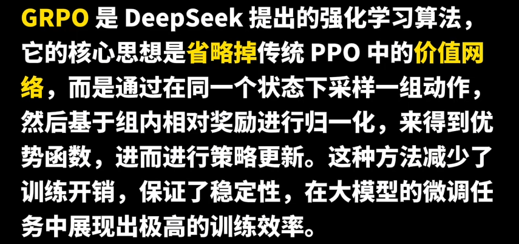

Q：为什么越来越多模型选择GRPO而非PPO？


Q：GRPO相比PPO的风险

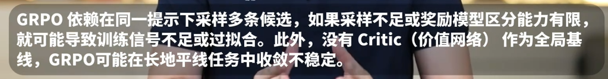

Q：在工程上，GRPo的组大小k值应该如何选择？

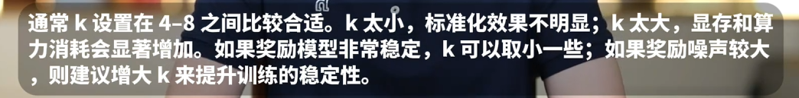


#### GSPO算法

Q：Qwen3最近提出的GSPO算法原理是什么？

A：关于GSPO的基础算法原理介绍：略

算法优势：

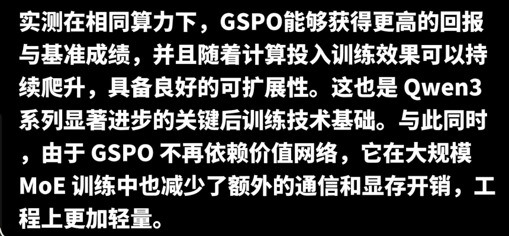


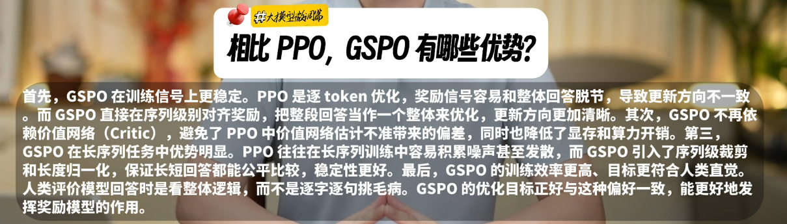


### 多模态相关

Q：如何进行多模态微调

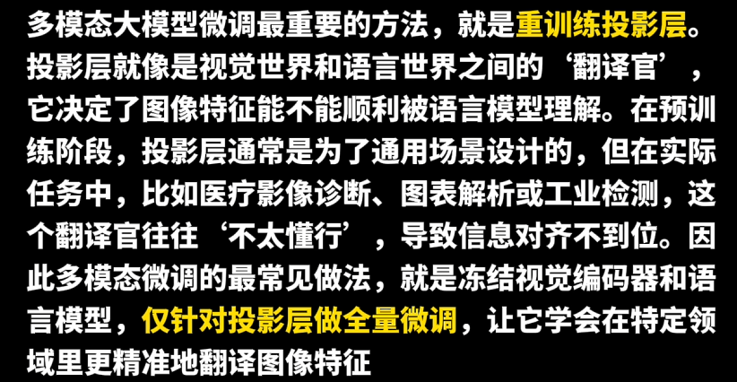

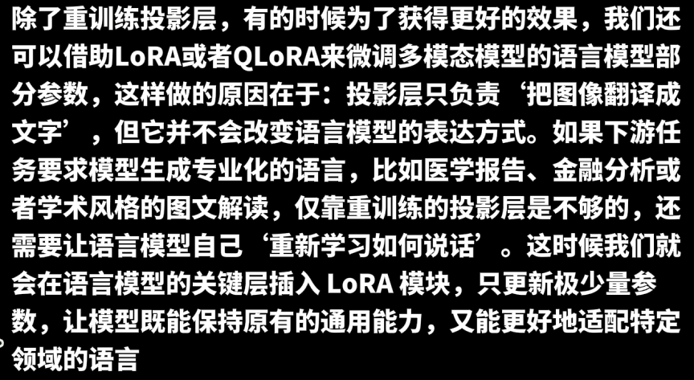


Q：在实际工程中，多模态微调的数据应该如何准备

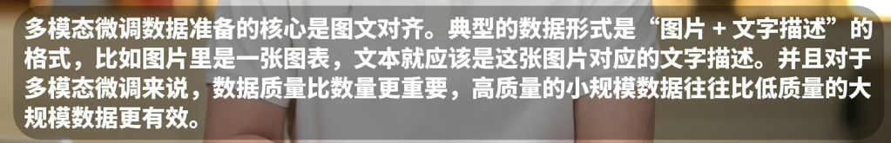


Q：多模态微调的典型应用场景有哪些？

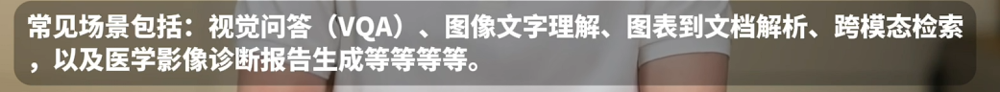


Q：为什么多模态微调比单模态更难？

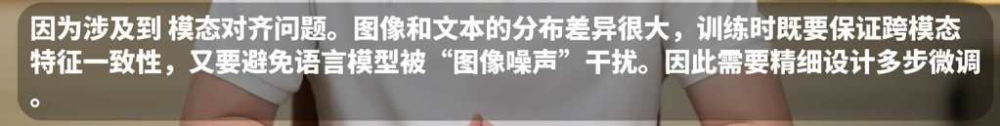


### 提高Agent性能

Q：如何通过微调提升Agent性能？

A：当下，Claude Code等相关Agent均涉及微调，需要强调的是多工具并行调用数据集和多步调用数据集的创建

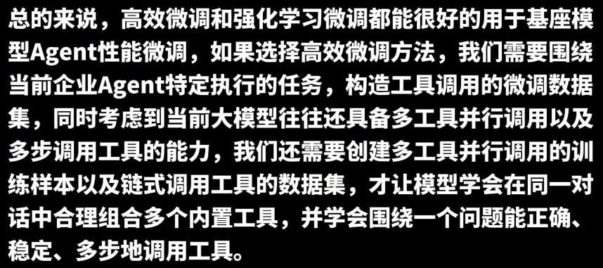

微调外还要介绍一下强化学习

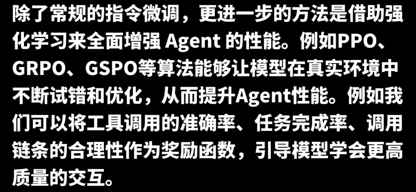

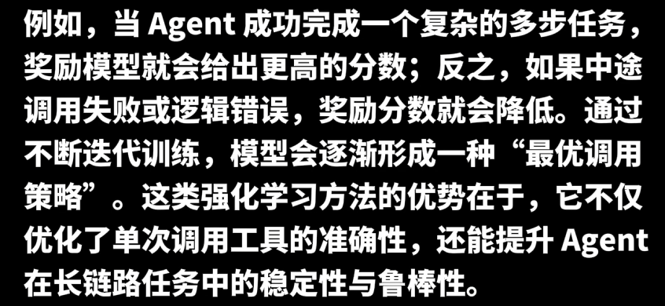


# 框架选择

微调常用框架：

- [unsloth](https://github.com/unslothai/unsloth)：推理、微调一体式框架，借极致的速度和显存优化成为资源受限场景下的"神器"，此外可基于wandb记录数据
- SWIFT：一个轻量级、可扩展的微调基础设施，集成微调、推理、评估、量化等功能，被认为支持最广泛的模型种类
- LLaMA-Factory：以一站式、低代码解决方案成为个人开发者的首选
- DeepSpeed：对于超大规模模型训练，DeepSpeed则是无可争议的工业标准
- Hugging Face PEFT：提供LoRA、Prefix Tuning等PEFT方法的标准化实现，与transformers库无缝集成
- 等等

RLHF：字节的verl，基本所有LLM的RL都是PPO魔改的


Q：各个框架的对比

A1：根据文献环境与社区使用反馈，截至 2025 年，目前业界认可度较高的 SFT 框架包括：

- **Axolotl / Unsloth / Torchtune**：因其成熟度高、易上手、灵活性强，是社区中常见的选择 [Modal](https://modal.com/blog/fine-tuning-llms?utm_source=chatgpt.com)[Spheron Blog](https://blog.spheron.network/comparing-llm-fine-tuning-frameworks-axolotl-unsloth-and-torchtune-in-2025?utm_source=chatgpt.com)。
- **[SWIFT](https://github.com/modelscope/ms-swift)**：支持性广泛，被认为是目前开源中覆盖模型最多的微调基础设施 [arXiv](https://arxiv.org/abs/2408.05517?utm_source=chatgpt.com)。
- **LMFlow**：面向科研与轻量应用，功能覆盖全面，是研究和开发中广泛测试的工具之一 [arXiv](https://arxiv.org/abs/2306.12420?utm_source=chatgpt.com)。
- **LMTuner**：由于其可用性好、支持大模型微调，越来越受开发者欢迎 [arXiv](https://arxiv.org/abs/2308.10252?utm_source=chatgpt.com)。

此外，针对工业级场景或特定模型架构的需求，也可考虑 **Amazon SageMaker 自驱动 SFT 框架** 和 **pipeling-sft（针对 MoE）**，其在专业领域有显著应用价值 [Amazon Web Services, Inc.](https://aws.amazon.com/blogs/machine-learning/llm-continuous-self-instruct-fine-tuning-framework-powered-by-a-compound-ai-system-on-amazon-sagemaker/?utm_source=chatgpt.com)[Character.AI Blog](https://blog.character.ai/character-ai-open-sources-pipeling-sft-a-scalable-framework-for-fine-tuning-moe-llms-like-deepseek-v3/?utm_source=chatgpt.com)。


A2：框架特性详细对比

| 特性         |         [PEFT](https://github.com/huggingface/peft)          |  [LLaMA-Factory](https://github.com/hiyouga/LLaMA-Factory)  |    [Unsloth](https://github.com/unslothai/unsloth)     |   [DeepSpeed](https://github.com/deepspeedai/DeepSpeed)    |
| :----------- | :----------------------------------------------------------: | :---------------------------------------------------------: | :----------------------------------------------------: | :--------------------------------------------------------: |
| 上手难度     |                              ⭐⭐                              |                             ⭐⭐                              |                           ⭐⭐                           |                            ⭐⭐⭐⭐                            |
| 显存优化     |                          LoRA/QLoRA                          |                         LoRA/QLoRA                          |                   4bit QLoRA极限优化                   |                       ZeRO / 3D并行                        |
| 分布式支持   |                         需集成外部库                         |                          基本支持                           |                      开源版不支持                      |                       ✔️ (主打分布式)                       |
| 适配模型规模 |                           中小模型                           |                           中模型                            |                        中小模型                        |                          超大模型                          |
| 代表优势     |                   （学术开发）稳定，兼容广                   |                  （个人开发）中文社区活跃                   |               （资源受限）极致快、省资源               |                 （企业级）科研级大模型训练                 |
| 简介         | 提供LoRA、Prefix Tuning等PEFT方法的标准化实现，与transformers库无缝集成 | 提供配置文件驱动和WebUI，降低微调技术门槛，特别适合中文场景 | 通过Triton内核优化，实现2-5倍训练速度提升和80%显存节省 | 微软开发的深度学习优化库，通过ZeRO技术支持千亿参数模型训练 |
| GitHub Stars |                            19.4k                             |                            56.8k                            |                         44.7k                          |                           39.9k                            |

总结

- LLaMA-Factory - 个人开发者首选
- Unsloth - 性能优化新星
- DeepSpeed - 超大模型标配


A3：概述

- Hugging Face PEFT：模块化基石与标准库
- LLaMA-Factory：一站式微调平台
- Axolotl：兼具易用性与精细控制的开发者利器
- Unsloth：极致速度与效率的单机王者
- Torchtune：PyTorch 官方原生库的纯粹选择

关键指标对比：


基于上述分析，可以针对不同的应用场景和用户需求给出以下选择建议：

- **场景一：面向初学者或快速原型开发**

  - **推荐框架：** **Axolotl**。Axolotl在易用性和功能之间取得了绝佳平衡 。通过一个简单的YAML文件配置，即可快速启动微调，同时支持各种主流的优化技术，是学习和快速尝试的首选。  

- **场景二：面向资源有限的个人或小型团队**

  - **推荐框架：** **Unsloth**。Unsloth在单GPU上的极致性能是其核心优势 。对于使用消费级显卡（如Google Colab上的T4）的用户而言，Unsloth的效率提升能显著缩短实验周期，让更多人能够参与到大模型微调中。  

- **场景三：面向需要图形化界面和全面功能的组织**

  - **推荐框架：** **LLaMA-Factory**。其Web UI和一站式功能显著降低了非技术人员或工程团队的微调门槛，特别是其对企业级稳定性和安全性的强调，使其成为商业落地的理想选择 。  

- **场景四：面向需要高度定制和底层控制的研究人员**

  - **推荐框架：** **Torchtune**。Torchtune的纯粹PyTorch设计理念，使其代码库高度透明和模块化 。对于需要深入研究微调算法、修改训练流程或与特定PyTorch库无缝集成的专家而言，Torchtune提供了无与伦比的灵活性。  

    

# 数据准备

> 参考：[九天 - 零基础微调数据集准备教程 - 提升Agent能力](https://www.bilibili.com/video/BV159arzgEqY)

一些基础概念和微调流程。


> 参考：[详解大模型：指令微调训练全流程指导](https://mp.weixin.qq.com/s/TPtFI_Y7eUdTcFMHqI0BFw)

引出了三种数据构建方法：

- 手动构建
- 现有数据集转换
- 自动构建：最具代表性的工作就是 Self-Instruct（四步：种下种子、判断任务类型、补齐输入和输出、质量过滤），整个过程是一个“循环迭代”的过程，可以理解成：人类给模型一点点“种子”，然后模型自己不断长出更多的数据。


### 一些概念

#### 数据飞轮

>“业务数据飞轮”就是把 **业务场景使用 → 数据沉淀 → 模型优化 → 提升业务 → 更多使用** 变成一个循环

“**业务数据飞轮**” 通常指的是 **通过业务应用产生的数据不断反哺 AI 模型，从而提升模型能力，再推动业务产生更多数据的正向循环**。

可以拆解为三步理解：

1. **业务驱动数据积累**
   - 在企业内落地 AI Coding 工具（如代码自动补全、智能审查、自动测试生成），开发者在真实业务中使用它们。
   - 使用过程中会产生 **大量上下文数据**（代码片段、调用链、Bug 修复、最佳实践、性能指标等）。
2. **数据驱动模型迭代**
   - 这些业务数据经过清洗、标注和抽象后，可用来 **微调或对齐 AI 模型**，让模型更贴合企业特定的业务逻辑、架构和技术栈。
   - 模型越懂业务，给出的建议/代码越准确，越能减少人工修正。
3. **模型提升推动业务增长**
   - 模型能力提升后，AI 工具能更高效地辅助开发，带来 **更快交付、更高质量的代码和更低的人力成本**。
   - 这又会吸引更多开发者使用，进一步积累新的业务数据，形成 **正反馈的飞轮效应**。


#### 如何准备专业领域微调数据集

Q：如何准备专业领域微调数据集

A：不单单准备问答对就行了，主要分两个阶段：数据处理、数据验证与优化

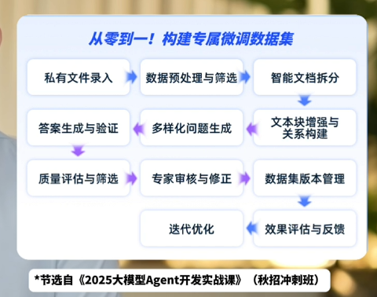

数据处理阶段：

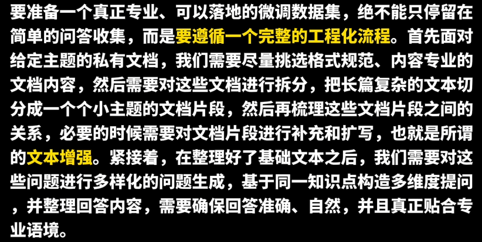

数据验证与优化阶段：

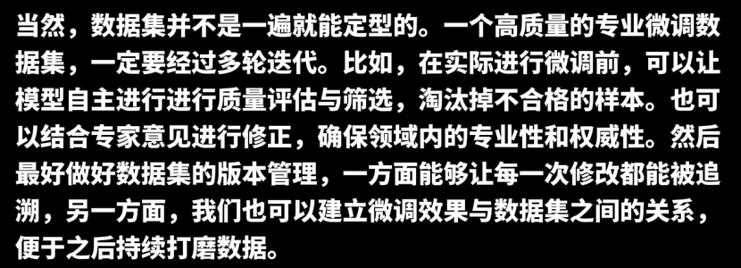


Q：微调往往需要准备多少条数据呢？

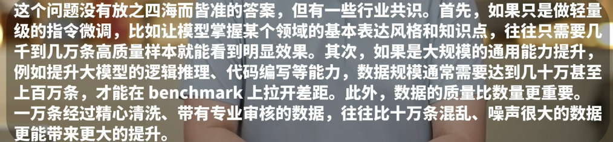


Q：工业环境下微调数据集应该如何创建？


Q：强化学习微调需要如何准备数据集呢？

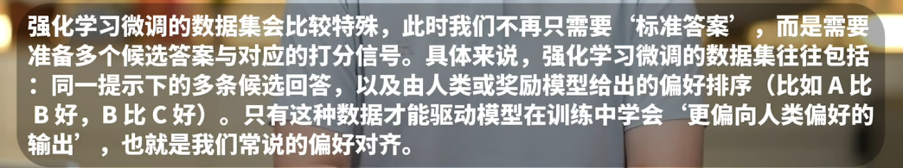


数据集格式多样：

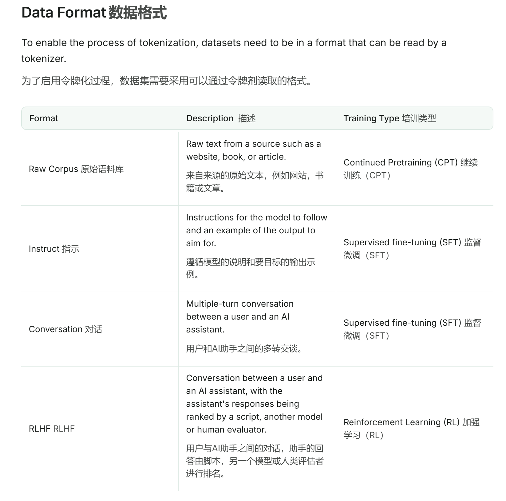

### 其他

> 参考：[PyTorch推理扩展实战：用Ray Data轻松实现多机多卡并行](https://mp.weixin.qq.com/s/egX7HETElJxuov9z2ZRERw)

图片数量从几张变成几万张、几百万张，情况完全不一样了。

内存撑不住，不可能把所有图一股脑塞进去；GPU 利用率上不去，多卡场景下吞吐量优化是个棘手的问题；万一跑到一半挂了怎么办？分布式部署能不能用上集群资源？还有个容易被忽视的点：数据加载的 I/O 往往才是真正的瓶颈。

自己从头写一套健壮的 pipeline 处理这些问题，少说得折腾好几天。

Ray Data 是个分布式数据处理框架，跟 PyTorch 配合得很好。关键是改造成本极低，原有代码基本不用大动。


# 模型训练

## 多机微调

Q：如何进行多机多卡微调？

A：对显卡带宽和网络要求很高

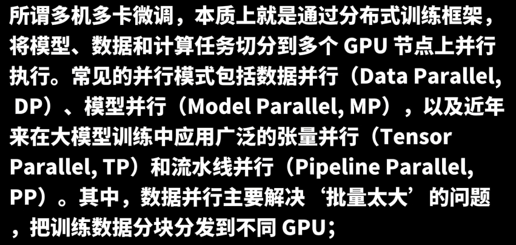

不同并行方案各自是什么意思：略

如何使并行更稳定：
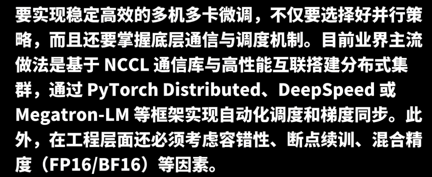


Q：通信带宽不足会带来哪些影响？

A：这是一个偏实践的问题


Q：如何应对单节点故障？

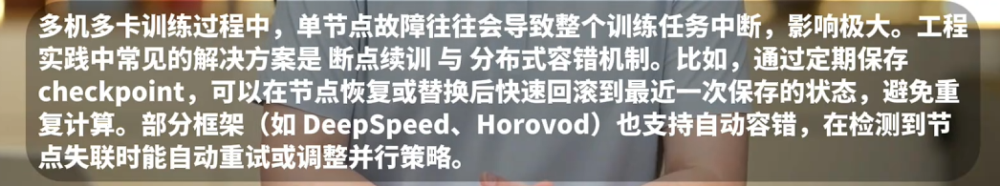


Q：在多机多卡微调中，为什么要使用ZeRO优化器？

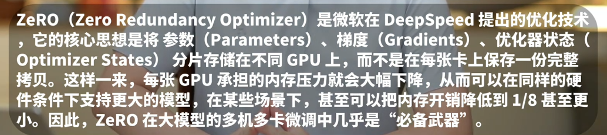


## 分析 Loss 曲线

> 面试全答反了。。。。。

Lr 与 batch size 调节关系：

#### 1、总结

概述：

- batch_size 决定梯度噪声规模，学习率决定每步移动幅度
- 大 batch → 大 LR，但必须配合 warmup，且存在上限

口诀版：

- 想学得快 → 提 LR
-  想学得稳 → 提 batch
-  想泛化好 → 控 LR + 控 batch

抽象版：该怎么理解 Lr 与 batch size 的含义以及调整逻辑？

- Learning Rate（LR）= **你每一步迈多大**

  - 步子大 → 走得快，但容易摔
  - 步子小 → 走得稳，但慢

- batch_size = **你一次看多少路况**

  - 看得多 → 判断方向更准
  - 看得少 → 判断方向有噪声（但可能发现小路，更好泛化）

- 为什么 **batch 大了，LR 也要变？**

  - 情况 A：你看得很清楚（大 batch）

    - 方向很准，如果你还 **小碎步**，会发生什么？👉 **你知道方向，但走得太慢**
    - 方向越准（batch 大），步子可以迈大（LR 大）

  - 情况 B：你看得很模糊（小 batch）

    - 方向本来就有点乱，如果你还 **迈大步**会发生什么？👉 **直接摔下悬崖（loss 爆炸）**

    - 方向越不准（batch 小），步子要小（LR 小）

| 你看到的现象     | 山上的你     | 调什么          |
| ---------------- | ------------ | --------------- |
| train & val 都高 | 磨蹭下不去   | ↑ LR            |
| loss 震荡        | 瞎跑         | ↓ LR            |
| train 低，val 高 | 掉进小坑     | ↓ LR / ↑ batch  |
| 收敛慢但稳       | 看太远走太小 | ↑ LR 或 ↓ batch |


#### 2、示例场景

| 曲线特征             | 结论     | 调整         |
| -------------------- | -------- | ------------ |
| train ≈ val 且都高   | 欠拟合   | ↑LR / ↓batch |
| train ↓ 快，val 不降 | 表达不足 | ↑LR / 模型   |
| train ↓，val ↑       | 过拟合   | ↓LR / ↑batch |
| 两者抖动             | 不稳定   | ↓LR / ↑batch |

1）理想训练状态

- 示例图：train_loss ↓ val_loss ↓ 二者 gap 小且稳定

  ```
  loss
  │\
  │ \
  │  \
  │   \____ train_loss
  │        \
  │         \___ val_loss
  └────────────────── step
  ```

2）欠拟合（Underfitting）

- 示例图：train_loss 高，val_loss 高，二者接近，下降慢或停滞

  ```
  loss
  │\
  │ \
  │  \
  │   \_____ train_loss
  │
  │   \_____ val_loss
  └──────────────── step
  ```

- 本质：模型学不会 / 学得太慢

- 常见原因（与 LR / batch 强相关）：

  - LR 太小：每步更新太弱
  - batch_size 太大：梯度太平滑，探索不足
  - 正则太强：WD / dropout 抑制学习
  - 训练步数不够：尚未收敛

-  调参建议（优先级排序）

  - **增大学习率**，或拉长 warmup 后提高 peak LR

    ```
    1e-5 → 3e-5 → 1e-4
    ```

  - **减小 batch_size**：增加梯度噪声，有助于跳出平坦区

    ```
    batch: 1024 → 256
    ```

- 🚫 不要先做的事

  - 不要一上来加模型规模
  - 不要盲目延长训练（如果 loss 几乎不降）

3）过拟合（Overfitting）

-  loss 曲线经典形态：train_loss 持续下降、val_loss 先降后升、gap 不断扩大

  ```
  loss
  │\
  │ \
  │  \
  │   \_____ train_loss
  │          \
  │           /‾‾‾ val_loss
  └──────────────── step
  ```

- 本质：模型记住训练集，泛化失败

- 与 LR / batch_size 的关系：

  - LR 太小，容易陷入 sharp minima
  - batch_size 太小，噪声过大，记忆样本
  - batch_size 太大，泛化差（另一种过拟合）

- 注意：**小 batch ≠ 一定泛化好**，极小 batch + 小 LR = “记忆机”

- 调参策略（从易到难）：

  - 降低学习率：降低参数对单一样本的过拟合，尤其适用于 finetune
  - 增大 batch_size：减少梯度噪声，更接近总体分布
  - 提前停止（Early Stopping）：在 val_loss 最低点停是最“工程友好”的方式

4）训练不稳定（Loss 震荡 / spike）

- loss曲线经典形态：或者是loss 突然飙升，以及nan / inf

  ```
  loss
  │\/\_/\/\__ train_loss
  │\/\_/\/\__ val_loss
  └──────────────── step
  ```

- 原因判断：

  - train & val 同时抖：LR 太大
  - 前期抖，后期稳：warmup 不够
  - val 抖 > train：batch 太小

- 调整方案：

  - 降 LR：LR × 0.5 或 × 0.3
  - 延长 warmup：500 → 2000 steps
  - 增大 batch 或用 grad accumulation

  


# 效果评估

Q：如何评估大模型微调效果？

A：人工评估与自动化评估两条路


人工评估也有些受限，关于数据集驱动评估：

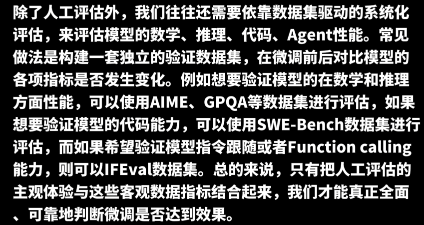


Q：在人工评估微调数据集结果的过程中，如何尽量避免偏差？

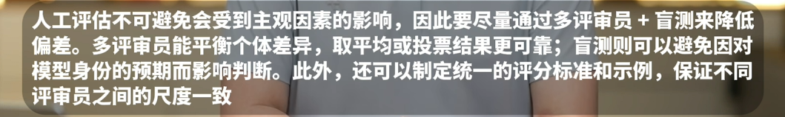


Q：如何构建用于评估微调效果的验证集或者测试集？

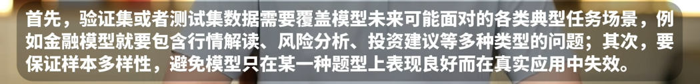


Q：通常有哪些工具可以用于快速构建模型评估数据集？

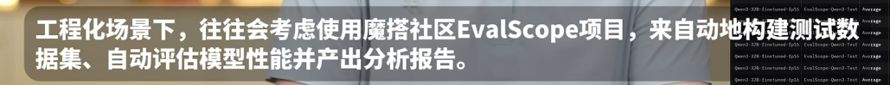


# 实战经验

> 参考：[214页内部秘籍《Smol训练手册：构建世界级LLMs的秘诀》](https://mp.weixin.qq.com/s/l1bb4FrWm4NlHOS4bgNCXA)

2025.10.31，Hugging Face 发布了一份 214 页的内部秘籍[《Smol训练手册：构建世界级 LLMs 的秘诀》](https://huggingface.co/spaces/HuggingFaceTB/smol-training-playbook#introduction)，系统的讲述了训练顶尖语言模型过程中所面临挑战、关键决策及复杂的现实情况，一天就获得了 655.4K 次的浏览。

