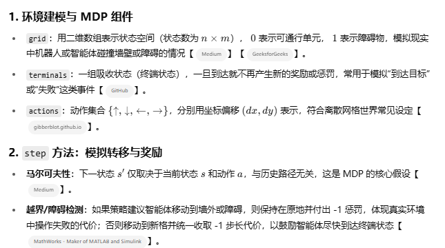
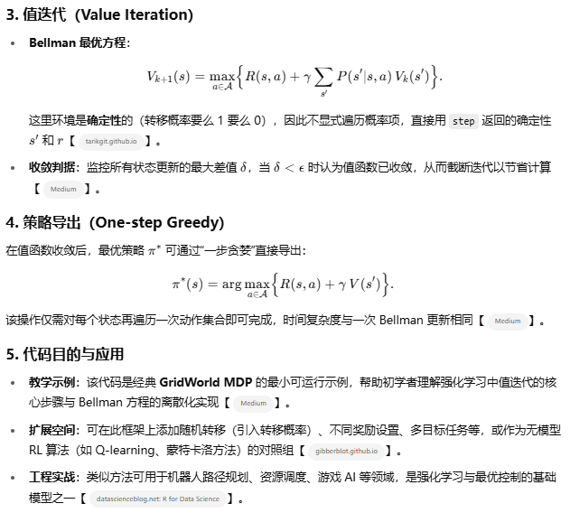

参考资料：

- https://datawhalechina.github.io/joyrl-book/#/

强化学习（Reinforcement Learning, RL）是机器学习的三大范式之一，通过智能体（Agent）与环境（Environment）的反复交互，以试错（trial-and-error）的方式学习最优策略，从而最大化长期累积奖励（cumulative reward）。

其核心目标是解决序列决策问题：在每一步，根据当前状态选择动作，环境反馈即时奖励，并进入下一个状态，智能体据此不断更新策略。

强化学习方法可分为基于模型（Model-based）与无模型（Model-free）两大类，其中

- 模型无关算法中又可细分为基于值的方法（Value-based，如Q-Learning、SARSA、DQN）、基于策略的方法（Policy-based，如策略梯度、PPO）以及演员-评论员方法（Actor–Critic，如DDPG）；
- 模型有关算法则在学习过程中显式地构造或估计环境模型以辅助规划与决策


ToDo：

- https://mp.weixin.qq.com/s/TOTza-CEhG7vYrBBtURldw


# 第一章 绪论

描述了强化学习的各个方向

强掉了传统RL教程侧重公式与理论，当前教程侧重经验与实践


# 第二章 MDP

>  **马尔可夫决策过程**是强化学习的基本问题模型之一，它能够以数学的形式来描述智能体在与环境交互的过程中学到一个目标的过程

## 基础概念

主要内容：

- 决策过程
- 性质
- 汇报
- 状态转移矩阵


示例代码：

```
import numpy as np


class GridWorld:
    def __init__(self, grid, terminals, gamma=0.9):
        """
        参数：
          grid:   二维 NumPy 数组，0 表示可通行，1 表示障碍物
          terminals: 集合形式的终端状态坐标，如 {(0,3), (3,3)}
          gamma:  折扣因子 γ，衡量未来奖励的重要性
        """
        self.grid = grid  # 环境地图
        self.terminals = terminals  # 终止状态集合
        self.gamma = gamma  # 折扣因子 γ
        self.n, self.m = grid.shape  # 网格的行数和列数
        # 动作集合：上、下、左、右，用 (dx,dy) 表示
        self.actions = [(-1, 0), (1, 0), (0, -1), (0, 1)]

    def in_bounds(self, x, y):
        """判断坐标 (x,y) 是否在网格范围内"""
        return 0 <= x < self.n and 0 <= y < self.m

    def step(self, state, action):
        """
        给定当前状态 state 和动作 action，返回 (下一个状态, 即时奖励)
        - 如果当前 state 为终端状态，则保持不变，奖励为 0
        - 如果下一个位置越界或为障碍，则撞墙，保留原地，并给 -1 惩罚
        - 否则移动到新位置，代价为 -1
        """
        if state in self.terminals:
            # 终端状态不可再移动，且不再产生奖励或惩罚
            return state, 0

        x, y = state
        dx, dy = action
        nx, ny = x + dx, y + dy

        # 越界或障碍 => 撞墙惩罚
        if not self.in_bounds(nx, ny) or self.grid[nx, ny] == 1:
            return state, -1

        # 正常移动，固定代价
        return (nx, ny), -1

    def value_iteration(self, iterations=100, epsilon=1e-4):
        """
        值迭代算法核心：
        - 输入：最大迭代次数 iterations，收敛阈值 epsilon
        - 输出：最优状态值函数 V，以及对应的最优策略 policy

        算法步骤：
        1. 初始化 V(s)=0
        2. 重复直到收敛或达到最大迭代次数：
           - 对于每个非终端状态 s，计算
             V_new(s) = max_a [ R(s,a) + γ * V(old)(s') ]
           - 跟踪最大更新幅度 delta
           - 如果 delta < epsilon，则提前停止
        3. 最后根据收敛后的 V，执行一次“一步贪婪”以导出最优策略
        """
        # 1. V 初始化为 0
        V = np.zeros((self.n, self.m))
        for _ in range(iterations):
            delta = 0
            # 2. 对每个状态执行 Bellman 最优更新
            for i in range(self.n):
                for j in range(self.m):
                    s = (i, j)
                    if s in self.terminals:
                        # 终端状态的值函数固定为 0
                        continue
                    # 记录针对所有动作的候选 Q 值
                    q_values = []
                    for a in self.actions:
                        (nx, ny), r = self.step(s, a)
                        # Bellman 更新：即时奖励 + γ * V(next_state)
                        q_values.append(r + self.gamma * V[nx, ny])
                    v_new = max(q_values)  # 选取最大 Q 值
                    delta = max(delta, abs(v_new - V[i, j]))
                    V[i, j] = v_new  # 更新 V(s)
            if delta < epsilon:
                # 收敛：最大更新幅度低于阈值
                break

        # 3. 根据最终的 V 导出“一步贪婪”最优策略
        policy = np.full((self.n, self.m), None)  # 初始化策略表
        for i in range(self.n):
            for j in range(self.m):
                s = (i, j)
                if s in self.terminals:
                    continue
                q_values = []
                for a in self.actions:
                    (nx, ny), r = self.step(s, a)
                    q_values.append(r + self.gamma * V[nx, ny])
                # 对所有动作取最大 Q 值对应的动作
                best_action = self.actions[np.argmax(q_values)]
                policy[i, j] = best_action

        return V, policy  # 返回值函数与策略


if __name__ == "__main__":
    grid = np.zeros((4, 4))  # 4×4 全开放网格
    terminals = {(0, 3), (3, 3)}  # 右上和右下为终端
    env = GridWorld(grid, terminals)  # 实例化环境
    V_opt, pi_opt = env.value_iteration()  # 执行值迭代
    print("最优状态值函数：\n", V_opt)
    print("最优策略：\n", pi_opt)

```

示例输出：

```
最优状态值函数：
 [[-2.71  -1.9   -1.     0.   ]
 [-3.439 -2.71  -1.9   -1.   ]
 [-3.439 -2.71  -1.9   -1.   ]
 [-2.71  -1.9   -1.     0.   ]]
最优策略：
 [[(0, 1) (0, 1) (0, 1) None]
 [(-1, 0) (-1, 0) (-1, 0) (-1, 0)]
 [(1, 0) (1, 0) (1, 0) (1, 0)]
 [(0, 1) (0, 1) (0, 1) None]]
```






## Q&A

Q：强化学习所解决的问题一定要严格满足马尔可夫性质吗？请举例说明。

A：**强化学习不必严格满足马尔可夫性**：理论上 RL 多假设环境为 MDP 以保证收敛性，但现实中常用 POMDP 或引入记忆机制（如 RNN）来处理部分可观测场景，如机器人视觉导航、扑克游戏等


Q：马尔可夫决策过程主要包含哪些要素？

A：**MDP 五要素**：状态集、动作集、转移概率、奖励函数与折扣因子


Q：马尔可夫决策过程与金融科学中的马尔可夫链有什么区别与联系？

A：**MDP 与金融中的马尔可夫链**：马尔可夫链是仅含状态与转移概率的无决策模型，MDP 在此基础上加入决策（动作）与回报（奖励）；在金融中，前者常用于信用评级转移、市场趋势预测，后者可用于组合优化和算法交易


# 第三章 动态规划

在经典的算法设计中，**动态规划（Dynamic Programming，DP）**是一种将复杂问题分解为更小子问题并保存其解的数学优化方法与算法范式。它适用于同时具备“重叠子问题”（overlapping subproblems）和“最优子结构”（optimal substructure）这两大性质的问题，通过记忆化（自顶向下）或自底向上（Tabulation）方式，避免了重复计算，从而将时间复杂度从指数级大幅降低到多项式级别。下面将简要介绍其核心概念、关键性质，并通过斐波那契数列示例给出 Python 代码实现。


# 第四章 免模型预测

 本章开始介绍常见的两种免模型预测方法，**蒙特卡洛方法**（ Monte Carlo，MC ）和**时序差分方法**（temporal-difference，TD）。


在讲解这两个方法之前，我们需要铺垫一些重要的概念，有模型（model based）与免模型（model free），预测（predicton）与控制（control）。

- 在前面的章节中，我们其实默认了一个事实，即状态转移概率是已知的，这种情况下使用的算法称之为**有模型算法**，例如动态规划算法。
- 但大部分情况下对于智能体来说，环境是未知的，这种情况下的算法就称之为**免模型算法**，目前很多经典的强化学习算法都是免模型的。
-  前面提到很多经典的强化学习算法都是免模型的，换句话说在这种情况下环境的状态转移概率是未知的，这种情况下会去近似环境的状态价值函数，这其实跟状态转移概率是等价的，我们把这个过程称为**预测**。换句话说，预测的主要目的是估计或计算环境中的某种期望值
- 而控制的目标则是找到一个最优策略，该策略可以最大化期望的回报。换句话说，你不仅想知道按照某种策略你的预期得分是多少，还想知道如何选择动作以最大化这个得分。控制问题通常涉及两个相互交替的步骤：策略评估（使用当前策略估计值函数）和策略改进（基于当前的值函数更新策略）。


针对MC与TD：

- 


# 第五章 免模型控制

重点介绍两种基础的免模型算法，Q-learning 和 Sarsa ，也都是基于时序差分的方法


# 第六章 深度学习基础

略


# [第七章 DQN算法](https://datawhalechina.github.io/joyrl-book/#/ch7/main)

Deep Q-Network , 顾名思义，它的主要贡献就是在 Q-learning 算法的基础上引入了深度神经网络来近似动作价值函数 Q(s,a)，从而能够处理高维的状态空间。


# [第八章 DQN算法进阶](https://datawhalechina.github.io/joyrl-book/#/ch8/main)

略


# [第九章 策略梯度](https://datawhalechina.github.io/joyrl-book/#/ch9/main)

与前面介绍的基于价值（ value-based ）的算法（包括 DQN 等算法）不同，这类算法直接对策略本身进行近似优化。


# [第十章 Actor-Critic 算法](https://datawhalechina.github.io/joyrl-book/#/ch10/main)


# [第十一章 DDPG 算法](https://datawhalechina.github.io/joyrl-book/#/ch11/main)


# [第十二章 PPO 算法](https://datawhalechina.github.io/joyrl-book/#/ch12/main)

不同于 DDPG 算法，PPO 算法是一类典型的 Actor-Critic 算法，既适用于连续动作空间，也适用于离散动作空间。

 PPO 算法是一种基于策略梯度的强化学习算法，由 OpenAI 的研究人员 Schulman 等人在 2017 年提出。PPO 算法的主要思想是通过在策略梯度的优化过程中引入一个重要性权重来限制策略更新的幅度，从而提高算法的稳定性和收敛性。PPO 算法的优点在于简单、易于实现、易于调参，应用十分广泛，正可谓 “遇事不决 PPO ”。


# [第十三章 SAC 算法](https://datawhalechina.github.io/joyrl-book/#/ch13/main)


# 补充：RL and LLMs

大语言模型（LLMs）与强化学习（RL）的关联主要体现在通过动态优化提升模型的推理、决策和适应性能力。传统的大语言模型通过自监督学习（如预测下一词）积累知识，但缺乏对复杂任务（如逻辑推理、多轮对话）的动态响应能力。而强化学习通过与环境交互、试错反馈和奖励机制，赋予模型在具体场景中迭代优化的能力，形成“知识储备”与“实践优化”的互补关系


### 二、强化学习在大语言模型中的应用案例

1. **对话系统优化（RLHF）**
   - **案例**：OpenAI的ChatGPT通过PPO算法结合人类反馈，优化多轮对话的连贯性和用户满意度。奖励模型评估回复质量，策略模型根据反馈调整生成策略37。
   - **效果**：相比纯监督微调（SFT），RLHF显著提升回答的安全性和多样性，减少重复性输出7。
2. **数学推理与复杂任务解决**
   - **案例**：DeepSeek-Math采用GRPO（群组相对策略优化）算法，通过多轮采样和奖励归一化，显著提升数学问题解决能力。例如，在GSM8K数据集上的准确率超越传统方法4。
   - **技术亮点**：GRPO无需价值网络，通过群组采样降低计算开销，同时引入KL散度惩罚防止策略偏离参考模型


其他：

- https://mp.weixin.qq.com/s/Bmiimack-HEzlsgu-WiHKg
- https://zhuanlan.zhihu.com/p/635757674
- https://mp.weixin.qq.com/s/znbfcpCRoSvi3Vl5rWn4jQ
- [别再用复杂的RLHF了，现在的高手都在用DPO](https://mp.weixin.qq.com/s/E_VOb1YUOQmzfupvVgx0JQ)


