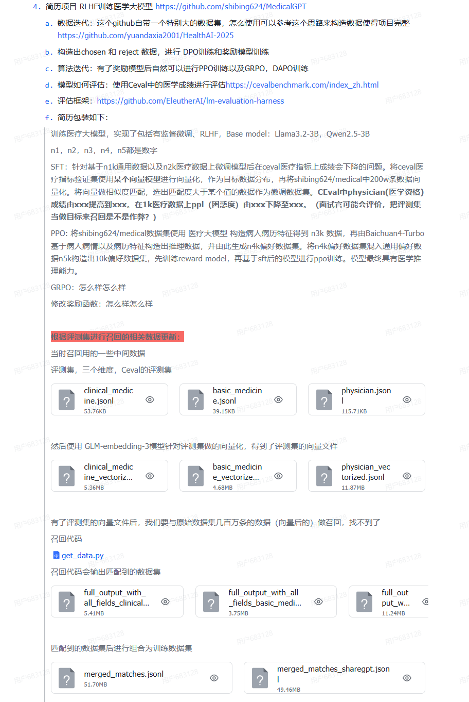

# 01 概述

> （Maybe？）学RL前的基础：一周深度学习基础、Transformer、手撕LLM、RL基础、RLHF项目

学习指南：

- Github高Start项目：
  - Datawhale：[EasyRL](https://datawhalechina.github.io/easy-rl/#/)、[JoyRL](https://datawhalechina.github.io/joyrl-book/#/)
- “这个实习能去吗”大佬分享：
  - [RLHF学习指南](https://jcng0mail1pt.feishu.cn/wiki/TJXiwv7kjiF4y0kNoGscWb3Snvc)
  - [手撕笔记](https://jcng0mail1pt.feishu.cn/wiki/DPptwxqGJiC987kQca9csD8OnBd)
  - [大厂算法实习锐评](https://jcng0mail1pt.feishu.cn/wiki/WFcOw0dQNi2UREkQKUWc9Qc8nQE)

数学原理相关资源：

- 原项目：[Book-Mathematical-Foundation-of-Reinforcement-Learning](https://github.com/MathFoundationRL/Book-Mathematical-Foundation-of-Reinforcement-Learning)
- 官方视频教程：[强化学习的数学原理](https://www.bilibili.com/video/BV1sd4y167NS)

------

RLHF 关键要点包括：

1. **NLP 场景下 RL 拓展**：强化学习应用到 NLP 任务需进行 MDP 建模，明确各概念定义，优化目标是最大化累积奖励期望值，带行为约束的优化目标可防止策略跑偏。
2. **RLHF 流程**：用于解决无明确奖励函数的强化学习问题，通过将奖励函数与人类偏好拟合，使智能体行为符合人类期望，反馈方式有易于提供、信息丰富等优势，在线反馈可实时调整策略，但成本高。
3. **LLM 对齐中的 RLHF + PPO**：InstructGPT 将 RLHF 技术应用于 LLM 后训练，训练框架选用 OpenRLHF，包含 Actor、Critic、Reward 和 Reference 四个模型，与传统强化学习的 RLHF 在 loss 计算等方面有区别。
4. **PPO 训练技巧和问题**：包括 Token Level KL-Penalty、GAE、添加 SFT Loss 等多种技巧，存在奖励利用和泛化问题，如 train reward 涨但测试效果下降。
5. **RLAIF**：利用 LLM 生成反馈信号扩展 RLHF 范式，减少对人类标注的依赖，提高可扩展性，但可能存在数据质量和计算成本问题。
6. **GRPO**：对 PPO 算法改进，去掉 Critic model，通过对相同问题的多个输出估计优势函数，训练时可能出现策略坍塌问题，可采用 AEPO、Clip-Cov 等解法。
7. **其他算法**：如 ReMax、RLOO、DAPO、VAPO、TTRL、GSPO、ASPO 等算法，分别从不同角度对强化学习算法进行改进，以提升模型性能和训练稳定性。

------

DPO 关键要点包括：

1. **DPO 与 RLHF 区别**：RLHF 是强化学习方法，DPO 优化掉强化学习部分，直接依据偏好数据集优化策略，不归类到 RLHF 中。
2. **RLHF-PPO 缺点**：两阶段训练有信息损失，若奖励函数模型学习偏差，后续强化学习会使策略陷入次优；PPO 算法引入四个模型，推理和训练需大量计算资源，还会带来累积误差。
3. **DPO 公式推导**：基于 Bradley-Terry 偏好模型假设和强化学习目标推导，去掉 Reward 和 Critic 模型，端到端从偏好数据到最终策略。
4. **DPO 理解**：DPO loss 类似对比学习，最大化偏好与不偏好回答概率差值，部分工作通过增加 NLL loss 等优化。
5. **DPO 相关算法**：
   - **DPOP**：在 DPO loss 基础上加正则项。
   - **TDPO**：添加 PPO 中的 KL 约束，用 forward KL 计算惩罚，输出多样性更自由。
   - **Self-Reward**：通过迭代训练提升模型指令遵循和奖励评估能力。
   - **KTO**：提出 HALO 损失，利用前景理论实现收益和损失非对称。
6. **DPO 优化方法**：目前多以原生 DPO 或 online DPO 配合拒绝采样为主。2024 年以 GRPO 为代表的 RLVR 方法成主流，还有 ORPO、SimPO 等多种优化方法。
7. **实验结果**：Self-Reward 训练使模型在指令遵循和奖励模型能力上提升；添加 EFT 任务不影响指令 follow 能力，随迭代轮数增加效果变好。

------

> 参考：[20260102 - 废了，实在看不懂RLHF！！](https://mp.weixin.qq.com/s/lvlXJb29FFlh-vh00GzEXg)

1、文章首先建立了一个核心视角：将LLM的文本生成过程映射到RL框架。

- **状态（State）**：对应Prompt加上已生成的tokens。
- **动作（Action）**：对应下一个要生成的token。
- **策略（Policy）**：对应LLM的推理过程（即softmax后的概率分布）。
- **奖励（Reward）**：对应奖励模型对整个生成序列的评分。

LLM场景的核心挑战是**信用分配问题**：奖励只在序列生成结束后给出（稀疏奖励、延迟反馈），但需要更新的是生成每个token时的策略。如何将整体奖励合理地分摊到每个token上，是RLHF要解决的核心问题。

2、为解决信用分配问题而演进的几种核心算法：

- **Monte Carlo / REINFORCE（最朴素的想法）** 
  - **核心思想**：如果整句话好，则认为所有token都好，都给予正向更新；反之亦然。 
  - **存在问题**： 
    - **信用分配不公**：即使只有最后一个token出错，前面所有正确的token也会被“连坐”惩罚，导致模型收到矛盾的训练信号，学习不稳定。 
    - **高方差**：不同生成序列的总奖励差异大，导致梯度噪声大，收敛慢。
- **时序差分（TD）与优势函数（Advantage）：局部化责任** 
  - **TD核心思想**：引入**价值函数（Critic）** 来预测从当前状态开始的未来期望奖励。通过计算**TD误差**，评估当前token的生成是让未来前景变好还是变坏，从而将责任“局部化”到当前步骤，不再让每个token为整个句子的最终命运负责。 
  - **优势函数核心思想**：将TD思想用于策略更新。优势函数衡量的是“在这个状态下，选择这个token比平均选择好多少”。TD误差是优势函数的无偏估计。使用优势函数更新策略，可以使每个token根据其实际贡献获得相应幅度的梯度更新。
- **近端策略优化（PPO）：稳定地优化** 
  - **核心思想**：在相信优势函数指引的方向的同时，通过**概率比裁剪**来限制单次策略更新的幅度，防止更新过于激进导致训练不稳定或策略崩溃。 
  - **工作流程**：使用旧策略生成回答 → 奖励模型评分 → Critic计算每个token的优势 → 使用裁剪后的目标函数更新策略（Actor）→ 更新Critic。 
  - **优势**：训练稳定，样本效率高。 
  - **代价**：需要训练额外的Critic网络，显存占用大，训练复杂度高。
- **分组策略优化（GRPO）与REINFORCE++：无Critic的替代方案** 
  - **GRPO核心思想**：为避免PPO中Critic带来的高成本，GRPO通过对同一提示词生成多个回答（一个组），用组内平均奖励作为基线，计算每个回答的相对优势。这样也能实现局部化的信用分配，但无需Critic。 
  - **GRPO的问题**：容易受到提示词难度不均的影响，可能导致估计偏差和奖励黑客行为。 
  - **REINFORCE++的改进**：采用**全局优势归一化**。在整个训练批次的所有回答上计算均值和标准差，然后对优势进行标准化。这消除了单个提示词难度带来的偏差，提供了更稳定、理论上更无偏的优势估计。


# 02 经验分享

## 1、训练经验

> 参考：[算法视角深度解读 Kimi K2 和 K2 Thinking，从预训练优化到 Agentic 能力训练的完整流程](https://www.bilibili.com/video/BV1yikRBvEwy)
>
> 发哥的讲解还是一如既往的通透

K2 Thinking可以200-300 步连续调用工具！！！

```
从 K2 和 K2 Thinking 的技术报告中，我觉得比较重要的，可能能在我们实际业务中用上的点有：
1、数据的改写策略，写的很详细，尤其是在做「创意写作」方面工作的同学。
2、Agentic 训练数据构建的 pipeline。别扯没用的，就是要「真实环境模拟运行」获取大量的 trajectory 然后用 LLM 做筛选。（以前我只想着去构造，迭代去筛选更有效）
3、rubric-based 评估（不过这个其实一两年前大家就在用了，为什么突然又改头换面火了一下，这个真的太考验业务敏感度和怎么使用了，能直接在 k2 这种级别的开源模型上搞出来，还是挺佩服的）
4、test-time scaling 还是很有必要的，梦回年初 Long-CoT，想要效果好牺牲点时间绝对是值得的。（尽管可能会导致过度生成、倾向于用工具的问题）
```


> 参考：[这半年来，用 RL 做 LLM 后训练时踩过的那些坑与心得](https://mp.weixin.qq.com/s/22xdjlFQ0bYmwUyBoodK6Q)

概述：

- 探索效率
- 训练稳定性
- 基座模型的选择
- Thinking 模型的后训练


## 2、实验迭代

> 参考：[202601 - 强化学习（verl）训练日志怎么看，今天就给你们来个保姆级的教程~](https://www.bilibili.com/video/BV1PwrrBtENk)

概述：核心关注Reward，如果较差，则结合其他指标分析问题

- Reward（最核心的指标）：
  - 概述：最直观反映模型优化情况
  - 理想情况：RL过程中会探索新策略，所以Reward波动时正常的，总体趋势是上升即可
  - 问题及方案：如果波动过于剧烈
    - 可能因为奖励获取条件过于苛刻，奖励过于稀疏：对于复杂任务，最好设计一些渐进性的奖励
    - 数据难易分布不均：对于基础能力较强的模型，波动会逐渐缓解，对基础能力较弱的模型，可能会持续波动，推荐先易后难以及对难数据先做一次sft
- Actor Loss：强化学习中，Loss意义不大，不必过于关注
- Actor Entropy 熵：
  - 概述：在一定程度上反应模型的探索能力
  - 理想情况：初七较高，后续逐渐下降，训练中适当波动是正常的
  - 问题及方案：如果归零，需考虑训练是否出现问题了，可能模型变成了复读机
- Grad Norm 梯度：
  - 概念：衡量模型训练是否稳定
  - 理想情况：平稳微降，可以适当波动
  - 问题及方案：突然增大后没有及时下降或者稳定下来，可能就是训崩了
- KL 散度：
  - 概念：衡量策略模型与参考模型的偏离程度
  - 理想情况：不要偏离太多，基本会在零附近波动
  - 问题及方案：如果急剧上升且没及时下降，可能是因为策略模型更新幅度过大，训练不稳定，可以考虑增加k惩罚系数、降低lr
- Responce Length 输出长度：初期可能逐步增长，后续逐渐降低到正常水平
- advantage 优势 和 return 回报：
  - 在GRPO中二者一致，在PPO中会不一致（advantages = returns - values）
  - 在GRPO中，训练后期advantage会在0附近波动


# 03 实战经验

## RLHF训练医学大模型

> 参考：[Github - MedicalGPT](https://github.com/shibing624/MedicalGPT)

概述：




### 1）PT+SFT+RLHF

MedicalGPT是一个包含了完整的医疗行业大模型训练流程的项目，会以这个项目为基础，并加入一些参考了其他项目的技巧，完成模型训练。由Readme可知，训练分为三轮：

| 阶段     | 名称                                  | 目标                                                     | 是否合理   |
| -------- | ------------------------------------- | -------------------------------------------------------- | ---------- |
| 第一阶段 | **Continue Pretraining (增量预训练)** | 将通用语言模型适配到医疗语料，提高医学语言理解与生成能力 | ✅ 非常必要 |
| 第二阶段 | **SFT (有监督微调)**                  | 通过标注数据学习医疗任务（问答、诊断建议、病例摘要等）   | ✅ 标准做法 |
| 第三阶段 | **RLHF (基于人类反馈的强化学习)**     | 通过人类偏好优化输出质量、安全性与符合医疗伦理的回答风格 | ✅ 必不可少 |

```
          ┌─────────────────────────┐
          │ 通用LLM (Base Model)   │
          └────────────┬────────────┘
                       │
          ┌────────────▼────────────┐
          │ Continue Pretraining     │
          │ 医学语料增量训练         │
          └────────────┬────────────┘
                       │
          ┌────────────▼────────────┐
          │ SFT                     │
          │ 医学指令数据微调         │
          └────────────┬────────────┘
                       │
          ┌────────────▼────────────┐
          │ RLHF                    │
          │ DPO + ORPO 人类偏好强化 │
          └─────────────────────────┘

```

每阶段对应的代码，参考`Training Pipeline`可知。简易起见，直接参考`MedicalGPT/run_training_ppo_pipeline.ipynb`


#### Step1 增量预训练

1、准备项目

```
git clone https://github.com/shibing624/MedicalGPT.git
cd MedicalGPT

conda create -n MedicalGPT python=3.12
conda activate MedicalGPT
pip install -r requirements.txt --upgrade
```

备注：用uv创建虚拟环境后，可能是环境变量没配置好的缘故，后续huggingface-cli下载、执行shell脚本等，出现的环境问题较多，所以这里直接改为conda方便些

2、下载模型

```
pip install -U huggingface_hub
echo 'export HF_ENDPOINT=https://hf-mirror.com' >> ~/.bashrc
source ~/.bashrc

conda activate MedicalGPT
huggingface-cli download --resume-download Qwen/Qwen2.5-3B --local-dir Qwen/Qwen2.5-3B
```

备注：不知道为什么，在uv环境下huggingface-cli未找到指令，换成了conda环境完成了模型下载。

3、增量预训练

```
# 修改模型路径、显卡数等参数后执行
bash run_pt.sh
```

备注：出现了`ImportError: cannot import name 'is_torch_tpu_available' from 'transformers'`，改为transformers==4.49.0即可

示例结果：

```
2025-11-13 11:30:16.844 | INFO     | __main__:main:742 - *** Evaluate ***
Trainer.tokenizer is now deprecated. You should use Trainer.processing_class instead.
Trainer.tokenizer is now deprecated. You should use Trainer.processing_class instead.
100%|████████████████████████████████████████████████| 2/2 [00:00<00:00,  8.08it/s]
***** eval metrics *****
  epoch                   =     0.5128
  eval_accuracy           =     0.4194
  eval_loss               =     3.0154
  eval_runtime            = 0:00:00.51
  eval_samples            =         10
  eval_samples_per_second =     19.589
  eval_steps_per_second   =      3.918
  perplexity              =    20.3978
```

4、lora模型权重合并到base model

```
# 根据实际情况修改路径
python merge_peft_adapter.py --base_model Qwen/Qwen2.5-3B --lora_model outputs-pt-qwen-v1 --output_dir merged-pt/
```

示例结果：

```
Namespace(base_model='Qwen/Qwen2.5-3B', tokenizer_path=None, lora_model='outputs-pt-qwen-v1', resize_emb=False, output_dir='merged-pt/', hf_hub_model_id='', hf_hub_token=None)
Base model: Qwen/Qwen2.5-3B
LoRA model: outputs-pt-qwen-v1
Loading LoRA for causal language model
Sliding Window Attention is enabled but not implemented for `sdpa`; unexpected results may be encountered.
Loading checkpoint shards: 100%|█████████████████████| 2/2 [00:01<00:00,  1.25it/s]
Merging with merge_and_unload...
Saving to Hugging Face format...
Done! model saved to merged-pt/
```


#### Step2 SFT

1、开始训练

训练脚本的执行逻辑如下：
- 导入依赖包
- 设置参数
- 定义各函数并加载训练集
- 加载模型和tokenizer
- 开始训练并评估
- 查看训练结果

```
CUDA_VISIBLE_DEVICES=0,1 python supervised_finetuning.py \
    --model_name_or_path merged-pt \
    --train_file_dir ./data/finetune \
    --validation_file_dir ./data/finetune \
    --per_device_train_batch_size 4 \
    --per_device_eval_batch_size 4 \
    --do_train \
    --do_eval \
    --use_peft True \
    --bf16 \
    --max_train_samples 1000 \
    --max_eval_samples 10 \
    --num_train_epochs 1 \
    --learning_rate 2e-5 \
    --warmup_ratio 0.05 \
    --weight_decay 0.05 \
    --logging_strategy steps \
    --logging_steps 10 \
    --eval_steps 50 \
    --eval_strategy steps \
    --save_steps 500 \
    --save_strategy steps \
    --save_total_limit 3 \
    --gradient_accumulation_steps 1 \
    --preprocessing_num_workers 1 \
    --output_dir outputs-sft-v1 \
    --overwrite_output_dir \
    --ddp_timeout 30000 \
    --logging_first_step True \
    --target_modules all \
    --lora_rank 8 \
    --lora_alpha 16 \
    --lora_dropout 0.05 \
    --torch_dtype bfloat16 \
    --device_map auto \
    --report_to tensorboard \
    --ddp_find_unused_parameters False \
    --gradient_checkpointing True
```

示例结果：

```
2025-11-13 11:41:25.655 | INFO     | __main__:main:899 - Saving model checkpoint to outputs-sft-v1
2025-11-13 11:41:26.073 | INFO     | __main__:main:908 - *** Evaluate ***
100%|████████████████████████████████████████████████| 3/3 [00:00<00:00,  6.57it/s]
***** eval metrics *****
  epoch                   =        1.0
  eval_loss               =     0.3985
  eval_runtime            = 0:00:00.63
  eval_samples            =         10
  eval_samples_per_second =      15.65
  eval_steps_per_second   =      4.695
  perplexity              =     1.4897
```

2、lora模型权重合并到base model

```
python merge_peft_adapter.py --base_model merged-pt --lora_model outputs-sft-v1 --output_dir merged-sft/
```

示例结果：

```
Namespace(base_model='merged-pt', tokenizer_path=None, lora_model='outputs-sft-v1', resize_emb=False, output_dir='merged-sft/', hf_hub_model_id='', hf_hub_token=None)
Base model: merged-pt
LoRA model: outputs-sft-v1
Loading LoRA for causal language model
Sliding Window Attention is enabled but not implemented for `sdpa`; unexpected results may be encountered.
Merging with merge_and_unload...
Saving to Hugging Face format...
Done! model saved to merged-sft/
```


#### Step3 Reward Modeling

1、开始训练

```
CUDA_VISIBLE_DEVICES=0,1 python reward_modeling.py \
    --model_name_or_path merged-sft \
    --train_file_dir ./data/reward \
    --validation_file_dir ./data/reward \
    --per_device_train_batch_size 1 \
    --per_device_eval_batch_size 1 \
    --do_train \
    --use_peft True \
    --seed 42 \
    --max_train_samples 1000 \
    --max_eval_samples 10 \
    --num_train_epochs 1 \
    --learning_rate 2e-5 \
    --warmup_ratio 0.05 \
    --weight_decay 0.001 \
    --logging_strategy steps \
    --logging_steps 10 \
    --eval_steps 50 \
    --eval_strategy steps \
    --save_steps 500 \
    --save_strategy steps \
    --save_total_limit 3 \
    --max_source_length 256 \
    --max_target_length 256 \
    --output_dir outputs-rm-v1 \
    --overwrite_output_dir \
    --ddp_timeout 30000 \
    --logging_first_step True \
    --target_modules all \
    --lora_rank 8 \
    --lora_alpha 16 \
    --lora_dropout 0.05 \
    --torch_dtype float16 \
    --fp16 \
    --device_map auto \
    --report_to tensorboard \
    --ddp_find_unused_parameters False \
    --remove_unused_columns False \
    --gradient_checkpointing True
```

示例结果：

```
2025-11-13 11:48:19.880 | INFO     | __main__:main:625 - *** Evaluate ***
100%|████████████████████████████████████████████████| 5/5 [00:00<00:00,  6.43it/s]
***** eval metrics *****
  epoch                   =        1.0
  eval_loss               =     0.5244
  eval_mae                =     1.2579
  eval_mse                =     2.7856
  eval_runtime            = 0:00:00.98
  eval_samples            =         10
  eval_samples_per_second =      5.068
  eval_steps_per_second   =      5.068
  perplexity              =     1.6895
```

2、lora模型权重合并到base model

```
python merge_peft_adapter.py \
    --base_model merged-sft --lora_model outputs-rm-v1 --output_dir merged-rm/
```

示例结果：

```
Namespace(base_model='merged-sft', tokenizer_path=None, lora_model='outputs-rm-v1', resize_emb=False, output_dir='merged-rm/', hf_hub_model_id='', hf_hub_token=None)
Base model: merged-sft
LoRA model: outputs-rm-v1
Loading LoRA for sequence classification model
Sliding Window Attention is enabled but not implemented for `sdpa`; unexpected results may be encountered.
Some weights of Qwen2ForSequenceClassification were not initialized from the model checkpoint at merged-sft and are newly initialized: ['score.weight']
You should probably TRAIN this model on a down-stream task to be able to use it for predictions and inference.
Merging with merge_and_unload...
Saving to Hugging Face format...
Done! model saved to merged-rm/
```


#### Step4 RLHF

1、开始训练

```
CUDA_VISIBLE_DEVICES=0 python ppo_training.py \
    --sft_model_path ./merged-sft \
    --reward_model_path ./merged-rm \
    --template_name qwen \
    --torch_dtype bfloat16 \
    --train_file_dir ./data/finetune \
    --validation_file_dir ./data/finetune \
    --max_source_length 256 \
    --response_length 1000 \
    --do_train \
    --save_steps 50 \
    --output_dir outputs-ppo-v1 \
    --num_train_epochs 3 \
    --report_to tensorboard
```

备注：

- 出现`ImportError: cannot import name 'is_rich_available' from 'transformers.utils'`，执行`pip install transformers==4.55.4`
- 删除`--bf16`参数
- 显存不足：
  - 修改torch_dtype
  - 修改batch_size
  - 修改response_length
  - 基于torchrun --nproc_per_node=2使用双卡（不可以直接CUDA_VISIBLE_DEVICES=0,1）
  - 加入lora配置


#### Step5 评估

陆续执行：

```
CUDA_VISIBLE_DEVICES=0,1 torchrun --nproc_per_node 2 inference_multigpu_demo.py --base_model Qwen/Qwen2.5-3B

CUDA_VISIBLE_DEVICES=0,1 torchrun --nproc_per_node 2 inference_multigpu_demo.py --base_model merged-pt

CUDA_VISIBLE_DEVICES=0,1 torchrun --nproc_per_node 2 inference_multigpu_demo.py --base_model merged-sft
```

可以在./predictions_result.jsonl中看到回答结果


### 2）HealthAI-2025 数据迭代

HealthAI-2025是一个临床医学数据处理的项目，我们将参考其思路，优化数据迭代流程。


