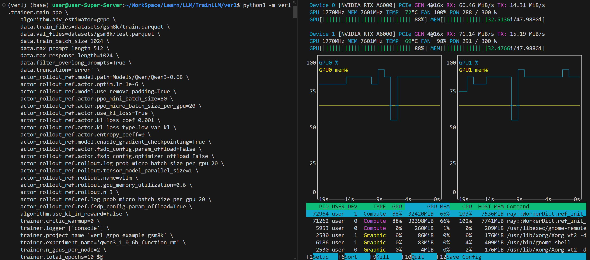
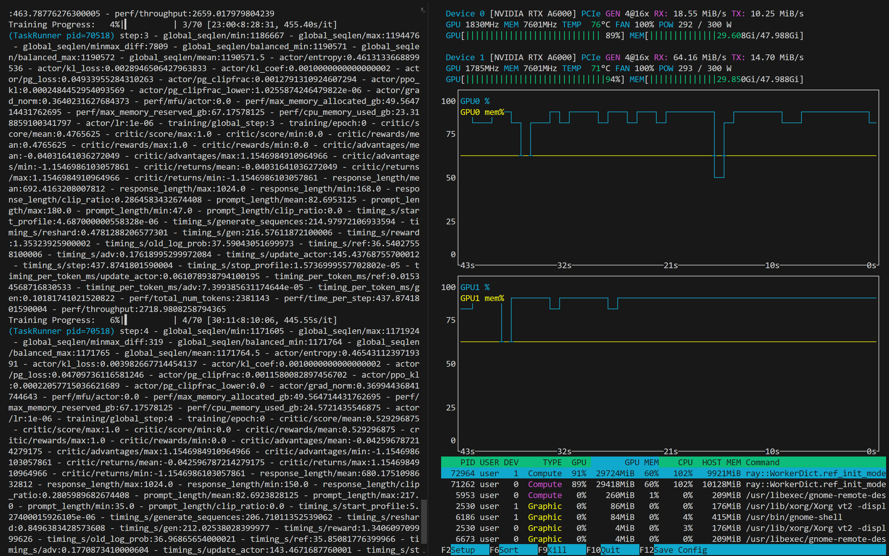
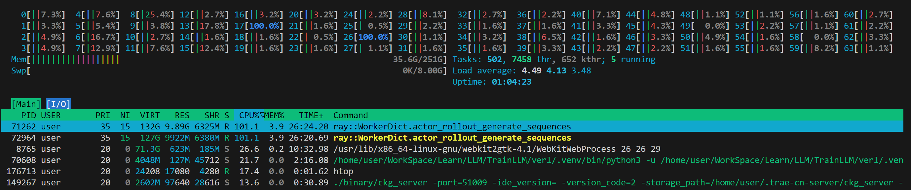

## 快速上手

参考教程：

- https://opendeep.wiki/volcengine/verl


```
git clone https://github.com/volcengine/verl.git
cd verl

uv venv
# uv pip install vllm==0.6.4.post1
uv pip install vllm==0.8

# 在使用requirements.txt之前安装，否则会存在依赖问题
uv pip install setuptools wheel ninja cmake
uv pip install --no-build-isolation flash-attn

uv pip install -r requirements.txt

# 安装uv库
uv pip install --no-deps -e .

uv pip install modelscope
```


模型及数据准备：

```
uv pip install -U huggingface_hub
echo 'export HF_ENDPOINT=https://hf-mirror.com' >> ~/.bashrc
source ~/.bashrc

mkdir Models
huggingface-cli download --resume-download Qwen/Qwen3-0.6B --local-dir Models/Qwen/Qwen3-0.6B

mkdir datasets
python3 examples/data_preprocess/gsm8k.py --local_dir datasets/gsm8k
```


开始训练：

```
python3 -m verl.trainer.main_ppo \
    algorithm.adv_estimator=grpo \
    data.train_files=datasets/gsm8k/train.parquet \
    data.val_files=datasets/gsm8k/test.parquet \
    data.train_batch_size=1024 \
    data.max_prompt_length=512 \
    data.max_response_length=1024 \
    data.filter_overlong_prompts=True \
    data.truncation='error' \
    actor_rollout_ref.model.path=Models/Qwen/Qwen3-0.6B \
    actor_rollout_ref.actor.optim.lr=1e-6 \
    actor_rollout_ref.model.use_remove_padding=True \
    actor_rollout_ref.actor.ppo_mini_batch_size=80 \
    actor_rollout_ref.actor.ppo_micro_batch_size_per_gpu=20 \
    actor_rollout_ref.actor.use_kl_loss=True \
    actor_rollout_ref.actor.kl_loss_coef=0.001 \
    actor_rollout_ref.actor.kl_loss_type=low_var_kl \
    actor_rollout_ref.actor.entropy_coeff=0 \
    actor_rollout_ref.model.enable_gradient_checkpointing=True \
    actor_rollout_ref.actor.fsdp_config.param_offload=False \
    actor_rollout_ref.actor.fsdp_config.optimizer_offload=False \
    actor_rollout_ref.rollout.log_prob_micro_batch_size_per_gpu=20 \
    actor_rollout_ref.rollout.tensor_model_parallel_size=1 \
    actor_rollout_ref.rollout.name=vllm \
    actor_rollout_ref.rollout.gpu_memory_utilization=0.6 \
    actor_rollout_ref.rollout.n=3 \
    actor_rollout_ref.ref.log_prob_micro_batch_size_per_gpu=20 \
    actor_rollout_ref.ref.fsdp_config.param_offload=True \
    algorithm.use_kl_in_reward=False \
    trainer.critic_warmup=0 \
    trainer.logger=['console'] \
    trainer.project_name='verl_grpo_example_gsm8k' \
    trainer.experiment_name='qwen3_1_0_6b_function_rm' \
    trainer.n_gpus_per_node=2 \
    trainer.nnodes=1 \
    trainer.save_freq=-2 \
    trainer.test_freq=5 \
    trainer.total_epochs=10 $@
```

示例效果：








## 项目经验

去R佬文档找Agent项目（R佬是谁？小红书的RZ？）


