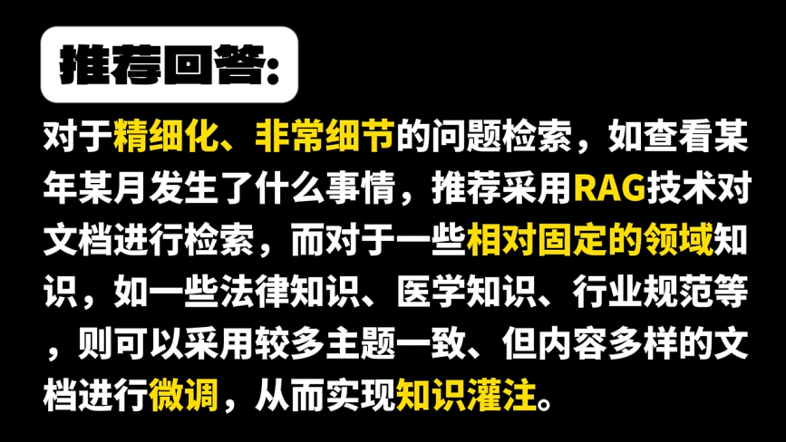
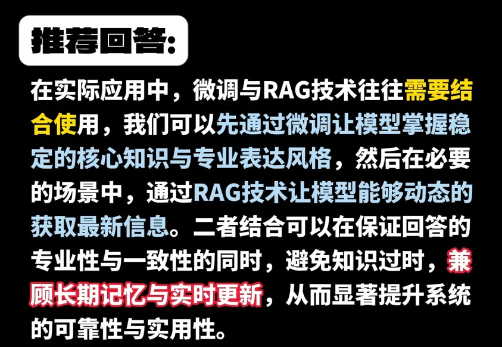
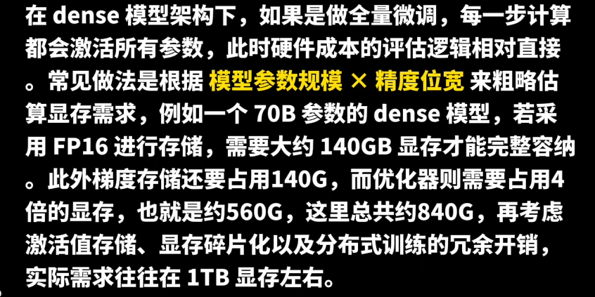
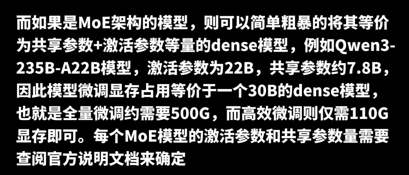

参考：[强化学习之于 AI Agent，是灵魂、还是包袱？](https://finance.sina.com.cn/tech/roll/2025-04-23/doc-ineucimw6967462.shtml)

文中，Follou 创始人谢扬有句话：

```
衡量一个 Agent 是否真正有生命力，更关键的标准在于它是否“可组合”“可调度”。只有当 Agent 能够被灵活地组织在不同的垂直任务中，支持模块化的能力组合，并与人类实现高效协同，它才真正具备长期应用的可能性。
```

Follou 是一个Agentic Browser，上述观点目前也只是：

```
构建了一整套融合 Agent 与工作流的架构体系，他们将浏览器（Browser）、智能体（Agent）和工作流自动化（Workflow Automation）等核心组件融合在一起，浏览器负责访问和渲染 Web 内容，智能体负责基于 LLM 理解上下文和做出决策，而工作流自动化则执行具体任务，调用 API、插件或脚本。
```

但是“可组合”和“可调度”，也体现了目前我们的需求。


先从问题本身出发，而非从LLM应用开发相关技巧出发，SimBot工具集首要实现的是做好已有的个位数以内的工作流，对于自由排列组合，对任一行业实现都较难（似乎金融相关的LLM应用架构较多，可参考，https://mp.weixin.qq.com/s/qXJv6HZ1odXodclLDqS3VA）。


## 方案选择

参考：[字节3面没抗住：RL比SFT好在哪？](https://mp.weixin.qq.com/s/BMz4O3nyM7JnTDKuD10UoA)

文中有一个比较好的几个论证点：

- 结合**论文
- 今天研究的核心，是泛化。微调总是有代价的
- 实验论证：训练前后输出 token 分布的 KL 散度等数据


Q：什么时候微调什么RAG？什么时候微调？

A：这道问题是问二者的技术本质



不过二者也并不冲突：




Q：微调能提升模型的哪些能力？

A：根据目前业内的时间经验，Fintune可以用于优化模型回答的语气风格、可以进行知识灌输，可以用于修改模型的自我认知，也可以提升模型指令跟随能力、提升模型工具调用与Agent能力。


Q：模型微调的风险？

A：可能会：

- 使模型丧失原有能力，即所谓的灾难性遗忘
- 此外还有可能造成数据过拟合
- 或者在训练数据中带入隐私数据，后期使用不当间接导致模型在回答问题时造成隐私数据泄露
- 等等


Q：模型微调与模型蒸馏的区别


## 微调成本

Q：如何评估大模型微调&训练所需硬件成本？

A：一般从dense模型入手



上述时全量微调，还可以补充说明高效微调相关内容：


再补充一下MeE架构：




Q：MoE架构在企业环境中可能遇到什么工程化难题


Q：如果预算有限，如何优先分配硬件资源？


Q：在评估硬件成本时，除了显卡还要考虑哪些隐形成本？


