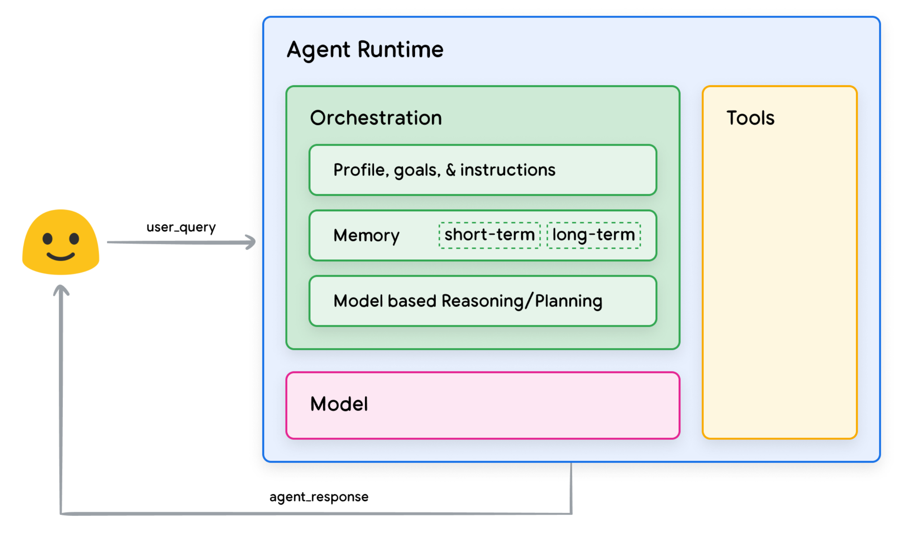
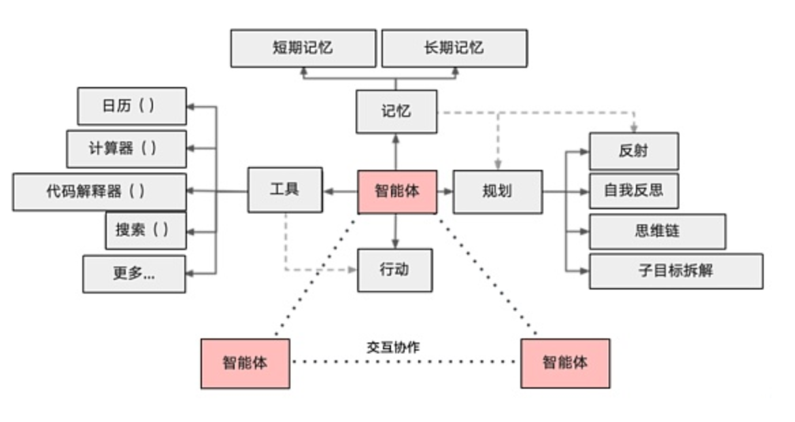
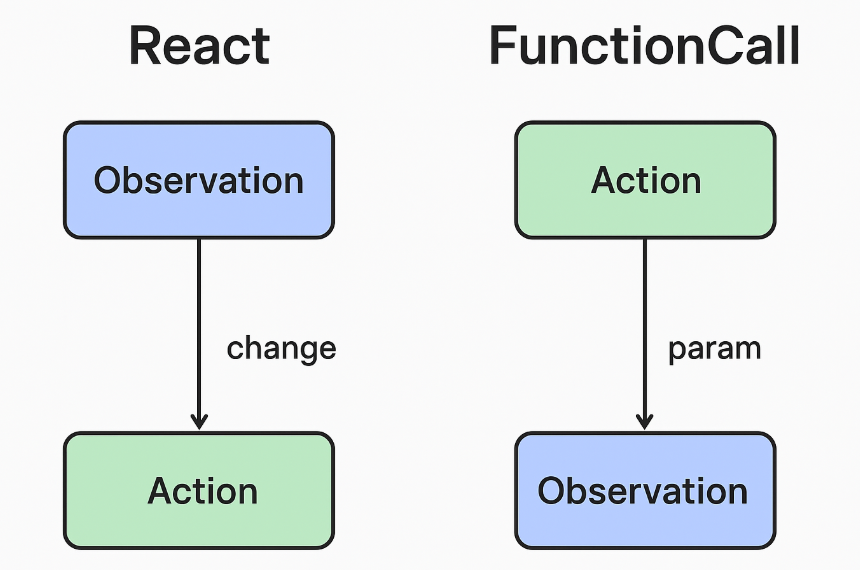

新的概念层出不穷，本文需持续更新、修正。

# Agent是什么？

OpenAI的白皮书[《A practical guide to building agents》](https://cdn.openai.com/business-guides-and-resources/a-practical-guide-to-building-agents.pdf)：

-  Agents are systems that independently accomplish tasks on your behalf.

-  In its most fundamental form, an agent consists of three core components: Model, Tools, Instructions

  ```python
  weather_agent = Agent(
  	name="Weather agent",
  	instructions="You are a helpful agent who can talk to users about the weather.",
  	tools=[get_weather],
  )
  ```

  

Google的白皮书《Agent》：

- 通用Agent架构和组件（General agent architecture and components）：
  - Model
  - Tools
  - Orchestration 编排




# Agent核心机制

>深入理解 LLM Agent 系统结构，熟悉核心机制：Planning（规划）、Execution（执行）、Memory（记忆）、Tool Use（工具调用）。
>
>掌握 function calling 机制，具备复杂工具集成与函数路由能力。



图片来源：

- https://lilianweng.github.io/posts/2023-06-23-agent/
- https://developer.nvidia.com/zh-cn/blog/llm-agent-for-finance/


Agent的三大核心模块：记忆、规划、反思 / 记忆；规划、工具  / 感知、规划；行动 / 大脑、感知、行动。

除此之外，经常看到别的术语：ReAct等等。

如何划分和理解这些关键词？


Lilian Weng曾经给过一个公式：**Agent=大型语言模型（LLM）+记忆（Memory）+规划（Planning）+工具使用（Tool）**

## Memory

分为：

- 感觉记忆
- 短期记忆
- 长期记忆


智能体的记忆分为两类：

- Short-term Memory
- Long-term Memory

这两个概念很好理解，但是对于LangGraph、AutoGen等框架，特别是针对长期记忆，具体是如何实现的？


LangGraph 中的记忆支持：

- **短期记忆**：
  - 通过图状态（state）中的上下文传递。
  - 每个节点可读写状态：状态中可以保留当前 task 的中间推理结果或对话记录。
- **长期记忆**：
  - 通常配合 LangChain Memory 类，如：
    - `VectorStoreRetrieverMemory`（结合向量数据库）
    - `ConversationSummaryMemory`（对话摘要）：不断总结对话历史。每次对话后，摘要将更新。实现返回对话历史记录的摘要，可用于为模型提供上下文。
  - LangGraph 中可通过节点访问外部 memory store（如 Chroma、Pinecone）进行检索。
- **使用方式**：
  - 在状态图中插入 memory read/write 节点
  - 构建 agent 时用 LangChain Memory 对象挂载到 agent 上


Autogen 中的记忆支持：

1. **短期记忆**：
   - 存储于每个 Agent 的 `chat_history` 中。
   - 自动记录对话内容，可用于上下文生成。
2. **长期记忆**（需开发者自己接入）：
   - Autogen 没有默认的长期记忆模块，但允许用户将 Agent 的历史、对话或知识保存到外部系统：
     - 可以接入 FAISS、Qdrant、Milvus 等向量数据库。
     - 自定义 `memory_handler`，实现检索+摘要+写入。
3. **AgentMemory 类（实验性）**：
   - Autogen 现在有一些工作在尝试集成“多轮记忆管理”，例如用类封装长期记忆检索器和摘要器。


## Planning


## Reflexion

反思（Reflexion）是一个框架,通过动态记忆和自我反思能力来提升智能体的推理技能。


> 参考：[2025.11.18 ReAct 与 Reflexion 技术综述](https://mp.weixin.qq.com/s/GJIjxwGQ0tMBj3if1FU9sw)

**主要贡献**

1. **ReAct框架**通过将推理和行动相结合，使模型能够与外部环境交互，获取实时信息，有效减少了模型幻觉问题。
2. **Reflexion框架**在ReAct基础上增加了评估和反思机制，形成了完整的"感知-行动-评估-学习"闭环，使模型能够从错误中学习并持续优化。
3. **两者的结合**充分发挥了各自优势，既保证了即时响应能力，又具备了长期学习和优化的潜力


## FunctionCall

### 代码实现

示例代码 LangGraph + OpenAI function calling：

```
from langchain_openai import ChatOpenAI
from langgraph.graph import StateGraph, END
from langchain.agents import Tool
from langchain.agents.agent import AgentExecutor, create_openai_functions_agent
from langchain_core.prompts import ChatPromptTemplate

# 1. 定义外部工具（函数）
def get_weather(location: str, date: str) -> str:
    return f"{location} 的天气在 {date} 是晴天，25°C。"

weather_tool = Tool(
    name="get_weather",
    func=lambda x: get_weather(**x),
    description="获取某地某日的天气，参数包含 location 和 date"
)

# 2. 创建 Function Agent
llm = ChatOpenAI(model="gpt-4-0613")
prompt = ChatPromptTemplate.from_messages([
    ("system", "你是一个智能助手，可以调用工具回答问题。"),
    ("human", "{input}")
])
agent = create_openai_functions_agent(llm, [weather_tool], prompt)

# 3. 构建 Graph 状态节点
agent_executor = AgentExecutor(agent=agent, tools=[weather_tool], verbose=True)

# 4. 搭建 LangGraph 工作流
class AgentState(dict): pass

def run_agent(state: AgentState) -> AgentState:
    result = agent_executor.invoke({"input": state["input"]})
    return {"input": state["input"], "result": result["output"]}

workflow = StateGraph(AgentState)
workflow.add_node("agent", run_agent)
workflow.set_entry_point("agent")
workflow.set_finish_point("agent")

app = workflow.compile()

# 5. 测试调用
output = app.invoke({"input": "请查一下明天北京的天气"})
print(output["result"])

```


示例代码 AutoGen：

```
from autogen import AssistantAgent, UserProxyAgent
from autogen.agentchat.contrib.agent_builder import AgentBuilder

# 定义工具
def get_weather(location: str, date: str) -> str:
    return f"{location} 的天气在 {date} 是晴天，25°C。"

tools = [
    {
        "name": "get_weather",
        "function": get_weather,
        "description": "获取某地某日的天气",
        "parameters": {
            "type": "object",
            "properties": {
                "location": {"type": "string"},
                "date": {"type": "string"},
            },
            "required": ["location", "date"],
        },
    }
]

# 定义 Agents
user_proxy = UserProxyAgent(name="user_proxy", code_execution_config=False)
assistant = AssistantAgent(
    name="assistant",
    llm_config={"config_list": [{"model": "gpt-4", "api_key": "your-key"}]},
    tools=tools,
)

# 建立对话流程
user_proxy.initiate_chat(
    assistant,
    message="请查一下明天北京的天气"
)

```


### 关于复杂路由

复杂路由功能可以理解为：在多工具、多意图、多步骤的 AI 系统中，**模型不仅要调用某一个函数，还需要根据上下文、用户输入动态决定**：

- 调用哪个函数（工具）
- 按什么顺序调用多个函数
- 是否需要多个模型协作
- 是否继续对话、回溯、记忆等

这种机制，本质上是 **“动态决策 + 多工具编排”**，就是所谓的 **复杂路由（Complex Routing）**。


# Agent推理范式

> 熟悉 ReAct、Chain of Thought (CoT)、Tree of Thought (ToT)、Self-Ask 等高级推理范式

好文分享：

- [AI智能体常用五大范式](https://mp.weixin.qq.com/s/_0d-0xZ3DMGivlH6YD1OMA)

ReAct、CoT、ToT等概念，属于“规划”的范畴。Google在《Agent》中说：

- ReAct, **a prompt engineering framework** that provides a thought process strategy for
  language models to Reason and take action on a user query, with or without in-context
  examples. ReAct prompting has shown to outperform several SOTA baselines and improve human interoperability and trustworthiness of LLMs.
- Chain-of-Thought (CoT), **a prompt engineering framework** that enables reasoning
  capabilities through intermediate steps. There are various sub-techniques of CoT including self-consistency, active-prompt, and multimodal CoT that each have strengths and weaknesses depending on the specific application.
- Tree-of-thoughts (ToT), **a prompt engineering framework** that is well suited for
  exploration or strategic lookahead tasks. It generalizes over chain-of-thought prompting
  and allows the model to explore various thought chains that serve as intermediate steps
  for general problem solving with language models.


## ReAct（Reasoning + Acting）

ReAct 结合了思考（Reasoning）和行动（Acting），让 LLM 在每一步**先思考、再决定是否采取动作（如调用工具）**，并根据工具反馈继续思考。


**ReAct的工作流程：**

1. Thought（思考）： Agent分析当前情况，思考下一步应该做什么
2. Action（行动）： 基于思考结果，执行具体的行动（如调用工具、搜索信息）
3. Observation（观察）： 观察行动的结果，获取新的信息
4. 循环： 基于观察结果，进行下一轮思考-行动-观察

示例结构：

```
Thought: I need to find the current weather in Tokyo.
Action: Search("current weather in Tokyo")
Observation: 28°C, sunny.
Thought: Got the weather, now I can answer the question.
Final Answer: The weather in Tokyo is 28°C and sunny.
```


## Chain of Thought（CoT）

Chain of Thought 是一种让 LLM 模仿人类逐步推理的方式，要求模型“**一步步写出中间推理步骤**”而非直接给出答案。

示例：

```
Q: Lily has 3 apples. She buys 2 more bags of apples. Each bag has 4 apples. How many apples does she have now?

A: First, Lily has 3 apples.  
Then, she buys 2 bags with 4 apples each, which is 2 × 4 = 8 apples.  
3 + 8 = 11.  
Answer: 11.
```


## Tree of Thought（ToT）

Tree of Thought 是将多个 Chain of Thought 分支组织成一棵“思考树”，**支持多个推理路径并行展开，并对路径进行评估与选择**。

示意图：

```
        Root Question
           /    |    \
      Path A  Path B  Path C
       /         \
  Final A      Sub Path B1
```

模型在生成多个路径后，可以：

- 评估每个分支的质量；
- 保留最优路径；
- 回溯并尝试新分支（类似 AlphaZero 的 MCTS）。


## Self-Ask with Search

> 原始论文 Google 2022：[Self-Ask: A Simple Prompting Technique for Hard Questions](https://arxiv.org/abs/2210.03350)

Self-Ask 是一种把复杂问题**拆解成多个子问题**的方式，由模型自己生成中间问题，并逐步回答。它通常配合工具调用（如搜索引擎）用于问答场景。


示例：

```
Q: What year did the president of the US in 2001 start their first term?

Subquestion: Who was the president of the US in 2001?
→ Answer: George W. Bush

Subquestion: When did George W. Bush start his first term?
→ Answer: 2001

Final Answer: 2001
```


## Self-Consistency

自洽性推理，**“投票式推理”**：通过多次运行模型生成不同的推理路径，然后从中选择最常见的最终答案。

示例：

- 普通 CoT（单次）：

  ```
  Q: If Alice has 3 more apples than Bob, and Bob has 5 apples, how many does Alice have?
  
  Chain of Thought:
  Bob has 5 → Alice has 5+3 → Alice has 8.
  Answer: 8
  ```

- Self-Consistency（多次思考）：运行同样的 prompt **10次**，得到如下答案分布：

| 推理路径                  | 结果 |
| ------------------------- | ---- |
| 5 + 3 = 8                 | 8    |
| Alice: 5 + 3 = 8          | 8    |
| Alice: 3 more → 5 + 3 = 8 | 8    |
| Mistakenly says 3         | 3 ❌  |
| Incorrectly says 5        | 5 ❌  |

→ **多数答案是 8 → 保留为最终答案**


## Plan-and-Execute

**Plan-and-Execute的工作流程：**

1. Planning（规划）： 分析目标任务，制定详细的执行计划

2. Execution（执行）： 按照计划逐步执行各个子任务
3. Monitoring（监控）： 监控执行进度，必要时调整计划
4. Replanning（重新规划）： 当遇到意外情况时，重新制定计划


# 工作模式

## 常用五大工作模式

最近有看到一些工作模式先关的定义，比如：

[智能体的六大设计模式](https://www.bilibili.com/video/BV1x1PRevEhu)：

- Chain
- Parallelization
- Routing
- Evaluator-optimizer
- Orchestrator-Workers
- ReaAct

[智能体的五大工作模式](https://blog.csdn.net/q2024107/article/details/148419711)：

- 提示链 Prompt Chaining：分布拆解的思维连
- 路由 Routing：动态决策的智能交换机
- 并行化 Parallelization：高效执行的并发引擎
- 协调者-工作者 Orchestrator-Workers：分层管控的军事架构
- 评估者-优化者 Evaluator-Optimizer：闭环进化的智能体

上述二者内容都差不多，多了一个ReAct无关紧要。


## 其他

> 参考：[从 ReAct 到 Ralph Loop：AI Agent 的持续迭代范式](https://mp.weixin.qq.com/s/zMnIrokMvdNI6gW-33-6xQ)

传统 AI 编程助手常出现：

- **过早退出**：AI 在主观认为“足够好”时停止，而非真正完成任务。
- **单次提示脆弱**：复杂任务无法通过一次提示完成，需反复人工干预。
- **重新提示成本高**：每次手动重新引导浪费开发者时间。
- **上下文断裂**：会话重启后，之前的进展和上下文丢失。

**本质原因**：LLM 的自我评估机制不可靠，依赖主观判断而非客观标准。

**解决思路**：通过 **Ralph Loop** 让 AI 持续工作直至任务真正完成。其核心是一个极简的循环机制（如 `while true; do cat PROMPT.md | claude-code; done`），通过反复输入同一提示，使 AI 基于外部状态（代码、测试结果、Git 历史）进行自我参照的迭代。

**Ralph Loop 的核心机制**

1. **三要素**： **明确任务与完成条件**：定义可验证的成功标准（如测试覆盖率 >80%）。 **Stop Hook 拦截机制**：阻止 AI 提前退出，未达标时强制继续循环。 **最大迭代次数（max-iterations）**：防止无限循环的安全阀。
2. **与传统 Agent 循环（如 ReAct）的区别**： **控制主体**：Ralph Loop 依赖外部脚本强制迭代，而非 LLM 自主决定。 **状态管理**：通过文件系统（如 `progress.txt`、`prd.json`）和 Git 历史持久化状态，避免上下文腐烂。 **适用场景**：专注可验证任务的持续修正（如代码重构、测试迁移），而非动态决策型任务。


## QA

### Q-W与P-E

不过 Orchestrator-Workers 与 Planner-Executor 有什么区别和联系？

**1) Orchestrator-Workers（O-W）**

- 一个“**编排者**”（Orchestrator）充当总控：理解用户目标、**动态分解/重分解**任务、选择合适的“**工人**”（Workers），分配、并行推进、收敛结果、做冲突/质量仲裁。
- **工人**一般是能力特化的代理或工具封装（检索、代码生成、数据清洗、可视化、评审等），可并发执行，必要时相互协作。
- 关注点：**调度与协同**。像分布式系统里的**任务调度器 + 工人池**或经典**Blackboard/黑板架构**。

**2) Planner-Executor（P-E）**

- 一个“**规划器**”（Planner）先把任务**串行地规划成步骤序列/子任务清单**（可包含工具调用与检查点）。
- 一个“**执行器**”（Executor）按计划逐步执行；执行中可**反馈给规划器修正计划**（ReAct/反思/自我纠错）。
- 关注点：**明确的步骤化决策与可回放性**。像程序里的**解释器按指令序列执行**。


二者关系：

- **P-E 是“先定计划再执行”的二段式层级分解；O-W 是“边编排边协同”的多代理调度。**
- 在实现上，**O-W 的 Orchestrator 往往内含一个 Planner**；而 **P-E 的 Executor 完全可以被实现成“多个特化 Worker 的一次性编排”**。两者互为子集与泛化关系。


数据流速览（ASCII）：

**P-E：**

```
User ──> Planner ──> Plan(steps) ──> Executor ──[step-by-step run/feedback]──> Result
                   ^─────────────────────────────── optional review/adjust ────|
```

**O-W：**

```
User ──> Orchestrator ──> (decompose + route) ──> Worker A ─┐
                                  │                        ├─> Aggregation/Adjudication ─> Result
                                  └──────────────────────> Worker B ─┘
                [monitoring, retry, contention control, quality gates, memory]
```


关键差异对比

| 维度          | Orchestrator-Workers                       | Planner-Executor                         |
| ------------- | ------------------------------------------ | ---------------------------------------- |
| 拓扑          | 中心编排 + 多工人（可并行、可复用）        | 规划器 + 单一执行通道（可在执行中微调）  |
| 分解时机      | **在线/动态**：边做边分解、可重排          | **离线/预先**：先出完整或半完整计划      |
| 并发          | 原生并发；适合**多条独立子工序**           | 以**顺序**为主；并发需额外扩展           |
| 决策焦点      | 任务路由、资源分配、结果合并与仲裁         | 步骤正确性与可回放性                     |
| 稳定性/确定性 | 动态性强，确定性略弱；需更强**观测与治理** | 计划明确，**重现性好**                   |
| 延迟/成本     | 可用并行降时延，但有**协调开销**           | 控制简单，通常**成本更可控**             |
| 适用问题      | 开放式、跨域、**可切分且可并行**的大任务   | 线性依赖强、**流程化**、工具链清晰的任务 |
| 典型失败      | 过度分解、工人“跑题”、合并冲突             | 计划脱实、局部失败导致连锁回退           |
| 可观测性      | 需要队列/工单/黑板、事件日志、SLA          | 以“计划 + 执行日志”为核心                |


各自更擅长的场景

- 选 O-W：多来源研究报告、代码库生成（前后端/测试/文档分工）、企业流程协同（检索→抽取→比对→合规审校→可视化），或需要专家角色与人机混编。
- 选 P-E：数据处理流水线、API 工具链编排（检索→调用→解析→汇总）、问答+单步推理可分解成确定步骤的工作。


### 关于推理范式与工作模式

在 Agent 研究语境里，“推理范式”（reasoning paradigm）指的是**Agent 在思维链条上如何安排认知流程**，即思考顺序、决策方式的结构化套路。

- **Plan-and-Execute**（规划-执行）规定了**推理流程的时间结构**：
  1. **先推理出全局计划**（planning phase）
  2. **再依次执行步骤**（execution phase）
- 它关注的不是具体实现拓扑，而是**思维顺序与状态转移模式**——是一种认知逻辑的抽象。
- 类似的 Agent 推理范式还有：
  - **ReAct**（推理+行动交替）
  - **Chain-of-Thought**（纯推理链）
  - **Tree-of-Thought**（多分支推理）
  - **Reflexion**（带反思循环）
- 因此，Plan-and-Execute 属于 *Agent 如何思考* 的范畴，哪怕它只跑在一个单线程 LLM 上，也依然成立。


“工作模式”更偏工程架构/运行时模式（execution pattern），描述的是**系统中不同角色如何分工、通信、并发协作**。

- **Orchestrator-Workers** 是一种**多组件分布式协作架构**：
  - Orchestrator：调度中心，分解任务、派单、监控
  - Workers：执行单元，完成子任务并返回结果
- 它不规定每个 Worker 内部是用 Plan-and-Execute、ReAct 还是别的推理范式——那是 Worker 的“脑子”怎么想的问题。
- 它强调的是**工作流形态与系统组织方式**，可以混用多种推理范式：
  - Worker1：用 Plan-and-Execute
  - Worker2：用 ReAct
  - Worker3：纯工具调用
- 所以它是 *Agent 如何协作* 的范畴，即运行形态，而不是认知范式。


| 维度             | 推理范式（如 Plan-and-Execute）      | 工作模式（如 Orchestrator-Workers）    |
| ---------------- | ------------------------------------ | -------------------------------------- |
| 定义层级         | **认知逻辑/推理流程**                | **工程架构/运行组织**                  |
| 关注点           | Agent 思考顺序、推理-行动循环方式    | 多 Agent/工具/组件的分工与调度         |
| 是否依赖多 Agent | 不依赖，可单 Agent 内部实现          | 通常是多 Agent/多工具协作              |
| 可替换性         | 可以替换为其他推理范式（ReAct、ToT） | 可以替换为其他协作模式（黑板、流水线） |
| 抽象层           | 算法/范式层                          | 系统/架构层                            |


# 一些概念

## 1、ReAct的深入思考

### 1.1 基础概念

> 参考：[姚顺雨博士答辩总结 Language Agents：Benchmarks, Methods and Frameworks](https://mp.weixin.qq.com/s/7CmchYjRkOx8_y-vsD6SNw)

含ReAct、ToT等概念。


> 参考：[ReAct 框架与 AI Agent：当 AI 学会自己思考和行动](https://baoyu.io/blog/react-ai-agent-self-thinking-acting)

文中有价值的两个点：

- **Agent 能力模型已经内化了 ReAct**
  -  使用传统模型 (无 Agent 能力)，比如老版 *GPT-4o*，需要借助提示词实现ReAct
  - 现在换成一个具备 Agent 能力的模型（例如 Anthropic *Claude 4 Sonnet*），你几乎不需要写什么复杂提示词框架
- **常见疑问解答**
  - 略


> 参考：[阿里云 - 从单智能体到多智能体的React框架设计与实现](https://mp.weixin.qq.com/s/E_7oMkktj8d1A4oX2ioNtQ)

todo


> 2025.06 关于 LangChain 与 LangGraph 中 ReAct的区别

简要来说：

- LangChian中的create_react_agent，是不维护消息列表的，只有一个human_message，里面包含历史所有的人与llm的对话，然后新一轮对话会产生新的回答（包含ReAct所需的Thought、Action），再将此回答塞入那个唯一的human_message，并将其给大模型，继续新一轮的对话
- LangGraph中的create_react_agent，是基于消息列表，包含HumanMessage、AIMessage、ToolMessage，逐渐的扩充此列表

最新的情况是，LangChain原有的方案已经废弃，统一采用消息列表的形式。


### 1.2 FunctionCall与ReAct

参考：

- FunctionCall实现、**FunctionCall模型训练**、ReAct实现：https://www.bilibili.com/video/BV1cqdPY8EzT


#### 1.2.1 原理解释

关于ReAct与FunctionCall，二者与Action/Observation关系



一、React机制

1. **基本概念**
    React机制源自 React 框架的理念（也可以泛指“响应式机制”）。核心思想是：

   - **监控状态变化（Observation / State）**
      系统关注某些状态（比如变量、事件、Observation）。
   - **自动触发动作（Action / Reaction）**
      当状态发生变化时，系统会自动执行绑定的函数或任务。

   **特点：**

   - 是**事件驱动的**（state变化触发函数）
   - **不需要显式调用函数**，函数调用是由状态变化自动触发的
   - 典型模式：`observe(state, callback)` 或 `useEffect(() => {...}, [state])`

2. **与Action/Observation关系**

   - Observation：系统关注的状态或事件
   - Action：对Observation的响应，通常是回调函数
   - React机制本质是 **“Observation变化 → 自动触发Action”**


在 **ReACT**（Reasoning + Acting）机制里，流程顺序是：

1. **Thought（推理）** – 模型先基于当前上下文思考该怎么做。
2. **Action（行动）** – 根据推理结果执行一个动作，比如调用工具、搜索信息等。
3. **Observation（观察）** – 执行动作后，得到的反馈或结果。
4. **循环** – 基于新的 Observation 再进入下一轮 Thought → Action → Observation。

Action 在前，Observation 在后，Observation 是对 Action 的结果的记录与感知，没有 Action 就没有 Observation。


二、FunctionCall机制

1. **基本概念**
    FunctionCall机制就是**显式调用函数**：
   - 开发者直接调用 `foo()`，传入参数
   - 系统不监控状态，函数执行完全由调用控制
2. **与Action/Observation关系**
   - 这里的Action可以理解为函数本身
   - Observation通常是函数参数或上下文
   - **FunctionCall机制不自动监控Observation**，只有调用时才执行


三、案例分析

1. **如果系统是React驱动的：**
   - Observation变化 → 自动触发Action
   - 开发者不需要显式调用函数
   - 典型模式：Action绑定到Observation
2. **如果系统是FunctionCall驱动的：**
   - Action被直接调用，Observation可能只是参数
   - 执行顺序由调用控制，不依赖Observation变化自动触发
3. **关键判断点：**
   - **有没有自动响应机制？**
     - 如果任务执行是因为Observation变化而触发 → React驱动
     - 如果任务执行是因为你手动调用函数 → FunctionCall驱动


四、结论

- **React机制关注的是“响应式”，Observation变化自动触发Action**
- **FunctionCall机制关注的是“显式调用”，执行由调用者控制**
- **你项目里同时出现Action和Observation并不能说明就是React驱动**
  - 需要看 **任务是否因为Observation变化自动执行**
  - 如果是 → React驱动
  - 如果只是被函数显式调用 → 仍然是FunctionCall机制


同时也有说法，**关键区别在于：**

- **Function Call** 是一种**单向的、一次性的**能力。模型生成一个函数调用，然后外部系统执行，模型接收结果后通常就结束了。它更像是一个“动作”。
- **ReAct** 是一个**多步的、循环的**过程。它强调的是**思考**（Reasoning）和**行动**（Acting）之间的**反复交替**。每次行动后，都会有一个观察结果反馈回来，模型会根据这个观察结果来决定下一步的行动，从而形成一个**完整的、有逻辑链条的任务执行流程**。

Function Call 是实现 ReAct 机制中“行动”部分的一种方式，是 ReAct 机制的一个**组成部分**，而不是它的替代品。项目利用 ReAct 的**多步推理和行动能力**，来驱动任务的整个生命周期，而 Function Call 则是这个生命周期中具体的执行动作。

```
Thought: 我需要...
Action: 调用工具A，参数是...
Observation: 工具A返回了...
Thought: 根据返回结果，下一步我需要...
Action: 调用工具B，参数是...
Observation: ...
```

这种反复交替的日志模式是 ReAct 机制的典型特征。


#### 1.2.2 示例代码

> FunctionCall实现-OpenAI

```python
from openai import OpenAI
import json

client = OpenAI(
    base_url="https://openrouter.ai/api/v1",
    api_key="sk-or-v1-***"
)

tools = [
    {
        "type": "function",
        "function":{
            "name": "get_weather",
            "description": "获取指定城市的天气情况",
            "parameters": {
                "type": "object",
                "properties": {  
                    "city": {
                        "type": "string",
                        "description": "需要查询天气的城市名称 e.g. 北京"
                    },
                    "country": {
                        "type": "string",
                        "description": "需要查询天气的国家名称 e.g. 中国"
                    }
                },
                "required": ["city", "country"],
                "additionalProperties": False
            }
        }
    }
]

messages = [
    {
        "role": "user",
        "content": "你好，我想知道中国北京的天气情况"
    }
]

# step1: 获取 function call 结果
responce = client.chat.completions.create(
    model="openai/gpt-4o-mini",
    messages=messages,
    tools=tools,
    tool_choice="auto"  # auto, required, none
)
print(f"responce: {responce}")

function_call = responce.choices[0].message.tool_calls  # 查看response中的function call
print(f"function_call: {function_call}")

# step2: 调用 function call
tool_call = responce.choices[0].message.tool_calls[0]
tool_name = tool_call.function.name
tool_args = json.loads(tool_call.function.arguments)

print(f"tool_name: {tool_name}")
print(f"tool_args: {tool_args}")

def get_weather(city: str, country: str) -> str:
    return f"The weather in {city}, {country} is sunny."

function_call_result = get_weather(tool_args["city"], tool_args["country"])
print(f"function_call_result: {function_call_result}")

# step3: 将 function call 结果返回给模型
messages.append(responce.choices[0].message)

messages.append({
    "role": "tool",
    "content": function_call_result,
    "tool_call_id": tool_call.id
})

# step4: 再次调用LLM
res = client.chat.completions.create(
    model="openai/gpt-4o-mini",
    messages=messages,
    tools=tools,
    tool_choice="auto"
)
print(f"res: {res}")
print(f"res.choices[0].message: {res.choices[0].message.content}")

```

示例结果：

```python
responce: ChatCompletion(id='gen-1755150893-lNCeQtoMPcp0fmDNeScY', choices=[Choice(finish_reason='tool_calls', index=0, logprobs=None, message=ChatCompletionMessage(content='', refusal=None, role='assistant', annotations=None, audio=None, function_call=None, tool_calls=[ChatCompletionMessageToolCall(id='call_GwG7ZhDL01xdhAZf5shyFJ2K', function=Function(arguments='{"city":"北京","country":"中国"}', name='get_weather'), type='function', index=0)], reasoning=None), native_finish_reason='tool_calls')], created=1755150893, model='openai/gpt-4o-mini', object='chat.completion', service_tier=None, system_fingerprint='fp_34a54ae93c', usage=CompletionUsage(completion_tokens=18, prompt_tokens=82, total_tokens=100, completion_tokens_details=CompletionTokensDetails(accepted_prediction_tokens=None, audio_tokens=None, reasoning_tokens=0, rejected_prediction_tokens=None), prompt_tokens_details=PromptTokensDetails(audio_tokens=None, cached_tokens=0)), provider='OpenAI')
function_call: [ChatCompletionMessageToolCall(id='call_GwG7ZhDL01xdhAZf5shyFJ2K', function=Function(arguments='{"city":"北京","country":"中国"}', name='get_weather'), type='function', index=0)]
tool_name: get_weather
tool_args: {'city': '北京', 'country': '中国'}
function_call_result: The weather in 北京, 中国 is sunny.
res: ChatCompletion(id='gen-1755150895-FeVjIB8W8oOE1Hs9sGLQ', choices=[Choice(finish_reason='stop', index=0, logprobs=None, message=ChatCompletionMessage(content='北京的天气情况是晴天。', refusal=None, role='assistant', annotations=None, audio=None, function_call=None, tool_calls=None, reasoning=None), native_finish_reason='stop')], created=1755150895, model='openai/gpt-4o-mini', object='chat.completion', service_tier=None, system_fingerprint='fp_34a54ae93c', usage=CompletionUsage(completion_tokens=9, prompt_tokens=117, total_tokens=126, completion_tokens_details=CompletionTokensDetails(accepted_prediction_tokens=None, audio_tokens=None, reasoning_tokens=0, rejected_prediction_tokens=None), prompt_tokens_details=PromptTokensDetails(audio_tokens=None, cached_tokens=0)), provider='OpenAI')
res.choices[0].message: 北京的天气情况是晴天
```


> FunctionCall实现-LangChain

```python
import os
from langchain.agents import create_openai_tools_agent, AgentExecutor
from langchain_core.messages import HumanMessage, AIMessage
from langchain_core.tools import tool
from langchain_openai import ChatOpenAI
from langchain_core.prompts import ChatPromptTemplate, MessagesPlaceholder


# 1. 定义工具 (Tools)
# 使用 @tool 装饰器可以方便地创建工具
@tool
def get_current_weather(location: str) -> str:
    """
    Get the current weather in a given location.
    
    Args:
        location (str): The city and state, e.g. San Francisco, CA.
    """
    if "san francisco" in location.lower():
        return "It is currently 72 degrees Fahrenheit and sunny in San Francisco."
    elif "tokyo" in location.lower():
        return "It is currently 10 degrees Celsius and cloudy in Tokyo."
    else:
        return f"Sorry, I don't have weather data for {location}."

tools = [get_current_weather]

# 2. 创建一个Agent Prompt
# 这个prompt会告诉Agent如何思考和行动
prompt = ChatPromptTemplate.from_messages(
    [
        ("system", "你是一个非常专业的助手，可以回答用户的问题。"),
        MessagesPlaceholder(variable_name="chat_history"),
        ("human", "{input}"),
        MessagesPlaceholder(variable_name="agent_scratchpad"),
    ]
)

# 3. 初始化LLM
llm = ChatOpenAI(
    model="openai/gpt-4o-mini",
    base_url="https://openrouter.ai/api/v1",
    api_key="sk-or-v1-***",
)

# 4. 创建Agent
agent = create_openai_tools_agent(llm, tools, prompt)

# 5. 创建Agent执行器 (Executor)
agent_executor = AgentExecutor(agent=agent, tools=tools, verbose=True)


# 定义一个 chat_history
chat_history = [
    HumanMessage(content="Hey there!"),
    AIMessage(content="How can I help you today?")
]

# 6. 运行Agent
print("--- 运行 LangChain Function Call Agent ---")
response = agent_executor.invoke(
    {
        "input": "What's the weather in Tokyo?",
        "chat_history": chat_history
    }
)
print("\n--- 最终回复 ---")
print(response["output"])
```

示例结果：

```python
--- 运行 LangChain Function Call Agent ---


> Entering new AgentExecutor chain...

Invoking: `get_current_weather` with `{'location': 'Tokyo, Japan'}`


It is currently 10 degrees Celsius and cloudy in Tokyo.The current weather in Tokyo is 10 degrees Celsius and cloudy. If you need more information or updates, feel free to ask!

> Finished chain.

--- 最终回复 ---
The current weather in Tokyo is 10 degrees Celsius and cloudy. If you need more information or updates, feel free to ask!
```


> ReAct实现-OpenAI

**OpenAI 框架本身无法直接编写 ReAct 机制，因为 ReAct 是一种更高层次的** **“** **agent** **”** **设计模式，而不是一个底层的 API 功能。** OpenAI 的 API 提供了构建 ReAct 的**“** **基石** **”** **，但并没有提供完整的 ReAct 循环。**

**ReAct** **本身是一种** **“** **agent** **”** **工作流的设计模式**，它的核心是**一个循环**：

1. **Thought (思考)**：模型生成一段文本来解释它的推理过程。
2. **Action (行动)**：模型决定采取什么行动，比如调用哪个工具。
3. **Observation (观察)**：外部系统执行行动后，将结果反馈给模型。
4. **循环**：模型接收到 Observation 后，根据新的信息进行下一轮的 Thought、Action 和 Observation。

OpenAI API 并没有一个内置的 API 调用来自动为你完成这个**完整的循环**。你需要自己**编写代码来管理这个循环**。例如：

```python
# user: input
# model: 一段话 + tool_call
# role: tool + tool_result
# model: 结果
from openai import OpenAI
import json

client = OpenAI(
    base_url="https://openrouter.ai/api/v1",
    api_key="sk-or-v1-***"
)


def get_weather(city: str, country: str) -> str:
    return f"The weather in {city}, {country} is sunny."

tools = [
    {
        "type": "function",
        "function":{
            "name": "get_weather",
            "description": "获取指定城市的天气情况",
            "parameters": {
                "type": "object",
                "properties": {  
                    "city": {
                        "type": "string",
                        "description": "需要查询天气的城市名称 e.g. 北京"
                    },
                    "country": {
                        "type": "string",
                        "description": "需要查询天气的国家名称 e.g. 中国"
                    }
                },
                "required": ["city", "country"],
                "additionalProperties": False
            }
        }
    }
]

# Prepare system message with tool information
system_message = f"""Answer the following questions as best you can. You have access to the following tools:

{json.dumps(tools)}

Use the following format:

Question: the input question you must answer
Thought: you should always think about what to do
Action: the action to take, should be function name
Action Input: the input to the action. eg. {{"param1": "value1"}}
Observation: the result of the action
... (this Thought/Action/Action Input/Observation can repeat N times)
Thought: I now know the final answer
Final Answer: the final answer to the original input question

Begin!"""

react_messages = [{"role": "system", "content": system_message}]
react_messages.append({"role": "user", "content": "帮我查看一下深圳的天气怎么样？"})
        
# Call LLM API
completion = client.chat.completions.create(
        model="openai/gpt-4o-mini",
        messages=react_messages,
        temperature=0.3,
        stop="Observation:"
)
print(completion.choices[0].message.content)
```

示例结果：

```python
Question: 帮我查看一下深圳的天气怎么样？
Thought: 我需要获取深圳的天气情况。
Action: get_weather
Action Input: {"city":"深圳","country":"中国"}
```


> ReAct实现-LangChain

示例代码：

```python
import os
from langchain import hub
from langchain.agents import create_react_agent, AgentExecutor
from langchain_core.tools import Tool
from langchain_openai import ChatOpenAI
from langchain_community.utilities import WikipediaAPIWrapper


# 1. 定义工具 (Tools)
# 这里使用维基百科作为工具
wikipedia_search = WikipediaAPIWrapper()

tools = [
    Tool(
        name="Wikipedia",
        func=wikipedia_search.run,
        description="A useful tool for searching the web for information."
    )
]

# 2. 获取ReAct Agent的Prompt模板
# LangChain Hub 提供了许多预设的prompt模板
prompt = hub.pull("hwchase17/react")

# 3. 初始化LLM
llm = ChatOpenAI(
    model="openai/gpt-4o-mini",
    base_url="https://openrouter.ai/api/v1",
    api_key="sk-or-v1-***",
)

# 4. 创建ReAct Agent
agent = create_react_agent(llm, tools, prompt)

# 5. 创建Agent执行器 (Executor)
agent_executor = AgentExecutor(agent=agent, tools=tools, verbose=True)

# 6. 运行Agent
print("--- 运行 LangChain ReAct Agent ---")
response = agent_executor.invoke({"input": "What is the capital of France?"})
print("\n--- 最终回复 ---")
print(response["output"])
```

示例结果：

```python
--- 运行 LangChain ReAct Agent ---


> Entering new AgentExecutor chain...
To find the capital of France, I can use the Wikipedia tool for accurate and up-to-date information. 

Action: Wikipedia  
Action Input: "capital of France"  Page: List of capitals of France
Summary: This is a chronological list of capitals of France. The capital of France has been Paris since its liberation in 1944.

Page: Capital punishment in France
Summary: Capital punishment in France (French: peine de mort en France) is banned by Article 66-1 of the Constitution of the French Republic, voted as a constitutional amendment by the Congress of the French Parliament on 19 February 2007 and simply stating "No one can be sentenced to the death penalty" (French: Nul ne peut être condamné à la peine de mort). The death penalty was already declared illegal on 9 October 1981 when President François Mitterrand signed a law prohibiting the judicial system from using it and commuting the sentences of the seven people on death row to life imprisonment. The last execution took place by guillotine, being the main legal method since the French Revolution; Hamida Djandoubi, a Tunisian citizen convicted of torture and murder on French soil, was put to death in September 1977 in Marseille.
Major French death penalty abolitionists across time have included philosopher Voltaire; poet Victor Hugo; politicians Léon Gambetta, Jean Jaurès and Aristide Briand; and writers Alphonse de Lamartine and Albert Camus.

Page: Capital city
Summary: A capital city, or just capital, is the municipality holding primary status in a country, state, province, department, or other subnational division, usually as its seat of the government. A capital is typically a city that physically encompasses the government's offices and meeting places; the status as capital is often designated by its law or constitution. In some jurisdictions, including several countries, different branches of government are in different settlements, sometimes meaning multiple official capitals. In some cases, a distinction is made between the official (constitutional) capital and the seat of government, which is in another place.
English-language media often use the name of the capital metonymically to refer to the government sitting there. Thus, "London-Washington relations" is widely understood to mean diplomatic relations between Great Britain and the United States.The information about the capitals gives clarification that the capital of France is Paris, which is the most widely known capital. 

Final Answer: The capital of France is Paris.

> Finished chain.

--- 最终回复 ---
The capital of France is Paris.
```


## 2、Agent 链路的端到端闭环能力

E2E闭环能力，指的是把从用户输入 → 智能 Agent 推理与动作执行 → 结果验证/确认 → 反馈收集 → 模型/规则/数据迭代这整个流程连成一个可观测、可自动化、可持续改进的闭环系统，保证功能不仅能把事情做完，还能把做完的结果用于持续提升能力和保障安全、合规与可追溯性。


**核心组成：**

- **输入采集层**
  - 用户请求、系统事件、外部 webhook、传感器等。
  - 必要的预处理（脱敏、校验、统一 schema）。
- **理解与意图识别**
  - NLU/分类/实体抽取，返回结构化任务（intent + slots + confidence）。
- **策略/决策层（Orchestrator / Planner / Agent）**
  - 多步骤任务拆解、步骤优先级、策略选择（规则优先 / 模型决策）。
  - 调度子 Agent（检索、API 调用、工具使用、长短期记忆）。
- **执行层（Actuators）**
  - 对外系统的 API、数据库操作、邮件/SMS、机器人等执行器（带幂等设计）。
  - 执行前后的预检与幂等性保证。
- **结果合成与验证**
  - 执行结果校验（业务校验、回滚策略）、自然语言合成（向用户的说明）。
  - 可信度/证据链（哪一步做了什么、返回码、快照）。
- **反馈采集层**
  - 用户显式反馈（满意度、确认/撤销）、隐式反馈（行为、后续事件）。
  - 人工标注事件（人工修正的样本）归档。
- **学习与优化闭环**
  - 把验证结果与反馈变为训练数据、规则更新、提示工程(PE)调整、或微调策略。
  - 自动化的训练/验证/发布流水线（含 A/B / canary / shadow 模式）。
- **可观测性与监控**
  - 日志、追踪（trace id）、指标（KPI）、仪表盘、异常告警、审计日志。
  - 模型性能监控（输出分布、概率校准、漂移检测）。
- **治理、安全与合规**
  - 访问控制、审计链、隐私脱敏、合规规则（保留/删除策略）。
  - 人机切换/人工审批策略。


数据与控制流（简化序列）：

```
用户请求 → 预处理 → 意图识别(confidence) → Planner 决策(任务流) 
    → Executor 调用外部系统 (幂等 & 事务) → 执行结果验证
        → 向用户返回结果/确认 → 收集用户/系统反馈
            → 存储事件/标签 → 自动/半自动入训练集 → 模型/规则更新 → 部署
```


示例：客服退款 Agent 的闭环流程（具体步骤）

1. 用户：`我要退这单`（in）
2. 系统：NLU → intent=refund, slots={order_id, reason}（理解）
3. Planner：查询订单状态 → 如果符合条件则生成执行动作 `create_refund(order_id)`（决策）
4. Executor：调用支付方 API（幂等请求 id） → 返回 success/failure（执行）
5. Verifier：验证退款状态与金额 → 若不一致生成补偿或人工任务（验证）
6. 向用户发送确认消息（通知）并记录 `trace_id`（返回）
7. 收集反馈：用户点击确认（显式）或 7 天内没有异议（隐式）→ 存为正样本（反馈）
8. 数据入仓：把事件、用户确认、人工纠错一起入训练集 → 定期触发模型/规则更新（学习）
9. 监控：统计自动化率、人工介入率、退款成功率，低于阈值触发告警（监控）


验收条件 / 交付清单（示例）

- 输入/事件 schema 文档与示例。
- Orchestrator 服务（含版本化策略）与工作流定义。
- Executor 接口与幂等设计规范。
- 验证器与回滚策略实现。
- Feedback pipeline（自动 + 人工标注）与数据存储（可查询）。
- MLOps 流水线（训练→评估→canary→生产）与模型版本控制。
- 仪表盘：任务成功率、自动化率、人工介入率、延迟分位数。
- 审计日志与合规报告（可导出）。
- 灰度/回滚与事故演练报告。


