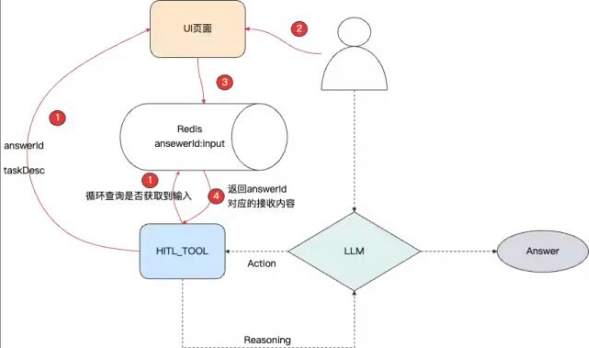

> 参考：[从HITL(Human In The Loop) 实践出发看Agent与设计模式的对跖点](https://mp.weixin.qq.com/s/Q653xI_HiUzejMHVLauZRg)

HITL实践本质是通过工程设计模式优化Agent的冗余与可控性，催生了更自然的人机协同体验。

#### 为什么需要HITL

如果没有通用的人机协同，我们是如何通过一种伪人机协同（因为还是在Agent主导完毕后，用户才有参与权），解决人类在Agent问答中的参与过程：

- 多轮对话式的追问：
  - 概述：当用户任务意图不明确时，立即停止任务，请求用户补充任务意图
  - 问题：1）本质上是在增加Memory，但是遇到上下文管理中的对话压缩等，可能会导致新参数覆盖历史参数等语义失真问题；2）如果提示词不合理或者模型能力不强，同样会有失真的问题存在。
- 对工具的描述
  - 概述：在工具的描述中增加“该参数必须符合xxx格式，必须从用户输入中准确推理，当输入中不包含该参数时，请要求用户进行补充” 
  - 问题：约束成本更高，且性能更不可控。对于上下文管理复杂的系统，更是灾难。

因此为了实现人类关注任务走向，需要用HITL的方式，实践下来其实核心在于以下几点：

1. 交互，合理的交互设计让人能够参与任务补充和任务进行。
2. 保持一次对话的连续性（多轮对话的方式有冗余存在，会第二次对话重新去理解提示词！执行前置的处理），在人参与的过程中，不得关闭本次对话，使用挂起等待的方式。

原文给了两个HITL的视频case：在多轮对话中或者工具描述相关问题时，弹出一个临时对话框供用户补充信息。

#### HITL实现细节

1、交互设计

- 设计了一种支持html代码直接渲染的xml协议，用此类xml标签包装后，可直接渲染为html页面
- 利用1day快速实现生成了一个用户可实时补充内容的UI

2、HITL交互作为一种工具

- 定义一种工具专门用来在需要参数补全的情况下被唤起此工具
- 系统判断出现该工具时，以特殊的UI进行渲染工具，让用户补充信息

3、规划类系统提示词设计

- 在基础的ReactAgent提示词中加入关于该HITL工具的描述以及对于整体规划的影响即可

4、对话挂起重连、工具凭证设计

- 作为通用工具如何实现用户隔离、对话挂起与重连、超时未输入处理的设计：虚线部分即为基础的ReactAgent的设计，红色部分主要是HITL工具的设计
  
- 具体步骤：
  1. HITL工具的执行逻辑中，循环调用Redis，查询key为AnswerId的数据是否有内容，没有内容时，继续循环等待。
  2. HITL工具会返回给UI界面当前的对话id，以及用户需要补充文案的描述。
  3. 用户在UI界面中进行输入。
  4. UI页面调用后端提交接口，后端接口将数据写入Redis。
  5. HITL工具中的循环，此时查询到了Redis中的数据。
  6. HITL工具执行结束，将Redis中的内容作为工具的执行结果。
  7. LLM继续进行推理，执行下一步动作。

#### Agent演进过程与工程设计的对跖点

将Agent演进中的关键设计类比于经典软件工程模式：

- HITL的对跖点——Hook、Intercept ：看了Spring ai alibaba的设计，通过钩子机制解耦人工干预点，避免冗余调用。从结果倒推问题，我们可以发现，其实也就是将设计模式中的这种钩子、拦截、切面的一些概念加入到Agent中，催化出了人机协同的一种Agent玩法出来。
- Dify、LangGraph的对跖点——数据结构（图）：用图结构编排流程节点，实现可控的Agent执行路径。
- ReactAgent的对跖点——循环+责任链：结合循环思考与工具调用链，模拟人类推理过程。
- MCP的对跖点——防腐层、适配器模式：标准化工具调用协议，屏蔽底层接口差异。
- 按需加载工具的对跖点——懒加载、循环依赖：通过工具树动态加载，优化上下文长度。
- 记忆的对跖点——多级缓存：短期/长期记忆结合，类比本地与云端缓存策略。
- skills的对跖点——简单工厂模式：原子能力组合成特定任务技能。
- 还有哪些设计模式可催生新的玩法：提议由主Agent根据任务动态生成专属Agent实例。

备注：

- 对跖点（Antipodes，读音为 duì zhí diǎn）
  - 是一个地理学和几何学概念，简单来说，就是地球直径两端相对的点。
- 钩子 (Hook)：
  - 核心关键词：生命周期、自动触发。
  - “钩子”就像是在代码的某个特定时刻预留的一个“挂钩”。当程序运行到这个点时，它会检查挂钩上有没有挂载任务，如果有，就执行它。
- 拦截 (Intercept / Interceptor)
  - 核心关键词：中途拦截、修改请求/响应。
  - “拦截器”通常出现在数据传输的路径上。它可以在请求发出前、或者响应到达前，把数据拦下来，进行检查、修改甚至终止。
- 切面 (Aspect / AOP)
  - 核心关键词：解耦、横向切入、非侵入式。
  - “切面”来源于 AOP（面向切面编程）。它是一种编程思想，旨在将那些与业务逻辑无关、但在多个模块中都要用的功能（如日志记录、性能统计、权限校验）抽离出来。

