优质论文导读：

- https://zhuanlan.zhihu.com/p/1895845224300909965
- https://finance.sina.com.cn/tech/roll/2025-04-20/doc-inetumyx6132977.shtml

详细解读：

- 心流AI

目标：

- Title：多智能体协作系统设计
- Introduce：面对一个需求，可能需要多个Agent协作完成，如何设计这样一个系统

吴恩达老师在《Building and Evaluating LLM Agents》课程中揭示了四种主要Agent设计模式（也可以看作者总结的：[**10种 AI Agent 策略全解析**](https://mp.weixin.qq.com/s?__biz=MzA3MjgwNTQ3OA==&mid=2247484182&idx=1&sn=f029852fb5a7b97f954ad386604b530a&scene=21#wechat_redirect)），这些模式决定了AI的思考方式和解决问题的能力。就像武功有不同门派，每种模式都有其独特优势：

- **Plan-and-Execute（规划与执行）**：就像下棋高手，先规划整盘棋局再行动，适合结构清晰的任务
- **ReAct（思考-行动-观察）**：像灵活的格斗家，边思考边行动边观察，适合需要即时反应的交互任务
- **Chain-of-Thought（思维链 CoT）**：如同数学家解题，展示每一步推理过程，让复杂问题变得清晰可解
- **Reflection（反思）**：犹如武学大师，不断反思自己的招式并改进，是四大模式中的"王者"

# 00 导读

本书分为四个部分。第一部分介绍了单个智能体的需求，将其能力与人类的能力进行比较，包括感知和行动能力。第二部分探讨了智能体的进化能力及其对工作流管理系统等智能工具的影响。第三部分讨论了智能体社会，强调其协作和集体行动能力，第四部分涉及伦理和社会方面，包括智能体的安全和责任。

# 01 Agent的核心组成

论文首先强调，一个强大的 Foundation Agent 必然是一个复杂的系统，由多个相互协作的核心组件构成。这借鉴了认知科学和神经科学中对大脑模块化功能的理解。作者详细阐述了七个关键组件，它们共同构成了智能体的认知架构：

- 认知核心 (Cognition Core)
- 记忆系统 (Memory System)
- 世界模型 (World Model)
- 奖励与价值系统 (Reward and Value System)
- 情绪与动机建模 (Emotion and Motivation Modeling)
- 感知系统 (Perception System)
- 行动系统 (Action System)

## 1 Congnition 认知

## 2 Memory 内存/记忆

短期记忆STM与长期记忆LTM

- STM：上下文窗口、临时缓存
- LTM：数据库、知识图谱、向量检索

## 3 Word Model 世界模型

## 4 Reward and Value System 奖励与价值系统

# 02 智能体的自我进化

三个优化分支：

- 优化 agentic workflow：多LLM节点间的协调与交互
- 优化 tools
- 全面优化自主代理

指标：性能、推理成本、延迟

# 03 多智能体协作

论文进一步将视野扩展到由多个 Foundation Agent 组成的**多智能体系统 (Multi-Agent System, MAS)**

- 探讨 MAS 的基础组成、结构、协作范式和决策机制；
- 在多智能体系统的自主协作 / 竞争中，群体智能形成的现象 (Collective Intelligence)
- 系统性梳理了现有的 MAS 评估方法和评估体系，为未来 MAS 的评估与应用实践提供了理论基础和方法论支撑

## 1、多智能体系统设计 (Multi-Agent System Design)

> 论文通过分析和梳理三类 MAS 的典型应用，探讨了大语言模型（LLM）如何赋能、影响并改进同质和异质智能体的行为、交互及决策，并给出了 LLM-MAS 的下一代智能体协议。

针对LLM-MAS分为三类：

- **策略学习 strategic learning**：系统将代理嵌入到**博弈论的背景**下，代理追求个体或部分冲突的目标。这些互动可以是合作的、竞争的或混合的，明确地由预定义的游戏规则和互动规范指导。这种设置通常与传统博弈论中的非合作（战略）和合作概念一致。
- **建模与仿真 modeling and simulation**：环境**侧重于独立行动**的代理，这些代理受多种环境或社会因素驱动。在此背景下，互动自然而然地产生，**不一定汇聚于共同目标**，反映了大规模社会或经济仿真中观察到的复杂动态。
- **协作任务解决 collaborative task solving**：强调代理之间系统的合作以实现**明确共享的目标**。代理通常采用结构化的工作流程、明确的角色定义和高度预定义的合作规范，以同步他们的行动，实现集体目标。

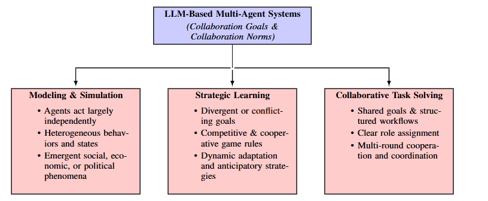

### 1.1 类型一：策略学习

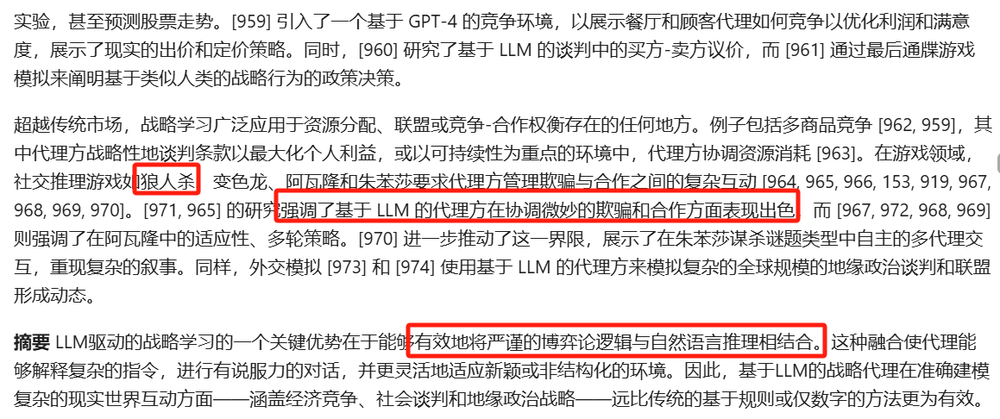

### 1.2 类型二：建模与仿真

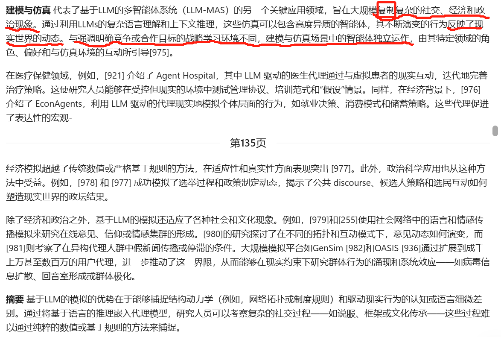

### 1.3 类型三：协作任务解决

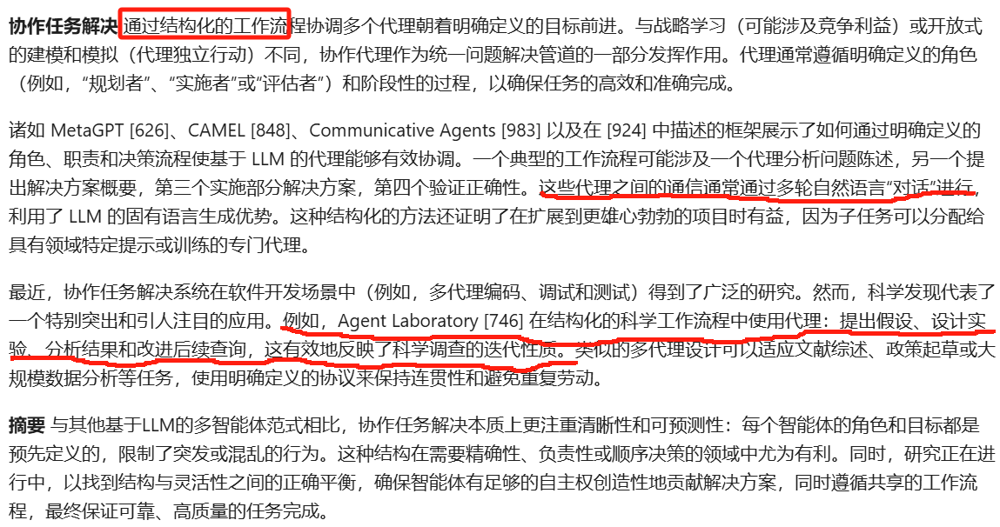

### 1.4 组成Agent团队

这些代理可以根据他们是否有相同或者不同的角色、能力和行动空间，被分类为同质或异质。

同质：

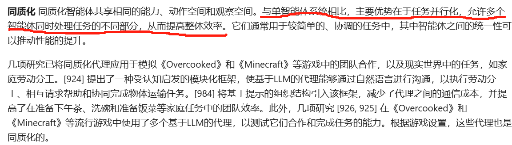

异质：

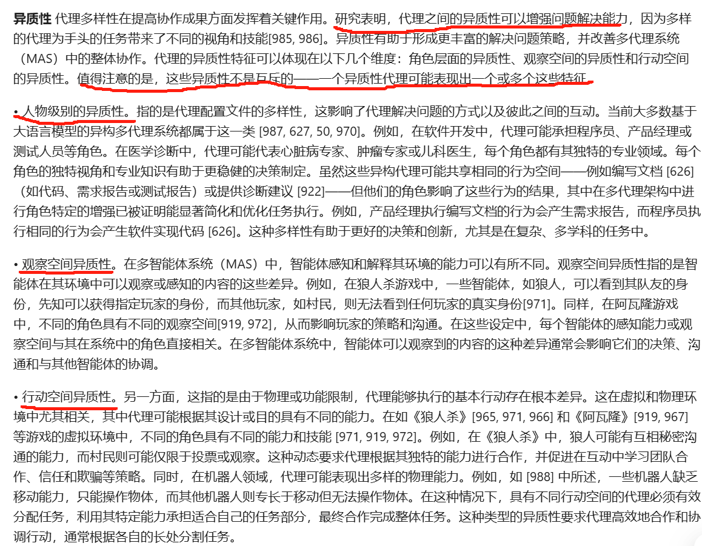

同质到异质的演化：

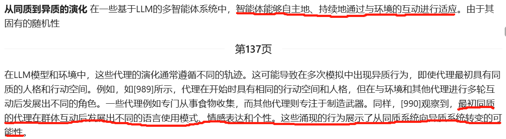

### 1.5 代理交互协议

> 当前Agent的几个消息类型、通信接口（MCP等），以及展望下一代通信协议

## 2、拓扑结构与规模化（Comunication Topology and Scalability）

> 从系统角度出发，拓扑结构往往决定着协作的效率与上限。论文作者将 MAS 的拓扑分为了静态和动态两大类：
>
> - 静态：预定义好的静态拓扑（层级化、中心化、去中心化）结构，常用于特定任务的解决实现；
> - 动态：根据环境反馈持续更新的动态拓扑结构，其可通过搜索式、生成式、参数式等新兴算法实现。
>
> 而随着智能体数量的增加，科学的规模化方式也将是未来多智能体系统的重要议题。

### 2.1 系统拓扑结构

几类系统结构：

- 协作：Centralized 集中、Distributed 分布式、Hierarchical 分层
- 协作和竞争：Cooperation 合作、Competition 竞争

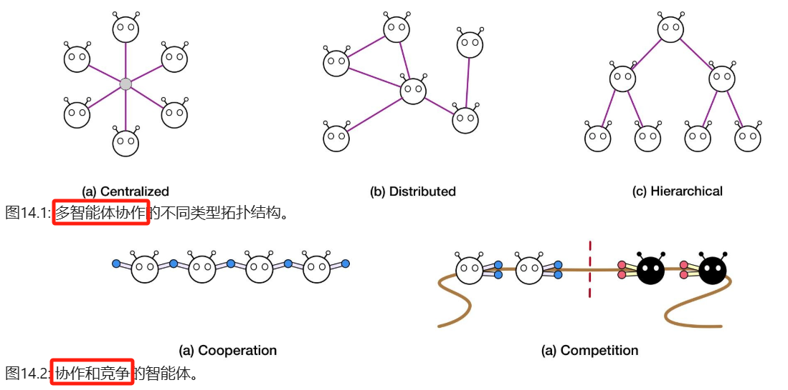

#### （1）静态拓扑

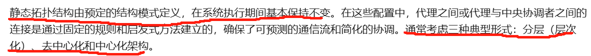

简而言之，静态拓扑预定义了Agent之间的协作结构，而结构又分为以下三种

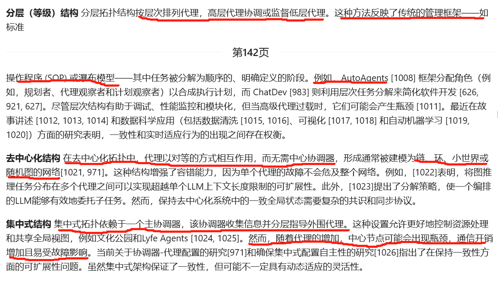

#### （2）动态拓扑

静态拓扑未必满足需求，许多需求需要Agent之间根据环境反馈，调整交互模式，也就是形成动态拓扑。

该部分介绍了几类动态拓扑方法及其案例。

### 2.2 可拓展性考虑

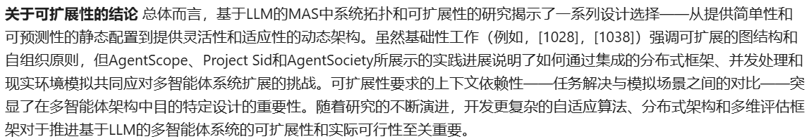

## 3、协作范式与机理 (Collaboration Paradigms)

借鉴人类社会中的多样化交互行为，如共识达成、技能学习和任务分工，论文**从交互目的、形式和关系三个维度**探讨多智能体协作。多智能体协作被归纳为**共识导向、协作学习、迭代教学与强化，以及任务导向交互**。

在不同交互目标和形式下，智能体之间形成讨论、辩论、投票、协商等单向或多向交互。随着交互的持续，这些过程迭代出决策和交互网络，不同智能体在协作中增强和更新个体记忆与共享知识。

### 3.1 Agent-Agent

基于社会学对人与人之间交互模式的见解，MAS （Multi-Agent Systems）协作可以分为四种类型，并应用于MAS中的agent-agent交互。

这些互动类型中的每一种都解决了与合作、竞争、协调和决策相关的独特挑战，并且它们受到各种形式的目标、环境和结果的影响。MAS实现涉及具有不同类型交互的代理，而不是单一类型或单向过程，形成随时间演变的复杂交互网络。

#### （1）以共识为导向的互动

> 这种类型的互动侧重于通过协商、投票和社会选择框架协调MAS的最终目标。智能体整合知识，建立统一的理解，有助于在复杂的问题解决情况下共同决策。例子包括MedAgents、MDAgents和AI Hospital，其中多学科代理之间的协作对话通过提高推理技能和获取固有知识来改善问题解决。

如下图所示，基于LLM的多智能体系统中四种智能体-智能体协作类型的概述：共识导向型、协作学习、教学/指导和任务导向型。每种类型都从四个关键维度进行描述：信息流、协作目的、知识整合和输出重点。

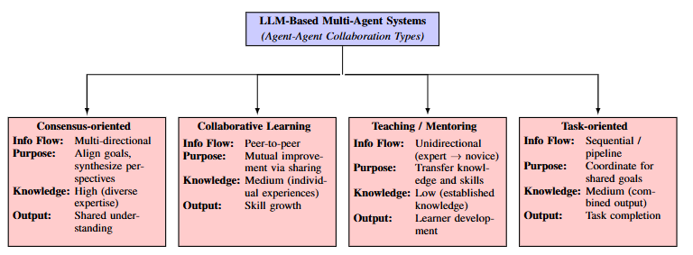

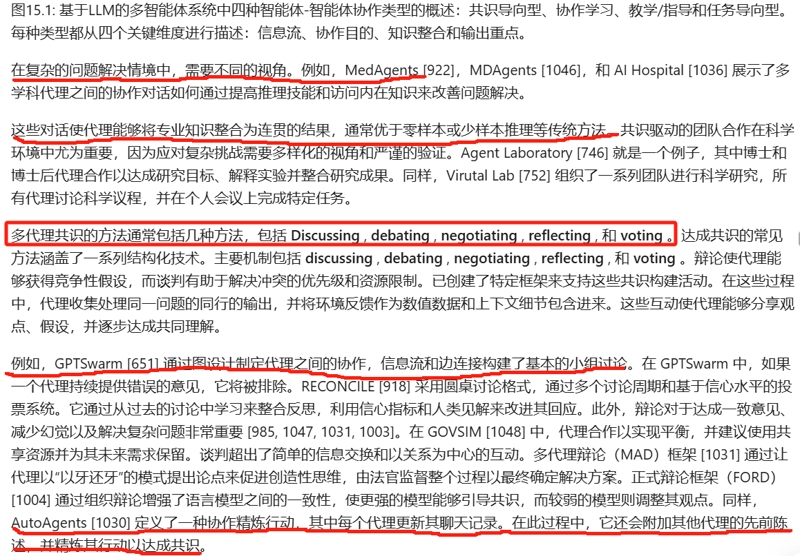

#### （2）协作学习互动

> 这种互动涉及相似的代理共享经验，以提高他们的策略学习、任务解决和技能获取能力。智能体通过观察他人的行为来更新他们的环境或记忆，他们合作学习和解决问题，专注于相互理解和增强，而不是达成一致的决定。例如MEDCO，学生代理通过由专家导师指导的以实践为导向的循环学习方法来提高专业技能；iAgents采用新颖的代理推理机制InfoNav来引导代理之间的沟通，以实现有效的信息交换。

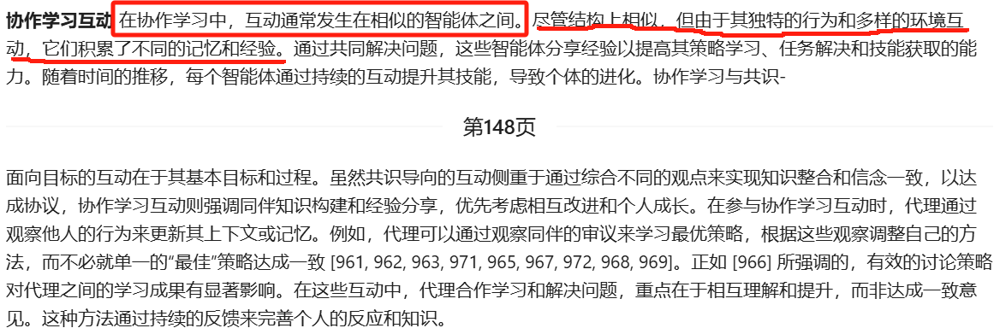

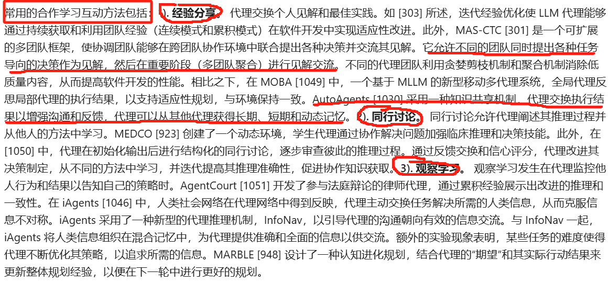

#### （3）教学/指导互动

> 与协作学习不同，在协作学习中，知识在代理之间相互交换，教学和指导互动侧重于知识从一个有经验的代理到一个没有经验的代理的单向流动。导师评估学习者的表现，并提供纠正或建设性的反馈，帮助学习者通过反馈循环完善他们的知识和技能。例如，MEDCO的专家代理人进行持续评估，并提供临床能力的实时指导；AgentCourt的律师代理人参与法庭辩论，并通过积累的经验进行改进。

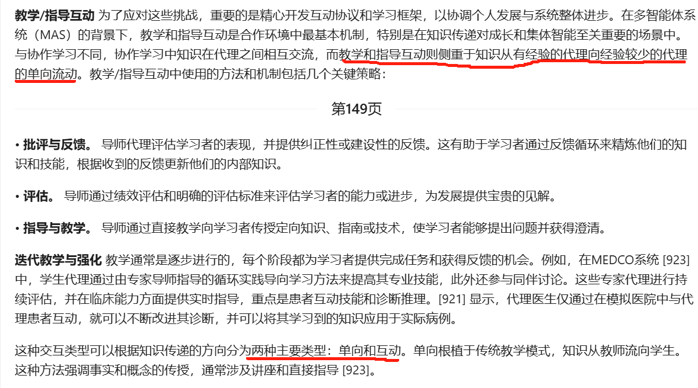

#### （4）面向任务的交互

> 这种类型的交互涉及agent通过有效的协调和任务分解策略，以及高度的合作和协调，共同努力实现共同的目标。代理的交互主要是通过处理上游的输出，并根据既定的任务依赖关系为下游代理生成结果，而不是参与复杂的讨论或辩论。例子包括软件开发框架，如MetaGPT和ChatDev，其中代理在反映软件开发生命周期的结构化管道中操作，以及协作推理框架，如思想交换（EoT）， GPTSwarm和MACNET，它们涉及以特定格式构建代理以减轻上下文扩展风险。

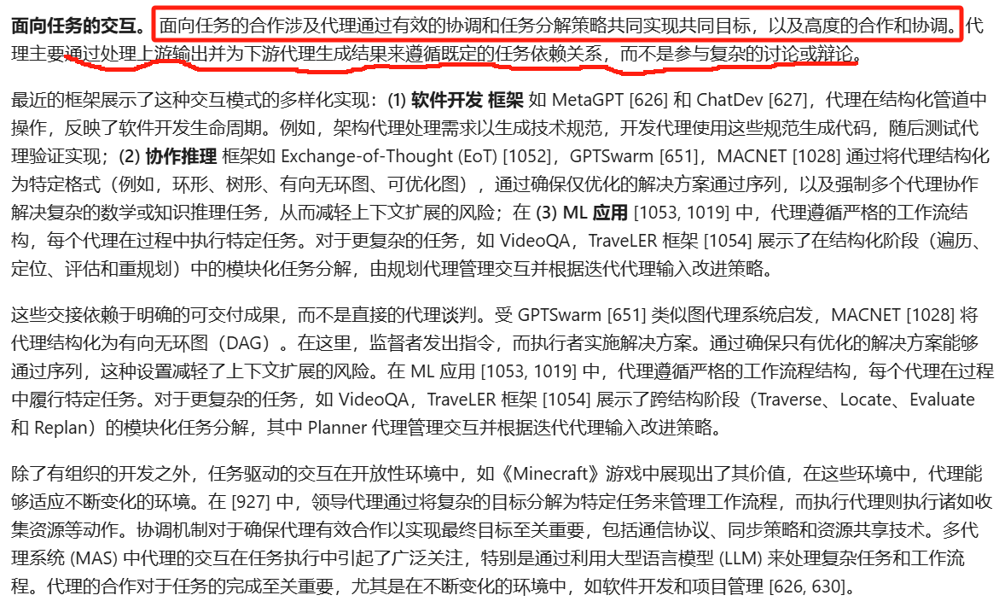

### 3.2 Human-AI 人机

人们通常使用三种主要方法与它们合作：**一次性任务委托**、**多轮交互指令**和**沉浸式人机协作**。

### 3.3 协作决策

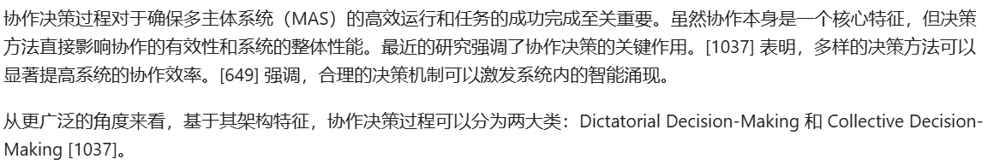

## 4、群体智能与涌现 (Collective Intelligence and Emergence)

在 MAS 中，群体智能的产生是一个动态且迭代的过程。**通过持续交互，智能体逐步形成共享理解和集体记忆。**个体智能体的异质性、环境反馈和信息交换增强了交互的动态性，这对复杂社会网络的形成和决策策略的改进至关重要。通过多轮交互和对共享上下文的反思，智能体不断提升推理和决策能力，产生如信任、战略欺骗、自适应伪装等涌现行为。按照进化形成机制，可分为基于记忆的学习和基于参数的学习。与此同时，随着 MAS 的演化，智能体之间逐渐将形成和演进社会契约、组织层级和劳动分工，从基础的合作行为转向复杂社会结构。观测、理解和研究群体智能的涌现现象是后续 MAS 研究的重要方向。

## 5、多智能体系统评估 (Evaluation of Multi-Agent Systems)

随着多智能体的优势成为共识，其评估范式亦需有根本性的变革 ——MAS 评估应聚焦于 Agent 交互的整体性，包括协同规划的效率、信息传递的质量与群体决策的性能等关键维度。由此衍生，作者总结了 MAS 常见的任务求解型 benchmark，以及最新的通用能力评估方式：前者的重点在于，衡量多智能体在各种环境中的决策协同的推理深度与正确性；后者评估智能体群在复杂、动态场景下的交互与适应能力。

# 04 安全对齐
