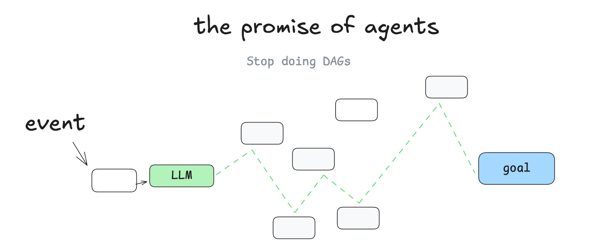

> 近期系统补充了一下Agent开发所需相关技术：LLM基础知识、Agent基础知识及核心机制、Agent开发、RAG开发、LLM训练与部署、开源项目学习等，但是还是没办法设计**一个好的Agent**，设计**一个好的系统架构**。
>
> How to Build Reliable AI Agents
>
> Agent development framework


todo:

- https://mp.weixin.qq.com/s/mYRMMJbKGZrZgvTK5PJs2A：包含一些Agent设计原则，以及一些Message相关的分析


# 总结

那么多资源和概念，到底哪些最重要？

参考：**12-Factor Agents、7 Building Blocks、Anthropic、LangChain** 的核心观点

------

我已为你整理出 **《Agent设计原则对比表》**，横向对比了 **12-Factor Agents、7 Building Blocks、Anthropic、LangChain** 的核心观点。这样可以一眼看出：

- **共识点**：
  - 工具调用是核心（自然语言 → 工具调用 / structured outputs）。
  - Prompt、Context、Memory 都要开发者自己掌控。
  - 控制流应显式、透明，不依赖黑盒。
  - Agent 应该小而专注，而不是大而全。
  - 状态应外置，Agent 更像 **stateless reducer**。
  - 人类应作为 Agent 的一环（审批、反馈）。
  - 恢复、验证、错误处理是必要能力。
- **差异化强调**：
  - **12-Factor** 更偏工程化最佳实践，像 DevOps 的 “12-Factor App”。
  - **7 Building Blocks** 更偏功能模块拆解，适合作为 Agent 设计 checklist。
  - **Anthropic** 更强调 **simplicity / transparency / reliability**，避免过度依赖框架。
  - **LangChain** 更强调 **workflow 与 agent 的结合**，以及 **模块化 orchestration**。

------

🧩 融合后的总结版 Agent 设计原则（综合四方观点）

1. **核心：Augmented LLM**
   - LLM 是智能核心，但必须增强：Prompt 管理、Context 管理、工具调用。
2. **增强能力：七大构件**
   - **Memory**：上下文和长期记忆。
   - **Tools**：结构化 API 调用（包括把人类作为一种工具）。
   - **Validation**：Schema 检查、结果校验。
   - **Control**：显式控制流，避免黑盒逻辑。
   - **Recovery**：错误压缩、重试、降级。
   - **Feedback**：人类监督与干预。
   - **Integration**：任意触发点，嵌入业务系统。
3. **设计原则**
   - **小而专注**：Agent 聚焦单一职责，避免 monolithic。
   - **无状态化**：状态外置（数据库、业务系统），Agent 只做 reducer。
   - **透明可控**：规划、执行、错误、决策必须显式。
   - **简洁优先**：能用 workflow 就不要过度抽象 Agent。
   - **可靠性**：API/工具接口需文档化、测试化，避免黑盒。
4. **架构模式**
   - **Workflow 模式**：链式调用、路由、并行、评估-优化。
   - **Agent 模式**：需要动态决策、复杂工具使用、跨状态协调时才使用。
   - **混合模式**：workflow 负责确定性部分，agent 负责非确定性决策。

------

📌 总结一句话：
 **Agent 的最佳实践是：以 LLM 为核心，构建小而专注、透明可控、无状态的增强体，结合工具、记忆、验证、恢复与人类反馈，嵌入业务系统，并在 workflow 与 agent 之间灵活切换。**


> 其他总结

参考：https://mp.weixin.qq.com/s/hGw7gKEFQtyEYs_Z6w4SBA

文章很实在

1）智能体的四个核心内容：

- 上下文：
  - 大模型本身没有记忆，类似函数，给他输入，返回计算结果。
  - 为了弥补上下文窗口的大小的限制，很多智能体的开发者都会对上下文进行压缩，此时，上下文中只包含三样东西：不变的系统提示词部分（用来指导智能体的行为）、压缩后的历史对话关键信息、最新的用户提问。目前，有ClaudeCode、Cline是这么做的（借助提示词压缩）。（具体方法和代码见原文）
- 工具：
  - 使用MCP
  - 中间提出了XML Tags VS JSON概念，XML在某些方面确实能够提升智能体的性能。所以有时会把json（涉及MCP/FunctionCall）转为XML
- 知识：
- 计划：

2）决定智能体表现的关键：系统提示词

- 


# 概述

[12-factor-agents](https://github.com/humanlayer/12-factor-agents)

- [How We Got Here: A Brief History of Software](https://github.com/humanlayer/12-factor-agents/blob/main/content/brief-history-of-software.md)
- [Factor 1: Natural Language to Tool Calls](https://github.com/humanlayer/12-factor-agents/blob/main/content/factor-01-natural-language-to-tool-calls.md)
- [Factor 2: Own your prompts](https://github.com/humanlayer/12-factor-agents/blob/main/content/factor-02-own-your-prompts.md)
- [Factor 3: Own your context window](https://github.com/humanlayer/12-factor-agents/blob/main/content/factor-03-own-your-context-window.md)
- [Factor 4: Tools are just structured outputs](https://github.com/humanlayer/12-factor-agents/blob/main/content/factor-04-tools-are-structured-outputs.md)
- [Factor 5: Unify execution state and business state](https://github.com/humanlayer/12-factor-agents/blob/main/content/factor-05-unify-execution-state.md)
- [Factor 6: Launch/Pause/Resume with simple APIs](https://github.com/humanlayer/12-factor-agents/blob/main/content/factor-06-launch-pause-resume.md)
- [Factor 7: Contact humans with tool calls](https://github.com/humanlayer/12-factor-agents/blob/main/content/factor-07-contact-humans-with-tools.md)
- [Factor 8: Own your control flow](https://github.com/humanlayer/12-factor-agents/blob/main/content/factor-08-own-your-control-flow.md)
- [Factor 9: Compact Errors into Context Window](https://github.com/humanlayer/12-factor-agents/blob/main/content/factor-09-compact-errors.md)
- [Factor 10: Small, Focused Agents](https://github.com/humanlayer/12-factor-agents/blob/main/content/factor-10-small-focused-agents.md)
- [Factor 11: Trigger from anywhere, meet users where they are](https://github.com/humanlayer/12-factor-agents/blob/main/content/factor-11-trigger-from-anywhere.md)
- [Factor 12: Make your agent a stateless reducer](https://github.com/humanlayer/12-factor-agents/blob/main/content/factor-12-stateless-reducer.md)


[The 7 Building Blocks](https://github.com/daveebbelaar/ai-cookbook/tree/main/agents/building-blocks)

- Intelligence: The only truly "AI" component / LLM supplier
- Memory: Context persistence across interactions
- Tools: External system integration capabilities
- Validation: Quality assurance and structured data enforcement
- Control: Deterministic decision-making and process flow
- Recovery: Graceful failure management
- Feedback: Human oversight and approval workflows


[Anthropic官方](https://github.com/anthropics/anthropic-cookbook/tree/main/patterns/agents)：Building effective agents

- What are agents?: Agent 和 Workflow 两类
- When (and when not) to use agents：LLM应用应尽可能简单，当面对更复杂的情况下，需要 Agent 和 Workflow
- When and how to use frameworks：建议开发人员直接从LLM API开始，使用框架简化了低级任务，但是，它们通常会创建额外的抽象层，从而掩盖了基本的提示和响应，从而使它们更难进行调试。
- Building blocks, workflows, and agents
  - Building block: The augmented LLM
    - enhanced with augmentations such as retrieval, tools, and memory
    - 两个关键方面：1）tailoring these capabilities to your specific use case and ensuring they provide an easy, well-documented interface for your LLM. 2）MCP
  - Workflow: 
    - Prompt chaining
    - Routing
    - Parallelization
    - Orchestrator-workers
    - Evaluator-optimizer
  - Agents
- Combining and customizing these patterns
- When implementing agents, we try to follow three core principles:
  - Maintain **simplicity** in your agent's design.
  - Prioritize **transparency** by explicitly showing the agent’s planning steps.
  - Carefully craft your agent-computer interface (ACI) through thorough tool **documentation and testing**.


LangChain官方：

- [How to think about agent frameworks](https://blog.langchain.com/how-to-think-about-agent-frameworks/)
- [Workflows and Agents](https://langchain-ai.github.io/langgraph/tutorials/workflows/)
- [Agent architecture](https://langchain-ai.github.io/langgraph/concepts/agentic_concepts/)

小结 - Workflows & Patterns（LangChain / Anthropic）：

```
Agent 不一定是万能的，有时候 Workflow 更合适：
- **Workflow 模式**：
  - Prompt chaining
  - Routing（路由不同模型或分支）
  - Parallelization（并行子任务）
  - Orchestrator-workers（协调器/工人模式）
  - Evaluator-optimizer（评估+优化循环）
- **Agent 模式**：
   适合需要**动态决策、工具调用、状态维护**的复杂任务。
```


[AI智能体常用五大范式](https://mp.weixin.qq.com/s/_0d-0xZ3DMGivlH6YD1OMA)：

- 反思
- 工具
- 推理
- 规划
- 多智能体协作


# 12-factor-agents

官方Github：https://github.com/humanlayer/12-factor-agents

大佬解读：

- https://mp.weixin.qq.com/s/-WlZWDckZx2qzryPOqRJzw


## 00 Agents are software, and a brief history thereof

参考[12-factor-agents](https://github.com/humanlayer/12-factor-agents/blob/main/content/brief-history-of-software.md)，Software Development 以及 Agent 的本质，可抽象为 **DAG（有向无环图）**：

- 每个节点对应一个子任务
- 面对众多节点，Agent会自主编排DAG



这样能天然支持“暂停/切换”，因为针对同一Agent，在新一轮对话中，你只要基于新的上下文，Agent会重新编排DAG，继续完成任务。


与 Workflow 的区别：

- **Workflow**：固定编排，目前工业应用较广，[适合短期业务落地，但同时也锁死了智能演进的路线](https://mp.weixin.qq.com/s/X17gt3KtxbjoNHRY-JMJBw)
- **Agent**：支持灵活编排

关于流程智能化和智能体智能化的讨论，

- 参考：[一篇关于AI Agent设计理念的深度思考](https://mp.weixin.qq.com/s/3DGLUjQ_KP5heVbf3PTTZA)，文章观点很直接，不要单一，要融合二者，不过没有提到详细方法


## 02 Own your prompts

核心思想

1. **不要依赖黑盒框架**
   - 一些框架把提示工程包装成“黑盒”配置（例如定义角色、目标、工具后直接调用 `agent.run(task)`）。
   - 这种方式方便上手，但难以调优或理解具体的提示细节。
2. **把提示当作一等公民（first-class code）**
   - 自己写提示，像写函数和逻辑代码一样管理。
   - 示例展示了如何把提示写进函数中，明确指令、上下文和步骤。
   - 可以用任何工具生成模板，甚至手写。
3. **拥有自己提示的好处**
   - **完全控制**：避免黑盒，能精确写出所需的指令。
   - **可测试与评估**：像普通代码一样对提示进行测试和验证。
   - **快速迭代**：根据实际效果灵活调整提示。
   - **透明度**：清楚知道模型接收到的每一句话。
   - **角色“黑客”能力**：利用 API 的非标准角色用法（例如旧的非 chat completion API），甚至尝试“模型煤气灯”等技巧。
4. **核心结论**
   - 提示是应用逻辑与大模型之间的**主要接口**。
   - 想要生产级的智能体，就必须掌握提示的灵活性和控制权。
   - 不是要找到“唯一最优提示”，而是要有足够的灵活性去尝试和迭代各种可能性。


##  03 Own your context window

核心思想：

------

核心观点

- **LLM 是无状态的函数**，输出质量完全取决于输入质量。因此，构建和优化上下文（Context Engineering）是提升 Agent 效果的关键。
- **上下文 = 主要接口**，你如何组织和呈现信息，直接决定了 Agent 的表现。

------

如何构建有效的上下文

1. **上下文要素**
    包括：提示与指令、外部检索数据（RAG）、历史记录、工具调用、记忆信息、结构化输出格式说明等。
2. **不依赖于固定格式**
   - 标准消息格式（system/user/assistant/tool）适合大多数情况。
   - 但你可以根据需要设计 **自定义上下文格式**（如 XML、YAML），提高信息密度和效率。
3. **关键特性**
   - **信息密度**：尽可能用更少的 token 表达更多有效信息。
   - **错误处理**：在上下文中清晰记录错误，便于 LLM 恢复；错误解决后可隐藏历史错误，避免干扰。
   - **安全性**：只传递必要的信息，过滤敏感数据。
   - **灵活性**：不断实验不同上下文结构，找到适合特定应用的最佳方式。
   - **令牌效率**：优化上下文输入，让 LLM 更容易理解，同时节省 token。

------

示例方法

- **标准方式**：多条 role-based 消息（system/user/assistant/tool）。
- **优化方式**：将上下文事件打包成单条 message，采用结构化标签（XML/JSON/YAML）统一传递。
- **事件流式存储**：将交互过程抽象为一系列事件，再转换为上下文输入。

------

总结

- **“拥有你的上下文窗口”意味着：不要被标准消息格式限制，而是主动设计适合自己应用的上下文结构。**
- 目标是：信息密集、结构清晰、错误可恢复、安全可控、格式灵活、token 高效。
- **核心经验法则**：没有固定的最佳方案，关键是保留灵活性，敢于尝试不同的上下文工程方法。


补充：[Context Engineering Cheat Sheet](https://x.com/lenadroid/status/1943685060785524824)


## 04 Tools are just structured outputs

核心观点

- **工具的本质是结构化输出**，而不是复杂逻辑。
- LLM 的任务是**决定做什么**，而你的代码负责**如何执行**。
- 通过将工具调用抽象为 JSON 或结构化对象，可以实现 LLM 决策与程序执行的清晰分离。

------

实现模式

1. **LLM 输出结构化 JSON**
   - 定义工具类和输入数据结构（例如 `CreateIssue`、`SearchIssues`）。
   - LLM 生成 JSON 对象描述要执行的操作及参数。
2. **确定性代码执行操作**
   - 根据 JSON 对象，执行相应的函数或调用外部 API。
   - 捕获结果并将其反馈回上下文，供下一步决策使用。
3. **上下文与控制**
   - “工具调用”本质是 LLM 输出指令，执行方式可以灵活处理。
   - 与上下文窗口（Context Window）结合，可以更好地管理决策和执行流程。

------

优势

- **清晰分工**：LLM 专注决策，程序专注执行。
- **灵活性**：同一 LLM 输出可以映射到不同的执行方式。
- **可扩展性**：增加新工具只需定义新的结构化输出与对应执行逻辑，无需改变 LLM 决策逻辑。

------

示例

```
if nextStep.intent == 'create_payment_link':
    stripe.paymentlinks.create(nextStep.parameters)
elif nextStep.intent == 'wait_for_a_while':
    # 执行其他操作
else:
    # 处理未知工具调用
```

这里 `nextStep` 是 LLM 输出的结构化对象，决定了下一步要做什么，但执行逻辑完全由程序控制。

------

总结

把工具看作 **“LLM 的结构化输出”** 而不是固定函数调用，能最大化灵活性与可控性，同时实现决策与执行的清晰分离。


## 05 Unify execution state and business state


# The 7 Building Blocks

参考：https://github.com/daveebbelaar/ai-cookbook/tree/main/agents/building-blocks


# agentic-design-patterns-cn

参考：https://github.com/ginobefun/agentic-design-patterns-cn/tree/main

