LangChain官网：https://python.langchain.com/docs/tutorials/


# LangChain基础

参考教程：https://www.youtube.com/watch?v=yF9kGESAi3M&t=94s

源码：https://github.com/bhancockio/langchain-crash-course/tree/main


教程使用LangChain2.0，涵盖一些基础开发内容。

LangChain官网也有很多教程，可以结合3.0的文档详细学习，不过难点还是高级应用，而不是按教程做一个Demo。


## Overview

环境配置

项目源码拉取方法

项目代码使用方法


poetry使用方法


## ChatModels

简易示例：

```
model = ChatOpenAI(mdoel="gpt-4o")
result = model.invoke("hello")
print(result)  # 查看消息结构
print(result.content)
```


> Basic Conversation：在上述基础上引入Message

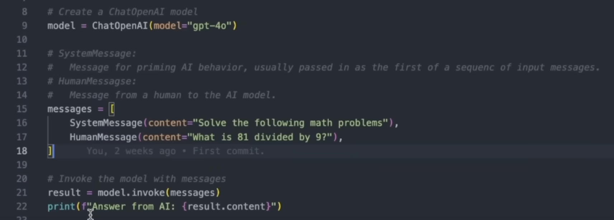


> Alternatives：将OpenAI模型换为其他厂家的模型

将ChatOpenAI换为其他接口即可


> Real Time Conversation

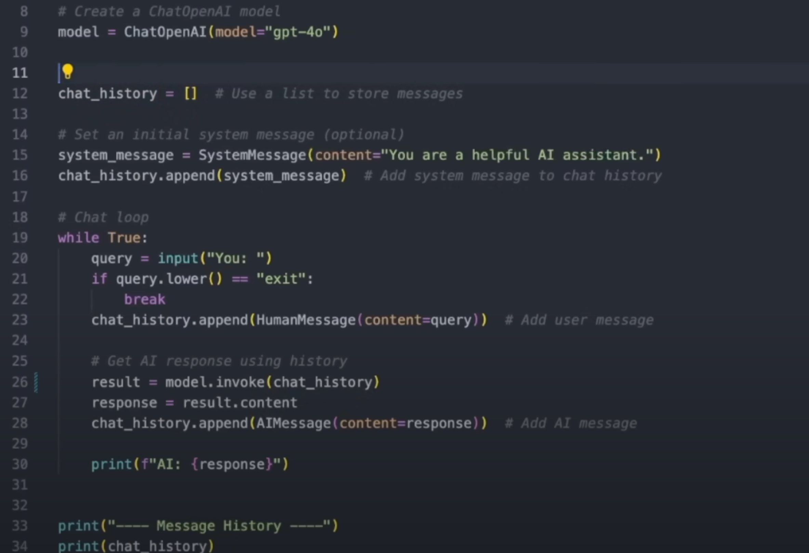


> Save Message History

将内容存储到Firebase上

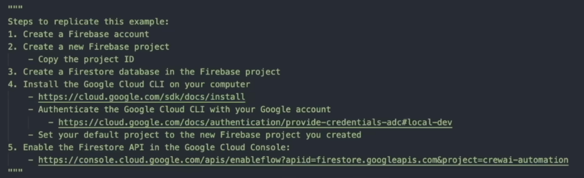


配置好相关对话id即可，会与云端实时同步

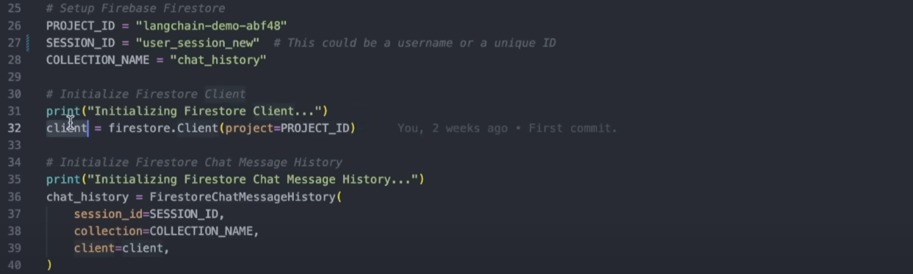

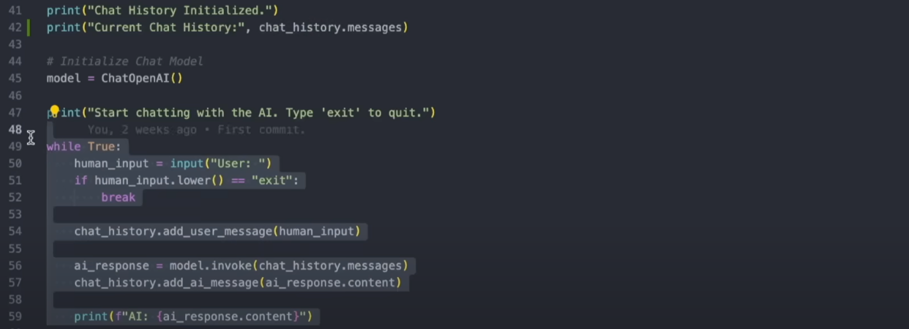


## Prompt

> Basic

替换单块或者多块内容

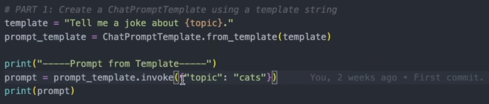


替换message

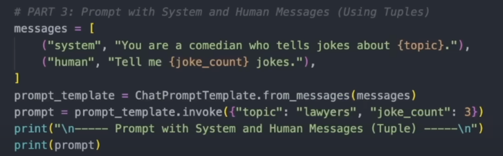


> With Chat Model

相比之前，只是借助了model.invoke

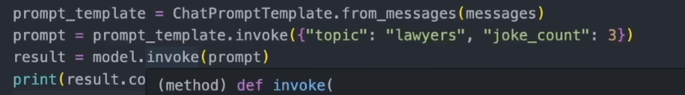


## Chain

> Chain Overview

多种类型的chain

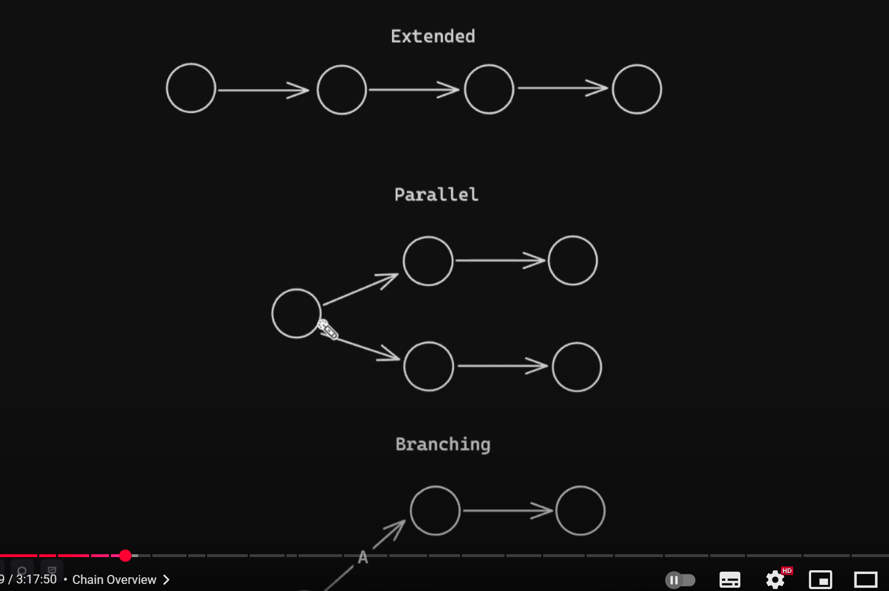


简易案例

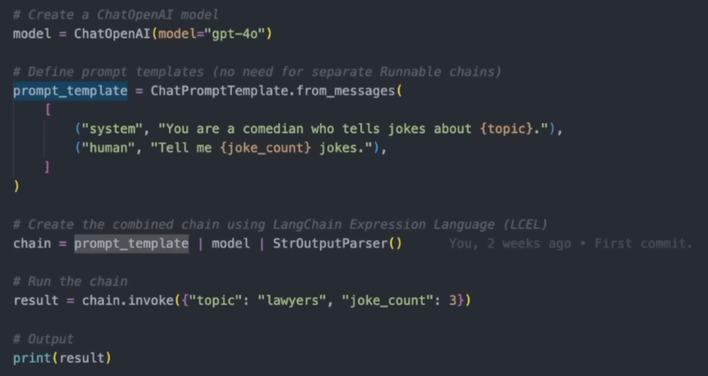


>Under The Hood

在LangChain 2.0中：

- **RunnableLambda** 是一个将普通 Python 函数或 lambda 表达式封装成 Runnable 对象的工具
- **RunnableSequence** 用于将多个 Runnable 组件串联起来执行

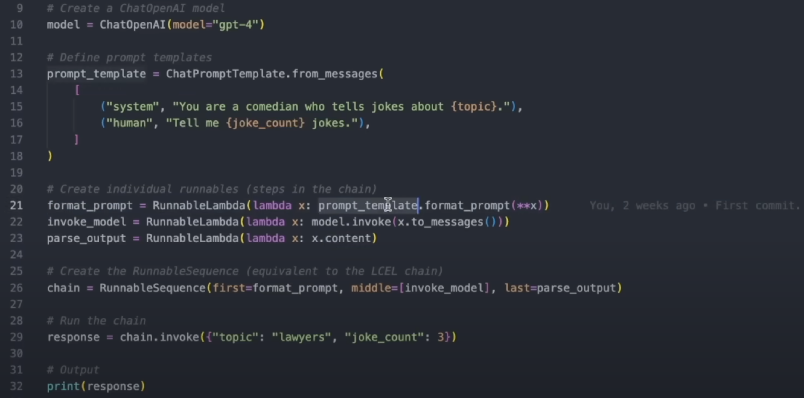


>Extended

串行链

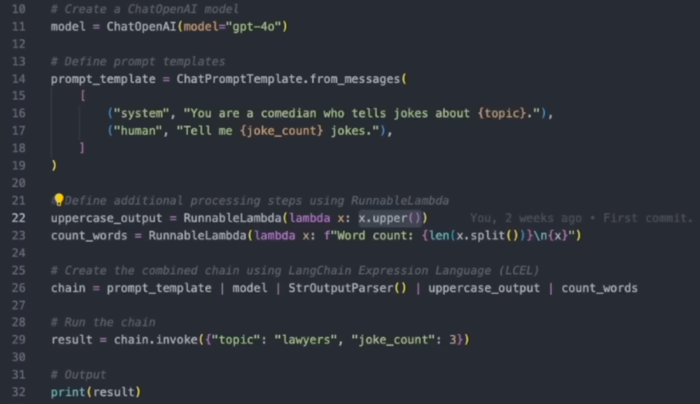

这是 LangChain 2 中一种非常典型、简洁且**函数式风格的 Chain 管道写法**。下面是这行链式代码的伪执行过程：

```
# 用户输入
user_input = {"question": "What is LangChain?"}

# 1. 模板渲染提示词
prompt = prompt_template.invoke(user_input)

# 2. 模型生成输出
model_response = model.invoke(prompt)

# 3. 输出解析为纯文本
text_output = StrOutputParser().invoke(model_response)

# 4. 转为大写
uppercased = uppercase_output.invoke(text_output)

# 5. 计算词数
word_count = count_words.invoke(uppercased)

```


再比如：

```
from langchain.runnables import RunnableLambda, RunnableSequence

# 步骤1：转为大写
to_upper = RunnableLambda(lambda x: x.upper())

# 步骤2：加上感叹号
add_exclamation = RunnableLambda(lambda x: x + "!")

# 步骤3：包装句子
wrap = RunnableLambda(lambda x: f"处理结果是：{x}")

# 构建顺序链
extended_chain = RunnableSequence([to_upper, add_exclamation, wrap])

# 执行
result = extended_chain.invoke("hello langchain")
print(result)  # 输出：处理结果是：HELLO LANGCHAIN!

```


>Parallel

并行链

 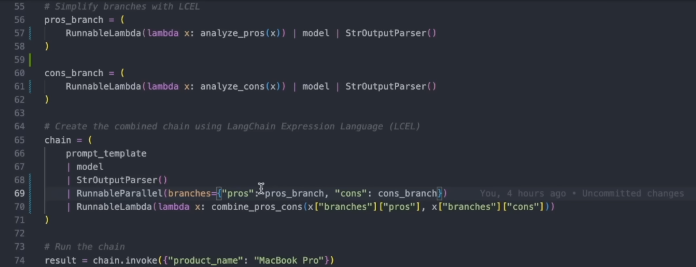

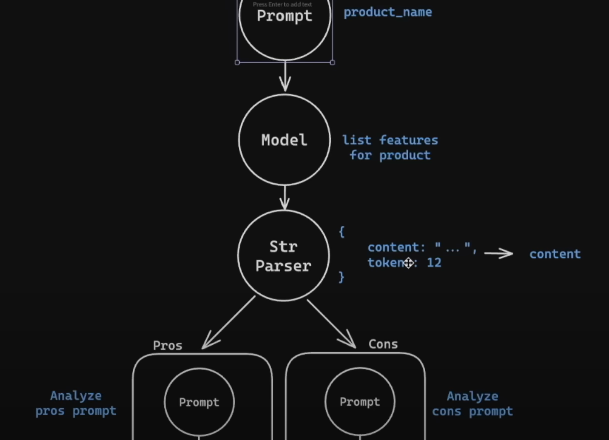


比如：

```
from langchain.runnables import RunnableLambda, RunnableMap

# 多个并行处理器
get_upper = RunnableLambda(lambda x: x.upper())
get_length = RunnableLambda(lambda x: len(x))
reverse_text = RunnableLambda(lambda x: x[::-1])

# 并行链：返回多个值
parallel_chain = RunnableMap({
    "upper": get_upper,
    "length": get_length,
    "reversed": reverse_text
})

# 执行
result = parallel_chain.invoke("langchain")
print(result)

# 输出示例：
# {
#   'upper': 'LANGCHAIN',
#   'length': 9,
#   'reversed': 'niahcnagnl'
# }

```


>Branching

分支链/条件链

 

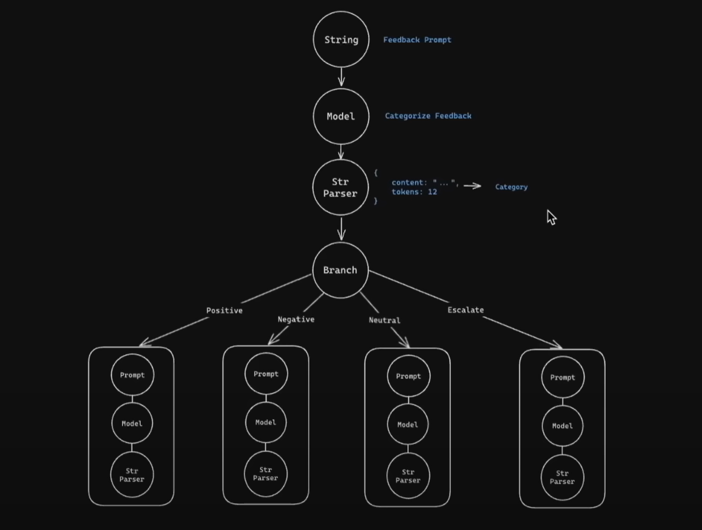


## RAG

>RAG Intro


>RAG Overview


>Basic Example


>Basic Example Part 1b


>Basic With Metadata


>Text Splitting


>Embedding


>Retriever


>One Off Question


>Conversational


>Web Scrapping


## Agent

>Tools - Basic

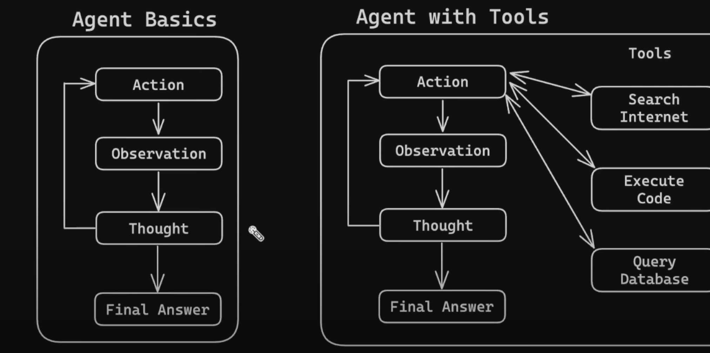


示例代码：

```python
# Define a very simple tool function that returns the current time
def get_current_time(*args, **kwargs):
    """Returns the current time in H:MM AM/PM format."""
    import datetime  # Import datetime module to get current time

    now = datetime.datetime.now()  # Get current time
    return now.strftime("%I:%M %p")  # Format time in H:MM AM/PM format


# List of tools available to the agent
tools = [
    Tool(
        name="Time",  # Name of the tool
        func=get_current_time,  # Function that the tool will execute
        # Description of the tool
        description="Useful for when you need to know the current time",
    ),
]

# Pull the prompt template from the hub
# ReAct = Reason and Action
# https://smith.langchain.com/hub/hwchase17/react
prompt = hub.pull("hwchase17/react")

# Initialize a ChatOpenAI model
llm = ChatOpenAI(
    model="gpt-4o", temperature=0
)

# Create the ReAct agent using the create_react_agent function
agent = create_react_agent(
    llm=llm,
    tools=tools,
    prompt=prompt,
    stop_sequence=True,
)

# Create an agent executor from the agent and tools
agent_executor = AgentExecutor.from_agent_and_tools(
    agent=agent,
    tools=tools,
    verbose=True,
)

# Run the agent with a test query
response = agent_executor.invoke({"input": "What time is it?"})

# Print the response from the agent
print("response:", response)

```


其中，prompt通过如下方式加载

```
from langchain import hub

# Load the correct JSON Chat Prompt from the hub
prompt = hub.pull("hwchase17/structured-chat-agent")
```


>React Chat


>React Docstore


>Tools - Constructor


>Tools - Base Tools


## Outro


# LangChain 1.0

参考：

- https://www.luochang.ink/dive-into-langgraph/
- https://www.learngraph.online/LangChain%201.X/README.html


# 实战经验

> 参考：[使用 RAG、LangChain、FastAPI 与 Streamlit 构建 Text-to-SQL 聊天机器人](https://mp.weixin.qq.com/s/9_0JlZaLu8KuA2gnNJHI0g)

系统架构与关键技术：系统采用模块化设计，主要组件包括

1. SQLite数据库：存储结构化数据。
2. Embedding层：将数据库的表结构（Schema）和样本数据转换为向量表示。
3. 向量数据库：存储Schema的向量，用于语义搜索，快速检索与用户问题最相关的表/列信息。
4. LangChain：作为“大脑”，编排整个RAG流程（检索 -> 生成 -> 校验 -> 执行）。
5. FastAPI后端：提供RESTful API，封装整个Text-to-SQL管道，处理用户查询请求。
6. Streamlit前端：提供简洁的Web聊天界面，供用户输入问题并直观查看生成的SQL和查询结果。

RAG工作流程：对于每个用户查询，系统按以下步骤执行

1. 检索：将用户问题向量化，在Chroma中检索最相关的数据库Schema片段。
2. 生成：LLM结合用户问题和检索到的Schema上下文，生成单一的`SELECT`查询语句。
3. 校验：对生成的SQL进行严格的安全校验（如只允许只读查询、检查表名白名单），防止恶意操作。
4. 执行：在SQLite数据库上安全执行校验通过的SQL，并将结果返回给用户。
