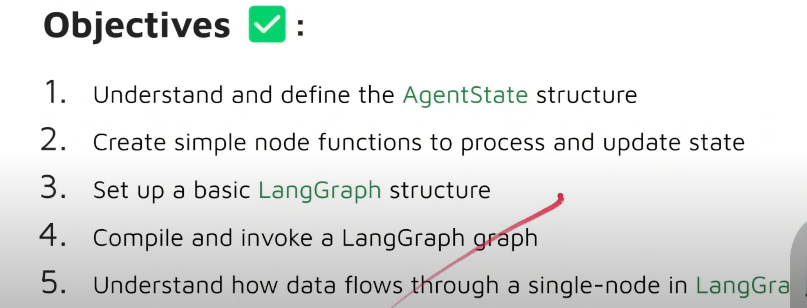
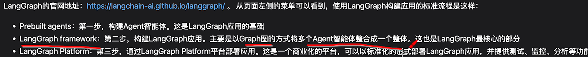
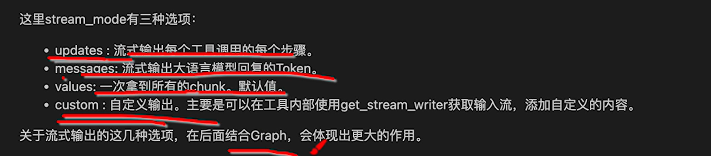
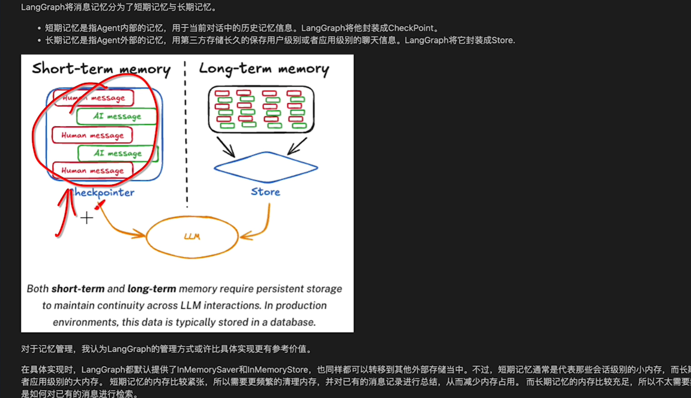
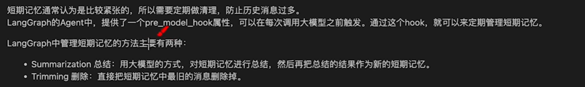
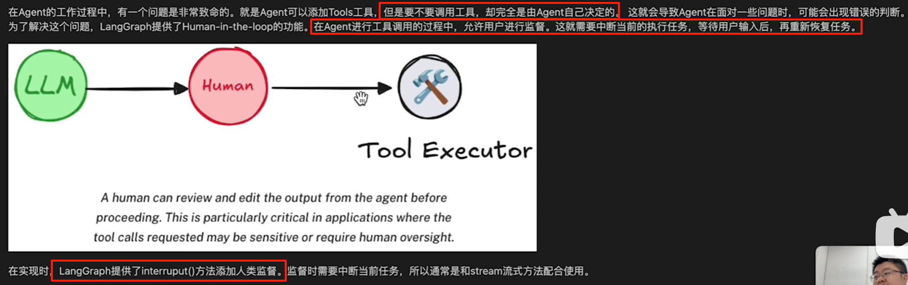
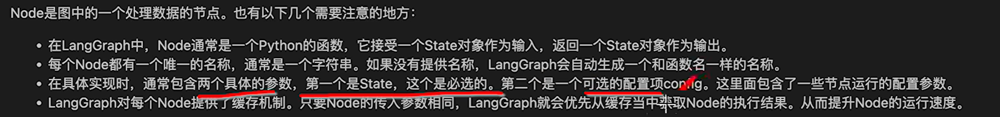
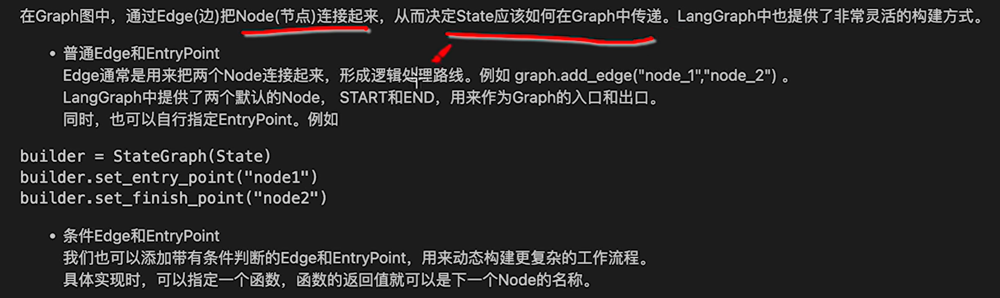
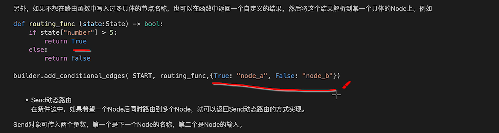
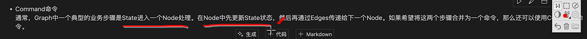

# 01 LangGraph基础

官网文档（写的很清晰，建议先看完）：

- https://langchain-ai.github.io/langgraph/
- https://langchain-ai.github.io/langgraph/agents/overview/


## 课程1

参考教程（0基础课程）：https://www.youtube.com/watch?v=jGg_1h0qzaM

参考源码：https://github.com/iamvaibhavmehra/LangGraph-Course-freeCodeCamp


介绍几种数据类型：dict、typing.TypeDict、typing.Union、typing.Optional、typing.Any，以及Lambda Function

- 关于这些类型的好文：https://mp.weixin.qq.com/s/r3cgGTodt4z4yYLRGKdwPQ

这些在LangGraph中应用广泛


接下来介绍LangGraph中的各种元素

1、State

2、Node

3、Graph

4、


五种消息类型：Human Message、System Message、Function Message、AI Message、Tool Message




## 课程2

参考教程：https://www.bilibili.com/video/BV1nPMbzQELz


### 一、快速了解LangGraph

讲了怎么看官网文档



LangChain与LangGraph构建Agent的Demo


### 二、构建Agent

基于create_react_agent创建agent

基于invoke获取结果，基于`for chunk in agent.stream`获取流式结果




添加工具：在create_react_agent中加入tool参数

与LangChain不同，工具无必添加@tool装饰器，不过也可以加


关于Memory



短期记忆的管理




关于Human-in-the-loop



可以在函数中添加interrupt方法等


### 三、接入MCP

略


### 四、深入理解Graph

1、什么是Graph

LangGraph的图是有向无环图（DAG），主要包含三个基本元素

- State
- Node
- Edge


1）State状态

形式上，可以使TypeDict，也可以是Pydantic中的BaseModel，两种实现本质上没有太多区别。

State中也可以添加一些操作


2）Node

各个node节点的输入是定义好的State结构




3）Edge



不喜欢用start和end，也可以使用sert_entry_point和set_finish_point








4）子图


### 五、构建多Agent工作流

略


# 02 LangGraph进阶

## 1、深入机制

InMemoryStore用法：[LangGraph 记忆系统实战：反馈循环 + 动态 Prompt 让 AI 持续学习](https://mp.weixin.qq.com/s/8DHpRyF8-x2U3o-tzCg5wA)

以及持久化、状态可视化与人工介入：[让 AI 会记忆、能暂停、可插手的断点恢复与流式控制](https://mp.weixin.qq.com/s/DfLqNRGBQUMeKhHOTD_aDQ)


### 一、State

#### 1）State是什么

> 参考：
>
> - [深入理解LangGraph状态流转](https://mp.weixin.qq.com/s/Iu_4sLYYwkSW8UvyqwonFg)

State管理：

1. **State是什么**：在整个流程中共享的数据容器，一个结构化对象（dict / TypedDict / Pydantic）
2. **基本用法**：每个节点读取State，处理后返回更新的部分，LangGraph可以进行合并更新
3. **TypedDict**：让代码更严谨，避免运行时错误
4. **Reducer机制**：控制State的更新方式（覆盖、追加等）
5. **add_messages**：智能管理消息列表的专用Reducer
6. **实战应用**：构建带记忆的聊天机器人


#### 2）多智能体与State

可参考官网示例代码：

- https://docs.langchain.com/oss/python/langchain/multi-agent

关于SubAgent的补充：

- https://docs.langchain.com/oss/python/langgraph/use-subgraphs
- 子图的用法经验：[学会SubGraph，复杂度直接降维打击](https://mp.weixin.qq.com/s/WQi92DcUIwEgQecAFk40pQ)

------

概述：

- **Subagent / Skill / Router** 👉 State 是“主 agent 或流程的”，不是 agent 自己的
- **Handoff / Custom Workflow** 👉 State 是“系统级的”，agent 只是 State 的操作者

| 模式            | 是否有统一 State | Agent 能看到全部 State？ | Agent 能直接改 State？ |
| --------------- | ---------------- | ------------------------ | ---------------------- |
| Subagent        | ✅（在主 agent）  | ❌                        | ❌                      |
| Skill           | ✅（在主 agent）  | ⚠️（部分）                | ⚠️（通过工具）          |
| Router          | ⚠️（多为一次性）  | ⚠️                        | ⚠️                      |
| Handoff         | ✅（强 State）    | ⚠️                        | ✅                      |
| Custom Workflow | ✅（唯一 State）  | ✅（取决于你）            | ✅                      |

```
Subagent  →  主代理独占 State
Skill     →  扩展主代理 State
Router    →  请求级 State
Handoff   →  状态机 State
Workflow  →  全图 State
```

------

1️⃣ **Subagents（子代理）**：看不见 State，只收“参数”

> Subagent = 一个函数 / 工具，不是 Graph 节点
>
> 👉 Subagent 之间不共享 State
> 👉 Subagent 永远是“无状态”的

```
State ──▶ 主 agent ──▶ subagent(input)
                     ◀── result
State ←── 主 agent（决定是否更新）
```

State 怎么管？

- **真正的 State 在主 agent 手里**
- 调用 subagent 时：
  - 主 agent **把 State 的一部分当参数传进去**
  - subagent **完全不知道 State 的存在**
- subagent 的返回值：
  - 只是一个结果
  - 是否写入 State，由主 agent 决定

👉 本质：**Stateless worker + Stateful orchestrator**

- **子代理本身是无状态的**（每次调用都是新的）。
- **State 由主代理统一维护**，子代理只是“被调用的工具”。
- 子代理的输出必须由主代理**显式写回 State**，否则不会被记住。

------

2️⃣ **Handoffs（状态切换）：**共享 State，但按阶段看

>Handoff = 状态机
>
>State 驱动的流程控制
>
>👉 **所有 agent 共享 State**
>👉 **但通常只“当前 agent”在工作**
>👉 **不是并发修改**

```
State(current_step=A)
        ↓
Agent A
        ↓ update
State(current_step=B)
        ↓
Agent B
```

State 怎么管？

- 有一个 **强约束的 State**
  - 如：`current_step`
- 当前 active agent：
  - 读取 State
  - 决定下一步
- Handoff tool：
  - 显式 `update State`
  - 改变流程走向

👉 本质：**State 驱动的流程控制**

- **核心就是 State Machine**。
- State 中通常有 `current_step / active_agent` 之类的字段。
- Tool 通过 `Command(update={...})` **更新 State 并触发下一阶段**。
- State **跨 turn 持久存在**，决定后续由哪个 agent / 配置接手。

------

3️⃣ **Skills（技能）**：不直接碰 State，只“污染上下文”

> Skill = 给主 agent“装插件”

```
State
 ├─ system_prompt += skill prompt
 ├─ tools += skill tools
 └─ active_skills += skill_name
```

State 怎么管？

- Skill 通常通过 tool：
  - 往 State 里写：
    - `active_skills`
    - `system_prompt`
    - `available_tools`
- Skill 本身：
  - 不维护 State
  - 不知道别的 Skill 做了什么
- 主 agent 决定：
  - 什么时候加载 Skill
  - Skill 影响是否长期存在

👉 本质：**State 中的能力增强（Context Enrichment）**

- Skill 自身不维护独立 State。
- **Skill 通过修改主代理的上下文 / State 来生效**（例如加载提示词、工具）。
- 哪些 skill 已加载、技能上下文是否生效，都存在主代理 State 里。

------

4️⃣ **Router（路由）**：State 只是“草稿纸”

>Router = 一次请求的调度器

```
query
  ↓
router
  ↓
[agent A]   [agent B]
  ↓           ↓
results[] ←───┘
  ↓
synthesizer
```

State 怎么管？

- Router 通常：
  - 创建一个**临时 State**
  - 包含：
    - 分类结果
    - 子 agent 输出
- 每个子 agent：
  - **只拿到自己那份输入**
  - **不知道其它 agent 的存在**
- 汇总节点：
  - 读取 State
  - 生成最终答案

👉 本质：**为一次请求服务的流程级 State**

- State 通常是**结构化的路由结果**（分类、子结果、汇总信息）。
- Router 本身多为**一次性 / 可无状态**。
- 是否跨 turn 记忆，取决于你是否把 Router State 持久化。

------

5️⃣ **Custom Workflow（自定义工作流 / StateGraph）**：你说了算

>Custom Workflow = 真正的“State 流水线”

```
State
 ↓
node A ──┐
          ├─ merge → State
node B ──┘
 ↓
node C
```

State 怎么管？

- **只有一个 State**
- 每个 node：
  - 拿到完整 State（你决定字段）
  - 返回 `{field: value}`
- LangGraph：
  - 合并
  - 传给下一个 node
- 并行节点：
  - 用 reducer 决定怎么合并

👉 本质：**完全可控的显式 State 流**

- **State 完全由你定义**（TypedDict / Pydantic）。
- 每个节点接收完整 State，返回部分更新。
- LangGraph 负责**合并、传递、并行聚合 State**。
- State 在整个图执行过程中持续演化。


### 二、ReAct

> LangGraph的ReAct：[ReAct范式深度解析：从理论到LangGraph实践](https://mp.weixin.qq.com/s/yiE8GJCmuxaxGNxSBGKrZw)

原文中 `二、LangGraph中的ReAct实现机制` 和 `三、create_react_agent源码解析` 可以仔细读一下


## 2、踩坑经验

参考：[生产环境跑LangGraph半年了，我整理了这份避坑指南](https://mp.weixin.qq.com/s/Uy474q5R-uN5RXl12q_28Q)


## 3、项目案例

Manus简易复现：
- [练习两周半，完全从零开始实现Manus（LangGraph，智能数据分析报告生成）](https://www.bilibili.com/video/BV1SBM2zHEAQ)
- https://github.com/wyf3/llm_related/tree/main/langgraph_agent
