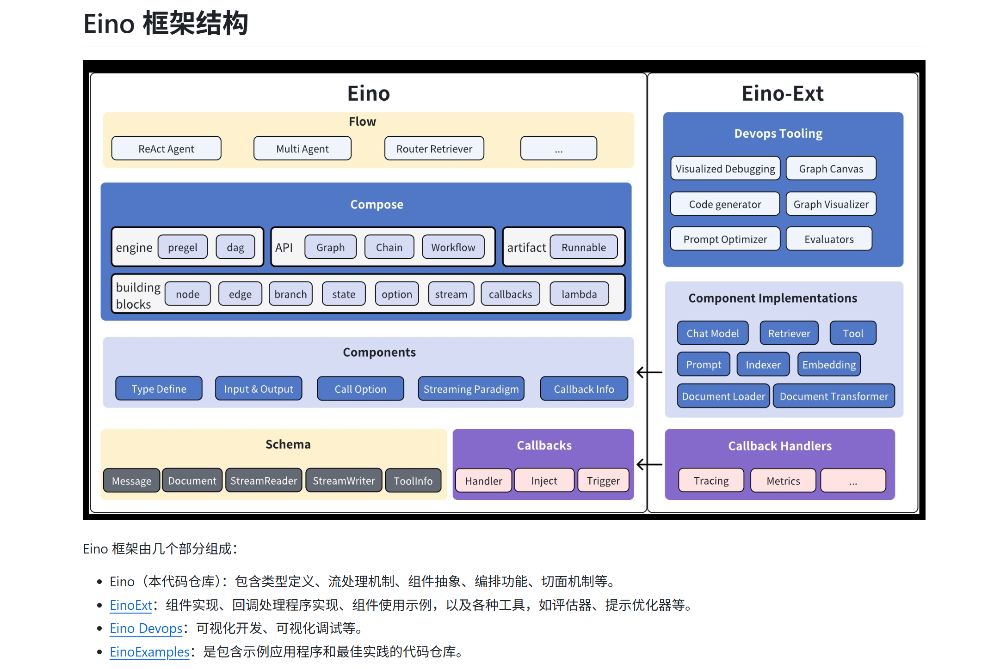

官网：https://www.cloudwego.io/zh/docs/eino/

参考教程：[【Eino/Go】Go版Langchain！Eino大模型框架入门实战教程](https://www.bilibili.com/video/BV17SudzfEGX)


## 快速开始

架构：




### 组件：ChatModel

#### 1）简易示例

初始化项目，并安装依赖：

```go
go get github.com/cloudwego/eino-ext/components/model/openai@latest
go get github.com/joho/godotenv
```

创建配置文件`.env`：这里利用OpenRouter提供OpenAI模型服务，由官网可知，Ollama、Gemini等均可支持

```go
OPENAI_API_KEY=***
OPENAI_MODEL=openai/gpt-4o-mini
OPENAI_BASE_URL=https://openrouter.ai/api/v1
```

示例代码：这里参考官网的[ChatModel - openai示例代码](https://www.cloudwego.io/zh/docs/eino/ecosystem_integration/chat_model/chat_model_openai/)，并将"OPENAI_API_KEY"等参数，基于`godotenv`从`.env`文件中读取

```go
package main

import (
	"context"
	"fmt"
	"log"
	"os"

	"github.com/cloudwego/eino-ext/components/model/openai"
	"github.com/cloudwego/eino/schema"
	"github.com/joho/godotenv"
)

func main() {
	err := godotenv.Load()
	if err != nil {
		// 建议：如果找不到 .env 文件，只打印警告，而不是 Fatal 退出，
		// 以便在生产环境中继续读取系统环境变量。
		log.Printf("Warning: Error loading .env file (May be expected in production): %v", err)
	}

	ctx := context.Background()

	chatModel, err := openai.NewChatModel(ctx, &openai.ChatModelConfig{
		APIKey:  os.Getenv("OPENAI_API_KEY"),
		Model:   os.Getenv("OPENAI_MODEL"),
		BaseURL: os.Getenv("OPENAI_BASE_URL"),
		ByAzure: func() bool {
			if os.Getenv("OPENAI_BY_AZURE") == "true" {
				return true
			}
			return false
		}(),
		ReasoningEffort: openai.ReasoningEffortLevelHigh,
	})
	if err != nil {
		log.Fatalf("NewChatModel failed, err=%v", err)
	}

	resp, err := chatModel.Generate(ctx, []*schema.Message{
		{
			Role:    schema.User,
			Content: "as a machine, how do you answer user's question?",
		},
	})
	if err != nil {
		log.Fatalf("Generate failed, err=%v", err)
	}
	fmt.Printf("output: \n%v", resp)

}

```

示例输出：

```go
output: 
assistant: As a machine learning model, I generate responses to user questions by analyzing the input and using patterns learned from a large dataset of text. Here's a simplified overview of the process:

1. **Input Understanding**: When a user asks a question, I first process the text to understand its structure and meaning. This involves tokenization (breaking the text into smaller units), identifying keywords, and determining the overall context.

2. **Pattern Recognition**: I then use the patterns learned during training on vast amounts of data to predict what kind of information is likely to be relevant to the question. This includes understanding common phrases, known facts, and relationships between concepts.

3. **Response Generation**: Based on the identified patterns and context, I generate a coherent and relevant response. This involves selecting appropriate words and crafting sentences that fit the inquiry.

4. **Output**: Finally, I present the generated text as a response to the user.

Throughout this process, I do not remember past interactions and do not have personal experiences or emotions; my responses are purely based on patterns learned from the data.
finish_reason: stop
usage: &{18 {0} 218 236}
```


#### 2）三种方法

结合官网和源码可知，

1、Generate 方法

- 功能：生成完整的模型响应
- 参数：
  - ctx：上下文对象，用于传递请求级别的信息，同时也用于传递 Callback Manager
  - input：输入消息列表
  - opts：可选参数，用于配置模型行为
- 返回值：
  - `schema.Message`：模型生成的响应消息
  - error：生成过程中的错误信息

2、Stream 方法

- 功能：以流式方式生成模型响应
- 参数：与 Generate 方法相同
- 返回值：
  - `schema.StreamReader[*schema.Message]`：模型响应的流式读取器
  - error：生成过程中的错误信息

3、WithTools 方法

- 功能：为模型绑定可用的工具
- 参数：
  - tools：工具信息列表
- 返回值：
  - ToolCallingChatModel: 绑定了 tools 后的 chatmodel
  - error：绑定过程中的错误信息

相关源码如下：

```go
func (cm *ChatModel) Generate(ctx context.Context, in []*schema.Message, opts ...model.Option) (
	outMsg *schema.Message, err error) {
	ctx = callbacks.EnsureRunInfo(ctx, cm.GetType(), components.ComponentOfChatModel)
	out, err := cm.cli.Generate(ctx, in, opts...)
	if err != nil {
		return nil, convOrigAPIError(err)
	}
	return out, nil
}

func (cm *ChatModel) Stream(ctx context.Context, in []*schema.Message, opts ...model.Option) (outStream *schema.StreamReader[*schema.Message], err error) {
	ctx = callbacks.EnsureRunInfo(ctx, cm.GetType(), components.ComponentOfChatModel)
	out, err := cm.cli.Stream(ctx, in, opts...)
	if err != nil {
		return nil, convOrigAPIError(err)
	}
	return out, nil
}

func (cm *ChatModel) WithTools(tools []*schema.ToolInfo) (model.ToolCallingChatModel, error) {
	cli, err := cm.cli.WithToolsForClient(tools)
	if err != nil {
		return nil, err
	}
	return &ChatModel{cli: cli}, nil
}
```

上述案例中，我们使用了Generate方法，下面尝试使用Stream方法：

```go
package main

import (
	"context"
	"log"
	"os"

	"github.com/cloudwego/eino-ext/components/model/openai"
	"github.com/cloudwego/eino/schema"
	"github.com/joho/godotenv"
)

func main() {
	err := godotenv.Load()
	if err != nil {
		// 建议：如果找不到 .env 文件，只打印警告，而不是 Fatal 退出，
		// 以便在生产环境中继续读取系统环境变量。
		log.Printf("Warning: Error loading .env file (May be expected in production): %v", err)
	}

	ctx := context.Background()

	chatModel, err := openai.NewChatModel(ctx, &openai.ChatModelConfig{
		APIKey:  os.Getenv("OPENAI_API_KEY"),
		Model:   os.Getenv("OPENAI_MODEL"),
		BaseURL: os.Getenv("OPENAI_BASE_URL"),
		ByAzure: func() bool {
			if os.Getenv("OPENAI_BY_AZURE") == "true" {
				return true
			}
			return false
		}(),
		ReasoningEffort: openai.ReasoningEffortLevelHigh,
	})
	if err != nil {
		log.Fatalf("NewChatModel failed, err=%v", err)
	}

	// resp, err := chatModel.Generate(ctx, []*schema.Message{
	// 	{
	// 		Role:    schema.User,
	// 		Content: "as a machine, how do you answer user's question?",
	// 	},
	// })
	// if err != nil {
	// 	log.Fatalf("Generate failed, err=%v", err)
	// }
	// fmt.Printf("output: \n%v", resp)

	// 准备消息
	messages := []*schema.Message{
		schema.SystemMessage("你是一个助手"),
		schema.UserMessage("你好"),
	}

	// 获取流式回复
	reader, err := chatModel.Stream(ctx, messages)
	if err != nil {
		panic(err)
	}
	defer reader.Close() // 注意要关闭

	// 处理流式内容
	for {
		chunk, err := reader.Recv()
		if err != nil {
			break
		}
		print(chunk.Content)
	}
}

```

示例输出：

```go
你好！有什么我可以帮助你的吗？
```


### 组件：Tool

解决报错中

```
package main

import (
	"context"
	"fmt"
	"log"
	"os"

	"github.com/cloudwego/eino-ext/components/model/openai"
	"github.com/cloudwego/eino/components/tool/utils"
	"github.com/cloudwego/eino/schema"
	"github.com/joho/godotenv"
)

func main() {
	err := godotenv.Load()
	if err != nil {
		log.Printf("Warning: Error loading .env file (May be expected in production): %v", err)
	}

	ctx := context.Background()

	/* ---------- 1. 准备大模型 ---------- */
	llm, err := openai.NewChatModel(ctx, &openai.ChatModelConfig{
		APIKey:  os.Getenv("OPENAI_API_KEY"),
		Model:   os.Getenv("OPENAI_MODEL"),
		BaseURL: os.Getenv("OPENAI_BASE_URL"),
	})

	if err != nil {
		log.Fatalf("Failed to initialize OpenAI ChatModel: %v", err)
	}

	/* ---------- 2. 构造工具 ---------- */
	weatherTool, err := utils.InferTool(
		"weather", "查询城市天气", // // tool name
		func(_ context.Context, in map[string]any) (map[string]any, error) {
			return map[string]any{"city": in["city"], "weather": "晴天 25℃"}, nil
		})
	if err != nil {
		log.Fatalf("Failed to initialize weather tool: %v", err)
	}
	info, _ := weatherTool.Info(ctx)

	// 1. 先调用 WithTools 获取接口类型的模型
	toolLlm, err := llm.WithTools([]*schema.ToolInfo{info})
	if err != nil {
		log.Fatalf("Failed to bind tools: %v", err)
	}
	// 2. 类型断言：将接口转换为原类型 *openai.ChatModel
	llm, ok := toolLlm.(*openai.ChatModel)
	if !ok {
		log.Fatalf("Tool model is not of type *openai.ChatModel")
	}

	/* ---------- 3. 调用模型生成回答 ---------- */
	msgs := []*schema.Message{
		schema.SystemMessage("你是一个天气助手，必要时调用工具"),
		schema.UserMessage("深圳明天天气怎么样？"),
	}
	reply, err := llm.Generate(ctx, msgs)
	if err != nil {
		log.Fatalf("Failed to generate reply: %v", err)
	}
	fmt.Println(reply.Content)
}

```


## 核心模块

### 组件：ChatTemplate


## Eino ADK

官网：[Eino ADK: 概述](https://www.cloudwego.io/zh/docs/eino/core_modules/eino_adk/agent_preview/)

