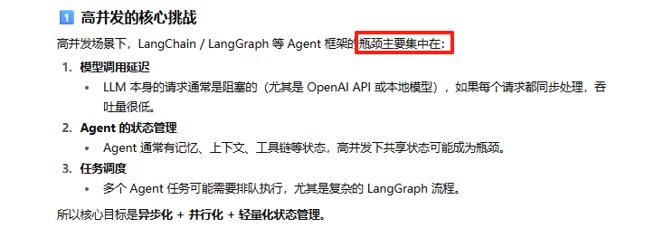
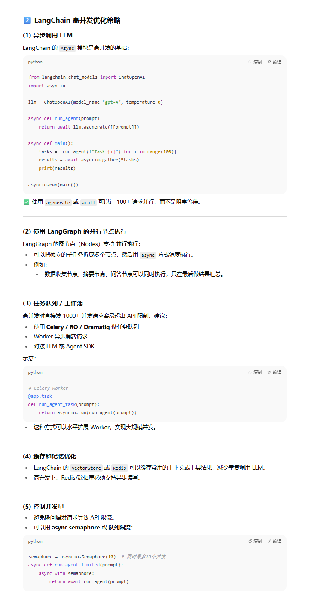
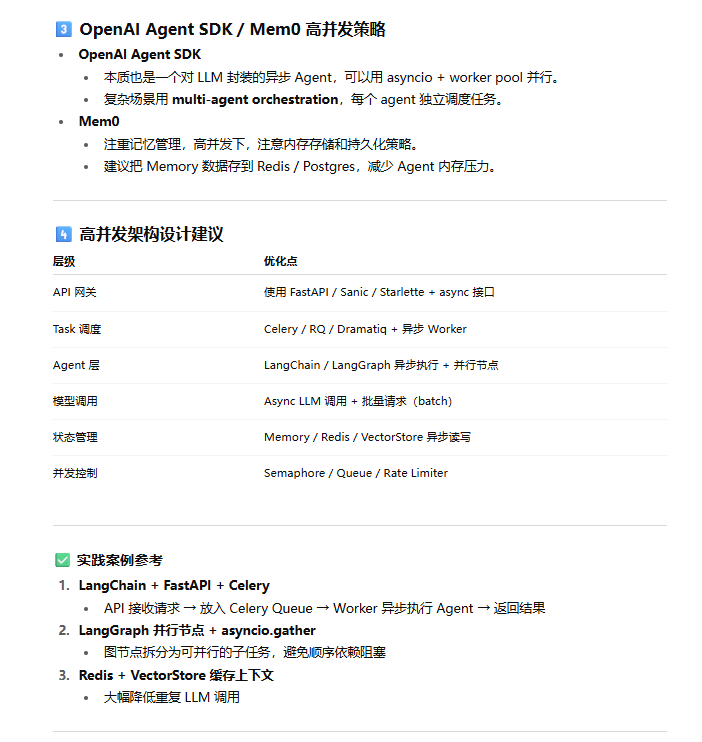

如何基于LangChain/LangGraph、OpenAI Agent SDK、Mem0等框架做高并发？

一些博客：

- [LangChain应用 - 处理高并发和高吞吐量](https://apxml.com/zh/courses/langchain-production-llm/chapter-6-optimizing-scaling-langchain/handling-high-concurrency)
- 

结合大模型的回答：特别是LangChain高并发优化策略中提到的5点，挺切合实际

测试：TODO

