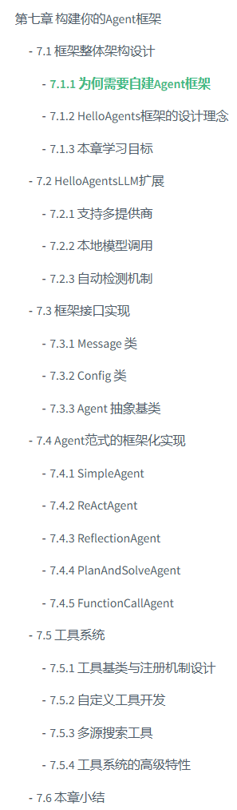

看了很多开源项目，基于litellm等框架提供的模型服务，搭建自己的Agent框架，代码架构很清晰，对未来面试也很有帮助。

但是苦于如果只是搭建一些ReAct、Tools、Memory等Demo代码，很容易，但是不成体系。

> 参考：[HelloAgents 第七章 - 构建你的Agent框架](https://datawhalechina.github.io/hello-agents/#/./chapter7/%E7%AC%AC%E4%B8%83%E7%AB%A0%20%E6%9E%84%E5%BB%BA%E4%BD%A0%E7%9A%84Agent%E6%A1%86%E6%9E%B6)

