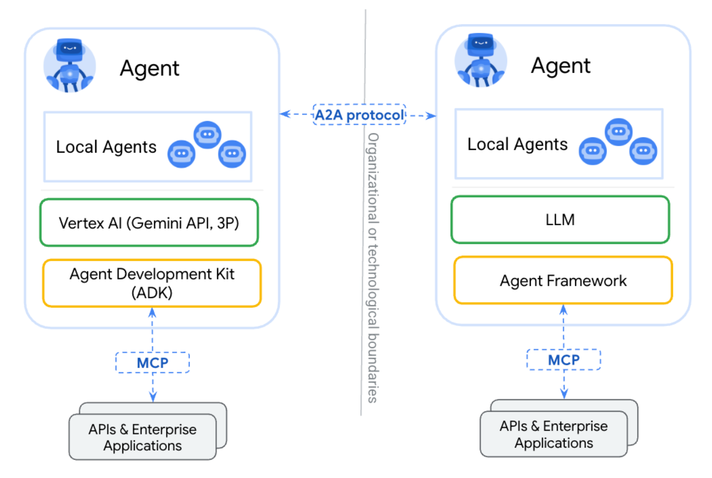
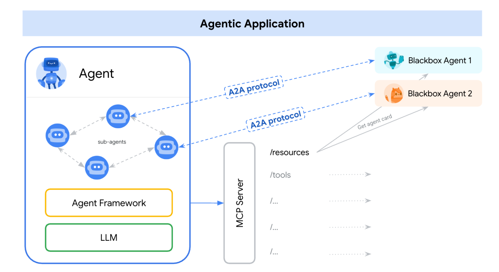
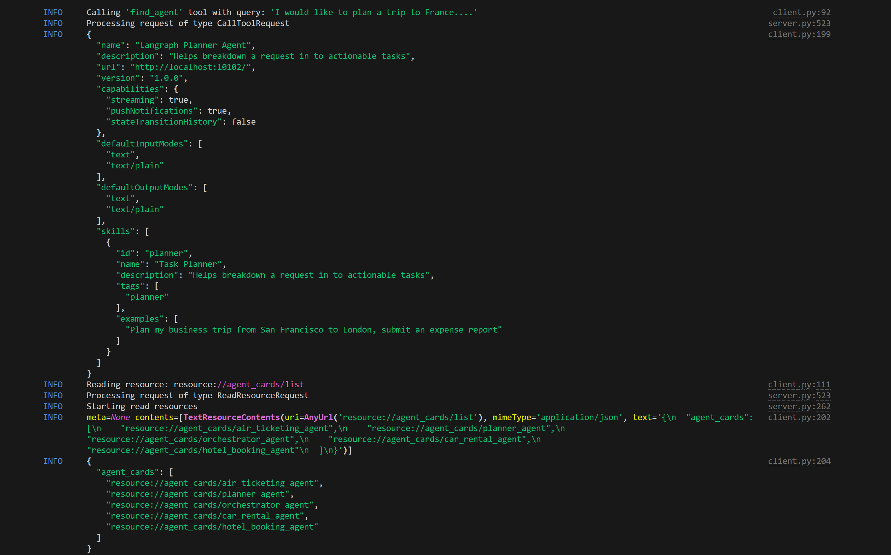

官方教程：

- A2A Project：https://github.com/a2aproject/A2A
- A2A Python SDK：https://github.com/a2aproject/a2a-python
- A2A Samples：https://github.com/a2aproject/a2a-samples
- 官方教程：https://a2a-protocol.org/latest/topics/what-is-a2a/

大佬博客：

- [A2A协议 - 系列](https://www.cnblogs.com/sing1ee/p/19002113/2025-full-guide-a2a-protocol)

TODO：

- [【手搓代码】40分钟速通智能体A2A协议全栈开发，含客户端+服务端流式实现方案](https://www.bilibili.com/video/BV1dXboz5Ekz)


重要的结构图：






# Demo实现

案例代码都在`a2a-samples/samples/python/agents/langgraph`目录下执行：

1）手动撰写一个示例Tool服务：`tools_service.py`

```python
from fastapi import FastAPI
from pydantic import BaseModel

app = FastAPI(title="Tools Service")

# —— Weather Tool —— #
class WeatherReq(BaseModel):
    city: str
    unit: str = "c"  # "c" | "f"

@app.post("/weather")
def get_weather(body: WeatherReq):
    """Mocked weather API"""
    temp_map = {
        "beijing": 30,
        "shanghai": 31,
        "tokyo": 29,
        "new york": 84,
    }
    k = body.city.lower().strip()
    celsius = temp_map.get(k, 25)

    if body.unit == "f":
        value = round(celsius * 9/5 + 32, 1)
        unit = "F"
    else:
        value = celsius
        unit = "°C"

    return {
        "city": body.city,
        "temp": value,
        "unit": unit,
        "source": "mock-tools-service"
    }

# —— 你可以继续加更多工具 —— #
# 例如 /stock, /search, /db_query 等

```

启动服务：

```python
uvicorn tools_service:app --reload --port 9010
```


2）撰写配置文件`.env`

```python
model_source = "openai"
TOOL_LLM_NAME = "openai/gpt-4o-mini"
API_KEY = "sk-or-v1-***"
TOOL_LLM_URL = "TOOL_LLM_URL=http://tools-service:9010"
```


由于使用的是OpenRouter的服务，需要修改`agent.py`：添加`base_url`参数

```python
self.model = ChatOpenAI(
    model=os.getenv('TOOL_LLM_NAME'),
    openai_api_key=os.getenv('API_KEY', 'EMPTY'),
    base_url="https://openrouter.ai/api/v1",
    openai_api_base=os.getenv('TOOL_LLM_URL'),
    temperature=0,
)
```

虽然官方说支持ollama等服务，但是看源码，并没有写对应的代码，还是需要手动改编一下


3）启动app

```python
uv run app
```

访问http://localhost:10000/.well-known/agent.json，可以看到Agent Card信息，比如：

```json
{
  "capabilities": {
    "pushNotifications": true,
    "streaming": true
  },
  "defaultInputModes": [
    "text",
    "text/plain"
  ],
  "defaultOutputModes": [
    "text",
    "text/plain"
  ],
  "description": "Helps with exchange rates for currencies",
  "name": "Currency Agent",
  "preferredTransport": "JSONRPC",
  "protocolVersion": "0.3.0",
  "skills": [
    {
      "description": "Helps with exchange values between various currencies",
      "examples": [
        "What is exchange rate between USD and GBP?"
      ],
      "id": "convert_currency",
      "name": "Currency Exchange Rates Tool",
      "tags": [
        "currency conversion",
        "currency exchange"
      ]
    }
  ],
  "url": "http://localhost:10000/",
  "version": "1.0.0"
}
```

**包含信息：**

- 智能体身份（名称、描述）
- 服务端点URL和版本
- 支持的A2A能力（流式传输、推送通知）
- 具体技能列表
- 认证要求


4）启动client

由于app初始化需要运行一段时间，client脚本可以多次运行直至成功

```python
uv run app/test_client.py
```

示例结果：

```bash
$ uv run app/test_client.py
INFO:__main__:Attempting to fetch public agent card from: http://localhost:10000/.well-known/agent-card.json
INFO:httpx:HTTP Request: GET http://localhost:10000/.well-known/agent-card.json "HTTP/1.1 200 OK"
INFO:a2a.client.card_resolver:Successfully fetched agent card data from http://localhost:10000/.well-known/agent-card.json: {'capabilities': {'pushNotifications': True, 'streaming': True}, 'defaultInputModes': ['text', 'text/plain'], 'defaultOutputModes': ['text', 'text/plain'], 'description': 'Helps with exchange rates for currencies', 'name': 'Currency Agent', 'preferredTransport': 'JSONRPC', 'protocolVersion': '0.3.0', 'skills': [{'description': 'Helps with exchange values between various currencies', 'examples': ['What is exchange rate between USD and GBP?'], 'id': 'convert_currency', 'name': 'Currency Exchange Rates Tool', 'tags': ['currency conversion', 'currency exchange']}], 'url': 'http://localhost:10000/', 'version': '1.0.0'}
INFO:__main__:Successfully fetched public agent card:
INFO:__main__:{
  "capabilities": {
    "pushNotifications": true,
    "streaming": true
  },
  "defaultInputModes": [
    "text",
    "text/plain"
  ],
  "defaultOutputModes": [
    "text",
    "text/plain"
  ],
  "description": "Helps with exchange rates for currencies",
  "name": "Currency Agent",
  "preferredTransport": "JSONRPC",
  "protocolVersion": "0.3.0",
  "skills": [
    {
      "description": "Helps with exchange values between various currencies",
      "examples": [
        "What is exchange rate between USD and GBP?"
      ],
      "id": "convert_currency",
      "name": "Currency Exchange Rates Tool",
      "tags": [
        "currency conversion",
        "currency exchange"
      ]
    }
  ],
  "url": "http://localhost:10000/",
  "version": "1.0.0"
}
INFO:__main__:
Using PUBLIC agent card for client initialization (default).
INFO:__main__:
Public card does not indicate support for an extended card. Using public card.
/home/user/WorkSpace/Learn/LLM/Others/a2a_demo/a2a-samples/samples/python/agents/langgraph/app/test_client.py:109: DeprecationWarning: A2AClient is deprecated and will be removed in a future version. Use ClientFactory to create a client with a JSON-RPC transport.
  client = A2AClient(
INFO:__main__:A2AClient initialized.
INFO:httpx:HTTP Request: POST http://localhost:10000/ "HTTP/1.1 200 OK"
{'id': 'bfcb7c06-f672-4f54-86a3-380fdacf1fcf', 'jsonrpc': '2.0', 'result': {'artifacts': [{'artifactId': '76b54d98-2458-46d1-b9d0-9ce97b28126b', 'name': 'conversion_result', 'parts': [{'kind': 'text', 'text': '10 USD is approximately 870.60 INR based on the current exchange rate of 1 USD = 87.06 INR.'}]}], 'contextId': '23c57bc0-5216-4ab2-8392-0e86d9b71872', 'history': [{'contextId': '23c57bc0-5216-4ab2-8392-0e86d9b71872', 'kind': 'message', 'messageId': '945108718d9d4818b1e1e8d3dfa3743c', 'parts': [{'kind': 'text', 'text': 'how much is 10 USD in INR?'}], 'role': 'user', 'taskId': '5a5efb93-cf7c-4fdb-9f59-cd16048296fc'}, {'contextId': '23c57bc0-5216-4ab2-8392-0e86d9b71872', 'kind': 'message', 'messageId': '5c142041-c409-4506-be65-4f663f91c7b0', 'parts': [{'kind': 'text', 'text': 'Looking up the exchange rates...'}], 'role': 'agent', 'taskId': '5a5efb93-cf7c-4fdb-9f59-cd16048296fc'}, {'contextId': '23c57bc0-5216-4ab2-8392-0e86d9b71872', 'kind': 'message', 'messageId': 'c785aac8-a8f6-4147-b117-0a2cd0b04dc2', 'parts': [{'kind': 'text', 'text': 'Processing the exchange rates..'}], 'role': 'agent', 'taskId': '5a5efb93-cf7c-4fdb-9f59-cd16048296fc'}], 'id': '5a5efb93-cf7c-4fdb-9f59-cd16048296fc', 'kind': 'task', 'status': {'state': 'completed', 'timestamp': '2025-08-21T03:18:52.253960+00:00'}}}
INFO:httpx:HTTP Request: POST http://localhost:10000/ "HTTP/1.1 200 OK"
{'id': '0ce61d03-0633-4907-8dfb-ceb886476abf', 'jsonrpc': '2.0', 'result': {'artifacts': [{'artifactId': 'a1a43418-ef19-4887-aa55-b5d76903afd2', 'name': 'conversion_result', 'parts': [{'kind': 'text', 'text': 'The exchange rate for 1 USD is approximately 0.8583 EUR.'}]}], 'contextId': '0e7b73d5-f984-4256-9273-20b3b41f9a6e', 'history': [{'contextId': '0e7b73d5-f984-4256-9273-20b3b41f9a6e', 'kind': 'message', 'messageId': 'ed55f94e4e3c4d1a850052ba7c16117c', 'parts': [{'kind': 'text', 'text': 'How much is the exchange rate for 1 USD?'}], 'role': 'user', 'taskId': '04f2b934-3637-46de-94bb-f85ade094f66'}, {'contextId': '0e7b73d5-f984-4256-9273-20b3b41f9a6e', 'kind': 'message', 'messageId': 'a688b5ab-4735-40bb-8ff7-81e0d850012b', 'parts': [{'kind': 'text', 'text': 'Looking up the exchange rates...'}], 'role': 'agent', 'taskId': '04f2b934-3637-46de-94bb-f85ade094f66'}, {'contextId': '0e7b73d5-f984-4256-9273-20b3b41f9a6e', 'kind': 'message', 'messageId': 'cfa128e2-b25f-41d3-ad20-3822f897f6b0', 'parts': [{'kind': 'text', 'text': 'Processing the exchange rates..'}], 'role': 'agent', 'taskId': '04f2b934-3637-46de-94bb-f85ade094f66'}], 'id': '04f2b934-3637-46de-94bb-f85ade094f66', 'kind': 'task', 'status': {'state': 'completed', 'timestamp': '2025-08-21T03:18:55.506834+00:00'}}}
INFO:httpx:HTTP Request: POST http://localhost:10000/ "HTTP/1.1 200 OK"
{'error': {'code': -32602, 'message': 'Task 04f2b934-3637-46de-94bb-f85ade094f66 is in terminal state: TaskState.completed'}, 'jsonrpc': '2.0'}
INFO:httpx:HTTP Request: POST http://localhost:10000/ "HTTP/1.1 200 OK"
{'id': 'f9d0084b-92de-4667-9e8e-67e230d79216', 'jsonrpc': '2.0', 'result': {'contextId': 'efc0c332-841a-4df2-add2-a9c19ef00265', 'history': [{'contextId': 'efc0c332-841a-4df2-add2-a9c19ef00265', 'kind': 'message', 'messageId': '945108718d9d4818b1e1e8d3dfa3743c', 'parts': [{'kind': 'text', 'text': 'how much is 10 USD in INR?'}], 'role': 'user', 'taskId': '5b6508a8-f918-497f-bd26-ddbad55aada8'}], 'id': '5b6508a8-f918-497f-bd26-ddbad55aada8', 'kind': 'task', 'status': {'state': 'submitted'}}}
{'id': 'f9d0084b-92de-4667-9e8e-67e230d79216', 'jsonrpc': '2.0', 'result': {'contextId': 'efc0c332-841a-4df2-add2-a9c19ef00265', 'final': False, 'kind': 'status-update', 'status': {'message': {'contextId': 'efc0c332-841a-4df2-add2-a9c19ef00265', 'kind': 'message', 'messageId': 'a7ffb07e-cb95-4dec-9844-4a720f81c14e', 'parts': [{'kind': 'text', 'text': 'Looking up the exchange rates...'}], 'role': 'agent', 'taskId': '5b6508a8-f918-497f-bd26-ddbad55aada8'}, 'state': 'working', 'timestamp': '2025-08-21T03:18:56.610825+00:00'}, 'taskId': '5b6508a8-f918-497f-bd26-ddbad55aada8'}}
{'id': 'f9d0084b-92de-4667-9e8e-67e230d79216', 'jsonrpc': '2.0', 'result': {'contextId': 'efc0c332-841a-4df2-add2-a9c19ef00265', 'final': False, 'kind': 'status-update', 'status': {'message': {'contextId': 'efc0c332-841a-4df2-add2-a9c19ef00265', 'kind': 'message', 'messageId': 'ab826314-998e-4b95-a851-01d5aae1de90', 'parts': [{'kind': 'text', 'text': 'Processing the exchange rates..'}], 'role': 'agent', 'taskId': '5b6508a8-f918-497f-bd26-ddbad55aada8'}, 'state': 'working', 'timestamp': '2025-08-21T03:18:56.889952+00:00'}, 'taskId': '5b6508a8-f918-497f-bd26-ddbad55aada8'}}
{'id': 'f9d0084b-92de-4667-9e8e-67e230d79216', 'jsonrpc': '2.0', 'result': {'artifact': {'artifactId': 'fdb64f35-baf7-4a42-9ce6-e752314e851f', 'name': 'conversion_result', 'parts': [{'kind': 'text', 'text': '10 USD is approximately 870.60 INR at the current exchange rate.'}]}, 'contextId': 'efc0c332-841a-4df2-add2-a9c19ef00265', 'kind': 'artifact-update', 'taskId': '5b6508a8-f918-497f-bd26-ddbad55aada8'}}
{'id': 'f9d0084b-92de-4667-9e8e-67e230d79216', 'jsonrpc': '2.0', 'result': {'contextId': 'efc0c332-841a-4df2-add2-a9c19ef00265', 'final': True, 'kind': 'status-update', 'status': {'state': 'completed', 'timestamp': '2025-08-21T03:18:59.068688+00:00'}, 'taskId': '5b6508a8-f918-497f-bd26-ddbad55aada8'}}
```


# 完整案例

希望做一个 `A2A + MCP` 的多代理协作案例，当前的主要关注点：

- 不同Agent之间的拓扑结构
- 不同Agent之间的上下文工程
- 不同厂商如何集成MCP工具，不同厂商消息结构不同，那么不同Agent集成后调用MCP工具的相关信息又如何同步至MAS系统中呢


申请Gemini API Key：https://aistudio.google.com/apikey

测试：

```python
curl "https://generativelanguage.googleapis.com/v1beta/models/gemini-2.0-flash:generateContent" -H 'Content-Type: application/json' -H 'X-goog-api-key: ********' -X POST -d '{"contents":[{"parts":[{"text":"Explain how AI works in a few words"}]}]}'
```

在.env中写入

```python
GOOGLE_API_KEY='***'
```

或者：

```python
export GOOGLE_API_KEY="your_api_key_here"
```


首先尝试：samples/python/agents/a2a_mcp

基于google adk + langgraph + mcp的案例，按[教程](https://github.com/a2aproject/a2a-samples/tree/main/samples/python/agents/a2a_mcp)一步步执行即可：

在根目录下，一键执行：

```bash
bash samples/python/agents/a2a_mcp/run.sh
```

或者将`run.sh`中的uv命令行分终端一步步执行，一个效果。


Q：`error: No environment file found at: .env`

A：这个报错其实不是来自你自己的 **a2a-mcp** 源码，而是来自你调用的 **`uv`** 这个工具本身，需要在项目根目录创建一个 `.env` 文件


Q：`Failed to download a2a-sdk==0.3.0`

A：官方 PyPI 页面显示，**a2a-sdk 0.3.0** 于 2025-07-31 发布，但目前状态是“yanked”（撤回）。相比之下，版本 **0.3.2**（发布于 2025-08-20）可正常下载和安装。所以：

```
uv add a2a-sdk==0.3.2
```

重新执行run.sh，报错解决。


案例运行成功，案例执行的是find_agent，并且正确召回了agent



流程大概是这样的：

1. **Client 启动成功**

   ```python
   Starting Client to connect to MCP
   ```

   说明 client.py 已经跑起来，并且连上了 MCP server。

2. **加载 agent cards 成功**

   ```python
   Finished loading agent cards. Found 5 cards.
   Generating Embeddings for agent cards
   ```

   说明服务端已经读取了 5 个 agent 配置，并且做了 embedding。

3. **工具调用**

   ```python
   Calling 'find_agent' tool with query: 'I would like to plan a trip to France....'
   Processing request of type CallToolRequest
   ```

   说明 client 触发了一个 `find_agent` 工具调用，请求由 server 收到了。

4. **返回了一个 agent card JSON**

   ```json
   {
     "name": "Langraph Planner Agent",
     "description": "Helps breakdown a request in to actionable tasks",
     "url": "http://localhost:10102/",
     "version": "1.0.0",
     ...
   }
   ```

   这其实已经是 `find_agent` 的响应结果了：它告诉你匹配到的 agent 是 **Langraph Planner Agent**，并给出了相关元数据。

5. **读取资源 `resource://agent_cards/list` 成功**

   ```python
   "agent_cards": [
     "resource://agent_cards/air_ticketing_agent",
     "resource://agent_cards/planner_agent",
     ...
   ]
   ```

   说明 server 把资源清单返回给 client 了。


不过log中存在一些报错

```python
error: Failed to install: greenlet-3.2.3-cp313-cp313-manylinux_2_24_x86_64.manylinux_2_28_x86_64.whl (greenlet==3.2.3)
error: Failed to install: jsonpatch-1.33-py2.py3-none-any.whl (jsonpatch==1.33)
```

解决方法：重新安装一下试试

```python
uv pip install jsonpatch==1.33 greenlet==3.2.3
```


验证了agent正常启动，并且agent_cards基于find_agent工具测试正常加载了，那么如何使用这个multi-agent system？

去具体的agent下执行对话，比如 `Langraph Planner Agent`，地址 http://localhost:10102/ 去继续对话或执行任务，访问后

- 前端返回：`Method Not Allowed`
- 后端返回：`INFO:     127.0.0.1:37216 - "GET / HTTP/1.1" 405 Method Not Allowed`


但实际上没有前端界面，那就终端写一份吧

```python
from a2a_mcp.agents.langgraph_planner_agent import LangGraphPlannerAgent

# 实例化 Agent
agent = LangGraphPlannerAgent()

# 假设你有一个 sessionId（可用任意字符串模拟）
session_id = "test-session-001"

# 用户输入
user_query = "帮我制定一个去北京三日游的计划"

# 调用同步接口（返回一次性结果）
result = agent.invoke(user_query, session_id)
print(result)
```

示例结果：

```python
{'response_type': 'text', 'is_task_complete': False, 'require_user_input': True, 'content': '您从哪里出发？'}
```


将其该为多轮：

```python
from a2a_mcp.agents.langgraph_planner_agent import LangGraphPlannerAgent

def main():
    agent = LangGraphPlannerAgent()
    session_id = "demo-session-01"
    print("欢迎使用LangGraph多轮对话Demo。")
    query = input("请输入您的需求：")
    while True:
        response = agent.invoke(query, session_id)
        print(f"Agent: {response['content']}")
        if response.get("is_task_complete"):
            print("任务完成！")
            break
        if response.get("require_user_input"):
            query = input("请输入补充信息：")
        else:
            break

if __name__ == "__main__":
    main()
```

示例结果：

```python
欢迎使用LangGraph多轮对话Demo。
请输入您的需求：帮我制定一个去北京三日游的计划
Agent: 您从哪里出发？
请输入补充信息：清华大学
Agent: 您的旅行的开始和结束日期是什么时候？
请输入补充信息：10.1开始，10.3结束
Agent: 您本次旅行的预算是多少？
请输入补充信息：1w人民币
Agent: 您本次旅行是商务旅行还是休闲旅行？
请输入补充信息：休闲
Agent: 总共有多少人出行？
请输入补充信息：2人
Agent: 您希望预定什么舱位的机票？经济舱、商务舱还是头等舱？
请输入补充信息：经济舱
Agent: 您希望入住哪种类型的住宿？酒店、民宿还是私人住宅？
请输入补充信息：民宿
Agent: 您希望预定什么类型的房间？套房、标准间、单人间还是双人间？
请输入补充信息：双人间，剩下的其他问题，请你给出默认选择即可，并且给我最终的计划
Agent: 您是否需要租车？
请输入补充信息：不需要
Agent: {'original_query': '帮我制定一个去北京三日游的计划', 'trip_info': {'total_budget': '10000', 'origin': '清华大学', 'destination': '北京', 'type': 'leisure', 'start_date': '2024-10-01', 'end_date': '2024-10-03', 'travel_class': 'economy', 'accommodation_type': '民宿', 'room_type': '双人间', 'is_car_rental_required': 'No', 'type_of_car': 'None', 'no_of_travellers': '2', 'checkin_date': '2024-10-01', 'checkout_date': '2024-10-03', 'car_rental_start_date': '2024-10-01', 'car_rental_end_date': '2024-10-03'}, 'tasks': [{'id': 1, 'description': '预订从清华大学到北京的经济舱往返机票，日期为2024年10月1日至2024年10月3日。', 'status': 'pending'}, {'id': 2, 'description': '预订北京的民宿双人间，入住日期为2024年10月1日，退房日期为2024年10月3日', 'status': 'pending'}]}
任务完成！
```

优化日志：

```python
import logging
import sys
from a2a_mcp.agents.langgraph_planner_agent import LangGraphPlannerAgent

def setup_logger():
    logger = logging.getLogger("LangGraphDemo")
    logger.setLevel(logging.DEBUG)
    handler = logging.StreamHandler(sys.stdout)
    formatter = logging.Formatter(
        "[%(asctime)s][%(levelname)s] %(message)s", datefmt="%Y-%m-%d %H:%M:%S"
    )
    handler.setFormatter(formatter)
    if logger.hasHandlers():
        logger.handlers.clear()
    logger.addHandler(handler)
    return logger

def main():
    logger = setup_logger()
    logger.info("Initializing LangGraphPlannerAgent ...")
    agent = LangGraphPlannerAgent()
    session_id = "demo-session-verbose-01"
    logger.info(f"Session ID: {session_id}")

    print("欢迎使用LangGraph多轮对话Demo（带详细日志）。")
    query = input("请输入您的需求：")
    round_num = 1
    while True:
        logger.debug(f"Round {round_num}: User Input: {query}")
        response = agent.invoke(query, session_id)
        logger.debug(f"Round {round_num}: Raw Agent Response: {response}")

        # 日志详细打印各字段
        logger.info(
            f"Round {round_num}: "
            f"Response Type: {response.get('response_type')}, "
            f"Is Task Complete: {response.get('is_task_complete')}, "
            f"Require User Input: {response.get('require_user_input')}"
        )
        print(f"Agent: {response['content']}")

        if response.get("is_task_complete"):
            logger.info(f"Round {round_num}: 任务完成，内容如下：\n{response['content']}")
            print("任务完成！")
            break
        if response.get("require_user_input"):
            query = input("请输入补充信息：")
        else:
            logger.warning(f"Round {round_num}: Agent neither completed nor requires input. 退出。")
            break
        round_num += 1

    logger.info("对话结束。")

if __name__ == "__main__":
    main()
```

