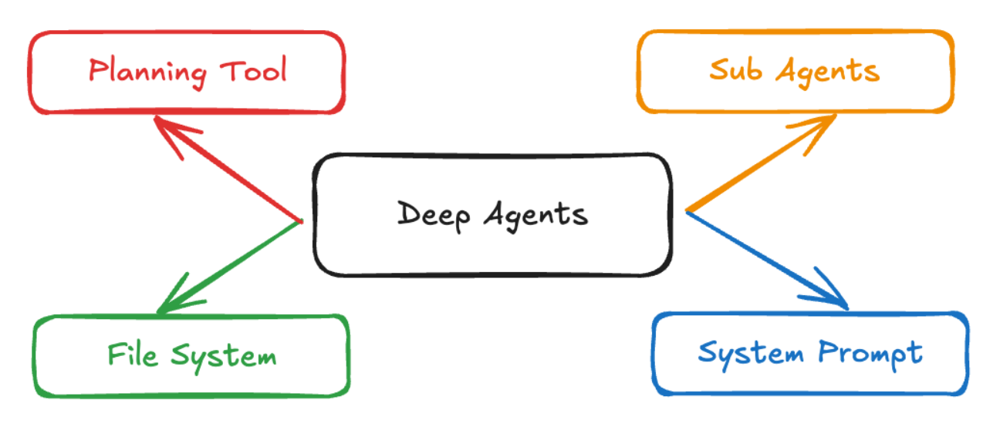
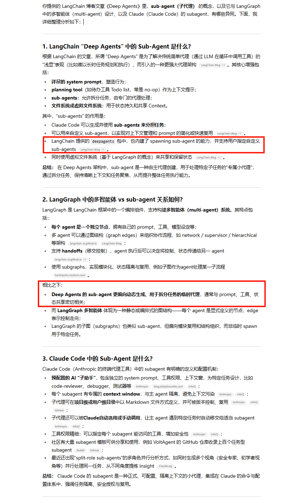
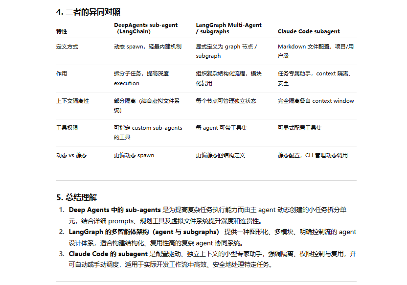
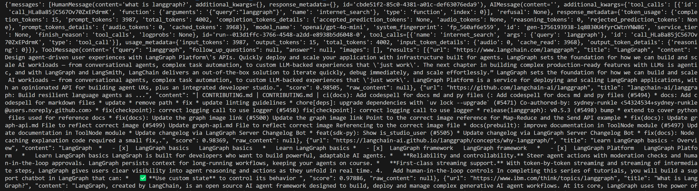
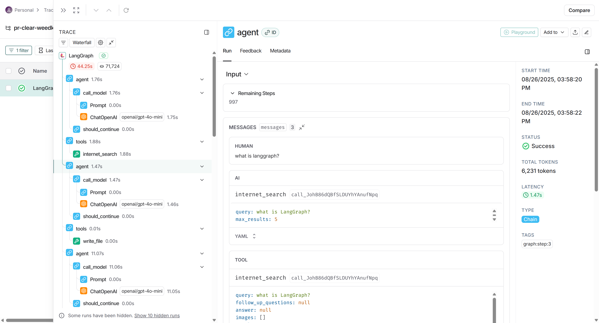
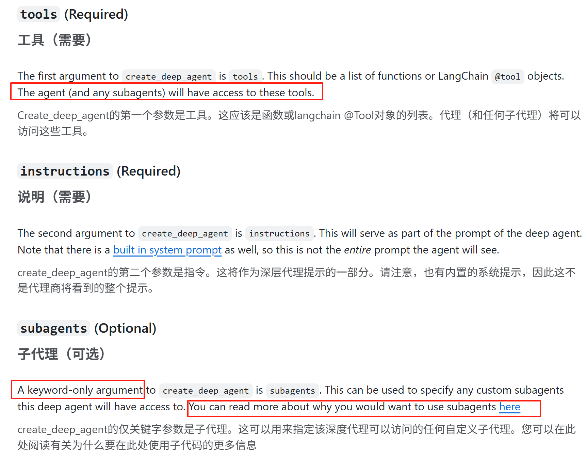
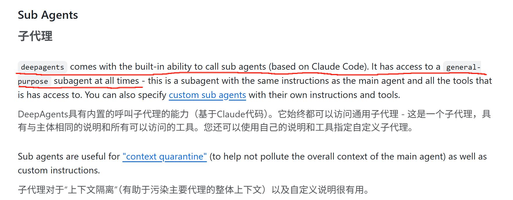
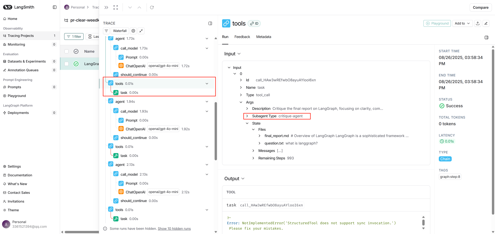
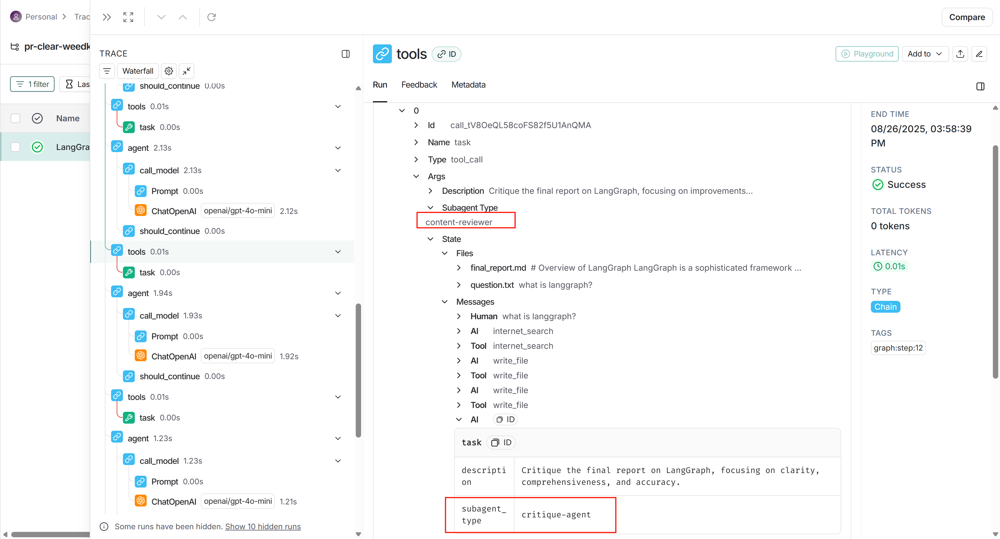

## 简介

LangChain官方推出的subagent：

- 官方博客：https://blog.langchain.com/deep-agents/
- Github：https://github.com/langchain-ai/deepagents






## 案例开发

初始化环境：

```bash
# 安装uv
curl -LsSf https://astral.sh/uv/install.sh | sh
uv --version

# 初始化环境
uv init deepagents_demo
cd deepagents_demo

# 配置python环境
# uv init --python 3.12
uv add deepagents
uv pip list

uv add tavily-python
uv add python-dotenv
uv add langchain_openai
```

去[tavily官网](https://app.tavily.com/home)申请key


示例`.env`：

```bash
TAVILY_API_KEY=******
OPENROUTER_API_KEY=******

LANGSMITH_TRACING="true"
LANGSMITH_ENDPOINT="https://api.smith.langchain.com"
LANGSMITH_API_KEY="******"
LANGSMITH_PROJECT="******"
```


### 单Agent案例

```python
import os
from typing import Literal

from tavily import TavilyClient
from deepagents import create_deep_agent
from dotenv import load_dotenv
from langchain_openai import ChatOpenAI

# 加载 .env 文件
load_dotenv()

tavily_client = TavilyClient(api_key=os.environ["TAVILY_API_KEY"])

# Search tool to use to do research
def internet_search(
    query: str,
    max_results: int = 5,
    topic: Literal["general", "news", "finance"] = "general",
    include_raw_content: bool = False,
):
    """Run a web search"""
    return tavily_client.search(
        query,
        max_results=max_results,
        include_raw_content=include_raw_content,
        topic=topic,
    )


# Prompt prefix to steer the agent to be an expert researcher
research_instructions = """You are an expert researcher. Your job is to conduct thorough research, and then write a polished report.

You have access to a few tools.

## `internet_search`

Use this to run an internet search for a given query. You can specify the number of results, the topic, and whether raw content should be included.
"""

# Create the agent
llm = ChatOpenAI(
    model="openai/gpt-4o-mini",
    base_url="https://openrouter.ai/api/v1",
    api_key=os.environ["OPENROUTER_API_KEY"],
)

agent = create_deep_agent(
    tools = [internet_search],
    instructions = research_instructions,
    model=llm
)

# Invoke the agent
result = agent.invoke({"messages": [{"role": "user", "content": "what is langgraph?"}]})
print(result)

```

示例结果：




### subagent案例

集合subagent搭建的research_agent：

```python
import os
from typing import Literal
from tavily import TavilyClient
from deepagents import create_deep_agent, SubAgent
from dotenv import load_dotenv
from langchain_openai import ChatOpenAI
import json

# 加载 .env 文件
load_dotenv()
 
# It's best practice to initialize the client once and reuse it.
tavily_client = TavilyClient(api_key=os.environ["TAVILY_API_KEY"])

llm = ChatOpenAI(
    model="openai/gpt-4o-mini",
    base_url="https://openrouter.ai/api/v1",
    api_key=os.environ["OPENROUTER_API_KEY"],
)

# Search tool to use to do research
def internet_search(
    query: str,
    max_results: int = 5,
    topic: Literal["general", "news", "finance"] = "general",
    include_raw_content: bool = False,
):
    """Run a web search"""
    search_docs = tavily_client.search(
        query,
        max_results=max_results,
        include_raw_content=include_raw_content,
        topic=topic,
    )
    return search_docs


sub_research_prompt = """You are a dedicated researcher. Your job is to conduct research based on the users questions.

Conduct thorough research and then reply to the user with a detailed answer to their question

only your FINAL answer will be passed on to the user. They will have NO knowledge of anything except your final message, so your final report should be your final message!"""

research_sub_agent = {
    "name": "research-agent",
    "description": "Used to research more in depth questions. Only give this researcher one topic at a time. Do not pass multiple sub questions to this researcher. Instead, you should break down a large topic into the necessary components, and then call multiple research agents in parallel, one for each sub question.",
    "prompt": sub_research_prompt,
    "tools": ["internet_search"],
}

sub_critique_prompt = """You are a dedicated editor. You are being tasked to critique a report.

You can find the report at `final_report.md`.

You can find the question/topic for this report at `question.txt`.

The user may ask for specific areas to critique the report in. Respond to the user with a detailed critique of the report. Things that could be improved.

You can use the search tool to search for information, if that will help you critique the report

Do not write to the `final_report.md` yourself.

Things to check:
- Check that each section is appropriately named
- Check that the report is written as you would find in an essay or a textbook - it should be text heavy, do not let it just be a list of bullet points!
- Check that the report is comprehensive. If any paragraphs or sections are short, or missing important details, point it out.
- Check that the article covers key areas of the industry, ensures overall understanding, and does not omit important parts.
- Check that the article deeply analyzes causes, impacts, and trends, providing valuable insights
- Check that the article closely follows the research topic and directly answers questions
- Check that the article has a clear structure, fluent language, and is easy to understand.
"""

critique_sub_agent = {
    "name": "critique-agent",
    "description": "Used to critique the final report. Give this agent some information about how you want it to critique the report.",
    "prompt": sub_critique_prompt,
}


# Prompt prefix to steer the agent to be an expert researcher
research_instructions = """You are an expert researcher. Your job is to conduct thorough research, and then write a polished report.

The first thing you should do is to write the original user question to `question.txt` so you have a record of it.

Use the research-agent to conduct deep research. It will respond to your questions/topics with a detailed answer.

When you think you enough information to write a final report, write it to `final_report.md`

You can call the critique-agent to get a critique of the final report. After that (if needed) you can do more research and edit the `final_report.md`
You can do this however many times you want until are you satisfied with the result.

Only edit the file once at a time (if you call this tool in parallel, there may be conflicts).

Here are instructions for writing the final report:

<report_instructions>

CRITICAL: Make sure the answer is written in the same language as the human messages! If you make a todo plan - you should note in the plan what language the report should be in so you dont forget!
Note: the language the report should be in is the language the QUESTION is in, not the language/country that the question is ABOUT.

Please create a detailed answer to the overall research brief that:
1. Is well-organized with proper headings (# for title, ## for sections, ### for subsections)
2. Includes specific facts and insights from the research
3. References relevant sources using [Title](URL) format
4. Provides a balanced, thorough analysis. Be as comprehensive as possible, and include all information that is relevant to the overall research question. People are using you for deep research and will expect detailed, comprehensive answers.
5. Includes a "Sources" section at the end with all referenced links

You can structure your report in a number of different ways. Here are some examples:

To answer a question that asks you to compare two things, you might structure your report like this:
1/ intro
2/ overview of topic A
3/ overview of topic B
4/ comparison between A and B
5/ conclusion

To answer a question that asks you to return a list of things, you might only need a single section which is the entire list.
1/ list of things or table of things
Or, you could choose to make each item in the list a separate section in the report. When asked for lists, you don't need an introduction or conclusion.
1/ item 1
2/ item 2
3/ item 3

To answer a question that asks you to summarize a topic, give a report, or give an overview, you might structure your report like this:
1/ overview of topic
2/ concept 1
3/ concept 2
4/ concept 3
5/ conclusion

If you think you can answer the question with a single section, you can do that too!
1/ answer

REMEMBER: Section is a VERY fluid and loose concept. You can structure your report however you think is best, including in ways that are not listed above!
Make sure that your sections are cohesive, and make sense for the reader.

For each section of the report, do the following:
- Use simple, clear language
- Use ## for section title (Markdown format) for each section of the report
- Do NOT ever refer to yourself as the writer of the report. This should be a professional report without any self-referential language. 
- Do not say what you are doing in the report. Just write the report without any commentary from yourself.
- Each section should be as long as necessary to deeply answer the question with the information you have gathered. It is expected that sections will be fairly long and verbose. You are writing a deep research report, and users will expect a thorough answer.
- Use bullet points to list out information when appropriate, but by default, write in paragraph form.

REMEMBER:
The brief and research may be in English, but you need to translate this information to the right language when writing the final answer.
Make sure the final answer report is in the SAME language as the human messages in the message history.

Format the report in clear markdown with proper structure and include source references where appropriate.

<Citation Rules>
- Assign each unique URL a single citation number in your text
- End with ### Sources that lists each source with corresponding numbers
- IMPORTANT: Number sources sequentially without gaps (1,2,3,4...) in the final list regardless of which sources you choose
- Each source should be a separate line item in a list, so that in markdown it is rendered as a list.
- Example format:
  [1] Source Title: URL
  [2] Source Title: URL
- Citations are extremely important. Make sure to include these, and pay a lot of attention to getting these right. Users will often use these citations to look into more information.
</Citation Rules>
</report_instructions>

You have access to a few tools.

## `internet_search`

Use this to run an internet search for a given query. You can specify the number of results, the topic, and whether raw content should be included.
"""

# Create the agent
agent = create_deep_agent(
    tools=[internet_search],
    instructions=research_instructions,
    model=llm,
    subagents=[critique_sub_agent, research_sub_agent],
).with_config({"recursion_limit": 1000})

result = agent.invoke({"messages": [{"role": "user", "content": "what is langgraph?"}]})
# print(json.dumps(result, indent=2, ensure_ascii=False))
print(result)

```

示例结果：结合LangSmith会好观察一点项目结构




结合官方文档：





Deep Agent内置了System Prompt、Planning Tool、File System Tools、Sub Agents。


关于其subagents的调用，Prompt中包含：

```python
Use the research-agent to conduct deep research. It will respond to your questions/topics with a detailed answer.

You can call the critique-agent to get a critique of the final report. 
```


通过学习`create_deep_agent`函数源码可知：

关于工具，确实内部已经封装好了[write_todos, write_file, read_file, ls, edit_file]工具，甚至subagent在经过`_create_task_tool`函数（也是把subagent进行了create_react_agent）处理后，也被列在了工具之中。


针对subagent，具体来说，在`_create_task_tool`中：

- 首先经过一些数据处理（包含create_react_agent）变成了agents变量，大概如下：

  ```python
  {
    "general-purpose": <Agent 对象>,
    "subagentA": <Agent 对象>,
    "subagentB": <Agent 对象>,
    ...
  }
  
  ```

- 之后有个task函数，这里的 `task` 本质上是一个 **工具函数**，被 `@tool(...)` 装饰器包装，注册为一个可供 LLM 调用的工具。task**不会自己跑起来**，它的触发条件是：上层 orchestrator 或 LLM 调用这个工具。

总结一下：

- **`agents`**：一个字典，存放不同的子智能体（子代理）。
- **`task`**：一个工具函数，统一入口，接收任务 → 根据 `subagent_type` 选择对应的智能体 → 让它执行 → 返回结果。




不过大部分tools下的SubagentType类型为content-reviewer，通过观察Messages列表快速宏观查看每一步做了什么。




